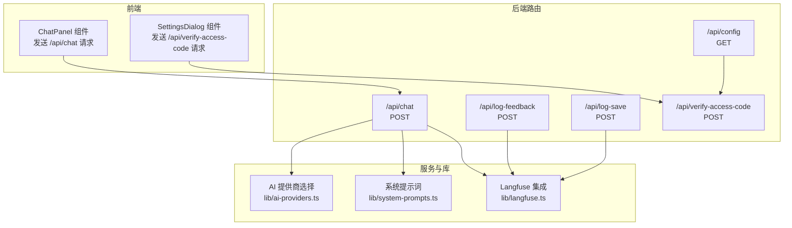
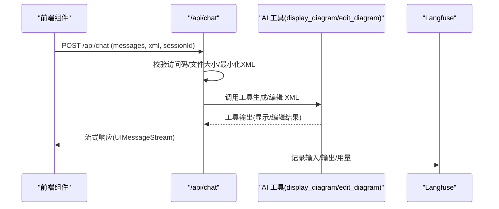
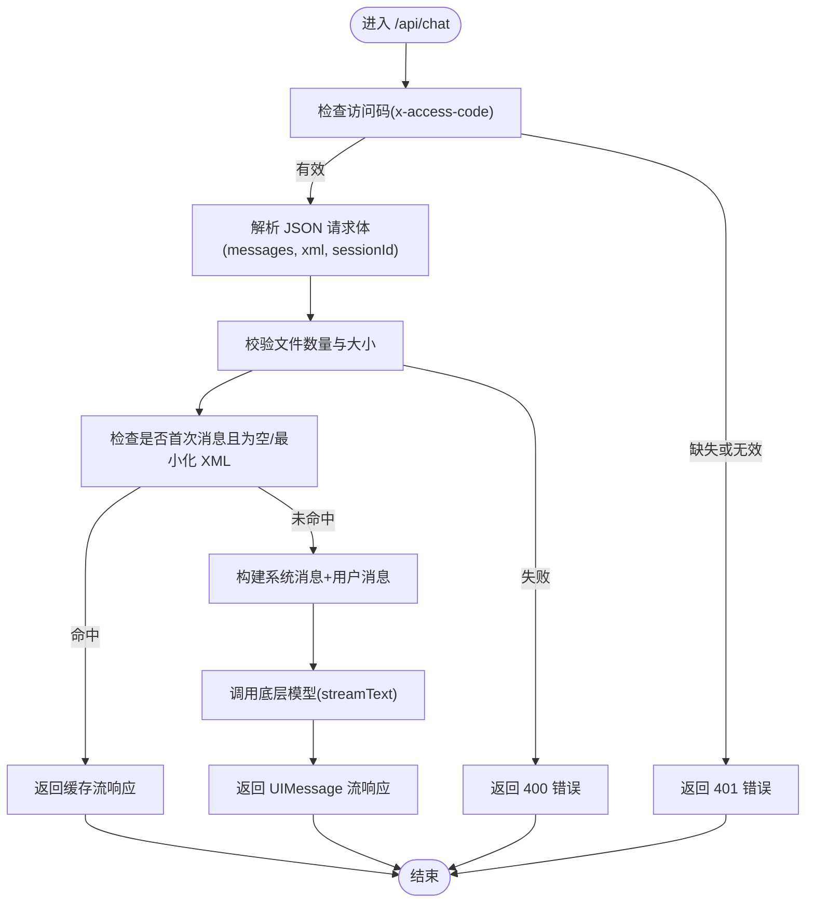
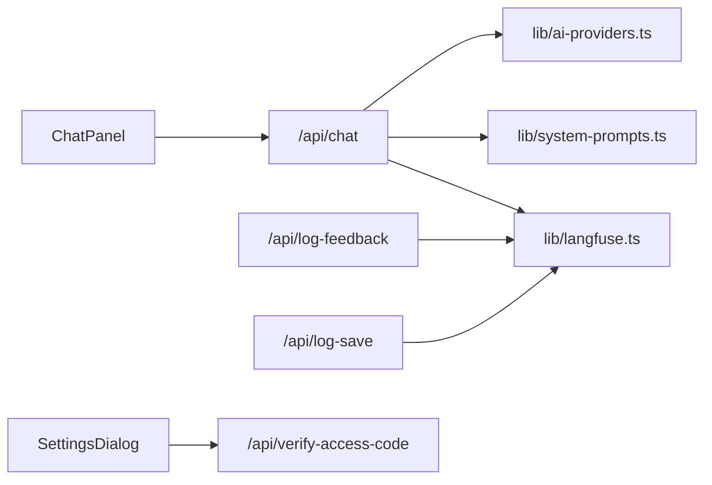

# API参考

<cite>
**本文引用的文件**
- [app/api/chat/route.ts](file://app/api/chat/route.ts)
- [app/api/config/route.ts](file://app/api/config/route.ts)
- [app/api/log-feedback/route.ts](file://app/api/log-feedback/route.ts)
- [app/api/log-save/route.ts](file://app/api/log-save/route.ts)
- [app/api/verify-access-code/route.ts](file://app/api/verify-access-code/route.ts)
- [components/chat-panel.tsx](file://components/chat-panel.tsx)
- [components/settings-dialog.tsx](file://components/settings-dialog.tsx)
- [lib/ai-providers.ts](file://lib/ai-providers.ts)
- [lib/langfuse.ts](file://lib/langfuse.ts)
- [lib/system-prompts.ts](file://lib/system-prompts.ts)
- [env.example](file://env.example)
</cite>

## 目录
1. [简介](#简介)
2. [项目结构](#项目结构)
3. [核心组件](#核心组件)
4. [架构总览](#架构总览)
5. [详细组件分析](#详细组件分析)
6. [依赖关系分析](#依赖关系分析)
7. [性能与可扩展性](#性能与可扩展性)
8. [故障排查指南](#故障排查指南)
9. [结论](#结论)
10. [附录：API清单与调用示例](#附录api清单与调用示例)

## 简介
本文件为 next-ai-draw-io 的后端 API 参考，覆盖所有公共 REST 端点，包括：
- /api/chat：对话与绘图工具调用的流式接口
- /api/config：返回服务端访问控制配置
- /api/log-feedback：用户反馈评分记录
- /api/log-save：保存行为记录
- /api/verify-access-code：访问码验证

文档同时说明各端点的 HTTP 方法、URL 模式、请求/响应格式、认证方式、流式响应处理细节、错误处理策略、安全考虑以及前端调用示例与最佳实践。

## 项目结构
后端 API 路由位于 app/api 下，按功能分模块组织；前端通过 Next.js App Router 的 fetch 机制与这些路由交互，并通过工具函数与 AI 提供商、可观测性系统集成。

图表来源
- [components/chat-panel.tsx](file://components/chat-panel.tsx#L130-L141)
- [components/settings-dialog.tsx](file://components/settings-dialog.tsx#L56-L84)
- [app/api/chat/route.ts](file://app/api/chat/route.ts#L144-L494)
- [app/api/config/route.ts](file://app/api/config/route.ts#L1-L13)
- [app/api/log-feedback/route.ts](file://app/api/log-feedback/route.ts#L1-L113)
- [app/api/log-save/route.ts](file://app/api/log-save/route.ts#L1-L72)
- [app/api/verify-access-code/route.ts](file://app/api/verify-access-code/route.ts#L1-L33)
- [lib/ai-providers.ts](file://lib/ai-providers.ts#L112-L286)
- [lib/system-prompts.ts](file://lib/system-prompts.ts#L348-L371)
- [lib/langfuse.ts](file://lib/langfuse.ts#L1-L108)

章节来源
- [components/chat-panel.tsx](file://components/chat-panel.tsx#L130-L141)
- [components/settings-dialog.tsx](file://components/settings-dialog.tsx#L56-L84)
- [app/api/chat/route.ts](file://app/api/chat/route.ts#L144-L494)
- [app/api/config/route.ts](file://app/api/config/route.ts#L1-L13)
- [app/api/log-feedback/route.ts](file://app/api/log-feedback/route.ts#L1-L113)
- [app/api/log-save/route.ts](file://app/api/log-save/route.ts#L1-L72)
- [app/api/verify-access-code/route.ts](file://app/api/verify-access-code/route.ts#L1-L33)
- [lib/ai-providers.ts](file://lib/ai-providers.ts#L112-L286)
- [lib/system-prompts.ts](file://lib/system-prompts.ts#L348-L371)
- [lib/langfuse.ts](file://lib/langfuse.ts#L1-L108)

## 核心组件
- /api/chat：接收消息数组与当前绘图 XML，返回流式响应，支持 display_diagram 与 edit_diagram 工具调用。
- /api/config：返回是否需要访问码的布尔值。
- /api/log-feedback：记录用户对某条消息的“好/坏”评分，关联到最近一次会话轨迹。
- /api/log-save：记录用户保存操作，关联到最近一次会话轨迹。
- /api/verify-access-code：校验前端设置的访问码是否有效。

章节来源
- [app/api/chat/route.ts](file://app/api/chat/route.ts#L144-L494)
- [app/api/config/route.ts](file://app/api/config/route.ts#L1-L13)
- [app/api/log-feedback/route.ts](file://app/api/log-feedback/route.ts#L1-L113)
- [app/api/log-save/route.ts](file://app/api/log-save/route.ts#L1-L72)
- [app/api/verify-access-code/route.ts](file://app/api/verify-access-code/route.ts#L1-L33)

## 架构总览
后端路由与前端组件之间的交互流程如下：

图表来源
- [components/chat-panel.tsx](file://components/chat-panel.tsx#L130-L141)
- [app/api/chat/route.ts](file://app/api/chat/route.ts#L144-L494)
- [lib/langfuse.ts](file://lib/langfuse.ts#L29-L76)

## 详细组件分析

### /api/chat 接口
- HTTP 方法：POST
- URL 模式：/api/chat
- 认证方式：可选访问码（请求头 x-access-code）
- 请求体结构（JSON）：
  - messages: 数组，元素包含 parts（文本与文件），用于构建模型消息
  - xml: 当前绘图 XML 字符串（用于系统上下文）
  - sessionId: 字符串，最长 200 字符，用于 Langfuse 追踪
- 响应：流式响应（UIMessageStream），支持工具调用（display_diagram、edit_diagram）
- 关键处理逻辑：
  - 访问码校验（若服务器配置了 ACCESS_CODE_LIST）
  - 文件上传限制（最多 5 张，每张不超过 2MB）
  - 最小化/空 XML 判断与缓存命中
  - 底层模型选择与系统提示词注入
  - Langfuse 输入/输出与用量上报
  - 工具调用修复（Bedrock 兼容性）
- 错误处理：
  - 400：文件数量或大小超限
  - 401：缺少或无效访问码
  - 500：内部错误
- 安全考虑：
  - 严格校验文件数量与大小，避免过大负载
  - 仅在必要时记录输入，避免上传大体积媒体到 Langfuse
  - 会话 ID 与用户 ID 用于追踪但不泄露敏感信息

图表来源
- [app/api/chat/route.ts](file://app/api/chat/route.ts#L144-L213)
- [app/api/chat/route.ts](file://app/api/chat/route.ts#L214-L474)

章节来源
- [app/api/chat/route.ts](file://app/api/chat/route.ts#L144-L494)
- [lib/ai-providers.ts](file://lib/ai-providers.ts#L112-L286)
- [lib/system-prompts.ts](file://lib/system-prompts.ts#L348-L371)
- [lib/langfuse.ts](file://lib/langfuse.ts#L29-L76)

### /api/config 接口
- HTTP 方法：GET
- URL 模式：/api/config
- 认证方式：无
- 响应体（JSON）：
  - accessCodeRequired: 布尔值，表示服务器是否要求访问码
- 用途：前端在加载时查询是否需要展示访问码设置入口

章节来源
- [app/api/config/route.ts](file://app/api/config/route.ts#L1-L13)
- [components/chat-panel.tsx](file://components/chat-panel.tsx#L98-L103)

### /api/log-feedback 接口
- HTTP 方法：POST
- URL 模式：/api/log-feedback
- 认证方式：无
- 请求体（JSON）：
  - messageId: 字符串，最长 200
  - feedback: 枚举 "good"|"bad"
  - sessionId: 可选字符串，最长 200
- 响应体（JSON）：
  - success: 布尔值
  - logged: 布尔值，是否成功关联到 Langfuse 轨迹
  - error: 可选错误信息
- 行为：若存在最近一次聊天轨迹，则附加评分；否则创建独立反馈轨迹
- 错误处理：400 输入校验失败；500 服务端异常

章节来源
- [app/api/log-feedback/route.ts](file://app/api/log-feedback/route.ts#L1-L113)
- [lib/langfuse.ts](file://lib/langfuse.ts#L1-L22)

### /api/log-save 接口
- HTTP 方法：POST
- URL 模式：/api/log-save
- 认证方式：无
- 请求体（JSON）：
  - filename: 字符串，最长 255
  - format: 枚举 "drawio"|"png"|"svg"
  - sessionId: 可选字符串，最长 200
- 响应体（JSON）：
  - success: 布尔值
  - logged: 布尔值，是否成功关联到 Langfuse 轨迹
  - error: 可选错误信息
- 行为：若存在最近一次聊天轨迹，则附加“已保存”评分；否则跳过
- 错误处理：400 输入校验失败；500 服务端异常

章节来源
- [app/api/log-save/route.ts](file://app/api/log-save/route.ts#L1-L72)
- [lib/langfuse.ts](file://lib/langfuse.ts#L1-L22)

### /api/verify-access-code 接口
- HTTP 方法：POST
- URL 模式：/api/verify-access-code
- 认证方式：无（但需在请求头携带 x-access-code）
- 请求头：
  - x-access-code: 字符串，访问码
- 响应体（JSON）：
  - valid: 布尔值
  - message: 字符串，说明（如“访问码有效”、“需要访问码”等）
- 行为：若服务器未配置 ACCESS_CODE_LIST，则始终返回有效；否则校验请求头中的访问码是否匹配
- 错误处理：401 缺少或无效访问码

章节来源
- [app/api/verify-access-code/route.ts](file://app/api/verify-access-code/route.ts#L1-L33)
- [components/settings-dialog.tsx](file://components/settings-dialog.tsx#L56-L84)

## 依赖关系分析
- /api/chat 依赖：
  - AI 提供商选择与模型初始化（lib/ai-providers.ts）
  - 系统提示词（lib/system-prompts.ts）
  - Langfuse 观测（lib/langfuse.ts）
- /api/log-feedback 与 /api/log-save 依赖 Langfuse 客户端
- 前端组件：
  - ChatPanel 使用 @ai-sdk/react 的 useChat，默认传输器指向 /api/chat
  - SettingsDialog 调用 /api/verify-access-code 并将访问码保存到本地存储

图表来源
- [app/api/chat/route.ts](file://app/api/chat/route.ts#L1-L40)
- [lib/ai-providers.ts](file://lib/ai-providers.ts#L112-L286)
- [lib/system-prompts.ts](file://lib/system-prompts.ts#L348-L371)
- [lib/langfuse.ts](file://lib/langfuse.ts#L1-L108)
- [components/chat-panel.tsx](file://components/chat-panel.tsx#L130-L141)
- [components/settings-dialog.tsx](file://components/settings-dialog.tsx#L56-L84)

章节来源
- [app/api/chat/route.ts](file://app/api/chat/route.ts#L1-L40)
- [lib/ai-providers.ts](file://lib/ai-providers.ts#L112-L286)
- [lib/system-prompts.ts](file://lib/system-prompts.ts#L348-L371)
- [lib/langfuse.ts](file://lib/langfuse.ts#L1-L108)
- [components/chat-panel.tsx](file://components/chat-panel.tsx#L130-L141)
- [components/settings-dialog.tsx](file://components/settings-dialog.tsx#L56-L84)

## 性能与可扩展性
- 流式响应：/api/chat 返回 UIMessage 流，前端可逐步渲染，降低首屏等待时间
- 缓存策略：首次消息且空/最小化 XML 时命中缓存，减少重复计算
- 用量追踪：Langfuse 手动设置 token 用量属性，便于成本与性能分析
- 可观测性：Langfuse 自动/手动输入输出记录，支持会话级追踪
- 可扩展性：AI 提供商通过环境变量自动检测与切换，支持多提供商并存与选择

章节来源
- [app/api/chat/route.ts](file://app/api/chat/route.ts#L194-L213)
- [app/api/chat/route.ts](file://app/api/chat/route.ts#L380-L393)
- [lib/ai-providers.ts](file://lib/ai-providers.ts#L112-L286)
- [lib/langfuse.ts](file://lib/langfuse.ts#L29-L76)

## 故障排查指南
- 访问码相关
  - 现象：401 未授权
  - 排查：确认服务器是否配置 ACCESS_CODE_LIST；前端是否正确设置 x-access-code 头
  - 参考：/api/verify-access-code 与 SettingsDialog
- 文件上传相关
  - 现象：400 参数错误
  - 排查：文件数量超过 5 或单文件超过 2MB；检查前端文件验证与后端校验逻辑
- 工具调用失败
  - 现象：display_diagram 或 edit_diagram 报错
  - 排查：XML 结构不合法或 edit_diagram 搜索模式不唯一；根据工具调用规则修正
- Langfuse 未记录
  - 现象：log-feedback/log-save 返回 logged=false
  - 排查：Langfuse 公钥/密钥未配置；或当前会话无聊天轨迹
- 内部错误
  - 现象：500
  - 排查：查看后端日志与异常堆栈，定位具体环节

章节来源
- [app/api/verify-access-code/route.ts](file://app/api/verify-access-code/route.ts#L1-L33)
- [components/settings-dialog.tsx](file://components/settings-dialog.tsx#L56-L84)
- [app/api/chat/route.ts](file://app/api/chat/route.ts#L26-L59)
- [app/api/log-feedback/route.ts](file://app/api/log-feedback/route.ts#L1-L113)
- [app/api/log-save/route.ts](file://app/api/log-save/route.ts#L1-L72)
- [lib/langfuse.ts](file://lib/langfuse.ts#L1-L22)

## 结论
本项目通过清晰的 API 分层与可观测性集成，提供了稳定、可扩展的 AI 绘图对话能力。前端通过统一的流式传输与工具调用协议，实现了高效的交互体验。建议在生产环境中：
- 明确 ACCESS_CODE_LIST 配置，确保访问安全
- 合理设置温度等参数以平衡创造性与稳定性
- 使用 Langfuse 进行成本与性能监控
- 前端严格遵守文件大小与工具调用规则，提升成功率

[无需章节来源]

## 附录：API清单与调用示例

### /api/chat
- 方法：POST
- URL：/api/chat
- 请求头：
  - Content-Type: application/json
  - x-access-code: 可选（当服务器启用访问码时）
- 请求体（JSON）：
  - messages: 数组，元素含 parts（文本与文件）
  - xml: 字符串（当前绘图 XML）
  - sessionId: 字符串（最长 200）
- 响应：流式 UIMessage（支持工具调用）
- 示例（伪代码）：
  - 发送：POST /api/chat
  - 请求体：
    - messages: [{ parts: [{ type: "text", text: "..." }, { type: "file", url: "...", mediaType: "image/png" }] }]
    - xml: "<mxGraphModel>...</mxGraphModel>"
    - sessionId: "session-123"
  - 响应：流式增量返回，前端逐段渲染

章节来源
- [app/api/chat/route.ts](file://app/api/chat/route.ts#L144-L494)
- [components/chat-panel.tsx](file://components/chat-panel.tsx#L449-L506)

### /api/config
- 方法：GET
- URL：/api/config
- 请求头：无
- 响应体（JSON）：
  - accessCodeRequired: 布尔值
- 示例（伪代码）：
  - GET /api/config
  - 响应：{ accessCodeRequired: true }

章节来源
- [app/api/config/route.ts](file://app/api/config/route.ts#L1-L13)
- [components/chat-panel.tsx](file://components/chat-panel.tsx#L98-L103)

### /api/log-feedback
- 方法：POST
- URL：/api/log-feedback
- 请求头：无
- 请求体（JSON）：
  - messageId: 字符串（最长 200）
  - feedback: "good"|"bad"
  - sessionId: 可选字符串（最长 200）
- 响应体（JSON）：
  - success: 布尔值
  - logged: 布尔值
  - error: 可选字符串
- 示例（伪代码）：
  - POST /api/log-feedback
  - 请求体：{ messageId: "msg-abc", feedback: "good", sessionId: "session-123" }
  - 响应：{ success: true, logged: true }

章节来源
- [app/api/log-feedback/route.ts](file://app/api/log-feedback/route.ts#L1-L113)

### /api/log-save
- 方法：POST
- URL：/api/log-save
- 请求头：无
- 请求体（JSON）：
  - filename: 字符串（最长 255）
  - format: "drawio"|"png"|"svg"
  - sessionId: 可选字符串（最长 200）
- 响应体（JSON）：
  - success: 布尔值
  - logged: 布尔值
  - error: 可选字符串
- 示例（伪代码）：
  - POST /api/log-save
  - 请求体：{ filename: "my-diagram", format: "svg", sessionId: "session-123" }
  - 响应：{ success: true, logged: true }

章节来源
- [app/api/log-save/route.ts](file://app/api/log-save/route.ts#L1-L72)

### /api/verify-access-code
- 方法：POST
- URL：/api/verify-access-code
- 请求头：
  - x-access-code: 字符串（访问码）
- 响应体（JSON）：
  - valid: 布尔值
  - message: 字符串
- 示例（伪代码）：
  - POST /api/verify-access-code
  - 请求头：x-access-code: "secret-code"
  - 响应：{ valid: true, message: "访问码有效" }

章节来源
- [app/api/verify-access-code/route.ts](file://app/api/verify-access-code/route.ts#L1-L33)
- [components/settings-dialog.tsx](file://components/settings-dialog.tsx#L56-L84)

### 客户端实现要点（前端）
- 使用 @ai-sdk/react 的 useChat，默认传输器指向 /api/chat
- 在提交消息时：
  - 从画布导出当前 XML 并格式化
  - 将 XML 与 sessionId 作为 body 传入
  - 若启用访问码，将访问码写入请求头 x-access-code
- 工具调用处理：
  - display_diagram：将返回的 XML 加载到画布
  - edit_diagram：基于当前 XML 执行精确替换
- 访问码验证：
  - SettingsDialog 调用 /api/verify-access-code 校验并保存到本地存储
- 错误处理：
  - 对 401（访问码）进行 UI 提示并引导打开设置
  - 对 400/500 展示错误消息并允许重试

章节来源
- [components/chat-panel.tsx](file://components/chat-panel.tsx#L130-L141)
- [components/chat-panel.tsx](file://components/chat-panel.tsx#L449-L506)
- [components/settings-dialog.tsx](file://components/settings-dialog.tsx#L56-L84)

### 环境变量与配置
- AI 提供商与模型：
  - AI_PROVIDER、AI_MODEL、各提供商 API Key、Base URL
- Langfuse：
  - LANGFUSE_PUBLIC_KEY、LANGFUSE_SECRET_KEY、LANGFUSE_BASEURL
- 访问控制：
  - ACCESS_CODE_LIST（逗号分隔）

章节来源
- [env.example](file://env.example#L1-L63)
- [lib/ai-providers.ts](file://lib/ai-providers.ts#L112-L286)
- [lib/langfuse.ts](file://lib/langfuse.ts#L1-L22)