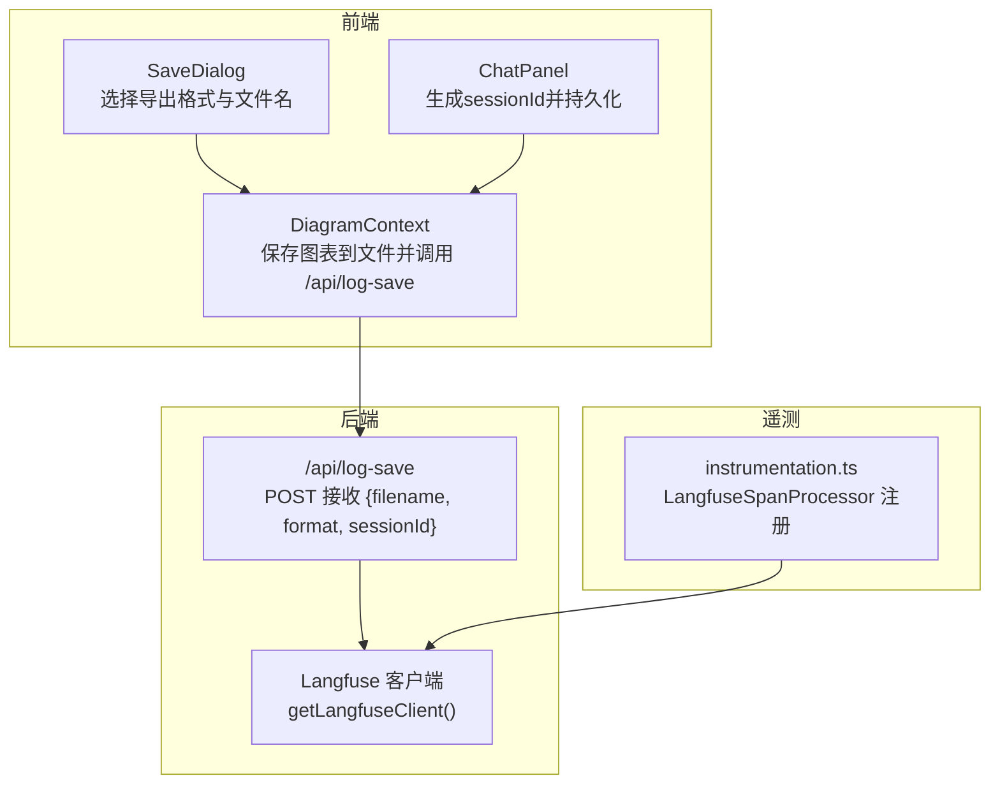
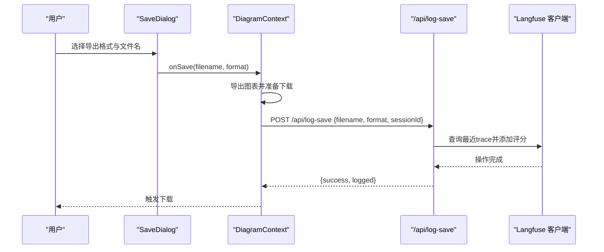
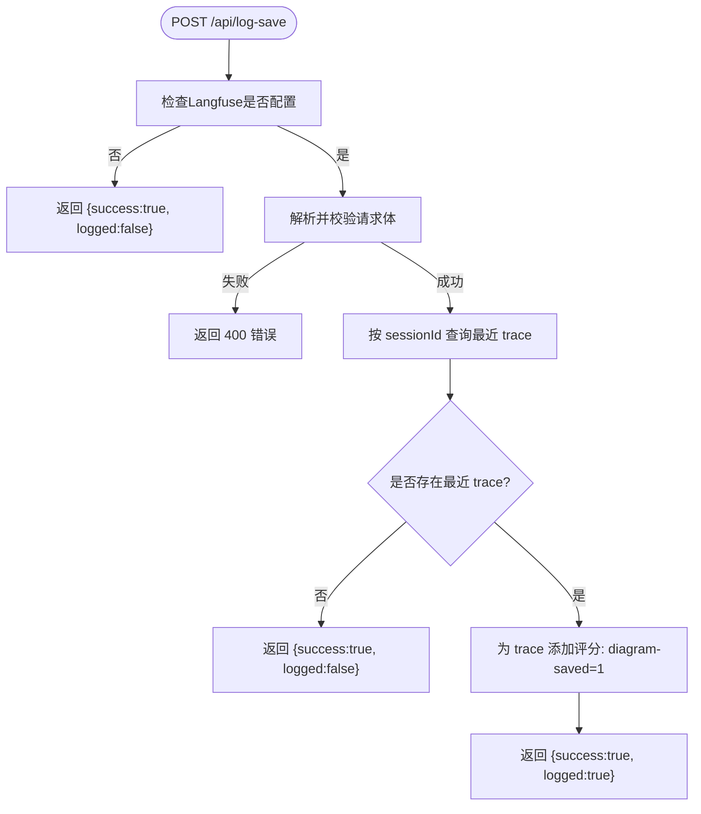
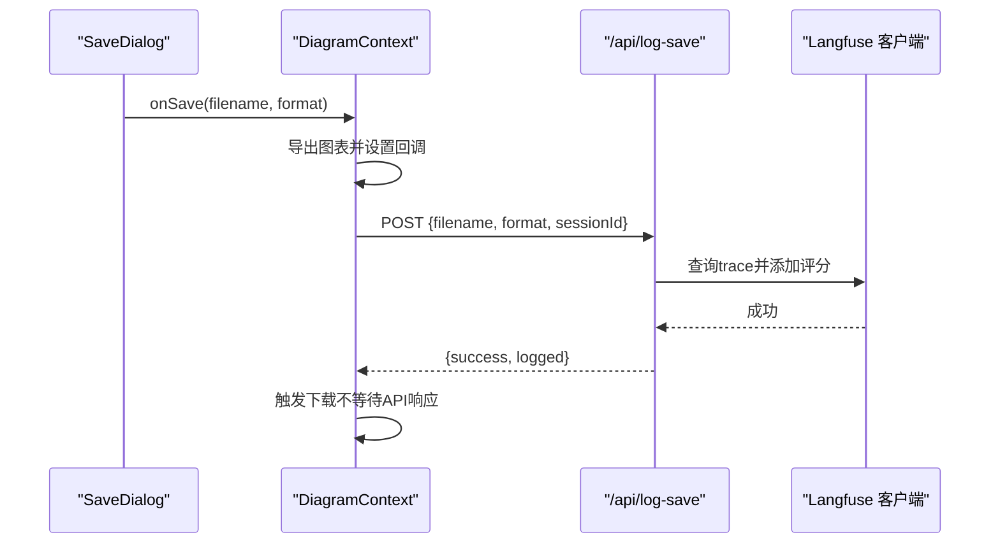
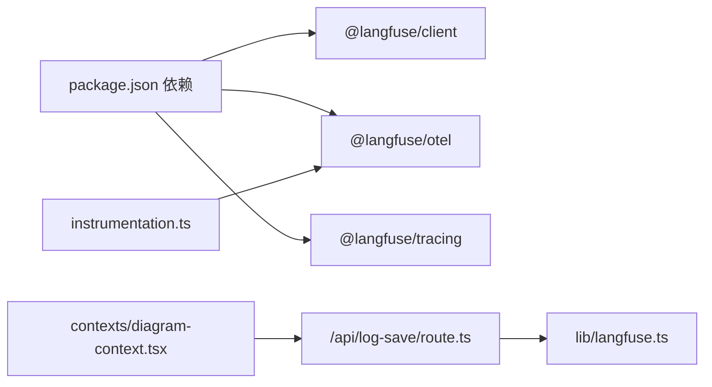

# 保存日志API (/api/log-save)

<cite>
**本文引用的文件**
- [app/api/log-save/route.ts](file://app/api/log-save/route.ts)
- [contexts/diagram-context.tsx](file://contexts/diagram-context.tsx)
- [lib/langfuse.ts](file://lib/langfuse.ts)
- [instrumentation.ts](file://instrumentation.ts)
- [components/save-dialog.tsx](file://components/save-dialog.tsx)
- [components/chat-panel.tsx](file://components/chat-panel.tsx)
- [package.json](file://package.json)
</cite>

## 目录
1. [简介](#简介)
2. [项目结构](#项目结构)
3. [核心组件](#核心组件)
4. [架构总览](#架构总览)
5. [详细组件分析](#详细组件分析)
6. [依赖关系分析](#依赖关系分析)
7. [性能考量](#性能考量)
8. [故障排查指南](#故障排查指南)
9. [结论](#结论)
10. [附录](#附录)

## 简介
本文件面向“保存日志API（/api/log-save）”的使用与实现进行系统化说明。该API用于在用户保存图表时记录操作日志，以便后续分析用户保存行为、统计活跃度以及辅助故障排查。API会接收请求体中的文件名、导出格式与可选的会话标识，并在Langfuse中为该会话的最近一次聊天追踪（trace）打上“已保存”的分数标记，从而将保存事件与用户会话关联起来。同时，该API不上传图表具体内容，仅通过评分标记实现轻量级日志记录。

## 项目结构
/api/log-save位于后端API目录下，前端通过上下文层触发调用；Langfuse客户端封装于独立模块中，全局注册了遥测处理器以过滤HTTP基础设施跨度，确保AI SDK的跨度成为根追踪。

**图表来源**
- [app/api/log-save/route.ts](file://app/api/log-save/route.ts#L1-L72)
- [contexts/diagram-context.tsx](file://contexts/diagram-context.tsx#L144-L236)
- [lib/langfuse.ts](file://lib/langfuse.ts#L1-L108)
- [instrumentation.ts](file://instrumentation.ts#L1-L39)

**章节来源**
- [app/api/log-save/route.ts](file://app/api/log-save/route.ts#L1-L72)
- [contexts/diagram-context.tsx](file://contexts/diagram-context.tsx#L144-L236)
- [lib/langfuse.ts](file://lib/langfuse.ts#L1-L108)
- [instrumentation.ts](file://instrumentation.ts#L1-L39)

## 核心组件
- 后端接口：/api/log-save
  - 负责接收并校验请求体，若Langfuse可用则为当前会话的最新trace添加“已保存”评分；否则返回未记录状态。
  - 返回值包含成功标志与是否实际记录（logged）。
- 前端触发：DiagramContext.saveDiagramToFile
  - 在导出完成后调用 /api/log-save，传入文件名、导出格式与sessionId。
  - 采用异步非阻塞方式发起fetch，避免阻塞下载流程。
- Langfuse集成：
  - 客户端按环境变量懒加载，未配置时API直接返回未记录。
  - 全局遥测处理器过滤Next.js HTTP基础设施跨度，使AI SDK跨度成为根追踪。
- 会话标识：ChatPanel
  - 生成并持久化sessionId到本地存储，作为保存日志与聊天trace关联的关键键。

**章节来源**
- [app/api/log-save/route.ts](file://app/api/log-save/route.ts#L1-L72)
- [contexts/diagram-context.tsx](file://contexts/diagram-context.tsx#L144-L236)
- [lib/langfuse.ts](file://lib/langfuse.ts#L1-L108)
- [instrumentation.ts](file://instrumentation.ts#L1-L39)
- [components/chat-panel.tsx](file://components/chat-panel.tsx#L105-L112)

## 架构总览
/api/log-save的调用链路如下：前端保存对话框触发导出，随后在DiagramContext中调用保存逻辑并异步上报保存事件；后端验证输入并在Langfuse中为最近trace打分，最终返回结果给前端。

**图表来源**
- [components/save-dialog.tsx](file://components/save-dialog.tsx#L33-L68)
- [contexts/diagram-context.tsx](file://contexts/diagram-context.tsx#L144-L236)
- [app/api/log-save/route.ts](file://app/api/log-save/route.ts#L1-L72)

## 详细组件分析

### 后端接口：/api/log-save
- 请求体字段
  - filename：字符串，长度限制在1~255之间，表示导出文件名。
  - format：枚举值，取值为["drawio","png","svg"]，表示导出格式。
  - sessionId：可选字符串，长度限制在1~200之间，用于关联用户会话。
- 输入校验
  - 使用模式校验确保字段类型与范围符合预期；非法输入返回400错误。
- 日志记录策略
  - 若Langfuse未配置（缺少公钥/密钥），直接返回成功但未记录。
  - 若Langfuse可用：查询当前sessionId对应的最近trace；若存在，则向该trace添加名为“diagram-saved”的评分（值为1），并附带注释说明保存的文件名与格式；若不存在trace则跳过记录。
- 返回值
  - success：布尔，表示处理是否成功。
  - logged：布尔，表示是否找到对应trace并成功记录。

**图表来源**
- [app/api/log-save/route.ts](file://app/api/log-save/route.ts#L1-L72)

**章节来源**
- [app/api/log-save/route.ts](file://app/api/log-save/route.ts#L1-L72)

### 前端触发：DiagramContext.saveDiagramToFile 与 logSaveToLangfuse
- 触发时机
  - 用户在保存对话框确认导出后，DiagramContext.saveDiagramToFile负责导出图表并准备下载。
- 异步上报
  - 在导出回调中，先触发下载，再异步调用 /api/log-save，避免阻塞UI。
  - 请求体包含filename、format与sessionId（来自ChatPanel生成并持久化的会话标识）。
- 下载流程
  - 根据导出格式构造文件内容（XML/PNG/SVG），必要时转换为Blob并生成临时URL，最后触发浏览器下载，延时回收URL。

**图表来源**
- [components/save-dialog.tsx](file://components/save-dialog.tsx#L33-L68)
- [contexts/diagram-context.tsx](file://contexts/diagram-context.tsx#L144-L236)
- [app/api/log-save/route.ts](file://app/api/log-save/route.ts#L1-L72)

**章节来源**
- [contexts/diagram-context.tsx](file://contexts/diagram-context.tsx#L144-L236)
- [components/save-dialog.tsx](file://components/save-dialog.tsx#L33-L68)

### 会话标识：ChatPanel
- 生成与持久化
  - 首次访问时生成sessionId并写入localStorage；页面卸载前也会持久化，保证跨会话追踪一致性。
- 关联作用
  - 保存日志与聊天trace通过sessionId建立关联，便于将“保存”动作归因到具体用户会话。

**章节来源**
- [components/chat-panel.tsx](file://components/chat-panel.tsx#L105-L112)

### Langfuse集成与遥测
- 客户端初始化
  - 通过环境变量懒加载Langfuse客户端；未配置时API直接返回未记录。
- 全局遥测
  - 注册LangfuseSpanProcessor，过滤Next.js HTTP基础设施跨度，使AI SDK的跨度成为根追踪，减少噪音并提升可观测性。

**章节来源**
- [lib/langfuse.ts](file://lib/langfuse.ts#L1-L108)
- [instrumentation.ts](file://instrumentation.ts#L1-L39)

## 依赖关系分析
- 外部依赖
  - @langfuse/client：Langfuse客户端，提供trace查询与评分上报能力。
  - @langfuse/otel：SpanProcessor，用于将OpenTelemetry跨度导出至Langfuse。
  - @langfuse/tracing：追踪工具，用于更新活动trace元数据。
- 内部依赖
  - /api/log-save 依赖 lib/langfuse.ts 提供的Langfuse客户端。
  - 前端通过DiagramContext间接依赖 /api/log-save。
  - instrumentation.ts 注册遥测处理器，影响全局跨度导出行为。

**图表来源**
- [package.json](file://package.json#L15-L61)
- [lib/langfuse.ts](file://lib/langfuse.ts#L1-L108)
- [app/api/log-save/route.ts](file://app/api/log-save/route.ts#L1-L72)
- [contexts/diagram-context.tsx](file://contexts/diagram-context.tsx#L144-L236)
- [instrumentation.ts](file://instrumentation.ts#L1-L39)

**章节来源**
- [package.json](file://package.json#L15-L61)
- [lib/langfuse.ts](file://lib/langfuse.ts#L1-L108)
- [app/api/log-save/route.ts](file://app/api/log-save/route.ts#L1-L72)
- [contexts/diagram-context.tsx](file://contexts/diagram-context.tsx#L144-L236)
- [instrumentation.ts](file://instrumentation.ts#L1-L39)

## 性能考量
- 异步非阻塞上报
  - 前端在触发下载后再发起 /api/log-save，避免阻塞用户下载体验。
- 轻量级记录
  - 仅添加评分标记，不上传图表内容，降低网络与存储开销。
- Langfuse条件启用
  - 当环境变量未配置时，API直接返回未记录，避免无效调用与错误传播。
- 跨会话追踪
  - 通过sessionId与trace关联，减少重复trace创建与查询成本。

[本节为通用建议，无需特定文件引用]

## 故障排查指南
- API返回未记录
  - 可能原因：Langfuse未配置（缺少公钥/密钥）。
  - 处理建议：检查环境变量配置；确认instrumentation.ts已正确注册SpanProcessor。
- 输入校验失败
  - 表现：返回400错误，提示无效输入。
  - 处理建议：核对请求体字段类型与长度限制。
- 无trace可关联
  - 表现：logged为false。
  - 处理建议：确认用户已开始聊天并生成sessionId；检查sessionId是否正确传递。
- 下载卡顿
  - 表现：下载延迟。
  - 处理建议：确认前端已采用异步上报；检查网络状况与浏览器下载策略。

**章节来源**
- [app/api/log-save/route.ts](file://app/api/log-save/route.ts#L1-L72)
- [lib/langfuse.ts](file://lib/langfuse.ts#L1-L108)
- [instrumentation.ts](file://instrumentation.ts#L1-L39)
- [contexts/diagram-context.tsx](file://contexts/diagram-context.tsx#L144-L236)

## 结论
/api/log-save通过轻量级评分标记的方式，将用户保存图表的行为与Langfuse会话trace关联，既满足了行为分析与活跃度统计的需求，又避免了上传图表内容带来的性能与隐私风险。前端采用异步非阻塞调用，保障用户体验；后端在Langfuse未配置时优雅降级。结合ChatPanel的sessionId管理与instrumentation.ts的遥测过滤，整体方案具备良好的可维护性与扩展性。

[本节为总结性内容，无需特定文件引用]

## 附录

### 请求体字段定义
- filename：字符串，长度1~255，导出文件名。
- format：枚举，取值["drawio","png","svg"]，导出格式。
- sessionId：可选字符串，长度1~200，用户会话标识。

**章节来源**
- [app/api/log-save/route.ts](file://app/api/log-save/route.ts#L5-L9)
- [contexts/diagram-context.tsx](file://contexts/diagram-context.tsx#L144-L156)

### 最佳实践
- 异步非阻塞调用
  - 在导出回调中先触发下载，再发起 /api/log-save，避免阻塞UI。
- 明确会话标识
  - 确保sessionId正确生成并传递，以便与聊天trace关联。
- 仅记录必要信息
  - 保持请求体最小化，避免上传图表内容。
- 环境变量管理
  - 正确配置Langfuse公钥/密钥与基础地址，确保遥测正常工作。

**章节来源**
- [contexts/diagram-context.tsx](file://contexts/diagram-context.tsx#L144-L236)
- [lib/langfuse.ts](file://lib/langfuse.ts#L1-L108)
- [instrumentation.ts](file://instrumentation.ts#L1-L39)

### 日志数据存储与保留策略
- 存储位置
  - 由Langfuse服务端管理，本仓库仅负责通过API上报评分标记。
- 保留周期
  - 由Langfuse平台策略决定，本仓库未实现自定义保留逻辑。
- 建议
  - 如需长期留存，请遵循Langfuse平台的合规与保留策略。

[本节为通用说明，无需特定文件引用]