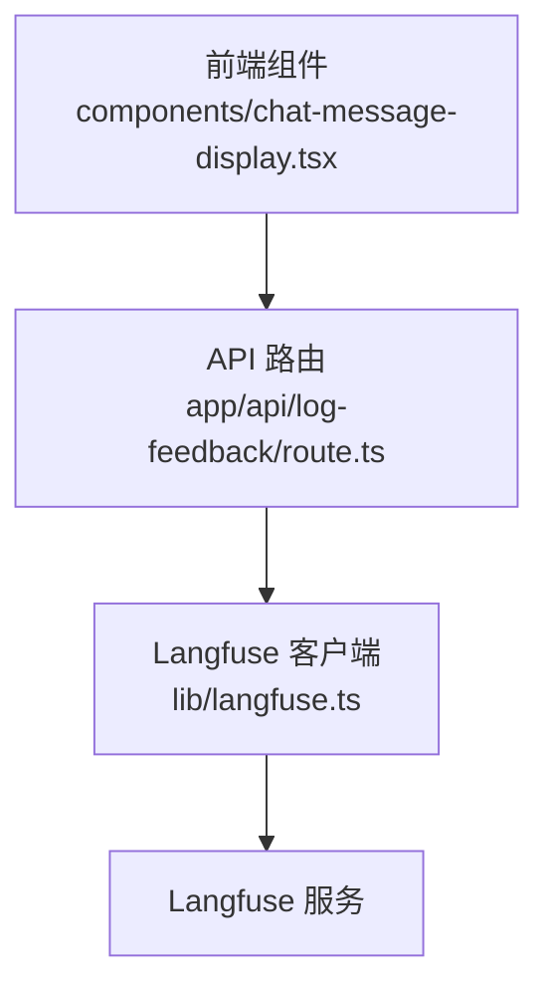
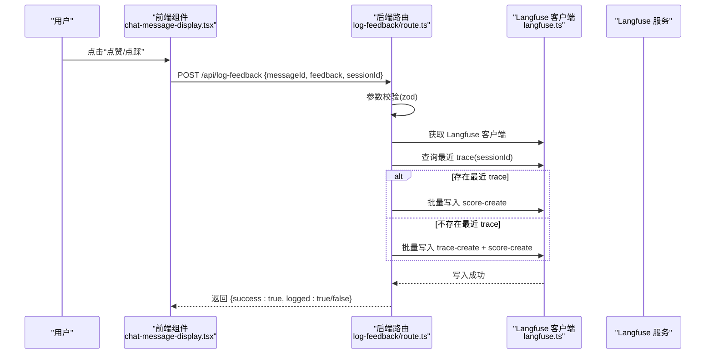
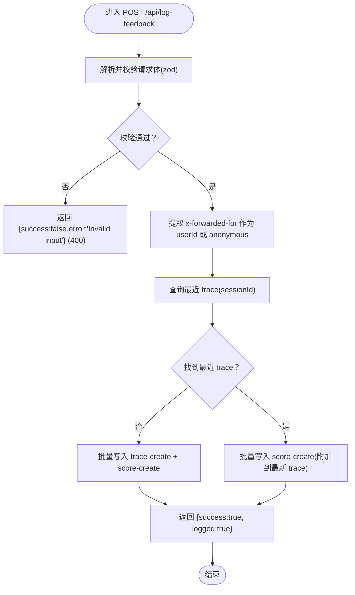
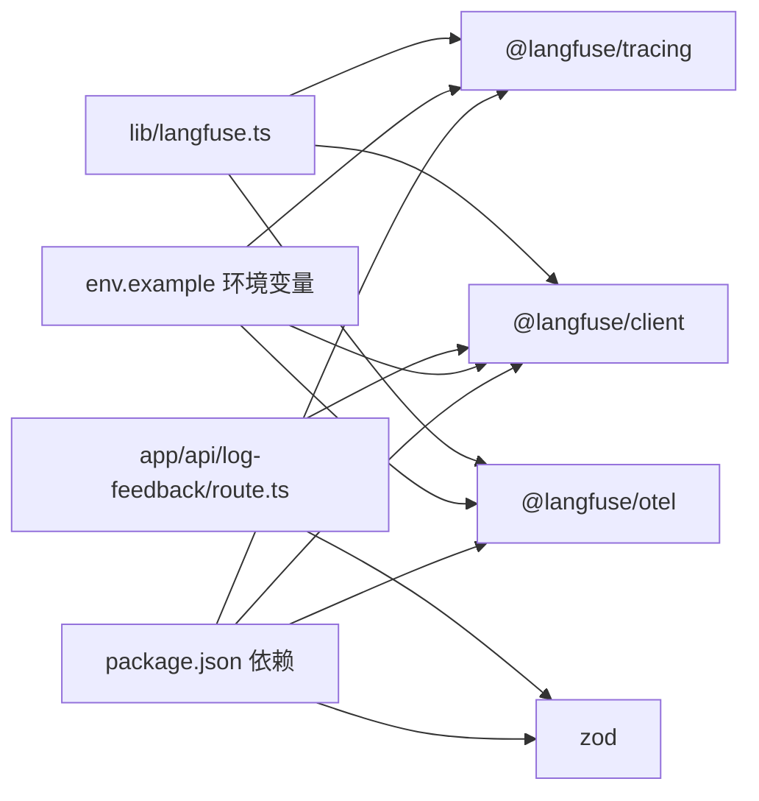

# 反馈日志API (/api/log-feedback)

<cite>
**本文引用的文件**
- [app/api/log-feedback/route.ts](file://app/api/log-feedback/route.ts)
- [lib/langfuse.ts](file://lib/langfuse.ts)
- [components/chat-message-display.tsx](file://components/chat-message-display.tsx)
- [env.example](file://env.example)
- [package.json](file://package.json)
</cite>

## 目录
1. [简介](#简介)
2. [项目结构](#项目结构)
3. [核心组件](#核心组件)
4. [架构总览](#架构总览)
5. [详细组件分析](#详细组件分析)
6. [依赖关系分析](#依赖关系分析)
7. [性能考量](#性能考量)
8. [故障排查指南](#故障排查指南)
9. [结论](#结论)
10. [附录](#附录)

## 简介
本文件面向前端与后端开发者，系统性说明 /api/log-feedback 端点的功能与使用方法。该端点用于记录用户对 AI 生成结果的即时反馈（点赞/点踩），通过 Langfuse 进行追踪与评分，从而支持后续模型优化与行为分析。文档涵盖：
- POST 请求的 JSON 结构与字段约束
- 后端处理流程与错误处理
- 前端调用示例与交互逻辑
- 数据隐私与匿名化策略
- 与 Langfuse 的集成方式与最佳实践

## 项目结构
/api/log-feedback 属于 Next.js App Router 的 API 路由，位于 app/api/log-feedback/route.ts；与之配套的 Langfuse 客户端封装位于 lib/langfuse.ts；前端在聊天消息展示组件中触发该 API。

图表来源
- [app/api/log-feedback/route.ts](file://app/api/log-feedback/route.ts#L1-L112)
- [lib/langfuse.ts](file://lib/langfuse.ts#L1-L108)
- [components/chat-message-display.tsx](file://components/chat-message-display.tsx#L147-L173)

章节来源
- [app/api/log-feedback/route.ts](file://app/api/log-feedback/route.ts#L1-L112)
- [lib/langfuse.ts](file://lib/langfuse.ts#L1-L108)
- [components/chat-message-display.tsx](file://components/chat-message-display.tsx#L147-L173)

## 核心组件
- API 路由：负责接收 POST 请求、参数校验、构造 Langfuse 批量事件、返回标准化响应。
- Langfuse 封装：提供客户端实例、会话/用户信息注入、遥测配置等能力。
- 前端组件：在用户点击“点赞/点踩”按钮时，向 /api/log-feedback 发起请求，携带 messageId、feedback、sessionId 等必要字段。

章节来源
- [app/api/log-feedback/route.ts](file://app/api/log-feedback/route.ts#L1-L112)
- [lib/langfuse.ts](file://lib/langfuse.ts#L1-L108)
- [components/chat-message-display.tsx](file://components/chat-message-display.tsx#L147-L173)

## 架构总览
/api/log-feedback 的调用链路如下：
- 前端组件在用户点击反馈按钮时，构造 JSON 并发起 POST 请求到 /api/log-feedback。
- 后端路由解析并校验请求体，提取 messageId、feedback、sessionId。
- 后端根据 sessionId 查询最近一次聊天 trace，若存在则将评分附加到该 trace；否则创建一个独立的“用户反馈”trace，并在同一批次中写入评分。
- Langfuse 接收批量事件，完成评分与 trace 的持久化。

图表来源
- [components/chat-message-display.tsx](file://components/chat-message-display.tsx#L147-L173)
- [app/api/log-feedback/route.ts](file://app/api/log-feedback/route.ts#L1-L112)
- [lib/langfuse.ts](file://lib/langfuse.ts#L1-L108)

## 详细组件分析

### API 路由：/api/log-feedback
- 输入校验：使用 zod 对请求体进行严格校验，确保字段类型与长度约束满足要求。
- 用户标识：从请求头 x-forwarded-for 中提取首个 IP 作为 userId，若不可用则标记为 anonymous。
- Trace 关联：按 sessionId 查询最近一次 trace，优先将评分附加到现有 trace，以保持会话上下文完整。
- 批量写入：当无最近 trace 时，先创建一条独立 trace，再在同一批次中写入评分；有最近 trace 时仅写入评分。
- 错误处理：输入无效返回 400；Langfuse 写入失败返回 500；未配置 Langfuse 返回 success 但 logged=false。

图表来源
- [app/api/log-feedback/route.ts](file://app/api/log-feedback/route.ts#L1-L112)

章节来源
- [app/api/log-feedback/route.ts](file://app/api/log-feedback/route.ts#L1-L112)

### Langfuse 客户端封装：lib/langfuse.ts
- 单例客户端：根据环境变量初始化 Langfuse 客户端，避免重复创建。
- 配置开关：提供 isLangfuseEnabled 判断是否启用 Langfuse。
- Trace 注入：setTraceInput/setTraceOutput 支持在聊天开始/结束时更新 trace 的输入输出与用量指标。
- 遥测配置：getTelemetryConfig 控制是否记录输入/输出与附加元数据，避免上传大体积媒体。
- 观测包装：wrapWithObserve 将请求处理器包裹为可被 Langfuse 观测的 span。

章节来源
- [lib/langfuse.ts](file://lib/langfuse.ts#L1-L108)

### 前端调用示例：components/chat-message-display.tsx
- 交互逻辑：用户点击“点赞/点踩”按钮时，调用 submitFeedback，切换当前消息的反馈状态并发起 POST 请求。
- 请求体：包含 messageId、feedback、sessionId。
- 异常处理：捕获网络异常并打印警告，不影响主流程。

章节来源
- [components/chat-message-display.tsx](file://components/chat-message-display.tsx#L147-L173)

## 依赖关系分析
- 外部依赖：@langfuse/client、@langfuse/tracing、@langfuse/otel、zod。
- 环境变量：LANGFUSE_PUBLIC_KEY、LANGFUSE_SECRET_KEY、LANGFUSE_BASEURL（可选）。
- 组件耦合：API 路由依赖 Langfuse 客户端；前端组件依赖 API 路由；Langfuse 封装提供统一的客户端与遥测配置。

图表来源
- [package.json](file://package.json#L1-L84)
- [env.example](file://env.example#L50-L55)
- [app/api/log-feedback/route.ts](file://app/api/log-feedback/route.ts#L1-L112)
- [lib/langfuse.ts](file://lib/langfuse.ts#L1-L108)

章节来源
- [package.json](file://package.json#L1-L84)
- [env.example](file://env.example#L50-L55)
- [app/api/log-feedback/route.ts](file://app/api/log-feedback/route.ts#L1-L112)
- [lib/langfuse.ts](file://lib/langfuse.ts#L1-L108)

## 性能考量
- 批量写入：后端使用 Langfuse 批量接口提交 trace 与 score，减少网络往返次数。
- 最近 trace 查询：按 sessionId 查询最近 trace，复杂度与 trace 数量相关，建议在 Langfuse 侧做好索引与分页。
- 输入校验：zod 校验在入口处拦截非法请求，避免无效负载进入 Langfuse。
- 媒体上传：遥测配置默认关闭自动记录输入，避免上传大体积图片或媒体，降低带宽与存储成本。

章节来源
- [app/api/log-feedback/route.ts](file://app/api/log-feedback/route.ts#L1-L112)
- [lib/langfuse.ts](file://lib/langfuse.ts#L78-L96)

## 故障排查指南
- 400 错误：请求体不符合 zod 校验规则（如缺少字段、类型不匹配、长度超限）。请检查前端发送的 JSON 字段与类型。
- 500 错误：Langfuse 写入失败。查看后端控制台日志中的错误详情，确认 Langfuse 服务可用性与凭据正确性。
- logged=false：Langfuse 未配置（缺少公钥/密钥）。此时请求仍返回 success，但不会写入 Langfuse。
- 无评分关联 trace：若 sessionId 不一致或无最近 trace，评分将写入独立 trace。请确保前端传入正确的 sessionId。

章节来源
- [app/api/log-feedback/route.ts](file://app/api/log-feedback/route.ts#L1-L112)
- [lib/langfuse.ts](file://lib/langfuse.ts#L1-L22)

## 结论
/api/log-feedback 提供了简洁可靠的用户反馈采集通道，结合 Langfuse 实现评分与 trace 的统一追踪。通过严格的输入校验、批量写入与会话 trace 关联，既能保证数据质量，又能提升性能。配合前端的交互设计，可有效支撑模型优化与行为分析。

## 附录

### 请求与响应规范
- 方法：POST
- 路径：/api/log-feedback
- 请求头：Content-Type: application/json
- 请求体字段
  - messageId: string，必填，长度限制 1~200
  - feedback: "good" | "bad"，必填
  - sessionId: string，可选，长度限制 1~200
- 成功响应
  - { success: true, logged: true/false }
  - 当 logged 为 false 时表示未配置 Langfuse
- 失败响应
  - 400: { success: false, error: "Invalid input" }
  - 500: { success: false, error: "Failed to log feedback" }

章节来源
- [app/api/log-feedback/route.ts](file://app/api/log-feedback/route.ts#L1-L112)

### 前端调用示例（路径）
- 前端点击反馈按钮时的调用逻辑参考：
  - [components/chat-message-display.tsx](file://components/chat-message-display.tsx#L147-L173)

### 数据隐私与匿名化
- 用户标识：后端从 x-forwarded-for 提取首个 IP 作为 userId，若为空则标记为 anonymous。该策略在无明确用户身份时避免泄露真实身份。
- 输入记录：遥测配置默认关闭自动记录输入，避免上传大体积媒体；聊天输入通过手动 setTraceInput 记录，便于控制敏感信息。
- 建议：生产环境中确保反向代理正确设置 x-forwarded-for；对涉及个人数据的输入，前端应在发送前进行脱敏处理。

章节来源
- [app/api/log-feedback/route.ts](file://app/api/log-feedback/route.ts#L28-L33)
- [lib/langfuse.ts](file://lib/langfuse.ts#L78-L96)

### 与 Langfuse 的集成要点
- 环境变量：LANGFUSE_PUBLIC_KEY、LANGFUSE_SECRET_KEY、LANGFUSE_BASEURL（可选）。
- Trace 关联：按 sessionId 查询最近 trace，优先将评分附加到现有 trace，保持会话上下文。
- 批量写入：同一请求中尽可能合并 trace-create 与 score-create，减少网络开销。
- 遥测配置：recordInputs=false，recordOutputs=true，metadata 中包含 sessionId 与 userId，便于后续聚合分析。

章节来源
- [env.example](file://env.example#L50-L55)
- [app/api/log-feedback/route.ts](file://app/api/log-feedback/route.ts#L34-L102)
- [lib/langfuse.ts](file://lib/langfuse.ts#L1-L108)