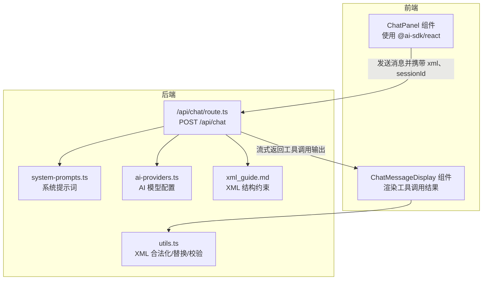
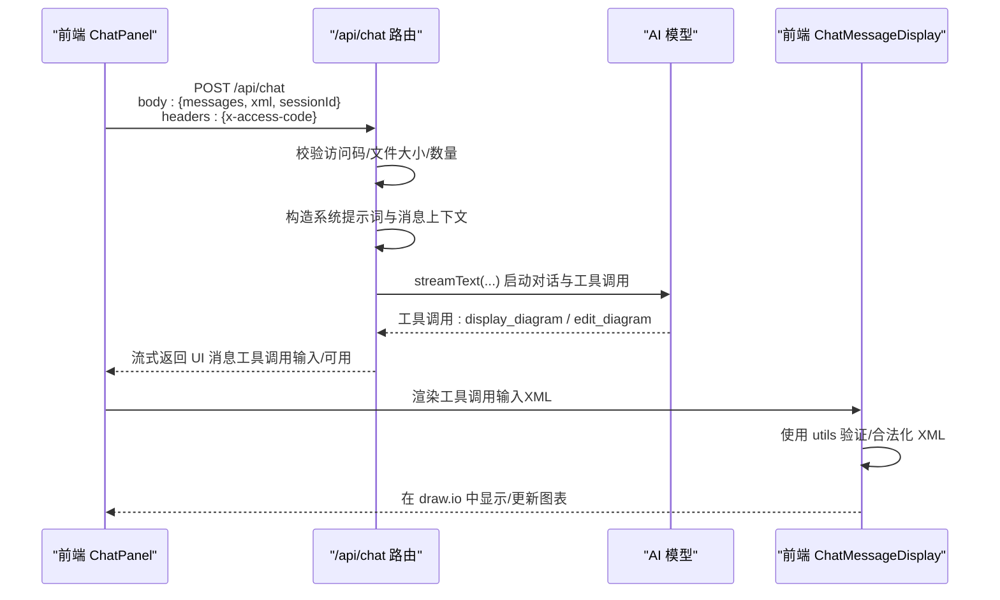
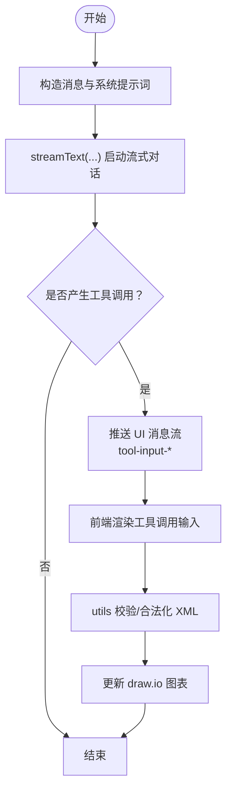
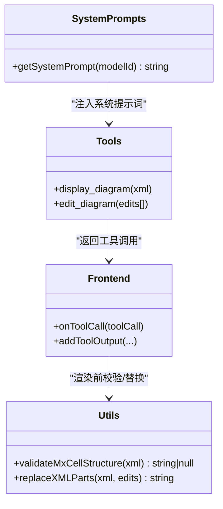
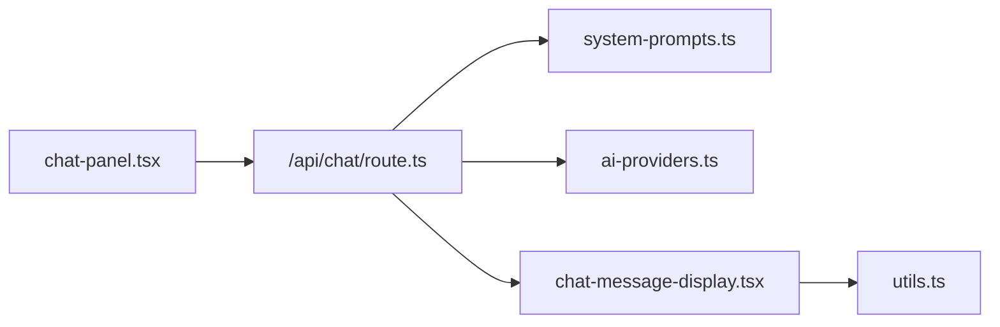

# 聊天API (/api/chat)

<cite>
**本文引用的文件**
- [route.ts](file://app/api/chat/route.ts)
- [xml_guide.md](file://app/api/chat/xml_guide.md)
- [system-prompts.ts](file://lib/system-prompts.ts)
- [ai-providers.ts](file://lib/ai-providers.ts)
- [chat-panel.tsx](file://components/chat-panel.tsx)
- [chat-message-display.tsx](file://components/chat-message-display.tsx)
- [utils.ts](file://lib/utils.ts)
</cite>

## 目录
1. [简介](#简介)
2. [项目结构](#项目结构)
3. [核心组件](#核心组件)
4. [架构总览](#架构总览)
5. [详细组件分析](#详细组件分析)
6. [依赖关系分析](#依赖关系分析)
7. [性能考量](#性能考量)
8. [故障排查指南](#故障排查指南)
9. [结论](#结论)
10. [附录](#附录)

## 简介
本文件为 next-ai-draw-io 项目中 /api/chat 端点的详细 API 文档，面向希望集成或扩展该聊天接口的开发者与产品团队。内容涵盖：
- 请求体字段与用途（messages、xml、sessionId）
- 流式响应机制（ReadableStream 输出 draw.io XML）
- 系统提示词注入与工具调用（tool calling）在图表生成中的应用
- 前端 fetch 或 ai-sdk 的调用示例路径
- 错误处理策略（模型调用失败、XML 解析错误等）
- 安全与输入校验（访问码、文件大小限制、XML 结构约束）
- xml_guide.md 中定义的 XML 结构约束对 AI 输出的影响

## 项目结构
/api/chat 端点位于后端路由层，负责：
- 接收前端传入的消息、当前图表 XML 和会话标识
- 校验访问码、文件数量与大小
- 构造系统提示词与消息上下文
- 调用 AI 模型并启用工具调用
- 将 AI 生成的 XML 以流式方式返回给客户端

图表来源
- [route.ts](file://app/api/chat/route.ts#L145-L474)
- [system-prompts.ts](file://lib/system-prompts.ts#L1-L371)
- [ai-providers.ts](file://lib/ai-providers.ts#L112-L286)
- [xml_guide.md](file://app/api/chat/xml_guide.md#L1-L323)
- [chat-panel.tsx](file://components/chat-panel.tsx#L130-L287)
- [chat-message-display.tsx](file://components/chat-message-display.tsx#L175-L249)
- [utils.ts](file://lib/utils.ts#L109-L207)

章节来源
- [route.ts](file://app/api/chat/route.ts#L145-L474)
- [system-prompts.ts](file://lib/system-prompts.ts#L1-L371)
- [ai-providers.ts](file://lib/ai-providers.ts#L112-L286)
- [xml_guide.md](file://app/api/chat/xml_guide.md#L1-L323)
- [chat-panel.tsx](file://components/chat-panel.tsx#L130-L287)
- [chat-message-display.tsx](file://components/chat-message-display.tsx#L175-L249)
- [utils.ts](file://lib/utils.ts#L109-L207)

## 核心组件
- /api/chat 路由处理器：接收请求、校验参数、构造消息与系统提示、调用 AI 并返回流式响应。
- 系统提示词模块：根据模型类型选择默认或扩展提示词，强调 draw.io XML 结构与工具调用规则。
- AI 提供商模块：自动检测并初始化所选提供商与模型，支持多厂商与本地推理。
- 前端 ChatPanel：封装 @ai-sdk/react 的 useChat，负责发送消息、处理工具调用、展示流式结果。
- 前端 ChatMessageDisplay：解析 UI 消息中的工具调用部分，将 XML 渲染到 draw.io 编辑器。
- 工具函数 utils：提供 XML 合法化、节点替换、结构校验等能力，保障渲染稳定性。

章节来源
- [route.ts](file://app/api/chat/route.ts#L145-L474)
- [system-prompts.ts](file://lib/system-prompts.ts#L1-L371)
- [ai-providers.ts](file://lib/ai-providers.ts#L112-L286)
- [chat-panel.tsx](file://components/chat-panel.tsx#L130-L287)
- [chat-message-display.tsx](file://components/chat-message-display.tsx#L175-L249)
- [utils.ts](file://lib/utils.ts#L109-L207)

## 架构总览
/api/chat 的调用链路如下：
- 前端通过 @ai-sdk/react 的 useChat 发送消息，携带 messages、xml、sessionId
- 后端路由解析请求体，进行访问码与文件校验
- 构造系统提示词与消息上下文（含当前 XML 上下文），调用 AI 模型
- AI 返回工具调用（display_diagram/edit_diagram），后端将其转换为 UI 消息流
- 前端收到流式响应，解析工具调用并渲染到 draw.io

图表来源
- [route.ts](file://app/api/chat/route.ts#L145-L474)
- [chat-panel.tsx](file://components/chat-panel.tsx#L130-L287)
- [chat-message-display.tsx](file://components/chat-message-display.tsx#L175-L249)
- [utils.ts](file://lib/utils.ts#L109-L207)

## 详细组件分析

### 请求体字段与用途
- messages
  - 类型：数组（UI 消息对象）
  - 用途：承载用户文本、图片等多模态输入；后端将其转换为模型可理解的消息序列
  - 关键点：最后一项为用户最新输入；支持文件上传（图片），后端会校验文件数量与大小
- xml
  - 类型：字符串（当前图表的完整 draw.io XML）
  - 用途：作为“当前上下文”注入到系统提示词中，指导 AI 在现有结构上进行编辑或增量生成
  - 影响：当 xml 为空或极简时，后端可能触发缓存命中逻辑，直接返回预缓存的响应
- sessionId
  - 类型：字符串（可选）
  - 用途：用于链路追踪与统计（Langfuse），长度限制 ≤ 200 字符
  - 影响：若未提供或不合规，将被忽略，不影响模型调用

章节来源
- [route.ts](file://app/api/chat/route.ts#L163-L174)
- [route.ts](file://app/api/chat/route.ts#L187-L213)
- [route.ts](file://app/api/chat/route.ts#L339-L340)

### 流式响应机制
- 后端使用 createUIMessageStreamResponse 包装流式响应，向客户端推送工具调用的输入阶段与可用阶段
- 前端 @ai-sdk/react 的 useChat 自动解析这些 UI 消息，并在 ChatMessageDisplay 中渲染
- 流式阶段包括：
  - 工具输入开始（tool-input-start）
  - 工具输入增量（tool-input-delta）
  - 工具输入可用（tool-input-available）
  - 完成（finish）

图表来源
- [route.ts](file://app/api/chat/route.ts#L341-L379)
- [route.ts](file://app/api/chat/route.ts#L115-L142)
- [chat-panel.tsx](file://components/chat-panel.tsx#L130-L287)
- [chat-message-display.tsx](file://components/chat-message-display.tsx#L175-L249)
- [utils.ts](file://lib/utils.ts#L109-L207)

章节来源
- [route.ts](file://app/api/chat/route.ts#L115-L142)
- [route.ts](file://app/api/chat/route.ts#L341-L379)
- [chat-panel.tsx](file://components/chat-panel.tsx#L130-L287)
- [chat-message-display.tsx](file://components/chat-message-display.tsx#L175-L249)
- [utils.ts](file://lib/utils.ts#L109-L207)

### 系统提示词注入与工具调用
- 系统提示词
  - 默认提示词与扩展提示词（针对特定模型）均强调：
    - 使用 display_diagram 生成全新图表或重大结构调整
    - 使用 edit_diagram 进行小范围修改（添加/删除元素、变更标签/颜色、调整属性）
    - 严格遵守 draw.io XML 结构与样式规范
- 工具定义
  - display_diagram：接收 xml 字段，用于在 draw.io 中渲染新图或替换整图
  - edit_diagram：接收 edits 数组，按精确匹配进行局部替换
- 前端 onToolCall 处理
  - display_diagram：调用 onDisplayChart 渲染；若 XML 不合法，返回错误状态给模型，触发重试
  - edit_diagram：从缓存或导出获取当前 XML，执行 replaceXMLParts 替换后再渲染

图表来源
- [system-prompts.ts](file://lib/system-prompts.ts#L1-L371)
- [route.ts](file://app/api/chat/route.ts#L393-L471)
- [chat-panel.tsx](file://components/chat-panel.tsx#L141-L259)
- [utils.ts](file://lib/utils.ts#L240-L506)

章节来源
- [system-prompts.ts](file://lib/system-prompts.ts#L1-L371)
- [route.ts](file://app/api/chat/route.ts#L393-L471)
- [chat-panel.tsx](file://components/chat-panel.tsx#L141-L259)
- [utils.ts](file://lib/utils.ts#L240-L506)

### 前端调用示例（fetch 与 ai-sdk）
- 使用 @ai-sdk/react 的 useChat（推荐）
  - ChatPanel 中通过 transport 指定 /api/chat，自动处理流式响应与工具调用
  - 示例路径参考：
    - [ChatPanel.useChat 初始化与 onToolCall](file://components/chat-panel.tsx#L130-L287)
    - [ChatPanel.sendMessage 携带 xml、sessionId、x-access-code](file://components/chat-panel.tsx#L449-L506)
- 使用原生 fetch（不推荐，需手动处理流式与工具调用）
  - 参考路径：
    - [ChatPanel.fetchChart 获取当前 XML](file://components/chat-panel.tsx#L449-L460)
    - [ChatMessageDisplay.handleDisplayChart 渲染 XML](file://components/chat-message-display.tsx#L175-L199)

章节来源
- [chat-panel.tsx](file://components/chat-panel.tsx#L130-L287)
- [chat-panel.tsx](file://components/chat-panel.tsx#L449-L506)
- [chat-message-display.tsx](file://components/chat-message-display.tsx#L175-L199)

### 错误处理策略
- 访问码校验失败：返回 401，提示配置访问码
- 文件校验失败：返回 400，提示文件数量或大小超限
- 模型调用异常：统一捕获并返回 500
- 工具调用错误（XML 不合法）：返回错误状态，前端可自动重试
- XML 解析错误：前端渲染前通过 validateMxCellStructure 校验，返回具体错误信息

章节来源
- [route.ts](file://app/api/chat/route.ts#L147-L161)
- [route.ts](file://app/api/chat/route.ts#L187-L192)
- [route.ts](file://app/api/chat/route.ts#L476-L495)
- [chat-panel.tsx](file://components/chat-panel.tsx#L141-L176)
- [utils.ts](file://lib/utils.ts#L508-L644)

### 安全与输入校验
- 访问码
  - 必须在请求头 x-access-code 中提供，否则拒绝访问
- 文件上传
  - 最大文件数：5；单文件最大 2MB；基于 data URL 的 base64 解码估算大小
- XML 结构约束
  - 所有 mxCell 必须为 <root> 的直接子元素，不可嵌套
  - 每个 mxCell 需要唯一 id
  - 除 id="0" 外，每个 mxCell 需有有效 parent 引用
  - 边的 source/target 必须引用存在的 cell ID
  - 特殊字符需正确转义（例如 &lt;、&gt;、&amp;、&quot;）
  - 必须包含根单元格 id="0" 与默认父单元格 id="1"
- 前端渲染前的二次校验
  - validateMxCellStructure：检测语法错误、重复 ID、无效父引用、边连接问题、孤立 mxPoint 等
  - convertToLegalXml：修复不完整标签、移除孤儿 mxPoint，确保可渲染性

章节来源
- [route.ts](file://app/api/chat/route.ts#L25-L59)
- [route.ts](file://app/api/chat/route.ts#L147-L161)
- [xml_guide.md](file://app/api/chat/xml_guide.md#L1-L323)
- [utils.ts](file://lib/utils.ts#L508-L644)
- [utils.ts](file://lib/utils.ts#L109-L207)

### XML 结构约束对 AI 输出的影响
- 系统提示词明确要求：
  - 所有 mxCell 必须为 <root> 的直接子元素
  - 保持属性顺序一致性（尤其 edit_diagram 的搜索模式）
  - 正确设置 parent、source、target
  - 对特殊字符进行转义
- 前端工具 replaceXMLParts 支持多种匹配策略（精确、去空白、属性顺序无关、按 id/value 定位），但最终仍需满足上述结构约束
- 若 AI 输出违反约束，前端将返回错误状态并建议修正

章节来源
- [system-prompts.ts](file://lib/system-prompts.ts#L1-L371)
- [xml_guide.md](file://app/api/chat/xml_guide.md#L1-L323)
- [utils.ts](file://lib/utils.ts#L240-L506)

## 依赖关系分析
- /api/chat 依赖
  - 系统提示词：system-prompts.ts
  - AI 提供商：ai-providers.ts
  - 前端工具：@ai-sdk/react（useChat）、自定义工具函数（utils.ts）
- 前端组件依赖
  - ChatPanel：封装 useChat、处理工具调用、持久化状态
  - ChatMessageDisplay：解析 UI 消息、渲染工具调用、调用 utils 校验/替换
  - utils：XML 合法化、替换、校验

图表来源
- [route.ts](file://app/api/chat/route.ts#L145-L474)
- [system-prompts.ts](file://lib/system-prompts.ts#L1-L371)
- [ai-providers.ts](file://lib/ai-providers.ts#L112-L286)
- [chat-panel.tsx](file://components/chat-panel.tsx#L130-L287)
- [chat-message-display.tsx](file://components/chat-message-display.tsx#L175-L249)
- [utils.ts](file://lib/utils.ts#L109-L207)

章节来源
- [route.ts](file://app/api/chat/route.ts#L145-L474)
- [system-prompts.ts](file://lib/system-prompts.ts#L1-L371)
- [ai-providers.ts](file://lib/ai-providers.ts#L112-L286)
- [chat-panel.tsx](file://components/chat-panel.tsx#L130-L287)
- [chat-message-display.tsx](file://components/chat-message-display.tsx#L175-L249)
- [utils.ts](file://lib/utils.ts#L109-L207)

## 性能考量
- 缓存策略
  - 首条空图消息命中缓存时，直接返回预缓存的流式响应，减少模型调用成本
  - 通过 providerOptions 为历史消息设置缓存断点，提升后续请求复用率
- 流式传输
  - 使用 createUIMessageStreamResponse 实现细粒度的工具调用输入阶段推送，改善用户体验
- 模型选择
  - 自动检测可用的 AI 提供商与模型，避免硬编码导致的部署复杂度

章节来源
- [route.ts](file://app/api/chat/route.ts#L194-L213)
- [route.ts](file://app/api/chat/route.ts#L297-L313)
- [ai-providers.ts](file://lib/ai-providers.ts#L112-L286)

## 故障排查指南
- 401 访问码错误
  - 确认已设置 x-access-code 请求头，且值在后端 ACCESS_CODE_LIST 中
- 400 文件相关错误
  - 检查文件数量是否超过 5，单文件大小是否超过 2MB
- 500 内部错误
  - 查看后端日志，确认模型初始化与调用是否成功
- 工具调用失败（XML 不合法）
  - 前端会返回错误状态，检查 validateMxCellStructure 报错详情
  - 重新生成或修正 XML，确保满足结构约束
- 模型返回的 JSON 未转义引号
  - 后端 experimental_repairToolCall 会尝试修复，若仍失败，请修正 AI 输出格式

章节来源
- [route.ts](file://app/api/chat/route.ts#L147-L161)
- [route.ts](file://app/api/chat/route.ts#L187-L192)
- [route.ts](file://app/api/chat/route.ts#L476-L495)
- [route.ts](file://app/api/chat/route.ts#L355-L379)
- [utils.ts](file://lib/utils.ts#L508-L644)

## 结论
/api/chat 端点通过严谨的系统提示词、工具调用与流式响应机制，实现了从自然语言到可渲染 draw.io XML 的高效闭环。配合前端的工具函数与渲染流程，能够稳定地处理复杂的图表生成与编辑任务。建议在生产环境中：
- 明确配置访问码与提供商密钥
- 严格遵循 XML 结构约束
- 利用缓存与流式传输优化体验
- 对工具调用失败进行重试与可视化反馈

## 附录
- 常用环境变量
  - AI_PROVIDER：指定 AI 提供商（bedrock、openai、anthropic、google、azure、ollama、openrouter、deepseek、siliconflow）
  - AI_MODEL：指定模型名称
  - ACCESS_CODE_LIST：逗号分隔的访问码列表
  - 其他提供商密钥与基础地址（如 OPENAI_API_KEY、ANTHROPIC_API_KEY、GOOGLE_GENERATIVE_AI_API_KEY、AZURE_API_KEY、AWS_REGION 等）

章节来源
- [ai-providers.ts](file://lib/ai-providers.ts#L91-L157)
- [ai-providers.ts](file://lib/ai-providers.ts#L158-L286)