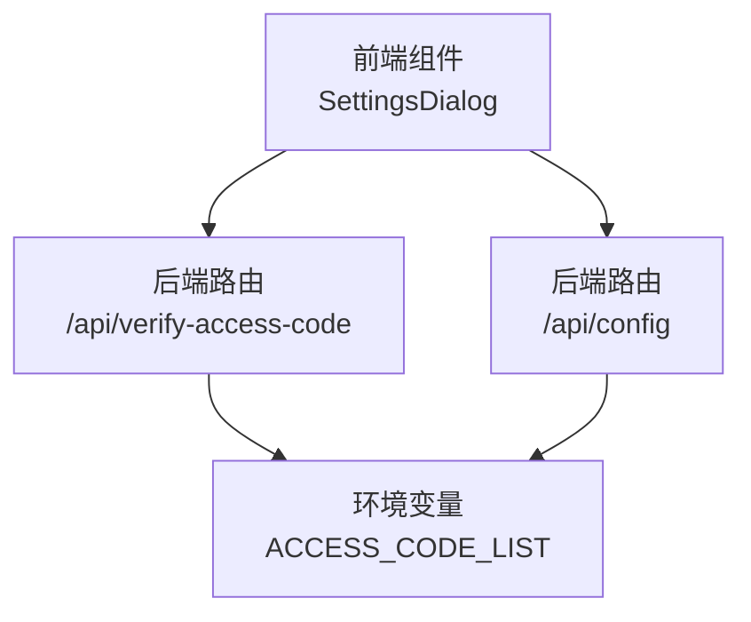
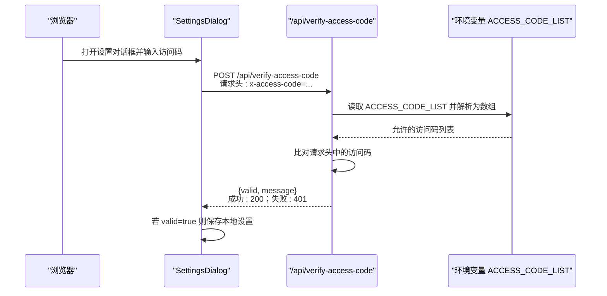
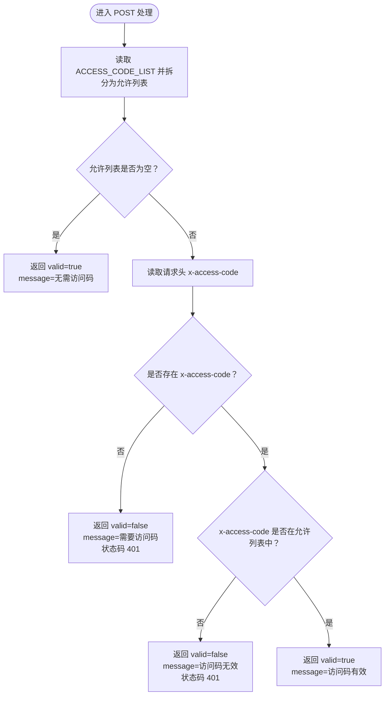
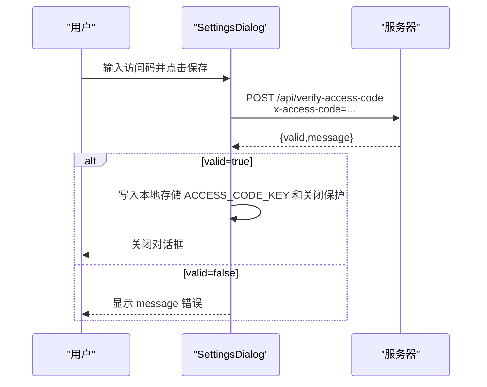
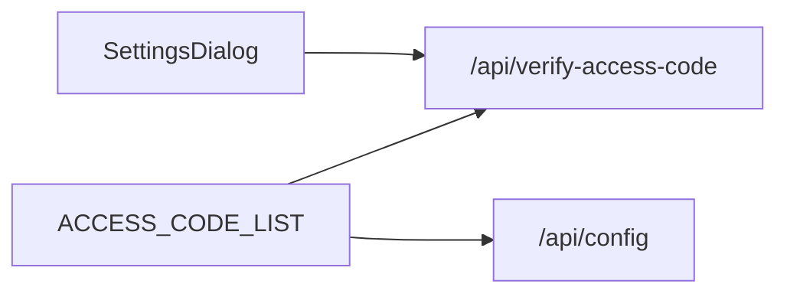

# 访问码验证API (/api/verify-access-code)

<cite>
**本文引用的文件**
- [app/api/verify-access-code/route.ts](file://app/api/verify-access-code/route.ts)
- [app/api/config/route.ts](file://app/api/config/route.ts)
- [components/settings-dialog.tsx](file://components/settings-dialog.tsx)
- [env.example](file://env.example)
- [README.md](file://README.md)
</cite>

## 目录
1. [简介](#简介)
2. [项目结构](#项目结构)
3. [核心组件](#核心组件)
4. [架构总览](#架构总览)
5. [详细组件分析](#详细组件分析)
6. [依赖关系分析](#依赖关系分析)
7. [性能考量](#性能考量)
8. [故障排查指南](#故障排查指南)
9. [结论](#结论)
10. [附录](#附录)

## 简介
本文件面向前端与后端开发者，系统性说明 /api/verify-access-code 端点的请求处理流程与安全实践。重点包括：
- 请求方式与参数：使用 POST 方法，通过请求头 x-access-code 传递访问码。
- 响应结构：返回布尔型验证结果 valid 与人类可读消息 message。
- 验证逻辑：与环境变量 ACCESS_CODE_LIST 中配置的访问码列表进行比对；若未配置则默认放行。
- 安全建议：避免时序攻击与暴力破解的策略建议（如恒定时长比较、速率限制）。
- 前端集成：Settings 对话框如何发起请求、处理响应并持久化本地设置。

## 项目结构
/api/verify-access-code 端点位于 app/api/verify-access-code/route.ts，前端交互在 components/settings-dialog.tsx 中完成。服务端还提供 /api/config 端点用于告知客户端是否需要访问码。

图表来源
- [app/api/verify-access-code/route.ts](file://app/api/verify-access-code/route.ts#L1-L33)
- [app/api/config/route.ts](file://app/api/config/route.ts#L1-L13)
- [components/settings-dialog.tsx](file://components/settings-dialog.tsx#L1-L156)
- [env.example](file://env.example#L61-L63)

章节来源
- [app/api/verify-access-code/route.ts](file://app/api/verify-access-code/route.ts#L1-L33)
- [app/api/config/route.ts](file://app/api/config/route.ts#L1-L13)
- [components/settings-dialog.tsx](file://components/settings-dialog.tsx#L1-L156)
- [env.example](file://env.example#L61-L63)

## 核心组件
- 后端路由 /api/verify-access-code
  - 接收 POST 请求，从请求头 x-access-code 读取访问码。
  - 从环境变量 ACCESS_CODE_LIST 获取允许的访问码列表（逗号分隔）。
  - 若未配置 ACCESS_CODE_LIST，则直接返回验证通过。
  - 若请求头缺失或不在允许列表中，则返回验证失败（状态码 401）。
  - 成功时返回验证通过与提示信息。
- 前端组件 SettingsDialog
  - 在保存设置时向 /api/verify-access-code 发起 POST 请求，并携带 x-access-code 头。
  - 解析响应，根据 valid 字段决定是否继续保存本地设置。
  - 错误时显示 message 提示。
- 配置查询 /api/config
  - 返回 accessCodeRequired 字段，指示服务端是否启用了访问控制。

章节来源
- [app/api/verify-access-code/route.ts](file://app/api/verify-access-code/route.ts#L1-L33)
- [components/settings-dialog.tsx](file://components/settings-dialog.tsx#L42-L92)
- [app/api/config/route.ts](file://app/api/config/route.ts#L1-L13)

## 架构总览
下图展示从前端到后端的调用链路与关键数据流。

图表来源
- [components/settings-dialog.tsx](file://components/settings-dialog.tsx#L51-L85)
- [app/api/verify-access-code/route.ts](file://app/api/verify-access-code/route.ts#L1-L33)
- [env.example](file://env.example#L61-L63)

## 详细组件分析

### 后端路由：/api/verify-access-code
- 请求方法：POST
- 请求头：
  - x-access-code：必填，字符串形式的访问码。
- 响应：
  - 成功：valid=true，message 说明“访问码有效”。
  - 失败：valid=false，message 说明“需要访问码”或“访问码无效”，状态码 401。
- 无配置时的行为：
  - 当 ACCESS_CODE_LIST 未设置或为空时，始终返回 valid=true。
- 关键实现要点：
  - 从环境变量 ACCESS_CODE_LIST 读取并按逗号拆分、去空白、过滤空值，得到允许列表。
  - 使用包含性检查判断请求头中的访问码是否在允许列表内。
  - 未配置时直接放行，避免不必要的错误。

图表来源
- [app/api/verify-access-code/route.ts](file://app/api/verify-access-code/route.ts#L1-L33)
- [env.example](file://env.example#L61-L63)

章节来源
- [app/api/verify-access-code/route.ts](file://app/api/verify-access-code/route.ts#L1-L33)

### 前端组件：SettingsDialog
- 行为概述：
  - 用户在设置对话框输入访问码。
  - 点击保存时，向 /api/verify-access-code 发起 POST 请求，请求头携带 x-access-code。
  - 若服务器返回 valid=true，则将访问码与关闭保护开关等设置写入本地存储。
  - 若返回 valid=false，则显示 message 错误提示。
- 关键实现要点：
  - 使用 fetch 发起请求，headers 中设置 x-access-code。
  - 解析 JSON 响应，依据 valid 字段分支处理。
  - 输入框类型为 password，且禁用自动填充以减少泄露风险。

图表来源
- [components/settings-dialog.tsx](file://components/settings-dialog.tsx#L51-L92)
- [app/api/verify-access-code/route.ts](file://app/api/verify-access-code/route.ts#L1-L33)

章节来源
- [components/settings-dialog.tsx](file://components/settings-dialog.tsx#L1-L156)

### 配置查询：/api/config
- 用途：告知前端当前服务端是否启用了访问控制。
- 响应字段：
  - accessCodeRequired：布尔值，true 表示需要访问码，false 表示不需要。
- 实现逻辑：
  - 从 ACCESS_CODE_LIST 读取并拆分为数组，若长度大于 0 则为 true。

章节来源
- [app/api/config/route.ts](file://app/api/config/route.ts#L1-L13)
- [env.example](file://env.example#L61-L63)

## 依赖关系分析
- 环境变量依赖：
  - ACCESS_CODE_LIST：逗号分隔的访问码列表，用于后端验证。
- 路由依赖：
  - /api/verify-access-code 依赖 ACCESS_CODE_LIST。
  - /api/config 也依赖 ACCESS_CODE_LIST 来判断是否需要访问码。
- 前端依赖：
  - SettingsDialog 依赖 /api/verify-access-code 的行为与响应格式。

图表来源
- [app/api/verify-access-code/route.ts](file://app/api/verify-access-code/route.ts#L1-L33)
- [app/api/config/route.ts](file://app/api/config/route.ts#L1-L13)
- [components/settings-dialog.tsx](file://components/settings-dialog.tsx#L51-L92)
- [env.example](file://env.example#L61-L63)

章节来源
- [app/api/verify-access-code/route.ts](file://app/api/verify-access-code/route.ts#L1-L33)
- [app/api/config/route.ts](file://app/api/config/route.ts#L1-L13)
- [components/settings-dialog.tsx](file://components/settings-dialog.tsx#L51-L92)
- [env.example](file://env.example#L61-L63)

## 性能考量
- 时间复杂度：后端对访问码列表的查找为 O(n)，n 为允许列表长度。通常 n 很小，影响可忽略。
- 内存占用：仅在内存中维护允许列表，空间复杂度 O(n)。
- 建议：
  - 将 ACCESS_CODE_LIST 控制在合理规模，避免过长列表导致不必要的 CPU 开销。
  - 如需更高性能，可在网关层或应用层引入缓存与恒定时长比较策略（见安全建议）。

[本节为通用性能讨论，不直接分析具体文件]

## 故障排查指南
- 常见问题与定位：
  - 401 且 message 为“需要访问码”：确认前端是否正确设置了请求头 x-access-code。
  - 401 且 message 为“访问码无效”：确认 ACCESS_CODE_LIST 是否包含该访问码，注意大小写与前后空白。
  - 200 且 message 为“无需访问码”：确认 ACCESS_CODE_LIST 是否已正确配置。
- 前端调试：
  - 检查 SettingsDialog 的保存流程是否正确发送请求头。
  - 查看网络面板中的请求头与响应体。
- 环境变量配置：
  - 参考 env.example 中 ACCESS_CODE_LIST 的示例格式。
  - 参考 README 中关于 ACCESS_CODE_LIST 的说明与警告。

章节来源
- [app/api/verify-access-code/route.ts](file://app/api/verify-access-code/route.ts#L1-L33)
- [components/settings-dialog.tsx](file://components/settings-dialog.tsx#L51-L92)
- [env.example](file://env.example#L61-L63)
- [README.md](file://README.md#L147-L169)

## 结论
/api/verify-access-code 端点提供了轻量级的访问控制能力：通过请求头 x-access-code 与 ACCESS_CODE_LIST 进行比对，支持多访问码配置。前端 SettingsDialog 与之配合，实现一键验证与本地设置保存。建议在生产环境中启用 ACCESS_CODE_LIST，并结合速率限制与恒定时长比较等安全措施，进一步提升抗暴力破解与时序攻击的能力。

[本节为总结性内容，不直接分析具体文件]

## 附录

### 请求与响应规范
- 请求
  - 方法：POST
  - 路径：/api/verify-access-code
  - 请求头：
    - x-access-code：字符串，必填
- 响应
  - 成功：valid=true，message 为“访问码有效”
  - 失败：valid=false，message 为“需要访问码”或“访问码无效”，状态码 401

章节来源
- [app/api/verify-access-code/route.ts](file://app/api/verify-access-code/route.ts#L1-L33)

### 前端表单提交与响应处理（步骤说明）
- 步骤概览：
  - 用户在设置对话框输入访问码。
  - 组件构造 POST 请求，设置请求头 x-access-code。
  - 发送请求至 /api/verify-access-code。
  - 解析响应 JSON，若 valid=true 则保存本地设置；否则显示错误消息。
- 代码片段路径参考：
  - 发起请求与设置请求头：[components/settings-dialog.tsx](file://components/settings-dialog.tsx#L56-L62)
  - 解析响应并分支处理：[components/settings-dialog.tsx](file://components/settings-dialog.tsx#L63-L85)

章节来源
- [components/settings-dialog.tsx](file://components/settings-dialog.tsx#L51-L92)

### 安全建议（通用实践）
- 防止时序攻击：
  - 使用恒定时长比较函数，避免因字符串长度不同导致的时序差异。
  - 在网关或应用层统一处理所有认证比较，避免分支提前退出。
- 防暴力破解：
  - 引入速率限制：对同一 IP 或同一访问码的请求频率进行限制。
  - 引入验证码或二次校验机制（如 CAPTCHA）。
  - 记录失败日志并触发告警阈值。
- 其他建议：
  - 传输层使用 HTTPS，避免明文传输。
  - 严格最小权限原则，仅暴露必要端点。
  - 定期轮换 ACCESS_CODE_LIST，避免长期不变。

[本节为通用安全建议，不直接分析具体文件]