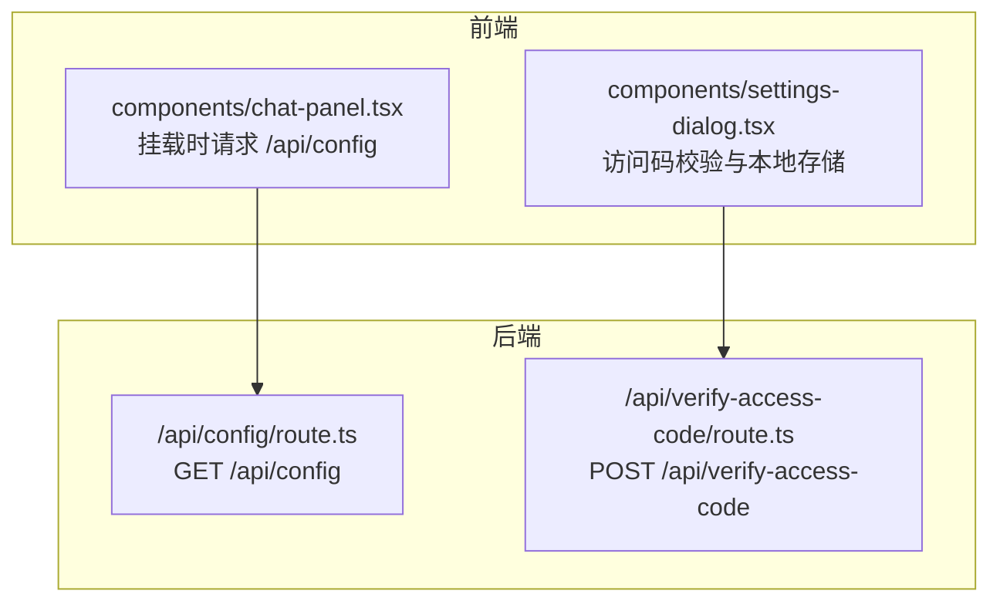
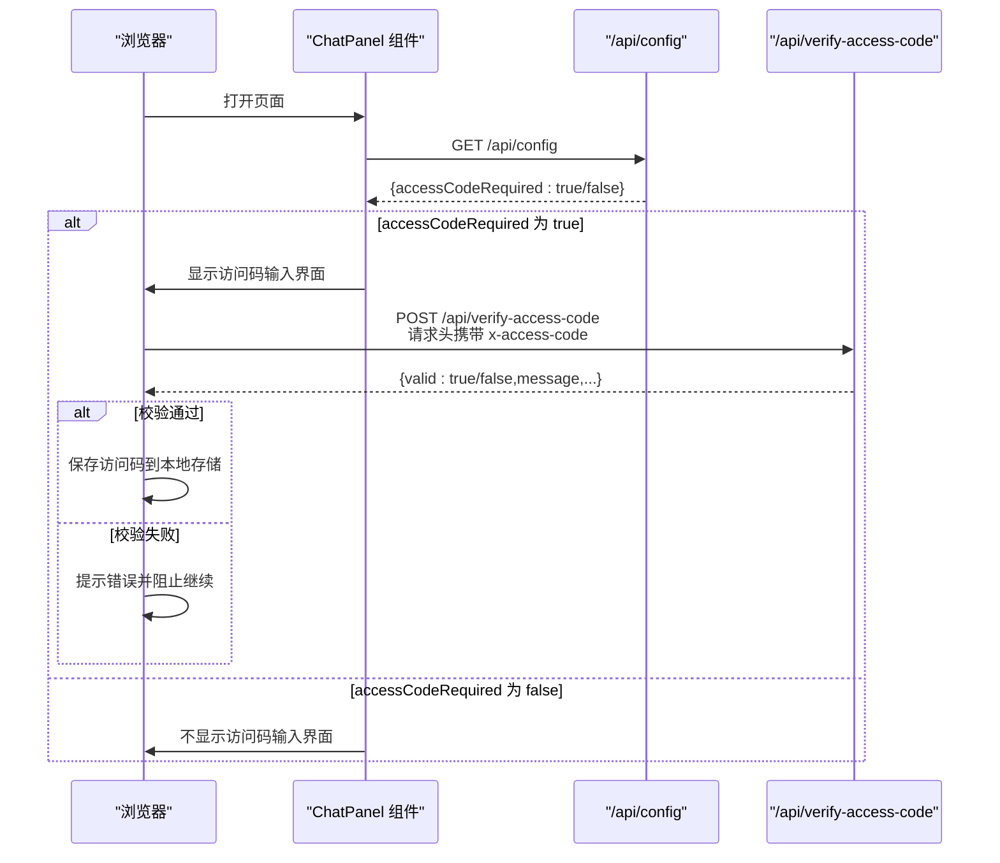
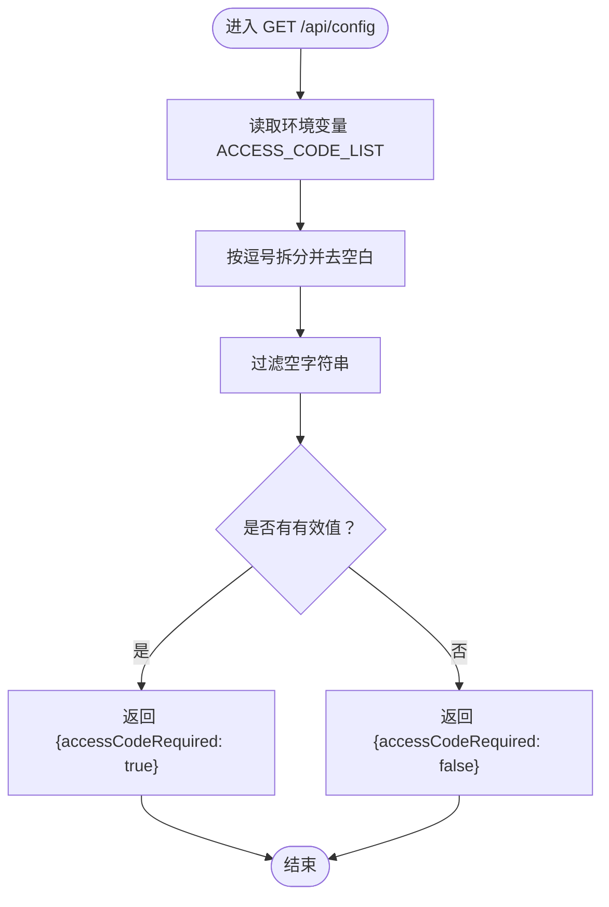
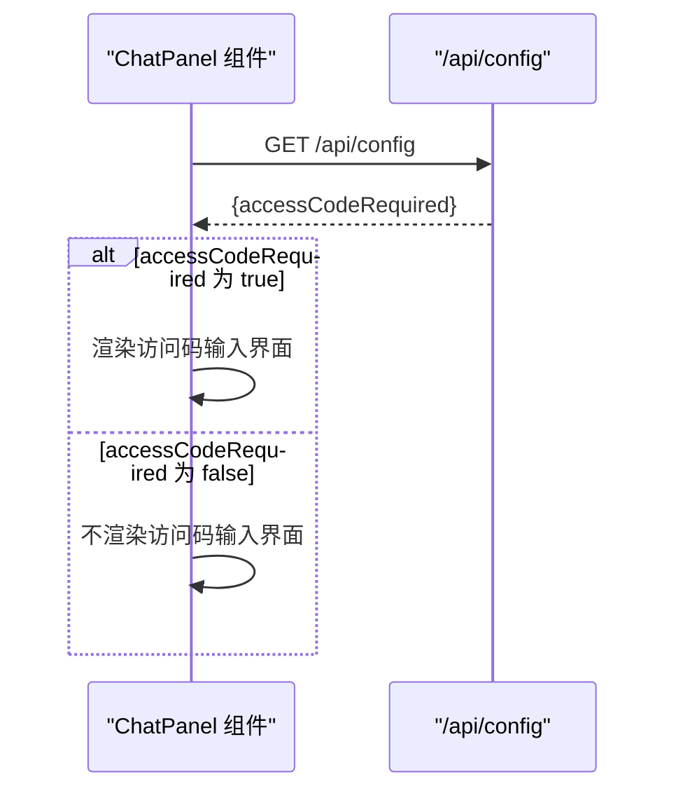
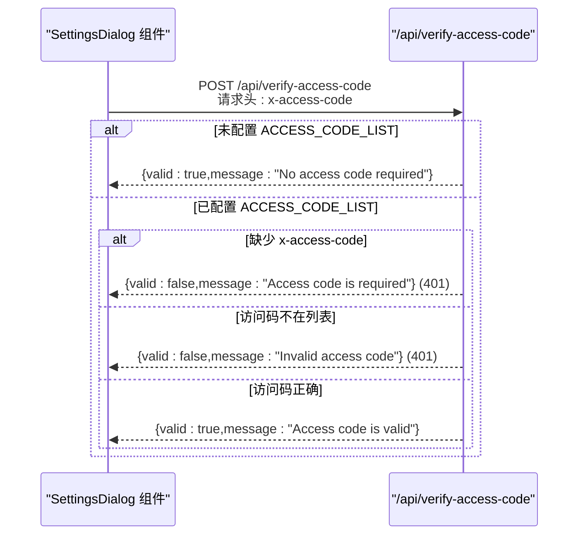
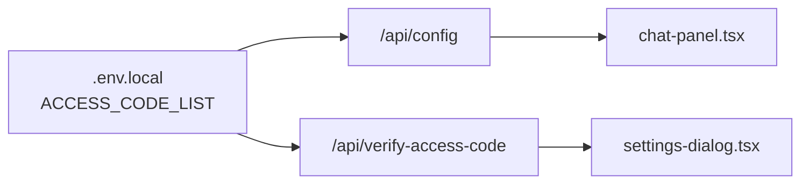

# 配置API (/api/config)

<cite>
**本文引用的文件**
- [app/api/config/route.ts](file://app/api/config/route.ts)
- [app/api/verify-access-code/route.ts](file://app/api/verify-access-code/route.ts)
- [components/chat-panel.tsx](file://components/chat-panel.tsx)
- [components/settings-dialog.tsx](file://components/settings-dialog.tsx)
- [env.example](file://env.example)
- [README.md](file://README.md)
</cite>

## 目录
1. [简介](#简介)
2. [项目结构](#项目结构)
3. [核心组件](#核心组件)
4. [架构总览](#架构总览)
5. [详细组件分析](#详细组件分析)
6. [依赖关系分析](#依赖关系分析)
7. [性能与缓存建议](#性能与缓存建议)
8. [故障排查指南](#故障排查指南)
9. [结论](#结论)
10. [附录：环境变量与默认行为](#附录环境变量与默认行为)

## 简介
本文件为 /api/config 端点的完整技术文档，重点说明：
- 该端点作为 GET 接口返回应用配置信息，当前仅包含访问码控制开关字段。
- 访问码（access code）的验证配置与后端逻辑的关系。
- 返回的 JSON 响应结构及字段语义。
- 前端如何使用该端点决定是否展示访问码输入界面。
- 客户端异步获取配置的方法与缓存策略建议。
- 环境变量未设置时的默认行为，以及如何通过环境变量自定义配置。

## 项目结构
/api/config 位于 Next.js App Router 的 app/api 下，采用标准的 route 文件组织方式；前端在聊天面板组件中发起请求以判断是否需要访问码。

图表来源
- [app/api/config/route.ts](file://app/api/config/route.ts#L1-L12)
- [app/api/verify-access-code/route.ts](file://app/api/verify-access-code/route.ts#L1-L32)
- [components/chat-panel.tsx](file://components/chat-panel.tsx#L97-L103)
- [components/settings-dialog.tsx](file://components/settings-dialog.tsx#L1-L156)

章节来源
- [app/api/config/route.ts](file://app/api/config/route.ts#L1-L12)
- [components/chat-panel.tsx](file://components/chat-panel.tsx#L97-L103)

## 核心组件
/api/config 端点负责根据环境变量 ACCESS_CODE_LIST 判断是否启用访问码控制，并返回一个布尔型开关字段，供前端决定是否显示访问码输入界面。

- 请求方法：GET
- 路径：/api/config
- 响应体字段：
  - accessCodeRequired: boolean
    - 当 ACCESS_CODE_LIST 存在且非空（去除空白后至少有一个有效值）时为 true
    - 否则为 false
- 默认行为：当 ACCESS_CODE_LIST 未设置或为空时，返回 false，表示无需访问码

章节来源
- [app/api/config/route.ts](file://app/api/config/route.ts#L1-L12)
- [env.example](file://env.example#L61-L63)
- [README.md](file://README.md#L147-L163)

## 架构总览
/api/config 与 /api/verify-access-code 协同工作，前者用于“探测式”判断，后者用于“强制式”校验。前端在页面加载时调用 /api/config 决定 UI 行为；在用户保存设置或进行敏感操作时调用 /api/verify-access-code 进行二次确认。

图表来源
- [components/chat-panel.tsx](file://components/chat-panel.tsx#L97-L103)
- [app/api/config/route.ts](file://app/api/config/route.ts#L1-L12)
- [app/api/verify-access-code/route.ts](file://app/api/verify-access-code/route.ts#L1-L32)
- [components/settings-dialog.tsx](file://components/settings-dialog.tsx#L1-L156)

## 详细组件分析

### /api/config 端点
- 功能：读取 ACCESS_CODE_LIST 环境变量，按逗号拆分并去空白，过滤空字符串，若结果长度大于 0，则返回 accessCodeRequired 为 true；否则为 false。
- 错误处理：无显式异常抛出，空列表时返回 false。
- 兼容性：支持多访问码，逗号分隔。

图表来源
- [app/api/config/route.ts](file://app/api/config/route.ts#L1-L12)

章节来源
- [app/api/config/route.ts](file://app/api/config/route.ts#L1-L12)

### 前端使用 /api/config 的流程
- 在组件挂载时发起一次 GET /api/config 请求，解析响应并更新状态，决定是否渲染访问码输入界面。
- 若返回 false，则不提示输入；若返回 true，则提示输入并在后续提交时走 /api/verify-access-code 校验。

图表来源
- [components/chat-panel.tsx](file://components/chat-panel.tsx#L97-L103)
- [app/api/config/route.ts](file://app/api/config/route.ts#L1-L12)

章节来源
- [components/chat-panel.tsx](file://components/chat-panel.tsx#L97-L103)

### /api/verify-access-code 与访问码校验
- 当 ACCESS_CODE_LIST 未配置或为空时，校验总是通过。
- 当 ACCESS_CODE_LIST 已配置时，必须在请求头 x-access-code 中提供正确的访问码，否则返回 401 并提示相应消息。
- 前端在设置对话框保存时会调用该接口进行二次确认。

图表来源
- [app/api/verify-access-code/route.ts](file://app/api/verify-access-code/route.ts#L1-L32)
- [components/settings-dialog.tsx](file://components/settings-dialog.tsx#L1-L156)

章节来源
- [app/api/verify-access-code/route.ts](file://app/api/verify-access-code/route.ts#L1-L32)
- [components/settings-dialog.tsx](file://components/settings-dialog.tsx#L1-L156)

## 依赖关系分析
- /api/config 依赖环境变量 ACCESS_CODE_LIST 的存在与否来决定 accessCodeRequired 的值。
- /api/verify-access-code 同样依赖 ACCESS_CODE_LIST，但对请求头 x-access-code 进行严格校验。
- 前端组件 chat-panel.tsx 依赖 /api/config 的返回值来控制 UI 行为；settings-dialog.tsx 依赖 /api/verify-access-code 的返回值来控制本地设置保存。

图表来源
- [app/api/config/route.ts](file://app/api/config/route.ts#L1-L12)
- [app/api/verify-access-code/route.ts](file://app/api/verify-access-code/route.ts#L1-L32)
- [components/chat-panel.tsx](file://components/chat-panel.tsx#L97-L103)
- [components/settings-dialog.tsx](file://components/settings-dialog.tsx#L1-L156)
- [env.example](file://env.example#L61-L63)

章节来源
- [app/api/config/route.ts](file://app/api/config/route.ts#L1-L12)
- [app/api/verify-access-code/route.ts](file://app/api/verify-access-code/route.ts#L1-L32)
- [components/chat-panel.tsx](file://components/chat-panel.tsx#L97-L103)
- [components/settings-dialog.tsx](file://components/settings-dialog.tsx#L1-L156)
- [env.example](file://env.example#L61-L63)

## 性能与缓存建议
- 由于 /api/config 是轻量级的探测接口，建议在前端进行简单缓存：
  - 首次请求成功后，将 accessCodeRequired 缓存至内存或 localStorage。
  - 页面生命周期内避免重复请求，除非明确需要刷新。
  - 若部署在 CDN 或边缘网络，可考虑短 TTL 的缓存策略，以平衡实时性与性能。
- 对于 /api/verify-access-code，由于涉及鉴权与可能的外部服务调用，建议：
  - 仅在必要时触发（如用户点击保存或执行敏感操作）。
  - 对于频繁的校验，可在前端做本地快速校验（例如检查本地存储是否存在已通过的访问码），再决定是否发起网络请求。

[本节为通用建议，不直接分析具体文件，故无章节来源]

## 故障排查指南
- 访问码输入界面未出现
  - 检查 ACCESS_CODE_LIST 是否正确写入 .env.local 或部署平台的环境变量。
  - 确认逗号分隔的多个访问码之间没有多余空白导致过滤后仍为空数组。
  - 参考默认行为：若 ACCESS_CODE_LIST 未设置或为空，将返回 false。
- 访问码输入界面出现但无法保存
  - 确认前端是否正确发送请求头 x-access-code。
  - 检查后端是否正确读取 ACCESS_CODE_LIST 并包含该访问码。
  - 查看 /api/verify-access-code 的返回消息，定位是缺少访问码还是访问码无效。
- 部署后行为异常
  - 确认生产环境的环境变量已正确注入，且与本地 .env.local 一致。
  - 参考 README 中关于 ACCESS_CODE_LIST 的说明与警告。

章节来源
- [README.md](file://README.md#L147-L163)
- [app/api/config/route.ts](file://app/api/config/route.ts#L1-L12)
- [app/api/verify-access-code/route.ts](file://app/api/verify-access-code/route.ts#L1-L32)
- [components/settings-dialog.tsx](file://components/settings-dialog.tsx#L1-L156)

## 结论
/api/config 提供了简洁而关键的访问码控制开关，使前端能够在不暴露敏感逻辑的前提下，动态决定是否展示访问码输入界面。结合 /api/verify-access-code 的二次校验，系统实现了“探测式开启 + 强制式校验”的双重保障。通过合理使用环境变量与前端缓存策略，可以在保证安全的同时优化用户体验。

[本节为总结性内容，不直接分析具体文件，故无章节来源]

## 附录：环境变量与默认行为
- 环境变量 ACCESS_CODE_LIST
  - 作用：配置访问码列表，支持逗号分隔的多个访问码。
  - 默认行为：未设置或为空时，/api/config 返回 false，前端不显示访问码输入界面。
  - 生效范围：/api/config 与 /api/verify-access-code 均依赖该变量。
- 前端缓存策略建议
  - 将 accessCodeRequired 缓存至内存或 localStorage，避免重复请求。
  - 在页面初始化阶段只请求一次，除非有明确需求刷新。
- 安全提示
  - README 中明确指出：若未设置 ACCESS_CODE_LIST，任何人都可直接访问站点，可能导致令牌快速耗尽。强烈建议设置该选项。

章节来源
- [env.example](file://env.example#L61-L63)
- [README.md](file://README.md#L147-L163)
- [app/api/config/route.ts](file://app/api/config/route.ts#L1-L12)
- [components/chat-panel.tsx](file://components/chat-panel.tsx#L97-L103)