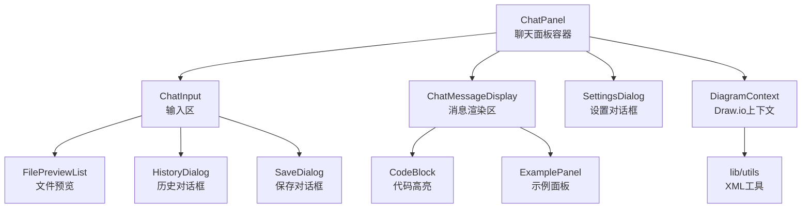
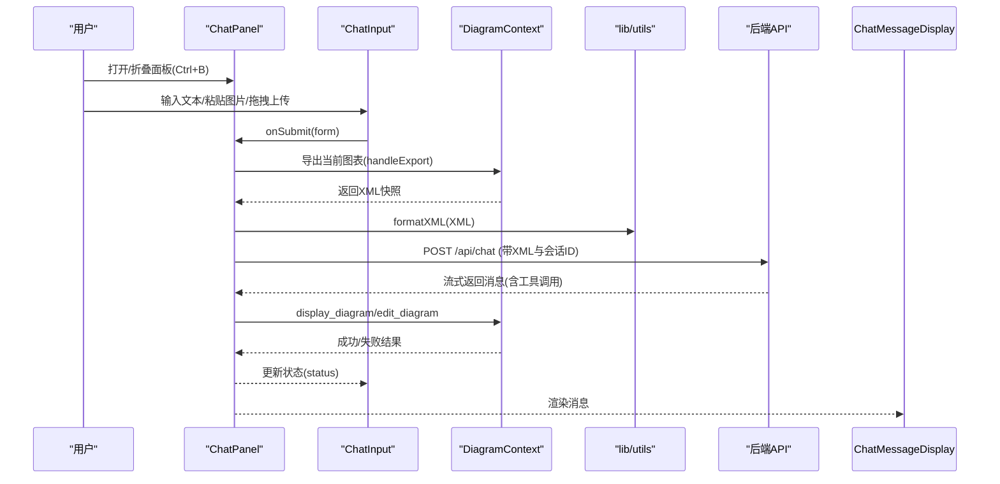
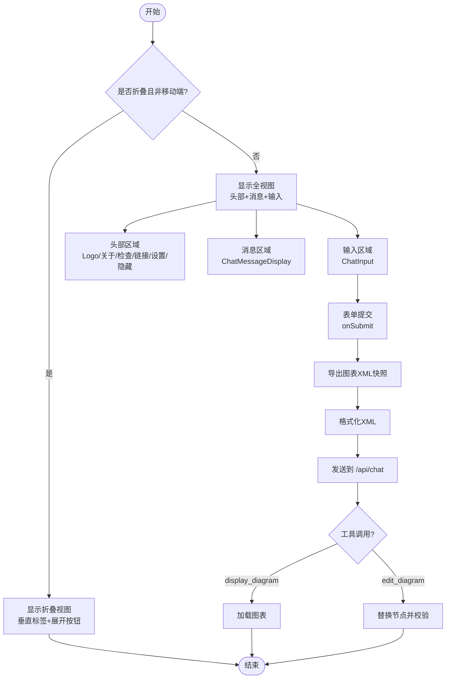
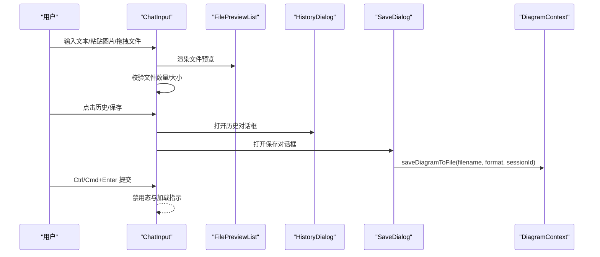
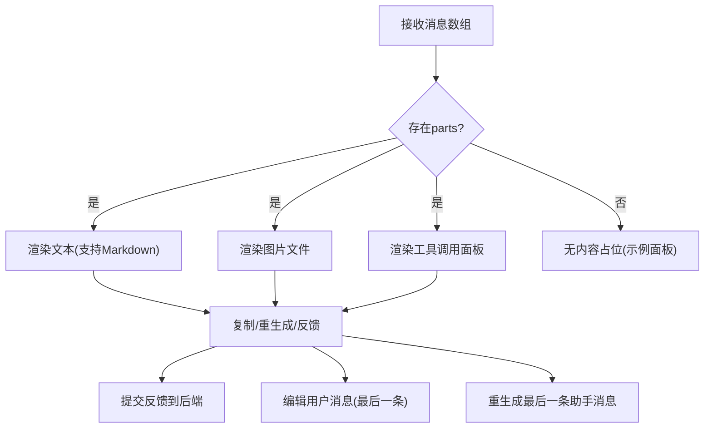
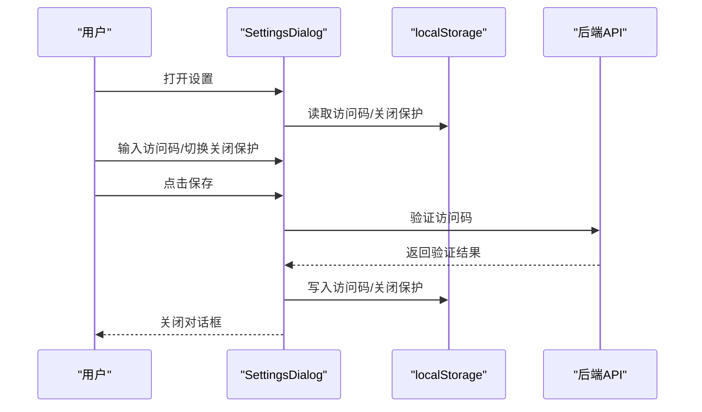
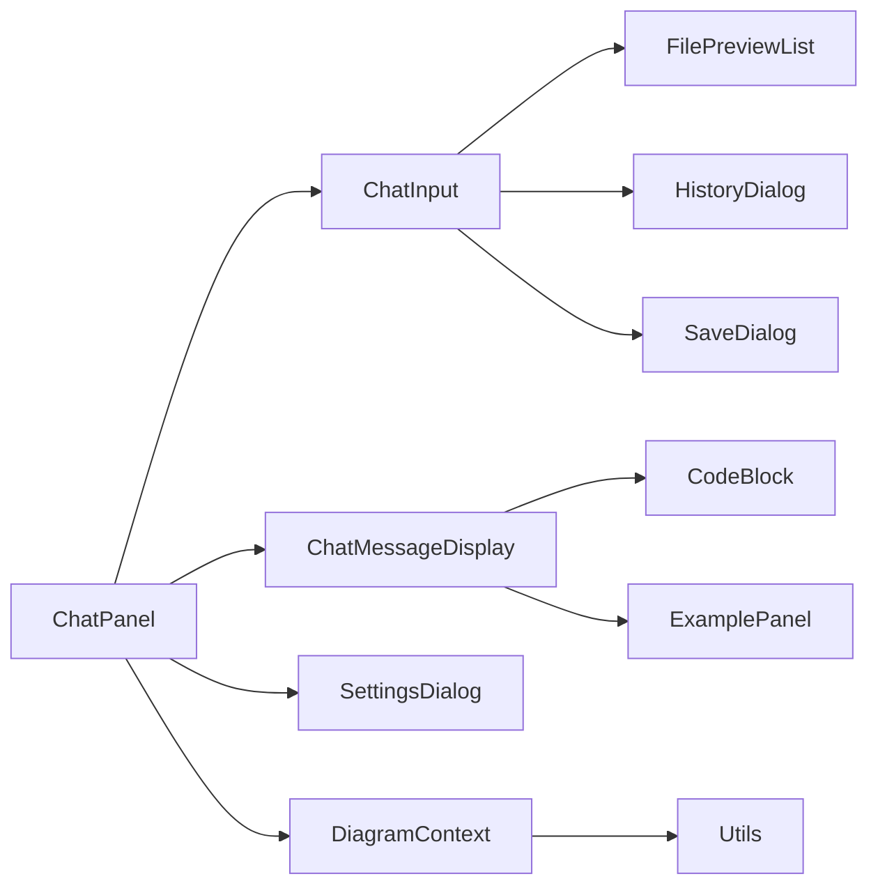

# UI组件

<cite>
**本文引用的文件**
- [components/chat-panel.tsx](file://components/chat-panel.tsx)
- [components/chat-input.tsx](file://components/chat-input.tsx)
- [components/chat-message-display.tsx](file://components/chat-message-display.tsx)
- [components/settings-dialog.tsx](file://components/settings-dialog.tsx)
- [components/chat-example-panel.tsx](file://components/chat-example-panel.tsx)
- [components/file-preview-list.tsx](file://components/file-preview-list.tsx)
- [components/history-dialog.tsx](file://components/history-dialog.tsx)
- [components/reset-warning-modal.tsx](file://components/reset-warning-modal.tsx)
- [components/save-dialog.tsx](file://components/save-dialog.tsx)
- [components/code-block.tsx](file://components/code-block.tsx)
- [contexts/diagram-context.tsx](file://contexts/diagram-context.tsx)
- [lib/utils.ts](file://lib/utils.ts)
- [app/globals.css](file://app/globals.css)
- [components/ui/scroll-area.tsx](file://components/ui/scroll-area.tsx)
- [components/ui/button.tsx](file://components/ui/button.tsx)
</cite>

## 目录
1. [简介](#简介)
2. [项目结构](#项目结构)
3. [核心组件](#核心组件)
4. [架构总览](#架构总览)
5. [详细组件分析](#详细组件分析)
6. [依赖关系分析](#依赖关系分析)
7. [性能与可用性](#性能与可用性)
8. [故障排查指南](#故障排查指南)
9. [结论](#结论)
10. [附录：样式与主题](#附录样式与主题)

## 简介
本文件聚焦于聊天界面相关UI组件，系统化梳理 ChatPanel、ChatInput、ChatMessageDisplay、SettingsDialog 的视觉外观、行为与交互模式，并补充响应式设计与可访问性建议。文档同时覆盖组件状态、动画与过渡效果、样式定制与主题支持，以及关键流程的时序图与数据流图，帮助开发者快速理解与扩展。

## 项目结构
聊天界面由多个协作组件构成：
- ChatPanel：聊天面板容器，负责消息持久化、工具调用处理、会话状态与快捷键（Ctrl+B）控制。
- ChatInput：输入区，支持文本输入、图片拖拽粘贴上传、历史与保存对话框、主题切换等。
- ChatMessageDisplay：消息渲染区，支持文本、图片、工具调用展示与反馈。
- SettingsDialog：设置对话框，管理访问码与关闭保护。
- 其他辅助组件：文件预览、历史对话框、重置确认、保存对话框、代码块高亮、示例面板等。
- 上下文与工具：DiagramContext 提供 Draw.io 编辑器能力；lib/utils 提供XML格式化、校验与提取等工具。

图表来源
- [components/chat-panel.tsx](file://components/chat-panel.tsx#L1-L816)
- [components/chat-input.tsx](file://components/chat-input.tsx#L1-L481)
- [components/chat-message-display.tsx](file://components/chat-message-display.tsx#L1-L747)
- [components/settings-dialog.tsx](file://components/settings-dialog.tsx#L1-L156)
- [contexts/diagram-context.tsx](file://contexts/diagram-context.tsx#L1-L268)
- [lib/utils.ts](file://lib/utils.ts#L1-L711)

章节来源
- [components/chat-panel.tsx](file://components/chat-panel.tsx#L1-L816)
- [components/chat-input.tsx](file://components/chat-input.tsx#L1-L481)
- [components/chat-message-display.tsx](file://components/chat-message-display.tsx#L1-L747)
- [components/settings-dialog.tsx](file://components/settings-dialog.tsx#L1-L156)
- [contexts/diagram-context.tsx](file://contexts/diagram-context.tsx#L1-L268)
- [lib/utils.ts](file://lib/utils.ts#L1-L711)

## 核心组件
- ChatPanel：负责消息持久化、工具调用（显示/编辑图表）、错误处理、会话ID生成、折叠/展开（桌面端）与快捷键（Ctrl+B）。
- ChatInput：负责输入框自适应高度、粘贴/拖拽上传、禁用态控制、历史与保存对话框、主题切换提示与清空对话。
- ChatMessageDisplay：负责消息气泡渲染、复制/反馈、编辑用户消息、工具调用输入/输出展示、滚动定位。
- SettingsDialog：负责访问码验证与存储、关闭保护开关、错误提示与键盘回车提交。

章节来源
- [components/chat-panel.tsx](file://components/chat-panel.tsx#L1-L816)
- [components/chat-input.tsx](file://components/chat-input.tsx#L1-L481)
- [components/chat-message-display.tsx](file://components/chat-message-display.tsx#L1-L747)
- [components/settings-dialog.tsx](file://components/settings-dialog.tsx#L1-L156)

## 架构总览
聊天界面采用“容器-展示”分层：
- 容器层：ChatPanel 聚合状态与副作用（持久化、工具调用、会话），向下传递 props。
- 展示层：ChatInput、ChatMessageDisplay、SettingsDialog 各司其职，通过回调与上下文交互。
- 上下文层：DiagramContext 提供 Draw.io 加载、导出、保存、历史管理与就绪状态。
- 工具层：lib/utils 提供XML格式化、合法性校验、节点替换、压缩解压与提取。

图表来源
- [components/chat-panel.tsx](file://components/chat-panel.tsx#L1-L816)
- [components/chat-input.tsx](file://components/chat-input.tsx#L1-L481)
- [contexts/diagram-context.tsx](file://contexts/diagram-context.tsx#L1-L268)
- [lib/utils.ts](file://lib/utils.ts#L1-L711)

## 详细组件分析

### ChatPanel 组件
- 视觉外观
  - 折叠视图：仅显示右侧竖向标签与展开按钮，适合桌面端节省空间。
  - 全视图：包含头部（Logo、关于链接、检查图标、GitHub链接、设置、隐藏按钮）、消息区域、输入区域。
  - 阴影与圆角：卡片背景、边框与柔和阴影，提升层次感。
- 行为与交互
  - 折叠/展开：桌面端通过按钮切换；移动端不支持折叠。
  - 快捷键：Ctrl+B 切换可见性（折叠/展开）。
  - 消息持久化：本地存储消息、XML快照、会话ID、图表XML。
  - 工具调用：display_diagram 显示图表；edit_diagram 基于当前XML进行替换并校验。
  - 错误处理：捕获AI错误并注入系统消息；当检测到访问码缺失时弹出设置对话框。
  - 回退与重生成：根据XML快照恢复到指定用户消息之前的图表状态，重新发送消息。
  - 编辑用户消息：更新文本后重新发送，清理后续消息并同步快照。
- 关键状态
  - 可见性、是否移动端、是否已恢复、是否允许保存图表、会话ID、文件列表、历史对话框开关。
- 动画与过渡
  - 全视图进入使用滑入动画；消息气泡逐条入场动画；滚动平滑至底部。
- 使用示例
  - 在页面中引入 ChatPanel 并传入可见性与切换回调，以及 drawio UI 模式与切换回调。
  - 示例路径：[ChatPanel 引入与参数](file://components/chat-panel.tsx#L47-L80)
- 代码片段路径
  - 折叠/展开与快捷键：[折叠/展开与按钮](file://components/chat-panel.tsx#L649-L755)
  - 消息持久化与恢复：[持久化与恢复](file://components/chat-panel.tsx#L300-L413)
  - 工具调用处理：[工具调用](file://components/chat-panel.tsx#L141-L260)
  - 回退与重生成：[重生成](file://components/chat-panel.tsx#L518-L585)
  - 编辑用户消息：[编辑消息](file://components/chat-panel.tsx#L587-L647)

图表来源
- [components/chat-panel.tsx](file://components/chat-panel.tsx#L649-L800)
- [contexts/diagram-context.tsx](file://contexts/diagram-context.tsx#L76-L135)
- [lib/utils.ts](file://lib/utils.ts#L1-L711)

章节来源
- [components/chat-panel.tsx](file://components/chat-panel.tsx#L1-L816)
- [contexts/diagram-context.tsx](file://contexts/diagram-context.tsx#L1-L268)
- [lib/utils.ts](file://lib/utils.ts#L1-L711)

### ChatInput 组件
- Props
  - input: string，当前输入文本
  - status: "submitted" | "streaming" | "ready" | "error"，输入状态
  - onSubmit: (e) => void，表单提交回调
  - onChange: (e) => void，文本变化回调
  - onClearChat: () => void，清空对话回调
  - files?: File[]，已选择的文件数组
  - onFileChange?: (files: File[]) => void，文件变更回调
  - showHistory?: boolean，历史对话框开关
  - onToggleHistory?: (show: boolean) => void，历史对话框切换
  - sessionId?: string，会话ID
  - error?: Error | null，错误对象
  - drawioUi?: "min" | "sketch"，Draw.io主题
  - onToggleDrawioUi?: () => void，主题切换回调
- 事件处理逻辑
  - 文本域自适应高度：根据内容高度调整最小/最大高度。
  - 键盘快捷键：Ctrl/Cmd+Enter 提交（在可提交状态下）。
  - 粘贴图片：从剪贴板读取图像文件，校验大小与数量，合并到文件列表。
  - 拖拽上传：拖拽进入表单时高亮，释放时读取文件，校验并合并。
  - 文件移除：从列表中移除对应文件，重置隐藏输入以允许重复选择。
  - 历史与保存：打开历史对话框、保存对话框；保存时调用 DiagramContext 的保存方法。
  - 主题切换：弹出确认对话框，确认后清空并切换主题。
  - 清空对话：弹出二次确认，确认后清空消息、图表、生成新会话ID并清理本地存储。
- 使用示例
  - 将 ChatPanel 的状态与回调传入 ChatInput，实现双向联动。
  - 示例路径：[ChatInput 接收 props](file://components/chat-panel.tsx#L775-L800)
- 代码片段路径
  - 自适应高度与禁用态：[高度与禁用](file://components/chat-input.tsx#L153-L173)
  - 快捷键提交：[快捷键](file://components/chat-input.tsx#L175-L183)
  - 粘贴与拖拽：[粘贴/拖拽](file://components/chat-input.tsx#L185-L272)
  - 文件预览与移除：[文件预览](file://components/chat-input.tsx#L292-L300)
  - 历史与保存：[历史/保存](file://components/chat-input.tsx#L336-L431)
  - 主题切换与清空：[主题/清空](file://components/chat-input.tsx#L341-L410)

图表来源
- [components/chat-input.tsx](file://components/chat-input.tsx#L1-L481)
- [components/file-preview-list.tsx](file://components/file-preview-list.tsx#L1-L134)
- [components/history-dialog.tsx](file://components/history-dialog.tsx#L1-L113)
- [components/save-dialog.tsx](file://components/save-dialog.tsx#L1-L129)
- [contexts/diagram-context.tsx](file://contexts/diagram-context.tsx#L144-L219)

章节来源
- [components/chat-input.tsx](file://components/chat-input.tsx#L1-L481)
- [components/file-preview-list.tsx](file://components/file-preview-list.tsx#L1-L134)
- [components/history-dialog.tsx](file://components/history-dialog.tsx#L1-L113)
- [components/save-dialog.tsx](file://components/save-dialog.tsx#L1-L129)
- [contexts/diagram-context.tsx](file://contexts/diagram-context.tsx#L144-L219)

### ChatMessageDisplay 组件
- 渲染类型
  - 文本：使用 Markdown 渲染，区分用户/系统/助手气泡样式。
  - 图片：显示上传的图片缩略图。
  - 工具调用：展示工具名称、状态（输入流/完成/错误）、输入XML/编辑差异、输出错误信息。
- 用户交互
  - 复制消息：复制文本到剪贴板，反馈成功/失败。
  - 反馈：点赞/点踩，上报到后端。
  - 编辑用户消息：对最后一条用户消息进入编辑模式，支持 Esc 取消、Ctrl/Cmd+Enter 提交。
  - 重生成：针对最后一条助手消息，基于最近一次用户消息的XML快照重新生成。
- 数据与状态
  - 记录已处理的工具调用ID，避免重复执行。
  - 维护展开/收起的工具调用面板。
  - 维护反馈状态与复制反馈。
- 使用示例
  - 将 ChatPanel 的消息数组与回调传入，实现编辑、重生成与反馈。
  - 示例路径：[消息渲染入口](file://components/chat-panel.tsx#L760-L769)
- 代码片段路径
  - 工具调用渲染：[工具调用面板](file://components/chat-message-display.tsx#L252-L343)
  - 消息气泡与动作：[消息气泡](file://components/chat-message-display.tsx#L345-L746)
  - 编辑与重生成：[编辑/重生成](file://components/chat-message-display.tsx#L433-L510)
  - 复制与反馈：[复制/反馈](file://components/chat-message-display.tsx#L135-L173)

图表来源
- [components/chat-message-display.tsx](file://components/chat-message-display.tsx#L1-L747)
- [components/code-block.tsx](file://components/code-block.tsx#L1-L54)
- [components/chat-example-panel.tsx](file://components/chat-example-panel.tsx#L1-L134)

章节来源
- [components/chat-message-display.tsx](file://components/chat-message-display.tsx#L1-L747)
- [components/code-block.tsx](file://components/code-block.tsx#L1-L54)
- [components/chat-example-panel.tsx](file://components/chat-example-panel.tsx#L1-L134)

### SettingsDialog 组件
- 配置选项
  - 访问码：密码输入，回车提交，保存到本地存储并通过后端验证。
  - 关闭保护：启用离开页面确认。
- 状态管理
  - 打开时从本地存储恢复默认值；保存成功后写入本地存储并触发父级回调。
  - 验证失败时显示错误信息。
- 使用示例
  - 在 ChatPanel 中通过按钮打开设置对话框，并监听关闭保护开关变化。
  - 示例路径：[设置对话框触发](file://components/chat-panel.tsx#L733-L754)
- 代码片段路径
  - 打开时恢复默认值：[恢复默认值](file://components/settings-dialog.tsx#L36-L49)
  - 保存与验证：[保存与验证](file://components/settings-dialog.tsx#L51-L85)
  - 键盘回车提交：[回车提交](file://components/settings-dialog.tsx#L87-L92)

图表来源
- [components/settings-dialog.tsx](file://components/settings-dialog.tsx#L1-L156)

章节来源
- [components/settings-dialog.tsx](file://components/settings-dialog.tsx#L1-L156)

## 依赖关系分析
- 组件耦合
  - ChatPanel 与 ChatInput/ChatMessageDisplay/SettingsDialog 通过 props 与回调耦合，保持低耦合高内聚。
  - ChatInput 依赖 DiagramContext 进行保存与导出，依赖 FilePreviewList、HistoryDialog、SaveDialog。
  - ChatMessageDisplay 依赖 DiagramContext 进行图表加载，依赖 CodeBlock、ExamplePanel。
- 外部依赖
  - @ai-sdk/react/useChat：流式消息与工具调用。
  - react-drawio：Draw.io 编辑器集成。
  - radix-ui/react-scroll-area：滚动区域。
  - prism-react-renderer：代码高亮。
- 循环依赖
  - 未发现循环依赖；各组件职责清晰，通过上下文与回调解耦。

图表来源
- [components/chat-panel.tsx](file://components/chat-panel.tsx#L1-L816)
- [components/chat-input.tsx](file://components/chat-input.tsx#L1-L481)
- [components/chat-message-display.tsx](file://components/chat-message-display.tsx#L1-L747)
- [contexts/diagram-context.tsx](file://contexts/diagram-context.tsx#L1-L268)
- [lib/utils.ts](file://lib/utils.ts#L1-L711)

章节来源
- [components/chat-panel.tsx](file://components/chat-panel.tsx#L1-L816)
- [components/chat-input.tsx](file://components/chat-input.tsx#L1-L481)
- [components/chat-message-display.tsx](file://components/chat-message-display.tsx#L1-L747)
- [contexts/diagram-context.tsx](file://contexts/diagram-context.tsx#L1-L268)
- [lib/utils.ts](file://lib/utils.ts#L1-L711)

## 性能与可用性
- 性能特性
  - 消息逐条入场动画，避免一次性渲染大量DOM导致卡顿。
  - 滚动区域使用轻量滚动条，减少重绘。
  - 文件预览使用对象URL缓存，卸载时统一回收，避免内存泄漏。
  - XML快照按消息索引存储，重生成/编辑时只清理后续快照，降低复杂度。
- 可访问性
  - 所有按钮均提供 aria-label 或 title，确保屏幕阅读器可读。
  - 文本域与按钮具备焦点状态与键盘操作（Enter/Ctrl/Cmd+Enter）。
  - 对话框使用语义化组件，支持键盘导航与Esc关闭。
- 响应式设计
  - 移动端输入区与头部间距更紧凑；消息区域自适应高度。
  - 折叠视图仅在桌面端启用，移动端不显示折叠按钮。
- 主题与样式
  - 使用 oklch 色彩模型，支持明暗主题自动切换。
  - 提供自定义动画类（淡入、滑入、消息入场）与阴影软化效果。
  - 滚动条细样式与悬停高亮，提升可读性。

章节来源
- [app/globals.css](file://app/globals.css#L1-L260)
- [components/ui/scroll-area.tsx](file://components/ui/scroll-area.tsx#L1-L59)
- [components/ui/button.tsx](file://components/ui/button.tsx#L1-L60)
- [components/file-preview-list.tsx](file://components/file-preview-list.tsx#L1-L134)

## 故障排查指南
- 访问码错误
  - 现象：聊天报错提示缺少或无效访问码。
  - 处理：打开设置对话框输入访问码并验证；验证通过后保存到本地存储。
  - 参考路径：[错误处理与设置弹窗](file://components/chat-panel.tsx#L261-L283)，[设置对话框保存](file://components/settings-dialog.tsx#L51-L85)
- 图表XML无效
  - 现象：工具调用返回错误或图表不显示。
  - 处理：查看工具调用输出中的错误信息；修复XML结构后重试；必要时使用历史对话框恢复到上一个版本。
  - 参考路径：[工具调用错误处理](file://components/chat-panel.tsx#L160-L175)，[历史对话框](file://components/history-dialog.tsx#L1-L113)
- 无法粘贴/拖拽图片
  - 现象：粘贴或拖拽后无文件加入。
  - 处理：检查文件大小限制与数量上限；确认浏览器权限；重试相同文件需清空输入以再次触发。
  - 参考路径：[粘贴/拖拽与校验](file://components/chat-input.tsx#L185-L272)，[文件预览](file://components/file-preview-list.tsx#L1-L134)
- 提交按钮不可用
  - 现象：发送按钮禁用。
  - 处理：等待流式/提交状态结束；确保输入非空；若出现错误，点击重试按钮。
  - 参考路径：[禁用态判断](file://components/chat-input.tsx#L153-L156)，[错误重试](file://components/chat-input.tsx#L153-L156)

章节来源
- [components/chat-panel.tsx](file://components/chat-panel.tsx#L261-L283)
- [components/settings-dialog.tsx](file://components/settings-dialog.tsx#L51-L85)
- [components/history-dialog.tsx](file://components/history-dialog.tsx#L1-L113)
- [components/chat-input.tsx](file://components/chat-input.tsx#L153-L156)
- [components/file-preview-list.tsx](file://components/file-preview-list.tsx#L1-L134)

## 结论
该聊天界面组件体系围绕 ChatPanel 为中心，通过清晰的props与回调实现低耦合高内聚；结合 DiagramContext 与工具函数，实现了从输入到图表渲染的完整闭环。组件在可访问性、响应式与主题方面均有良好支持，同时通过动画与过渡增强用户体验。建议在扩展时遵循现有模式，保持状态集中管理与上下文解耦。

## 附录：样式与主题
- 主题变量
  - 使用 oklch 色彩模型，提供明/暗两套变量，支持 sidebar、chart 系列颜色。
- 动画与过渡
  - 页面淡入、面板滑入、消息逐条入场等动画类。
- 滚动条
  - 细滚动条与悬停高亮，适配深浅主题。
- 按钮变体
  - 支持 default、destructive、outline、secondary、ghost、link 六种变体与多种尺寸。
- 代码高亮
  - CodeBlock 使用 prism-react-renderer，默认主题与语法高亮。

章节来源
- [app/globals.css](file://app/globals.css#L1-L260)
- [components/ui/button.tsx](file://components/ui/button.tsx#L1-L60)
- [components/code-block.tsx](file://components/code-block.tsx#L1-L54)