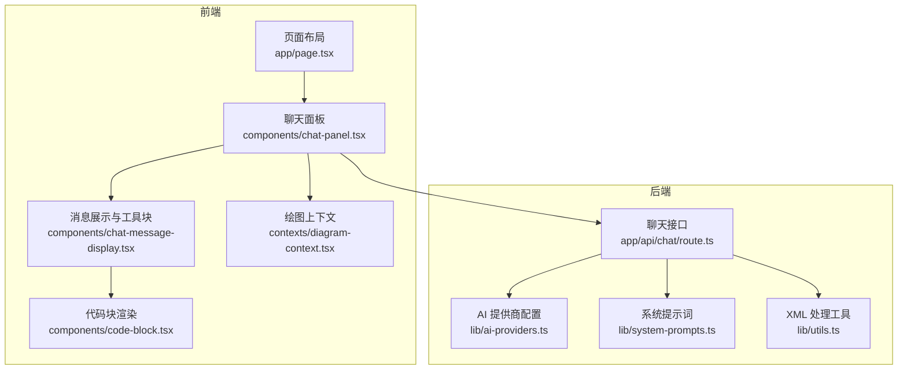
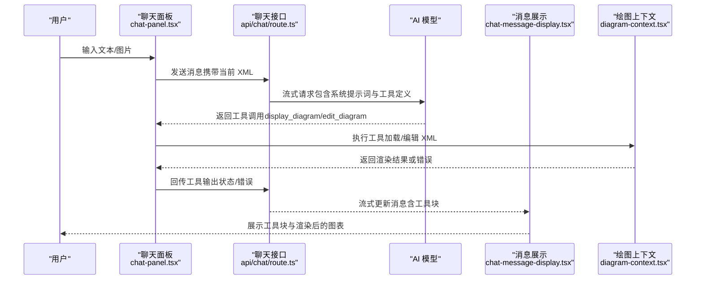
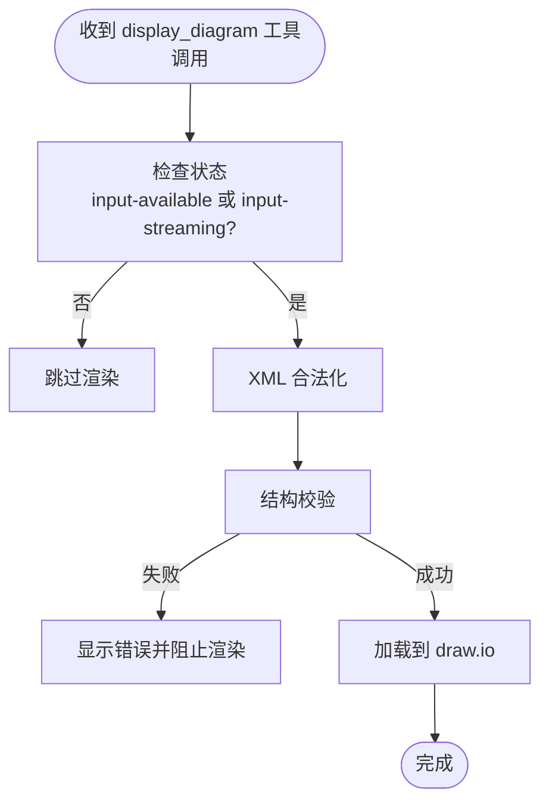
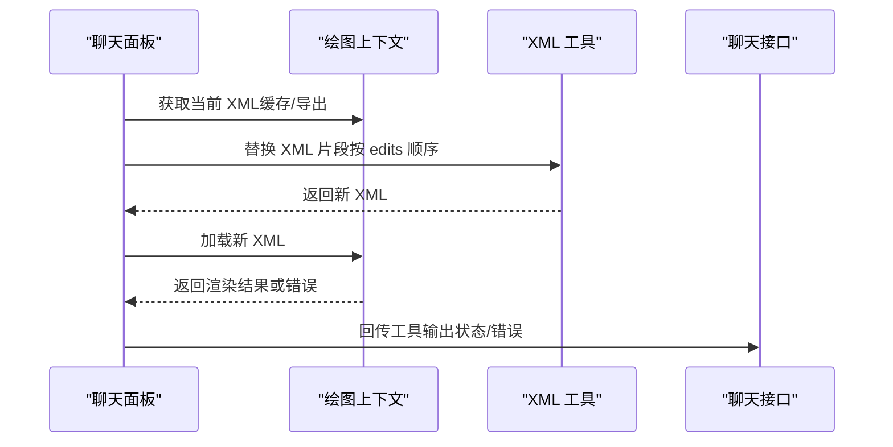
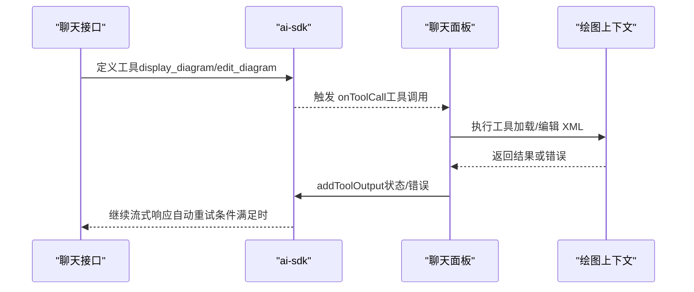
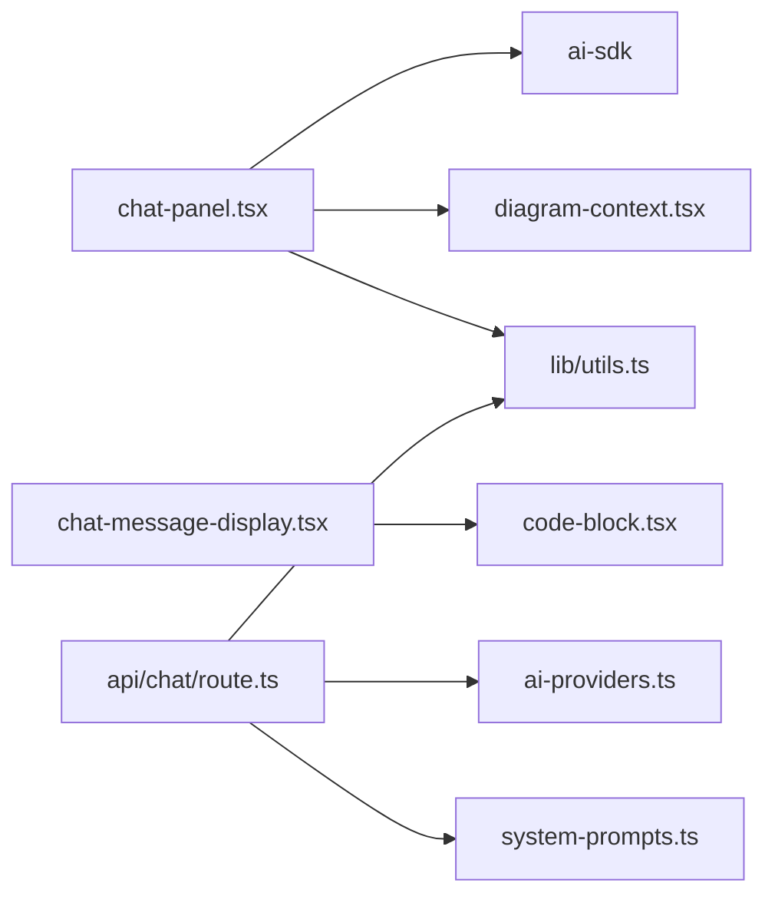

# 工具调用可视化

<cite>
**本文引用的文件列表**
- [README.md](file://README.md)
- [app/page.tsx](file://app/page.tsx)
- [app/api/chat/route.ts](file://app/api/chat/route.ts)
- [components/chat-panel.tsx](file://components/chat-panel.tsx)
- [components/chat-message-display.tsx](file://components/chat-message-display.tsx)
- [components/code-block.tsx](file://components/code-block.tsx)
- [contexts/diagram-context.tsx](file://contexts/diagram-context.tsx)
- [lib/utils.ts](file://lib/utils.ts)
- [lib/system-prompts.ts](file://lib/system-prompts.ts)
- [lib/ai-providers.ts](file://lib/ai-providers.ts)
</cite>

## 目录
1. [简介](#简介)
2. [项目结构](#项目结构)
3. [核心组件](#核心组件)
4. [架构总览](#架构总览)
5. [详细组件分析](#详细组件分析)
6. [依赖关系分析](#依赖关系分析)
7. [性能考量](#性能考量)
8. [故障排查指南](#故障排查指南)
9. [结论](#结论)

## 简介
本文件围绕“工具调用（Tool Call）在消息中的可视化展示机制”进行系统性解析，重点覆盖以下方面：
- display_diagram 与 edit_diagram 两类工具调用的输入参数（XML 数据）与输出结果（渲染的图表）如何被结构化呈现
- 工具调用块的展开/折叠状态管理逻辑及用户交互触发行为
- 工具调用元数据（如调用 ID、状态）的显示方式
- 基于 ai-sdk 的工具调用模式，前端如何解析 AI 模型返回的工具调用指令并映射到可视化组件
- 调试建议：帮助开发者识别工具调用渲染异常问题

## 项目结构
该项目采用 Next.js App Router 架构，前端通过 Vercel AI SDK 与多模型提供商对接，后端路由负责工具定义、消息流式传输与缓存策略。核心可视化围绕聊天消息面板与 draw.io 嵌入组件展开。

图表来源
- [app/page.tsx](file://app/page.tsx#L1-L162)
- [components/chat-panel.tsx](file://components/chat-panel.tsx#L1-L800)
- [components/chat-message-display.tsx](file://components/chat-message-display.tsx#L1-L747)
- [contexts/diagram-context.tsx](file://contexts/diagram-context.tsx#L1-L268)
- [components/code-block.tsx](file://components/code-block.tsx#L1-L54)
- [app/api/chat/route.ts](file://app/api/chat/route.ts#L1-L495)
- [lib/ai-providers.ts](file://lib/ai-providers.ts#L1-L286)
- [lib/system-prompts.ts](file://lib/system-prompts.ts#L1-L371)
- [lib/utils.ts](file://lib/utils.ts#L1-L711)

章节来源
- [README.md](file://README.md#L1-L225)
- [app/page.tsx](file://app/page.tsx#L1-L162)

## 核心组件
- 工具调用解析与执行：由聊天面板监听 AI SDK 的工具调用事件，分别处理 display_diagram 与 edit_diagram，并向模型回传工具输出（含状态与错误信息）。
- 可视化展示：消息展示组件根据消息中的工具部分类型渲染工具块，支持展开/折叠、状态徽章、输入/输出内容展示。
- 绘图上下文：负责将 XML 加载到 draw.io 嵌入组件中，并维护历史快照与导出能力。
- XML 处理工具：提供合法化、节点替换、结构校验与提取等能力，保障渲染稳定性。

章节来源
- [components/chat-panel.tsx](file://components/chat-panel.tsx#L1-L800)
- [components/chat-message-display.tsx](file://components/chat-message-display.tsx#L1-L747)
- [contexts/diagram-context.tsx](file://contexts/diagram-context.tsx#L1-L268)
- [lib/utils.ts](file://lib/utils.ts#L1-L711)

## 架构总览
下图展示了从用户输入到工具调用、再到可视化渲染的关键流程。

图表来源
- [components/chat-panel.tsx](file://components/chat-panel.tsx#L140-L260)
- [app/api/chat/route.ts](file://app/api/chat/route.ts#L393-L471)
- [components/chat-message-display.tsx](file://components/chat-message-display.tsx#L213-L249)
- [contexts/diagram-context.tsx](file://contexts/diagram-context.tsx#L76-L100)

## 详细组件分析

### 工具调用块的结构化呈现
- 类型识别：消息中的工具部分以类型前缀区分，例如 "tool-display_diagram"、"tool-edit_diagram"。消息展示组件会遍历消息的 parts，筛选出以 "tool-" 开头的部分并渲染为独立的工具块。
- 结构组成：
  - 标题区：显示工具名称（如“生成图表”、“编辑图表”），并根据状态显示徽章（如“完成/错误/正在流式”）。
  - 展开/折叠按钮：点击切换输入区域的可见性。
  - 输入区：当存在 input 时展示。对于 display_diagram，展示 XML；对于 edit_diagram，展示编辑差异（搜索/替换对）。
  - 输出区：当存在 output 或错误状态时展示。
- 状态徽章：
  - 正在流式：显示旋转指示器
  - 完成：显示“完成”徽章
  - 错误：显示“错误”徽章，并在下方展示错误文本

章节来源
- [components/chat-message-display.tsx](file://components/chat-message-display.tsx#L252-L343)

### display_diagram 的输入与输出
- 输入参数：
  - 类型：tool-display_diagram
  - 参数结构：包含 xml 字段（字符串），表示需要渲染的 draw.io XML。
- 渲染流程：
  - 在消息监听阶段，当检测到 display_diagram 且处于 input-available 或 input-streaming 状态时，前端会尝试将 XML 合法化、结构校验并通过绘图上下文加载到 draw.io 中。
  - 若校验失败，将记录错误并阻止渲染。
- 输出结果：
  - 成功：工具块显示“完成”徽章，同时 draw.io 中展示对应图表。
  - 失败：工具块显示“错误”徽章，并附带错误信息。

图表来源
- [components/chat-message-display.tsx](file://components/chat-message-display.tsx#L175-L199)
- [lib/utils.ts](file://lib/utils.ts#L56-L107)
- [lib/utils.ts](file://lib/utils.ts#L508-L643)
- [contexts/diagram-context.tsx](file://contexts/diagram-context.tsx#L76-L99)

章节来源
- [components/chat-message-display.tsx](file://components/chat-message-display.tsx#L213-L249)
- [lib/utils.ts](file://lib/utils.ts#L56-L107)
- [lib/utils.ts](file://lib/utils.ts#L508-L643)
- [contexts/diagram-context.tsx](file://contexts/diagram-context.tsx#L76-L99)

### edit_diagram 的输入与输出
- 输入参数：
  - 类型：tool-edit_diagram
  - 参数结构：包含 edits 数组，每个元素为 { search, replace } 对，用于精确替换当前 XML 中的片段。
- 执行流程：
  - 聊天面板先获取当前 XML（优先使用缓存，必要时导出），再调用工具函数进行替换，最后将新 XML 交给绘图上下文加载。
  - 若替换导致 XML 结构不合法，将返回错误并提示调整搜索模式。
- 输出结果：
  - 成功：工具块显示“完成”徽章，同时 draw.io 中展示更新后的图表。
  - 失败：工具块显示“错误”徽章，并附带错误信息与当前 XML 快照以便定位问题。

图表来源
- [components/chat-panel.tsx](file://components/chat-panel.tsx#L176-L259)
- [lib/utils.ts](file://lib/utils.ts#L240-L506)
- [contexts/diagram-context.tsx](file://contexts/diagram-context.tsx#L76-L99)

章节来源
- [components/chat-panel.tsx](file://components/chat-panel.tsx#L176-L259)
- [lib/utils.ts](file://lib/utils.ts#L240-L506)

### 展开/折叠状态管理与用户交互
- 状态存储：组件内部使用 expandedTools 记录每个工具调用的展开状态，默认展开。
- 切换行为：点击工具块标题右侧的折叠按钮，会切换该工具调用块的展开/折叠状态。
- 输入区展示：仅当存在 input 且处于展开状态时才显示输入内容（XML 或编辑差异）。

章节来源
- [components/chat-message-display.tsx](file://components/chat-message-display.tsx#L252-L343)

### 工具调用元数据的显示
- 元数据字段：
  - toolCallId：唯一标识一次工具调用
  - state：工具调用状态（如 input-streaming、input-available、output-available、output-error）
  - input：工具调用输入（XML 或 edits）
  - output：工具调用输出（文本或错误信息）
- 显示方式：
  - 标题区显示工具名称与状态徽章
  - 折叠按钮用于控制输入区显示
  - 错误状态时在工具块底部显示错误文本

章节来源
- [components/chat-message-display.tsx](file://components/chat-message-display.tsx#L36-L43)
- [components/chat-message-display.tsx](file://components/chat-message-display.tsx#L252-L343)

### 前端解析 AI 模型返回的工具调用指令
- 使用 ai-sdk 的工具定义：后端在聊天接口中声明了 display_diagram 与 edit_diagram 两个工具及其输入模式。
- 前端监听工具调用：聊天面板通过 useChat 的 onToolCall 钩子接收工具调用，分别处理两种工具。
- 自动重试：当工具返回错误时，前端可借助 sendAutomaticallyWhen 条件自动重新提交，使模型有机会修复错误。

图表来源
- [app/api/chat/route.ts](file://app/api/chat/route.ts#L393-L471)
- [components/chat-panel.tsx](file://components/chat-panel.tsx#L141-L175)
- [components/chat-panel.tsx](file://components/chat-panel.tsx#L284-L287)

章节来源
- [app/api/chat/route.ts](file://app/api/chat/route.ts#L393-L471)
- [components/chat-panel.tsx](file://components/chat-panel.tsx#L141-L175)
- [components/chat-panel.tsx](file://components/chat-panel.tsx#L284-L287)

### XML 数据的结构化呈现
- XML 展示：当工具块输入为 XML 时，使用代码块组件进行高亮渲染，便于阅读。
- 编辑差异展示：当工具块输入为 edits（数组）时，使用差异组件展示每条变更的“移除/添加”对比。

章节来源
- [components/chat-message-display.tsx](file://components/chat-message-display.tsx#L319-L335)
- [components/code-block.tsx](file://components/code-block.tsx#L1-L54)

## 依赖关系分析
- 聊天面板依赖：
  - ai-sdk 的 useChat 与 DefaultChatTransport
  - 绘图上下文提供的加载/导出能力
  - XML 工具库提供的合法化、替换与校验
- 消息展示组件依赖：
  - 绘图上下文提供的图表状态
  - 代码块组件用于 XML/JSON 展示
- 后端接口依赖：
  - ai-providers 提供多模型适配
  - system-prompts 提供系统提示词
  - utils 提供 XML 处理能力

图表来源
- [components/chat-panel.tsx](file://components/chat-panel.tsx#L1-L800)
- [components/chat-message-display.tsx](file://components/chat-message-display.tsx#L1-L747)
- [contexts/diagram-context.tsx](file://contexts/diagram-context.tsx#L1-L268)
- [lib/utils.ts](file://lib/utils.ts#L1-L711)
- [app/api/chat/route.ts](file://app/api/chat/route.ts#L1-L495)
- [lib/ai-providers.ts](file://lib/ai-providers.ts#L1-L286)
- [lib/system-prompts.ts](file://lib/system-prompts.ts#L1-L371)

章节来源
- [components/chat-panel.tsx](file://components/chat-panel.tsx#L1-L800)
- [components/chat-message-display.tsx](file://components/chat-message-display.tsx#L1-L747)
- [contexts/diagram-context.tsx](file://contexts/diagram-context.tsx#L1-L268)
- [lib/utils.ts](file://lib/utils.ts#L1-L711)
- [app/api/chat/route.ts](file://app/api/chat/route.ts#L1-L495)
- [lib/ai-providers.ts](file://lib/ai-providers.ts#L1-L286)
- [lib/system-prompts.ts](file://lib/system-prompts.ts#L1-L371)

## 性能考量
- 流式渲染：display_diagram 支持 input-streaming 与 input-available 两种状态，前端可在流式过程中逐步渲染，提升感知速度。
- 缓存与增量更新：edit_diagram 通过缓存当前 XML 并按需替换，避免重复导出与全量渲染。
- 结构校验前置：在加载前进行 XML 合法化与结构校验，减少无效渲染与报错。
- 重试机制：工具错误时自动重试，降低一次性失败的概率。

[本节为通用指导，无需特定文件引用]

## 故障排查指南
- 工具块未显示或状态异常
  - 检查消息中是否存在以 "tool-" 开头的 part
  - 确认状态字段是否正确传递（input-streaming/input-available/output-available/output-error）
- XML 无法渲染
  - 查看结构校验错误信息，修正重复 ID、缺失父引用、边连接无效等问题
  - 确保 XML 合法化处理已执行
- edit_diagram 失败
  - 检查搜索模式是否与当前 XML 完全一致（属性顺序、缩进、换行）
  - 尝试扩大上下文或拆分为多次小修改
  - 使用“当前 XML”作为精确复制来源
- 渲染卡顿或闪烁
  - 减少一次性大范围替换，分步执行
  - 避免频繁切换主题或导出，等待上一次操作完成

章节来源
- [components/chat-message-display.tsx](file://components/chat-message-display.tsx#L175-L199)
- [lib/utils.ts](file://lib/utils.ts#L508-L643)
- [lib/system-prompts.ts](file://lib/system-prompts.ts#L1-L371)

## 结论
本项目通过 ai-sdk 的工具调用机制，将 AI 生成的 draw.io XML 以结构化的方式在消息中可视化呈现。前端在聊天面板与消息展示组件中实现了对工具调用的解析、状态管理与渲染反馈，配合绘图上下文与 XML 工具库，确保了渲染的稳定性与可调试性。开发者可通过观察工具块状态、利用系统提示词与错误信息、以及分步编辑策略，高效定位并解决工具调用渲染异常问题。