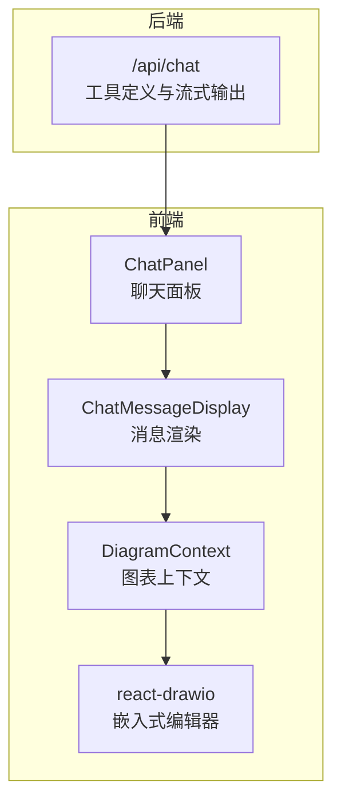
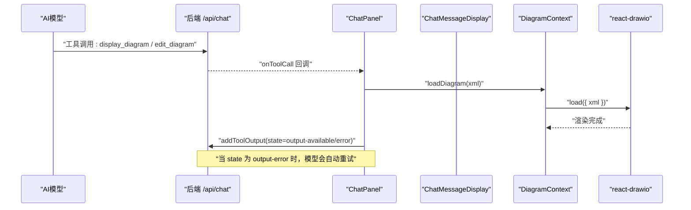
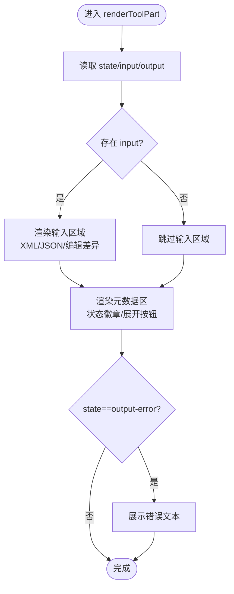
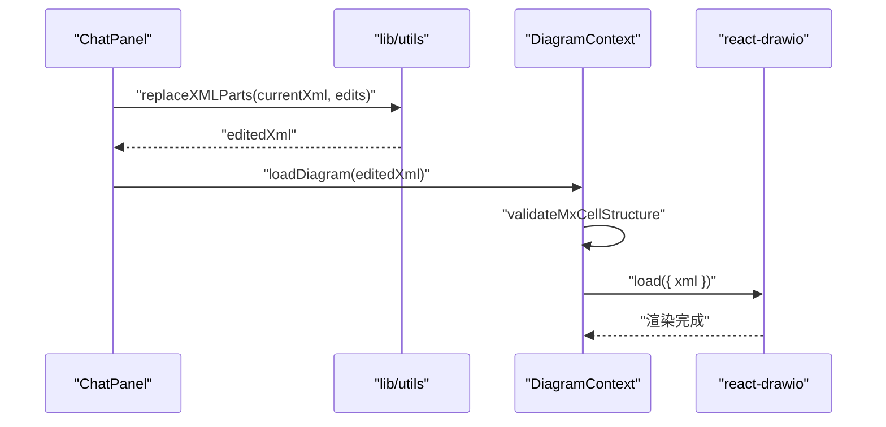
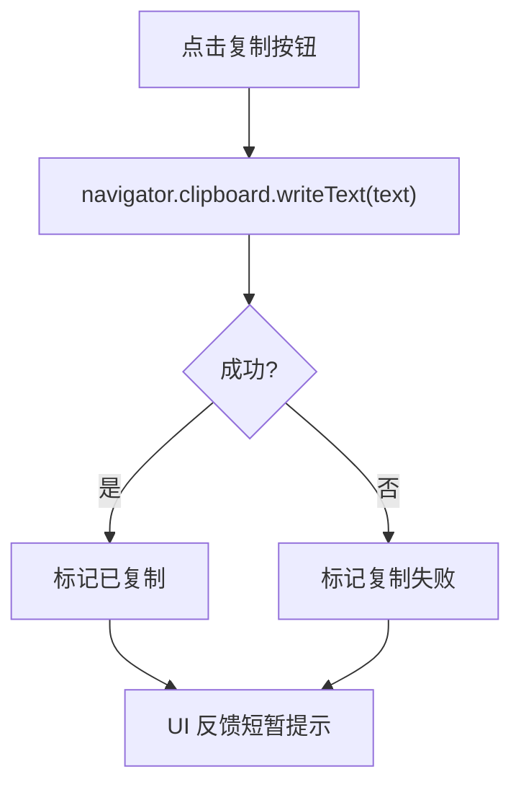
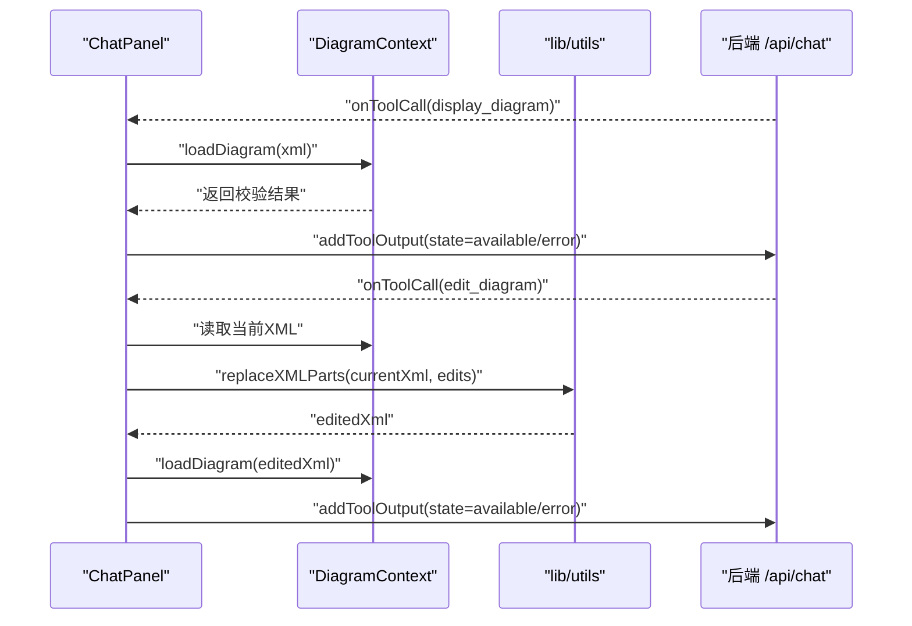
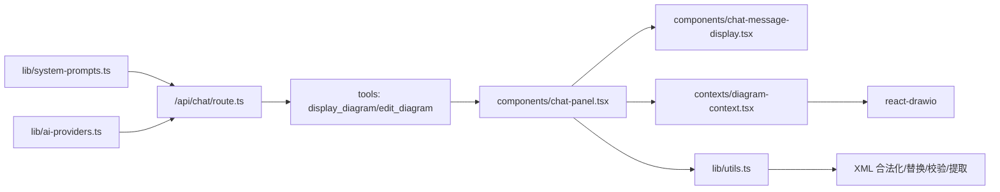

# 工具调用渲染机制

<cite>
**本文引用的文件**
- [README.md](file://README.md)
- [app/page.tsx](file://app/page.tsx)
- [app/api/chat/route.ts](file://app/api/chat/route.ts)
- [components/chat-panel.tsx](file://components/chat-panel.tsx)
- [components/chat-message-display.tsx](file://components/chat-message-display.tsx)
- [components/code-block.tsx](file://components/code-block.tsx)
- [contexts/diagram-context.tsx](file://contexts/diagram-context.tsx)
- [lib/utils.ts](file://lib/utils.ts)
- [lib/system-prompts.ts](file://lib/system-prompts.ts)
- [lib/ai-providers.ts](file://lib/ai-providers.ts)
- [lib/cached-responses.ts](file://lib/cached-responses.ts)
</cite>

## 目录
1. [引言](#引言)
2. [项目结构](#项目结构)
3. [核心组件](#核心组件)
4. [架构总览](#架构总览)
5. [详细组件分析](#详细组件分析)
6. [依赖关系分析](#依赖关系分析)
7. [性能考量](#性能考量)
8. [故障排查指南](#故障排查指南)
9. [结论](#结论)

## 引言
本文件聚焦“工具调用在聊天消息中的渲染流程”，系统性阐述从AI模型返回的工具调用指令（如 display_diagram、edit_diagram）到最终在前端界面中渲染为可视化组件的完整链路。重点覆盖：
- 如何解析并识别工具调用类型与状态（输入流式、输出可用、错误）
- XML 数据如何被安全地传递给 react-drawio 组件进行图表渲染
- 图像复制功能的实现细节
- 工具调用块的 UI 结构：标题、元数据展示区、内容容器布局
- 不同类型工具调用响应的处理方式与最佳实践
- 常见渲染问题的调试方法（XML 解析失败、图表加载超时等）

## 项目结构
该应用采用 Next.js App Router 架构，核心交互围绕“聊天面板 + 图表编辑器”展开。工具调用渲染的关键路径由后端 API 路由生成，前端通过聊天面板与消息显示组件消费，并最终驱动 react-drawio 进行渲染。

图示来源
- [app/api/chat/route.ts](file://app/api/chat/route.ts#L393-L474)
- [components/chat-panel.tsx](file://components/chat-panel.tsx#L141-L260)
- [components/chat-message-display.tsx](file://components/chat-message-display.tsx#L213-L249)
- [contexts/diagram-context.tsx](file://contexts/diagram-context.tsx#L76-L100)
- [app/page.tsx](file://app/page.tsx#L99-L120)

章节来源
- [README.md](file://README.md#L71-L81)
- [app/page.tsx](file://app/page.tsx#L99-L120)

## 核心组件
- 工具调用解析与渲染：ChatMessageDisplay 负责扫描消息中的工具部分，识别工具名称与状态，渲染工具调用块 UI，并在合适时机触发图表渲染。
- 工具调用执行与回传：ChatPanel 在 onToolCall 中根据工具名执行对应逻辑（display_diagram/edit_diagram），并通过 addToolOutput 将结果回传给模型，形成自动重试闭环。
- 图表上下文与渲染：DiagramContext 提供 loadDiagram、handleExport 等能力，负责将 XML 安全注入到 react-drawio，并维护历史与导出回调。
- XML 处理工具：lib/utils 提供 XML 合法化、节点替换、结构校验、SVG→XML 提取等关键能力，确保渲染前的数据质量。
- 系统提示与工具规范：lib/system-prompts 定义了工具调用的约束与最佳实践，指导模型正确生成工具输入。
- AI 提供商配置：lib/ai-providers 指定模型与提供商，影响工具调用的稳定性与能力。

章节来源
- [components/chat-message-display.tsx](file://components/chat-message-display.tsx#L213-L249)
- [components/chat-panel.tsx](file://components/chat-panel.tsx#L141-L260)
- [contexts/diagram-context.tsx](file://contexts/diagram-context.tsx#L76-L100)
- [lib/utils.ts](file://lib/utils.ts#L64-L107)
- [lib/system-prompts.ts](file://lib/system-prompts.ts#L393-L470)
- [lib/ai-providers.ts](file://lib/ai-providers.ts#L112-L160)

## 架构总览
下图展示了工具调用从生成到渲染的端到端流程，包括状态机、前后端交互与错误回传。

图示来源
- [app/api/chat/route.ts](file://app/api/chat/route.ts#L393-L474)
- [components/chat-panel.tsx](file://components/chat-panel.tsx#L141-L260)
- [contexts/diagram-context.tsx](file://contexts/diagram-context.tsx#L76-L100)

## 详细组件分析

### 工具调用块的 UI 结构与渲染
- 工具调用块由 ChatMessageDisplay 渲染，支持三种状态指示：输入流式（旋转指示器）、输出可用（完成标签）、输出错误（错误标签）。
- 输入区域可折叠展开，用于展示工具输入详情（XML 或编辑差异对）；输出区域在错误状态下展示错误文本。
- UI 区域包含：
  - 标题栏：工具图标 + 工具名称（如“Generate Diagram”）
  - 元数据区：状态徽章与展开/收起按钮
  - 内容容器：XML 代码块或编辑差异对比视图

图示来源
- [components/chat-message-display.tsx](file://components/chat-message-display.tsx#L252-L343)
- [components/code-block.tsx](file://components/code-block.tsx#L10-L54)

章节来源
- [components/chat-message-display.tsx](file://components/chat-message-display.tsx#L252-L343)
- [components/code-block.tsx](file://components/code-block.tsx#L10-L54)

### XML 数据安全传递与渲染
- ChatPanel 的 onToolCall 接收工具调用，针对 display_diagram 直接调用 loadDiagram；对于 edit_diagram，先获取当前 XML（优先使用内存缓存，再回退导出），应用替换后再渲染。
- DiagramContext.loadDiagram 在注入前进行结构校验，避免非法 XML 导致渲染失败。
- react-drawio 通过 DrawIoEmbed 组件加载 XML，URL 参数控制主题、加载动画等。

图示来源
- [components/chat-panel.tsx](file://components/chat-panel.tsx#L176-L260)
- [lib/utils.ts](file://lib/utils.ts#L246-L506)
- [contexts/diagram-context.tsx](file://contexts/diagram-context.tsx#L76-L100)
- [app/page.tsx](file://app/page.tsx#L99-L120)

章节来源
- [components/chat-panel.tsx](file://components/chat-panel.tsx#L176-L260)
- [lib/utils.ts](file://lib/utils.ts#L246-L506)
- [contexts/diagram-context.tsx](file://contexts/diagram-context.tsx#L76-L100)
- [app/page.tsx](file://app/page.tsx#L99-L120)

### 图像复制功能实现
- ChatMessageDisplay 提供复制文本到剪贴板的能力，分别支持用户消息与助手回复的复制。
- 成功/失败状态通过本地状态管理并在 UI 上即时反馈。

图示来源
- [components/chat-message-display.tsx](file://components/chat-message-display.tsx#L135-L145)

章节来源
- [components/chat-message-display.tsx](file://components/chat-message-display.tsx#L135-L145)

### 不同类型工具调用的处理流程
- display_diagram
  - ChatPanel.onToolCall 接收 xml，调用 loadDiagram 并通过 addToolOutput 返回状态。
  - ChatMessageDisplay 监听消息中的工具部分，按状态决定是否立即渲染或等待完整输出。
- edit_diagram
  - ChatPanel.onToolCall 获取当前 XML（优先 chartXMLRef，必要时导出），应用 replaceXMLParts 后再次渲染。
  - 若替换导致结构无效，通过 addToolOutput 返回错误状态，模型自动重试。

图示来源
- [components/chat-panel.tsx](file://components/chat-panel.tsx#L141-L260)
- [lib/utils.ts](file://lib/utils.ts#L246-L506)
- [app/api/chat/route.ts](file://app/api/chat/route.ts#L393-L474)

章节来源
- [components/chat-panel.tsx](file://components/chat-panel.tsx#L141-L260)
- [app/api/chat/route.ts](file://app/api/chat/route.ts#L393-L474)

## 依赖关系分析
- 工具定义与流式输出：后端通过 tools 定义 display_diagram 与 edit_diagram，使用 createUIMessageStreamResponse 输出工具输入/输出事件，前端据此更新 UI。
- XML 处理链路：lib/utils 提供 convertToLegalXml、replaceNodes、replaceXMLParts、validateMxCellStructure、extractDiagramXML 等函数，贯穿“合法性修复—结构替换—校验—提取”全流程。
- 图表上下文：DiagramContext 聚合 loadDiagram、handleExport、handleDiagramExport、clearDiagram 等能力，统一管理渲染与导出。
- 系统提示与提供商：lib/system-prompts 为工具调用提供严格约束；lib/ai-providers 选择合适的模型与提供商，影响工具调用的稳定性与能力。

图示来源
- [app/api/chat/route.ts](file://app/api/chat/route.ts#L393-L474)
- [components/chat-panel.tsx](file://components/chat-panel.tsx#L141-L260)
- [components/chat-message-display.tsx](file://components/chat-message-display.tsx#L213-L249)
- [contexts/diagram-context.tsx](file://contexts/diagram-context.tsx#L76-L100)
- [lib/utils.ts](file://lib/utils.ts#L64-L107)
- [lib/system-prompts.ts](file://lib/system-prompts.ts#L393-L470)
- [lib/ai-providers.ts](file://lib/ai-providers.ts#L112-L160)

章节来源
- [app/api/chat/route.ts](file://app/api/chat/route.ts#L393-L474)
- [lib/utils.ts](file://lib/utils.ts#L64-L107)
- [lib/system-prompts.ts](file://lib/system-prompts.ts#L393-L470)
- [lib/ai-providers.ts](file://lib/ai-providers.ts#L112-L160)

## 性能考量
- 流式渲染：ChatMessageDisplay 在工具输入处于“input-streaming”阶段即尝试渲染，提升交互体验；当 state 为“output-available”且未处理过时才最终渲染，避免重复注入。
- 内存优先：edit_diagram 优先使用 chartXMLRef 缓存的 XML，减少导出开销；仅在无缓存时回退到导出。
- 结构校验前置：loadDiagram 与 replaceXMLParts 均进行结构校验，提前发现并阻止无效 XML 注入，降低渲染失败概率。
- 主题切换：DrawIoEmbed 支持 ui 参数切换主题，避免不必要的重载。

章节来源
- [components/chat-message-display.tsx](file://components/chat-message-display.tsx#L175-L199)
- [components/chat-panel.tsx](file://components/chat-panel.tsx#L176-L204)
- [contexts/diagram-context.tsx](file://contexts/diagram-context.tsx#L76-L100)
- [app/page.tsx](file://app/page.tsx#L99-L120)

## 故障排查指南
- XML 解析失败
  - 现象：validateMxCellStructure 返回错误信息，提示嵌套 mxCell、重复 ID、孤儿节点、无效父引用、边连接无效、orphaned mxPoint 等。
  - 处理：依据错误提示修正 XML；必要时使用 convertToLegalXml 进行合法性修复；确保所有 mxCell 为根元素直接子节点，唯一 ID，有效父引用，边连接引用现有 ID。
  - 参考
    - [lib/utils.ts](file://lib/utils.ts#L513-L643)
    - [lib/utils.ts](file://lib/utils.ts#L64-L107)
- 图表加载超时
  - 现象：导出环节 Promise 超时（默认 10 秒）。
  - 处理：检查网络环境与提供商稳定性；适当增加超时时间或重试；确认 react-drawio 加载完成（isDrawioReady）后再触发导出。
  - 参考
    - [components/chat-panel.tsx](file://components/chat-panel.tsx#L65-L89)
    - [contexts/diagram-context.tsx](file://contexts/diagram-context.tsx#L44-L51)
- 工具调用错误回传
  - 现象：state=output-error，模型自动重试。
  - 处理：在 ChatPanel.onToolCall 中捕获错误并 addToolOutput，携带当前 XML 以便模型定位问题；必要时改用 display_diagram 重新生成。
  - 参考
    - [components/chat-panel.tsx](file://components/chat-panel.tsx#L141-L260)
- 编辑差异匹配失败
  - 现象：replaceXMLParts 报错“搜索模式未找到”。
  - 处理：严格遵循系统提示要求，复制精确的完整行（含属性顺序），必要时扩大上下文；最多三次重试后改用 display_diagram。
  - 参考
    - [lib/system-prompts.ts](file://lib/system-prompts.ts#L196-L240)
    - [lib/utils.ts](file://lib/utils.ts#L246-L506)

## 结论
本项目的工具调用渲染机制通过“后端工具定义 + 前端消息解析 + 图表上下文注入 + 安全 XML 处理”的闭环，实现了从模型指令到可视化的稳定落地。关键在于：
- 明确的状态机与 UI 展示，使用户清晰感知工具调用进展
- 前置校验与合法性修复，显著降低渲染失败率
- 内存优先的编辑策略与错误回传机制，提升交互可靠性
- react-drawio 的无缝集成，保障渲染性能与一致性