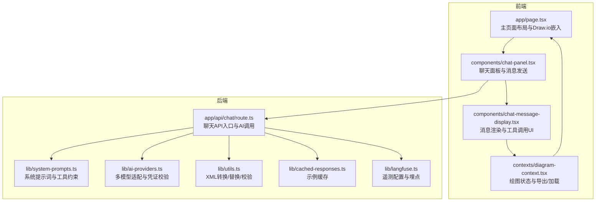
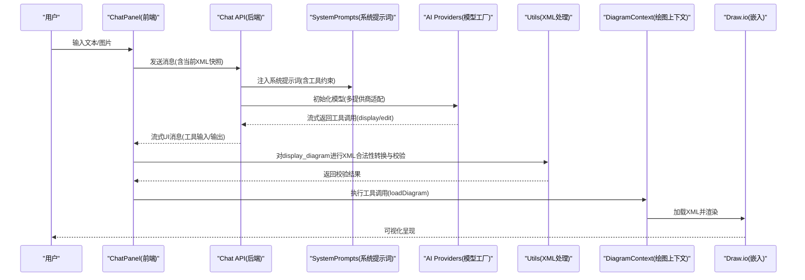
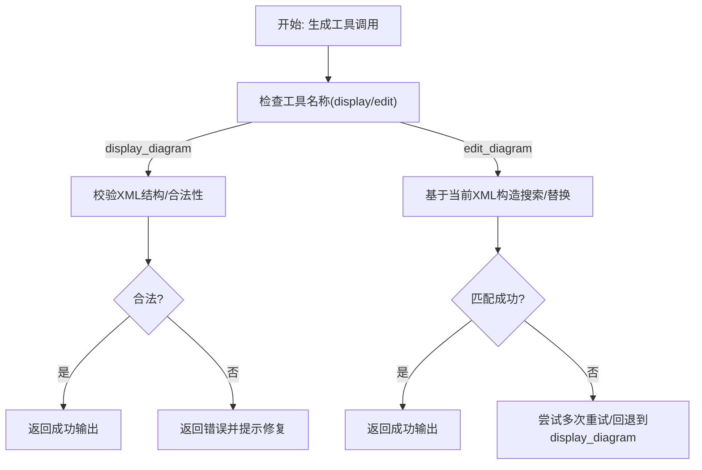
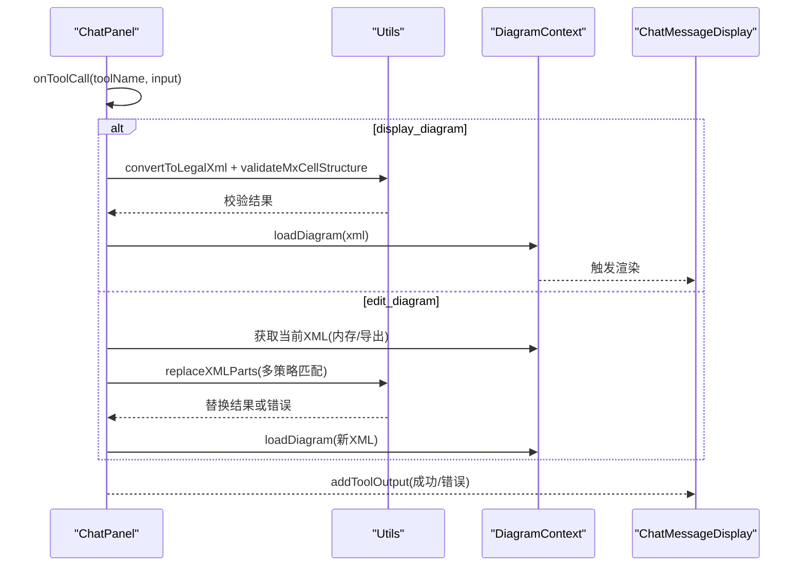
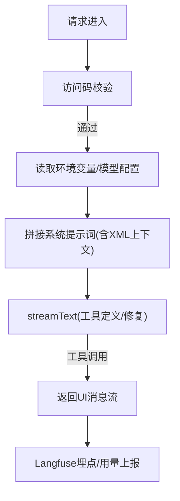
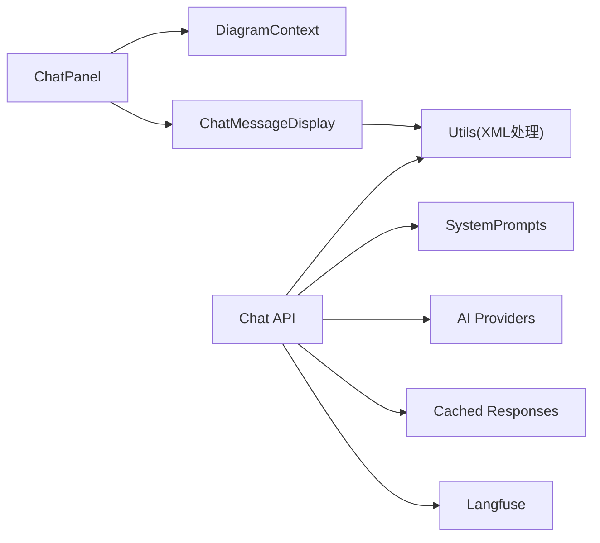

# 数据流与集成

<cite>
**本文引用的文件**
- [app/page.tsx](file://app/page.tsx)
- [app/api/chat/route.ts](file://app/api/chat/route.ts)
- [lib/system-prompts.ts](file://lib/system-prompts.ts)
- [lib/ai-providers.ts](file://lib/ai-providers.ts)
- [lib/utils.ts](file://lib/utils.ts)
- [lib/cached-responses.ts](file://lib/cached-responses.ts)
- [lib/langfuse.ts](file://lib/langfuse.ts)
- [contexts/diagram-context.tsx](file://contexts/diagram-context.tsx)
- [components/chat-panel.tsx](file://components/chat-panel.tsx)
- [components/chat-message-display.tsx](file://components/chat-message-display.tsx)
- [app/api/chat/xml_guide.md](file://app/api/chat/xml_guide.md)
</cite>

## 目录
1. [简介](#简介)
2. [项目结构](#项目结构)
3. [核心组件](#核心组件)
4. [架构总览](#架构总览)
5. [详细组件分析](#详细组件分析)
6. [依赖关系分析](#依赖关系分析)
7. [性能考量](#性能考量)
8. [故障排查指南](#故障排查指南)
9. [结论](#结论)
10. [附录：扩展新工具调用类型](#附录扩展新工具调用类型)

## 简介
本文件面向“从AI模型输出到前端可视化的完整数据流”，系统性阐述以下要点：
- AI模型如何通过系统提示词（system-prompts）生成符合draw.io XML规范的工具调用指令；
- 前端如何接收、解析并执行这些工具调用，最终驱动绘图编辑器渲染；
- 系统提示词在引导AI生成正确格式中的关键作用；
- 错误处理与降级显示策略（例如无效工具调用参数时的回退与提示）；
- 结合实际请求/响应示例，给出端到端的数据流转路径；
- 提供扩展新的工具调用类型的实践指南。

## 项目结构
该应用采用Next.js App Router组织，前后端职责清晰：
- 前端负责用户交互、消息展示、工具调用结果处理与绘图编辑器集成；
- 后端负责AI模型选择、系统提示词注入、工具定义与调用修复、缓存与遥测。

图表来源
- [app/page.tsx](file://app/page.tsx#L1-L162)
- [components/chat-panel.tsx](file://components/chat-panel.tsx#L1-L200)
- [components/chat-message-display.tsx](file://components/chat-message-display.tsx#L1-L120)
- [contexts/diagram-context.tsx](file://contexts/diagram-context.tsx#L1-L120)
- [app/api/chat/route.ts](file://app/api/chat/route.ts#L1-L120)
- [lib/system-prompts.ts](file://lib/system-prompts.ts#L1-L120)
- [lib/ai-providers.ts](file://lib/ai-providers.ts#L1-L120)
- [lib/utils.ts](file://lib/utils.ts#L1-L120)
- [lib/cached-responses.ts](file://lib/cached-responses.ts#L1-L80)
- [lib/langfuse.ts](file://lib/langfuse.ts#L1-L60)

章节来源
- [app/page.tsx](file://app/page.tsx#L1-L162)
- [components/chat-panel.tsx](file://components/chat-panel.tsx#L1-L200)
- [app/api/chat/route.ts](file://app/api/chat/route.ts#L1-L120)

## 核心组件
- 系统提示词与工具约束：通过系统提示词明确工具名称、输入格式、XML结构规则与错误恢复策略，确保AI输出严格遵循draw.io XML规范。
- 多模型适配：统一的AI模型工厂，支持多种提供商与自定义端点，自动检测与凭证校验。
- 工具定义与修复：在后端定义display_diagram与edit_diagram工具，并对模型可能产生的非标准JSON进行修复；前端在收到工具调用时执行本地验证与回退。
- XML处理工具：提供XML合法性转换、节点替换、结构校验等能力，保障渲染前的XML质量。
- 绘图上下文：封装导出/加载、历史记录、保存文件等功能，作为前端可视化层的核心数据源。

章节来源
- [lib/system-prompts.ts](file://lib/system-prompts.ts#L1-L120)
- [lib/ai-providers.ts](file://lib/ai-providers.ts#L1-L120)
- [app/api/chat/route.ts](file://app/api/chat/route.ts#L393-L471)
- [lib/utils.ts](file://lib/utils.ts#L1-L120)
- [contexts/diagram-context.tsx](file://contexts/diagram-context.tsx#L1-L120)

## 架构总览
下图展示了从用户输入到绘图渲染的端到端流程，包括工具调用生成、传输、解析与执行。

图表来源
- [components/chat-panel.tsx](file://components/chat-panel.tsx#L130-L210)
- [app/api/chat/route.ts](file://app/api/chat/route.ts#L393-L471)
- [lib/system-prompts.ts](file://lib/system-prompts.ts#L1-L120)
- [lib/ai-providers.ts](file://lib/ai-providers.ts#L1-L120)
- [lib/utils.ts](file://lib/utils.ts#L1-L120)
- [contexts/diagram-context.tsx](file://contexts/diagram-context.tsx#L70-L120)

## 详细组件分析

### 系统提示词与工具约束
- 明确工具清单与用途：display_diagram用于全新或重大结构调整；edit_diagram用于局部修改。
- 严格的XML结构要求：根元素、mxCell层级、唯一ID、父子关系、边连接、特殊字符转义等。
- 搜索/替换模式的精确性与可恢复策略：提供多次重试与回退到display_diagram的路径。
- 面向不同模型的提示词长度策略：根据模型缓存上限选择默认或扩展版提示词。

图表来源
- [lib/system-prompts.ts](file://lib/system-prompts.ts#L1-L120)
- [app/api/chat/route.ts](file://app/api/chat/route.ts#L393-L471)
- [lib/utils.ts](file://lib/utils.ts#L508-L711)

章节来源
- [lib/system-prompts.ts](file://lib/system-prompts.ts#L1-L120)
- [app/api/chat/route.ts](file://app/api/chat/route.ts#L393-L471)

### 前端工具调用解析与执行
- ChatPanel监听工具调用事件，分别处理display_diagram与edit_diagram：
  - display_diagram：先进行XML合法性转换与结构校验，再加载到绘图上下文；若失败则将错误作为工具输出返回给模型以触发重试。
  - edit_diagram：优先使用内存中的最新XML，必要时通过导出接口获取；对搜索/替换进行多策略匹配，失败时返回错误并建议调整或回退到display_diagram。
- ChatMessageDisplay负责渲染工具调用UI、展开/折叠、复制与反馈收集。

图表来源
- [components/chat-panel.tsx](file://components/chat-panel.tsx#L130-L260)
- [components/chat-message-display.tsx](file://components/chat-message-display.tsx#L200-L340)
- [lib/utils.ts](file://lib/utils.ts#L240-L507)
- [contexts/diagram-context.tsx](file://contexts/diagram-context.tsx#L70-L120)

章节来源
- [components/chat-panel.tsx](file://components/chat-panel.tsx#L130-L260)
- [components/chat-message-display.tsx](file://components/chat-message-display.tsx#L200-L340)
- [lib/utils.ts](file://lib/utils.ts#L240-L507)
- [contexts/diagram-context.tsx](file://contexts/diagram-context.tsx#L70-L120)

### 后端模型调用与工具修复
- 模型初始化：根据环境变量自动检测或显式指定提供商，校验凭证，支持自定义端点。
- 系统提示词注入：按模型特性选择默认或扩展提示词，同时注入当前XML上下文。
- 工具定义：在后端声明工具schema，前端据此生成工具调用；后端对模型可能产生的非标准JSON进行修复。
- 缓存策略：针对首次空图场景，命中示例缓存可直接返回工具输入流，提升首响应速度。
- 遥测：通过Langfuse记录会话、用户与用量信息。

图表来源
- [app/api/chat/route.ts](file://app/api/chat/route.ts#L144-L214)
- [lib/ai-providers.ts](file://lib/ai-providers.ts#L112-L180)
- [lib/system-prompts.ts](file://lib/system-prompts.ts#L342-L371)
- [lib/cached-responses.ts](file://lib/cached-responses.ts#L551-L562)
- [lib/langfuse.ts](file://lib/langfuse.ts#L29-L76)

章节来源
- [app/api/chat/route.ts](file://app/api/chat/route.ts#L144-L214)
- [lib/ai-providers.ts](file://lib/ai-providers.ts#L112-L180)
- [lib/system-prompts.ts](file://lib/system-prompts.ts#L342-L371)
- [lib/cached-responses.ts](file://lib/cached-responses.ts#L551-L562)
- [lib/langfuse.ts](file://lib/langfuse.ts#L29-L76)

### 实际请求/响应示例（端到端）
- 请求阶段
  - 前端在提交消息时，携带当前XML快照与会话ID，并附带访问码头。
  - 后端对文件数量/大小进行校验，注入系统提示词与XML上下文，调用模型并开启工具修复。
- 响应阶段
  - 后端以UI消息流形式返回工具输入增量与可用输入，前端在工具输入完成时触发渲染。
  - 若工具调用失败，后端返回错误输出，前端将其作为系统消息展示并允许用户重试。

章节来源
- [components/chat-panel.tsx](file://components/chat-panel.tsx#L449-L506)
- [app/api/chat/route.ts](file://app/api/chat/route.ts#L188-L214)
- [app/api/chat/route.ts](file://app/api/chat/route.ts#L341-L392)

### 错误处理与降级策略
- 工具调用修复：当模型输出的工具调用JSON存在未转义引号等语法问题时，后端尝试修复为合法JSON。
- 前端校验与回退：display_diagram在加载前进行结构合法性校验；edit_diagram在搜索/替换失败时返回错误并建议调整或回退到display_diagram。
- 访问控制：若缺少或无效访问码，后端拒绝请求并在前端弹出设置对话框。
- 会话持久化：前端将消息、XML快照与会话ID写入localStorage，便于刷新/关闭后恢复。

章节来源
- [app/api/chat/route.ts](file://app/api/chat/route.ts#L355-L379)
- [components/chat-panel.tsx](file://components/chat-panel.tsx#L141-L176)
- [components/chat-panel.tsx](file://components/chat-panel.tsx#L176-L238)
- [components/chat-panel.tsx](file://components/chat-panel.tsx#L261-L287)

## 依赖关系分析
- 前端依赖
  - ChatPanel依赖useChat与工具回调，依赖DiagramContext进行XML加载与导出。
  - ChatMessageDisplay依赖工具调用UI渲染与XML处理工具。
  - 页面布局依赖Draw.io嵌入组件与可调整面板。
- 后端依赖
  - Chat API依赖系统提示词、AI模型工厂、XML处理工具、缓存与遥测。
  - 多提供商适配通过统一工厂函数实现，避免前端感知差异。

图表来源
- [components/chat-panel.tsx](file://components/chat-panel.tsx#L1-L120)
- [components/chat-message-display.tsx](file://components/chat-message-display.tsx#L1-L120)
- [contexts/diagram-context.tsx](file://contexts/diagram-context.tsx#L1-L120)
- [app/api/chat/route.ts](file://app/api/chat/route.ts#L1-L120)
- [lib/system-prompts.ts](file://lib/system-prompts.ts#L1-L120)
- [lib/ai-providers.ts](file://lib/ai-providers.ts#L1-L120)
- [lib/utils.ts](file://lib/utils.ts#L1-L120)
- [lib/cached-responses.ts](file://lib/cached-responses.ts#L1-L80)
- [lib/langfuse.ts](file://lib/langfuse.ts#L1-L60)

章节来源
- [components/chat-panel.tsx](file://components/chat-panel.tsx#L1-L120)
- [components/chat-message-display.tsx](file://components/chat-message-display.tsx#L1-L120)
- [contexts/diagram-context.tsx](file://contexts/diagram-context.tsx#L1-L120)
- [app/api/chat/route.ts](file://app/api/chat/route.ts#L1-L120)

## 性能考量
- 缓存优化：首次空图且满足条件时命中示例缓存，直接返回工具输入流，减少模型调用与延迟。
- XML处理：在前端进行合法性转换与结构校验，避免无效XML导致的渲染失败与重试成本。
- 会话与持久化：将消息与XML快照写入localStorage，降低刷新/关闭后的重建开销。
- 遥测与用量：通过Langfuse记录用量指标，辅助定位性能瓶颈与异常。

章节来源
- [lib/cached-responses.ts](file://lib/cached-responses.ts#L551-L562)
- [lib/utils.ts](file://lib/utils.ts#L56-L107)
- [lib/langfuse.ts](file://lib/langfuse.ts#L29-L76)
- [components/chat-panel.tsx](file://components/chat-panel.tsx#L369-L413)

## 故障排查指南
- 访问码问题
  - 现象：后端返回401，前端弹出设置对话框。
  - 处理：在设置中配置访问码列表，重新提交请求。
- 工具调用失败
  - display_diagram：检查XML是否包含非法字符、mxCell是否为根节点直系子元素、是否存在重复ID或无效父引用。
  - edit_diagram：确认搜索模式是否唯一、属性顺序是否与当前XML一致、是否包含必要的上下文行。
- 模型输出修复
  - 后端已内置修复逻辑，若仍失败，建议调整提示词或降低复杂度。
- 导出/加载异常
  - 确认Draw.io嵌入组件已就绪，必要时等待onLoad回调后再进行导出/加载。

章节来源
- [app/api/chat/route.ts](file://app/api/chat/route.ts#L144-L161)
- [components/chat-panel.tsx](file://components/chat-panel.tsx#L141-L176)
- [lib/utils.ts](file://lib/utils.ts#L508-L711)
- [contexts/diagram-context.tsx](file://contexts/diagram-context.tsx#L44-L75)

## 结论
本系统通过“严格的系统提示词约束 + 多模型适配 + 前后端协同的XML处理与工具修复 + 完善的错误回退与缓存策略”，实现了从AI模型输出到前端可视化的稳定闭环。前端负责工具调用解析与渲染，后端负责模型调度与工具修复，二者配合确保了生成XML的合法性与可渲染性，同时提供了良好的用户体验与可观测性。

## 附录：扩展新工具调用类型
- 步骤一：在后端定义工具schema
  - 在聊天API中新增工具定义，明确描述、输入参数与校验规则。
  - 参考现有工具定义位置与输入schema写法。
- 步骤二：在前端注册工具回调
  - 在ChatPanel的onToolCall中添加新工具分支，执行相应的XML处理或绘图操作。
  - 将工具调用结果通过addToolOutput返回，前端自动渲染工具UI。
- 步骤三：补充系统提示词
  - 在系统提示词中增加新工具的使用说明、输入格式与错误恢复策略。
- 步骤四：测试与验证
  - 使用最小可复现示例验证工具调用是否被正确生成、解析与执行。
  - 关注错误回退路径与用户体验提示文案。

章节来源
- [app/api/chat/route.ts](file://app/api/chat/route.ts#L393-L471)
- [components/chat-panel.tsx](file://components/chat-panel.tsx#L130-L176)
- [lib/system-prompts.ts](file://lib/system-prompts.ts#L1-L120)