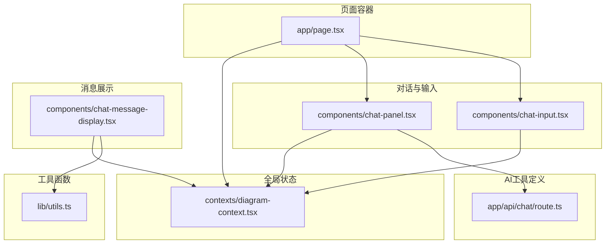
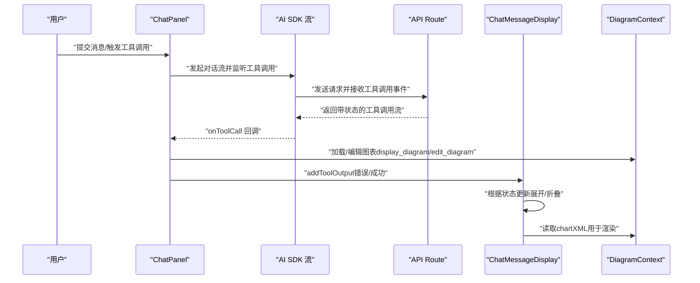
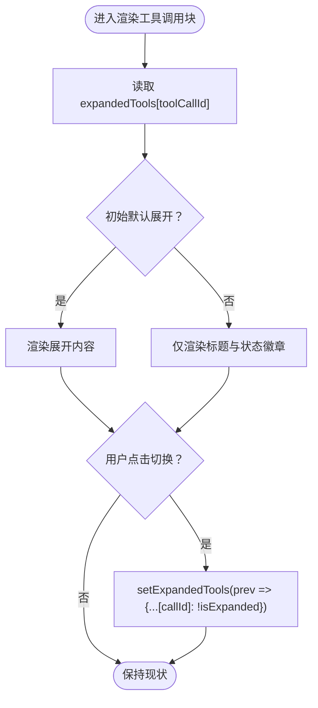
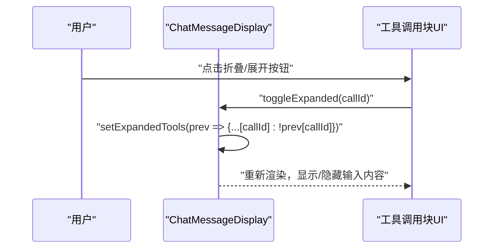
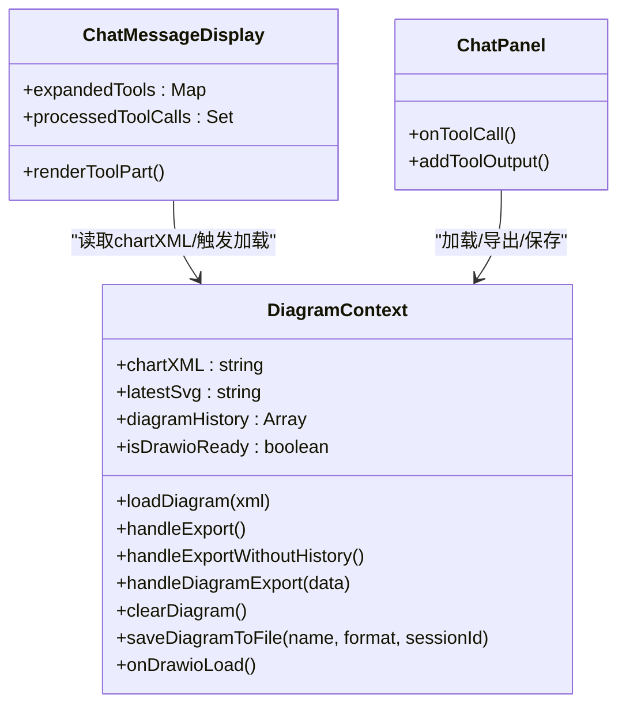
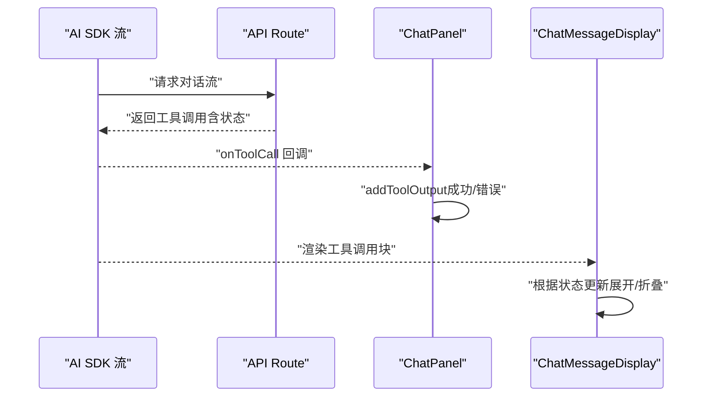
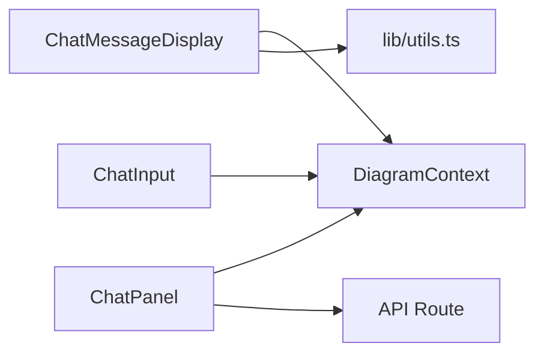

# 状态与交互管理

<cite>
**本文引用的文件**
- [app/page.tsx](file://app/page.tsx)
- [contexts/diagram-context.tsx](file://contexts/diagram-context.tsx)
- [components/chat-panel.tsx](file://components/chat-panel.tsx)
- [components/chat-message-display.tsx](file://components/chat-message-display.tsx)
- [components/chat-input.tsx](file://components/chat-input.tsx)
- [app/api/chat/route.ts](file://app/api/chat/route.ts)
- [lib/utils.ts](file://lib/utils.ts)
</cite>

## 目录
1. [引言](#引言)
2. [项目结构](#项目结构)
3. [核心组件](#核心组件)
4. [架构总览](#架构总览)
5. [详细组件分析](#详细组件分析)
6. [依赖关系分析](#依赖关系分析)
7. [性能考量](#性能考量)
8. [故障排查指南](#故障排查指南)
9. [结论](#结论)

## 引言
本文件围绕“工具调用的展开/折叠状态管理”进行系统化说明，重点覆盖：
- 如何使用React状态管理工具调用块的可见性（展开/折叠）
- 用户点击触发的交互逻辑与状态变更路径
- 状态变更对UI重渲染的影响与性能优化策略
- 工具调用元数据（如调用ID、执行状态）的存储与更新策略
- 结合DiagramContext，说明全局状态与局部UI状态的协同工作机制
- 状态同步异常的排查指南

## 项目结构
该应用采用“上下文 + 组件”的分层组织方式：全局状态通过DiagramContext集中管理，对话面板与消息展示组件分别承担UI状态与业务逻辑职责；API层负责工具调用的定义与修复。

图表来源
- [app/page.tsx](file://app/page.tsx#L1-L162)
- [contexts/diagram-context.tsx](file://contexts/diagram-context.tsx#L1-L268)
- [components/chat-panel.tsx](file://components/chat-panel.tsx#L1-L816)
- [components/chat-message-display.tsx](file://components/chat-message-display.tsx#L1-L747)
- [components/chat-input.tsx](file://components/chat-input.tsx#L1-L481)
- [app/api/chat/route.ts](file://app/api/chat/route.ts#L1-L495)
- [lib/utils.ts](file://lib/utils.ts#L1-L711)

章节来源
- [app/page.tsx](file://app/page.tsx#L1-L162)
- [contexts/diagram-context.tsx](file://contexts/diagram-context.tsx#L1-L268)

## 核心组件
- DiagramContext：提供全局的图表状态（XML、SVG、历史）、导出/保存、加载等能力，并暴露回调给子组件使用。
- ChatPanel：负责对话流、工具调用处理、消息持久化、编辑/重生成等交互。
- ChatMessageDisplay：负责渲染消息、工具调用块的展开/折叠、反馈、复制等。
- ChatInput：负责输入栏、文件上传、清空会话、保存、主题切换、历史按钮等。
- API Route：定义display_diagram/edit_diagram工具，修复模型输出中的工具调用问题，生成带状态的消息流。
- 工具函数：包含XML格式化、合法性校验、节点替换、XML提取等。

章节来源
- [contexts/diagram-context.tsx](file://contexts/diagram-context.tsx#L1-L268)
- [components/chat-panel.tsx](file://components/chat-panel.tsx#L1-L816)
- [components/chat-message-display.tsx](file://components/chat-message-display.tsx#L1-L747)
- [components/chat-input.tsx](file://components/chat-input.tsx#L1-L481)
- [app/api/chat/route.ts](file://app/api/chat/route.ts#L1-L495)
- [lib/utils.ts](file://lib/utils.ts#L1-L711)

## 架构总览
下图展示了从用户交互到工具调用状态更新的端到端流程，包括状态在全局与局部之间的流转。

图表来源
- [components/chat-panel.tsx](file://components/chat-panel.tsx#L140-L260)
- [app/api/chat/route.ts](file://app/api/chat/route.ts#L354-L379)
- [components/chat-message-display.tsx](file://components/chat-message-display.tsx#L213-L249)
- [contexts/diagram-context.tsx](file://contexts/diagram-context.tsx#L101-L134)

## 详细组件分析

### 工具调用展开/折叠状态管理
- 展开/折叠状态由ChatMessageDisplay维护，键为工具调用ID（toolCallId），值为布尔，表示当前是否展开。
- 初始默认展开，当收到“输出可用”状态时自动折叠，避免信息过载。
- 用户点击“折叠/展开”按钮切换对应ID的状态。

图表来源
- [components/chat-message-display.tsx](file://components/chat-message-display.tsx#L252-L318)
- [components/chat-message-display.tsx](file://components/chat-message-display.tsx#L221-L226)

章节来源
- [components/chat-message-display.tsx](file://components/chat-message-display.tsx#L213-L318)

### 用户点击交互与状态变更路径
- 折叠/展开按钮绑定toggleExpanded，直接修改expandedTools映射。
- 当收到“输出可用”状态时，组件将该工具调用标记为已处理，避免重复渲染；同时设置默认折叠。
- 该状态变更触发组件内部重渲染，从而更新UI。

图表来源
- [components/chat-message-display.tsx](file://components/chat-message-display.tsx#L252-L318)

章节来源
- [components/chat-message-display.tsx](file://components/chat-message-display.tsx#L252-L318)

### 工具调用元数据（调用ID、执行状态）的存储与更新
- 调用ID：toolCallId来自AI SDK流，作为expandedTools的键。
- 执行状态：input-streaming/input-available/output-available/output-error等，用于UI徽章与行为控制。
- 存储位置：
  - 局部UI状态：expandedTools（组件内useState）
  - 全局状态：chartXML（DiagramContext），用于渲染与编辑
- 更新策略：
  - 收到“输出可用”时，组件记录processedToolCalls，避免重复处理
  - 根据状态自动折叠或保持展开
  - 错误状态通过addToolOutput回传给模型，支持自动重试

章节来源
- [components/chat-message-display.tsx](file://components/chat-message-display.tsx#L213-L249)
- [components/chat-panel.tsx](file://components/chat-panel.tsx#L140-L260)
- [app/api/chat/route.ts](file://app/api/chat/route.ts#L354-L379)

### 全局状态与局部UI状态的协同（DiagramContext）
- 全局状态（DiagramContext）：
  - chartXML：当前图表XML，驱动Draw.io渲染与编辑
  - diagramHistory：导出历史，供历史对话/保存使用
  - isDrawioReady：Draw.io就绪标志，决定是否恢复本地保存的XML
- 局部UI状态（ChatMessageDisplay）：
  - expandedTools：工具调用块的展开/折叠
  - processedToolCalls：已处理的工具调用集合，避免重复渲染
- 协同机制：
  - ChatMessageDisplay在收到工具调用输入时，先进行合法性转换与替换，再调用DiagramContext.loadDiagram加载
  - ChatPanel在工具调用阶段通过addToolOutput向模型回传结果，支持自动重试
  - 页面级Home组件通过DiagramContext.onDrawioLoad与handleDiagramExport协调Draw.io生命周期与导出回调

图表来源
- [contexts/diagram-context.tsx](file://contexts/diagram-context.tsx#L1-L268)
- [components/chat-message-display.tsx](file://components/chat-message-display.tsx#L1-L200)
- [components/chat-panel.tsx](file://components/chat-panel.tsx#L140-L260)

章节来源
- [contexts/diagram-context.tsx](file://contexts/diagram-context.tsx#L1-L268)
- [components/chat-message-display.tsx](file://components/chat-message-display.tsx#L1-L200)
- [components/chat-panel.tsx](file://components/chat-panel.tsx#L140-L260)

### 工具调用在对话流中的生命周期
- API Route定义工具：display_diagram与edit_diagram，修复模型输出中的工具调用格式，确保输入为对象而非字符串。
- ChatPanel监听onToolCall，根据工具名执行相应逻辑：加载/验证XML、编辑XML、回传结果。
- ChatMessageDisplay根据状态渲染工具调用块，并在“输出可用”时自动折叠。

图表来源
- [app/api/chat/route.ts](file://app/api/chat/route.ts#L393-L471)
- [components/chat-panel.tsx](file://components/chat-panel.tsx#L140-L260)
- [components/chat-message-display.tsx](file://components/chat-message-display.tsx#L213-L249)

章节来源
- [app/api/chat/route.ts](file://app/api/chat/route.ts#L354-L379)
- [components/chat-panel.tsx](file://components/chat-panel.tsx#L140-L260)
- [components/chat-message-display.tsx](file://components/chat-message-display.tsx#L213-L249)

## 依赖关系分析
- 组件耦合：
  - ChatMessageDisplay依赖DiagramContext读取chartXML，用于渲染与替换节点
  - ChatPanel依赖DiagramContext执行图表加载/导出/保存
  - ChatInput依赖DiagramContext进行保存与历史按钮
- 外部依赖：
  - AI SDK：提供对话流、工具调用监听、自动重试条件
  - react-drawio：提供导出/加载回调，配合DiagramContext完成状态同步

图表来源
- [components/chat-message-display.tsx](file://components/chat-message-display.tsx#L1-L120)
- [components/chat-panel.tsx](file://components/chat-panel.tsx#L1-L120)
- [components/chat-input.tsx](file://components/chat-input.tsx#L1-L120)
- [lib/utils.ts](file://lib/utils.ts#L1-L120)

章节来源
- [components/chat-message-display.tsx](file://components/chat-message-display.tsx#L1-L120)
- [components/chat-panel.tsx](file://components/chat-panel.tsx#L1-L120)
- [components/chat-input.tsx](file://components/chat-input.tsx#L1-L120)
- [lib/utils.ts](file://lib/utils.ts#L1-L120)

## 性能考量
- 同步更新与重渲染：
  - 在“重生成/编辑消息”场景中，使用flushSync确保状态更新在发送新消息前完成，避免竞态与UI闪烁
  - 局部UI状态（expandedTools）仅影响工具调用块的渲染，不会触发全局图表重绘
- 导出与渲染：
  - 使用Promise.race限制图表导出超时，避免阻塞UI
  - 通过ref缓存chartXML，减少不必要的解析与渲染
- 缓存与修复：
  - API Route对工具调用输入进行修复，降低无效重试与失败率
  - ChatMessageDisplay在渲染前进行XML合法性检查与节点替换，减少错误导致的重试

章节来源
- [components/chat-panel.tsx](file://components/chat-panel.tsx#L565-L570)
- [components/chat-panel.tsx](file://components/chat-panel.tsx#L627-L631)
- [components/chat-panel.tsx](file://components/chat-panel.tsx#L449-L506)
- [app/api/chat/route.ts](file://app/api/chat/route.ts#L354-L379)
- [components/chat-message-display.tsx](file://components/chat-message-display.tsx#L175-L199)

## 故障排查指南
- 症状：工具调用块未按预期展开/折叠
  - 检查expandedTools映射是否正确写入toolCallId
  - 确认“输出可用”状态是否触发了默认折叠逻辑
  - 参考路径：[components/chat-message-display.tsx](file://components/chat-message-display.tsx#L221-L226)
- 症状：工具调用重复渲染或重复处理
  - 检查processedToolCalls集合是否正确记录与去重
  - 参考路径：[components/chat-message-display.tsx](file://components/chat-message-display.tsx#L240-L244)
- 症状：图表未更新或渲染异常
  - 检查DiagramContext.loadDiagram是否被调用且XML合法性校验通过
  - 确认ChatMessageDisplay的handleDisplayChart是否执行了合法性转换与节点替换
  - 参考路径：[contexts/diagram-context.tsx](file://contexts/diagram-context.tsx#L76-L99)，[components/chat-message-display.tsx](file://components/chat-message-display.tsx#L175-L199)
- 症状：工具调用失败但未自动重试
  - 检查API Route的experimental_repairToolCall是否生效
  - 确认ChatPanel的addToolOutput是否正确回传错误状态
  - 参考路径：[app/api/chat/route.ts](file://app/api/chat/route.ts#L354-L379)，[components/chat-panel.tsx](file://components/chat-panel.tsx#L140-L260)
- 症状：导出超时或UI卡顿
  - 检查Promise.race的超时时间与resolverRef的使用
  - 参考路径：[components/chat-panel.tsx](file://components/chat-panel.tsx#L65-L89)
- 症状：主题切换或清空会话后状态不一致
  - 检查localStorage持久化与restore逻辑
  - 参考路径：[components/chat-panel.tsx](file://components/chat-panel.tsx#L328-L367)，[app/page.tsx](file://app/page.tsx#L1-L162)

章节来源
- [components/chat-message-display.tsx](file://components/chat-message-display.tsx#L213-L249)
- [contexts/diagram-context.tsx](file://contexts/diagram-context.tsx#L76-L99)
- [app/api/chat/route.ts](file://app/api/chat/route.ts#L354-L379)
- [components/chat-panel.tsx](file://components/chat-panel.tsx#L65-L89)
- [app/page.tsx](file://app/page.tsx#L1-L162)

## 结论
- 工具调用的展开/折叠通过局部UI状态（expandedTools）与工具调用状态（input-streaming/output-available等）协同实现，保证交互直观且性能稳定。
- 全局状态（chartXML、diagramHistory、isDrawioReady）由DiagramContext统一管理，局部UI状态与全局状态边界清晰，避免跨组件的隐式耦合。
- 通过flushSync、Promise.race、ref缓存与工具调用修复等手段，有效提升交互一致性与用户体验。
- 若出现状态不同步问题，建议从expandedTools映射、processedToolCalls去重、loadDiagram合法性校验、导出超时与localStorage恢复等关键路径逐一排查。