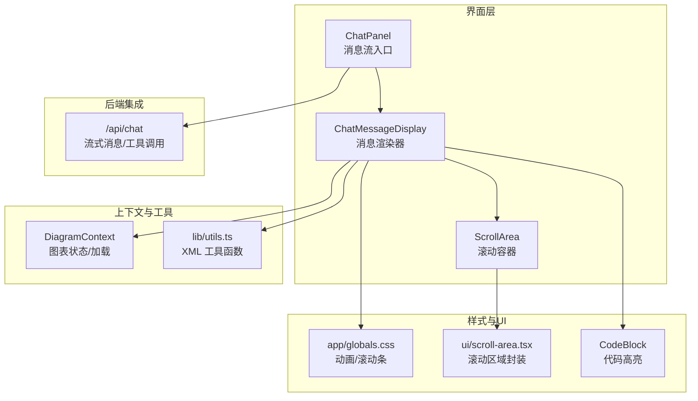
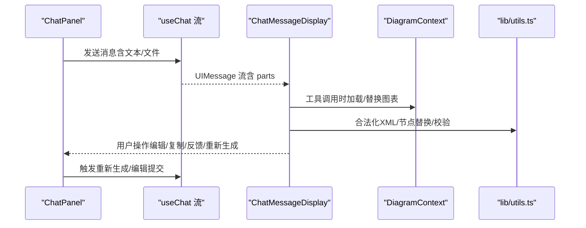
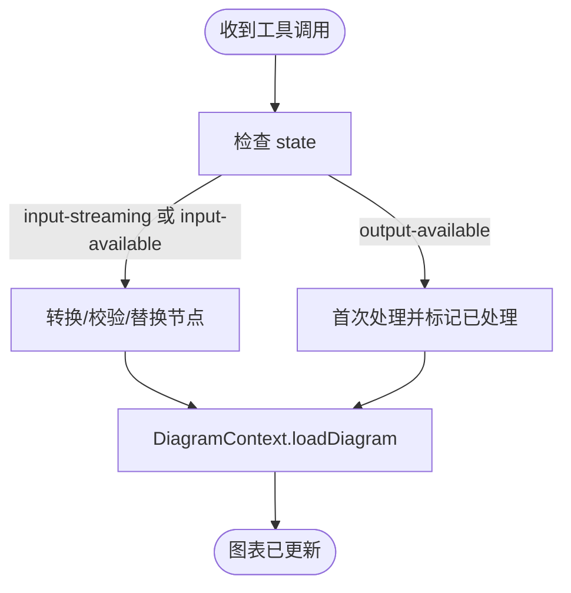
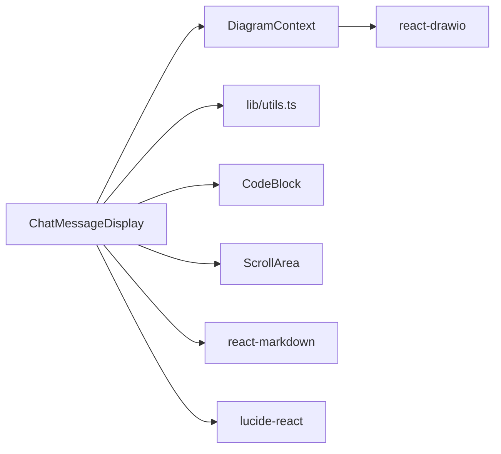

# 消息显示

<cite>
**本文引用的文件**
- [components/chat-message-display.tsx](file://components/chat-message-display.tsx)
- [components/code-block.tsx](file://components/code-block.tsx)
- [contexts/diagram-context.tsx](file://contexts/diagram-context.tsx)
- [components/chat-panel.tsx](file://components/chat-panel.tsx)
- [lib/utils.ts](file://lib/utils.ts)
- [app/globals.css](file://app/globals.css)
- [components/ui/scroll-area.tsx](file://components/ui/scroll-area.tsx)
- [app/api/chat/route.ts](file://app/api/chat/route.ts)
</cite>

## 目录
1. [简介](#简介)
2. [项目结构](#项目结构)
3. [核心组件](#核心组件)
4. [架构总览](#架构总览)
5. [详细组件分析](#详细组件分析)
6. [依赖关系分析](#依赖关系分析)
7. [性能考量](#性能考量)
8. [故障排查指南](#故障排查指南)
9. [结论](#结论)
10. [附录](#附录)

## 简介
本文件为 ChatMessageDisplay 组件的详细 UI 文档，聚焦其作为“消息流渲染器”的视觉外观、行为与交互模式。该组件负责：
- 渲染用户、助手与系统消息的不同样式气泡
- 解析 UIMessage 对象，渲染文本内容（支持 Markdown）、图像附件
- 可视化展示工具调用（display_diagram/edit_diagram），包含输入/输出渲染与展开/折叠状态管理
- 提供消息编辑、复制、反馈（点赞/点踩）、重新生成等交互能力
- 集成 DiagramContext 实现图表的实时预览与更新
- 支持响应式布局与无障碍访问（滚动区域、焦点管理）

## 项目结构
ChatMessageDisplay 位于组件层，与 ChatPanel 协作完成消息流的构建与渲染；与 DiagramContext 共享图表状态；通过全局样式与 UI 组件库提供一致的视觉与交互体验。

图示来源
- [components/chat-panel.tsx](file://components/chat-panel.tsx#L759-L770)
- [components/chat-message-display.tsx](file://components/chat-message-display.tsx#L345-L347)
- [contexts/diagram-context.tsx](file://contexts/diagram-context.tsx#L29-L60)
- [lib/utils.ts](file://lib/utils.ts#L56-L107)
- [app/globals.css](file://app/globals.css#L199-L233)
- [components/ui/scroll-area.tsx](file://components/ui/scroll-area.tsx#L1-L58)
- [components/code-block.tsx](file://components/code-block.tsx#L1-L54)
- [app/api/chat/route.ts](file://app/api/chat/route.ts#L95-L142)

章节来源
- [components/chat-panel.tsx](file://components/chat-panel.tsx#L759-L770)
- [components/chat-message-display.tsx](file://components/chat-message-display.tsx#L345-L347)
- [contexts/diagram-context.tsx](file://contexts/diagram-context.tsx#L29-L60)
- [lib/utils.ts](file://lib/utils.ts#L56-L107)
- [app/globals.css](file://app/globals.css#L199-L233)
- [components/ui/scroll-area.tsx](file://components/ui/scroll-area.tsx#L1-L58)
- [components/code-block.tsx](file://components/code-block.tsx#L1-L54)
- [app/api/chat/route.ts](file://app/api/chat/route.ts#L95-L142)

## 核心组件
- ChatMessageDisplay：消息流渲染器，负责按角色渲染消息气泡、处理工具调用、提供编辑/复制/反馈/重新生成等交互，并在需要时驱动 DiagramContext 更新图表。
- CodeBlock：用于高亮显示 XML/JSON 输入/差异等代码块。
- DiagramContext：提供图表加载、导出、历史记录与保存能力，供 ChatMessageDisplay 在工具调用时使用。
- ChatPanel：消息流的上层容器，负责构建 UIMessage、触发工具调用、处理重新生成与编辑消息等业务逻辑。

章节来源
- [components/chat-message-display.tsx](file://components/chat-message-display.tsx#L100-L107)
- [components/code-block.tsx](file://components/code-block.tsx#L1-L54)
- [contexts/diagram-context.tsx](file://contexts/diagram-context.tsx#L29-L60)
- [components/chat-panel.tsx](file://components/chat-panel.tsx#L759-L770)

## 架构总览
消息从 ChatPanel 通过 useChat 接收，ChatMessageDisplay 负责渲染；当出现工具调用（如 display_diagram/edit_diagram）时，ChatMessageDisplay 通过 DiagramContext 更新图表；同时支持用户对最后一条用户消息进行编辑，或对最后一条助手消息进行重新生成。

图示来源
- [components/chat-panel.tsx](file://components/chat-panel.tsx#L129-L176)
- [components/chat-message-display.tsx](file://components/chat-message-display.tsx#L175-L199)
- [lib/utils.ts](file://lib/utils.ts#L56-L107)
- [contexts/diagram-context.tsx](file://contexts/diagram-context.tsx#L76-L100)

## 详细组件分析

### ChatMessageDisplay 组件概览
- 角色样式：用户消息使用主色背景圆角气泡；系统消息使用破坏性强调边框与背景；助手消息使用中性背景圆角气泡。
- 文本渲染：使用 ReactMarkdown 渲染 Markdown 内容；支持代码块高亮。
- 图像附件：以 Image 组件渲染上传的图片。
- 工具调用：识别以 "tool-" 开头的 part，渲染工具面板（输入/输出/状态/展开/折叠）。
- 交互能力：
  - 复制消息到剪贴板（用户/助手）
  - 点赞/点踩反馈（发送到 /api/log-feedback）
  - 编辑最后一条用户消息（文本域编辑，支持 Ctrl/Cmd+Enter 提交）
  - 重新生成最后一条助手消息（调用 ChatPanel 的 handleRegenerate）
- 自动滚动：消息变更时平滑滚动到底部。

章节来源
- [components/chat-message-display.tsx](file://components/chat-message-display.tsx#L345-L746)
- [app/globals.css](file://app/globals.css#L199-L233)
- [components/ui/scroll-area.tsx](file://components/ui/scroll-area.tsx#L1-L58)

### Props 与职责
- messages: UIMessage[] —— 消息数组，由 useChat 流生成
- setInput: (input: string) => void —— 设置输入框文本（用于编辑/重新生成）
- setFiles: (files: File[]) => void —— 设置文件列表（用于编辑/重新生成）
- sessionId?: string —— 会话标识，用于反馈与保存日志
- onRegenerate?: (messageIndex: number) => void —— 重新生成回调（仅对最后一条助手消息有效）
- onEditMessage?: (messageIndex: number, newText: string) => void —— 编辑消息回调（仅对最后一条用户消息有效）

章节来源
- [components/chat-message-display.tsx](file://components/chat-message-display.tsx#L100-L107)

### UIMessage 解析与渲染
- 文本内容：通过 getMessageTextContent 提取所有 text 类型 part 的文本并拼接。
- 文件附件：当 part.type 为 file 时，渲染 Image 组件显示图片。
- Markdown 渲染：在用户/助手消息的文本气泡内使用 ReactMarkdown 渲染，确保代码块高亮与链接等 Markdown 特性。
- 工具调用：当 part.type 以 "tool-" 开头时，进入 renderToolPart 分支，根据 state/input/output 渲染工具面板。

章节来源
- [components/chat-message-display.tsx](file://components/chat-message-display.tsx#L92-L98)
- [components/chat-message-display.tsx](file://components/chat-message-display.tsx#L582-L634)
- [components/chat-message-display.tsx](file://components/chat-message-display.tsx#L636-L644)

### 工具调用可视化与状态管理
- 工具类型识别：renderToolPart 根据 part.type 去除前缀 "tool-" 作为显示名称（如 display_diagram/edit_diagram）。
- 状态指示：根据 state 显示“输入中/已完成/错误”等徽章。
- 展开/折叠：点击下拉按钮切换 input 区域可见性；默认对 output-available 的工具自动展开。
- 输入渲染：
  - 当 input 为对象且包含 xml 字段时，使用 CodeBlock 渲染 XML。
  - 当 input 为对象且包含 edits 数组时，使用 EditDiffDisplay 渲染差异（逐条对比）。
  - 其他对象输入以 JSON 形式渲染。
- 输出渲染：当 state 为 output-error 时，以红色文本显示错误信息。
- 图表预览联动：当收到 display_diagram 的输入（input-available 或 input-streaming）时，通过 DiagramContext 将合法化的 XML 注入到图表中；对 output-available 的工具，仅首次处理一次，避免重复渲染。

图示来源
- [components/chat-message-display.tsx](file://components/chat-message-display.tsx#L213-L249)
- [components/chat-message-display.tsx](file://components/chat-message-display.tsx#L175-L199)
- [contexts/diagram-context.tsx](file://contexts/diagram-context.tsx#L76-L100)
- [lib/utils.ts](file://lib/utils.ts#L56-L107)

章节来源
- [components/chat-message-display.tsx](file://components/chat-message-display.tsx#L252-L343)
- [components/chat-message-display.tsx](file://components/chat-message-display.tsx#L175-L199)
- [contexts/diagram-context.tsx](file://contexts/diagram-context.tsx#L76-L100)
- [lib/utils.ts](file://lib/utils.ts#L56-L107)

### 差异编辑展示（EditDiffDisplay）
- 输入：edits 数组，每项包含 search 与 replace 字段
- 渲染：为每个 EditPair 渲染一个面板，上方显示“Remove”，下方显示“Add”，分别以红色/绿色高亮展示删除与新增内容
- 用途：用于 edit_diagram 工具的输入差异可视化

章节来源
- [components/chat-message-display.tsx](file://components/chat-message-display.tsx#L45-L88)
- [components/code-block.tsx](file://components/code-block.tsx#L1-L54)

### 用户交互与可用性
- 复制消息：支持复制用户/助手消息文本到剪贴板，提供成功/失败提示
- 反馈（点赞/点踩）：点击后发送到 /api/log-feedback，支持取消选择
- 编辑用户消息：仅对最后一条用户消息启用；支持 Esc 取消、Ctrl/Cmd+Enter 提交
- 重新生成：仅对最后一条助手消息启用；调用 ChatPanel 的 handleRegenerate
- 焦点与键盘：用户消息编辑气泡支持 Enter/Space 键激活编辑；滚动区域使用 ScrollArea 并应用自定义滚动条样式

章节来源
- [components/chat-message-display.tsx](file://components/chat-message-display.tsx#L135-L174)
- [components/chat-message-display.tsx](file://components/chat-message-display.tsx#L433-L510)
- [components/chat-message-display.tsx](file://components/chat-message-display.tsx#L646-L736)
- [app/globals.css](file://app/globals.css#L137-L197)
- [components/ui/scroll-area.tsx](file://components/ui/scroll-area.tsx#L1-L58)

### 动画与过渡
- 消息进入动画：为每个消息气泡添加 animate-message-in，带延迟递增，营造逐条入场的视觉效果
- 反馈状态变化：点赞/点踩按钮在选中态时改变颜色与背景，形成即时反馈

章节来源
- [components/chat-message-display.tsx](file://components/chat-message-display.tsx#L370-L376)
- [app/globals.css](file://app/globals.css#L199-L233)

### 使用示例与代码片段路径
- 构建消息流并渲染：
  - ChatPanel 中将 messages 传给 ChatMessageDisplay，并注入 setInput/setFiles/sessionId/onRegenerate/onEditMessage
  - 参考路径：[components/chat-panel.tsx](file://components/chat-panel.tsx#L759-L770)
- 工具调用（display_diagram）：
  - ChatMessageDisplay 在收到工具输入时，通过 DiagramContext 加载/替换图表
  - 参考路径：[components/chat-message-display.tsx](file://components/chat-message-display.tsx#L175-L199)，[contexts/diagram-context.tsx](file://contexts/diagram-context.tsx#L76-L100)
- 工具调用（edit_diagram）：
  - ChatPanel 侧监听工具调用，读取当前图表 XML，执行替换后再回写到图表
  - 参考路径：[components/chat-panel.tsx](file://components/chat-panel.tsx#L176-L259)
- 重新生成与编辑消息：
  - ChatPanel 提供 handleRegenerate/handleEditMessage，分别在 ChatMessageDisplay 中触发
  - 参考路径：[components/chat-panel.tsx](file://components/chat-panel.tsx#L518-L647)，[components/chat-message-display.tsx](file://components/chat-message-display.tsx#L646-L736)

## 依赖关系分析
- 组件耦合
  - ChatMessageDisplay 依赖 DiagramContext 进行图表加载与校验
  - ChatMessageDisplay 依赖 lib/utils.ts 的 XML 合法化、节点替换与结构校验
  - ChatMessageDisplay 依赖 CodeBlock 进行代码高亮
  - ChatMessageDisplay 依赖 ScrollArea 提供滚动区域
- 外部依赖
  - react-markdown：用于 Markdown 渲染
  - lucide-react：图标库
  - react-drawio：图表渲染与导出（通过 DiagramContext）

图示来源
- [components/chat-message-display.tsx](file://components/chat-message-display.tsx#L1-L30)
- [contexts/diagram-context.tsx](file://contexts/diagram-context.tsx#L1-L26)
- [lib/utils.ts](file://lib/utils.ts#L1-L20)
- [components/code-block.tsx](file://components/code-block.tsx#L1-L10)
- [components/ui/scroll-area.tsx](file://components/ui/scroll-area.tsx#L1-L20)

章节来源
- [components/chat-message-display.tsx](file://components/chat-message-display.tsx#L1-L30)
- [contexts/diagram-context.tsx](file://contexts/diagram-context.tsx#L1-L26)
- [lib/utils.ts](file://lib/utils.ts#L1-L20)
- [components/code-block.tsx](file://components/code-block.tsx#L1-L10)
- [components/ui/scroll-area.tsx](file://components/ui/scroll-area.tsx#L1-L20)

## 性能考量
- 消息进入动画：通过逐条增加 animation-delay，避免一次性大量动画导致卡顿
- 工具调用渲染：对 output-available 的工具仅处理一次，避免重复注入图表
- XML 合法化与替换：在注入前先进行结构校验与节点替换，减少无效渲染
- 滚动区域：使用 ScrollArea 并自定义滚动条，保证长消息流的滚动性能

章节来源
- [components/chat-message-display.tsx](file://components/chat-message-display.tsx#L370-L376)
- [components/chat-message-display.tsx](file://components/chat-message-display.tsx#L213-L249)
- [lib/utils.ts](file://lib/utils.ts#L56-L107)
- [app/globals.css](file://app/globals.css#L137-L197)

## 故障排查指南
- 图表无法加载/显示为空
  - 检查 XML 结构是否符合 draw.io 要求（所有 mxCell 必须是根直接子、唯一 ID、有效父引用、边连接有效）
  - 参考路径：[lib/utils.ts](file://lib/utils.ts#L508-L643)
- 工具调用报错
  - display_diagram：查看返回的错误信息，修正 XML 后重试
  - edit_diagram：检查 edits 是否能匹配到现有元素，必要时调整搜索/替换策略
  - 参考路径：[components/chat-panel.tsx](file://components/chat-panel.tsx#L141-L176)
- 复制/反馈失败
  - 浏览器权限或剪贴板不可用；反馈接口异常不影响核心流程
  - 参考路径：[components/chat-message-display.tsx](file://components/chat-message-display.tsx#L135-L174)
- 滚动位置不正确
  - 确保消息变更后触发 smooth 滚动到底部
  - 参考路径：[components/chat-message-display.tsx](file://components/chat-message-display.tsx#L201-L205)

章节来源
- [lib/utils.ts](file://lib/utils.ts#L508-L643)
- [components/chat-panel.tsx](file://components/chat-panel.tsx#L141-L176)
- [components/chat-message-display.tsx](file://components/chat-message-display.tsx#L135-L174)
- [components/chat-message-display.tsx](file://components/chat-message-display.tsx#L201-L205)

## 结论
ChatMessageDisplay 通过清晰的角色样式、完善的工具调用可视化与丰富的交互能力，为用户提供流畅的消息流体验。配合 DiagramContext 的图表实时渲染与 lib/utils.ts 的 XML 工具链，组件在可维护性与可扩展性方面表现良好。建议在复杂工具调用场景下，结合差异编辑与结构校验，提升稳定性与用户体验。

## 附录

### 响应式设计与无障碍建议
- 响应式布局
  - ChatPanel 在移动端采用垂直布局，桌面端采用水平布局；ChatMessageDisplay 所在区域使用 ScrollArea，适配不同屏幕尺寸
  - 参考路径：[components/chat-panel.tsx](file://components/chat-panel.tsx#L93-L120)
- 无障碍访问
  - 滚动区域具备焦点可见环与可访问的滚动条
  - 用户消息编辑气泡在可编辑时提供 role=button 与 tabindex=0，支持键盘激活
  - 参考路径：[components/ui/scroll-area.tsx](file://components/ui/scroll-area.tsx#L1-L58)，[components/chat-message-display.tsx](file://components/chat-message-display.tsx#L518-L581)

### XML 工具函数摘要
- convertToLegalXml：将潜在不完整 XML 转换为合法 XML，移除不完整 mxCell 与孤儿 mxPoint
- replaceNodes：将新节点替换到当前 XML 的根节点下，确保基础单元存在
- validateMxCellStructure：一次性校验 mxCell 结构完整性（嵌套、重复 ID、孤儿、无效父引用、边连接、孤儿 mxPoint）
- replaceXMLParts：基于多策略（精确、去空白、字符频率、按 id/value 匹配）进行 XML 片段替换
- extractDiagramXML：从 SVG 导出数据中提取并解码 XML

章节来源
- [lib/utils.ts](file://lib/utils.ts#L56-L107)
- [lib/utils.ts](file://lib/utils.ts#L115-L207)
- [lib/utils.ts](file://lib/utils.ts#L508-L643)
- [lib/utils.ts](file://lib/utils.ts#L645-L711)