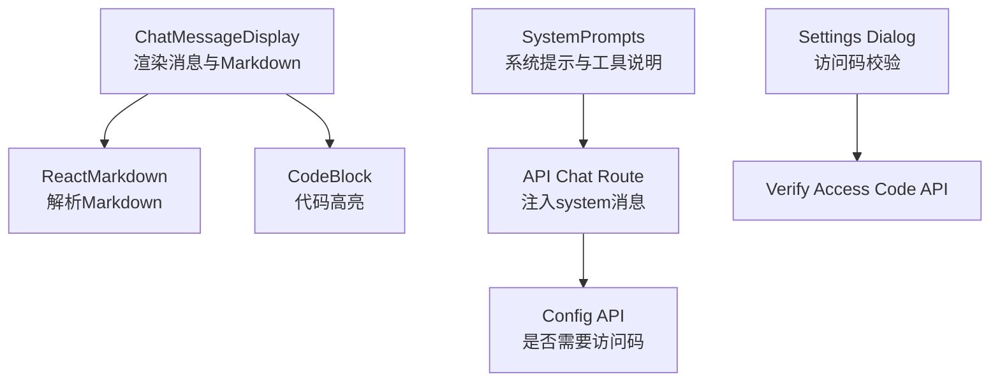
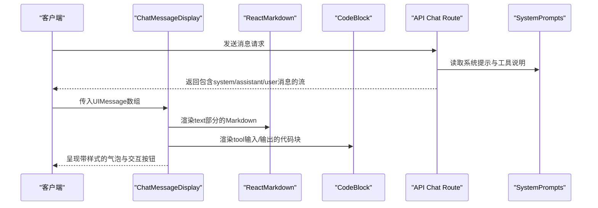
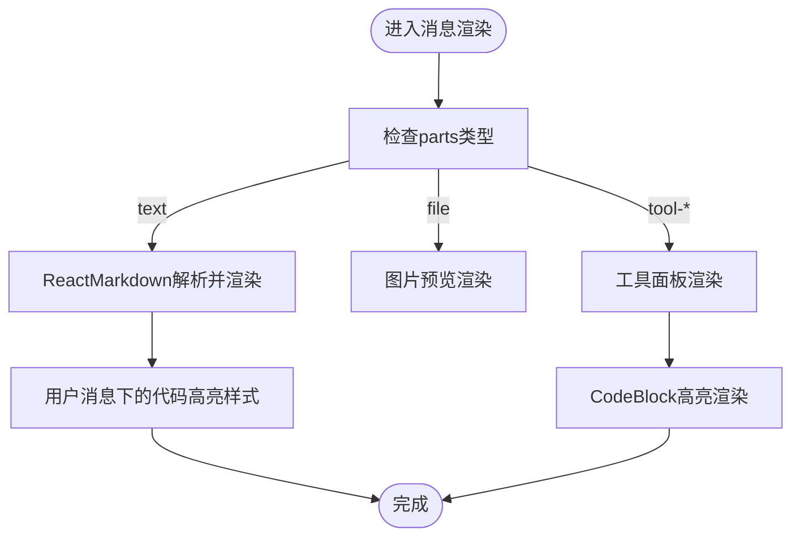
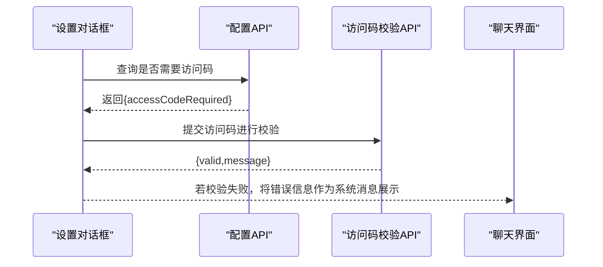
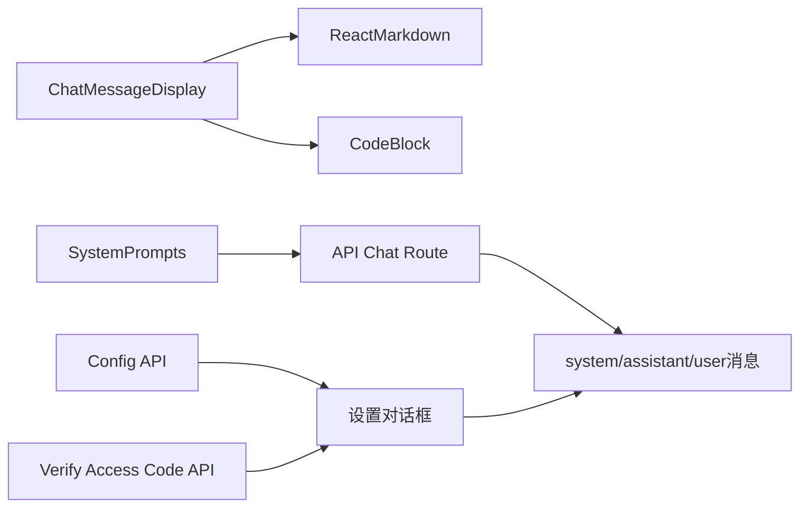

# 消息类型

<cite>
**本文引用的文件**
- [components/chat-message-display.tsx](file://components/chat-message-display.tsx)
- [components/code-block.tsx](file://components/code-block.tsx)
- [lib/system-prompts.ts](file://lib/system-prompts.ts)
- [app/api/chat/route.ts](file://app/api/chat/route.ts)
- [app/api/config/route.ts](file://app/api/config/route.ts)
- [app/api/verify-access-code/route.ts](file://app/api/verify-access-code/route.ts)
- [components/settings-dialog.tsx](file://components/settings-dialog.tsx)
</cite>

## 目录
1. [简介](#简介)
2. [项目结构](#项目结构)
3. [核心组件](#核心组件)
4. [架构总览](#架构总览)
5. [详细组件分析](#详细组件分析)
6. [依赖关系分析](#依赖关系分析)
7. [性能考量](#性能考量)
8. [故障排查指南](#故障排查指南)
9. [结论](#结论)

## 简介
本文件聚焦于 ChatMessageDisplay 组件支持的三种消息类型：用户消息、助手消息与系统消息，并系统性说明：
- 各消息类型的视觉样式差异（背景色、圆角方向、对齐方式等）
- UIMessage 对象的数据结构及 role 字段如何决定渲染
- 不同类型消息的数据构造路径与示例定位
- Markdown 解析与渲染机制（代码块、列表、加粗等）
- 系统消息的特殊用途（如访问码验证提示与错误通知）

## 项目结构
围绕消息类型与渲染的关键文件分布如下：
- 渲染层：components/chat-message-display.tsx
- 代码高亮：components/code-block.tsx
- 系统提示与工具调用：lib/system-prompts.ts
- 访问控制与系统消息注入：app/api/chat/route.ts、app/api/config/route.ts、app/api/verify-access-code/route.ts、components/settings-dialog.tsx

图表来源
- [components/chat-message-display.tsx](file://components/chat-message-display.tsx#L582-L602)
- [components/code-block.tsx](file://components/code-block.tsx#L1-L54)
- [lib/system-prompts.ts](file://lib/system-prompts.ts#L1-L120)
- [app/api/chat/route.ts](file://app/api/chat/route.ts#L315-L339)
- [app/api/verify-access-code/route.ts](file://app/api/verify-access-code/route.ts#L1-L32)
- [app/api/config/route.ts](file://app/api/config/route.ts#L1-L12)

章节来源
- [components/chat-message-display.tsx](file://components/chat-message-display.tsx#L369-L602)
- [components/code-block.tsx](file://components/code-block.tsx#L1-L54)
- [lib/system-prompts.ts](file://lib/system-prompts.ts#L1-L120)
- [app/api/chat/route.ts](file://app/api/chat/route.ts#L315-L339)
- [app/api/config/route.ts](file://app/api/config/route.ts#L1-L12)
- [app/api/verify-access-code/route.ts](file://app/api/verify-access-code/route.ts#L1-L32)
- [components/settings-dialog.tsx](file://components/settings-dialog.tsx#L42-L121)

## 核心组件
- ChatMessageDisplay：负责根据 UIMessage 的 role 决定消息气泡样式、对齐方式、交互按钮与 Markdown 渲染；同时处理工具调用（如 diagram 相关）与复制反馈等。
- CodeBlock：封装 prism-react-renderer 实现代码高亮渲染，用于工具输入/输出的 XML/JSON 展示。
- SystemPrompts：定义系统提示与工具说明，为 API 注入 system 消息提供依据。
- API Chat Route：在对话流中注入 system 类型消息，包含静态指令与当前 XML 上下文。
- 配置与访问码 API：通过配置接口判断是否需要访问码，并通过校验接口返回错误信息，这些信息可作为系统消息提示给用户。

章节来源
- [components/chat-message-display.tsx](file://components/chat-message-display.tsx#L369-L602)
- [components/code-block.tsx](file://components/code-block.tsx#L1-L54)
- [lib/system-prompts.ts](file://lib/system-prompts.ts#L1-L120)
- [app/api/chat/route.ts](file://app/api/chat/route.ts#L315-L339)
- [app/api/config/route.ts](file://app/api/config/route.ts#L1-L12)
- [app/api/verify-access-code/route.ts](file://app/api/verify-access-code/route.ts#L1-L32)

## 架构总览
消息从服务端生成后，经由 ChatMessageDisplay 渲染。Markdown 通过 ReactMarkdown 解析，代码块使用 CodeBlock 进行高亮。系统消息由 API 注入，用于提供上下文与工具说明。

图表来源
- [components/chat-message-display.tsx](file://components/chat-message-display.tsx#L582-L602)
- [components/code-block.tsx](file://components/code-block.tsx#L1-L54)
- [lib/system-prompts.ts](file://lib/system-prompts.ts#L1-L120)
- [app/api/chat/route.ts](file://app/api/chat/route.ts#L315-L339)

## 详细组件分析

### 三种消息类型的视觉样式与对齐
- 用户消息（role=user）
  - 对齐：右对齐
  - 背景色：主色背景，文字为前景色
  - 圆角：右侧底部圆角
  - 交互：当为最后一条用户消息且允许编辑时，气泡可点击进入编辑模式
  - 可见区域：包含文本与文件预览
- 助手消息（role=assistant）
  - 对齐：左对齐
  - 背景色：浅色背景，文字为前景色
  - 圆角：左侧底部圆角
  - 交互：提供复制、重新生成、点赞/点踩反馈按钮
- 系统消息（role=system）
  - 对齐：左对齐
  - 背景色：破坏性强调色背景与边框，用于警示
  - 圆角：左侧底部圆角
  - 用途：用于展示访问码校验失败、错误通知等重要提示

章节来源
- [components/chat-message-display.tsx](file://components/chat-message-display.tsx#L369-L581)
- [components/chat-message-display.tsx](file://components/chat-message-display.tsx#L582-L602)
- [components/chat-message-display.tsx](file://components/chat-message-display.tsx#L646-L736)

### UIMessage 数据结构与 role 字段
- UIMessage 来自 ai 库类型，包含 id、role、parts 等字段
- parts 数组中的每个元素可能是 text 或 file，或以 tool- 开头的工具调用部分
- role 决定消息的对齐、背景色与交互行为
- 文本内容提取函数用于复制与反馈统计

章节来源
- [components/chat-message-display.tsx](file://components/chat-message-display.tsx#L1-L30)
- [components/chat-message-display.tsx](file://components/chat-message-display.tsx#L92-L98)
- [components/chat-message-display.tsx](file://components/chat-message-display.tsx#L369-L581)

### Markdown 解析与渲染机制
- 文本部分通过 ReactMarkdown 渲染，支持标题、列表、加粗、链接、代码块等
- 在用户消息中，代码片段会应用特定的前景色与背景色以匹配主题
- 工具输入/输出中的 XML/JSON 使用 CodeBlock 进行高亮渲染，便于阅读与调试

图表来源
- [components/chat-message-display.tsx](file://components/chat-message-display.tsx#L582-L602)
- [components/code-block.tsx](file://components/code-block.tsx#L1-L54)

章节来源
- [components/chat-message-display.tsx](file://components/chat-message-display.tsx#L582-L602)
- [components/code-block.tsx](file://components/code-block.tsx#L1-L54)

### 系统消息的特殊用途与访问码验证提示
- 系统消息用于向模型注入静态指令与当前 XML 上下文，提升缓存命中率与上下文一致性
- 当服务器启用访问码时，前端通过配置接口查询是否需要访问码；若需要，则在设置对话框中进行访问码校验；校验失败时，服务端返回错误信息，可在聊天界面以系统消息形式提示用户

图表来源
- [app/api/config/route.ts](file://app/api/config/route.ts#L1-L12)
- [app/api/verify-access-code/route.ts](file://app/api/verify-access-code/route.ts#L1-L32)
- [components/settings-dialog.tsx](file://components/settings-dialog.tsx#L42-L121)
- [app/api/chat/route.ts](file://app/api/chat/route.ts#L315-L339)

章节来源
- [app/api/config/route.ts](file://app/api/config/route.ts#L1-L12)
- [app/api/verify-access-code/route.ts](file://app/api/verify-access-code/route.ts#L1-L32)
- [components/settings-dialog.tsx](file://components/settings-dialog.tsx#L42-L121)
- [app/api/chat/route.ts](file://app/api/chat/route.ts#L315-L339)

### 不同类型消息的数据构造示例定位
- 用户消息（user）
  - 构造位置：聊天面板在编辑用户消息时，会更新 parts 中的 text 部分
  - 示例定位：[components/chat-panel.tsx](file://components/chat-panel.tsx#L587-L631)
- 助手消息（assistant）
  - 构造位置：服务端流式响应中，按顺序返回 assistant 消息
  - 示例定位：[app/api/chat/route.ts](file://app/api/chat/route.ts#L141-L178)
- 系统消息（system）
  - 构造位置：服务端在所有消息前插入 system 消息，包含静态指令与当前 XML 上下文
  - 示例定位：[app/api/chat/route.ts](file://app/api/chat/route.ts#L315-L339)

章节来源
- [components/chat-panel.tsx](file://components/chat-panel.tsx#L587-L631)
- [app/api/chat/route.ts](file://app/api/chat/route.ts#L141-L178)
- [app/api/chat/route.ts](file://app/api/chat/route.ts#L315-L339)

## 依赖关系分析
- ChatMessageDisplay 依赖 ReactMarkdown 进行 Markdown 渲染，依赖 CodeBlock 进行代码高亮
- 系统消息由 SystemPrompts 提供模板，由 API Chat Route 注入到对话流中
- 访问码相关逻辑通过配置与校验 API 控制，错误信息可作为系统消息展示

图表来源
- [components/chat-message-display.tsx](file://components/chat-message-display.tsx#L582-L602)
- [components/code-block.tsx](file://components/code-block.tsx#L1-L54)
- [lib/system-prompts.ts](file://lib/system-prompts.ts#L1-L120)
- [app/api/chat/route.ts](file://app/api/chat/route.ts#L315-L339)
- [app/api/config/route.ts](file://app/api/config/route.ts#L1-L12)
- [app/api/verify-access-code/route.ts](file://app/api/verify-access-code/route.ts#L1-L32)
- [components/settings-dialog.tsx](file://components/settings-dialog.tsx#L42-L121)

章节来源
- [components/chat-message-display.tsx](file://components/chat-message-display.tsx#L582-L602)
- [components/code-block.tsx](file://components/code-block.tsx#L1-L54)
- [lib/system-prompts.ts](file://lib/system-prompts.ts#L1-L120)
- [app/api/chat/route.ts](file://app/api/chat/route.ts#L315-L339)
- [app/api/config/route.ts](file://app/api/config/route.ts#L1-L12)
- [app/api/verify-access-code/route.ts](file://app/api/verify-access-code/route.ts#L1-L32)
- [components/settings-dialog.tsx](file://components/settings-dialog.tsx#L42-L121)

## 性能考量
- 消息动画延迟逐条递增，避免一次性大量 DOM 更新造成卡顿
- Markdown 渲染仅针对 text 部分，文件与工具调用分别走专用渲染路径
- 代码高亮使用 CodeBlock，限制最大高度与滚动条，避免大段 XML/JSON 导致布局抖动
- 系统消息注入时，将静态指令与当前 XML 上下文拆分为多个缓存断点，提升模型缓存命中率

章节来源
- [components/chat-message-display.tsx](file://components/chat-message-display.tsx#L369-L376)
- [components/code-block.tsx](file://components/code-block.tsx#L1-L54)
- [app/api/chat/route.ts](file://app/api/chat/route.ts#L315-L339)

## 故障排查指南
- 复制/反馈失败
  - 现象：复制按钮状态异常或反馈提交失败
  - 排查：检查剪贴板权限与网络请求状态
  - 定位：[components/chat-message-display.tsx](file://components/chat-message-display.tsx#L135-L173)
- 访问码校验失败
  - 现象：设置对话框提示无效访问码或缺少访问码
  - 排查：确认配置接口返回值与前端校验流程
  - 定位：[app/api/config/route.ts](file://app/api/config/route.ts#L1-L12)、[app/api/verify-access-code/route.ts](file://app/api/verify-access-code/route.ts#L1-L32)、[components/settings-dialog.tsx](file://components/settings-dialog.tsx#L42-L121)
- 系统消息未生效
  - 现象：工具说明或上下文缺失
  - 排查：确认 API Chat Route 是否正确注入 system 消息
  - 定位：[app/api/chat/route.ts](file://app/api/chat/route.ts#L315-L339)、[lib/system-prompts.ts](file://lib/system-prompts.ts#L1-L120)

章节来源
- [components/chat-message-display.tsx](file://components/chat-message-display.tsx#L135-L173)
- [app/api/config/route.ts](file://app/api/config/route.ts#L1-L12)
- [app/api/verify-access-code/route.ts](file://app/api/verify-access-code/route.ts#L1-L32)
- [components/settings-dialog.tsx](file://components/settings-dialog.tsx#L42-L121)
- [app/api/chat/route.ts](file://app/api/chat/route.ts#L315-L339)
- [lib/system-prompts.ts](file://lib/system-prompts.ts#L1-L120)

## 结论
- ChatMessageDisplay 通过 role 字段精准区分三类消息，并以不同的对齐、背景与圆角呈现差异化视觉风格
- Markdown 渲染与 CodeBlock 高亮确保复杂内容（含代码）的可读性
- 系统消息承担“上下文注入”与“错误/提示展示”的双重职责，访问码校验失败等关键信息以系统消息形式直观呈现
- 通过合理的数据结构与渲染策略，系统在功能完整性与用户体验之间取得平衡