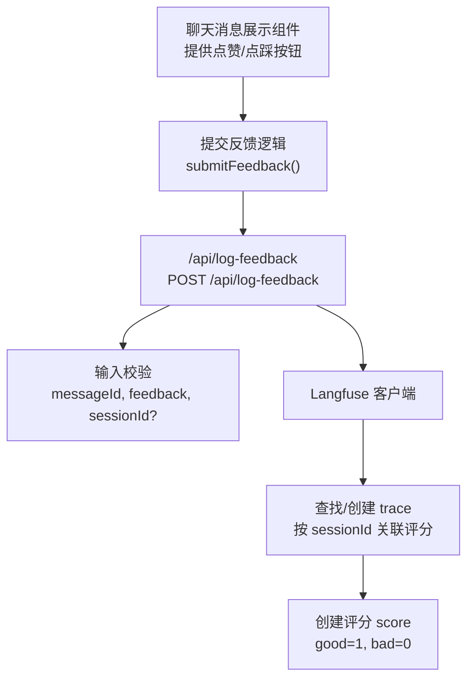
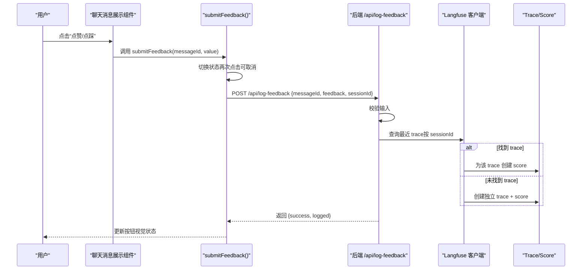
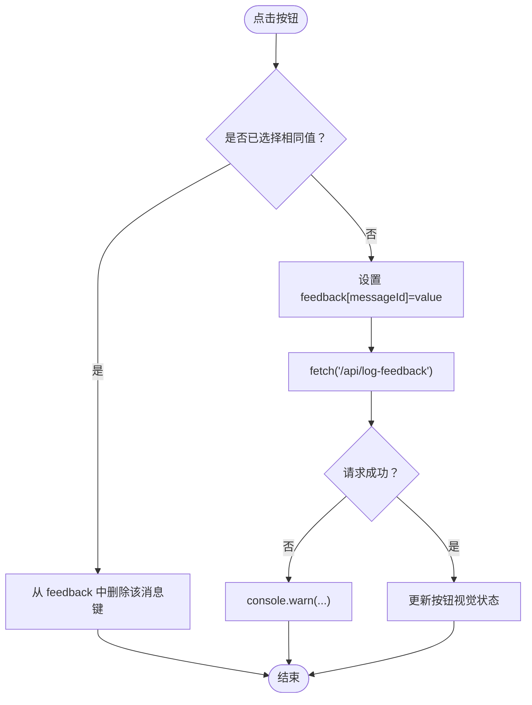
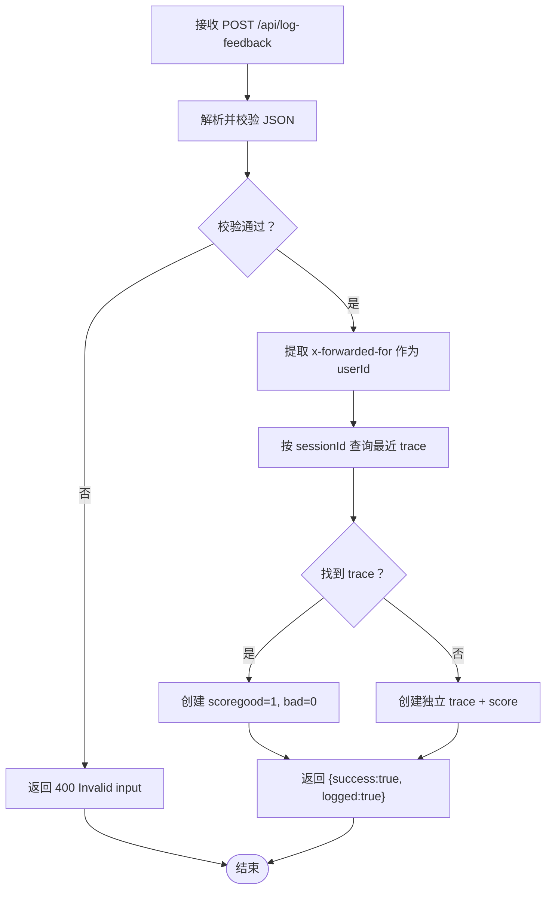
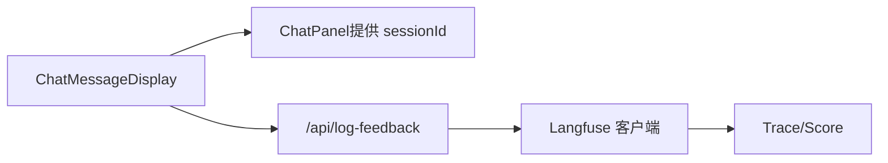

# 响应反馈机制

<cite>
**本文引用的文件**
- [app/api/log-feedback/route.ts](file://app/api/log-feedback/route.ts)
- [components/chat-message-display.tsx](file://components/chat-message-display.tsx)
- [lib/langfuse.ts](file://lib/langfuse.ts)
- [contexts/diagram-context.tsx](file://contexts/diagram-context.tsx)
- [components/chat-panel.tsx](file://components/chat-panel.tsx)
</cite>

## 目录
1. [简介](#简介)
2. [项目结构](#项目结构)
3. [核心组件](#核心组件)
4. [架构总览](#架构总览)
5. [详细组件分析](#详细组件分析)
6. [依赖关系分析](#依赖关系分析)
7. [性能考量](#性能考量)
8. [故障排查指南](#故障排查指南)
9. [结论](#结论)

## 简介
本文件系统性说明“响应反馈”功能的设计与实现，涵盖：
- 反馈按钮的状态管理（feedback 状态对象）
- 视觉反馈（颜色变化）
- API 调用流程（submitFeedback -> /api/log-feedback）
- sessionId 在反馈数据中的作用
- 错误处理的静默降级策略
- 结合后端 API 的反馈数据结构与存储用途，并强调其对 AI 模型优化的重要性

## 项目结构
反馈机制涉及前端组件、会话标识管理、后端接口与可观测性平台集成。关键路径如下：
- 前端：聊天消息展示组件提供点赞/点踩按钮，提交反馈时携带 messageId、feedback、sessionId
- 后端：/api/log-feedback 接收并校验输入，将评分写入 Langfuse
- 可观测性：Langfuse 客户端按 sessionId 关联评分到最近一次 trace，或创建独立 trace

图表来源
- [components/chat-message-display.tsx](file://components/chat-message-display.tsx#L147-L173)
- [app/api/log-feedback/route.ts](file://app/api/log-feedback/route.ts#L1-L112)
- [lib/langfuse.ts](file://lib/langfuse.ts#L1-L22)

章节来源
- [components/chat-message-display.tsx](file://components/chat-message-display.tsx#L147-L173)
- [app/api/log-feedback/route.ts](file://app/api/log-feedback/route.ts#L1-L112)
- [lib/langfuse.ts](file://lib/langfuse.ts#L1-L22)

## 核心组件
- 前端反馈按钮与状态管理
  - 使用本地状态 feedback 记录每个消息的反馈值（good 或 bad），支持再次点击取消反馈
  - 按钮样式根据当前反馈状态动态切换颜色与背景
- 提交反馈函数 submitFeedback
  - 切换逻辑：若再次点击同一按钮，则清除该消息的反馈状态
  - 发送 POST 请求至 /api/log-feedback，携带 messageId、feedback、sessionId
  - 异常捕获：网络失败时仅记录警告，不阻断用户交互
- 后端接口 /api/log-feedback
  - 输入校验：使用模式匹配确保字段合法
  - 评分写入：通过 Langfuse 客户端将评分附加到最近一次 trace；若无 trace，则创建独立 trace 并附带评分
  - 错误处理：无效输入返回 400，Langfuse 写入异常返回 500，否则返回成功
- 会话标识 sessionId
  - 由聊天面板生成并持久化，用于跨消息关联评分与 trace
  - 前端在提交反馈时随请求体发送，后端据此查询/创建 trace

章节来源
- [components/chat-message-display.tsx](file://components/chat-message-display.tsx#L128-L173)
- [app/api/log-feedback/route.ts](file://app/api/log-feedback/route.ts#L1-L112)
- [lib/langfuse.ts](file://lib/langfuse.ts#L1-L22)
- [components/chat-panel.tsx](file://components/chat-panel.tsx#L105-L112)

## 架构总览
反馈机制的端到端流程如下：

图表来源
- [components/chat-message-display.tsx](file://components/chat-message-display.tsx#L147-L173)
- [app/api/log-feedback/route.ts](file://app/api/log-feedback/route.ts#L1-L112)
- [lib/langfuse.ts](file://lib/langfuse.ts#L1-L22)

## 详细组件分析

### 前端：反馈按钮与状态管理
- 状态对象 feedback
  - 类型：记录每个消息的反馈值（good/bad）
  - 初始为空对象，按键渲染时根据是否存在对应键决定是否高亮
- 视觉反馈
  - 点赞/点踩按钮在被选中时改变文本色与背景色，未选中时保持半透明悬停态
- 提交反馈逻辑 submitFeedback
  - 若再次点击同一按钮，删除该消息的反馈键，实现“取消反馈”
  - 设置新状态后立即发起异步请求
  - 请求体包含 messageId、feedback、sessionId
  - 失败时仅打印警告，避免中断用户操作

图表来源
- [components/chat-message-display.tsx](file://components/chat-message-display.tsx#L147-L173)

章节来源
- [components/chat-message-display.tsx](file://components/chat-message-display.tsx#L128-L173)

### 后端：/api/log-feedback 接口
- 输入校验
  - 必填字段：messageId（字符串，长度限制）、feedback（枚举 good/bad）
  - 可选字段：sessionId（字符串，长度限制）
  - 非法输入返回 400
- 用户标识
  - 从请求头 x-forwarded-for 获取首个 IP 作为 userId，匿名回退
- Trace 关联与评分写入
  - 通过 Langfuse 客户端按 sessionId 查询最近 trace
  - 若存在：为该 trace 创建 score（good=1，bad=0）
  - 若不存在：创建独立 trace 并附带 score
- 成功与失败
  - 成功返回 {success: true, logged: true/false}
  - Langfuse 写入异常返回 500

图表来源
- [app/api/log-feedback/route.ts](file://app/api/log-feedback/route.ts#L1-L112)
- [lib/langfuse.ts](file://lib/langfuse.ts#L1-L22)

章节来源
- [app/api/log-feedback/route.ts](file://app/api/log-feedback/route.ts#L1-L112)
- [lib/langfuse.ts](file://lib/langfuse.ts#L1-L22)

### 会话标识 sessionId 的作用
- 生成与持久化
  - 聊天面板在挂载时生成唯一 sessionId，优先从 localStorage 恢复
  - 通过 localStorage 持久化，确保跨刷新仍能关联同一会话
- 前后端协作
  - 前端在提交反馈时将 sessionId 一并发送
  - 后端按 sessionId 查找最近 trace，实现评分与对话链路的关联
- 与 Langfuse 集成
  - Langfuse 客户端支持按 sessionId 关联 trace，便于后续分析与回放

章节来源
- [components/chat-panel.tsx](file://components/chat-panel.tsx#L105-L112)
- [app/api/log-feedback/route.ts](file://app/api/log-feedback/route.ts#L1-L112)
- [lib/langfuse.ts](file://lib/langfuse.ts#L1-L22)

### 错误处理与静默降级
- 前端
  - submitFeedback 对 fetch 包裹 try/catch，失败仅打印警告，不阻断 UI
- 后端
  - 输入校验失败直接返回 400
  - Langfuse 客户端不可用或写入异常返回 500
  - 当 Langfuse 未配置时，接口返回 success 但 logged=false，前端仍可继续工作
- 实践建议
  - 前端可在 UI 上增加轻提示，告知反馈已记录或稍后重试
  - 后端可考虑幂等性设计（如重复提交同一条评分时跳过）

章节来源
- [components/chat-message-display.tsx](file://components/chat-message-display.tsx#L147-L173)
- [app/api/log-feedback/route.ts](file://app/api/log-feedback/route.ts#L1-L112)

### 反馈数据结构与存储用途
- 请求体结构
  - messageId: 字符串，唯一标识某条助手消息
  - feedback: 枚举 "good" 或 "bad"
  - sessionId: 可选，用于 trace 关联
- 存储与追踪
  - 后端将评分写入 Langfuse，作为用户反馈信号
  - 评分值映射：good=1，bad=0
  - 若存在最近 trace，评分附加到该 trace；否则创建独立 trace
- 对模型优化的意义
  - 反馈信号可用于后续训练/微调的数据增强
  - 通过 sessionId 将评分与具体对话上下文绑定，便于定位问题与改进
  - 与工具调用、图表生成等场景结合，形成更丰富的优化信号

章节来源
- [app/api/log-feedback/route.ts](file://app/api/log-feedback/route.ts#L1-L112)
- [lib/langfuse.ts](file://lib/langfuse.ts#L1-L22)

## 依赖关系分析
- 组件耦合
  - ChatMessageDisplay 依赖 sessionId（来自 ChatPanel props）与本地状态 feedback
  - submitFeedback 依赖 fetch 与路由 /api/log-feedback
- 后端依赖
  - Langfuse 客户端按环境变量启用；未配置时接口返回 logged=false
  - trace 查询与评分创建通过 ingestion.batch 批量写入
- 外部集成
  - 通过 x-forwarded-for 获取用户标识，便于审计与去重

图表来源
- [components/chat-message-display.tsx](file://components/chat-message-display.tsx#L128-L173)
- [components/chat-panel.tsx](file://components/chat-panel.tsx#L760-L768)
- [app/api/log-feedback/route.ts](file://app/api/log-feedback/route.ts#L1-L112)
- [lib/langfuse.ts](file://lib/langfuse.ts#L1-L22)

章节来源
- [components/chat-message-display.tsx](file://components/chat-message-display.tsx#L128-L173)
- [components/chat-panel.tsx](file://components/chat-panel.tsx#L760-L768)
- [app/api/log-feedback/route.ts](file://app/api/log-feedback/route.ts#L1-L112)
- [lib/langfuse.ts](file://lib/langfuse.ts#L1-L22)

## 性能考量
- 前端
  - submitFeedback 采用异步请求，避免阻塞 UI
  - 按钮样式切换基于本地状态，开销极低
- 后端
  - trace 查询为轻量列表查询，limit=1，复杂度较低
  - 批量写入 ingestion.batch 减少往返次数
- 可扩展性
  - 可引入去抖/节流，减少高频点击导致的重复请求
  - 可缓存最近 trace，降低查询压力

[本节为通用建议，无需列出章节来源]

## 故障排查指南
- 前端无法看到按钮或点击无反应
  - 检查 ChatMessageDisplay 是否正确接收 sessionId 与消息列表
  - 确认按钮事件绑定与状态更新逻辑
- 反馈未生效
  - 查看浏览器网络面板，确认 /api/log-feedback 是否返回 200
  - 若返回 400，检查请求体字段是否符合校验规则
  - 若返回 500，检查后端日志与 Langfuse 配置
- 评分未出现在 Langfuse
  - 确认 sessionId 是否一致且有效
  - 检查 Langfuse 公钥/密钥配置是否正确
  - 若无最近 trace，确认是否期望创建独立 trace

章节来源
- [components/chat-message-display.tsx](file://components/chat-message-display.tsx#L147-L173)
- [app/api/log-feedback/route.ts](file://app/api/log-feedback/route.ts#L1-L112)
- [lib/langfuse.ts](file://lib/langfuse.ts#L1-L22)

## 结论
该反馈机制通过简洁的前端状态与按钮视觉反馈、可靠的后端输入校验与 Langfuse 评分写入，实现了对 AI 响应质量的即时采集。sessionId 的引入使评分与对话上下文强关联，为后续模型优化提供了高质量信号。前端采用静默降级策略，保证用户体验稳定；后端在缺失可观测性配置时也能正常运行，具备良好的容错能力。建议在生产环境中结合去抖与幂等设计进一步提升稳定性与一致性。