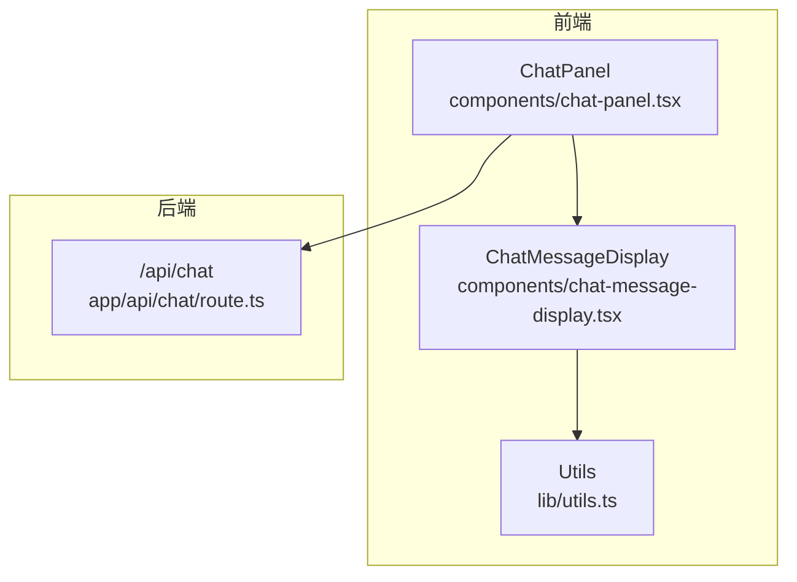
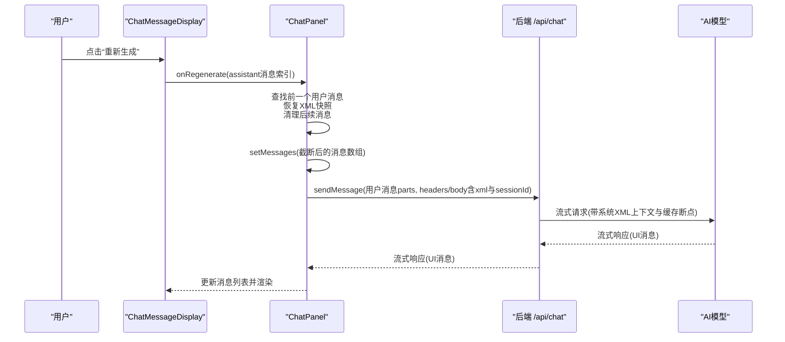
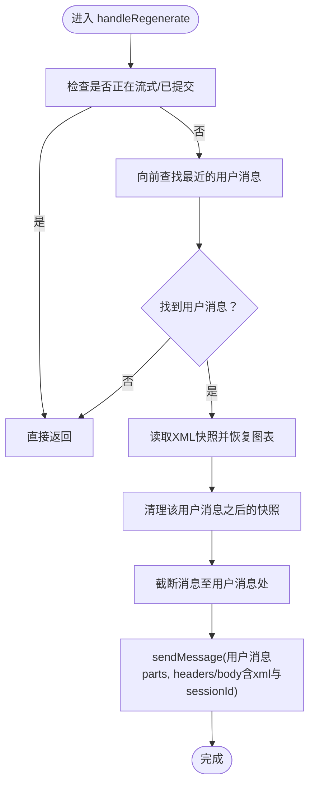
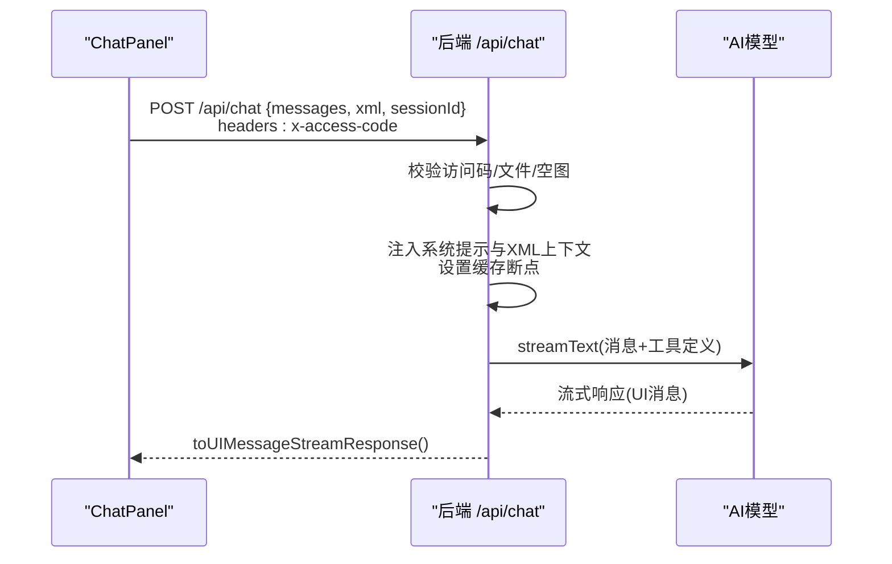
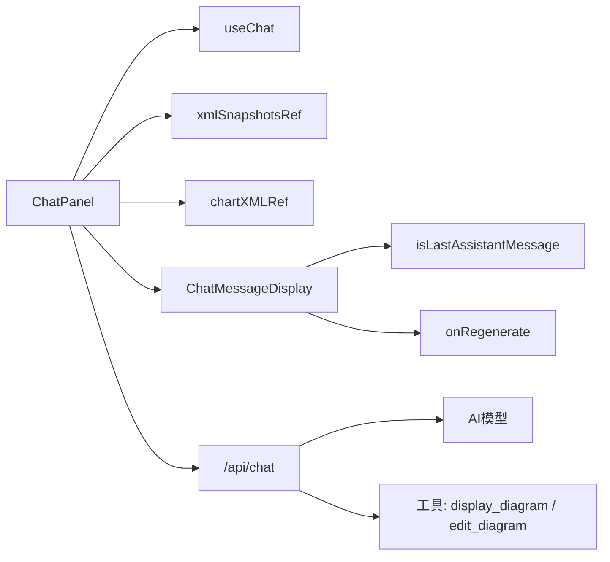

# 响应重新生成

<cite>
**本文引用的文件**
- [components/chat-panel.tsx](file://components/chat-panel.tsx)
- [components/chat-message-display.tsx](file://components/chat-message-display.tsx)
- [app/api/chat/route.ts](file://app/api/chat/route.ts)
- [lib/utils.ts](file://lib/utils.ts)
</cite>

## 目录
1. [简介](#简介)
2. [项目结构与入口](#项目结构与入口)
3. [核心组件与职责](#核心组件与职责)
4. [架构总览](#架构总览)
5. [详细组件分析](#详细组件分析)
6. [依赖关系分析](#依赖关系分析)
7. [性能与可用性考量](#性能与可用性考量)
8. [故障排查指南](#故障排查指南)
9. [结论](#结论)

## 简介
本节聚焦“响应重新生成”功能：当用户点击最后一个AI助手消息中的“重新生成”按钮时，系统将定位到对应的用户消息，恢复该用户消息提交时的XML快照，清理后续所有消息（包括当前助手消息），然后使用相同的用户消息与XML快照重新发起一次对话请求。同时，本节解释onRegenerate回调如何接收消息索引、handleRegenerate如何在聊天面板中被触发、XML快照的存储与恢复机制、sendMessage调用链路，以及isLastAssistantMessage判断逻辑如何确保仅最后一个AI响应显示重新生成按钮。

## 项目结构与入口
- 前端聊天面板通过useChat驱动对话流，负责消息状态、工具调用、错误处理与自动重试策略。
- 聊天消息渲染组件负责展示消息、工具调用结果、复制、反馈与“重新生成”等操作按钮。
- 后端API路由负责接入AI模型、缓存策略、工具定义与流式输出。
- 工具函数提供XML格式化、合法性转换、节点替换与校验等能力，支撑绘图与编辑流程。

图表来源
- [components/chat-panel.tsx](file://components/chat-panel.tsx#L1-L120)
- [components/chat-message-display.tsx](file://components/chat-message-display.tsx#L100-L120)
- [app/api/chat/route.ts](file://app/api/chat/route.ts#L144-L214)
- [lib/utils.ts](file://lib/utils.ts#L1-L60)

章节来源
- [components/chat-panel.tsx](file://components/chat-panel.tsx#L1-L120)
- [components/chat-message-display.tsx](file://components/chat-message-display.tsx#L100-L120)
- [app/api/chat/route.ts](file://app/api/chat/route.ts#L144-L214)
- [lib/utils.ts](file://lib/utils.ts#L1-L60)

## 核心组件与职责
- ChatPanel（聊天面板）
  - 维护消息列表、会话ID、XML快照映射、图表XML引用等。
  - 提供handleRegenerate用于重新生成指定助手消息对应的用户消息。
  - 在用户提交消息时保存对应XML快照；在助手消息工具调用完成后更新图表XML引用。
  - 通过useChat集成AI对话流，支持工具调用、自动重试与错误处理。
- ChatMessageDisplay（消息展示）
  - 渲染消息气泡、工具调用面板、复制、反馈与操作按钮。
  - 计算isLastAssistantMessage与isLastUserMessage，控制按钮可见性。
  - 将onRegenerate回调传递给消息行，供用户点击触发。
- API路由（/api/chat）
  - 接收前端传入的消息与XML上下文，注入系统提示与缓存断点，调用AI模型并返回流式UI消息。
  - 定义display_diagram与edit_diagram工具，支持客户端侧执行与验证。

章节来源
- [components/chat-panel.tsx](file://components/chat-panel.tsx#L120-L200)
- [components/chat-panel.tsx](file://components/chat-panel.tsx#L485-L585)
- [components/chat-message-display.tsx](file://components/chat-message-display.tsx#L350-L370)
- [components/chat-message-display.tsx](file://components/chat-message-display.tsx#L679-L694)
- [app/api/chat/route.ts](file://app/api/chat/route.ts#L315-L340)

## 架构总览
下图展示了从用户点击“重新生成”到后端AI模型响应的完整调用链，以及XML快照的恢复与清理过程。

图表来源
- [components/chat-message-display.tsx](file://components/chat-message-display.tsx#L679-L694)
- [components/chat-panel.tsx](file://components/chat-panel.tsx#L518-L585)
- [app/api/chat/route.ts](file://app/api/chat/route.ts#L315-L340)

## 详细组件分析

### 触发条件与onRegenerate回调
- ChatMessageDisplay根据消息角色与位置计算isLastAssistantMessage，仅在最后一个助手消息上显示“重新生成”按钮。
- 当用户点击按钮时，调用onRegenerate(assistant消息索引)，该回调由ChatPanel传入并在ChatMessageDisplay中触发。
- ChatPanel内部handleRegenerate接收assistant消息索引作为参数，开始执行重新生成流程。

章节来源
- [components/chat-message-display.tsx](file://components/chat-message-display.tsx#L350-L370)
- [components/chat-message-display.tsx](file://components/chat-message-display.tsx#L679-L694)
- [components/chat-panel.tsx](file://components/chat-panel.tsx#L518-L585)

### 执行流程与状态管理
- 状态检查：若当前处于流式或已提交状态，则直接返回，避免并发冲突。
- 消息定位：从assistant消息索引向前查找最近的用户消息，确保找到正确的用户消息索引。
- XML快照恢复：从xmlSnapshotsRef映射中读取该用户消息对应的XML快照，调用图表加载函数恢复到对应状态，并更新chartXMLRef。
- 快照清理：删除该用户消息之后的所有快照键值，保持快照与消息序列一致。
- 截断消息：使用flushSync同步更新消息列表，截断至用户消息处，确保后续助手消息被移除。
- 重新发送：构造与原用户消息相同的parts，携带保存的XML快照与sessionId，调用sendMessage重新发起请求。

图表来源
- [components/chat-panel.tsx](file://components/chat-panel.tsx#L518-L585)

章节来源
- [components/chat-panel.tsx](file://components/chat-panel.tsx#L518-L585)

### XML快照的存储与恢复机制
- 存储时机：
  - 用户提交消息时，先获取并格式化图表XML，保存到xmlSnapshotsRef映射，键为当前消息数组长度（即本次用户消息的索引）。
  - 每次消息或快照变更时，持久化到localStorage，保证刷新后可恢复。
- 恢复机制：
  - handleRegenerate按用户消息索引读取快照，调用图表加载函数恢复到可信快照状态（跳过二次校验）。
  - 同步更新chartXMLRef，确保后续工具调用（如edit_diagram）能拿到最新XML。
- 一致性维护：
  - 删除用户消息之后的所有快照，避免与后续消息错配。
  - beforeunload事件中同样持久化快照，防止意外关闭丢失。

章节来源
- [components/chat-panel.tsx](file://components/chat-panel.tsx#L449-L506)
- [components/chat-panel.tsx](file://components/chat-panel.tsx#L300-L326)
- [components/chat-panel.tsx](file://components/chat-panel.tsx#L379-L393)
- [components/chat-panel.tsx](file://components/chat-panel.tsx#L420-L447)
- [components/chat-panel.tsx](file://components/chat-panel.tsx#L540-L562)

### sendMessage调用与后端处理
- 前端sendMessage携带：
  - parts：用户消息文本与文件（如有）。
  - headers/body：包含x-access-code访问码、sessionId会话标识与xml图表XML。
- 后端路由：
  - 校验访问码、文件大小与数量、空图检测与缓存命中。
  - 注入系统提示与当前XML上下文（作为系统消息），并设置缓存断点以优化后续请求。
  - 调用AI模型进行流式对话，支持工具调用（display_diagram/edit_diagram）。
  - 返回流式UI消息响应，前端useChat自动渲染。

图表来源
- [components/chat-panel.tsx](file://components/chat-panel.tsx#L485-L506)
- [app/api/chat/route.ts](file://app/api/chat/route.ts#L144-L214)
- [app/api/chat/route.ts](file://app/api/chat/route.ts#L315-L340)
- [app/api/chat/route.ts](file://app/api/chat/route.ts#L473-L474)

章节来源
- [components/chat-panel.tsx](file://components/chat-panel.tsx#L485-L506)
- [app/api/chat/route.ts](file://app/api/chat/route.ts#L144-L214)
- [app/api/chat/route.ts](file://app/api/chat/route.ts#L315-L340)
- [app/api/chat/route.ts](file://app/api/chat/route.ts#L473-L474)

### isLastAssistantMessage判断逻辑
- 判断规则：
  - 当前消息必须为assistant角色；
  - 且为当前消息索引到最后一条消息之间不存在其他assistant消息，或当前消息为最后一条消息。
- 作用：
  - 仅在最后一个助手消息上显示“重新生成”按钮，避免对中间或历史助手消息重复生成造成上下文混乱。

章节来源
- [components/chat-message-display.tsx](file://components/chat-message-display.tsx#L350-L370)
- [components/chat-message-display.tsx](file://components/chat-message-display.tsx#L679-L694)

### 对话上下文管理与用户体验考量
- 上下文一致性：
  - 通过XML快照与消息截断，确保重新生成时仅保留到用户消息为止的历史，避免旧的助手消息污染新生成的上下文。
  - 通过flushSync同步更新消息列表，减少渲染抖动与状态不一致风险。
- 可靠性：
  - 本地持久化消息与快照，支持刷新与关闭后恢复，提升连续对话体验。
  - beforeunload事件持久化，降低意外中断导致的数据丢失。
- 交互约束：
  - 正在流式或已提交时禁止重新生成，避免并发写入与状态竞争。
  - 仅最后一个助手消息显示按钮，避免误触与歧义。

章节来源
- [components/chat-panel.tsx](file://components/chat-panel.tsx#L518-L585)
- [components/chat-panel.tsx](file://components/chat-panel.tsx#L379-L393)
- [components/chat-panel.tsx](file://components/chat-panel.tsx#L420-L447)

## 依赖关系分析
- ChatPanel依赖：
  - useChat：提供messages、sendMessage、stop、status、error、setMessages等能力。
  - xmlSnapshotsRef：Map<number, string>，键为用户消息索引，值为对应XML快照。
  - chartXMLRef：保存当前图表XML，避免工具回调中的闭包陷阱。
  - 图表上下文：loadDiagram/onDisplayChart用于恢复与渲染XML。
- ChatMessageDisplay依赖：
  - isLastAssistantMessage/isLastUserMessage：决定按钮可见性。
  - onRegenerate回调：从父组件注入，用于触发重新生成。
- API路由依赖：
  - AI模型与工具定义：display_diagram、edit_diagram。
  - 缓存断点：在系统消息中注入当前XML上下文，提升后续请求命中率。
  - 访问码校验与文件校验：保障安全与稳定性。

图表来源
- [components/chat-panel.tsx](file://components/chat-panel.tsx#L120-L200)
- [components/chat-panel.tsx](file://components/chat-panel.tsx#L518-L585)
- [components/chat-message-display.tsx](file://components/chat-message-display.tsx#L350-L370)
- [app/api/chat/route.ts](file://app/api/chat/route.ts#L315-L340)

章节来源
- [components/chat-panel.tsx](file://components/chat-panel.tsx#L120-L200)
- [components/chat-panel.tsx](file://components/chat-panel.tsx#L518-L585)
- [components/chat-message-display.tsx](file://components/chat-message-display.tsx#L350-L370)
- [app/api/chat/route.ts](file://app/api/chat/route.ts#L315-L340)

## 性能与可用性考量
- 性能
  - 使用flushSync同步更新消息列表，减少不必要的异步渲染抖动。
  - 通过XML快照与缓存断点，避免重复传输大体积XML，提高响应速度。
- 可用性
  - 仅在最后一个助手消息显示“重新生成”，避免误操作。
  - beforeunload持久化与本地恢复，提升中断后的继续对话体验。
  - 错误处理与访问码校验，确保服务端安全与稳定。

[本节为通用建议，无需特定文件引用]

## 故障排查指南
- 无法点击“重新生成”
  - 检查当前是否处于流式或已提交状态，若是则会被忽略。
  - 确认assistant消息索引对应的用户消息是否存在，否则不会触发。
- 重新生成后图表未恢复
  - 检查xmlSnapshotsRef中是否存在该用户消息索引的快照。
  - 确认handleRegenerate中已正确调用图表加载函数并更新chartXMLRef。
- 重新生成后消息顺序异常
  - 检查截断逻辑是否生效，确保仅保留到用户消息为止的历史。
  - 确认sendMessage携带的xml与sessionId是否正确。
- 后端报错或无响应
  - 检查访问码配置与文件大小限制。
  - 查看后端日志与工具输入修复逻辑，确认工具调用输入格式正确。

章节来源
- [components/chat-panel.tsx](file://components/chat-panel.tsx#L518-L585)
- [app/api/chat/route.ts](file://app/api/chat/route.ts#L144-L214)
- [app/api/chat/route.ts](file://app/api/chat/route.ts#L315-L340)

## 结论
“响应重新生成”功能通过精确的消息定位、XML快照恢复与消息截断，确保仅对最后一个AI助手响应进行重新生成，同时维持对话上下文的一致性与用户体验的流畅性。前端通过useChat与工具调用协作，后端通过系统提示与缓存断点优化响应质量与性能。该设计在安全性、可靠性与易用性之间取得良好平衡。