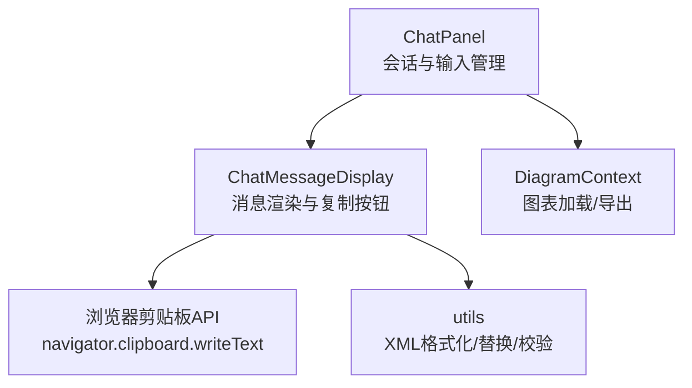
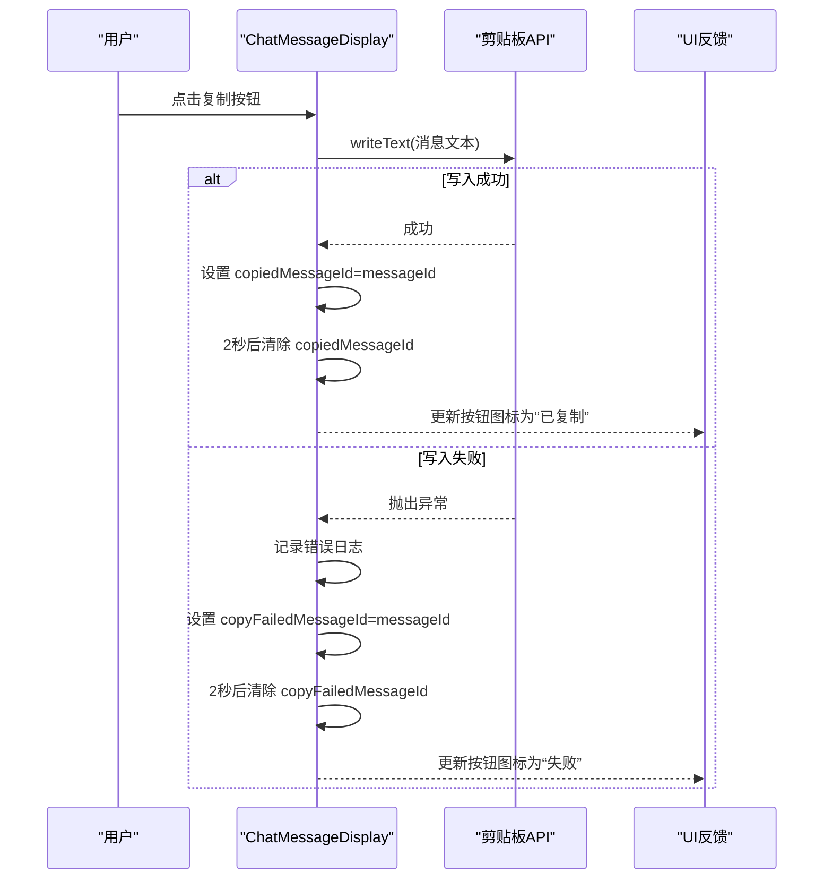
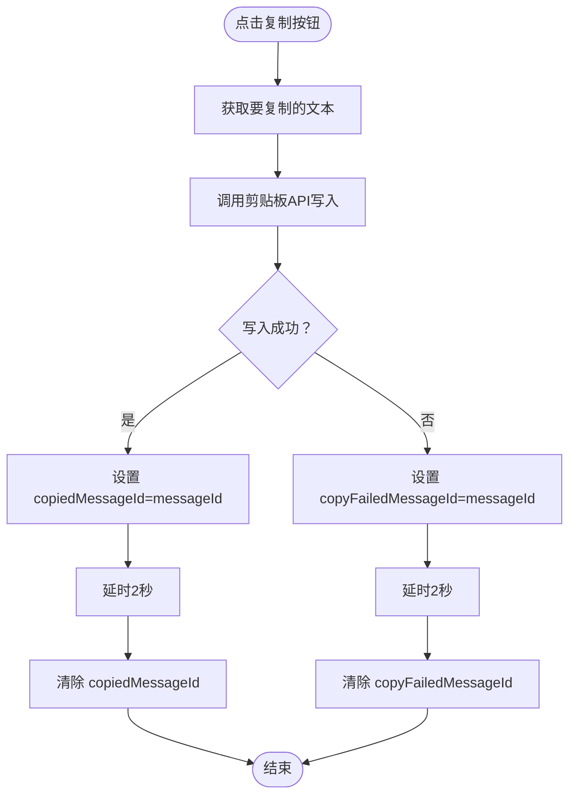
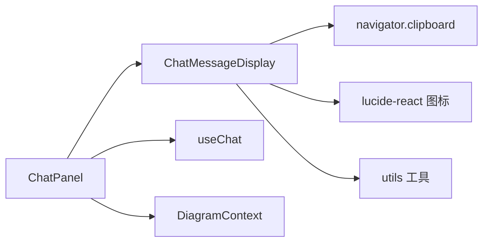

# 消息复制功能

<cite>
**本文引用的文件**
- [components/chat-message-display.tsx](file://components/chat-message-display.tsx)
- [components/chat-panel.tsx](file://components/chat-panel.tsx)
- [lib/utils.ts](file://lib/utils.ts)
- [contexts/diagram-context.tsx](file://contexts/diagram-context.tsx)
</cite>

## 目录
1. [简介](#简介)
2. [项目结构](#项目结构)
3. [核心组件](#核心组件)
4. [架构总览](#架构总览)
5. [详细组件分析](#详细组件分析)
6. [依赖关系分析](#依赖关系分析)
7. [性能考量](#性能考量)
8. [故障排查指南](#故障排查指南)
9. [结论](#结论)

## 简介
本节聚焦“消息复制”功能的实现机制，涵盖：
- 复制按钮的UI位置与交互
- 点击事件处理流程与剪贴板API调用
- copiedMessageId与copyFailedMessageId状态变量如何控制按钮的视觉反馈（复制成功图标显示2秒）
- 在用户消息与AI响应消息中的统一实现方式
- 错误处理最佳实践
- 异步操作如何保证界面响应性

## 项目结构
消息复制功能主要由以下模块协作完成：
- ChatPanel：承载聊天会话与消息列表，负责将消息传递给 ChatMessageDisplay
- ChatMessageDisplay：渲染消息气泡、工具调用块、复制按钮等，并处理复制逻辑
- DiagramContext：提供图表加载与导出能力（与复制功能无直接耦合，但为整体聊天体验提供支撑）
- utils：提供XML处理与校验工具（与复制功能无直接耦合，但为图表相关消息内容提供支持）

图示来源
- [components/chat-panel.tsx](file://components/chat-panel.tsx#L760-L769)
- [components/chat-message-display.tsx](file://components/chat-message-display.tsx#L135-L145)
- [contexts/diagram-context.tsx](file://contexts/diagram-context.tsx#L76-L100)
- [lib/utils.ts](file://lib/utils.ts#L1-L120)

章节来源
- [components/chat-panel.tsx](file://components/chat-panel.tsx#L760-L769)
- [components/chat-message-display.tsx](file://components/chat-message-display.tsx#L135-L145)

## 核心组件
- ChatMessageDisplay
  - 负责渲染用户消息与AI响应消息，为每条消息添加复制按钮
  - 维护两个状态变量用于反馈：copiedMessageId（复制成功）与copyFailedMessageId（复制失败）
  - 提供异步复制函数 copyMessageToClipboard，封装剪贴板写入与错误处理
- ChatPanel
  - 将 messages、sessionId、onRegenerate、onEditMessage 等属性传递给 ChatMessageDisplay
  - 作为上层容器，协调消息流与输入控件

章节来源
- [components/chat-message-display.tsx](file://components/chat-message-display.tsx#L123-L145)
- [components/chat-panel.tsx](file://components/chat-panel.tsx#L760-L769)

## 架构总览
消息复制功能的端到端流程如下：
- 用户点击某条消息旁的复制按钮
- ChatMessageDisplay 的复制函数被触发，调用浏览器剪贴板API写入文本
- 成功时设置 copiedMessageId 并延时清除；失败时设置 copyFailedMessageId 并延时清除
- UI根据状态变量即时更新按钮图标与标题提示

图示来源
- [components/chat-message-display.tsx](file://components/chat-message-display.tsx#L135-L145)

## 详细组件分析

### ChatMessageDisplay：复制按钮与状态反馈
- 状态变量
  - copiedMessageId：记录当前处于“复制成功”状态的消息ID，用于高亮复制按钮并显示成功图标
  - copyFailedMessageId：记录当前处于“复制失败”状态的消息ID，用于显示失败图标
- 复制函数
  - copyMessageToClipboard(messageId, text)
  - 使用 navigator.clipboard.writeText 写入文本
  - 成功：设置 copiedMessageId，并在2秒后自动清除
  - 失败：捕获异常、记录日志，并设置 copyFailedMessageId，在2秒后自动清除
- UI呈现
  - 用户消息行：在消息气泡左侧显示复制按钮，标题随状态变化
  - AI响应行：在消息气泡下方显示复制按钮，标题随状态变化
  - 成功/失败图标切换：根据状态变量动态渲染不同图标

图示来源
- [components/chat-message-display.tsx](file://components/chat-message-display.tsx#L135-L145)
- [components/chat-message-display.tsx](file://components/chat-message-display.tsx#L400-L428)
- [components/chat-message-display.tsx](file://components/chat-message-display.tsx#L646-L678)

章节来源
- [components/chat-message-display.tsx](file://components/chat-message-display.tsx#L123-L145)
- [components/chat-message-display.tsx](file://components/chat-message-display.tsx#L389-L428)
- [components/chat-message-display.tsx](file://components/chat-message-display.tsx#L646-L678)

### ChatPanel：消息传递与入口
- ChatPanel 将 messages、sessionId、onRegenerate、onEditMessage 等参数传递给 ChatMessageDisplay
- 这些参数决定了 ChatMessageDisplay 是否展示复制按钮、重生成按钮、编辑按钮等

章节来源
- [components/chat-panel.tsx](file://components/chat-panel.tsx#L760-L769)

### DiagramContext 与 utils：与复制功能的关系
- DiagramContext 提供图表加载与导出能力，与复制功能无直接耦合
- utils 提供XML格式化、替换与校验等工具，与复制功能无直接耦合
- 二者为整体聊天体验提供支撑，间接影响消息内容（如包含XML的工具输出）

章节来源
- [contexts/diagram-context.tsx](file://contexts/diagram-context.tsx#L76-L100)
- [lib/utils.ts](file://lib/utils.ts#L1-L120)

## 依赖关系分析
- ChatMessageDisplay 依赖
  - 浏览器剪贴板API（navigator.clipboard.writeText）
  - React 状态与副作用（useState、setTimeout）
  - UI 图标库（lucide-react）
- ChatPanel 依赖
  - ChatMessageDisplay 作为子组件
  - useChat 管理消息流与工具调用
- DiagramContext 与 utils
  - 与复制功能无直接依赖，但为消息内容（如XML）提供支持

图示来源
- [components/chat-panel.tsx](file://components/chat-panel.tsx#L760-L769)
- [components/chat-message-display.tsx](file://components/chat-message-display.tsx#L135-L145)

章节来源
- [components/chat-panel.tsx](file://components/chat-panel.tsx#L760-L769)
- [components/chat-message-display.tsx](file://components/chat-message-display.tsx#L135-L145)

## 性能考量
- 异步复制：复制过程通过异步API执行，避免阻塞主线程，确保界面响应性
- 状态清理：成功/失败状态均在2秒后自动清除，避免长期占用内存或状态污染
- 条件渲染：仅对当前处于成功/失败状态的消息按钮进行特殊样式与图标渲染，降低不必要的重绘

[本节为通用指导，不直接分析具体文件]

## 故障排查指南
- 复制按钮无反应
  - 检查浏览器是否允许剪贴板访问（需HTTPS或localhost）
  - 确认复制函数未被其他逻辑覆盖或禁用
- 复制失败图标持续显示
  - 检查异常分支是否正确设置 copyFailedMessageId
  - 确认2秒定时器是否被意外清除
- 成功图标未消失
  - 检查 copiedMessageId 是否在2秒后被清除
  - 确认同一消息ID不会被并发多次复制导致状态冲突

章节来源
- [components/chat-message-display.tsx](file://components/chat-message-display.tsx#L135-L145)

## 结论
消息复制功能通过在 ChatMessageDisplay 中引入两个状态变量与一个异步复制函数，实现了对用户消息与AI响应消息的统一复制能力。其UI反馈简洁直观：成功/失败分别以图标与标题提示呈现，并在2秒后自动恢复原状。该设计保持了良好的界面响应性与可维护性，同时遵循了错误处理的最佳实践。