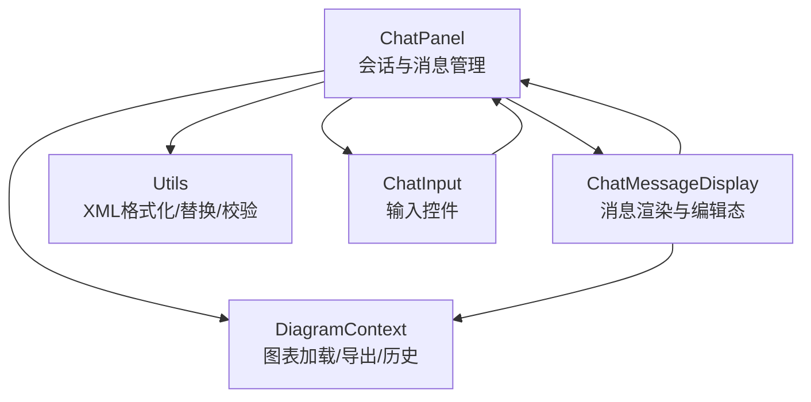
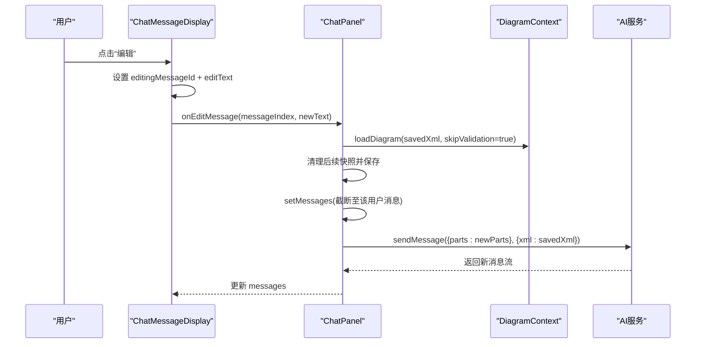
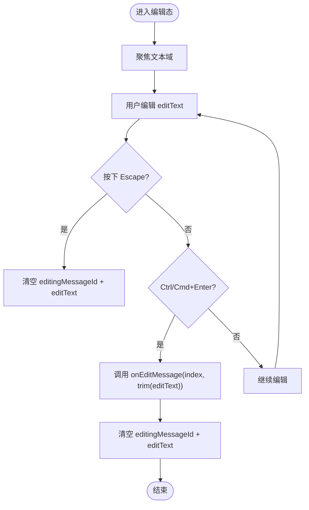
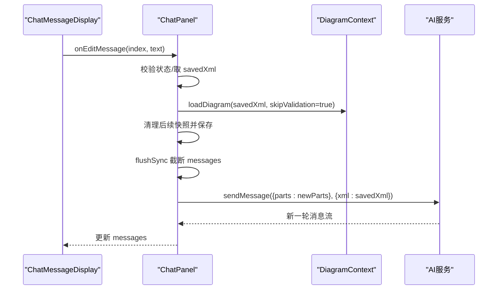
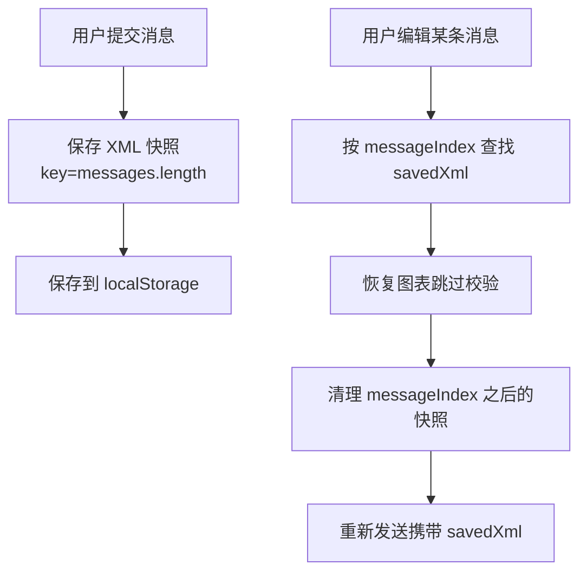
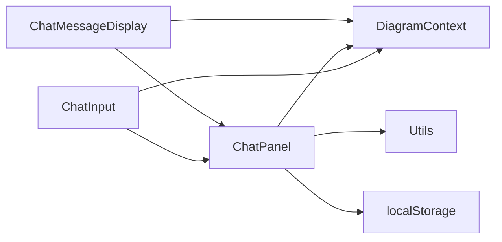

# 消息编辑功能

<cite>
**本文引用的文件列表**
- [components/chat-panel.tsx](file://components/chat-panel.tsx)
- [components/chat-message-display.tsx](file://components/chat-message-display.tsx)
- [components/chat-input.tsx](file://components/chat-input.tsx)
- [contexts/diagram-context.tsx](file://contexts/diagram-context.tsx)
- [lib/utils.ts](file://lib/utils.ts)
</cite>

## 目录
1. [简介](#简介)
2. [项目结构](#项目结构)
3. [核心组件](#核心组件)
4. [架构总览](#架构总览)
5. [详细组件分析](#详细组件分析)
6. [依赖关系分析](#依赖关系分析)
7. [性能考量](#性能考量)
8. [故障排查指南](#故障排查指南)
9. [结论](#结论)

## 简介
本文件深入解析“消息编辑”功能的完整工作流：从用户在聊天面板中点击“编辑”按钮，到进入编辑态、通过键盘快捷键（Ctrl/Cmd+Enter 提交、Escape 取消）、再到提交修改后由父组件重启对话流的全过程。文档重点说明：
- editingMessageId 状态如何控制编辑模式的切换
- editText 状态与文本域的双向绑定机制
- onEditMessage 回调如何通知父组件并触发重新发送流程
- setInput 与 setFiles 的状态更新协调逻辑
- 编辑界面的键盘事件处理与响应式设计
- chat-panel.tsx 中 handleEditMessage 如何利用消息索引与 XML 快照进行一致性恢复与重发

## 项目结构
消息编辑功能涉及三个关键前端模块：
- chat-panel.tsx：负责会话管理、消息持久化、XML 快照存储、编辑入口与提交
- chat-message-display.tsx：渲染消息、提供编辑态 UI、处理键盘事件、触发 onEditMessage
- chat-input.tsx：通用输入控件，支持 Ctrl/Cmd+Enter 提交、粘贴图片等
- contexts/diagram-context.tsx：提供图表加载、导出、历史记录等能力
- lib/utils.ts：提供 XML 格式化、节点替换、结构校验等工具方法

图示来源
- [components/chat-panel.tsx](file://components/chat-panel.tsx#L1-L120)
- [components/chat-message-display.tsx](file://components/chat-message-display.tsx#L1-L120)
- [contexts/diagram-context.tsx](file://contexts/diagram-context.tsx#L1-L120)
- [lib/utils.ts](file://lib/utils.ts#L1-L60)

章节来源
- [components/chat-panel.tsx](file://components/chat-panel.tsx#L1-L120)
- [components/chat-message-display.tsx](file://components/chat-message-display.tsx#L1-L120)
- [contexts/diagram-context.tsx](file://contexts/diagram-context.tsx#L1-L120)
- [lib/utils.ts](file://lib/utils.ts#L1-L60)

## 核心组件
- ChatPanel：维护 messages、sessionId、xmlSnapshotsRef、chartXMLRef；提供 handleEditMessage、onFormSubmit、handleRegenerate 等；负责将 onEditMessage 传入 ChatMessageDisplay。
- ChatMessageDisplay：维护 editingMessageId、editText、editTextareaRef；渲染消息气泡、编辑态文本域、键盘事件；调用 onEditMessage 完成提交。
- DiagramContext：提供 loadDiagram、handleExport、handleExportWithoutHistory 等，确保编辑时能正确恢复/获取 XML。
- Utils：提供 formatXML、replaceXMLParts、validateMxCellStructure 等，支撑编辑与校验。

章节来源
- [components/chat-panel.tsx](file://components/chat-panel.tsx#L587-L647)
- [components/chat-message-display.tsx](file://components/chat-message-display.tsx#L120-L210)
- [contexts/diagram-context.tsx](file://contexts/diagram-context.tsx#L76-L135)
- [lib/utils.ts](file://lib/utils.ts#L240-L506)

## 架构总览
消息编辑的端到端流程如下：

图示来源
- [components/chat-message-display.tsx](file://components/chat-message-display.tsx#L369-L510)
- [components/chat-panel.tsx](file://components/chat-panel.tsx#L587-L647)
- [contexts/diagram-context.tsx](file://contexts/diagram-context.tsx#L76-L100)

## 详细组件分析

### 编辑态状态与双向绑定
- editingMessageId：用于标识当前处于编辑态的消息 id。当用户点击“编辑”或按 Enter/Space 触发编辑时，组件设置 editingMessageId 为对应消息 id；Esc 或提交后清空。
- editText：编辑态文本域的受控值，onChange 同步更新；初始化时填充原用户消息文本。
- 双向绑定：textarea 的 value 绑定 editText；onKeyDown 处理 Esc/Ctrl/Cmd+Enter；提交按钮与“Save & Submit”按钮均调用 onEditMessage。

图示来源
- [components/chat-message-display.tsx](file://components/chat-message-display.tsx#L433-L510)

章节来源
- [components/chat-message-display.tsx](file://components/chat-message-display.tsx#L120-L210)
- [components/chat-message-display.tsx](file://components/chat-message-display.tsx#L369-L510)

### onEditMessage 回调与父组件重启对话流
- 参数：messageIndex（用户消息索引）、newText（编辑后的文本）
- 防并发：若 status 为 streaming/submitted 则直接返回
- 数据准备：根据 messageIndex 从 xmlSnapshotsRef 获取 savedXml（可信快照），并恢复图表
- 截断消息：使用 flushSync 同步更新 setMessages，仅保留该用户消息之前的记录
- 重新发送：构造 newParts（仅更新文本部分），携带 savedXml 作为 body，调用 sendMessage 重启对话流

图示来源
- [components/chat-panel.tsx](file://components/chat-panel.tsx#L587-L647)
- [contexts/diagram-context.tsx](file://contexts/diagram-context.tsx#L76-L100)

章节来源
- [components/chat-panel.tsx](file://components/chat-panel.tsx#L587-L647)

### 消息索引与 XML 快照的关联机制
- 存储策略：每次用户提交消息时，将当前图表 XML 以“消息索引”为键存入 xmlSnapshotsRef（Map<number, string>）。消息索引即 messages.length（即将要追加的新消息位置）。
- 读取策略：编辑时通过 messageIndex 直接从 xmlSnapshotsRef 取出 savedXml，保证编辑前的图表状态与该用户消息一致。
- 清理策略：编辑时删除 messageIndex 之后的所有快照，避免后续消息被错误地基于过期 XML 重放。
- 持久化：saveXmlSnapshots 将 Map 转换为数组并写入 localStorage，以便刷新/关闭后恢复。

图示来源
- [components/chat-panel.tsx](file://components/chat-panel.tsx#L449-L506)
- [components/chat-panel.tsx](file://components/chat-panel.tsx#L379-L393)
- [components/chat-panel.tsx](file://components/chat-panel.tsx#L587-L647)

章节来源
- [components/chat-panel.tsx](file://components/chat-panel.tsx#L315-L326)
- [components/chat-panel.tsx](file://components/chat-panel.tsx#L379-L393)
- [components/chat-panel.tsx](file://components/chat-panel.tsx#L449-L506)
- [components/chat-panel.tsx](file://components/chat-panel.tsx#L587-L647)

### 键盘事件处理与响应式设计
- 编辑态键盘：
  - Escape：取消编辑，清空 editingMessageId 与 editText
  - Ctrl/Cmd+Enter：提交编辑，调用 onEditMessage 并清空
  - Enter/Space：在用户最后一条用户消息上触发编辑态
- 输入态键盘：
  - Ctrl/Cmd+Enter：提交表单（onSubmit）
- 响应式设计：
  - 文本域自动高度调整（根据内容行数与最大高度）
  - 移动端/桌面端布局差异（如按钮提示、图标尺寸）

章节来源
- [components/chat-message-display.tsx](file://components/chat-message-display.tsx#L433-L510)
- [components/chat-input.tsx](file://components/chat-input.tsx#L170-L184)
- [components/chat-input.tsx](file://components/chat-input.tsx#L157-L169)

### setInput 与 setFiles 状态更新的协调逻辑
- setInput：由 ChatMessageDisplay 将当前用户消息文本回填到 ChatPanel 的 input，便于编辑后快速提交。
- setFiles：由 ChatMessageDisplay 将上传的文件列表回填到 ChatPanel 的 files，确保编辑态下仍可附带图片。
- 协调点：ChatPanel 在 onFormSubmit 中会将 files 转为 parts 并随消息发送；编辑态提交时也应保持文件状态一致（虽然编辑主要针对文本，但 UI 层已具备文件回填能力）。

章节来源
- [components/chat-message-display.tsx](file://components/chat-message-display.tsx#L100-L116)
- [components/chat-panel.tsx](file://components/chat-panel.tsx#L449-L506)

## 依赖关系分析
- ChatMessageDisplay 依赖：
  - DiagramContext：loadDiagram、chartXML（用于显示/替换）
  - ChatPanel：onEditMessage 回调
- ChatPanel 依赖：
  - DiagramContext：onFetchChart、loadDiagram、chartXMLRef
  - Utils：formatXML、replaceXMLParts（工具方法）
  - localStorage：messages、xmlSnapshots、diagramXML、sessionId
- ChatInput 依赖：
  - DiagramContext：saveDiagramToFile、diagramHistory
  - 文件校验与预览：文件数量/大小限制、拖拽/粘贴/选择

图示来源
- [components/chat-message-display.tsx](file://components/chat-message-display.tsx#L1-L120)
- [components/chat-panel.tsx](file://components/chat-panel.tsx#L1-L120)
- [contexts/diagram-context.tsx](file://contexts/diagram-context.tsx#L1-L120)
- [lib/utils.ts](file://lib/utils.ts#L1-L60)

章节来源
- [components/chat-message-display.tsx](file://components/chat-message-display.tsx#L1-L120)
- [components/chat-panel.tsx](file://components/chat-panel.tsx#L1-L120)
- [contexts/diagram-context.tsx](file://contexts/diagram-context.tsx#L1-L120)
- [lib/utils.ts](file://lib/utils.ts#L1-L60)

## 性能考量
- 同步状态更新：编辑提交前使用 flushSync 截断 messages，确保 sendMessage 发送时消息树处于一致状态，避免竞态。
- 快照清理：编辑后仅保留到该消息为止的快照，减少后续重放时的无效计算。
- 图表恢复：编辑态使用 skipValidation=true 的 loadDiagram，避免重复校验带来的开销。
- 本地持久化：XML 快照与消息列表写入 localStorage，减少刷新/关闭后重建成本。

章节来源
- [components/chat-panel.tsx](file://components/chat-panel.tsx#L566-L570)
- [components/chat-panel.tsx](file://components/chat-panel.tsx#L604-L616)
- [contexts/diagram-context.tsx](file://contexts/diagram-context.tsx#L76-L100)

## 故障排查指南
- 编辑后无法提交：
  - 检查 status 是否为 streaming/submitted；若是则需等待或停止生成后再试
  - 确认 messageIndex 对应的 savedXml 是否存在（快照清理后可能缺失）
- 图表未恢复：
  - 确认 loadDiagram 返回值是否为 null；若非 null 表示 XML 结构不合法
- 提交后无响应：
  - 检查 sendMessage 是否被正确调用，headers/body 是否包含 sessionId 与 xml
- 快照丢失：
  - 确认 xmlSnapshotsRef 是否被正确清理；检查 saveXmlSnapshots 是否成功写入 localStorage

章节来源
- [components/chat-panel.tsx](file://components/chat-panel.tsx#L587-L647)
- [contexts/diagram-context.tsx](file://contexts/diagram-context.tsx#L76-L100)

## 结论
消息编辑功能通过“消息索引 + XML 快照”的机制，在编辑态与提交态之间保持图表状态的一致性；editingMessageId 与 editText 实现了直观的编辑体验；onEditMessage 回调驱动父组件同步更新消息树并重启对话流。配合 flushSync 的同步更新、快照清理与本地持久化，整体流程稳定可靠，同时兼顾了性能与用户体验。