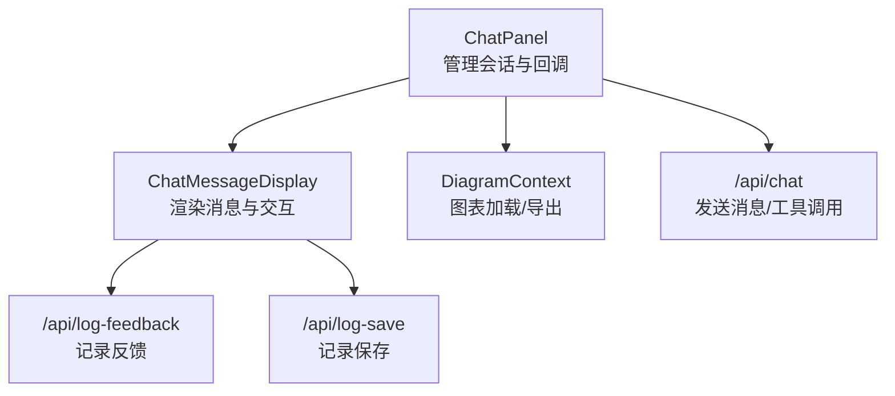
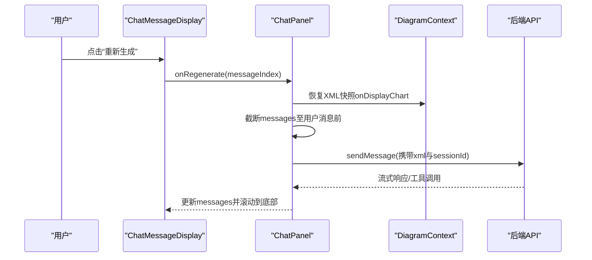
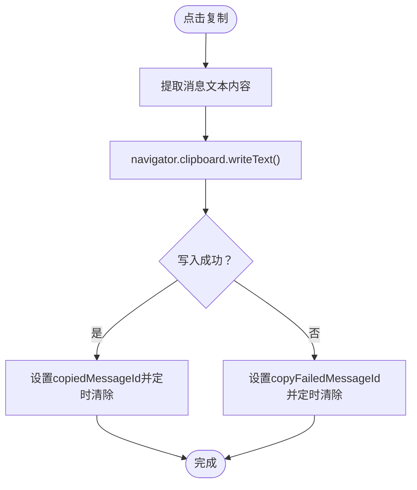
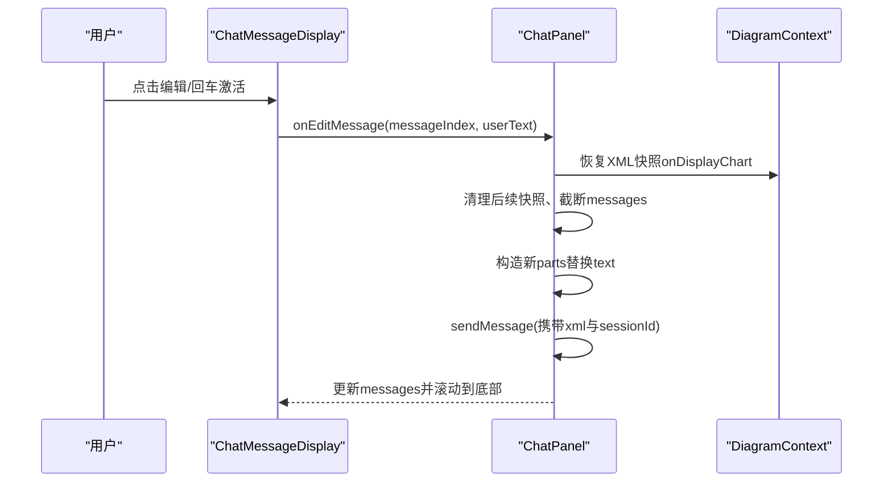
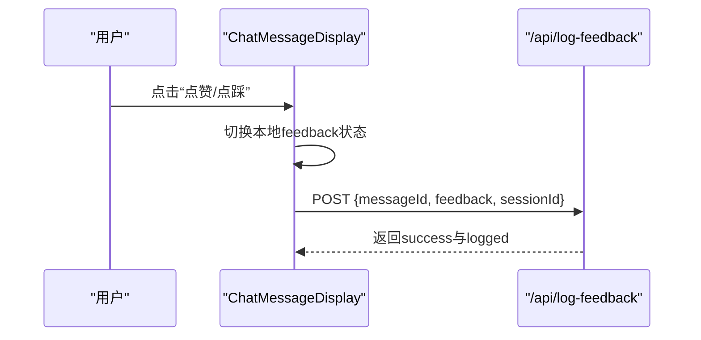
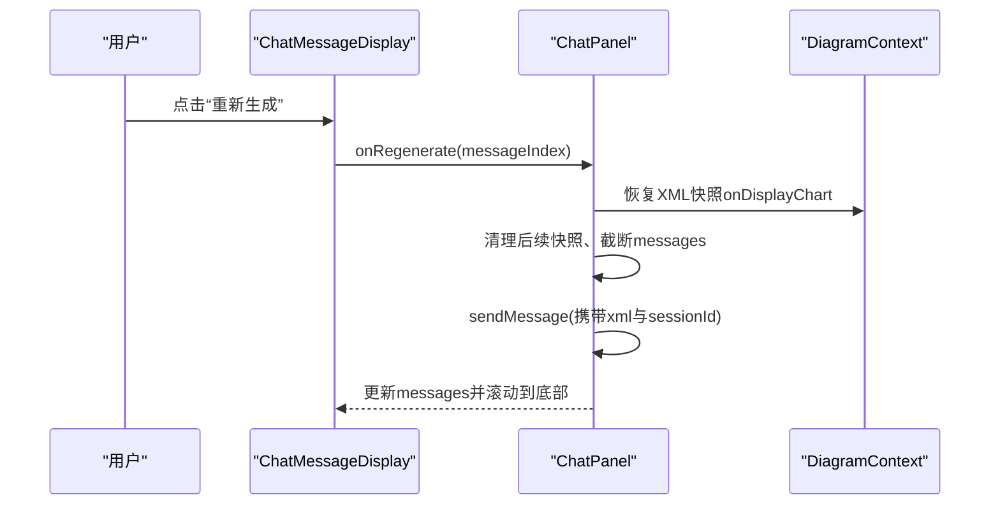
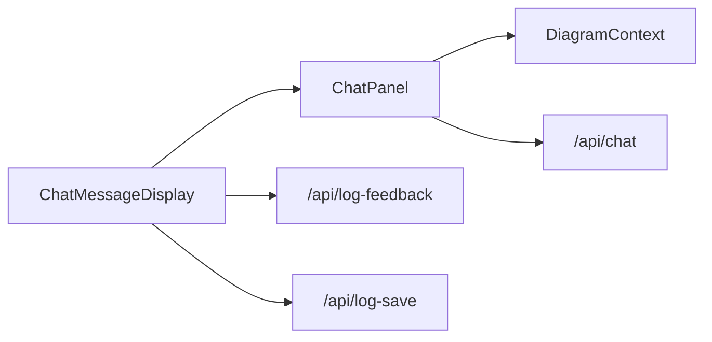

# 用户交互功能

<cite>
**本文引用的文件**
- [components/chat-message-display.tsx](file://components/chat-message-display.tsx)
- [components/chat-panel.tsx](file://components/chat-panel.tsx)
- [contexts/diagram-context.tsx](file://contexts/diagram-context.tsx)
- [app/api/log-feedback/route.ts](file://app/api/log-feedback/route.ts)
- [app/api/log-save/route.ts](file://app/api/log-save/route.ts)
</cite>

## 目录
1. [简介](#简介)
2. [项目结构](#项目结构)
3. [核心组件](#核心组件)
4. [架构总览](#架构总览)
5. [详细组件分析](#详细组件分析)
6. [依赖关系分析](#依赖关系分析)
7. [性能考量](#性能考量)
8. [故障排查指南](#故障排查指南)
9. [结论](#结论)

## 简介
本文件系统性阐述消息显示区域支持的用户交互功能，包括：
- 消息复制：支持复制用户消息与助手响应文本内容
- 消息编辑：仅对“最后一条用户消息”开放编辑入口，支持键盘快捷键保存
- 反馈（点赞/点踩）：为最后一条助手消息提供“好/坏”反馈，并通过API记录
- 重新生成：针对最后一条助手消息，基于其对应的用户消息历史快照进行重试

同时，本文说明各交互的UI元素位置与触发机制；解释onRegenerate与onEditMessage回调如何与父组件通信以启动新的对话流；阐述反馈按钮的状态持久化逻辑及API记录流程；讨论消息编辑时setInput与setFiles状态更新的协调机制；并提供交互流程的时序图，帮助理解事件传播路径。

## 项目结构
消息交互主要分布在以下模块：
- ChatMessageDisplay：渲染消息列表、提供复制、编辑、反馈、重新生成等交互
- ChatPanel：承载聊天会话状态、处理onRegenerate/onEditMessage回调、与AI服务通信
- DiagramContext：提供图表加载/导出能力，支撑工具调用与编辑
- API路由：log-feedback与log-save用于记录用户反馈与保存行为

**图表来源**
- [components/chat-panel.tsx](file://components/chat-panel.tsx#L760-L768)
- [components/chat-message-display.tsx](file://components/chat-message-display.tsx#L345-L746)
- [contexts/diagram-context.tsx](file://contexts/diagram-context.tsx#L1-L268)
- [app/api/log-feedback/route.ts](file://app/api/log-feedback/route.ts#L1-L113)
- [app/api/log-save/route.ts](file://app/api/log-save/route.ts#L1-L72)

**章节来源**
- [components/chat-panel.tsx](file://components/chat-panel.tsx#L760-L768)
- [components/chat-message-display.tsx](file://components/chat-message-display.tsx#L345-L746)
- [contexts/diagram-context.tsx](file://contexts/diagram-context.tsx#L1-L268)

## 核心组件
- ChatMessageDisplay
  - 负责渲染消息气泡、工具调用展示、复制、编辑、反馈、重新生成按钮
  - 提供onRegenerate与onEditMessage回调参数，交由父组件执行
- ChatPanel
  - 维护messages、files、sessionId等状态
  - 实现handleRegenerate与handleEditMessage，基于XML快照恢复图表状态并重新发送消息
  - 通过useChat与后端API通信
- DiagramContext
  - 提供图表加载、导出、历史管理等能力，支撑工具调用与编辑
- API路由
  - /api/log-feedback：记录用户反馈到Langfuse
  - /api/log-save：记录保存事件到Langfuse

**章节来源**
- [components/chat-message-display.tsx](file://components/chat-message-display.tsx#L100-L116)
- [components/chat-panel.tsx](file://components/chat-panel.tsx#L518-L647)
- [contexts/diagram-context.tsx](file://contexts/diagram-context.tsx#L1-L268)
- [app/api/log-feedback/route.ts](file://app/api/log-feedback/route.ts#L1-L113)
- [app/api/log-save/route.ts](file://app/api/log-save/route.ts#L1-L72)

## 架构总览
消息交互在组件间传递路径如下：
- 用户在ChatMessageDisplay中触发复制/编辑/反馈/重新生成
- 复制与反馈由组件内部处理；重新生成与编辑通过回调onRegenerate/onEditMessage交由ChatPanel
- ChatPanel根据XML快照恢复图表状态，清理后续快照，截断消息链，然后重新调用sendMessage发起新对话流

**图表来源**
- [components/chat-message-display.tsx](file://components/chat-message-display.tsx#L679-L706)
- [components/chat-panel.tsx](file://components/chat-panel.tsx#L518-L585)
- [contexts/diagram-context.tsx](file://contexts/diagram-context.tsx#L1-L268)

## 详细组件分析

### 消息复制（复制按钮）
- UI位置
  - 用户消息：在消息气泡左侧显示复制按钮
  - 助手消息：在消息气泡下方显示复制按钮
- 触发机制
  - 点击复制按钮后，调用剪贴板API写入文本内容
  - 成功/失败分别设置copiedMessageId或copyFailedMessageId并在2秒后自动清除
- 文本来源
  - 用户消息：从消息的text parts拼接
  - 助手消息：从assistant消息的text parts拼接

**图表来源**
- [components/chat-message-display.tsx](file://components/chat-message-display.tsx#L135-L145)
- [components/chat-message-display.tsx](file://components/chat-message-display.tsx#L646-L678)

**章节来源**
- [components/chat-message-display.tsx](file://components/chat-message-display.tsx#L380-L429)
- [components/chat-message-display.tsx](file://components/chat-message-display.tsx#L646-L678)

### 消息编辑（编辑按钮与编辑模式）
- UI位置与条件
  - 仅当某条消息为“最后一条用户消息”且父组件提供了onEditMessage时，才显示编辑入口
  - 编辑入口可为：消息气泡旁的铅笔图标、消息气泡本身（role=user且isLastUserMessage且onEditMessage时可点击/回车激活）
- 触发机制
  - 点击或按Enter/Space激活编辑模式，进入textarea编辑框
  - 支持Esc取消；支持Ctrl/Cmd+Enter保存并提交
- 保存与提交
  - 调用onEditMessage(messageIndex, newText)，随后清空编辑态
  - ChatPanel.handleEditMessage负责：恢复XML快照、清理后续快照、截断messages、构造新parts并重新sendMessage

**图表来源**
- [components/chat-message-display.tsx](file://components/chat-message-display.tsx#L380-L429)
- [components/chat-message-display.tsx](file://components/chat-message-display.tsx#L511-L581)
- [components/chat-panel.tsx](file://components/chat-panel.tsx#L587-L647)
- [contexts/diagram-context.tsx](file://contexts/diagram-context.tsx#L1-L268)

**章节来源**
- [components/chat-message-display.tsx](file://components/chat-message-display.tsx#L433-L510)
- [components/chat-message-display.tsx](file://components/chat-message-display.tsx#L511-L581)
- [components/chat-panel.tsx](file://components/chat-panel.tsx#L587-L647)

### 反馈（点赞/点踩）
- UI位置
  - 助手消息下方显示“点赞/点踩”按钮
- 触发机制
  - 点击对应按钮，切换当前messageId的反馈状态（good/bad），再次点击可取消
- 状态持久化
  - 前端使用本地状态feedback记录（messageId -> "good"|"bad"|未选）
  - 后端通过POST /api/log-feedback记录到Langfuse，附带sessionId
- API记录流程
  - 验证输入（messageId、feedback、sessionId）
  - 若存在最近聊天trace，则附加score到该trace；否则创建独立trace并记录score

**图表来源**
- [components/chat-message-display.tsx](file://components/chat-message-display.tsx#L696-L735)
- [app/api/log-feedback/route.ts](file://app/api/log-feedback/route.ts#L1-L113)

**章节来源**
- [components/chat-message-display.tsx](file://components/chat-message-display.tsx#L147-L173)
- [app/api/log-feedback/route.ts](file://app/api/log-feedback/route.ts#L1-L113)

### 重新生成
- UI位置
  - 仅对“最后一条助手消息”显示“重新生成”按钮
- 触发机制
  - 点击后调用onRegenerate(messageIndex)
  - ChatPanel.handleRegenerate定位上一条用户消息，读取其XML快照，恢复图表状态，清理后续快照，截断messages，重新sendMessage
- 与父组件通信
  - ChatMessageDisplay通过props.onRegenerate将索引传给ChatPanel
  - ChatPanel.handleRegenerate内部不直接修改messages，而是通过flushSync确保同步更新后再sendMessage

**图表来源**
- [components/chat-message-display.tsx](file://components/chat-message-display.tsx#L679-L694)
- [components/chat-panel.tsx](file://components/chat-panel.tsx#L518-L585)
- [contexts/diagram-context.tsx](file://contexts/diagram-context.tsx#L1-L268)

**章节来源**
- [components/chat-message-display.tsx](file://components/chat-message-display.tsx#L679-L694)
- [components/chat-panel.tsx](file://components/chat-panel.tsx#L518-L585)

### 消息编辑时setInput与setFiles状态更新的协调机制
- setInput与setFiles由父组件ChatPanel提供
- ChatMessageDisplay在渲染用户消息时，若为最后一条用户消息且支持编辑，会在消息气泡旁显示编辑入口
- 当用户点击编辑或双击消息气泡时：
  - 进入编辑模式，textarea初始值为用户消息文本
  - 保存时调用onEditMessage(messageIndex, newText)
  - ChatPanel.handleEditMessage内部会：
    - 恢复XML快照（onDisplayChart）
    - 清理后续快照
    - 截断messages
    - 重新sendMessage（携带xml与sessionId）
- 文件状态
  - 编辑场景下，文件列表通常保持不变（除非用户在输入框中再次添加）
  - ChatMessageDisplay在编辑模式下不直接操作文件，文件变更由ChatInput控制

**章节来源**
- [components/chat-message-display.tsx](file://components/chat-message-display.tsx#L380-L429)
- [components/chat-message-display.tsx](file://components/chat-message-display.tsx#L511-L581)
- [components/chat-panel.tsx](file://components/chat-panel.tsx#L587-L647)

## 依赖关系分析
- ChatMessageDisplay依赖
  - DiagramContext：用于图表显示与XML验证
  - props回调：onRegenerate、onEditMessage、setInput、setFiles
- ChatPanel依赖
  - useChat：与后端API通信、工具调用处理
  - DiagramContext：图表加载/导出、历史管理
  - 本地存储：messages、XML快照、sessionId
- API路由
  - /api/log-feedback：Langfuse反馈记录
  - /api/log-save：Langfuse保存标记

**图表来源**
- [components/chat-message-display.tsx](file://components/chat-message-display.tsx#L100-L116)
- [components/chat-panel.tsx](file://components/chat-panel.tsx#L760-L768)
- [contexts/diagram-context.tsx](file://contexts/diagram-context.tsx#L1-L268)
- [app/api/log-feedback/route.ts](file://app/api/log-feedback/route.ts#L1-L113)
- [app/api/log-save/route.ts](file://app/api/log-save/route.ts#L1-L72)

**章节来源**
- [components/chat-message-display.tsx](file://components/chat-message-display.tsx#L100-L116)
- [components/chat-panel.tsx](file://components/chat-panel.tsx#L760-L768)
- [contexts/diagram-context.tsx](file://contexts/diagram-context.tsx#L1-L268)

## 性能考量
- 编辑/重新生成前的XML快照管理
  - 使用Map按消息索引缓存XML，避免每次从DrawIO导出，减少网络与解析开销
  - 在编辑/重新生成时清理后续快照，防止快照累积导致内存占用上升
- 滚动与动画
  - 消息列表底部ref滚动到最新消息，配合逐条动画延迟，保证视觉流畅性
- 剪贴板与反馈API
  - 复制与反馈均为轻量操作；反馈API采用异步POST，不影响主交互流程

[本节为通用建议，无需特定文件引用]

## 故障排查指南
- 复制失败
  - 现象：复制按钮显示失败状态
  - 排查：检查浏览器权限与剪贴板可用性；确认消息文本非空
- 反馈未记录
  - 现象：点击点赞/点踩无效果或刷新后状态丢失
  - 排查：确认sessionId有效；检查Langfuse客户端是否可用；查看API返回错误
- 重新生成无效
  - 现象：点击“重新生成”无响应
  - 排查：确认当前状态非streaming/submitted；检查是否有对应用户消息与XML快照；查看控制台错误
- 编辑保存无效
  - 现象：编辑后未重新发送
  - 排查：确认onEditMessage回调已传入父组件；检查messages截断与sendMessage调用；核对XML快照是否正确恢复

**章节来源**
- [components/chat-message-display.tsx](file://components/chat-message-display.tsx#L135-L145)
- [components/chat-message-display.tsx](file://components/chat-message-display.tsx#L696-L735)
- [components/chat-panel.tsx](file://components/chat-panel.tsx#L518-L585)
- [components/chat-panel.tsx](file://components/chat-panel.tsx#L587-L647)

## 结论
消息显示区域围绕“复制、编辑、反馈、重新生成”构建了完整的用户交互闭环：
- 复制与反馈为即时反馈，状态在前端持久化并通过API上报
- 编辑与重新生成通过XML快照恢复图表状态，确保上下文一致性
- ChatPanel作为中枢协调状态与回调，确保事件传播路径清晰、可控