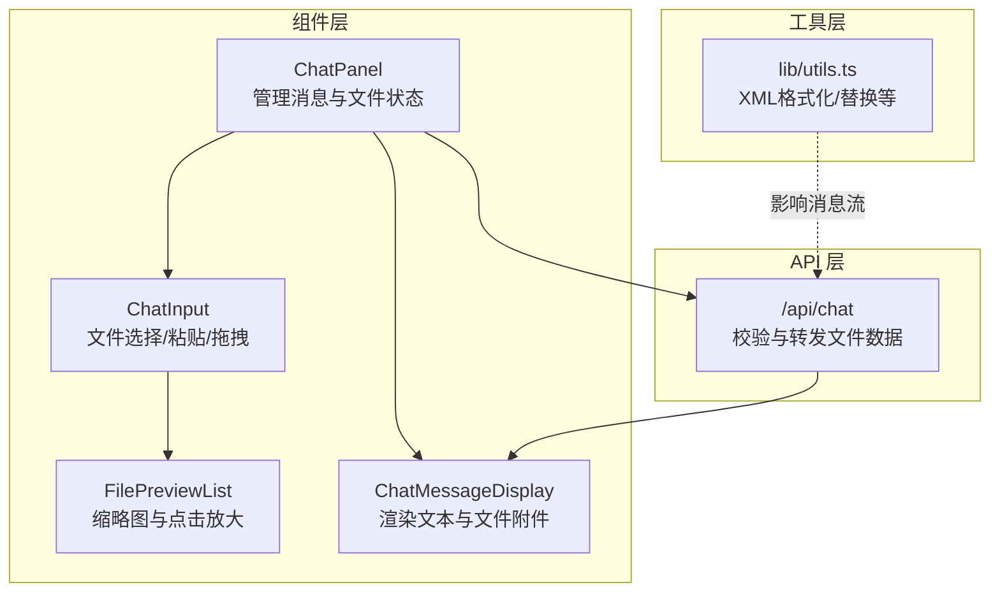
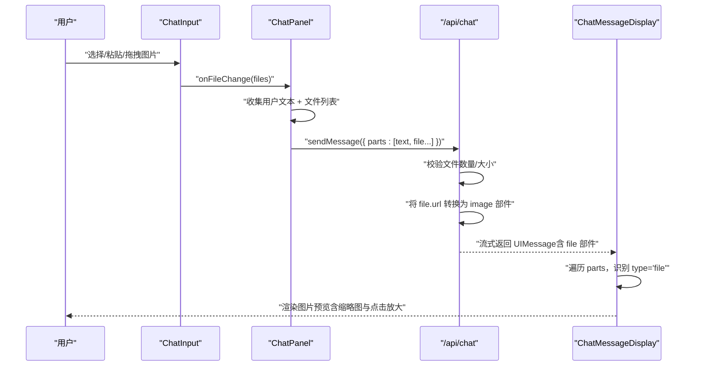
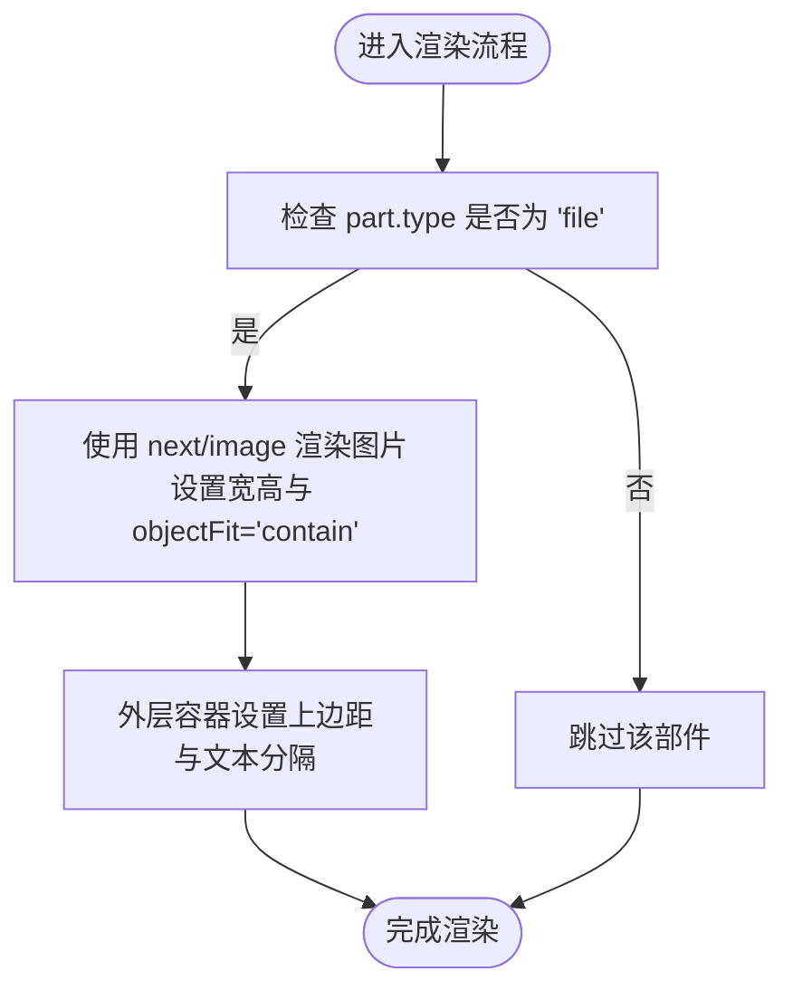
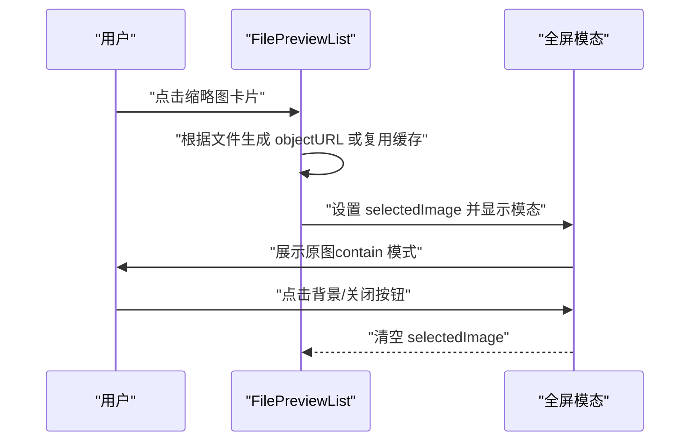
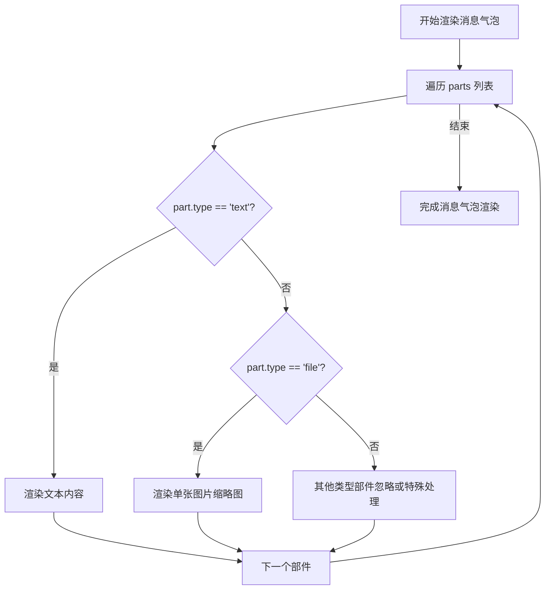
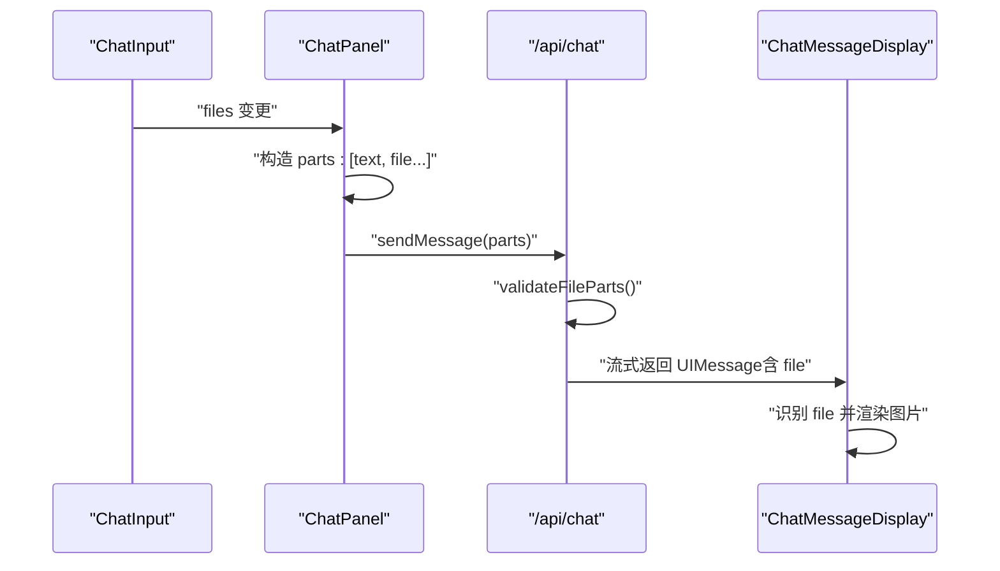
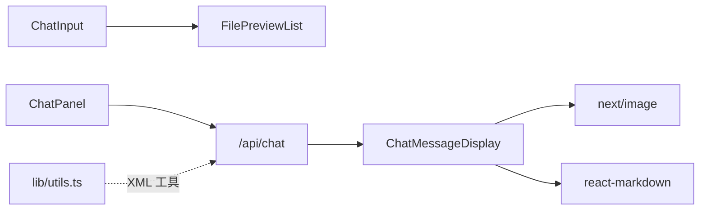

# 附件渲染

<cite>
**本文引用的文件**
- [components/chat-message-display.tsx](file://components/chat-message-display.tsx)
- [components/file-preview-list.tsx](file://components/file-preview-list.tsx)
- [components/chat-input.tsx](file://components/chat-input.tsx)
- [components/chat-panel.tsx](file://components/chat-panel.tsx)
- [app/api/chat/route.ts](file://app/api/chat/route.ts)
- [lib/utils.ts](file://lib/utils.ts)
</cite>

## 目录
1. [简介](#简介)
2. [项目结构](#项目结构)
3. [核心组件](#核心组件)
4. [架构总览](#架构总览)
5. [详细组件分析](#详细组件分析)
6. [依赖分析](#依赖分析)
7. [性能考虑](#性能考虑)
8. [故障排查指南](#故障排查指南)
9. [结论](#结论)

## 简介
本篇文档聚焦于 ChatMessageDisplay 组件对“图像附件”的渲染机制，系统性阐述以下主题：
- 如何通过 file 类型的消息部件识别并展示上传的图片预览；
- 缩略图布局与点击放大交互；
- 附件与消息正文的排列关系及多附件时的响应式排版策略；
- 文件元数据（如文件名、大小）在当前实现中的显示逻辑；
- 附件数据的传递路径与渲染流程；
- 针对大尺寸图片的性能优化建议（如懒加载、压缩预览）。

## 项目结构
围绕附件渲染的关键文件分布如下：
- 组件层：聊天消息展示、文件预览列表、聊天输入、聊天面板
- API 层：后端聊天接口，负责校验与转发文件数据
- 工具层：XML 处理与验证工具（与附件渲染无直接耦合，但影响整体消息流）

图表来源
- [components/chat-panel.tsx](file://components/chat-panel.tsx#L760-L800)
- [components/chat-input.tsx](file://components/chat-input.tsx#L291-L300)
- [components/file-preview-list.tsx](file://components/file-preview-list.tsx#L66-L133)
- [components/chat-message-display.tsx](file://components/chat-message-display.tsx#L582-L633)
- [app/api/chat/route.ts](file://app/api/chat/route.ts#L187-L296)
- [lib/utils.ts](file://lib/utils.ts#L1-L711)

章节来源
- [components/chat-panel.tsx](file://components/chat-panel.tsx#L760-L800)
- [components/chat-input.tsx](file://components/chat-input.tsx#L291-L300)
- [components/file-preview-list.tsx](file://components/file-preview-list.tsx#L66-L133)
- [components/chat-message-display.tsx](file://components/chat-message-display.tsx#L582-L633)
- [app/api/chat/route.ts](file://app/api/chat/route.ts#L187-L296)
- [lib/utils.ts](file://lib/utils.ts#L1-L711)

## 核心组件
- ChatMessageDisplay：负责将 UIMessage 的 parts 渲染为消息气泡，其中 file 类型部件会被渲染为图片预览。
- FilePreviewList：在输入侧提供已选文件的缩略图预览，并支持点击放大查看原图。
- ChatInput：负责文件选择、粘贴、拖拽、校验与移除；将文件集合传递给 ChatPanel。
- ChatPanel：组装消息与文件，将用户输入与文件转换为 UIMessage.parts 并调用 sendMessage；同时将 messages 传入 ChatMessageDisplay。
- /api/chat：接收前端消息，校验文件数量与大小，将 file 部件转换为模型可消费的 image 内容。

章节来源
- [components/chat-message-display.tsx](file://components/chat-message-display.tsx#L582-L633)
- [components/file-preview-list.tsx](file://components/file-preview-list.tsx#L66-L133)
- [components/chat-input.tsx](file://components/chat-input.tsx#L114-L144)
- [components/chat-panel.tsx](file://components/chat-panel.tsx#L449-L506)
- [app/api/chat/route.ts](file://app/api/chat/route.ts#L187-L296)

## 架构总览
下图展示了从用户选择文件到消息中渲染图片的完整链路。

图表来源
- [components/chat-input.tsx](file://components/chat-input.tsx#L291-L300)
- [components/chat-panel.tsx](file://components/chat-panel.tsx#L449-L506)
- [app/api/chat/route.ts](file://app/api/chat/route.ts#L187-L296)
- [components/chat-message-display.tsx](file://components/chat-message-display.tsx#L582-L633)

## 详细组件分析

### ChatMessageDisplay 对图像附件的渲染机制
- 识别与过滤：组件会遍历 message.parts，仅当 part.type 为 "file" 时进行渲染。
- 渲染方式：使用 next/image 将 part.url 作为 src 渲染为图片，设置固定宽高与 contain 的 objectFit，以保持比例并避免裁剪。
- 布局与间距：每个 file 部件外层包裹一个带上边距的容器，保证与消息文本的视觉分隔。
- 点击放大：当前渲染逻辑未内置点击放大，但 ChatInput 中的 FilePreviewList 提供了缩略图点击放大能力，可在用户侧预览与确认后再提交。

图表来源
- [components/chat-message-display.tsx](file://components/chat-message-display.tsx#L582-L633)

章节来源
- [components/chat-message-display.tsx](file://components/chat-message-display.tsx#L582-L633)

### 缩略图布局与点击放大
- 缩略图布局：FilePreviewList 使用 Flex 布局，wrap 容器内每个文件项为固定尺寸的缩略图卡片，鼠标悬停显示移除按钮。
- 点击放大：点击缩略图会打开全屏模态，展示原图（使用较大的宽高），点击模态背景或关闭按钮可退出。
- 交互细节：缩略图点击事件绑定在卡片容器上；模态内部图片点击不会冒泡至背景，避免误关。

图表来源
- [components/file-preview-list.tsx](file://components/file-preview-list.tsx#L66-L133)

章节来源
- [components/file-preview-list.tsx](file://components/file-preview-list.tsx#L66-L133)

### 附件与消息内容的排列关系与多附件排版
- 排列关系：ChatMessageDisplay 在同一消息气泡内按顺序渲染所有 parts，先文本后文件，文件之间通过外层容器的上边距分隔。
- 多附件排版：当前实现未对多附件做专门的网格/瀑布流布局，缩略图由 wrap 容器自动换行，形成响应式堆叠。若需更复杂的排版，可在 ChatMessageDisplay 中引入自适应网格或分页展示。

图表来源
- [components/chat-message-display.tsx](file://components/chat-message-display.tsx#L582-L633)

章节来源
- [components/chat-message-display.tsx](file://components/chat-message-display.tsx#L582-L633)

### 文件元数据显示逻辑
- 当前实现中，ChatMessageDisplay 仅使用 file.url 进行图片渲染，未展示文件名、大小等元信息。
- 若需显示元数据，可在 ChatMessageDisplay 的 file 分支中增加文件名/大小的展示区域；或在 ChatInput 的 FilePreviewList 中保留非图片文件的名称展示。

章节来源
- [components/chat-message-display.tsx](file://components/chat-message-display.tsx#L603-L627)
- [components/file-preview-list.tsx](file://components/file-preview-list.tsx#L88-L91)

### 附件数据传递与渲染流程
- 用户侧：ChatInput 支持文件选择、粘贴与拖拽，进行数量与大小校验，最终将文件数组传递给 ChatPanel。
- 消息组装：ChatPanel 将用户文本与文件列表转换为 UIMessage.parts，其中文件以 { type: "file", url, mediaType } 的形式加入。
- 发送与校验：/api/chat 接收消息，校验文件数量与大小，将 file 部件转换为模型可消费的 image 内容，再流式返回给前端。
- 渲染：ChatMessageDisplay 接收 UIMessage 流，识别 file 部件并渲染图片。

图表来源
- [components/chat-input.tsx](file://components/chat-input.tsx#L114-L144)
- [components/chat-panel.tsx](file://components/chat-panel.tsx#L449-L506)
- [app/api/chat/route.ts](file://app/api/chat/route.ts#L187-L296)
- [components/chat-message-display.tsx](file://components/chat-message-display.tsx#L582-L633)

章节来源
- [components/chat-input.tsx](file://components/chat-input.tsx#L114-L144)
- [components/chat-panel.tsx](file://components/chat-panel.tsx#L449-L506)
- [app/api/chat/route.ts](file://app/api/chat/route.ts#L187-L296)
- [components/chat-message-display.tsx](file://components/chat-message-display.tsx#L582-L633)

## 依赖分析
- ChatMessageDisplay 依赖 next/image 进行图片渲染，依赖 ReactMarkdown 渲染文本。
- ChatInput 依赖 FilePreviewList 提供缩略图与点击放大。
- ChatPanel 负责将用户输入与文件转换为 UIMessage.parts，并调用 sendMessage。
- /api/chat 负责校验文件并转换为模型可用的 image 部件。
- lib/utils.ts 提供 XML 处理工具，虽不直接参与图片渲染，但影响消息流的整体稳定性。

图表来源
- [components/chat-message-display.tsx](file://components/chat-message-display.tsx#L1-L30)
- [components/chat-input.tsx](file://components/chat-input.tsx#L31-L33)
- [components/file-preview-list.tsx](file://components/file-preview-list.tsx#L1-L12)
- [components/chat-panel.tsx](file://components/chat-panel.tsx#L449-L506)
- [app/api/chat/route.ts](file://app/api/chat/route.ts#L187-L296)
- [lib/utils.ts](file://lib/utils.ts#L1-L711)

章节来源
- [components/chat-message-display.tsx](file://components/chat-message-display.tsx#L1-L30)
- [components/chat-input.tsx](file://components/chat-input.tsx#L31-L33)
- [components/file-preview-list.tsx](file://components/file-preview-list.tsx#L1-L12)
- [components/chat-panel.tsx](file://components/chat-panel.tsx#L449-L506)
- [app/api/chat/route.ts](file://app/api/chat/route.ts#L187-L296)
- [lib/utils.ts](file://lib/utils.ts#L1-L711)

## 性能考虑
- 图片尺寸与对象URL
  - ChatInput 使用 FileReader 将 File 转为 data URL，再由 ChatPanel 注入到 UIMessage.parts。对于大图，data URL 会显著增大消息体积，可能影响网络传输与渲染性能。
  - 建议：在 ChatInput 侧对大图进行压缩（如 canvas 压缩），或在 ChatPanel 侧限制最大边长与质量参数，减少 data URL 的体积。
- 懒加载与占位
  - ChatMessageDisplay 已使用 contain 的 objectFit，但未启用懒加载。对于多图场景，建议：
    - 使用 loading="lazy"（若浏览器支持）；
    - 使用 IntersectionObserver 实现懒加载；
    - 为未加载的图片提供骨架屏占位。
- 缓存与复用
  - FilePreviewList 已对 objectURL 进行缓存与清理，避免重复创建 URL。可进一步在 ChatMessageDisplay 中对 data URL 进行缓存键（如文件哈希）以避免重复渲染。
- 服务端校验
  - /api/chat 对文件数量与大小进行严格校验，有助于防止超大附件导致的内存与网络压力。

章节来源
- [components/chat-input.tsx](file://components/chat-input.tsx#L43-L51)
- [components/chat-panel.tsx](file://components/chat-panel.tsx#L449-L506)
- [app/api/chat/route.ts](file://app/api/chat/route.ts#L187-L296)
- [components/file-preview-list.tsx](file://components/file-preview-list.tsx#L17-L43)

## 故障排查指南
- 图片无法显示
  - 检查 ChatMessageDisplay 的 file 分支是否被正确触发（确保 part.type 为 "file"）。
  - 确认 file.url 是否为有效的 data URL 或可访问的资源地址。
- 缩略图点击无反应
  - 检查 FilePreviewList 的点击事件绑定与 selectedImage 状态更新逻辑。
- 大图加载缓慢
  - 确认是否进行了压缩或限制尺寸；检查是否存在过多图片同时渲染。
- 文件过大或数量超限
  - 查看 ChatInput 的校验提示与 /api/chat 的错误返回，确保文件大小与数量符合限制。

章节来源
- [components/chat-message-display.tsx](file://components/chat-message-display.tsx#L582-L633)
- [components/file-preview-list.tsx](file://components/file-preview-list.tsx#L66-L133)
- [components/chat-input.tsx](file://components/chat-input.tsx#L43-L51)
- [app/api/chat/route.ts](file://app/api/chat/route.ts#L187-L296)

## 结论
- ChatMessageDisplay 对图像附件的渲染采用简洁直观的方式：识别 file 类型部件，使用 next/image 以 contain 模式渲染图片，保证比例与可读性。
- 缩略图与点击放大的体验由 ChatInput 的 FilePreviewList 提供，便于用户在提交前预览与确认。
- 多附件时采用 wrap 自动换行的简单布局；若需更佳的视觉与交互，可在 ChatMessageDisplay 中扩展网格/瀑布流与懒加载策略。
- 文件元数据（文件名、大小）在当前实现中未展示，如需可扩展至 ChatMessageDisplay 或 FilePreviewList。
- 针对大图，建议在前端进行压缩与尺寸限制，并结合懒加载与缓存策略提升性能与用户体验。