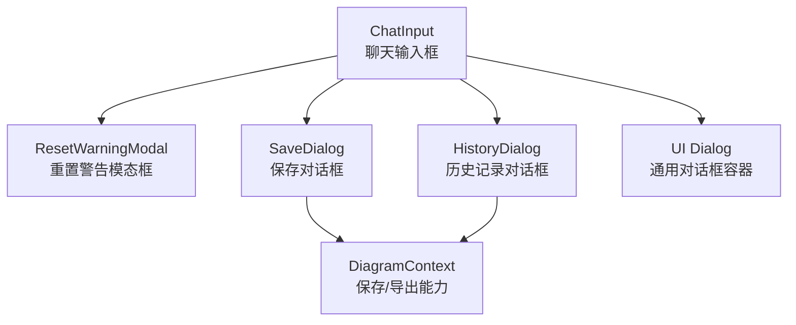
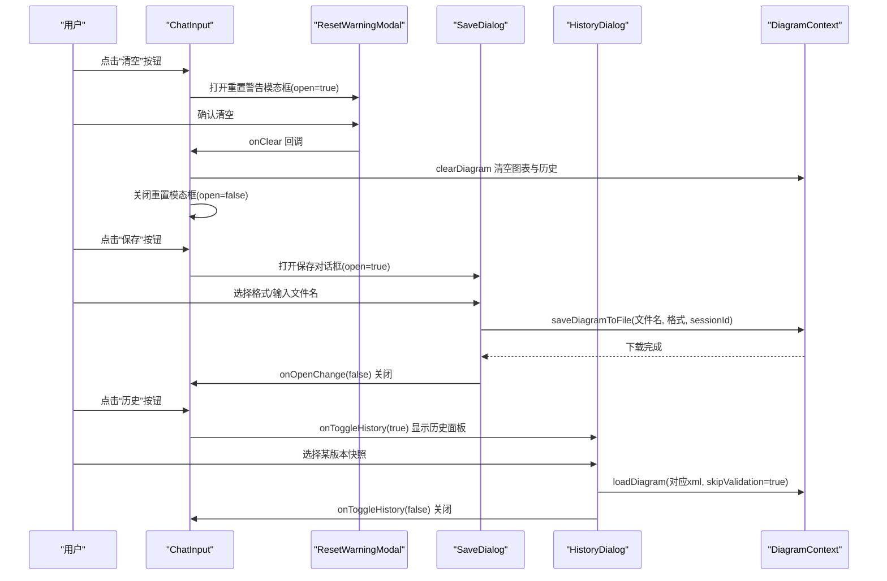
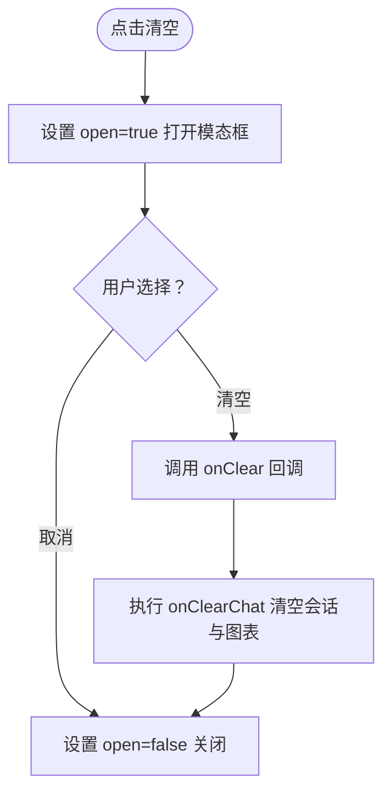
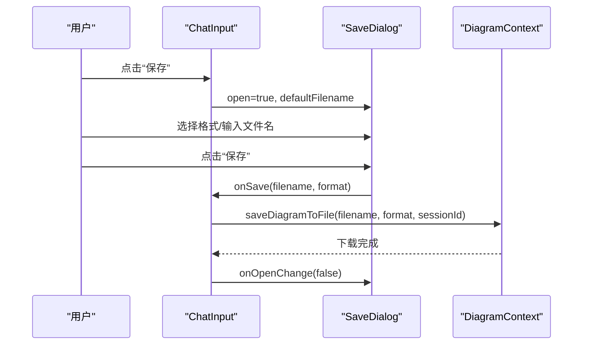
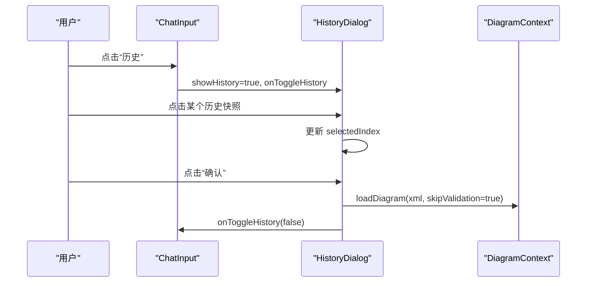
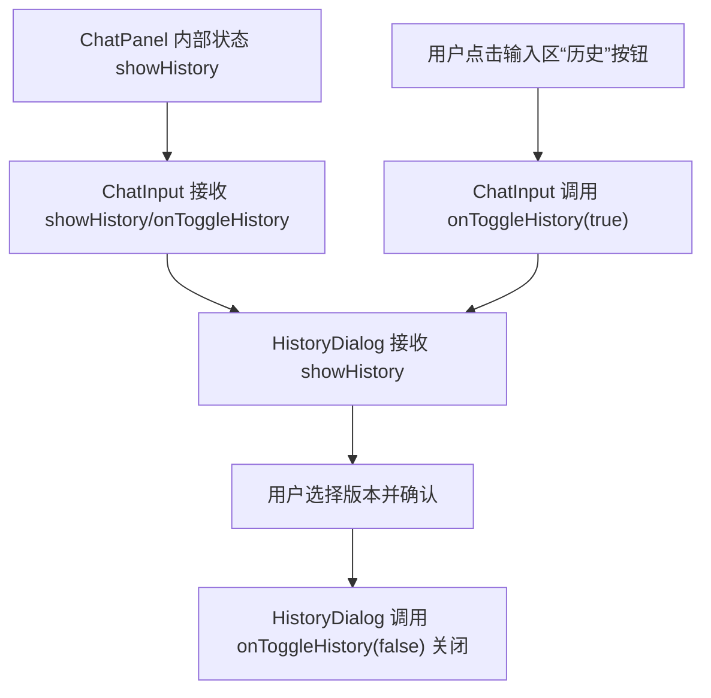
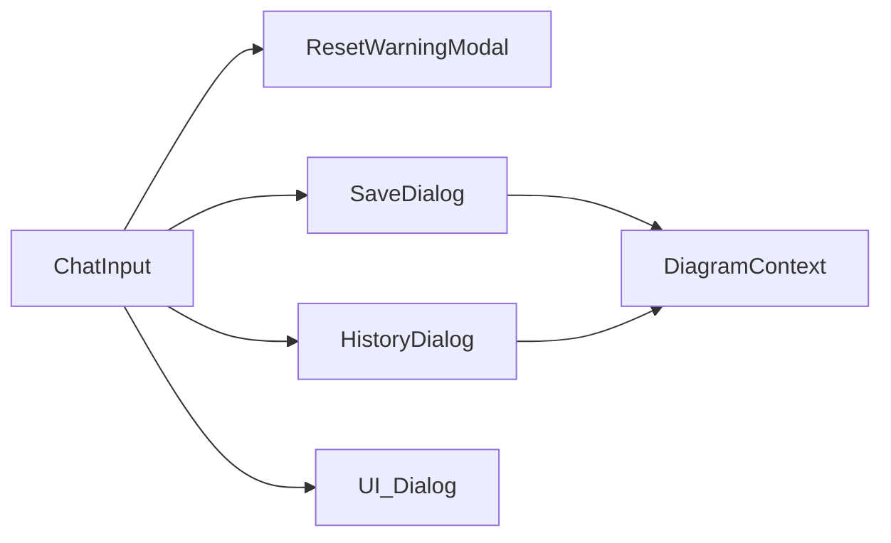

# 对话框集成

<cite>
**本文引用的文件**
- [components/chat-input.tsx](file://components/chat-input.tsx)
- [components/reset-warning-modal.tsx](file://components/reset-warning-modal.tsx)
- [components/save-dialog.tsx](file://components/save-dialog.tsx)
- [components/history-dialog.tsx](file://components/history-dialog.tsx)
- [contexts/diagram-context.tsx](file://contexts/diagram-context.tsx)
- [components/ui/dialog.tsx](file://components/ui/dialog.tsx)
</cite>

## 目录
1. [引言](#引言)
2. [项目结构](#项目结构)
3. [核心组件](#核心组件)
4. [架构总览](#架构总览)
5. [详细组件分析](#详细组件分析)
6. [依赖分析](#依赖分析)
7. [性能考虑](#性能考虑)
8. [故障排查指南](#故障排查指南)
9. [结论](#结论)
10. [附录](#附录)

## 引言
本文件系统性记录聊天输入框中集成的三类对话框：重置警告模态框、保存对话框与历史记录对话框。重点说明：
- 触发条件与交互流程
- showHistory 状态如何控制历史面板显示并与 HistoryDialog 组件协同
- ResetWarningModal 在用户清空聊天时的确认机制
- SaveDialog 如何捕获用户命名意图并持久化会话数据
- 组件间 props 传递与事件回调，展示对话框打开/关闭的生命周期管理
- 使用场景与防误操作设计考量
- 可访问性实现（焦点管理、键盘导航、ARIA 标签），确保符合 WCAG 标准

## 项目结构
围绕“聊天输入框”与“对话框”的关键文件组织如下：
- 聊天输入框组件负责承载三个对话框：重置警告模态框、保存对话框、历史记录对话框
- 历史记录对话框由独立组件实现，通过 showHistory/onToggleHistory 控制显示
- 保存对话框负责导出格式选择与文件名输入，并调用 DiagramContext 的保存能力
- 重置警告模态框用于确认清空当前会话与图表
- UI 对话框基础组件提供通用的对话框容器与无障碍标签

图示来源
- [components/chat-input.tsx](file://components/chat-input.tsx#L315-L431)
- [components/reset-warning-modal.tsx](file://components/reset-warning-modal.tsx#L1-L49)
- [components/save-dialog.tsx](file://components/save-dialog.tsx#L1-L129)
- [components/history-dialog.tsx](file://components/history-dialog.tsx#L1-L113)
- [contexts/diagram-context.tsx](file://contexts/diagram-context.tsx#L144-L219)
- [components/ui/dialog.tsx](file://components/ui/dialog.tsx#L1-L136)

章节来源
- [components/chat-input.tsx](file://components/chat-input.tsx#L130-L168)
- [components/ui/dialog.tsx](file://components/ui/dialog.tsx#L1-L136)

## 核心组件
- ChatInput：承载输入区与动作栏，内嵌三个对话框；通过 showHistory/onToggleHistory 控制历史面板；通过 open/onOpenChange 控制保存/重置等对话框；通过 sessionId 与 DiagramContext 协作进行持久化。
- ResetWarningModal：确认清空当前会话与图表，避免误操作。
- SaveDialog：选择导出格式与输入文件名，调用 DiagramContext.saveDiagramToFile 完成下载。
- HistoryDialog：展示历史快照预览，支持选择版本并恢复到对应版本。
- DiagramContext：提供 loadDiagram、saveDiagramToFile、handleExport 等能力，维护 diagramHistory 并在导出时写入历史。

章节来源
- [components/chat-input.tsx](file://components/chat-input.tsx#L130-L168)
- [components/reset-warning-modal.tsx](file://components/reset-warning-modal.tsx#L1-L49)
- [components/save-dialog.tsx](file://components/save-dialog.tsx#L1-L129)
- [components/history-dialog.tsx](file://components/history-dialog.tsx#L1-L113)
- [contexts/diagram-context.tsx](file://contexts/diagram-context.tsx#L144-L219)

## 架构总览
下图展示从 ChatInput 到各对话框再到 DiagramContext 的调用链路与状态流转。

图示来源
- [components/chat-input.tsx](file://components/chat-input.tsx#L315-L431)
- [components/reset-warning-modal.tsx](file://components/reset-warning-modal.tsx#L1-L49)
- [components/save-dialog.tsx](file://components/save-dialog.tsx#L1-L129)
- [components/history-dialog.tsx](file://components/history-dialog.tsx#L1-L113)
- [contexts/diagram-context.tsx](file://contexts/diagram-context.tsx#L144-L219)

## 详细组件分析

### 重置警告模态框 ResetWarningModal
- 触发条件
  - 用户点击输入区左侧“清空”按钮
  - ChatInput 内部状态 showClearDialog 由 false 切换为 true
- 交互流程
  - 打开：ChatInput 将 open 传给 ResetWarningModal
  - 用户点击“取消”：onOpenChange(false) 关闭
  - 用户点击“清空”：触发 onClear，ChatInput 内部执行 onClearChat 并关闭模态框
- 防误操作设计
  - 明确的二次确认文案与破坏性按钮样式
  - 模态框标题与描述明确说明不可逆性
- 可访问性
  - 使用通用对话框容器，具备标题、描述与关闭按钮的无障碍标签
  - 焦点管理：首次打开时应自动聚焦到确认按钮或首个可交互元素（建议在上层组件中补充）

图示来源
- [components/chat-input.tsx](file://components/chat-input.tsx#L315-L339)
- [components/reset-warning-modal.tsx](file://components/reset-warning-modal.tsx#L1-L49)

章节来源
- [components/chat-input.tsx](file://components/chat-input.tsx#L315-L339)
- [components/reset-warning-modal.tsx](file://components/reset-warning-modal.tsx#L1-L49)

### 保存对话框 SaveDialog
- 触发条件
  - 用户点击输入区右侧“保存”按钮
  - ChatInput 内部状态 showSaveDialog 由 false 切换为 true
- 交互流程
  - 打开：ChatInput 将 open 传给 SaveDialog，并传入默认文件名
  - 用户选择导出格式（drawio/png/svg）并输入文件名
  - 点击“保存”：SaveDialog 调用 onSave(filename, format)，ChatInput 将其映射为 DiagramContext.saveDiagramToFile
  - 保存完成后：onOpenChange(false) 关闭对话框
- 数据持久化
  - DiagramContext.saveDiagramToFile 根据格式生成内容并触发浏览器下载
  - 同时记录保存事件到后端（日志接口）
- 可访问性
  - 输入框 autoFocus，获得焦点并全选内容，便于快速输入
  - 支持回车键直接提交保存
  - 通用对话框容器提供标题、描述与关闭按钮的无障碍标签

图示来源
- [components/chat-input.tsx](file://components/chat-input.tsx#L422-L431)
- [components/save-dialog.tsx](file://components/save-dialog.tsx#L1-L129)
- [contexts/diagram-context.tsx](file://contexts/diagram-context.tsx#L144-L219)

章节来源
- [components/chat-input.tsx](file://components/chat-input.tsx#L422-L431)
- [components/save-dialog.tsx](file://components/save-dialog.tsx#L1-L129)
- [contexts/diagram-context.tsx](file://contexts/diagram-context.tsx#L144-L219)

### 历史记录对话框 HistoryDialog
- 触发条件
  - 用户点击输入区右侧“历史”按钮，ChatInput 调用 onToggleHistory(true) 打开
  - 或者在 ChatPanel 中通过内部状态 showHistory 控制显示
- 交互流程
  - 打开：ChatInput 将 showHistory 传给 HistoryDialog；HistoryDialog 内部维护 selectedIndex
  - 用户点击任一历史快照，更新 selectedIndex
  - 点击“确认”：HistoryDialog 调用 DiagramContext.loadDiagram(diagramHistory[selectedIndex].xml, skipValidation=true) 恢复
  - 关闭：HistoryDialog 调用 onToggleHistory(false)
- 展示与状态
  - 当 diagramHistory 为空时提示暂无历史
  - 有历史时以网格展示快照预览，选中项高亮
- 可访问性
  - 图片 alt 包含版本信息
  - 通用对话框容器提供标题、描述与关闭按钮的无障碍标签

图示来源
- [components/chat-input.tsx](file://components/chat-input.tsx#L400-L410)
- [components/history-dialog.tsx](file://components/history-dialog.tsx#L1-L113)
- [contexts/diagram-context.tsx](file://contexts/diagram-context.tsx#L76-L99)

章节来源
- [components/chat-input.tsx](file://components/chat-input.tsx#L400-L410)
- [components/history-dialog.tsx](file://components/history-dialog.tsx#L1-L113)
- [contexts/diagram-context.tsx](file://contexts/diagram-context.tsx#L76-L99)

### showHistory 状态与 HistoryDialog 协同
- ChatPanel 内部维护 showHistory 状态，用于控制历史面板是否显示
- ChatInput 接收 showHistory 与 onToggleHistory 两个 props，将外部状态与内部行为解耦
- 当用户点击输入区“历史”按钮时，ChatInput 调用 onToggleHistory(true) 打开面板
- HistoryDialog 作为受控组件，接收 showHistory 并在用户确认后调用 onToggleHistory(false) 关闭

图示来源
- [components/chat-panel.tsx](file://components/chat-panel.tsx#L90-L100)
- [components/chat-input.tsx](file://components/chat-input.tsx#L400-L410)
- [components/history-dialog.tsx](file://components/history-dialog.tsx#L1-L113)

章节来源
- [components/chat-panel.tsx](file://components/chat-panel.tsx#L90-L100)
- [components/chat-input.tsx](file://components/chat-input.tsx#L400-L410)
- [components/history-dialog.tsx](file://components/history-dialog.tsx#L1-L113)

## 依赖分析
- 组件耦合
  - ChatInput 是对话框的父容器，负责状态管理与生命周期控制
  - ResetWarningModal/SaveDialog/HistoryDialog 均为受控对话框，通过 open/onOpenChange 与父组件通信
  - SaveDialog/HistoryDialog 依赖 DiagramContext 提供的保存与加载能力
- 外部依赖
  - UI 对话框容器来自通用组件库，提供标题、描述、关闭按钮与无障碍标签
  - 浏览器下载能力由 DiagramContext.saveDiagramToFile 实现

图示来源
- [components/chat-input.tsx](file://components/chat-input.tsx#L315-L431)
- [components/reset-warning-modal.tsx](file://components/reset-warning-modal.tsx#L1-L49)
- [components/save-dialog.tsx](file://components/save-dialog.tsx#L1-L129)
- [components/history-dialog.tsx](file://components/history-dialog.tsx#L1-L113)
- [contexts/diagram-context.tsx](file://contexts/diagram-context.tsx#L144-L219)
- [components/ui/dialog.tsx](file://components/ui/dialog.tsx#L1-L136)

章节来源
- [components/chat-input.tsx](file://components/chat-input.tsx#L315-L431)
- [components/ui/dialog.tsx](file://components/ui/dialog.tsx#L1-L136)

## 性能考虑
- 对话框渲染成本低：均为轻量级弹窗，不涉及复杂计算
- 保存导出：根据格式不同，PNG/SVG 直接使用导出数据，drawio 需要解析 XML，注意避免重复解析
- 历史快照：仅存储 SVG 预览与 XML，数量增长时建议限制最大条目数
- 焦点管理：首次打开 SaveDialog 自动聚焦输入框并全选，减少用户操作步骤

## 故障排查指南
- 无法打开保存对话框
  - 检查 ChatInput 的禁用状态与按钮禁用逻辑
  - 确认 open/onOpenChange 传参正确
- 保存失败
  - 检查 DiagramContext.saveDiagramToFile 是否被调用
  - 确认浏览器允许下载与跨域策略
- 历史恢复无效
  - 确认 diagramHistory 是否存在且 selectedIndex 已设置
  - 检查 loadDiagram 的 skipValidation 参数是否按预期使用
- 重置后未清空
  - 确认 onClear 回调是否被触发，clearDiagram 是否被调用

章节来源
- [components/chat-input.tsx](file://components/chat-input.tsx#L315-L339)
- [components/save-dialog.tsx](file://components/save-dialog.tsx#L1-L129)
- [components/history-dialog.tsx](file://components/history-dialog.tsx#L1-L113)
- [contexts/diagram-context.tsx](file://contexts/diagram-context.tsx#L136-L143)

## 结论
该对话框体系通过 ChatInput 进行统一的状态与生命周期管理，ResetWarningModal、SaveDialog、HistoryDialog 分别承担确认清空、导出保存与历史恢复三大核心功能。配合 DiagramContext 的保存与加载能力，形成清晰的职责边界与可扩展的交互模式。同时，通用 UI 对话框容器提供了良好的可访问性基础，建议在关键场景补充焦点管理与键盘导航优化，进一步提升用户体验与合规性。

## 附录

### 可访问性实现要点（WCAG）
- 标题与描述
  - ResetWarningModal、SaveDialog、HistoryDialog 均使用标题与描述组件，确保屏幕阅读器可读
- 关闭按钮
  - 通用对话框容器包含隐藏文本“关闭”，便于键盘用户快速退出
- 焦点管理
  - SaveDialog 在打开时自动聚焦输入框并全选，减少二次操作
  - 建议在 ResetWarningModal/HistoryDialog 首次打开时将焦点置于确认按钮，提升键盘可达性
- 键盘导航
  - 支持回车键提交保存（SaveDialog）
  - 支持 Esc 关闭对话框（由通用容器提供）
- ARIA 标签
  - 通用容器提供语义化结构与数据槽属性，保证辅助技术正确识别

章节来源
- [components/ui/dialog.tsx](file://components/ui/dialog.tsx#L1-L136)
- [components/save-dialog.tsx](file://components/save-dialog.tsx#L1-L129)
- [components/reset-warning-modal.tsx](file://components/reset-warning-modal.tsx#L1-L49)
- [components/history-dialog.tsx](file://components/history-dialog.tsx#L1-L113)