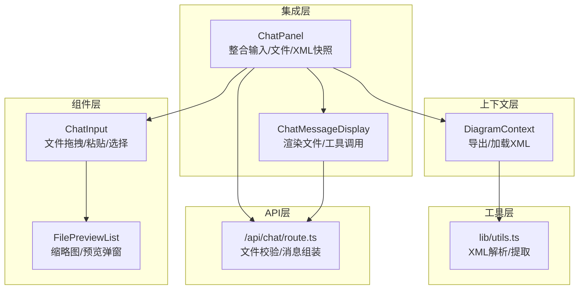
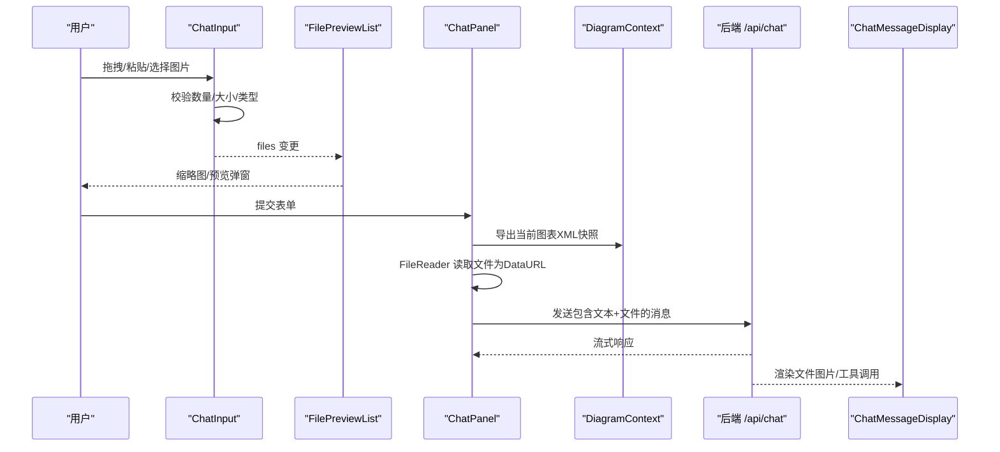
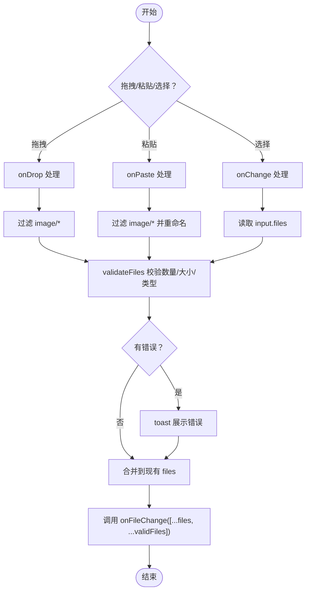
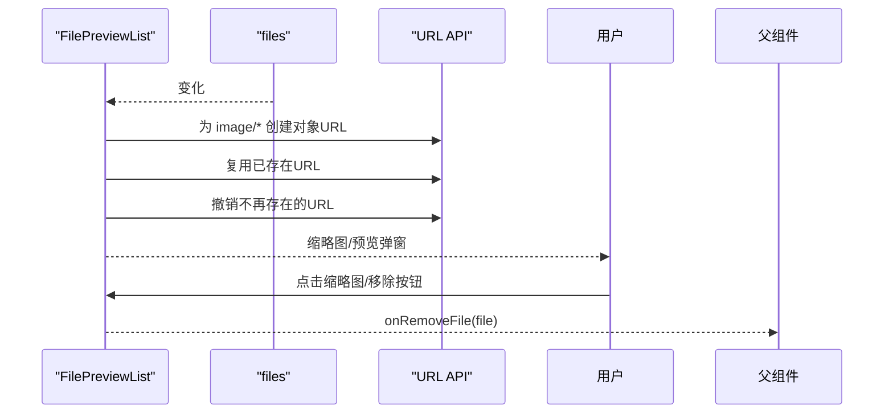
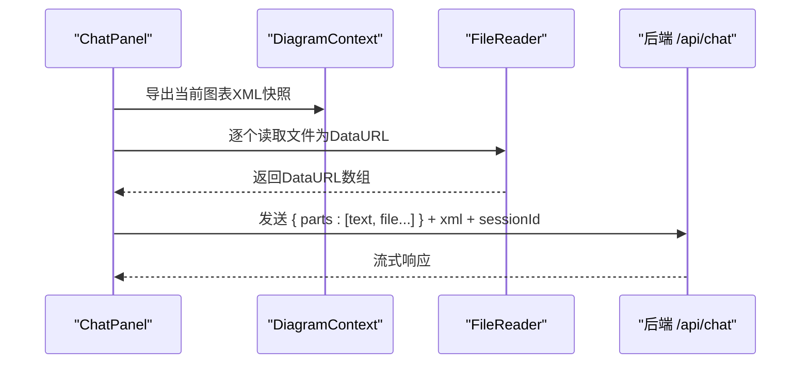
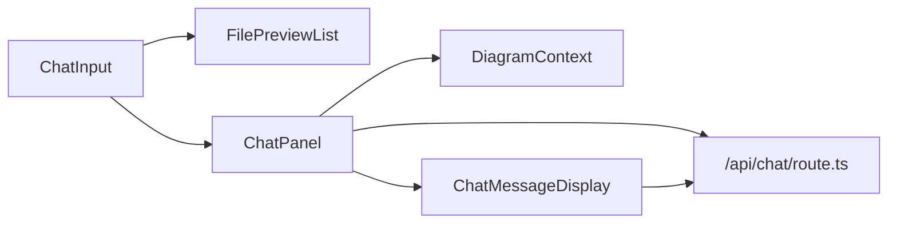

# 文件处理机制

<cite>
**本文引用的文件**
- [components/chat-input.tsx](file://components/chat-input.tsx)
- [components/file-preview-list.tsx](file://components/file-preview-list.tsx)
- [components/chat-panel.tsx](file://components/chat-panel.tsx)
- [components/chat-message-display.tsx](file://components/chat-message-display.tsx)
- [contexts/diagram-context.tsx](file://contexts/diagram-context.tsx)
- [lib/utils.ts](file://lib/utils.ts)
- [app/api/chat/route.ts](file://app/api/chat/route.ts)
</cite>

## 目录
1. [引言](#引言)
2. [项目结构](#项目结构)
3. [核心组件](#核心组件)
4. [架构总览](#架构总览)
5. [详细组件分析](#详细组件分析)
6. [依赖关系分析](#依赖关系分析)
7. [性能考量](#性能考量)
8. [故障排查指南](#故障排查指南)
9. [结论](#结论)

## 引言
本文件聚焦于聊天输入框中的文件处理机制，系统性解析以下能力：
- 文件拖拽上传：支持拖拽图片到输入区域进行上传
- 粘贴图像：从剪贴板粘贴图片自动转为文件并加入队列
- 文件列表管理：在聊天输入区上方展示缩略图列表，支持点击放大与移除
- 验证逻辑：对文件数量、大小、类型进行校验，拒绝不合规文件
- 数据流转：将文件转换为数据URL并通过聊天发送给后端
- 浏览器API使用：DataTransfer、FileReader、URL.createObjectURL/URL.revokeObjectURL
- 常见问题与优化：大文件失败、类型过滤、并发读取控制、内存释放

## 项目结构
围绕文件处理的关键文件组织如下：
- 组件层：ChatInput 负责输入与文件事件；FilePreviewList 负责缩略图展示与预览弹窗
- 上下文层：DiagramContext 提供导出与加载 XML 的能力，支撑“当前图表快照”用于文件发送
- 工具层：lib/utils.ts 提供 XML 解析与提取工具，供导出与保存时使用
- API 层：app/api/chat/route.ts 校验文件数量与大小，组装消息并流式返回响应
- 集成层：ChatPanel 将用户输入、文件列表、图表快照整合，统一提交到后端

图表来源
- [components/chat-input.tsx](file://components/chat-input.tsx#L1-L481)
- [components/file-preview-list.tsx](file://components/file-preview-list.tsx#L1-L134)
- [components/chat-panel.tsx](file://components/chat-panel.tsx#L1-L816)
- [components/chat-message-display.tsx](file://components/chat-message-display.tsx#L1-L747)
- [contexts/diagram-context.tsx](file://contexts/diagram-context.tsx#L1-L268)
- [lib/utils.ts](file://lib/utils.ts#L1-L711)
- [app/api/chat/route.ts](file://app/api/chat/route.ts#L1-L495)

章节来源
- [components/chat-input.tsx](file://components/chat-input.tsx#L1-L481)
- [components/file-preview-list.tsx](file://components/file-preview-list.tsx#L1-L134)
- [components/chat-panel.tsx](file://components/chat-panel.tsx#L1-L816)
- [components/chat-message-display.tsx](file://components/chat-message-display.tsx#L1-L747)
- [contexts/diagram-context.tsx](file://contexts/diagram-context.tsx#L1-L268)
- [lib/utils.ts](file://lib/utils.ts#L1-L711)
- [app/api/chat/route.ts](file://app/api/chat/route.ts#L1-L495)

## 核心组件
- ChatInput：负责拖拽、粘贴、文件选择、删除、拖拽高亮样式、文件验证与错误提示
- FilePreviewList：负责生成/复用/回收图片对象URL，展示缩略图，支持点击放大与关闭
- ChatPanel：负责收集用户输入、文件列表、当前图表XML快照，提交到后端并处理工具调用
- ChatMessageDisplay：负责渲染用户消息中的文件图片，以及工具调用结果
- DiagramContext：提供导出/加载XML的能力，支撑“当前图表快照”
- app/api/chat/route.ts：后端校验文件数量与大小，组装消息并流式输出

章节来源
- [components/chat-input.tsx](file://components/chat-input.tsx#L1-L481)
- [components/file-preview-list.tsx](file://components/file-preview-list.tsx#L1-L134)
- [components/chat-panel.tsx](file://components/chat-panel.tsx#L1-L816)
- [components/chat-message-display.tsx](file://components/chat-message-display.tsx#L1-L747)
- [contexts/diagram-context.tsx](file://contexts/diagram-context.tsx#L1-L268)
- [app/api/chat/route.ts](file://app/api/chat/route.ts#L1-L495)

## 架构总览
文件处理的端到端流程如下：

图表来源
- [components/chat-input.tsx](file://components/chat-input.tsx#L1-L481)
- [components/file-preview-list.tsx](file://components/file-preview-list.tsx#L1-L134)
- [components/chat-panel.tsx](file://components/chat-panel.tsx#L449-L506)
- [components/chat-message-display.tsx](file://components/chat-message-display.tsx#L603-L627)
- [contexts/diagram-context.tsx](file://contexts/diagram-context.tsx#L101-L134)
- [app/api/chat/route.ts](file://app/api/chat/route.ts#L187-L296)

## 详细组件分析

### ChatInput：文件拖拽、粘贴与验证
- 支持拖拽事件：onDragOver/onDragLeave/onDrop，拖拽时高亮边框
- 支持粘贴事件：onPaste 从 ClipboardItem 中筛选 image/*，生成新文件名并转为 File 对象
- 支持文件选择：accept="image/*" multiple，onChange 触发文件变更
- 支持移除：handleRemoveFile 通过 onFileChange 过滤掉被移除的文件
- 验证规则：
  - 最大文件数：MAX_FILES=5
  - 单文件最大大小：MAX_FILE_SIZE=2MB
  - 类型过滤：仅接受 image/*
  - 错误提示：统一通过 toast 展示，支持多条错误聚合
- 事件触发条件与数据格式：
  - onPaste：从 clipboardData.items 中筛选 image/*，生成 File 数组，调用 onFileChange([...files, ...validFiles])
  - handleFileChange：从 input.files 获取 File 列表，调用 onFileChange([...files, ...validFiles])
  - handleRemoveFile：调用 onFileChange(files.filter(f => f !== fileToRemove))

图表来源
- [components/chat-input.tsx](file://components/chat-input.tsx#L185-L272)
- [components/chat-input.tsx](file://components/chat-input.tsx#L57-L86)

章节来源
- [components/chat-input.tsx](file://components/chat-input.tsx#L1-L481)

### FilePreviewList：缩略图与预览弹窗
- 生成与复用对象URL：当 files 变化时，为每个 image/* 创建或复用 URL.createObjectURL，避免重复创建
- 内存释放：当文件不在列表中时，URL.revokeObjectURL 主动撤销；组件卸载时统一撤销所有已创建的 URL
- 交互：
  - 点击缩略图打开预览弹窗
  - 鼠标悬停显示“移除”按钮
  - 点击“移除”触发 onRemoveFile 回调
- 选中状态清理：当 selectedImage 对应的 URL 被撤销后，清空选中状态，防止空引用

图表来源
- [components/file-preview-list.tsx](file://components/file-preview-list.tsx#L1-L134)

章节来源
- [components/file-preview-list.tsx](file://components/file-preview-list.tsx#L1-L134)

### ChatPanel：文件与图表快照整合
- 收集文件：ChatInput 的 onFileChange 会更新本地 files 状态
- 图表快照：提交前通过 DiagramContext 导出当前 XML 快照，确保 AI 接收的是“提交时刻”的图表状态
- 文件读取：使用 FileReader 将每个 File 读取为 data URL，作为消息的一部分发送
- 发送消息：将 parts 合并为 { text, file }，并附带 xml 与 sessionId
- 工具调用：display_diagram/edit_diagram 会使用该 XML 快照进行渲染或编辑

图表来源
- [components/chat-panel.tsx](file://components/chat-panel.tsx#L449-L506)
- [contexts/diagram-context.tsx](file://contexts/diagram-context.tsx#L101-L134)

章节来源
- [components/chat-panel.tsx](file://components/chat-panel.tsx#L1-L816)
- [contexts/diagram-context.tsx](file://contexts/diagram-context.tsx#L1-L268)

### ChatMessageDisplay：渲染文件与工具调用
- 渲染用户消息中的文件：当 part.type === "file" 时，直接以 <Image> 渲染 data URL
- 工具调用：display_diagram/edit_diagram 的输入/输出会在消息区域以工具面板形式展示

章节来源
- [components/chat-message-display.tsx](file://components/chat-message-display.tsx#L603-L627)

### 后端校验与消息组装：app/api/chat/route.ts
- 文件校验：
  - 最大文件数：超过 MAX_FILES=5 直接拒绝
  - 单文件大小：对 data URL 计算解码后的字节数，超过 2MB 拒绝
- 消息组装：
  - 将最后一条消息的 text 与 file parts 合并为 content
  - 将当前 diagram XML 作为 system 消息注入，提升缓存命中率
- 流式输出：使用 AI SDK 流式返回，支持工具调用与缓存点设置

章节来源
- [app/api/chat/route.ts](file://app/api/chat/route.ts#L21-L59)
- [app/api/chat/route.ts](file://app/api/chat/route.ts#L187-L296)

## 依赖关系分析
- ChatInput 依赖：
  - 与 FilePreviewList 通过 files/onRemoveFile 交互
  - 与 ChatPanel 通过 onFileChange 回调联动
- FilePreviewList 依赖：
  - 使用 URL.createObjectURL/URL.revokeObjectURL 管理内存
  - 依赖 React 生命周期进行 URL 清理
- ChatPanel 依赖：
  - 依赖 DiagramContext 导出/加载 XML
  - 依赖 FileReader 将文件转为 data URL
- ChatMessageDisplay 依赖：
  - 直接渲染 data URL 为图片
- 后端依赖：
  - 严格校验文件数量与大小，保证传输与处理安全

图表来源
- [components/chat-input.tsx](file://components/chat-input.tsx#L1-L481)
- [components/file-preview-list.tsx](file://components/file-preview-list.tsx#L1-L134)
- [components/chat-panel.tsx](file://components/chat-panel.tsx#L1-L816)
- [components/chat-message-display.tsx](file://components/chat-message-display.tsx#L1-L747)
- [contexts/diagram-context.tsx](file://contexts/diagram-context.tsx#L1-L268)
- [app/api/chat/route.ts](file://app/api/chat/route.ts#L1-L495)

## 性能考量
- 并发读取控制
  - 当前实现逐个使用 FileReader 读取文件，串行执行，避免过多并发导致内存峰值过高
  - 若需提升吞吐，可考虑分批并发（例如每次最多 N 个），并在完成后统一清理
- 内存释放
  - FilePreviewList 在 files 更新时主动撤销不再使用的对象URL
  - 组件卸载时统一撤销所有已创建的对象URL，防止内存泄漏
  - 保存导出时使用 URL.revokeObjectURL 延迟撤销，确保下载完成
- I/O 与网络
  - 2MB 限制与 5 个文件上限减少大体积数据传输
  - 后端对 data URL 解码后的大小进行校验，避免超限
- 渲染优化
  - 缩略图尺寸固定，避免过大图片导致渲染卡顿
  - 预览弹窗按需打开，减少不必要的 DOM

章节来源
- [components/file-preview-list.tsx](file://components/file-preview-list.tsx#L1-L134)
- [contexts/diagram-context.tsx](file://contexts/diagram-context.tsx#L144-L213)
- [app/api/chat/route.ts](file://app/api/chat/route.ts#L21-L59)

## 故障排查指南
- 大文件上传失败
  - 现象：超过 2MB 的图片被拒绝
  - 原因：前端与后端均限制 2MB
  - 处理：压缩图片或拆分为多个小图
- 不支持的文件类型
  - 现象：非 image/* 的文件不会被加入列表
  - 原因：拖拽/粘贴/选择时仅过滤 image/*
  - 处理：仅使用图片格式
- 文件数量超限
  - 现象：超过 5 个文件会被拒绝
  - 原因：MAX_FILES=5
  - 处理：先移除部分文件再添加
- 粘贴无反应
  - 现象：粘贴图片未出现
  - 原因：剪贴板中没有 image/* 类型的数据
  - 处理：确认复制来源是否为图片
- 预览无法打开或空白
  - 现象：点击缩略图无反应或弹窗空白
  - 原因：URL 被撤销或文件已被移除
  - 处理：刷新页面或重新添加文件；确保未触发移除操作
- 下载失败或内存占用高
  - 现象：下载失败或浏览器内存飙升
  - 原因：未及时撤销对象URL
  - 处理：确保保存导出后及时撤销 URL；避免同时打开多个大图预览

章节来源
- [components/chat-input.tsx](file://components/chat-input.tsx#L57-L86)
- [components/file-preview-list.tsx](file://components/file-preview-list.tsx#L1-L134)
- [contexts/diagram-context.tsx](file://contexts/diagram-context.tsx#L144-L213)
- [app/api/chat/route.ts](file://app/api/chat/route.ts#L21-L59)

## 结论
本文件处理机制以 ChatInput 为核心入口，结合 FilePreviewList 实现直观的文件管理体验；通过 ChatPanel 将“当前图表 XML 快照”与文件数据一并发送至后端，确保 AI 能够基于准确的上下文进行推理与工具调用。前端与后端共同实施严格的文件数量与大小限制，并通过对象URL生命周期管理保障内存安全。对于性能优化，建议在满足用户体验的前提下适度控制并发读取与预览弹窗数量，避免内存峰值过高。