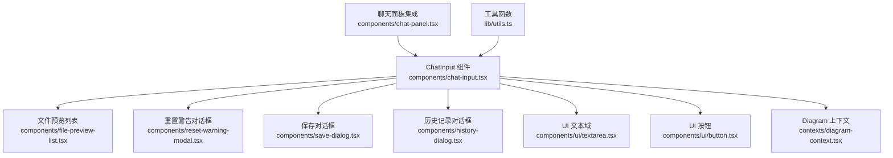
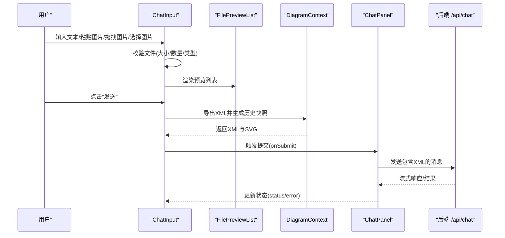
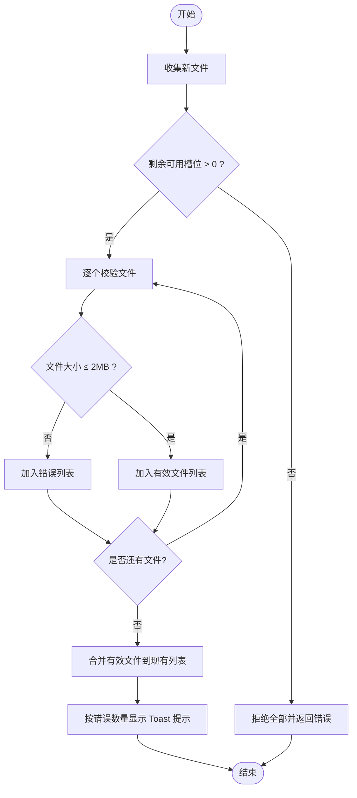
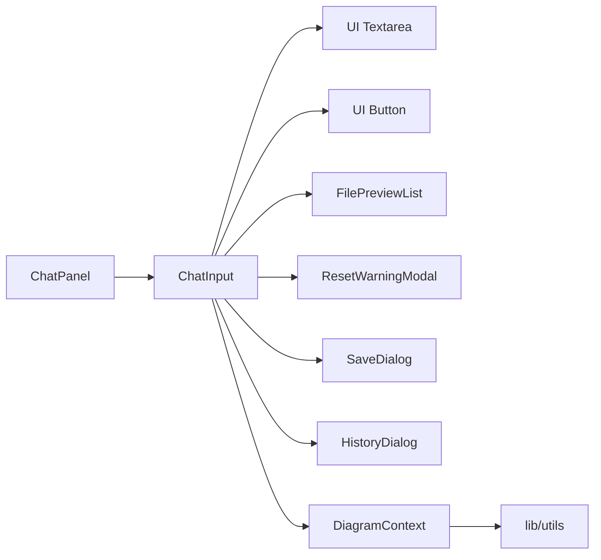

# 聊天输入框

<cite>
**本文引用的文件**
- [components/chat-input.tsx](file://components/chat-input.tsx)
- [components/file-preview-list.tsx](file://components/file-preview-list.tsx)
- [components/reset-warning-modal.tsx](file://components/reset-warning-modal.tsx)
- [components/save-dialog.tsx](file://components/save-dialog.tsx)
- [components/history-dialog.tsx](file://components/history-dialog.tsx)
- [contexts/diagram-context.tsx](file://contexts/diagram-context.tsx)
- [components/ui/textarea.tsx](file://components/ui/textarea.tsx)
- [components/ui/button.tsx](file://components/ui/button.tsx)
- [lib/utils.ts](file://lib/utils.ts)
- [components/chat-panel.tsx](file://components/chat-panel.tsx)
</cite>

## 目录
1. [简介](#简介)
2. [项目结构](#项目结构)
3. [核心组件](#核心组件)
4. [架构总览](#架构总览)
5. [详细组件分析](#详细组件分析)
6. [依赖关系分析](#依赖关系分析)
7. [性能考量](#性能考量)
8. [故障排查指南](#故障排查指南)
9. [结论](#结论)
10. [附录：使用示例与最佳实践](#附录用例与最佳实践)

## 简介
本文件为 ChatInput 组件的详细 UI 文档，聚焦于用户输入界面的视觉外观、行为与交互模式，涵盖：
- 文本输入、文件上传与拖拽支持
- 文件验证（大小、数量、类型限制）
- 图像粘贴与拖拽上传
- 文件预览列表与管理
- 提交表单时的处理逻辑（包含 XML 快照保存与消息发送）
- 内嵌对话框（重置警告、保存、历史记录）的触发机制与交互流程
- 使用示例与代码片段路径
- 响应式设计与可访问性建议（含表单控件标签与错误提示）
- 组件状态、动画与过渡效果（加载状态、拖拽高亮）

## 项目结构
ChatInput 位于 components 目录中，围绕其周边存在以下关键文件：
- 文件预览列表：用于展示与管理已选文件
- 对话框组件：重置确认、保存导出、历史记录
- 上下文：DiagramContext 提供 Diagram 编辑器能力（导出、保存、历史）
- UI 基础组件：Textarea、Button 的样式与变体
- 工具函数：通用样式合并与 XML 处理
- 集成入口：ChatPanel 将 ChatInput 与聊天状态、会话管理集成

图表来源
- [components/chat-input.tsx](file://components/chat-input.tsx#L1-L481)
- [components/file-preview-list.tsx](file://components/file-preview-list.tsx#L1-L134)
- [components/reset-warning-modal.tsx](file://components/reset-warning-modal.tsx#L1-L49)
- [components/save-dialog.tsx](file://components/save-dialog.tsx#L1-L129)
- [components/history-dialog.tsx](file://components/history-dialog.tsx#L1-L113)
- [contexts/diagram-context.tsx](file://contexts/diagram-context.tsx#L1-L268)
- [components/ui/textarea.tsx](file://components/ui/textarea.tsx#L1-L19)
- [components/ui/button.tsx](file://components/ui/button.tsx#L1-L60)
- [lib/utils.ts](file://lib/utils.ts#L1-L711)
- [components/chat-panel.tsx](file://components/chat-panel.tsx#L47-L806)

章节来源
- [components/chat-input.tsx](file://components/chat-input.tsx#L1-L481)
- [components/chat-panel.tsx](file://components/chat-panel.tsx#L47-L806)

## 核心组件
- ChatInput：用户输入与操作入口，负责文本输入、文件上传/粘贴/拖拽、提交表单、触发保存与历史查看等。
- FilePreviewList：渲染文件预览缩略图、支持点击放大、移除文件。
- ResetWarningModal：确认清空当前会话与画布。
- SaveDialog：选择导出格式与文件名，触发 DiagramContext.saveDiagramToFile。
- HistoryDialog：浏览历史版本并恢复到指定版本。
- DiagramContext：提供导出、保存、历史记录、加载 XML 到编辑器等能力。
- UI 组件：Textarea、Button 提供基础样式与交互。

章节来源
- [components/chat-input.tsx](file://components/chat-input.tsx#L114-L168)
- [components/file-preview-list.tsx](file://components/file-preview-list.tsx#L1-L134)
- [components/reset-warning-modal.tsx](file://components/reset-warning-modal.tsx#L1-L49)
- [components/save-dialog.tsx](file://components/save-dialog.tsx#L1-L129)
- [components/history-dialog.tsx](file://components/history-dialog.tsx#L1-L113)
- [contexts/diagram-context.tsx](file://contexts/diagram-context.tsx#L1-L268)
- [components/ui/textarea.tsx](file://components/ui/textarea.tsx#L1-L19)
- [components/ui/button.tsx](file://components/ui/button.tsx#L1-L60)

## 架构总览
ChatInput 通过 props 接收外部状态与回调，内部维护拖拽高亮、对话框开关、禁用态等状态；文件变更通过 onFileChange 回调由父组件（ChatPanel）统一管理；提交时通过 DiagramContext 导出 XML 并保存快照，随后将包含 XML 的请求体发送至后端。

图表来源
- [components/chat-input.tsx](file://components/chat-input.tsx#L145-L168)
- [contexts/diagram-context.tsx](file://contexts/diagram-context.tsx#L57-L134)
- [components/chat-panel.tsx](file://components/chat-panel.tsx#L129-L170)
- [app/api/chat/route.ts](file://app/api/chat/route.ts#L141-L178)

## 详细组件分析

### ChatInput 组件
- 视觉外观与布局
  - 输入区采用圆角边框、焦点环高亮、占位符提示；底部操作栏包含清空、历史、主题切换、保存、上传、发送按钮。
  - 拖拽进入时添加主色描边与圆角，形成高亮反馈。
- 行为与交互
  - 文本输入：自动调整高度，最大高度限制；支持 Ctrl/Cmd + Enter 快捷键提交。
  - 文件上传：支持粘贴图片（剪贴板图像）、点击选择文件、拖拽上传；仅接受 image/* 类型。
  - 文件验证：限制最多 5 张，单张不超过 2MB；超出或重复报错通过 Toast 提示。
  - 文件预览：FilePreviewList 展示缩略图，支持点击放大与移除。
  - 提交：在非禁用状态下启用；禁用态显示加载图标。
  - 历史与保存：通过 HistoryDialog 与 SaveDialog 打开对应功能。
  - 主题切换：弹窗提示切换主题将清空未保存更改，确认后清空并切换。
- 状态与禁用
  - 当 status 为 streaming 或 submitted 且无 error 时禁用输入与交互，允许在 error 时重试。
- 可访问性
  - 文本域设置 aria-label；发送按钮根据状态动态 aria-label；按钮组提供 tooltip 提示。
- 动画与过渡
  - 拖拽高亮：表单容器添加主色描边与圆角。
  - 提交按钮：禁用时显示旋转加载图标。
  - 焦点态：Textarea 与按钮具备统一的 ring 效果。

章节来源
- [components/chat-input.tsx](file://components/chat-input.tsx#L130-L481)
- [components/ui/textarea.tsx](file://components/ui/textarea.tsx#L1-L19)
- [components/ui/button.tsx](file://components/ui/button.tsx#L1-L60)

#### 文件验证与上传流程

图表来源
- [components/chat-input.tsx](file://components/chat-input.tsx#L57-L112)

#### 提交表单与 XML 快照保存
- 在提交前，ChatInput 通过 DiagramContext 导出 XML 并生成历史快照；随后 ChatPanel 将包含 XML 的请求体发送至后端。
- 后端接口接收 messages 与 sessionId，并进行访问码校验与日志记录。

章节来源
- [components/chat-input.tsx](file://components/chat-input.tsx#L145-L168)
- [contexts/diagram-context.tsx](file://contexts/diagram-context.tsx#L57-L134)
- [components/chat-panel.tsx](file://components/chat-panel.tsx#L129-L170)
- [app/api/chat/route.ts](file://app/api/chat/route.ts#L141-L178)

### 文件预览列表（FilePreviewList）
- 功能要点
  - 为每个图片文件创建对象 URL 并缓存，避免重复创建；卸载时统一回收。
  - 支持点击缩略图放大预览，关闭后清理选中状态。
  - 提供移除按钮，支持键盘与鼠标交互。
- 性能与内存
  - 使用 useRef 存储已创建的 URL 映射，复用旧 URL；及时撤销不再使用的对象 URL。
- 可访问性
  - 移除按钮提供 aria-label；预览模态支持键盘关闭。

章节来源
- [components/file-preview-list.tsx](file://components/file-preview-list.tsx#L1-L134)

### 重置警告对话框（ResetWarningModal）
- 触发：点击清空按钮打开对话框。
- 交互：取消保持现状；确认后调用 onClear 回调，清空聊天与画布并重置会话。
- 状态：受父组件控制 open/onOpenChange。

章节来源
- [components/reset-warning-modal.tsx](file://components/reset-warning-modal.tsx#L1-L49)
- [components/chat-input.tsx](file://components/chat-input.tsx#L330-L359)

### 保存对话框（SaveDialog）
- 功能要点
  - 选择导出格式（drawio、png、svg），默认文件名基于日期。
  - 支持回车快捷键确认保存。
  - 调用 DiagramContext.saveDiagramToFile 完成下载。
- 可访问性
  - 标签与输入框关联；输入框获得焦点并全选便于快速修改。

章节来源
- [components/save-dialog.tsx](file://components/save-dialog.tsx#L1-L129)
- [contexts/diagram-context.tsx](file://contexts/diagram-context.tsx#L144-L219)
- [components/chat-input.tsx](file://components/chat-input.tsx#L421-L432)

### 历史记录对话框（HistoryDialog）
- 功能要点
  - 展示历史版本缩略图网格；点击选择版本，确认后通过 DiagramContext.loadDiagram 加载对应 XML。
  - 无历史时提示“发送消息以创建历史”。
- 交互流程
  - 打开/关闭由 onToggleHistory 控制；选择索引后执行恢复。

章节来源
- [components/history-dialog.tsx](file://components/history-dialog.tsx#L1-L113)
- [contexts/diagram-context.tsx](file://contexts/diagram-context.tsx#L76-L100)

### DiagramContext（上下文）
- 关键职责
  - 导出 XML 与 SVG，生成历史快照；加载 XML 到编辑器（含结构校验）。
  - 保存到文件：根据格式生成内容并触发下载；记录保存事件到后端。
- 与 ChatInput 的协作
  - ChatInput 在提交前调用导出并保存快照；保存对话框触发保存流程。

章节来源
- [contexts/diagram-context.tsx](file://contexts/diagram-context.tsx#L57-L219)

## 依赖关系分析
- 组件耦合
  - ChatInput 依赖 UI 组件（Textarea、Button）、对话框组件（ResetWarningModal、SaveDialog、HistoryDialog）、FilePreviewList、DiagramContext。
  - ChatPanel 作为父容器，向 ChatInput 注入 input、status、onSubmit、onFileChange 等 props。
- 外部依赖
  - lucide-react 图标库、sonner 错误提示、class-variance-authority 样式变体、pako 压缩解压。
- 潜在循环依赖
  - 未发现直接循环依赖；各模块职责清晰。

图表来源
- [components/chat-panel.tsx](file://components/chat-panel.tsx#L771-L806)
- [components/chat-input.tsx](file://components/chat-input.tsx#L1-L481)
- [contexts/diagram-context.tsx](file://contexts/diagram-context.tsx#L1-L268)
- [lib/utils.ts](file://lib/utils.ts#L1-L711)

章节来源
- [components/chat-panel.tsx](file://components/chat-panel.tsx#L771-L806)
- [components/chat-input.tsx](file://components/chat-input.tsx#L1-L481)
- [contexts/diagram-context.tsx](file://contexts/diagram-context.tsx#L1-L268)

## 性能考量
- 文件预览
  - 使用对象 URL 缓存与统一回收，避免频繁创建/销毁导致的内存抖动。
- 自适应高度
  - 仅在输入变化时调整高度，限制最大高度，减少重排。
- 提交前导出
  - 通过 DiagramContext 导出 XML 并保存快照，避免重复计算；导出回调中再处理历史与下载。
- 错误提示
  - 使用一次性 Toast 显示批量错误，避免多次渲染。

[本节为通用指导，不直接分析具体文件]

## 故障排查指南
- 无法粘贴图片
  - 检查浏览器剪贴板权限与图片类型；确保未处于禁用态。
- 文件被拒绝
  - 超过数量上限（最多 5 张）或单张超过 2MB；查看 Toast 错误提示。
- 提交按钮不可用
  - 当 status 为 streaming/submitted 且无 error 时会被禁用；等待状态变化或检查 error。
- 历史记录为空
  - 需要先发送消息以生成历史；确认 DiagramContext 中 diagramHistory 是否有数据。
- 保存失败
  - 确认 DiagramContext.saveDiagramToFile 已正确初始化；检查网络与后端日志。

章节来源
- [components/chat-input.tsx](file://components/chat-input.tsx#L153-L168)
- [components/file-preview-list.tsx](file://components/file-preview-list.tsx#L1-L134)
- [components/history-dialog.tsx](file://components/history-dialog.tsx#L53-L85)
- [contexts/diagram-context.tsx](file://contexts/diagram-context.tsx#L144-L219)

## 结论
ChatInput 以简洁直观的方式整合了文本输入、文件上传（粘贴/拖拽/选择）、文件预览与管理、提交与保存、历史查看等功能；通过 DiagramContext 实现 XML 快照与导出，保障了与绘图编辑器的无缝衔接。组件在交互反馈（拖拽高亮、加载状态、Toast 错误提示）与可访问性方面均有良好设计，适合在多场景下复用与扩展。

[本节为总结性内容，不直接分析具体文件]

## 附录：使用示例与最佳实践

### Props 说明
- input: string
  - 文本域当前值
- status: "submitted" | "streaming" | "ready" | "error"
  - 控制禁用态与按钮状态
- onSubmit: (e: FormEvent) => void
  - 表单提交回调（由父组件封装消息发送）
- onChange: (e: ChangeEvent) => void
  - 文本域变更回调（用于更新 input）
- onClearChat: () => void
  - 清空聊天与画布并重置会话
- files?: File[]
  - 已选文件列表
- onFileChange?: (files: File[]) => void
  - 文件变更回调（增删改）
- showHistory?: boolean
  - 历史对话框开关
- onToggleHistory?: (show: boolean) => void
  - 历史对话框开关回调
- sessionId?: string
  - 会话标识，用于保存日志与后端追踪
- error?: Error | null
  - 错误状态，允许在错误时重试
- drawioUi?: "min" | "sketch"
  - 主题模式
- onToggleDrawioUi?: () => void
  - 切换主题回调

章节来源
- [components/chat-input.tsx](file://components/chat-input.tsx#L114-L144)

### 使用示例（代码片段路径）
- 在 ChatPanel 中注入 ChatInput 所需 props
  - 示例路径：[components/chat-panel.tsx](file://components/chat-panel.tsx#L771-L806)
- 提交时携带 XML 快照
  - 示例路径：[components/chat-panel.tsx](file://components/chat-panel.tsx#L564-L585)
- 保存导出
  - 示例路径：[components/chat-input.tsx](file://components/chat-input.tsx#L421-L432)，[components/save-dialog.tsx](file://components/save-dialog.tsx#L40-L67)，[contexts/diagram-context.tsx](file://contexts/diagram-context.tsx#L144-L219)

### 响应式设计指南
- 移动端优先：文本域最小高度与最大高度限制，保证在小屏上可滚动阅读。
- 拖拽区域：表单容器作为拖拽目标，确保拖拽高亮覆盖整个输入区域。
- 对话框：保存与历史对话框在移动端采用紧凑布局，按钮与输入框自适应宽度。

[本节为通用指导，不直接分析具体文件]

### 可访问性合规建议
- 文本域
  - 已设置 aria-label；建议在页面级提供明确的“聊天输入”标题或描述。
- 按钮
  - 所有图标按钮均提供 tooltip；建议在需要时补充 aria-describedby。
- 错误提示
  - 使用 Toast 组件并在错误出现时自动聚焦；必要时提供键盘关闭方式。
- 键盘快捷键
  - Ctrl/Cmd + Enter 提交；支持 Tab 导航与回车确认。

章节来源
- [components/chat-input.tsx](file://components/chat-input.tsx#L301-L313)
- [components/ui/button.tsx](file://components/ui/button.tsx#L1-L60)