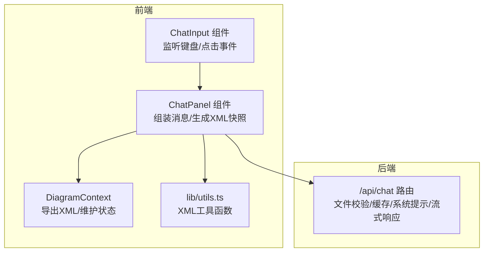
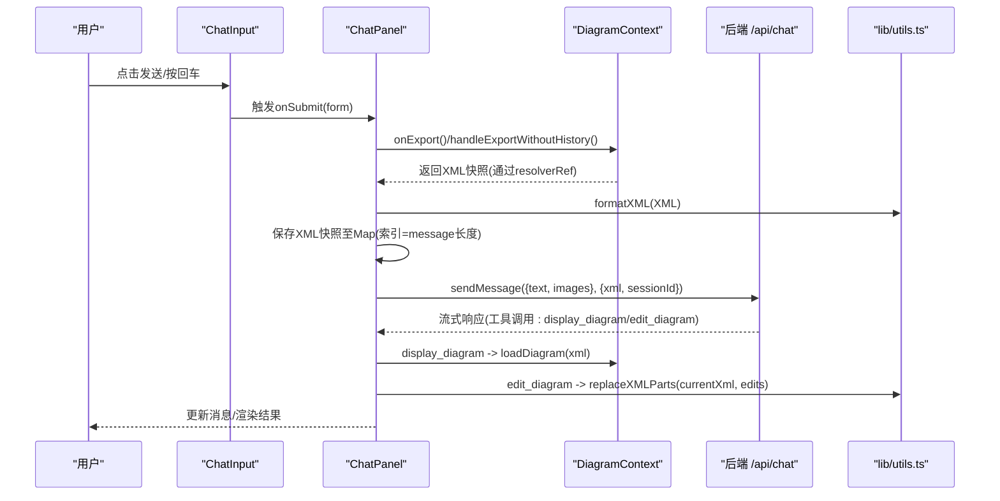
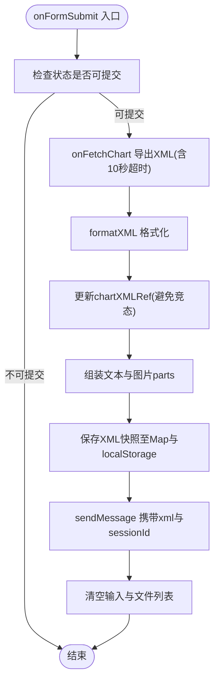
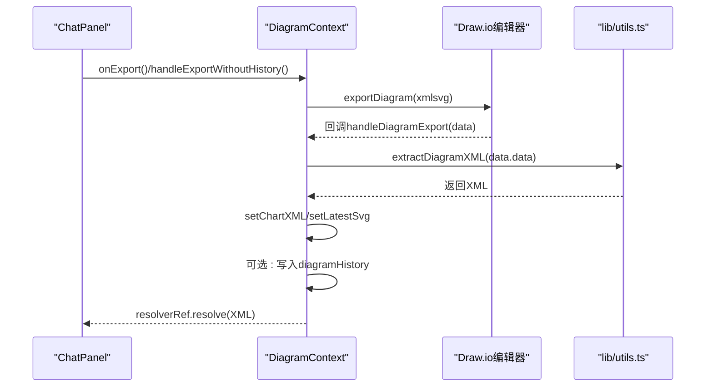
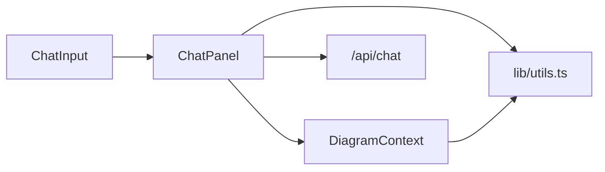

# 表单提交逻辑

<cite>
**本文引用的文件**
- [components/chat-input.tsx](file://components/chat-input.tsx)
- [components/chat-panel.tsx](file://components/chat-panel.tsx)
- [contexts/diagram-context.tsx](file://contexts/diagram-context.tsx)
- [lib/utils.ts](file://lib/utils.ts)
- [app/api/chat/route.ts](file://app/api/chat/route.ts)
- [app/page.tsx](file://app/page.tsx)
</cite>

## 目录
1. [简介](#简介)
2. [项目结构](#项目结构)
3. [核心组件](#核心组件)
4. [架构总览](#架构总览)
5. [详细组件分析](#详细组件分析)
6. [依赖关系分析](#依赖关系分析)
7. [性能考量](#性能考量)
8. [故障排查指南](#故障排查指南)
9. [结论](#结论)

## 简介
本节聚焦“聊天输入框”的表单提交机制，系统性阐述从用户点击发送或按回车键，到组件调用onSubmit回调、生成当前图表XML快照、清理输入状态、隐藏历史面板、调用后端API并进入AI对话流程的全过程。文档还解释了组件与DiagramContext的状态同步机制，防止重复提交与网络异常处理策略，并提供调试与日志追踪建议。

## 项目结构
- 前端交互层：ChatInput负责输入、快捷键、文件上传、禁用态控制；ChatPanel负责组装消息、生成XML快照、调用后端API。
- 上下文层：DiagramContext负责与Draw.io编辑器交互，导出XML并维护chartXML、latestSvg、diagramHistory等状态。
- 工具层：lib/utils.ts提供XML格式化、合法性校验、节点替换、XML提取等工具函数。
- 后端API：app/api/chat/route.ts接收请求，进行文件校验、缓存命中、系统提示拼接、工具调用定义与流式响应。

**图示来源**
- [components/chat-input.tsx](file://components/chat-input.tsx#L170-L183)
- [components/chat-panel.tsx](file://components/chat-panel.tsx#L449-L506)
- [contexts/diagram-context.tsx](file://contexts/diagram-context.tsx#L57-L74)
- [lib/utils.ts](file://lib/utils.ts#L645-L710)
- [app/api/chat/route.ts](file://app/api/chat/route.ts#L145-L214)

**章节来源**
- [components/chat-input.tsx](file://components/chat-input.tsx#L170-L183)
- [components/chat-panel.tsx](file://components/chat-panel.tsx#L449-L506)
- [contexts/diagram-context.tsx](file://contexts/diagram-context.tsx#L57-L74)
- [lib/utils.ts](file://lib/utils.ts#L645-L710)
- [app/api/chat/route.ts](file://app/api/chat/route.ts#L145-L214)

## 核心组件
- ChatInput：负责输入框高度自适应、回车快捷键触发、拖拽/粘贴/选择图片上传、禁用态控制（基于status）、提交按钮渲染。
- ChatPanel：负责onSubmit流程（生成XML快照、拼装文本与图片、调用sendMessage并附带xml与sessionId），并在工具调用时与DiagramContext交互。
- DiagramContext：封装Draw.io导出、加载、保存、历史记录管理，提供chartXML与latestSvg供上层使用。
- lib/utils：提供extractDiagramXML、formatXML、validateMxCellStructure、replaceXMLParts等工具，支撑XML快照生成与编辑。
- /api/chat：后端路由，负责访问码校验、文件大小与数量校验、缓存命中、系统提示注入、工具定义与流式输出。

**章节来源**
- [components/chat-input.tsx](file://components/chat-input.tsx#L130-L183)
- [components/chat-panel.tsx](file://components/chat-panel.tsx#L449-L506)
- [contexts/diagram-context.tsx](file://contexts/diagram-context.tsx#L57-L74)
- [lib/utils.ts](file://lib/utils.ts#L645-L710)
- [app/api/chat/route.ts](file://app/api/chat/route.ts#L145-L214)

## 架构总览
下图展示了从用户输入到后端AI对话的关键调用链路与数据流。

**图示来源**
- [components/chat-input.tsx](file://components/chat-input.tsx#L280-L290)
- [components/chat-panel.tsx](file://components/chat-panel.tsx#L449-L506)
- [contexts/diagram-context.tsx](file://contexts/diagram-context.tsx#L57-L74)
- [lib/utils.ts](file://lib/utils.ts#L645-L710)
- [app/api/chat/route.ts](file://app/api/chat/route.ts#L393-L474)

## 详细组件分析

### ChatInput：键盘与提交入口
- 回车快捷键：当用户按住 Ctrl/Cmd + Enter时，阻止默认行为并通过closest("form").requestSubmit()触发表单提交。
- 提交禁用态：根据status计算isDisabled，避免重复提交；error存在时允许重试。
- 输入自适应：Textarea高度随内容变化，最大高度限制为200px。
- 文件上传：支持拖拽、粘贴、选择图片，带大小与数量限制，验证失败会弹出toast提示。
- 提交按钮：disabled条件包括isDisabled或无输入；loading态显示旋转图标。

关键路径参考：
- 快捷键触发：[components/chat-input.tsx](file://components/chat-input.tsx#L175-L183)
- 禁用态与按钮状态：[components/chat-input.tsx](file://components/chat-input.tsx#L153-L156)
- 表单提交绑定：[components/chat-input.tsx](file://components/chat-input.tsx#L280-L290)

**章节来源**
- [components/chat-input.tsx](file://components/chat-input.tsx#L153-L183)
- [components/chat-input.tsx](file://components/chat-input.tsx#L280-L290)

### ChatPanel：提交流程与XML快照
- onFormSubmit流程：
  - 防重复提交：检查status是否为streaming/submitted且无error。
  - 获取XML：通过onFetchChart()触发DiagramContext导出，Promise.race设置10秒超时。
  - XML格式化：调用formatXML保证一致性。
  - 更新chartXMLRef：直接更新ref，避免React异步状态导致的竞态。
  - 组装消息：将input文本与文件转为dataURL追加到parts。
  - 保存快照：以当前消息索引为key，保存XML快照至Map，并持久化到localStorage。
  - 发送消息：调用sendMessage，附带xml与sessionId，同时携带访问码头。
  - 清理状态：清空输入框与文件列表。
- 编辑/重生成：通过xmlSnapshotsRef恢复指定消息对应的XML快照，必要时调用onDisplayChart恢复画布。

关键路径参考：
- 提交入口与防重复：[components/chat-panel.tsx](file://components/chat-panel.tsx#L449-L506)
- 导出XML与超时：[components/chat-panel.tsx](file://components/chat-panel.tsx#L65-L89)
- 保存快照与持久化：[components/chat-panel.tsx](file://components/chat-panel.tsx#L480-L484)
- 发送消息与清理：[components/chat-panel.tsx](file://components/chat-panel.tsx#L487-L506)

**图示来源**
- [components/chat-panel.tsx](file://components/chat-panel.tsx#L449-L506)
- [components/chat-panel.tsx](file://components/chat-panel.tsx#L65-L89)

**章节来源**
- [components/chat-panel.tsx](file://components/chat-panel.tsx#L449-L506)
- [components/chat-panel.tsx](file://components/chat-panel.tsx#L65-L89)

### DiagramContext：XML导出与状态同步
- 导出接口：
  - handleExport：触发Draw.io导出xmlsvg，回调handleDiagramExport提取XML并更新chartXML与latestSvg，同时写入history。
  - handleExportWithoutHistory：导出但不写入历史，用于edit_diagram场景。
  - resolverRef：作为导出回调的resolver，onFetchChart通过它拿到XML字符串。
- 加载与校验：loadDiagram在加载前对XML进行validateMxCellStructure校验，返回错误信息。
- 保存文件：saveDiagramToFile支持drawio/png/svg导出，内部同样依赖handleDiagramExport提取XML。

关键路径参考：
- 导出与解析：[contexts/diagram-context.tsx](file://contexts/diagram-context.tsx#L57-L74)
- 解析XML与历史记录：[contexts/diagram-context.tsx](file://contexts/diagram-context.tsx#L101-L134)
- 加载与校验：[contexts/diagram-context.tsx](file://contexts/diagram-context.tsx#L76-L99)

**图示来源**
- [contexts/diagram-context.tsx](file://contexts/diagram-context.tsx#L57-L74)
- [contexts/diagram-context.tsx](file://contexts/diagram-context.tsx#L101-L134)
- [lib/utils.ts](file://lib/utils.ts#L645-L710)

**章节来源**
- [contexts/diagram-context.tsx](file://contexts/diagram-context.tsx#L57-L74)
- [contexts/diagram-context.tsx](file://contexts/diagram-context.tsx#L101-L134)
- [lib/utils.ts](file://lib/utils.ts#L645-L710)

### 工具函数：XML快照与合法性
- extractDiagramXML：从xmlsvg字符串中解码并提取XML，用于将Draw.io导出的SVG包装数据还原为原始XML。
- formatXML：规范化XML缩进与换行，提升一致性。
- validateMxCellStructure：对mxCell结构进行多维度校验（嵌套、重复ID、孤儿节点、无效父引用、边连接等），返回错误信息。
- replaceXMLParts：在当前XML中执行精确搜索/替换，支持多种匹配策略（完全匹配、去空白匹配、子串匹配、属性顺序无关、按id/value匹配、归一化空白匹配）。

关键路径参考：
- XML提取：[lib/utils.ts](file://lib/utils.ts#L645-L710)
- 结构校验：[lib/utils.ts](file://lib/utils.ts#L508-L643)
- 节点替换：[lib/utils.ts](file://lib/utils.ts#L240-L506)

**章节来源**
- [lib/utils.ts](file://lib/utils.ts#L645-L710)
- [lib/utils.ts](file://lib/utils.ts#L508-L643)
- [lib/utils.ts](file://lib/utils.ts#L240-L506)

### 后端API：文件校验、缓存与系统提示
- 访问码校验：读取请求头x-access-code，若配置了ACCESS_CODE_LIST则必须匹配。
- 文件校验：限制最多5个文件，单文件不超过2MB，基于dataURL解码后的字节数判断。
- 缓存策略：首次消息且空XML时尝试缓存命中；否则走正常对话流。
- 系统提示：将当前XML上下文注入system消息，指导模型严格复制搜索模式与属性顺序。
- 工具定义：display_diagram与edit_diagram，前者用于渲染，后者用于局部替换。
- 错误处理：统一捕获异常并返回500；Langfuse埋点记录输入/输出与用量。

关键路径参考：
- 访问码与文件校验：[app/api/chat/route.ts](file://app/api/chat/route.ts#L145-L214)
- 缓存与系统提示：[app/api/chat/route.ts](file://app/api/chat/route.ts#L194-L214)
- 工具定义与流式响应：[app/api/chat/route.ts](file://app/api/chat/route.ts#L393-L474)

**章节来源**
- [app/api/chat/route.ts](file://app/api/chat/route.ts#L145-L214)
- [app/api/chat/route.ts](file://app/api/chat/route.ts#L393-L474)

## 依赖关系分析
- ChatInput依赖DiagramContext提供的saveDiagramToFile与diagramHistory，用于保存与历史面板。
- ChatPanel依赖useChat的sendMessage与DefaultChatTransport，将消息与XML上下文发送至后端。
- ChatPanel依赖DiagramContext的onExport/handleExportWithoutHistory获取XML快照。
- ChatPanel依赖lib/utils的formatXML与replaceXMLParts完成XML格式化与编辑。
- 后端路由依赖AI SDK的streamText与工具定义，结合Langfuse进行遥测。

**图示来源**
- [components/chat-input.tsx](file://components/chat-input.tsx#L130-L183)
- [components/chat-panel.tsx](file://components/chat-panel.tsx#L449-L506)
- [contexts/diagram-context.tsx](file://contexts/diagram-context.tsx#L57-L74)
- [lib/utils.ts](file://lib/utils.ts#L645-L710)
- [app/api/chat/route.ts](file://app/api/chat/route.ts#L393-L474)

**章节来源**
- [components/chat-input.tsx](file://components/chat-input.tsx#L130-L183)
- [components/chat-panel.tsx](file://components/chat-panel.tsx#L449-L506)
- [contexts/diagram-context.tsx](file://contexts/diagram-context.tsx#L57-L74)
- [lib/utils.ts](file://lib/utils.ts#L645-L710)
- [app/api/chat/route.ts](file://app/api/chat/route.ts#L393-L474)

## 性能考量
- XML导出超时：onFetchChart采用Promise.race设置10秒超时，避免阻塞UI。
- 状态更新优化：在工具调用前直接更新chartXMLRef，减少导出延迟带来的竞态。
- 文件上传：图片转dataURL在客户端完成，避免额外网络往返；后端对dataURL进行解码尺寸校验。
- 缓存命中：首次消息且空XML时优先尝试缓存，减少模型调用次数。

[本节为通用建议，无需特定文件引用]

## 故障排查指南
- 提交按钮不可用
  - 检查status是否为streaming/submitted且无error；若处于禁用态，等待状态变更后再试。
  - 参考：[components/chat-input.tsx](file://components/chat-input.tsx#L153-L156)
- 回车无法触发
  - 确认已按住Ctrl/Cmd + Enter；组件会阻止默认行为并requestSubmit。
  - 参考：[components/chat-input.tsx](file://components/chat-input.tsx#L175-L183)
- 图片上传失败
  - 单文件超过2MB或总数超过5个会被拒绝；查看toast错误提示。
  - 参考：[components/chat-input.tsx](file://components/chat-input.tsx#L57-L86)
- 提交后无响应
  - 检查onFetchChart是否超时（10秒）；确认DiagramContext导出回调是否触发。
  - 参考：[components/chat-panel.tsx](file://components/chat-panel.tsx#L65-L89)
- XML合法性错误
  - 后端/前端均会校验XML结构；display_diagram失败时会返回具体错误与修复建议。
  - 参考：[lib/utils.ts](file://lib/utils.ts#L508-L643)、[contexts/diagram-context.tsx](file://contexts/diagram-context.tsx#L76-L99)
- edit_diagram编辑失败
  - 搜索模式需与当前XML完全一致（属性顺序、换行等），工具会给出当前XML以便比对。
  - 参考：[app/api/chat/route.ts](file://app/api/chat/route.ts#L437-L467)
- 网络异常与重试
  - ChatPanel.onError会记录错误并添加系统消息；后端safeHandler统一捕获异常并返回500。
  - 参考：[components/chat-panel.tsx](file://components/chat-panel.tsx#L261-L276)、[app/api/chat/route.ts](file://app/api/chat/route.ts#L477-L495)
- 日志与追踪
  - 后端打印Raw UI messages、provider metadata、usage；Langfuse埋点记录输入/输出与用量。
  - 参考：[app/api/chat/route.ts](file://app/api/chat/route.ts#L240-L261)、[app/api/chat/route.ts](file://app/api/chat/route.ts#L380-L393)

**章节来源**
- [components/chat-input.tsx](file://components/chat-input.tsx#L57-L86)
- [components/chat-input.tsx](file://components/chat-input.tsx#L153-L183)
- [components/chat-panel.tsx](file://components/chat-panel.tsx#L65-L89)
- [lib/utils.ts](file://lib/utils.ts#L508-L643)
- [app/api/chat/route.ts](file://app/api/chat/route.ts#L240-L261)
- [app/api/chat/route.ts](file://app/api/chat/route.ts#L380-L393)
- [app/api/chat/route.ts](file://app/api/chat/route.ts#L477-L495)

## 结论
该提交流程通过ChatInput的键盘与点击事件触发ChatPanel的onFormSubmit，借助DiagramContext导出XML快照并经lib/utils进行格式化与合法性校验，最终将XML上下文与用户输入一同发送至后端API。组件间通过ref与状态共享实现强一致的XML同步，配合防重复提交、超时与错误处理，保障了稳定与可追溯的AI对话体验。