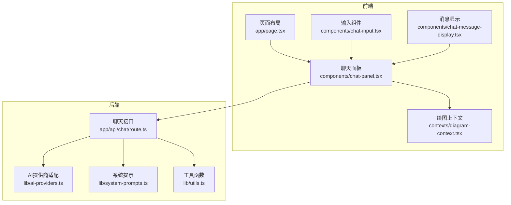
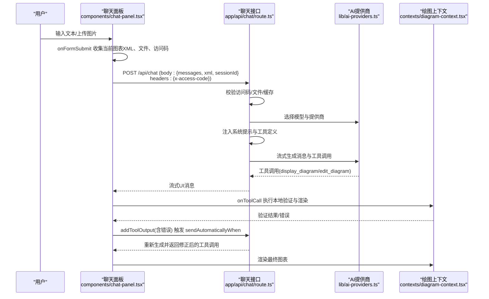
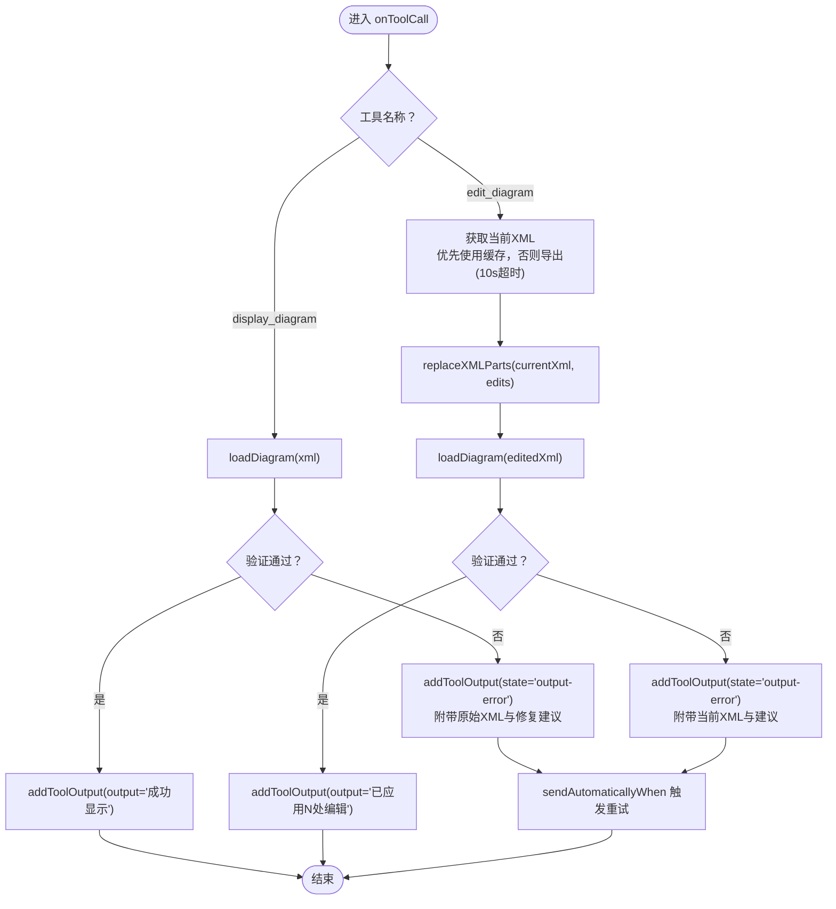
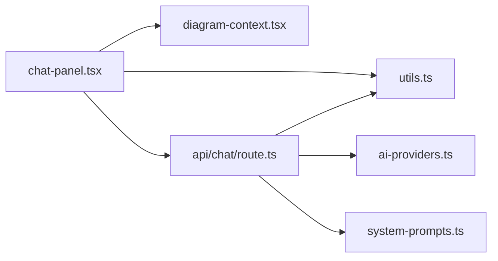
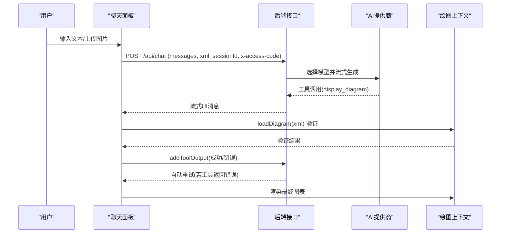

# AI交互

<cite>
**本文引用的文件**
- [app/page.tsx](file://app/page.tsx)
- [components/chat-panel.tsx](file://components/chat-panel.tsx)
- [components/chat-input.tsx](file://components/chat-input.tsx)
- [components/chat-message-display.tsx](file://components/chat-message-display.tsx)
- [contexts/diagram-context.tsx](file://contexts/diagram-context.tsx)
- [app/api/chat/route.ts](file://app/api/chat/route.ts)
- [lib/ai-providers.ts](file://lib/ai-providers.ts)
- [lib/system-prompts.ts](file://lib/system-prompts.ts)
- [lib/utils.ts](file://lib/utils.ts)
</cite>

## 目录
1. [引言](#引言)
2. [项目结构](#项目结构)
3. [核心组件](#核心组件)
4. [架构总览](#架构总览)
5. [详细组件分析](#详细组件分析)
6. [依赖关系分析](#依赖关系分析)
7. [性能考量](#性能考量)
8. [故障排查指南](#故障排查指南)
9. [结论](#结论)
10. [附录](#附录)

## 引言
本文件围绕“聊天面板与AI模型的交互机制”进行深入解析，重点覆盖以下方面：
- useChat Hook 如何通过 DefaultChatTransport 与 /api/chat 端点通信
- onToolCall 回调如何处理 display_diagram 与 edit_diagram 工具调用
- 工具调用中 XML 验证失败时的错误处理流程，以及如何向 AI 返回错误信息以触发重试
- sendAutomaticallyWhen 配置如何实现工具调用结果自动提交
- onFormSubmit 函数如何收集当前图表 XML、文件输入与访问码，并作为请求体与头部发送
- 实际交互序列示例：从用户输入到 AI 响应再到图表更新的完整数据流
- 性能考虑：10 秒导出超时的 Promise.race 实现

## 项目结构
该系统采用前后端分离的 Next.js 应用结构，前端负责聊天与绘图交互，后端通过 /api/chat 提供流式对话与工具调用能力。核心交互路径如下：
- 前端聊天面板（ChatPanel）使用 @ai-sdk/react 的 useChat Hook，通过 DefaultChatTransport 指向 /api/chat
- 后端路由 app/api/chat/route.ts 接收消息、校验参数、选择模型、注入系统提示与工具定义，并通过 AI SDK 流式输出
- 绘图上下文（DiagramContext）负责与 Draw.io 编辑器交互，提供加载/导出 XML、历史记录等能力
- 工具定义在后端 route.ts 中声明 display_diagram 与 edit_diagram，前端 onToolCall 负责执行本地验证与渲染

图表来源
- [app/page.tsx](file://app/page.tsx#L1-L162)
- [components/chat-panel.tsx](file://components/chat-panel.tsx#L1-L120)
- [components/chat-input.tsx](file://components/chat-input.tsx#L1-L120)
- [contexts/diagram-context.tsx](file://contexts/diagram-context.tsx#L1-L120)
- [app/api/chat/route.ts](file://app/api/chat/route.ts#L1-L120)
- [lib/ai-providers.ts](file://lib/ai-providers.ts#L1-L120)
- [lib/system-prompts.ts](file://lib/system-prompts.ts#L1-L120)
- [lib/utils.ts](file://lib/utils.ts#L1-L120)

章节来源
- [app/page.tsx](file://app/page.tsx#L1-L162)
- [components/chat-panel.tsx](file://components/chat-panel.tsx#L1-L120)
- [app/api/chat/route.ts](file://app/api/chat/route.ts#L1-L120)

## 核心组件
- useChat Hook 与 DefaultChatTransport
  - 在 ChatPanel 中，useChat 初始化时传入 transport: new DefaultChatTransport({ api: "/api/chat" })，使前端通过 /api/chat 发送与接收消息流
  - 通过 onToolCall 处理后端返回的工具调用（display_diagram/edit_diagram），并在本地执行 XML 验证与渲染
  - 通过 sendAutomaticallyWhen: lastAssistantMessageIsCompleteWithToolCalls，当所有工具结果（含错误）可用时自动重新提交，从而触发模型重试
- /api/chat 路由
  - 接收请求体 messages、xml、sessionId
  - 校验访问码、文件数量与大小、缓存命中、系统提示注入、工具定义、模型选择与流式输出
  - 对 Bedrock 等平台的工具调用输入进行修复（字符串转对象）
- 绘图上下文 DiagramContext
  - 提供 loadDiagram、handleExport、handleExportWithoutHistory、extractDiagramXML 等能力
  - 在 onToolCall 中执行 XML 验证，验证失败则通过 addToolOutput 返回错误状态，触发 sendAutomaticallyWhen 自动重试

章节来源
- [components/chat-panel.tsx](file://components/chat-panel.tsx#L129-L287)
- [app/api/chat/route.ts](file://app/api/chat/route.ts#L145-L214)
- [contexts/diagram-context.tsx](file://contexts/diagram-context.tsx#L76-L134)

## 架构总览
下图展示了从前端聊天面板到后端接口再到 AI 模型与绘图编辑器的整体交互流程。

图表来源
- [components/chat-panel.tsx](file://components/chat-panel.tsx#L129-L287)
- [app/api/chat/route.ts](file://app/api/chat/route.ts#L145-L214)
- [lib/ai-providers.ts](file://lib/ai-providers.ts#L112-L286)
- [contexts/diagram-context.tsx](file://contexts/diagram-context.tsx#L76-L134)

## 详细组件分析

### useChat Hook 与 DefaultChatTransport
- 初始化
  - transport: new DefaultChatTransport({ api: "/api/chat" }) 将前端与后端 /api/chat 连接
  - onToolCall: 定义工具调用处理逻辑（display_diagram/edit_diagram）
  - onError: 处理网络或权限类错误（如访问码缺失），并提示设置弹窗
  - sendAutomaticallyWhen: lastAssistantMessageIsCompleteWithToolCalls 实现工具结果就绪后自动重新提交
- 关键行为
  - display_diagram: 从工具输入提取 xml，调用 loadDiagram 执行本地 XML 验证；若验证失败，addToolOutput(state: "output-error") 返回错误给模型，触发重试
  - edit_diagram: 优先使用 chartXMLRef.current（缓存的最新 XML）；若为空则通过 onFetchChart(false) 导出当前 XML；随后调用 replaceXMLParts 执行替换；再次通过 loadDiagram 验证；失败则 addToolOutput(state: "output-error") 并包含当前 XML 以便模型诊断
  - onFormSubmit: 收集当前图表 XML（格式化）、文件（Data URL）、访问码，构造 parts 与 body(headers/body)，调用 sendMessage 发送

章节来源
- [components/chat-panel.tsx](file://components/chat-panel.tsx#L129-L287)
- [components/chat-panel.tsx](file://components/chat-panel.tsx#L449-L506)

### onToolCall 回调：display_diagram 与 edit_diagram
- display_diagram
  - 输入: { xml }
  - 行为: 调用 loadDiagram(xml) 执行 validateMxCellStructure；若返回错误，则 addToolOutput(state: "output-error") 并附带原始 XML，触发 sendAutomaticallyWhen 自动重试
  - 成功: addToolOutput(output: "成功显示图表")
- edit_diagram
  - 输入: { edits: Array<{ search, replace }> }
  - 行为: 优先使用 chartXMLRef.current；若为空则 Promise.race 导出（10 秒超时）；调用 replaceXMLParts(currentXml, edits)；再次 validate；失败则 addToolOutput(state: "output-error") 并附带当前 XML 与建议
  - 成功: addToolOutput(output: "已应用 N 处编辑")

图表来源
- [components/chat-panel.tsx](file://components/chat-panel.tsx#L141-L259)
- [contexts/diagram-context.tsx](file://contexts/diagram-context.tsx#L76-L134)
- [lib/utils.ts](file://lib/utils.ts#L246-L506)

章节来源
- [components/chat-panel.tsx](file://components/chat-panel.tsx#L141-L259)
- [contexts/diagram-context.tsx](file://contexts/diagram-context.tsx#L76-L134)
- [lib/utils.ts](file://lib/utils.ts#L246-L506)

### sendAutomaticallyWhen：自动提交工具结果
- 配置: sendAutomaticallyWhen: lastAssistantMessageIsCompleteWithToolCalls
- 作用: 当助手消息包含的工具调用全部完成（包括错误）时，自动重新提交消息，使模型有机会根据错误信息进行重试或修正
- 与 onToolCall 协同: onToolCall 返回错误时，addToolOutput(state: "output-error") 使工具调用完成，进而触发自动重试

章节来源
- [components/chat-panel.tsx](file://components/chat-panel.tsx#L284-L287)

### onFormSubmit：请求体与头部构建
- 收集内容
  - 图表 XML: 通过 onFetchChart() 获取当前 XML，格式化后写入 chartXMLRef.current
  - 文件: 将 File 转换为 Data URL，拼接到 parts 中
  - 访问码: 从 localStorage 读取，放入 headers: { "x-access-code": accessCode }
- 请求体
  - body: { xml, sessionId }
  - headers: { "x-access-code": accessCode }
- 调用 sendMessage 发送

章节来源
- [components/chat-panel.tsx](file://components/chat-panel.tsx#L449-L506)

### 绘图上下文：XML 验证与导出
- loadDiagram(chart, skipValidation?)
  - 若 skipValidation=false，先 validateMxCellStructure，返回错误字符串或 null
  - 设置 chartXML 并通过 Draw.io 加载
- handleExport/handleExportWithoutHistory
  - 触发 Draw.io 导出 xmlsvg，回调 handleDiagramExport 解析并保存 XML
- extractDiagramXML(svgData)
  - 从 xmlsvg 中提取并解压 XML 内容

章节来源
- [contexts/diagram-context.tsx](file://contexts/diagram-context.tsx#L76-L134)
- [lib/utils.ts](file://lib/utils.ts#L645-L711)

### 后端 /api/chat：模型选择、系统提示与工具定义
- 访问码校验
  - 从 headers 读取 x-access-code，与环境变量 ACCESS_CODE_LIST 比较，缺失或不匹配返回 401
- 文件校验
  - 最大文件数与大小限制，按 Data URL 解码后计算字节数
- 缓存与系统提示
  - 首条消息且空图时尝试缓存命中
  - 注入系统提示（DEFAULT/EXTENDED），并注入当前 XML 上下文
- 工具定义
  - display_diagram: 参数 xml；规则严格（根节点、唯一 ID、父子关系、边连接、特殊字符转义等）
  - edit_diagram: 参数 edits 数组，要求精确复制搜索模式（属性顺序、换行、缩进）
- 模型选择
  - 通过 lib/ai-providers.ts 动态选择提供商与模型，支持多厂商与本地 Ollama
- 流式输出
  - 使用 streamText 与 toUIMessageStreamResponse 输出消息与工具调用

章节来源
- [app/api/chat/route.ts](file://app/api/chat/route.ts#L145-L214)
- [app/api/chat/route.ts](file://app/api/chat/route.ts#L215-L393)
- [lib/ai-providers.ts](file://lib/ai-providers.ts#L112-L286)
- [lib/system-prompts.ts](file://lib/system-prompts.ts#L1-L120)

## 依赖关系分析
- 前端依赖
  - components/chat-panel.tsx 依赖 @ai-sdk/react/useChat、DefaultChatTransport、sonner、react-resizable-panels
  - 依赖 contexts/diagram-context.tsx 提供的绘图能力
  - 依赖 lib/utils.ts 的 XML 格式化与替换工具
- 后端依赖
  - app/api/chat/route.ts 依赖 lib/ai-providers.ts、lib/system-prompts.ts、lib/utils.ts
  - 使用 AI SDK 的 streamText、convertToModelMessages、toUIMessageStreamResponse
- 数据流耦合
  - 前端通过 sendMessage 与后端流式通信，后端通过 tools 定义与前端 onToolCall 协作
  - 绘图上下文在前端执行本地验证，确保 XML 结构正确后再渲染

图表来源
- [components/chat-panel.tsx](file://components/chat-panel.tsx#L1-L120)
- [contexts/diagram-context.tsx](file://contexts/diagram-context.tsx#L1-L120)
- [lib/utils.ts](file://lib/utils.ts#L1-L120)
- [app/api/chat/route.ts](file://app/api/chat/route.ts#L1-L120)
- [lib/ai-providers.ts](file://lib/ai-providers.ts#L1-L120)
- [lib/system-prompts.ts](file://lib/system-prompts.ts#L1-L120)

章节来源
- [components/chat-panel.tsx](file://components/chat-panel.tsx#L1-L120)
- [contexts/diagram-context.tsx](file://contexts/diagram-context.tsx#L1-L120)
- [app/api/chat/route.ts](file://app/api/chat/route.ts#L1-L120)

## 性能考量
- 10 秒导出超时（Promise.race）
  - 在 onFetchChart 中，同时等待 Draw.io 导出与 10 秒定时器，任一先决条件满足即返回或抛错
  - 用于避免在 Vercel 等环境下 iframe 导出延迟导致的阻塞
- 流式输出与缓存
  - 后端使用 streamText 与 toUIMessageStreamResponse 实现流式响应
  - 通过系统提示与 XML 上下文分段缓存（cache point），减少重复计算
- 文件大小与数量限制
  - 后端对文件数量与大小进行限制，避免过大数据传输影响性能
- 工具修复
  - 对 Bedrock 等平台的工具调用输入进行修复（字符串转对象），提升兼容性与稳定性

章节来源
- [components/chat-panel.tsx](file://components/chat-panel.tsx#L65-L89)
- [app/api/chat/route.ts](file://app/api/chat/route.ts#L1-L60)
- [app/api/chat/route.ts](file://app/api/chat/route.ts#L297-L313)

## 故障排查指南
- XML 验证失败
  - 现象: onToolCall 返回错误，addToolOutput(state: "output-error")，sendAutomaticallyWhen 自动重试
  - 处理: 检查工具输入的 XML 是否满足 display_diagram 的规则（根节点、唯一 ID、父子关系、边连接、特殊字符转义等）
  - 参考: lib/utils.ts 的 validateMxCellStructure 与后端 tools.display_diagram 描述
- 访问码错误
  - 现象: onError 捕获错误，UI 显示设置弹窗并高亮访问码按钮
  - 处理: 在设置中配置正确的访问码，或移除访问码要求
- 导出超时
  - 现象: onFetchChart 抛出“10 秒导出超时”
  - 处理: 确认 Draw.io 编辑器已就绪；检查网络与浏览器环境；必要时重试
- 文件过大/过多
  - 现象: 后端返回 400 错误，提示文件数量或大小超出限制
  - 处理: 减少文件数量或压缩文件大小

章节来源
- [components/chat-panel.tsx](file://components/chat-panel.tsx#L141-L259)
- [components/chat-panel.tsx](file://components/chat-panel.tsx#L261-L283)
- [app/api/chat/route.ts](file://app/api/chat/route.ts#L145-L193)
- [lib/utils.ts](file://lib/utils.ts#L508-L643)

## 结论
本系统通过 useChat 与 DefaultChatTransport 实现前端与后端 /api/chat 的稳定通信，借助 onToolCall 与 sendAutomaticallyWhen 完成工具调用与自动重试闭环。后端通过严格的工具定义与系统提示，结合绘图上下文的本地 XML 验证，确保生成的图表结构合法、可渲染。10 秒导出超时与文件限制等性能策略有效提升了用户体验与系统稳定性。

## 附录

### 实际交互序列示例（从用户输入到图表更新）

图表来源
- [components/chat-panel.tsx](file://components/chat-panel.tsx#L129-L287)
- [app/api/chat/route.ts](file://app/api/chat/route.ts#L341-L393)
- [contexts/diagram-context.tsx](file://contexts/diagram-context.tsx#L76-L134)