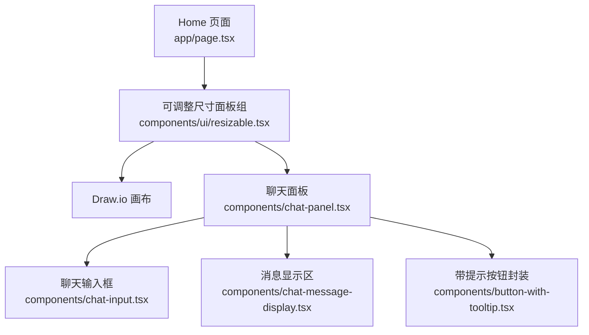
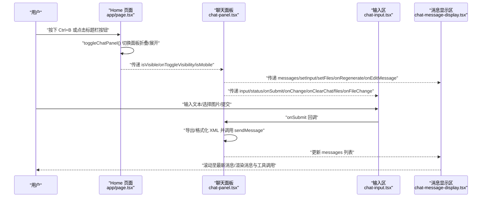
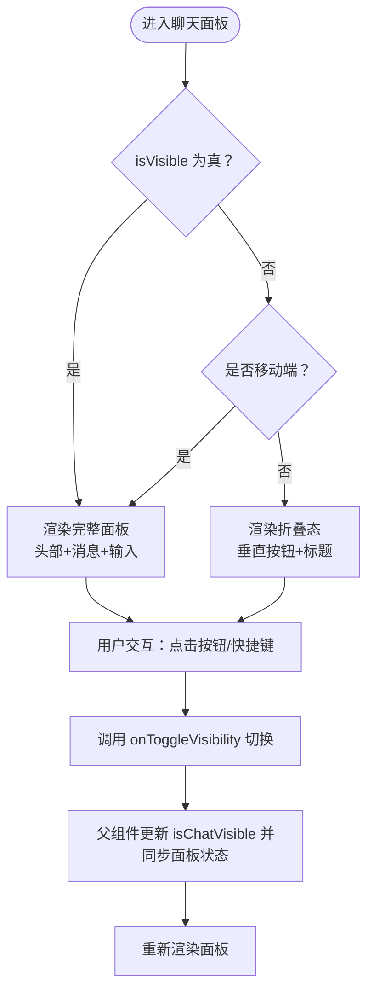
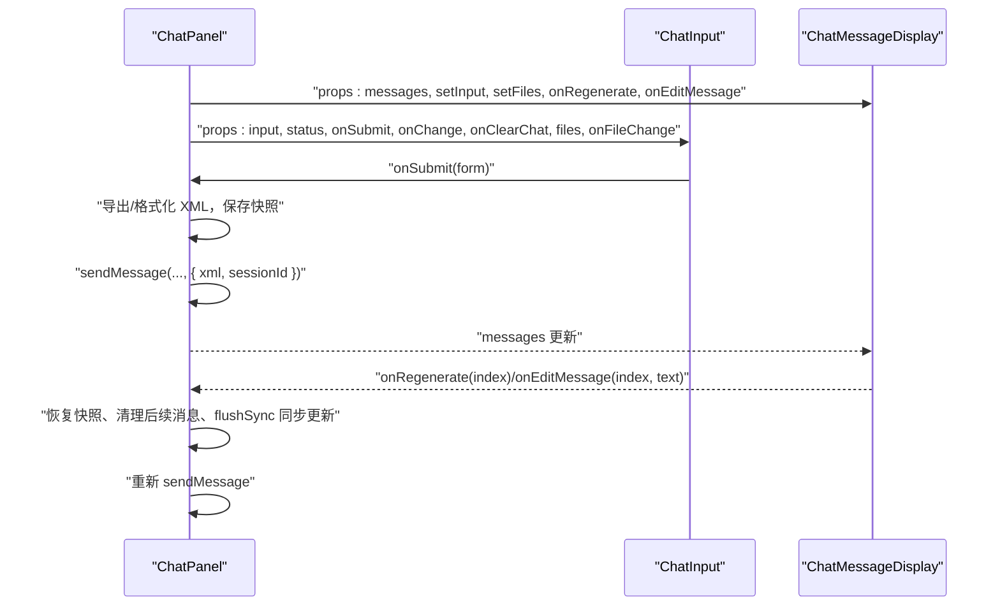
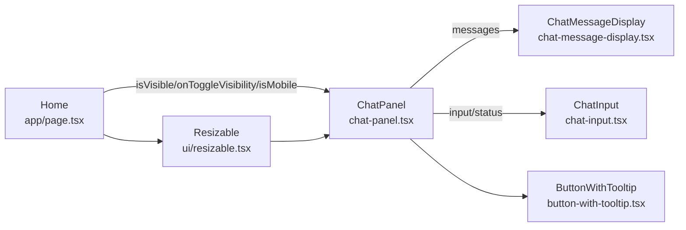

# UI行为与交互

<cite>
**本文引用的文件**
- [app/page.tsx](file://app/page.tsx)
- [components/chat-panel.tsx](file://components/chat-panel.tsx)
- [components/chat-input.tsx](file://components/chat-input.tsx)
- [components/chat-message-display.tsx](file://components/chat-message-display.tsx)
- [components/ui/resizable.tsx](file://components/ui/resizable.tsx)
- [components/button-with-tooltip.tsx](file://components/button-with-tooltip.tsx)
- [components/error-toast.tsx](file://components/error-toast.tsx)
- [components/chat-example-panel.tsx](file://components/chat-example-panel.tsx)
</cite>

## 目录
1. [简介](#简介)
2. [项目结构](#项目结构)
3. [核心组件](#核心组件)
4. [架构总览](#架构总览)
5. [详细组件分析](#详细组件分析)
6. [依赖关系分析](#依赖关系分析)
7. [性能考量](#性能考量)
8. [故障排查指南](#故障排查指南)
9. [结论](#结论)

## 简介
本文件聚焦于聊天面板的UI行为与用户交互模式，围绕以下主题展开：
- 折叠/展开状态的实现机制（isVisible prop 与 onToggleVisibility 回调的协作）
- 移动端与桌面端的响应式布局差异（标题栏按钮的显示逻辑）
- 快捷键 Ctrl+B 如何通过父组件 page.tsx 中的 chatPanelRef 和 toggleChatPanel 实现面板切换
- 聊天输入框（ChatInput 组件）与消息显示区（ChatMessageDisplay 组件）的集成方式
- 加载状态、错误提示与空状态的视觉反馈设计
- 可访问性改进建议（为折叠按钮添加 ARIA 标签与键盘事件处理）

## 项目结构
聊天面板位于页面主布局中，采用可调整尺寸的面板组进行布局，支持桌面端水平分栏与移动端垂直分栏。父组件负责维护可见性状态、响应窗口尺寸变化，并通过快捷键触发面板折叠/展开。

图表来源
- [app/page.tsx](file://app/page.tsx#L91-L161)
- [components/ui/resizable.tsx](file://components/ui/resizable.tsx#L1-L57)
- [components/chat-panel.tsx](file://components/chat-panel.tsx#L649-L756)
- [components/chat-input.tsx](file://components/chat-input.tsx#L140-L481)
- [components/chat-message-display.tsx](file://components/chat-message-display.tsx#L109-L160)
- [components/button-with-tooltip.tsx](file://components/button-with-tooltip.tsx#L1-L37)

章节来源
- [app/page.tsx](file://app/page.tsx#L91-L161)
- [components/ui/resizable.tsx](file://components/ui/resizable.tsx#L1-L57)

## 核心组件
- 父容器与布局：Home 页面使用可调整尺寸面板组在桌面端水平分栏、移动端垂直分栏；聊天面板作为右侧/上侧面板，支持折叠与展开。
- 聊天面板：根据 isVisible 与 isMobile 决定渲染“折叠态”或“完整态”，包含头部工具栏、消息显示区、输入区。
- 输入区：支持文本输入、图片拖拽/粘贴上传、历史与保存等操作，禁用态与发送态通过状态字段控制。
- 消息显示区：渲染用户/系统/助手消息，支持复制、点赞/踩、重生成、编辑用户消息等交互；空状态时展示示例卡片。

章节来源
- [app/page.tsx](file://app/page.tsx#L91-L161)
- [components/chat-panel.tsx](file://components/chat-panel.tsx#L649-L800)
- [components/chat-input.tsx](file://components/chat-input.tsx#L140-L481)
- [components/chat-message-display.tsx](file://components/chat-message-display.tsx#L109-L160)

## 架构总览
从父组件到子组件的数据流与交互链路如下：

图表来源
- [app/page.tsx](file://app/page.tsx#L51-L74)
- [components/chat-panel.tsx](file://components/chat-panel.tsx#L449-L506)
- [components/chat-input.tsx](file://components/chat-input.tsx#L280-L310)
- [components/chat-message-display.tsx](file://components/chat-message-display.tsx#L201-L250)

## 详细组件分析

### 折叠/展开状态与可见性机制
- 状态来源：父组件 Home 维护 isChatVisible，并通过 onToggleVisibility 与 isVisible 与子组件协作。
- 面板控制：通过 ref 获取面板实例，调用 collapse()/expand() 切换折叠/展开，并同步更新 isChatVisible。
- 折叠态渲染：当 isVisible 为 false 且非移动端时，仅显示一个垂直方向的“展开”按钮与标题，便于快速唤起。
- 展开态渲染：完整头部（Logo、链接、GitHub、设置、隐藏按钮）、消息显示区、输入区。

图表来源
- [components/chat-panel.tsx](file://components/chat-panel.tsx#L649-L756)
- [app/page.tsx](file://app/page.tsx#L51-L74)

章节来源
- [components/chat-panel.tsx](file://components/chat-panel.tsx#L649-L756)
- [app/page.tsx](file://app/page.tsx#L51-L74)

### 响应式布局与标题栏按钮显示逻辑
- 方向切换：根据 isMobile 切换面板组方向（水平/垂直），并影响默认大小、最小/最大尺寸与是否可折叠。
- 按钮显示：移动端不显示“隐藏面板”按钮；“设置”按钮始终存在；“关于”链接仅在非移动端显示。
- 折叠按钮：移动端无折叠按钮，仅通过拖拽/手势或快捷键控制；桌面端提供“展开/隐藏”按钮。

章节来源
- [app/page.tsx](file://app/page.tsx#L91-L161)
- [components/chat-panel.tsx](file://components/chat-panel.tsx#L684-L756)

### 快捷键 Ctrl+B 的实现路径
- 全局监听：父组件监听键盘事件，当检测到 Ctrl/Cmd + B 时阻止默认行为并调用 toggleChatPanel。
- 面板切换：toggleChatPanel 读取 chatPanelRef，若当前已折叠则 expand()，否则 collapse()，同时更新 isChatVisible。
- 无障碍提示：折叠态按钮与隐藏态按钮均带有 Tooltip 提示，包含“Ctrl+B”提示信息。

章节来源
- [app/page.tsx](file://app/page.tsx#L51-L74)
- [components/chat-panel.tsx](file://components/chat-panel.tsx#L650-L756)

### 聊天输入框与消息显示区的集成
- 数据绑定：ChatPanel 将 messages 传给 ChatMessageDisplay，将 input/status 等传给 ChatInput。
- 事件桥接：ChatInput 的 onSubmit 回调由 ChatPanel 提供，内部完成 XML 导出/格式化、消息发送与状态管理。
- 编辑与重生成：ChatMessageDisplay 将 onEditMessage/onRegenerate 回调传回 ChatPanel，后者据此重建消息上下文并重新发送。

图表来源
- [components/chat-panel.tsx](file://components/chat-panel.tsx#L449-L506)
- [components/chat-panel.tsx](file://components/chat-panel.tsx#L518-L647)
- [components/chat-message-display.tsx](file://components/chat-message-display.tsx#L109-L160)
- [components/chat-input.tsx](file://components/chat-input.tsx#L280-L310)

章节来源
- [components/chat-panel.tsx](file://components/chat-panel.tsx#L449-L647)
- [components/chat-message-display.tsx](file://components/chat-message-display.tsx#L109-L160)
- [components/chat-input.tsx](file://components/chat-input.tsx#L280-L310)

### 加载状态、错误提示与空状态的视觉反馈
- 加载状态
  - 页面加载 Draw.io 时显示旋转指示器。
  - 输入区在发送中显示“发送中”状态，按钮禁用并显示加载图标。
- 错误提示
  - ChatPanel 在 onError 中将错误以系统消息形式加入消息列表，并在特定错误时弹出设置对话框。
  - 文件校验失败通过 ErrorToast 以可访问的 Toast 形式提示。
- 空状态
  - 当消息列表为空时，显示示例卡片面板，提供快速示例与图片上传入口，提升首次体验。

章节来源
- [app/page.tsx](file://app/page.tsx#L117-L127)
- [components/chat-panel.tsx](file://components/chat-panel.tsx#L261-L287)
- [components/error-toast.tsx](file://components/error-toast.tsx#L1-L45)
- [components/chat-example-panel.tsx](file://components/chat-example-panel.tsx#L1-L134)

### 可访问性改进建议
- 折叠按钮
  - 为“展开/隐藏”按钮添加 aria-label 与 aria-expanded，以明确当前面板状态。
  - 保持按钮可键盘聚焦与可点击，确保键盘用户可通过 Enter/Space 触发。
- 输入区
  - 文本域与按钮均具备 aria-label，避免无意义的图标替代文本。
  - 键盘事件处理：支持 Ctrl/Cmd + Enter 发送，Esc 取消编辑，Enter/Space 打开确认对话框。
- 消息显示区
  - 用户消息气泡在可编辑状态下提供 role="button" 与 tabIndex，支持键盘激活编辑。
  - 复制/点赞/踩等操作按钮提供 title 与 aria-label，配合键盘导航。

章节来源
- [components/chat-input.tsx](file://components/chat-input.tsx#L300-L315)
- [components/chat-input.tsx](file://components/chat-input.tsx#L457-L476)
- [components/chat-message-display.tsx](file://components/chat-message-display.tsx#L518-L581)
- [components/chat-panel.tsx](file://components/chat-panel.tsx#L650-L756)

## 依赖关系分析
- 组件耦合
  - Home 与 ChatPanel：通过 props 传递可见性与回调，耦合度低，职责清晰。
  - ChatPanel 与 ChatInput/ChatMessageDisplay：通过 props 注入数据与回调，形成单向数据流。
- 外部依赖
  - 可调整尺寸面板组：用于桌面/移动端布局切换与面板折叠/展开。
  - Tooltip/Button 封装：统一按钮与提示样式，提升一致性与可访问性。
- 潜在循环依赖
  - 未发现直接循环依赖；各组件间为单向依赖（父 -> 子）。

图表来源
- [app/page.tsx](file://app/page.tsx#L91-L161)
- [components/chat-panel.tsx](file://components/chat-panel.tsx#L649-L800)
- [components/chat-input.tsx](file://components/chat-input.tsx#L140-L481)
- [components/chat-message-display.tsx](file://components/chat-message-display.tsx#L109-L160)
- [components/button-with-tooltip.tsx](file://components/button-with-tooltip.tsx#L1-L37)
- [components/ui/resizable.tsx](file://components/ui/resizable.tsx#L1-L57)

章节来源
- [app/page.tsx](file://app/page.tsx#L91-L161)
- [components/chat-panel.tsx](file://components/chat-panel.tsx#L649-L800)
- [components/chat-input.tsx](file://components/chat-input.tsx#L140-L481)
- [components/chat-message-display.tsx](file://components/chat-message-display.tsx#L109-L160)
- [components/button-with-tooltip.tsx](file://components/button-with-tooltip.tsx#L1-L37)
- [components/ui/resizable.tsx](file://components/ui/resizable.tsx#L1-L57)

## 性能考量
- 消息滚动：每次消息变更后自动平滑滚动至底部，避免频繁重排。
- 状态持久化：消息、XML 快照与会话 ID 使用 localStorage 持久化，卸载前写入，减少重复工作。
- 工具调用：对 display_diagram/edit_diagram 的工具调用进行状态跟踪与去重，避免重复渲染。
- 图片上传：限制文件数量与大小，校验失败即时反馈，减少无效请求。

章节来源
- [components/chat-panel.tsx](file://components/chat-panel.tsx#L414-L419)
- [components/chat-panel.tsx](file://components/chat-panel.tsx#L369-L413)
- [components/chat-panel.tsx](file://components/chat-panel.tsx#L141-L260)
- [components/chat-input.tsx](file://components/chat-input.tsx#L34-L41)

## 故障排查指南
- 快捷键无效
  - 确认浏览器焦点在页面主体，且未被其他输入控件覆盖。
  - 检查是否在移动端（移动端无折叠按钮，需通过手势或快捷键切换）。
- 面板无法折叠/展开
  - 检查 chatPanelRef 是否正确赋值，以及面板是否处于可折叠状态（移动端不可折叠）。
- 发送失败或无响应
  - 查看消息列表中是否有系统错误消息；检查网络与访问码配置。
- 图片上传失败
  - 确认文件类型为图片、大小不超过限制；查看错误 Toast 提示。

章节来源
- [app/page.tsx](file://app/page.tsx#L51-L74)
- [components/chat-panel.tsx](file://components/chat-panel.tsx#L261-L287)
- [components/error-toast.tsx](file://components/error-toast.tsx#L1-L45)
- [components/chat-input.tsx](file://components/chat-input.tsx#L52-L113)

## 结论
该聊天面板通过清晰的父子组件边界与单向数据流实现了稳定的 UI 行为与良好的用户体验。折叠/展开机制、响应式布局与快捷键支持共同提升了可用性；输入区与消息显示区的紧密集成保证了交互的一致性；加载、错误与空状态的视觉反馈进一步增强了可感知性。建议在现有基础上补充折叠按钮的 ARIA 属性与键盘事件，以满足更严格的可访问性要求。