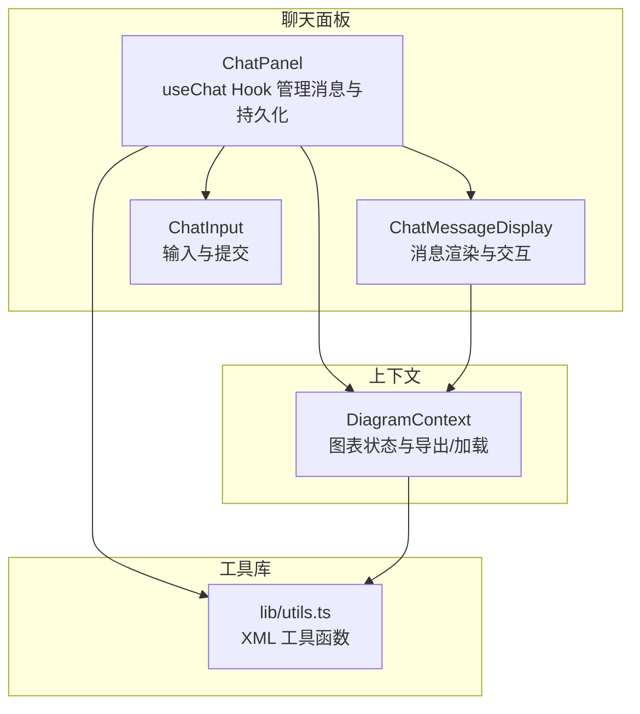
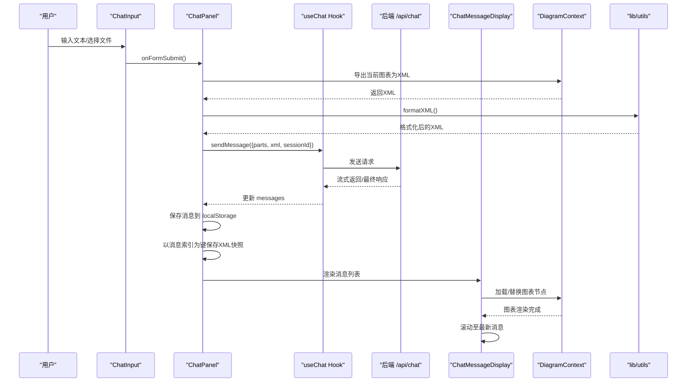
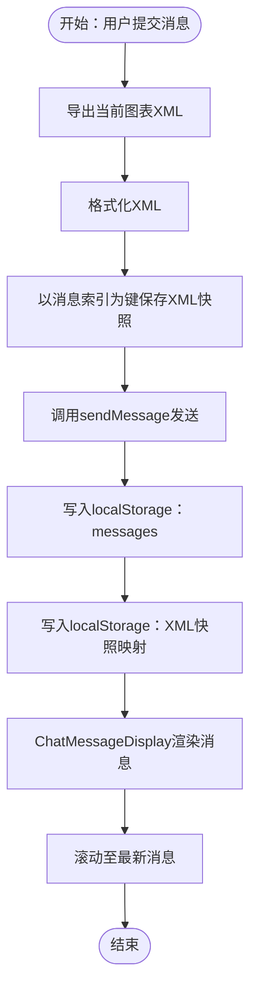
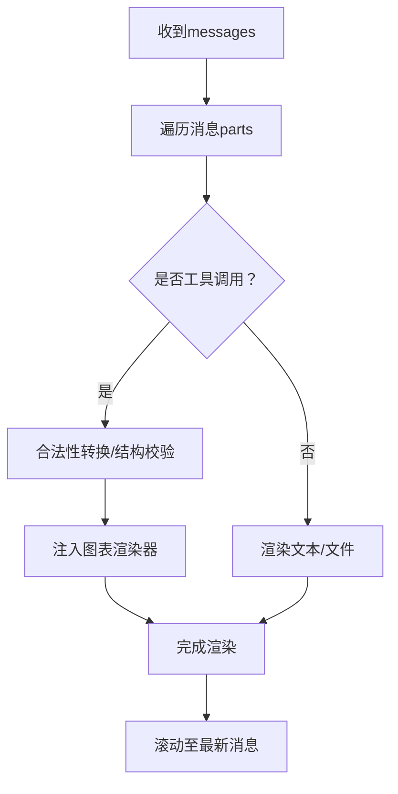
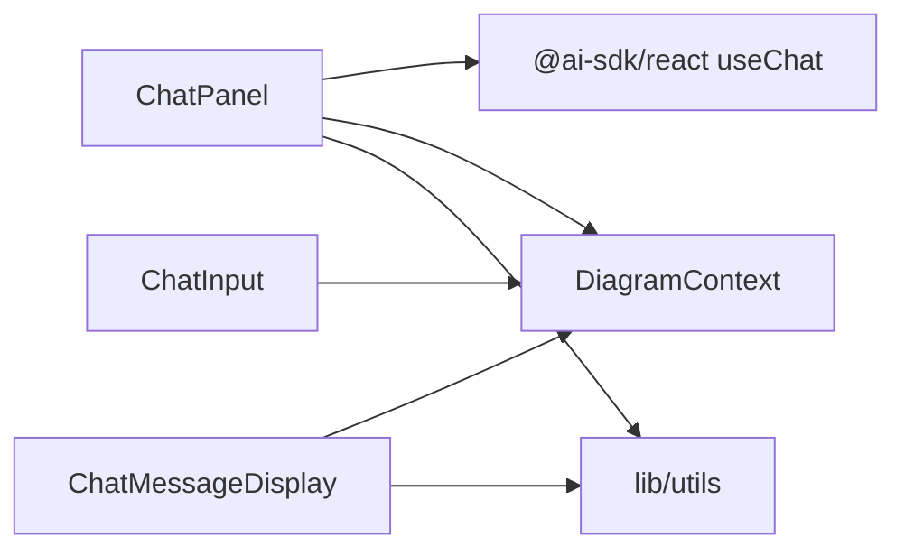

# 消息管理

<cite>
**本文引用的文件**
- [components/chat-panel.tsx](file://components/chat-panel.tsx)
- [components/chat-message-display.tsx](file://components/chat-message-display.tsx)
- [components/chat-input.tsx](file://components/chat-input.tsx)
- [contexts/diagram-context.tsx](file://contexts/diagram-context.tsx)
- [lib/utils.ts](file://lib/utils.ts)
</cite>

## 目录
1. [简介](#简介)
2. [项目结构](#项目结构)
3. [核心组件](#核心组件)
4. [架构总览](#架构总览)
5. [详细组件分析](#详细组件分析)
6. [依赖分析](#依赖分析)
7. [性能考量](#性能考量)
8. [故障排查指南](#故障排查指南)
9. [结论](#结论)
10. [附录](#附录)

## 简介
本章节聚焦于聊天面板中的消息管理功能，围绕 useChat Hook 的消息状态管理展开，涵盖以下关键点：
- 用户输入、AI 响应与系统消息的处理流程
- 消息持久化到 localStorage 的机制（含 useEffect 钩子与 beforeunload 事件）
- 消息索引与 XML 快照的映射关系，以及在“重新生成”“编辑消息”时如何恢复历史状态
- 消息添加、更新、清除的操作模式示例路径
- 滚动至最新消息的实现（messagesEndRef 与 useEffect）
- 常见问题（状态同步延迟）及解决方案（flushSync 强制同步更新）

## 项目结构
聊天面板由三个主要部分组成：
- 聊天面板容器：负责 useChat Hook 生命周期、消息持久化、XML 快照映射、滚动控制、beforeunload 保存等
- 消息渲染显示：负责消息列表渲染、工具调用展示、复制反馈、编辑与重新生成按钮
- 输入组件：负责文本输入、文件上传、快捷键提交、禁用态控制

图示来源
- [components/chat-panel.tsx](file://components/chat-panel.tsx#L1-L120)
- [components/chat-message-display.tsx](file://components/chat-message-display.tsx#L1-L120)
- [components/chat-input.tsx](file://components/chat-input.tsx#L1-L120)
- [contexts/diagram-context.tsx](file://contexts/diagram-context.tsx#L1-L120)
- [lib/utils.ts](file://lib/utils.ts#L1-L120)

章节来源
- [components/chat-panel.tsx](file://components/chat-panel.tsx#L1-L120)
- [components/chat-message-display.tsx](file://components/chat-message-display.tsx#L1-L120)
- [components/chat-input.tsx](file://components/chat-input.tsx#L1-L120)
- [contexts/diagram-context.tsx](file://contexts/diagram-context.tsx#L1-L120)
- [lib/utils.ts](file://lib/utils.ts#L1-L120)

## 核心组件
- ChatPanel：通过 useChat Hook 获取 messages、sendMessage、addToolOutput、stop、status、error、setMessages；并实现消息持久化、XML 快照映射、滚动至最新、beforeunload 保存、重新生成与编辑消息
- ChatMessageDisplay：渲染消息列表、工具调用块、复制反馈、编辑与重新生成按钮；负责滚动至最新
- ChatInput：处理文本输入、文件上传、粘贴图片、快捷键提交、禁用态控制
- DiagramContext：提供图表加载/导出能力，维护 chartXML、历史记录、保存到文件等
- lib/utils：提供 XML 格式化、合法性转换、节点替换、结构校验、SVG/XML 提取等工具

章节来源
- [components/chat-panel.tsx](file://components/chat-panel.tsx#L120-L220)
- [components/chat-message-display.tsx](file://components/chat-message-display.tsx#L1-L120)
- [components/chat-input.tsx](file://components/chat-input.tsx#L1-L120)
- [contexts/diagram-context.tsx](file://contexts/diagram-context.tsx#L1-L120)
- [lib/utils.ts](file://lib/utils.ts#L1-L120)

## 架构总览
下图展示了消息从用户输入到 AI 响应再到图表渲染与持久化的整体流程，以及消息索引与 XML 快照的映射关系。

图示来源
- [components/chat-panel.tsx](file://components/chat-panel.tsx#L449-L506)
- [components/chat-panel.tsx](file://components/chat-panel.tsx#L369-L418)
- [components/chat-panel.tsx](file://components/chat-panel.tsx#L114-L120)
- [components/chat-message-display.tsx](file://components/chat-message-display.tsx#L175-L200)
- [contexts/diagram-context.tsx](file://contexts/diagram-context.tsx#L76-L134)
- [lib/utils.ts](file://lib/utils.ts#L1-L54)

## 详细组件分析

### ChatPanel：useChat Hook 消息管理与持久化
- useChat Hook 使用
  - 获取 messages、sendMessage、addToolOutput、stop、status、error、setMessages
  - onToolCall 中处理 display_diagram 与 edit_diagram 工具调用，将 XML 注入图表渲染器
  - onError 中将错误转为系统消息并提示访问码设置
  - sendAutomaticallyWhen：当助手消息包含工具结果（含错误）时自动重试
- 消息持久化
  - 挂载时从 localStorage 恢复 messages 与 XML 快照映射
  - 每次 messages 变化时写入 localStorage
  - 页面卸载前（beforeunload）将 messages、XML 快照、当前图表 XML、会话 ID 写入 localStorage
- 消息索引与 XML 快照映射
  - 以 Map<number, string> 存储“消息索引 -> XML 快照”
  - 在发送新消息前，将当前图表 XML 作为“该条用户消息”的快照存入映射
  - 重新生成/编辑时，按消息索引读取快照，恢复图表状态，再截断后续消息并重新发送
- 滚动至最新
  - 使用 messagesEndRef + useEffect，在 messages 变化时滚动到底部
- 状态同步延迟与 flushSync
  - 在“重新生成/编辑”操作中，先截断 messages，再通过 flushSync 同步更新状态，确保 sendMessage 之前状态已就绪

图示来源
- [components/chat-panel.tsx](file://components/chat-panel.tsx#L449-L506)
- [components/chat-panel.tsx](file://components/chat-panel.tsx#L369-L418)
- [components/chat-panel.tsx](file://components/chat-panel.tsx#L300-L326)
- [components/chat-panel.tsx](file://components/chat-panel.tsx#L414-L418)

章节来源
- [components/chat-panel.tsx](file://components/chat-panel.tsx#L120-L220)
- [components/chat-panel.tsx](file://components/chat-panel.tsx#L300-L326)
- [components/chat-panel.tsx](file://components/chat-panel.tsx#L369-L418)
- [components/chat-panel.tsx](file://components/chat-panel.tsx#L414-L418)
- [components/chat-panel.tsx](file://components/chat-panel.tsx#L420-L447)
- [components/chat-panel.tsx](file://components/chat-panel.tsx#L449-L506)
- [components/chat-panel.tsx](file://components/chat-panel.tsx#L518-L647)

### ChatMessageDisplay：消息渲染与交互
- 渲染逻辑
  - 遍历 messages，区分用户/系统/助手角色，渲染文本、文件与工具调用块
  - 对工具调用（display_diagram/edit_diagram）进行输入流/可用/错误状态展示
- 图表渲染
  - 将工具输入的 XML 进行合法性转换与结构校验，再注入图表渲染器
  - 通过 replaceNodes 实现节点级替换，避免全量重载
- 交互功能
  - 复制消息、点赞/踩反馈、编辑用户消息、重新生成助手消息
  - 编辑与重新生成按钮仅对最后一条对应角色消息可见
- 滚动至最新
  - 每次 messages 变化时滚动到底部

图示来源
- [components/chat-message-display.tsx](file://components/chat-message-display.tsx#L175-L200)
- [components/chat-message-display.tsx](file://components/chat-message-display.tsx#L201-L250)
- [components/chat-message-display.tsx](file://components/chat-message-display.tsx#L345-L574)
- [components/chat-message-display.tsx](file://components/chat-message-display.tsx#L201-L205)

章节来源
- [components/chat-message-display.tsx](file://components/chat-message-display.tsx#L1-L120)
- [components/chat-message-display.tsx](file://components/chat-message-display.tsx#L175-L200)
- [components/chat-message-display.tsx](file://components/chat-message-display.tsx#L201-L250)
- [components/chat-message-display.tsx](file://components/chat-message-display.tsx#L345-L574)
- [components/chat-message-display.tsx](file://components/chat-message-display.tsx#L201-L205)

### ChatInput：输入与提交
- 文本输入与高度自适应
- 文件上传与粘贴图片支持（限制数量与大小）
- 提交逻辑
  - Ctrl/Cmd + Enter 触发提交
  - 当 status 为 streaming/submitted 且无错误时禁用提交
- 其他功能
  - 清空对话、切换主题、打开历史、保存文件等

章节来源
- [components/chat-input.tsx](file://components/chat-input.tsx#L1-L120)
- [components/chat-input.tsx](file://components/chat-input.tsx#L130-L220)
- [components/chat-input.tsx](file://components/chat-input.tsx#L220-L320)
- [components/chat-input.tsx](file://components/chat-input.tsx#L320-L481)

### DiagramContext：图表状态与导出/加载
- 提供 loadDiagram、handleExport、handleExportWithoutHistory、clearDiagram、saveDiagramToFile 等方法
- 维护 chartXML、latestSvg、diagramHistory
- 导出回调中提取 XML 并更新状态，必要时加入历史记录

章节来源
- [contexts/diagram-context.tsx](file://contexts/diagram-context.tsx#L1-L120)
- [contexts/diagram-context.tsx](file://contexts/diagram-context.tsx#L120-L200)
- [contexts/diagram-context.tsx](file://contexts/diagram-context.tsx#L200-L268)

### lib/utils：XML 工具函数
- formatXML：格式化 XML 字符串
- convertToLegalXml：将不完整/非法 XML 转换为合法结构
- replaceNodes：基于 DOM 的节点级替换
- validateMxCellStructure：校验 mxCell 结构（重复 ID、孤儿节点、无效父引用、边连接等）
- extractDiagramXML：从 SVG 数据中提取 draw.io XML

章节来源
- [lib/utils.ts](file://lib/utils.ts#L1-L120)
- [lib/utils.ts](file://lib/utils.ts#L120-L207)
- [lib/utils.ts](file://lib/utils.ts#L208-L371)
- [lib/utils.ts](file://lib/utils.ts#L372-L644)
- [lib/utils.ts](file://lib/utils.ts#L645-L711)

## 依赖分析
- ChatPanel 依赖
  - useChat Hook（来自 @ai-sdk/react），用于消息生命周期与工具调用
  - DiagramContext（图表导出/加载）
  - lib/utils（XML 工具）
  - localStorage（消息与快照持久化）
- ChatMessageDisplay 依赖
  - DiagramContext（图表渲染）
  - lib/utils（XML 合法性与节点替换）
- ChatInput 依赖
  - DiagramContext（导出/保存）
  - 文件上传与粘贴处理

图示来源
- [components/chat-panel.tsx](file://components/chat-panel.tsx#L1-L120)
- [components/chat-message-display.tsx](file://components/chat-message-display.tsx#L1-L120)
- [components/chat-input.tsx](file://components/chat-input.tsx#L1-L120)
- [contexts/diagram-context.tsx](file://contexts/diagram-context.tsx#L1-L120)
- [lib/utils.ts](file://lib/utils.ts#L1-L120)

章节来源
- [components/chat-panel.tsx](file://components/chat-panel.tsx#L1-L120)
- [components/chat-message-display.tsx](file://components/chat-message-display.tsx#L1-L120)
- [components/chat-input.tsx](file://components/chat-input.tsx#L1-L120)
- [contexts/diagram-context.tsx](file://contexts/diagram-context.tsx#L1-L120)
- [lib/utils.ts](file://lib/utils.ts#L1-L120)

## 性能考量
- 消息持久化
  - 每次 messages 变化即写入 localStorage，建议在高频更新场景下考虑节流或批量写入策略
  - beforeunload 保存可减少刷新/关闭时的数据丢失风险
- XML 快照映射
  - 以 Map<number, string> 存储，按消息索引快速检索；注意清理过期快照（重新生成/编辑时已清理）
- 滚动优化
  - 每次消息变化滚动至底部，建议在大量消息时结合虚拟滚动或只在末尾几条消息时滚动
- 工具调用渲染
  - display_diagram/edit_diagram 采用 replaceNodes 进行局部替换，避免全量重载，提升渲染性能

[本节为通用指导，无需特定文件引用]

## 故障排查指南
- 状态同步延迟导致“重新生成/编辑”失败
  - 现象：点击“重新生成/编辑”后，sendMessage 仍基于旧 messages
  - 解决：在截断 messages 后使用 flushSync 同步更新状态，确保 sendMessage 之前状态已就绪
  - 参考路径：[components/chat-panel.tsx](file://components/chat-panel.tsx#L564-L570)、[components/chat-panel.tsx](file://components/chat-panel.tsx#L626-L631)
- 访问码缺失导致错误
  - 现象：UI 显示“无效或缺少访问码”，控制台打印错误
  - 解决：在设置弹窗中配置访问码，或根据提示修复
  - 参考路径：[components/chat-panel.tsx](file://components/chat-panel.tsx#L261-L283)
- 图表 XML 不合法
  - 现象：loadDiagram 返回错误信息，提示结构问题（重复 ID、孤儿节点、无效父引用、边连接等）
  - 解决：使用 convertToLegalXml 或 validateMxCellStructure 定位并修复
  - 参考路径：[lib/utils.ts](file://lib/utils.ts#L56-L107)、[lib/utils.ts](file://lib/utils.ts#L508-L644)
- beforeunload 未触发或保存失败
  - 现象：刷新/关闭页面后数据未保存
  - 解决：确认浏览器允许 localStorage 写入，检查 beforeunload 事件绑定与 try/catch 日志
  - 参考路径：[components/chat-panel.tsx](file://components/chat-panel.tsx#L420-L447)

章节来源
- [components/chat-panel.tsx](file://components/chat-panel.tsx#L564-L570)
- [components/chat-panel.tsx](file://components/chat-panel.tsx#L626-L631)
- [components/chat-panel.tsx](file://components/chat-panel.tsx#L261-L283)
- [lib/utils.ts](file://lib/utils.ts#L56-L107)
- [lib/utils.ts](file://lib/utils.ts#L508-L644)
- [components/chat-panel.tsx](file://components/chat-panel.tsx#L420-L447)

## 结论
本聊天面板通过 useChat Hook 实现了完整的消息生命周期管理，并结合 DiagramContext 与 lib/utils 提供的 XML 工具，实现了“用户输入 -> AI 响应 -> 图表渲染 -> 消息持久化”的闭环。消息索引与 XML 快照映射使得“重新生成/编辑”具备可靠的回溯能力；通过 beforeunload 与 useEffect 的组合，确保在页面刷新/关闭时也能保留状态。针对状态同步延迟问题，使用 flushSync 可有效解决竞态问题，提升交互一致性。

[本节为总结，无需特定文件引用]

## 附录

### 操作模式示例（代码片段路径）
- 添加消息（用户输入提交）
  - 触发路径：[components/chat-input.tsx](file://components/chat-input.tsx#L130-L220) -> [components/chat-panel.tsx](file://components/chat-panel.tsx#L449-L506)
- 更新消息（编辑用户消息）
  - 触发路径：[components/chat-message-display.tsx](file://components/chat-message-display.tsx#L433-L511) -> [components/chat-panel.tsx](file://components/chat-panel.tsx#L587-L647)
- 清除消息（清空对话）
  - 触发路径：[components/chat-input.tsx](file://components/chat-input.tsx#L274-L278) -> [components/chat-panel.tsx](file://components/chat-panel.tsx#L780-L796)
- 重新生成（基于消息索引）
  - 触发路径：[components/chat-message-display.tsx](file://components/chat-message-display.tsx#L680-L694) -> [components/chat-panel.tsx](file://components/chat-panel.tsx#L518-L585)

章节来源
- [components/chat-input.tsx](file://components/chat-input.tsx#L130-L220)
- [components/chat-panel.tsx](file://components/chat-panel.tsx#L449-L506)
- [components/chat-panel.tsx](file://components/chat-panel.tsx#L518-L585)
- [components/chat-panel.tsx](file://components/chat-panel.tsx#L587-L647)
- [components/chat-input.tsx](file://components/chat-input.tsx#L274-L278)
- [components/chat-panel.tsx](file://components/chat-panel.tsx#L780-L796)