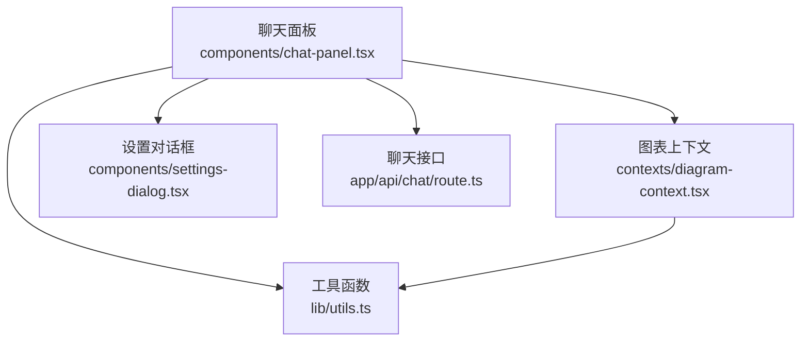
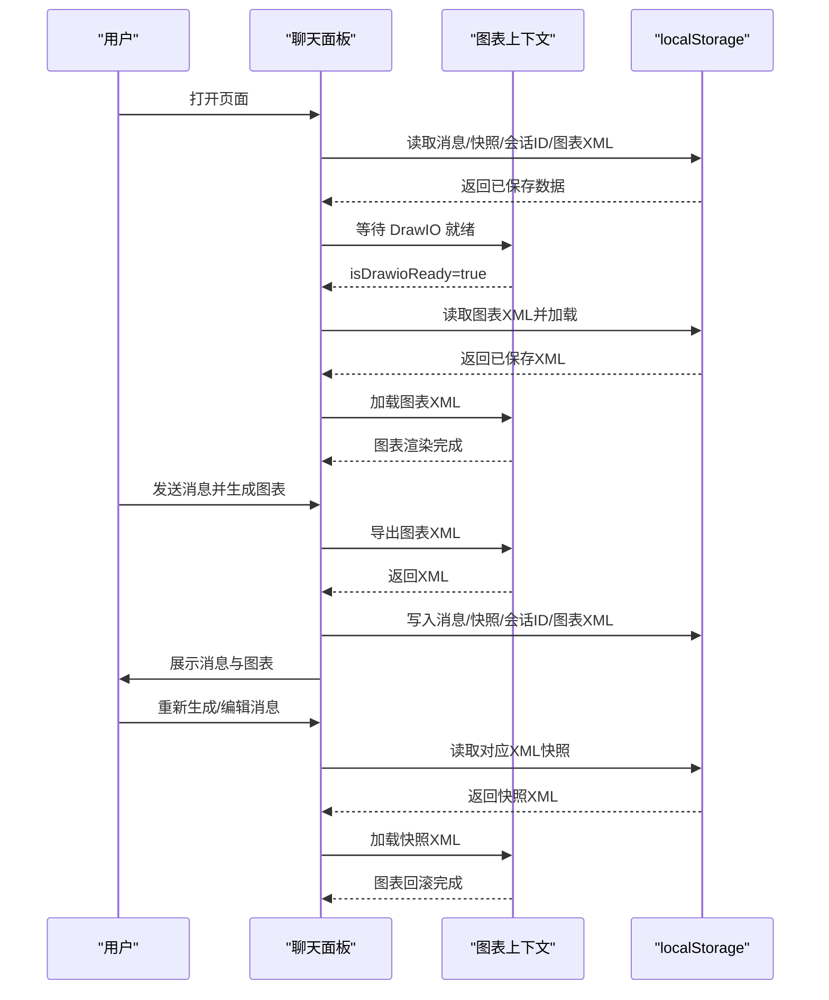
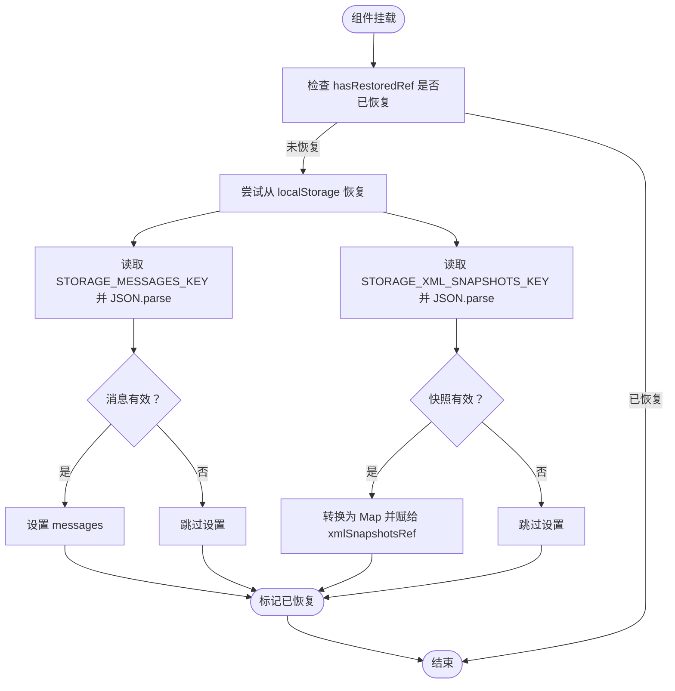
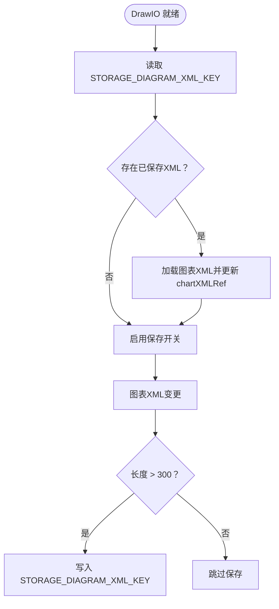
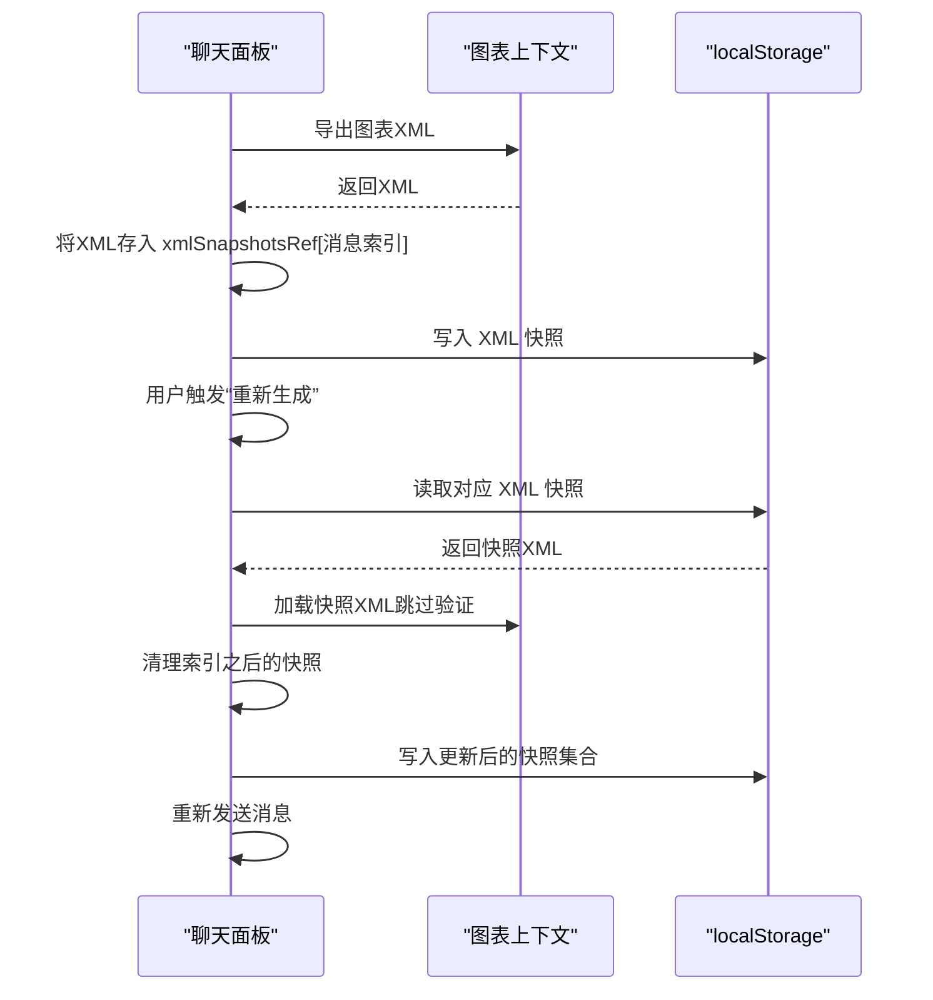
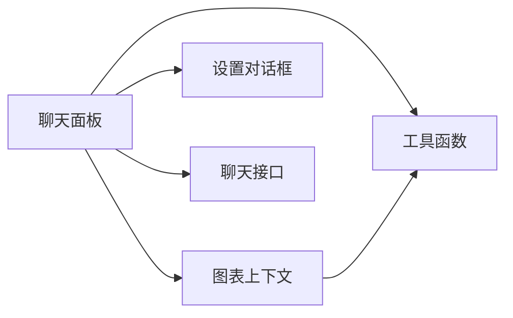

# 状态持久化

<cite>
**本文引用的文件**
- [components/chat-panel.tsx](file://components/chat-panel.tsx)
- [contexts/diagram-context.tsx](file://contexts/diagram-context.tsx)
- [lib/utils.ts](file://lib/utils.ts)
- [components/settings-dialog.tsx](file://components/settings-dialog.tsx)
- [app/api/chat/route.ts](file://app/api/chat/route.ts)
</cite>

## 目录
1. [简介](#简介)
2. [项目结构](#项目结构)
3. [核心组件](#核心组件)
4. [架构总览](#架构总览)
5. [详细组件分析](#详细组件分析)
6. [依赖关系分析](#依赖关系分析)
7. [性能考量](#性能考量)
8. [故障排查指南](#故障排查指南)
9. [结论](#结论)
10. [附录](#附录)

## 简介
本文件系统性梳理聊天面板的状态持久化实现，重点覆盖以下方面：
- 使用 localStorage 持久化消息、图表 XML 和会话 ID 的策略与时机
- 常量 STORAGE_MESSAGES_KEY、STORAGE_DIAGRAM_XML_KEY、STORAGE_SESSION_ID_KEY 的使用场景
- 组件挂载时从 localStorage 恢复数据的流程（useEffect 中的 hasRestoredRef）
- 图表 XML 保存的条件控制（canSaveDiagram 状态与 300 字符长度阈值）
- XML 快照映射 xmlSnapshotsRef 如何支持消息重新生成时的状态回滚
- 持久化过程中的错误处理（JSON 解析失败时的 try-catch）
- 优化建议：更高效的数据序列化格式、防抖与批量写入策略

## 项目结构
与状态持久化直接相关的模块包括：
- 聊天面板组件：负责消息、图表 XML、会话 ID 的读取与写入，并在挂载时恢复状态
- 图表上下文：提供图表加载、导出、历史记录与就绪状态，支撑聊天面板的持久化与回放
- 工具函数：提供 XML 格式化、替换、校验等能力，保障持久化数据的质量
- 设置对话框：管理访问码与关闭保护等设置，间接影响聊天面板的持久化行为
- 后端聊天接口：为模型调用提供上下文，其中包含当前 XML 上下文，有助于缓存命中

图示来源
- [components/chat-panel.tsx](file://components/chat-panel.tsx#L1-L120)
- [contexts/diagram-context.tsx](file://contexts/diagram-context.tsx#L1-L60)
- [lib/utils.ts](file://lib/utils.ts#L1-L60)
- [components/settings-dialog.tsx](file://components/settings-dialog.tsx#L1-L40)
- [app/api/chat/route.ts](file://app/api/chat/route.ts#L315-L339)

章节来源
- [components/chat-panel.tsx](file://components/chat-panel.tsx#L1-L120)
- [contexts/diagram-context.tsx](file://contexts/diagram-context.tsx#L1-L60)

## 核心组件
- 聊天面板（ChatPanel）
  - 定义并使用 localStorage 常量进行消息、XML 快照、会话 ID、图表 XML 的持久化
  - 在挂载阶段恢复消息与 XML 快照；在 DrawIO 就绪后恢复图表 XML
  - 通过 refs 与状态协同，确保在工具调用、编辑、重生成等过程中保持一致性
- 图表上下文（DiagramContext）
  - 提供图表加载、导出、历史记录与就绪状态
  - 作为聊天面板与 DrawIO 交互的桥梁，支撑持久化与回放
- 工具函数（lib/utils）
  - 提供 XML 格式化、节点替换、结构校验、XML 提取等能力
  - 为聊天面板的编辑与回滚提供基础能力
- 设置对话框（SettingsDialog）
  - 管理访问码与关闭保护等设置，影响聊天面板的发送与持久化行为

章节来源
- [components/chat-panel.tsx](file://components/chat-panel.tsx#L28-L33)
- [contexts/diagram-context.tsx](file://contexts/diagram-context.tsx#L1-L40)
- [lib/utils.ts](file://lib/utils.ts#L1-L60)
- [components/settings-dialog.tsx](file://components/settings-dialog.tsx#L1-L40)

## 架构总览
聊天面板的状态持久化围绕“消息、XML 快照、会话 ID、图表 XML”四类数据展开，采用 localStorage 作为统一存储介质。整体流程如下：
- 挂载阶段：从 localStorage 恢复消息与 XML 快照；等待 DrawIO 就绪后恢复图表 XML
- 运行阶段：消息变更、图表 XML 变化、会话 ID 更新均写入 localStorage；页面卸载前进行最终落盘
- 回滚与重生成：利用 xmlSnapshotsRef 映射用户消息索引到对应 XML 快照，支持重新生成与编辑后的状态回滚

图示来源
- [components/chat-panel.tsx](file://components/chat-panel.tsx#L300-L412)
- [contexts/diagram-context.tsx](file://contexts/diagram-context.tsx#L76-L134)

## 详细组件分析

### 常量与键位约定
聊天面板定义了四类 localStorage 键位用于持久化：
- STORAGE_MESSAGES_KEY：消息数组
- STORAGE_XML_SNAPSHOTS_KEY：XML 快照映射（Map<number, string>）
- STORAGE_SESSION_ID_KEY：会话 ID
- STORAGE_DIAGRAM_XML_KEY：当前图表 XML

这些键位贯穿挂载恢复、运行期写入与卸载落盘的全流程。

章节来源
- [components/chat-panel.tsx](file://components/chat-panel.tsx#L28-L33)

### 组件挂载时从 localStorage 恢复数据（hasRestoredRef）
- 消息恢复：在首次挂载时尝试从 STORAGE_MESSAGES_KEY 读取 JSON 并设置 messages
- XML 快照恢复：从 STORAGE_XML_SNAPSHOTS_KEY 读取 JSON，转换为 Map 并赋给 xmlSnapshotsRef
- 异常处理：上述过程均包裹 try-catch，避免 JSON 解析失败导致崩溃

图示来源
- [components/chat-panel.tsx](file://components/chat-panel.tsx#L300-L326)

章节来源
- [components/chat-panel.tsx](file://components/chat-panel.tsx#L300-L326)

### 图表 XML 恢复与保存条件（canSaveDiagram 与 300 字符阈值）
- 恢复时机：DrawIO 就绪后，从 STORAGE_DIAGRAM_XML_KEY 读取并加载图表 XML，同时更新 chartXMLRef
- 保存条件：
  - 初始恢复完成后（canSaveDiagram=true）才允许保存
  - 仅当 chartXML 非空且长度大于 300 字符时才写入 STORAGE_DIAGRAM_XML_KEY
- 作用：避免保存空图或极短内容，减少无效存储与后续解析成本

图示来源
- [components/chat-panel.tsx](file://components/chat-panel.tsx#L328-L412)

章节来源
- [components/chat-panel.tsx](file://components/chat-panel.tsx#L328-L412)

### XML 快照映射（xmlSnapshotsRef）与消息回滚
- 存储策略：在每次发送消息前，将当前图表 XML 以“用户消息索引”为键存入 xmlSnapshotsRef
- 回滚策略：
  - 重新生成：根据目标用户消息索引获取快照，加载到图表并清理该索引之后的所有快照
  - 编辑消息：同理，加载快照并清理后续快照，再重新发送编辑后的消息
- 保证一致性：所有操作均同步更新 chartXMLRef，确保工具调用（如 edit_diagram）能拿到最新 XML

图示来源
- [components/chat-panel.tsx](file://components/chat-panel.tsx#L449-L585)
- [contexts/diagram-context.tsx](file://contexts/diagram-context.tsx#L76-L100)

章节来源
- [components/chat-panel.tsx](file://components/chat-panel.tsx#L449-L585)
- [contexts/diagram-context.tsx](file://contexts/diagram-context.tsx#L76-L100)

### 会话 ID 的持久化与使用
- 生成策略：若 localStorage 中不存在会话 ID，则生成新的唯一 ID；否则从 localStorage 恢复
- 使用场景：在发送消息时随请求体携带 sessionId，便于链路追踪与日志关联
- 卸载落盘：页面卸载前再次写入 localStorage，确保最新 ID 持久化

章节来源
- [components/chat-panel.tsx](file://components/chat-panel.tsx#L105-L112)
- [components/chat-panel.tsx](file://components/chat-panel.tsx#L395-L412)
- [components/chat-panel.tsx](file://components/chat-panel.tsx#L420-L447)

### 错误处理与健壮性
- JSON 解析失败：在恢复与保存过程中均使用 try-catch 包裹 JSON 操作，避免异常传播
- 工具调用错误：在 onToolCall 中对 edit_diagram 的错误进行捕获并以工具输出形式反馈
- 访问码错误：在 onError 中识别特定错误信息并引导用户打开设置对话框修正

章节来源
- [components/chat-panel.tsx](file://components/chat-panel.tsx#L300-L326)
- [components/chat-panel.tsx](file://components/chat-panel.tsx#L369-L412)
- [components/chat-panel.tsx](file://components/chat-panel.tsx#L420-L447)
- [components/chat-panel.tsx](file://components/chat-panel.tsx#L289-L306)

## 依赖关系分析
- 聊天面板依赖图表上下文提供的图表加载与导出能力
- 聊天面板依赖工具函数的 XML 格式化、替换与校验能力
- 聊天面板依赖设置对话框提供的访问码与关闭保护设置
- 聊天面板与后端聊天接口协作，接口中包含当前 XML 上下文，有助于缓存命中

图示来源
- [components/chat-panel.tsx](file://components/chat-panel.tsx#L1-L120)
- [contexts/diagram-context.tsx](file://contexts/diagram-context.tsx#L1-L60)
- [lib/utils.ts](file://lib/utils.ts#L1-L60)
- [components/settings-dialog.tsx](file://components/settings-dialog.tsx#L1-L40)
- [app/api/chat/route.ts](file://app/api/chat/route.ts#L315-L339)

章节来源
- [components/chat-panel.tsx](file://components/chat-panel.tsx#L1-L120)
- [contexts/diagram-context.tsx](file://contexts/diagram-context.tsx#L1-L60)
- [lib/utils.ts](file://lib/utils.ts#L1-L60)
- [components/settings-dialog.tsx](file://components/settings-dialog.tsx#L1-L40)
- [app/api/chat/route.ts](file://app/api/chat/route.ts#L315-L339)

## 性能考量
- 写入频率控制
  - 当前实现为“变更即写入”，在高频交互场景可能产生较多 localStorage 写入
  - 建议引入防抖或节流策略，合并多次变更后再统一写入
- 数据体积优化
  - 当前使用 JSON 序列化，对于大体量 XML 可考虑压缩后再存储
  - 对于快照映射，可按需裁剪历史快照，避免无限增长
- 读取与解析
  - 恢复阶段对 JSON 的解析应尽量避免在主线程阻塞
  - 对于超长 XML，建议在后台线程或离屏环境中进行格式化与校验

[本节为通用性能建议，不直接分析具体文件]

## 故障排查指南
- JSON 解析失败
  - 现象：恢复或保存时控制台报错
  - 排查：确认 localStorage 中对应键位的数据是否为合法 JSON；必要时清理无效数据
  - 参考位置：恢复与保存逻辑中的 try-catch 包裹处
- 图表 XML 无法加载
  - 现象：恢复图表 XML 后渲染异常
  - 排查：确认 XML 结构合法性；聊天面板在恢复时会跳过验证，但工具调用仍会进行严格校验
  - 参考位置：图表加载与校验逻辑
- 会话 ID 不一致
  - 现象：刷新后会话 ID 改变
  - 排查：确认 STORAGE_SESSION_ID_KEY 是否被正确读取与写入
- 重新生成/编辑无效
  - 现象：点击重新生成或编辑后无变化
  - 排查：确认 xmlSnapshotsRef 中是否存在对应索引的快照；检查清理逻辑是否正确执行

章节来源
- [components/chat-panel.tsx](file://components/chat-panel.tsx#L300-L326)
- [components/chat-panel.tsx](file://components/chat-panel.tsx#L369-L412)
- [contexts/diagram-context.tsx](file://contexts/diagram-context.tsx#L76-L100)

## 结论
该实现以 localStorage 为核心，围绕消息、XML 快照、会话 ID、图表 XML 构建了完整的状态持久化闭环。通过 hasRestoredRef、xmlSnapshotsRef、canSaveDiagram 等机制，既保证了挂载时的快速恢复，也支持在用户交互过程中进行可靠的回滚与重生成。建议在未来引入防抖、压缩与快照裁剪等优化手段，进一步提升性能与稳定性。

[本节为总结性内容，不直接分析具体文件]

## 附录

### 常量与键位一览
- STORAGE_MESSAGES_KEY：消息数组持久化
- STORAGE_XML_SNAPSHOTS_KEY：XML 快照映射持久化
- STORAGE_SESSION_ID_KEY：会话 ID 持久化
- STORAGE_DIAGRAM_XML_KEY：图表 XML 持久化

章节来源
- [components/chat-panel.tsx](file://components/chat-panel.tsx#L28-L33)