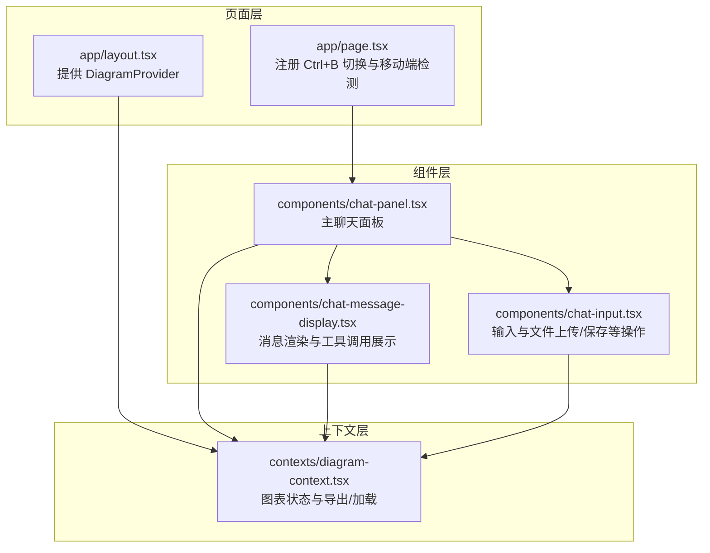
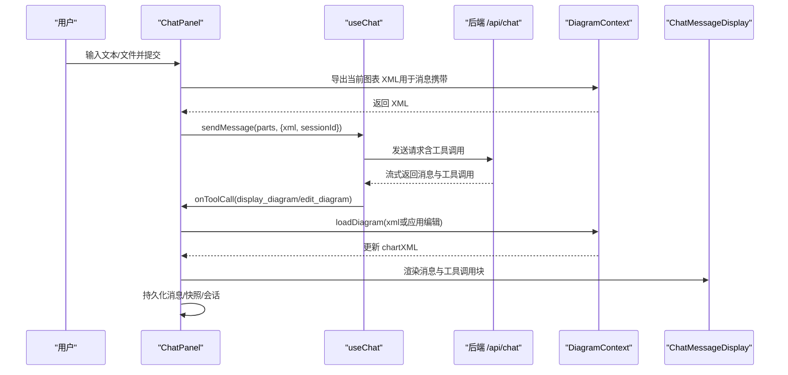
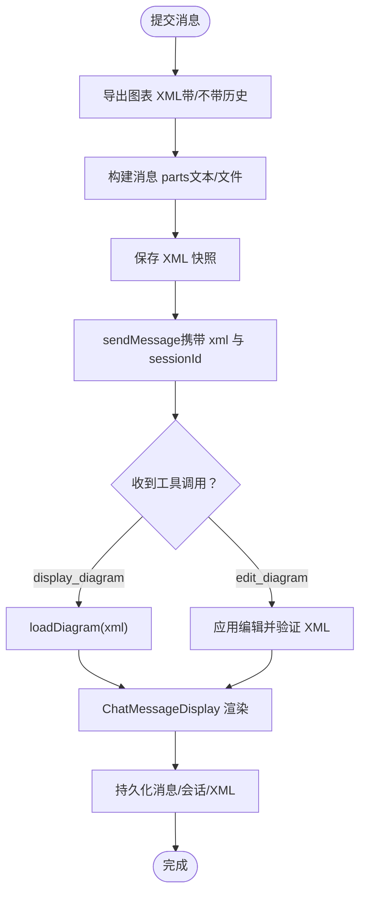
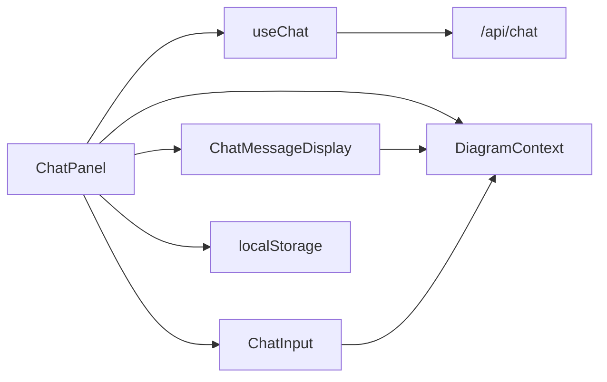

# 聊天面板

<cite>
**本文引用的文件**
- [components/chat-panel.tsx](file://components/chat-panel.tsx)
- [contexts/diagram-context.tsx](file://contexts/diagram-context.tsx)
- [components/chat-message-display.tsx](file://components/chat-message-display.tsx)
- [components/chat-input.tsx](file://components/chat-input.tsx)
- [app/layout.tsx](file://app/layout.tsx)
- [app/page.tsx](file://app/page.tsx)
- [app/globals.css](file://app/globals.css)
- [components/ui/resizable.tsx](file://components/ui/resizable.tsx)
</cite>

## 目录
1. [简介](#简介)
2. [项目结构](#项目结构)
3. [核心组件](#核心组件)
4. [架构总览](#架构总览)
5. [详细组件分析](#详细组件分析)
6. [依赖关系分析](#依赖关系分析)
7. [性能考量](#性能考量)
8. [故障排查指南](#故障排查指南)
9. [结论](#结论)
10. [附录](#附录)

## 简介
ChatPanel 是应用的主聊天界面容器，负责承载对话历史、输入区、工具调用展示与图表渲染，并通过 useChat Hook 与 AI 模型进行交互。它支持：
- 折叠/展开切换（桌面端通过 Ctrl+B 快捷键）
- 响应式布局（移动端与桌面端差异化 UI）
- 图表状态同步（通过 DiagramContext）
- 工具调用处理（display_diagram、edit_diagram）
- 消息持久化（localStorage）
- 错误处理与会话管理（包含访问码校验）

## 项目结构
ChatPanel 所在目录与周边组件的关系如下：
- 组件层：ChatPanel、ChatMessageDisplay、ChatInput
- 上下文层：DiagramContext（提供图表编辑器与 XML 同步）
- 页面层：根布局与页面入口（注册 DiagramProvider，绑定快捷键）

**图表来源**
- [app/layout.tsx](file://app/layout.tsx#L1-L127)
- [app/page.tsx](file://app/page.tsx#L31-L74)
- [components/chat-panel.tsx](file://components/chat-panel.tsx#L1-L120)
- [components/chat-message-display.tsx](file://components/chat-message-display.tsx#L1-L120)
- [components/chat-input.tsx](file://components/chat-input.tsx#L1-L120)
- [contexts/diagram-context.tsx](file://contexts/diagram-context.tsx#L1-L60)

**章节来源**
- [app/layout.tsx](file://app/layout.tsx#L1-L127)
- [app/page.tsx](file://app/page.tsx#L31-L74)

## 核心组件
- ChatPanel：主容器，负责 props 传递、useChat 集成、工具调用处理、消息持久化、折叠/展开逻辑、移动端适配。
- ChatMessageDisplay：渲染消息气泡、工具调用块、复制/反馈/重生成等交互。
- ChatInput：文本输入、文件拖拽/粘贴上传、发送按钮、清空对话、保存/历史/主题切换等。
- DiagramContext：提供图表加载/导出、历史记录、XML 同步、编辑器就绪状态等能力。

**章节来源**
- [components/chat-panel.tsx](file://components/chat-panel.tsx#L38-L64)
- [components/chat-message-display.tsx](file://components/chat-message-display.tsx#L100-L140)
- [components/chat-input.tsx](file://components/chat-input.tsx#L114-L160)
- [contexts/diagram-context.tsx](file://contexts/diagram-context.tsx#L1-L60)

## 架构总览
ChatPanel 通过 useChat 与后端 API 通信，使用工具调用机制驱动 DiagramContext 的图表加载与编辑。消息持久化与会话管理由 ChatPanel 内部维护；移动端与桌面端 UI 通过 isMobile 与 isVisible 控制。

**图表来源**
- [components/chat-panel.tsx](file://components/chat-panel.tsx#L129-L287)
- [contexts/diagram-context.tsx](file://contexts/diagram-context.tsx#L76-L134)
- [components/chat-message-display.tsx](file://components/chat-message-display.tsx#L175-L200)

## 详细组件分析

### ChatPanel 组件
- 视觉外观与布局
  - 头部包含应用图标、标题、关于链接、GitHub 链接、设置按钮、隐藏按钮（桌面端）。
  - 主体为消息显示区域，底部为输入区。
  - 支持折叠视图（桌面端仅显示“展开”按钮与竖向标签）。
  - 移动端时头部与输入区尺寸更紧凑，隐藏“隐藏”按钮。
- 行为与交互
  - 折叠/展开：桌面端通过 Ctrl+B 触发，由页面层监听键盘事件并调用面板切换。
  - 工具调用：onToolCall 分发 display_diagram 与 edit_diagram，前者直接加载 XML，后者基于当前 XML 应用替换并验证。
  - 消息持久化：本地存储 messages、XML 快照、会话 ID、图表 XML；卸载前也会写入。
  - 错误处理：捕获 useChat onError，区分访问码缺失并弹出设置对话框；其他错误以系统消息形式加入对话。
  - 会话管理：自动生成 sessionId 并持久化，清空对话时重置并清理本地存储。
- Props
  - isVisible: 当前是否可见（桌面折叠时为 false）
  - onToggleVisibility: 切换可见性的回调
  - drawioUi: "min" 或 "sketch"，用于切换主题
  - onToggleDrawioUi: 切换主题回调
  - isMobile: 是否移动端
  - onCloseProtectionChange?: 关闭保护开关变更回调
- 与 DiagramContext 的集成
  - 使用 useDiagram 获取 loadDiagram、handleExport、handleExportWithoutHistory、chartXML、clearDiagram、isDrawioReady 等。
  - 通过 onFetchChart 将图表 XML 注入消息请求体，确保 AI 可见当前图表状态。
- 与 ChatMessageDisplay/ChatInput 的协作
  - 将 messages、sessionId、回调（重生成、编辑消息）传给 ChatMessageDisplay。
  - 将输入状态、提交、文件选择、清空对话、历史开关等传给 ChatInput。

**图表来源**
- [components/chat-panel.tsx](file://components/chat-panel.tsx#L449-L506)
- [components/chat-panel.tsx](file://components/chat-panel.tsx#L518-L647)
- [contexts/diagram-context.tsx](file://contexts/diagram-context.tsx#L76-L134)

**章节来源**
- [components/chat-panel.tsx](file://components/chat-panel.tsx#L38-L64)
- [components/chat-panel.tsx](file://components/chat-panel.tsx#L129-L287)
- [components/chat-panel.tsx](file://components/chat-panel.tsx#L289-L447)
- [components/chat-panel.tsx](file://components/chat-panel.tsx#L449-L647)
- [components/chat-panel.tsx](file://components/chat-panel.tsx#L649-L800)

### ChatMessageDisplay 组件
- 功能要点
  - 渲染用户/系统/助手消息气泡，支持复制、反馈（点赞/点踩）、重生成。
  - 解析并渲染工具调用块（display_diagram/edit_diagram），支持展开/折叠查看输入 XML/编辑差异。
  - 自动滚动到底部，平滑滚动到最新消息。
  - 编辑用户消息（进入编辑态、保存并重新提交）。
- 与 DiagramContext 的集成
  - 在工具调用阶段调用 loadDiagram 进行图表更新，内部先做合法性转换与节点替换再加载。

**章节来源**
- [components/chat-message-display.tsx](file://components/chat-message-display.tsx#L1-L120)
- [components/chat-message-display.tsx](file://components/chat-message-display.tsx#L175-L200)
- [components/chat-message-display.tsx](file://components/chat-message-display.tsx#L345-L420)
- [components/chat-message-display.tsx](file://components/chat-message-display.tsx#L430-L746)

### ChatInput 组件
- 功能要点
  - 文本输入自动高度调整，支持 Ctrl+Enter 提交。
  - 文件拖拽/粘贴上传（限制数量与大小），预览与移除。
  - 清空对话、查看历史、保存图表、切换主题（最小/草图）。
  - 提交按钮禁用条件：正在流式/已提交或无输入。
- 无障碍与键盘支持
  - 文本域与按钮均提供 aria-label/aria-describedby。
  - 支持键盘快捷键（Ctrl/Cmd+Enter 提交）。

**章节来源**
- [components/chat-input.tsx](file://components/chat-input.tsx#L1-L120)
- [components/chat-input.tsx](file://components/chat-input.tsx#L153-L184)
- [components/chat-input.tsx](file://components/chat-input.tsx#L185-L273)
- [components/chat-input.tsx](file://components/chat-input.tsx#L274-L481)

### DiagramContext（图表上下文）
- 能力概览
  - chartXML：当前图表 XML
  - loadDiagram：加载 XML 至编辑器，支持跳过验证（内部可信场景）
  - handleExport/handleExportWithoutHistory：触发导出（含历史/不含历史）
  - resolverRef：导出回调解析器
  - diagramHistory：历史记录（SVG/XML）
  - isDrawioReady：编辑器就绪状态
  - saveDiagramToFile：保存为 drawio/png/svg
- 与 ChatPanel 的协作
  - ChatPanel 通过 onFetchChart 获取 XML，注入消息请求体。
  - ChatPanel 在工具调用中调用 loadDiagram 更新图表。

**章节来源**
- [contexts/diagram-context.tsx](file://contexts/diagram-context.tsx#L1-L60)
- [contexts/diagram-context.tsx](file://contexts/diagram-context.tsx#L76-L134)
- [contexts/diagram-context.tsx](file://contexts/diagram-context.tsx#L136-L219)

## 依赖关系分析
- 组件耦合
  - ChatPanel 依赖 useChat、DiagramContext、ChatMessageDisplay、ChatInput。
  - ChatMessageDisplay 依赖 DiagramContext 与工具调用解析。
  - ChatInput 依赖 DiagramContext 与保存/历史/主题切换。
- 外部依赖
  - useChat 与 AI Provider 通信，工具调用通过 onToolCall 回调处理。
  - localStorage 用于消息、XML 快照、会话 ID、图表 XML 的持久化。
  - 无障碍与键盘事件由页面层统一处理（Ctrl+B 切换）。

**图表来源**
- [components/chat-panel.tsx](file://components/chat-panel.tsx#L129-L287)
- [contexts/diagram-context.tsx](file://contexts/diagram-context.tsx#L1-L60)
- [components/chat-message-display.tsx](file://components/chat-message-display.tsx#L1-L120)
- [components/chat-input.tsx](file://components/chat-input.tsx#L1-L120)

**章节来源**
- [components/chat-panel.tsx](file://components/chat-panel.tsx#L129-L287)
- [contexts/diagram-context.tsx](file://contexts/diagram-context.tsx#L1-L60)

## 性能考量
- 工具调用与图表渲染
  - edit_diagram 优先使用缓存 chartXMLRef，避免导出延迟导致的旧状态问题。
  - display_diagram 在 ChatMessageDisplay 中先做合法性转换与节点替换，再加载，减少无效渲染。
- 消息持久化
  - 仅在恢复完成后写入 localStorage，避免频繁 IO。
  - 保存 XML 快照时转为数组并序列化，减少存储体积。
- 动画与滚动
  - 消息入场动画与平滑滚动提升体验，但需注意大量消息时的渲染开销。
- 会话与访问码
  - 访问码缺失错误单独处理，避免污染控制台日志。

[本节为通用指导，无需特定文件来源]

## 故障排查指南
- 访问码缺失
  - 现象：onError 捕获到“缺少或无效访问码”，UI 弹出设置对话框。
  - 处理：在设置中配置访问码后重试。
- 工具调用失败
  - display_diagram：返回验证错误时，将错误信息作为工具输出返回给模型，触发自动重试。
  - edit_diagram：编辑后 XML 不合法或导出异常时，返回错误输出并提示修复方式。
- 图表未更新
  - 确认 isDrawioReady 已就绪后再恢复图表 XML。
  - 检查 onFetchChart 是否超时（默认 10 秒）。
- 消息丢失
  - 确认 localStorage 存储键名正确且未被清理。
  - 卸载前持久化已在执行，若仍丢失，检查浏览器隐私模式或存储限制。

**章节来源**
- [components/chat-panel.tsx](file://components/chat-panel.tsx#L261-L287)
- [components/chat-panel.tsx](file://components/chat-panel.tsx#L141-L176)
- [components/chat-panel.tsx](file://components/chat-panel.tsx#L177-L259)
- [components/chat-panel.tsx](file://components/chat-panel.tsx#L328-L367)

## 结论
ChatPanel 通过清晰的职责划分与上下文集成，实现了从消息到图表的闭环交互。其响应式设计与快捷键支持提升了桌面端可用性，而完善的持久化与错误处理保障了用户体验。建议在集成时关注工具调用的幂等性与 XML 合法性校验，以及移动端的输入与滚动优化。

[本节为总结性内容，无需特定文件来源]

## 附录

### 使用示例与集成步骤
- 在根布局中包裹 DiagramProvider，确保全局可用图表上下文。
- 在页面中引入 ChatPanel，并传入：
  - isVisible、onToggleVisibility（桌面端 Ctrl+B 切换）
  - drawioUi、onToggleDrawioUi（主题切换）
  - isMobile（移动端检测）
- 页面层注册 Ctrl+B 快捷键，调用面板的 collapse/expand。
- ChatPanel 内部会自动：
  - 读取/保存消息与 XML 快照
  - 恢复图表 XML
  - 处理工具调用与错误

**章节来源**
- [app/layout.tsx](file://app/layout.tsx#L87-L120)
- [app/page.tsx](file://app/page.tsx#L31-L74)
- [components/chat-panel.tsx](file://components/chat-panel.tsx#L38-L64)

### 可访问性与键盘导航
- 文本输入与按钮均提供 aria-label，便于屏幕阅读器识别。
- 支持键盘快捷键：Ctrl/Cmd+Enter 提交；Ctrl/Cmd+B 折叠/展开。
- 用户消息气泡支持键盘激活（编辑/复制），提供明确的标题与提示。

**章节来源**
- [components/chat-input.tsx](file://components/chat-input.tsx#L300-L320)
- [components/chat-input.tsx](file://components/chat-input.tsx#L457-L476)
- [components/chat-message-display.tsx](file://components/chat-message-display.tsx#L520-L581)
- [app/page.tsx](file://app/page.tsx#L64-L74)

### 状态、动画与过渡效果
- 状态
  - messages：对话列表
  - status：提交/流式/就绪/错误
  - sessionId：会话标识
  - files：上传文件列表
  - showHistory/showSettingsDialog：对话与设置弹窗
- 动画与过渡
  - 面板展开：animate-slide-in-right
  - 消息入场：animate-message-in
  - 页面淡入：animate-fade-in
  - 滚动：平滑滚动到底部

**章节来源**
- [app/globals.css](file://app/globals.css#L188-L233)
- [components/chat-panel.tsx](file://components/chat-panel.tsx#L676-L757)
- [components/chat-message-display.tsx](file://components/chat-message-display.tsx#L201-L205)

### 样式定制与主题支持
- 主题变量
  - 使用 oklch 色彩空间定义明暗主题变量，支持通过 .dark 类切换。
  - 提供卡片阴影、渐变文字等通用样式类。
- 组件样式
  - ChatPanel 使用卡片背景、边框与柔和阴影，营造悬浮感。
  - ChatMessageDisplay 使用不同角色的圆角与配色，区分用户/系统/助手。
  - ChatInput 使用聚焦态环形高亮与禁用态透明度，提升可感知性。
- 响应式
  - 头部与输入区在移动端减小内边距与字号，保证触控友好。
  - ChatPanel 折叠视图在桌面端仅显示“展开”按钮与竖向标签。

**章节来源**
- [app/globals.css](file://app/globals.css#L48-L145)
- [app/globals.css](file://app/globals.css#L234-L260)
- [components/chat-panel.tsx](file://components/chat-panel.tsx#L676-L757)
- [components/chat-panel.tsx](file://components/chat-panel.tsx#L649-L673)
- [components/chat-input.tsx](file://components/chat-input.tsx#L300-L320)

### 与可调整面板的集成建议
- 若需要与可调整面板配合，可在 ChatPanel 外层使用 Resizable 组件，将 ChatPanel 设为右侧面板，实现拖拽调整宽度。
- 注意：ChatPanel 已内置响应式布局，若使用 Resizable，请确保在桌面端启用折叠/展开逻辑。

**章节来源**
- [components/ui/resizable.tsx](file://components/ui/resizable.tsx#L1-L56)
- [components/chat-panel.tsx](file://components/chat-panel.tsx#L649-L757)