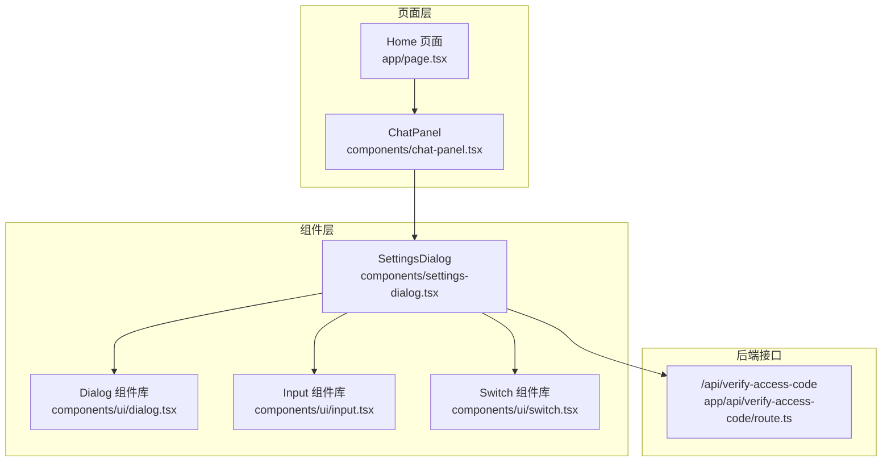
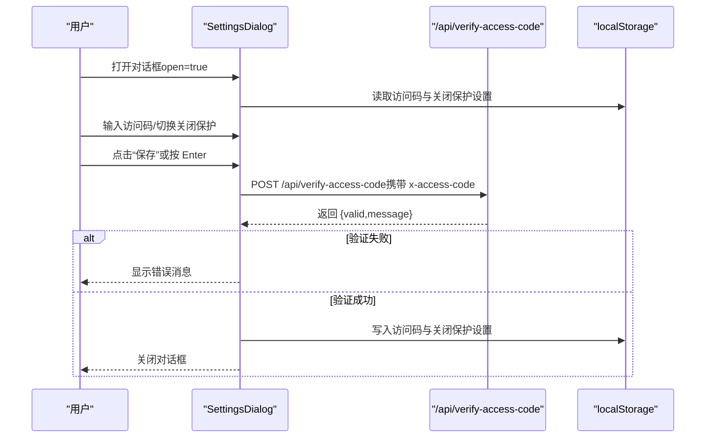
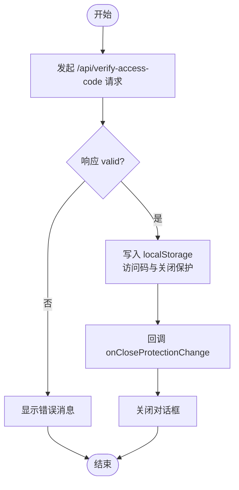
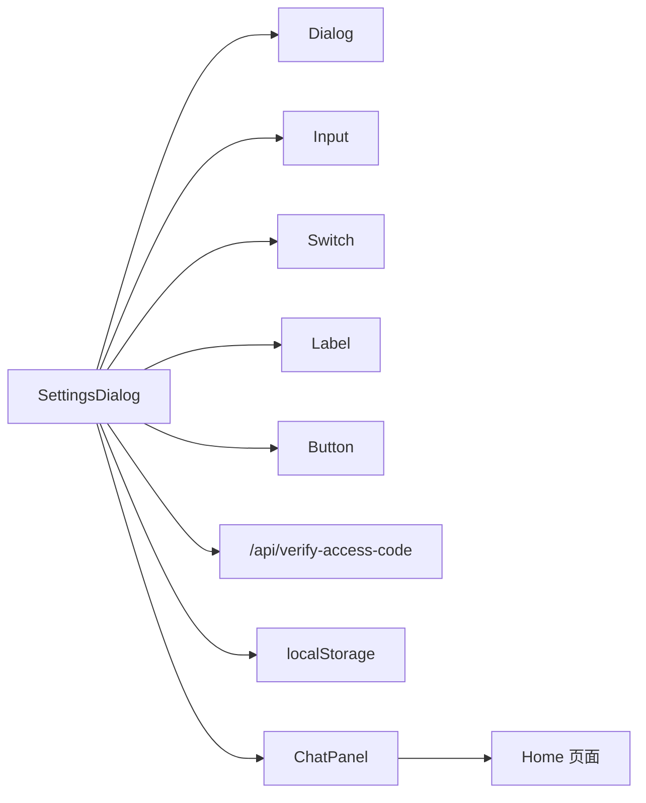

# 设置对话框

<cite>
**本文引用的文件**
- [settings-dialog.tsx](file://components/settings-dialog.tsx)
- [dialog.tsx](file://components/ui/dialog.tsx)
- [input.tsx](file://components/ui/input.tsx)
- [switch.tsx](file://components/ui/switch.tsx)
- [route.ts](file://app/api/verify-access-code/route.ts)
- [page.tsx](file://app/page.tsx)
- [chat-panel.tsx](file://components/chat-panel.tsx)
</cite>

## 目录
1. [简介](#简介)
2. [项目结构](#项目结构)
3. [核心组件](#核心组件)
4. [架构总览](#架构总览)
5. [详细组件分析](#详细组件分析)
6. [依赖关系分析](#依赖关系分析)
7. [性能考量](#性能考量)
8. [故障排查指南](#故障排查指南)
9. [结论](#结论)
10. [附录](#附录)

## 简介
本文件为 SettingsDialog 组件的详细 UI 文档，聚焦于其作为配置界面的视觉外观、行为与用户交互模式，涵盖访问码输入与“关闭保护”开关的使用；记录组件 props（open、onOpenChange、onCloseProtectionChange）及其作用；说明访问码验证流程（与 /api/verify-access-code 的交互与错误处理）；解释访问码与关闭保护设置的本地存储机制（localStorage）；描述表单提交处理逻辑（键盘快捷键 Enter 支持与加载状态管理）；提供使用示例与代码片段路径，展示如何在应用中集成与控制该对话框；给出可访问性合规建议（表单标签、错误消息与焦点管理）；并记录组件状态、动画与过渡效果（对话框打开/关闭动画）。

## 项目结构
SettingsDialog 位于 components 目录下，作为独立 UI 组件，内部组合了通用 UI 组件（Dialog、Input、Switch、Label、Button），并通过 fetch 调用后端接口进行访问码校验。页面层通过 ChatPanel 控制其显示与隐藏，并将“关闭保护”的变更回调传递给上层页面逻辑。

图表来源
- [settings-dialog.tsx](file://components/settings-dialog.tsx#L94-L155)
- [dialog.tsx](file://components/ui/dialog.tsx#L33-L73)
- [input.tsx](file://components/ui/input.tsx#L1-L22)
- [switch.tsx](file://components/ui/switch.tsx#L1-L32)
- [route.ts](file://app/api/verify-access-code/route.ts#L1-L33)
- [chat-panel.tsx](file://components/chat-panel.tsx#L808-L812)
- [page.tsx](file://app/page.tsx#L15-L28)

章节来源
- [settings-dialog.tsx](file://components/settings-dialog.tsx#L1-L156)
- [dialog.tsx](file://components/ui/dialog.tsx#L1-L136)
- [input.tsx](file://components/ui/input.tsx#L1-L22)
- [switch.tsx](file://components/ui/switch.tsx#L1-L32)
- [route.ts](file://app/api/verify-access-code/route.ts#L1-L33)
- [chat-panel.tsx](file://components/chat-panel.tsx#L808-L812)
- [page.tsx](file://app/page.tsx#L15-L28)

## 核心组件
- 组件名称：SettingsDialog
- 所属文件：components/settings-dialog.tsx
- 组件职责：
  - 提供访问码输入与“关闭保护”开关的配置入口
  - 在打开时从 localStorage 恢复访问码与关闭保护状态
  - 通过 /api/verify-access-code 验证访问码有效性
  - 成功验证后保存访问码与关闭保护设置到 localStorage，并通知上层关闭对话框
  - 支持键盘快捷键（Enter）提交，以及加载状态禁用按钮
  - 使用通用 UI 组件（Dialog、Input、Switch、Label、Button）构建

章节来源
- [settings-dialog.tsx](file://components/settings-dialog.tsx#L17-L31)
- [settings-dialog.tsx](file://components/settings-dialog.tsx#L36-L49)
- [settings-dialog.tsx](file://components/settings-dialog.tsx#L51-L85)
- [settings-dialog.tsx](file://components/settings-dialog.tsx#L87-L92)
- [settings-dialog.tsx](file://components/settings-dialog.tsx#L94-L155)

## 架构总览
SettingsDialog 作为受控对话框，依赖通用 Dialog 组件实现打开/关闭动画与遮罩层；内部包含访问码输入框与“关闭保护”开关；提交时调用后端接口进行访问码验证；验证成功后写入 localStorage 并回调上层关闭对话框。

图表来源
- [settings-dialog.tsx](file://components/settings-dialog.tsx#L51-L85)
- [route.ts](file://app/api/verify-access-code/route.ts#L1-L33)

章节来源
- [settings-dialog.tsx](file://components/settings-dialog.tsx#L51-L85)
- [route.ts](file://app/api/verify-access-code/route.ts#L1-L33)

## 详细组件分析

### 视觉外观与布局
- 对话框标题与描述：使用 DialogHeader、DialogTitle、DialogDescription 提供清晰的标题与说明
- 表单区域：
  - 访问码输入：使用 Input（密码类型），带占位符与自动完成关闭
  - 错误提示：当验证失败时显示错误文本
  - 关闭保护开关：使用 Switch，配合 Label 提供语义化标签
- 底部操作区：包含取消与保存按钮，保存按钮在验证过程中禁用

章节来源
- [settings-dialog.tsx](file://components/settings-dialog.tsx#L94-L155)
- [dialog.tsx](file://components/ui/dialog.tsx#L75-L122)
- [input.tsx](file://components/ui/input.tsx#L1-L22)
- [switch.tsx](file://components/ui/switch.tsx#L1-L32)

### 用户交互与行为
- 打开/关闭：
  - 受控属性 open 控制显示；onOpenChange 用于外部控制关闭
  - 打开时从 localStorage 恢复访问码与关闭保护状态
- 访问码输入：
  - 双向绑定访问码值；按下 Enter 触发保存逻辑
- 关闭保护：
  - 切换开关即更新状态；保存成功后通过 onCloseProtectionChange 回传给上层
- 加载状态：
  - 验证期间禁用保存按钮，按钮文案切换为“验证中…”

章节来源
- [settings-dialog.tsx](file://components/settings-dialog.tsx#L36-L49)
- [settings-dialog.tsx](file://components/settings-dialog.tsx#L87-L92)
- [settings-dialog.tsx](file://components/settings-dialog.tsx#L141-L151)

### Props 说明
- open: boolean
  - 作用：控制对话框是否显示
- onOpenChange: (open: boolean) => void
  - 作用：外部控制对话框关闭时的回调
- onCloseProtectionChange?: (enabled: boolean) => void
  - 作用：保存成功后通知上层“关闭保护”设置已更新

章节来源
- [settings-dialog.tsx](file://components/settings-dialog.tsx#L17-L21)

### 访问码验证流程与错误处理
- 请求发送：
  - 使用 fetch 向 /api/verify-access-code 发送 POST 请求，请求头携带 x-access-code
- 响应处理：
  - 若 valid=false，显示 message 或默认错误信息
  - 若 valid=true，继续保存设置
- 异常处理：
  - 捕获网络异常时显示“验证失败”
- 后端逻辑要点：
  - 当未配置 ACCESS_CODE_LIST 时，直接返回有效
  - 缺少请求头或不在允许列表内时返回 401 与错误信息

图表来源
- [settings-dialog.tsx](file://components/settings-dialog.tsx#L51-L85)
- [route.ts](file://app/api/verify-access-code/route.ts#L1-L33)

章节来源
- [settings-dialog.tsx](file://components/settings-dialog.tsx#L51-L85)
- [route.ts](file://app/api/verify-access-code/route.ts#L1-L33)

### 本地存储（localStorage）机制
- 存储键名：
  - 访问码：STORAGE_ACCESS_CODE_KEY
  - 关闭保护：STORAGE_CLOSE_PROTECTION_KEY
- 打开时恢复：
  - 从 localStorage 读取访问码；若不存在则为空字符串
  - 从 localStorage 读取关闭保护；若不存在则默认启用（true）
- 保存时写入：
  - 将访问码（去除首尾空白）与关闭保护布尔值写入 localStorage
  - 通过 onCloseProtectionChange 通知上层设置变化
- 页面层联动：
  - Home 页面在挂载后从 STORAGE_CLOSE_PROTECTION_KEY 恢复关闭保护状态，并在启用时注册 beforeunload 事件

章节来源
- [settings-dialog.tsx](file://components/settings-dialog.tsx#L23-L24)
- [settings-dialog.tsx](file://components/settings-dialog.tsx#L36-L49)
- [settings-dialog.tsx](file://components/settings-dialog.tsx#L73-L79)
- [page.tsx](file://app/page.tsx#L21-L38)
- [page.tsx](file://app/page.tsx#L76-L89)

### 表单提交处理逻辑
- Enter 键支持：监听键盘事件，按下 Enter 时阻止默认行为并触发保存
- 加载状态：验证期间禁用保存按钮，按钮文案切换为“验证中…”
- 取消：点击取消按钮直接关闭对话框

章节来源
- [settings-dialog.tsx](file://components/settings-dialog.tsx#L87-L92)
- [settings-dialog.tsx](file://components/settings-dialog.tsx#L141-L151)

### 动画与过渡效果
- 对话框打开/关闭动画：
  - 由通用 DialogOverlay 与 DialogContent 提供基于 Radix UI 的淡入/淡出与缩放动画
  - 动画类包含 fade-in/out 与 zoom-in/out，状态切换时自动播放
- 交互反馈：
  - 输入框与开关在获得焦点时有 ring 边框高亮
  - 错误状态通过 aria-invalid 与 destructivering 样式提示

章节来源
- [dialog.tsx](file://components/ui/dialog.tsx#L33-L73)
- [dialog.tsx](file://components/ui/dialog.tsx#L54-L71)
- [input.tsx](file://components/ui/input.tsx#L1-L22)
- [switch.tsx](file://components/ui/switch.tsx#L1-L32)

### 可访问性合规建议
- 表单标签与关联：
  - 使用 Label 与 Switch 的 id 关联，确保屏幕阅读器正确读取开关语义
- 错误消息：
  - 验证失败时显示错误文本，建议为错误容器添加 aria-live 或 role="alert" 以便读屏及时播报
- 焦点管理：
  - 打开对话框时，建议将焦点移动到第一个可交互元素（如访问码输入框）
  - 关闭对话框时，将焦点返回到触发源（例如打开对话框的按钮）
- 键盘可用性：
  - Enter 提交已支持；Tab 导航顺序合理，避免隐藏元素被聚焦
- 状态提示：
  - 加载状态禁用按钮，避免用户重复提交；按钮文案随状态变化，提供明确反馈

章节来源
- [settings-dialog.tsx](file://components/settings-dialog.tsx#L125-L139)
- [settings-dialog.tsx](file://components/settings-dialog.tsx#L141-L151)
- [input.tsx](file://components/ui/input.tsx#L1-L22)
- [switch.tsx](file://components/ui/switch.tsx#L1-L32)

### 使用示例与代码片段路径
- 在 ChatPanel 中控制显示与隐藏，并接收关闭保护变更：
  - 示例路径：[在 ChatPanel 中使用 SettingsDialog](file://components/chat-panel.tsx#L808-L812)
- 在 Home 页面中根据 localStorage 初始化关闭保护，并注册 beforeunload：
  - 示例路径：[在 Home 页面中初始化关闭保护](file://app/page.tsx#L21-L38)、[注册 beforeunload](file://app/page.tsx#L76-L89)

章节来源
- [chat-panel.tsx](file://components/chat-panel.tsx#L808-L812)
- [page.tsx](file://app/page.tsx#L21-L38)
- [page.tsx](file://app/page.tsx#L76-L89)

## 依赖关系分析
- 组件依赖：
  - Dialog（通用对话框）、Input（输入框）、Switch（开关）、Label（标签）、Button（按钮）
- 外部接口：
  - /api/verify-access-code：访问码验证
- 本地存储：
  - localStorage：访问码与关闭保护设置持久化
- 上层联动：
  - onCloseProtectionChange：将关闭保护设置回传给上层页面逻辑

图表来源
- [settings-dialog.tsx](file://components/settings-dialog.tsx#L94-L155)
- [dialog.tsx](file://components/ui/dialog.tsx#L33-L73)
- [input.tsx](file://components/ui/input.tsx#L1-L22)
- [switch.tsx](file://components/ui/switch.tsx#L1-L32)
- [route.ts](file://app/api/verify-access-code/route.ts#L1-L33)
- [chat-panel.tsx](file://components/chat-panel.tsx#L808-L812)
- [page.tsx](file://app/page.tsx#L15-L28)

章节来源
- [settings-dialog.tsx](file://components/settings-dialog.tsx#L94-L155)
- [dialog.tsx](file://components/ui/dialog.tsx#L33-L73)
- [input.tsx](file://components/ui/input.tsx#L1-L22)
- [switch.tsx](file://components/ui/switch.tsx#L1-L32)
- [route.ts](file://app/api/verify-access-code/route.ts#L1-L33)
- [chat-panel.tsx](file://components/chat-panel.tsx#L808-L812)
- [page.tsx](file://app/page.tsx#L15-L28)

## 性能考量
- 网络请求：
  - 验证访问码为轻量级请求，建议避免频繁重复提交；当前通过按钮禁用与 Enter 快捷键限制重复触发
- 渲染：
  - 对话框内容简单，无复杂计算；动画由 CSS 过渡驱动，性能开销低
- 存储：
  - localStorage 读写为 O(1)，对性能影响可忽略

## 故障排查指南
- 访问码验证失败：
  - 检查后端环境变量 ACCESS_CODE_LIST 是否正确配置
  - 确认请求头 x-access-code 是否正确传递
  - 查看返回的错误消息，确认是否缺少请求头或不在允许列表
- 无法保存设置：
  - 确认访问码验证通过后再保存
  - 检查 localStorage 是否可用（部分隐私模式可能禁用）
- 对话框无法关闭：
  - 确认 onOpenChange 已正确绑定到外部状态
  - 确认 onCloseProtectionChange 是否在上层页面中生效

章节来源
- [route.ts](file://app/api/verify-access-code/route.ts#L1-L33)
- [settings-dialog.tsx](file://components/settings-dialog.tsx#L51-L85)
- [settings-dialog.tsx](file://components/settings-dialog.tsx#L73-L79)

## 结论
SettingsDialog 以简洁直观的方式提供了访问码与“关闭保护”的配置能力，结合通用 UI 组件与 Radix UI 动画，实现了良好的用户体验。通过与后端接口与 localStorage 的协作，确保配置的正确性与持久化。建议在实际使用中关注可访问性细节（标签、错误播报、焦点管理）与上层联动（关闭保护的全局生效）。

## 附录
- 组件状态与生命周期要点：
  - 打开时从 localStorage 恢复访问码与关闭保护
  - 验证失败时保留对话框并显示错误
  - 验证成功后写入 localStorage 并关闭对话框
- 动画与过渡：
  - 对话框打开/关闭具有淡入/淡出与缩放动画
  - 输入与开关具备焦点高亮与错误态样式