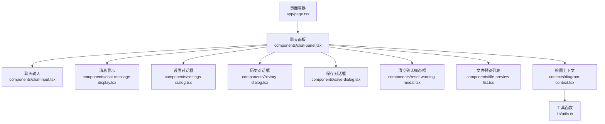
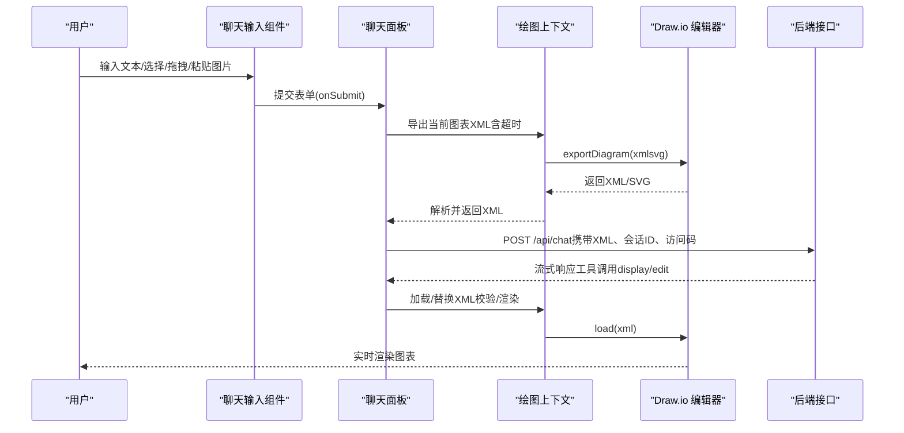
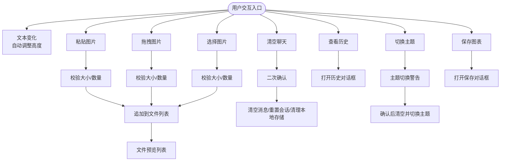
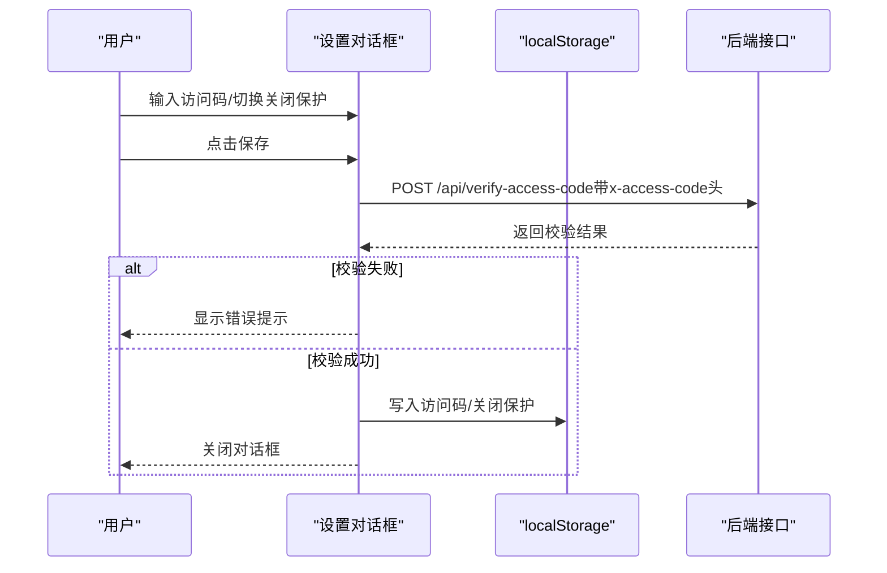
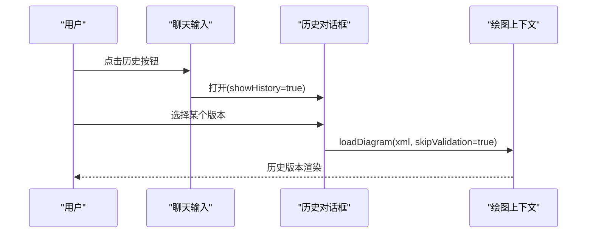
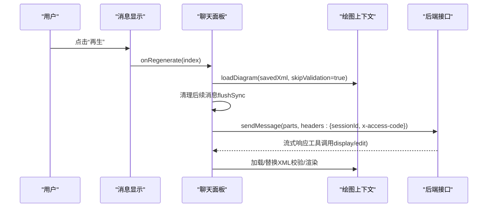
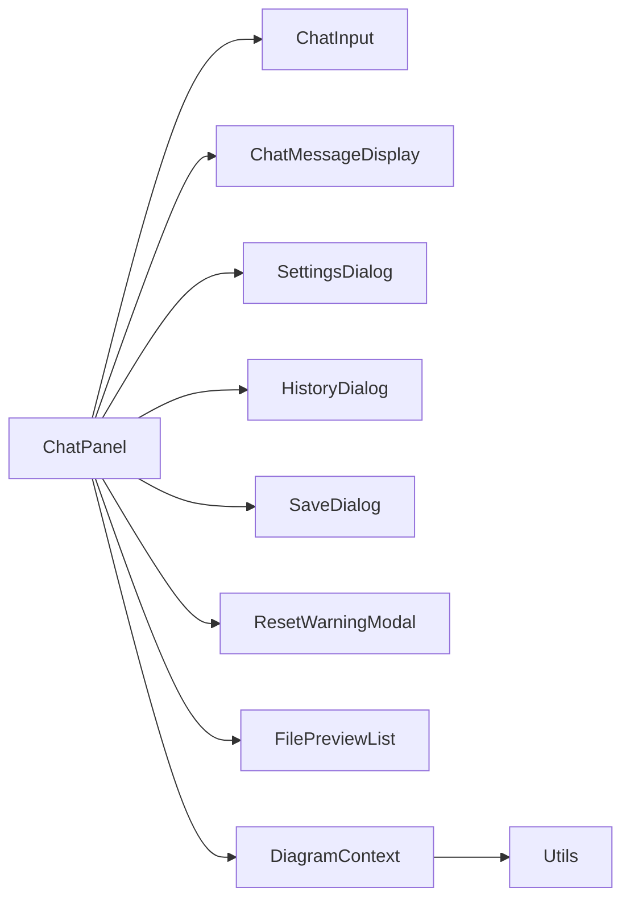

# UI交互

<cite>
**本文引用的文件**
- [components/chat-input.tsx](file://components/chat-input.tsx)
- [components/settings-dialog.tsx](file://components/settings-dialog.tsx)
- [components/history-dialog.tsx](file://components/history-dialog.tsx)
- [components/chat-panel.tsx](file://components/chat-panel.tsx)
- [components/chat-message-display.tsx](file://components/chat-message-display.tsx)
- [components/reset-warning-modal.tsx](file://components/reset-warning-modal.tsx)
- [components/save-dialog.tsx](file://components/save-dialog.tsx)
- [components/file-preview-list.tsx](file://components/file-preview-list.tsx)
- [contexts/diagram-context.tsx](file://contexts/diagram-context.tsx)
- [app/page.tsx](file://app/page.tsx)
- [lib/utils.ts](file://lib/utils.ts)
</cite>

## 目录
1. [简介](#简介)
2. [项目结构](#项目结构)
3. [核心组件](#核心组件)
4. [架构总览](#架构总览)
5. [详细组件分析](#详细组件分析)
6. [依赖关系分析](#依赖关系分析)
7. [性能考量](#性能考量)
8. [故障排查指南](#故障排查指南)
9. [结论](#结论)
10. [附录](#附录)

## 简介
本文件聚焦 next-ai-draw-io 的 UI 交互设计与实现，围绕用户与应用的核心交互流程进行系统化梳理。重点覆盖：
- 聊天输入组件（chat-input.tsx）：文本输入、文件上传（粘贴/拖拽/选择）、清空聊天记录、主题切换、保存与历史查看等。
- 设置对话框（settings-dialog.tsx）：访问码校验与本地持久化、关闭保护开关与浏览器离开确认。
- 历史对话框（history-dialog.tsx）：历史版本预览与恢复。
- 快捷键与增强体验：Ctrl+B 切换聊天面板、拖拽上传、粘贴图片、文件预览与放大查看。
- 再生（regenerate）与编辑（edit）交互：基于 XML 快照恢复历史状态并重新发送消息。

## 项目结构
应用采用“页面容器 + 上下文 + 组件”的分层组织方式：
- 页面容器负责布局与全局快捷键、主题切换、离开保护等。
- 上下文（DiagramContext）统一管理 draw.io 编辑器状态、导出/加载、历史快照与保存。
- UI 组件通过 props 和上下文协作，完成消息渲染、工具调用、文件处理与设置管理。

图表来源
- [app/page.tsx](file://app/page.tsx#L91-L161)
- [components/chat-panel.tsx](file://components/chat-panel.tsx#L1-L120)
- [components/chat-input.tsx](file://components/chat-input.tsx#L1-L120)
- [components/chat-message-display.tsx](file://components/chat-message-display.tsx#L1-L120)
- [components/settings-dialog.tsx](file://components/settings-dialog.tsx#L1-L80)
- [components/history-dialog.tsx](file://components/history-dialog.tsx#L1-L60)
- [components/save-dialog.tsx](file://components/save-dialog.tsx#L1-L70)
- [components/reset-warning-modal.tsx](file://components/reset-warning-modal.tsx#L1-L49)
- [components/file-preview-list.tsx](file://components/file-preview-list.tsx#L1-L60)
- [contexts/diagram-context.tsx](file://contexts/diagram-context.tsx#L1-L60)
- [lib/utils.ts](file://lib/utils.ts#L1-L60)

章节来源
- [app/page.tsx](file://app/page.tsx#L91-L161)
- [components/chat-panel.tsx](file://components/chat-panel.tsx#L1-L120)

## 核心组件
- 聊天输入组件（chat-input.tsx）
  - 文本输入：自动调整高度、禁用态控制、回车提交（支持 Ctrl/Cmd+Enter）。
  - 文件上传：粘贴图片、拖拽上传、文件选择、预览与移除；带大小与数量限制。
  - 清空聊天：二次确认模态框，清除消息、重置会话并清理本地存储。
  - 历史查看：打开历史对话框，展示历史版本缩略图。
  - 主题切换：最小化/草稿主题互切，带警告提示与确认后清空并切换。
  - 保存：弹出保存对话框，支持导出为 drawio/png/svg。
- 设置对话框（settings-dialog.tsx）
  - 访问码：输入后向服务端验证，成功后写入 localStorage；错误时显示提示。
  - 关闭保护：开启后离开页面前弹出确认，防止误关。
  - 本地存储键：访问码与关闭保护分别持久化。
- 历史对话框（history-dialog.tsx）
  - 触发：来自聊天输入组件的“历史”按钮或快捷键。
  - 展示：网格预览历史版本（SVG 缩略图），点击选中后可确认恢复。
- 快捷键与增强体验
  - Ctrl+B（Mac: Cmd+B）：在桌面端切换聊天面板显隐。
  - 拖拽上传：拖拽图片到输入区域即可添加附件。
  - 粘贴上传：剪贴板中的图片自动识别并转为文件加入队列。
  - 文件预览：图片文件生成预览，支持点击放大查看。
- 再生与编辑
  - 再生：定位到对应用户消息，恢复其保存的 XML 快照，清理后续消息，重新发送。
  - 编辑：修改最后一条用户消息文本，恢复其 XML 快照，清理后续消息，重新发送。

章节来源
- [components/chat-input.tsx](file://components/chat-input.tsx#L1-L120)
- [components/settings-dialog.tsx](file://components/settings-dialog.tsx#L1-L80)
- [components/history-dialog.tsx](file://components/history-dialog.tsx#L1-L60)
- [app/page.tsx](file://app/page.tsx#L64-L74)
- [components/chat-panel.tsx](file://components/chat-panel.tsx#L518-L647)

## 架构总览
下图展示了从用户交互到后端请求与绘图更新的端到端流程。

图表来源
- [components/chat-panel.tsx](file://components/chat-panel.tsx#L449-L506)
- [contexts/diagram-context.tsx](file://contexts/diagram-context.tsx#L57-L134)
- [components/chat-input.tsx](file://components/chat-input.tsx#L280-L320)

## 详细组件分析

### 聊天输入组件（chat-input.tsx）
- 功能要点
  - 文本输入与高度自适应：根据内容高度动态调整，最大高度限制。
  - 键盘交互：支持 Ctrl/Cmd+Enter 提交；禁用态阻止重复提交。
  - 文件上传
    - 粘贴：从剪贴板提取图片，生成临时文件名并加入队列。
    - 拖拽：拖拽图片到输入区域，高亮反馈与批量加入。
    - 选择：隐藏文件输入框，多选图片并校验大小与数量。
    - 预览：使用文件预览列表组件生成缩略图，支持移除与放大查看。
  - 清空聊天：通过二次确认模态框执行清空，同时重置会话ID并清理本地存储。
  - 历史查看：打开历史对话框，展示历史版本缩略图。
  - 主题切换：最小化/草稿主题互切，带警告提示与确认后清空并切换。
  - 保存：弹出保存对话框，支持导出为 drawio/png/svg。
- 数据与状态
  - files：当前上传的图片文件列表。
  - showHistory：是否显示历史对话框。
  - showThemeWarning/showSaveDialog/showClearDialog：各对话框的显隐控制。
  - drawioUi：当前主题（min/sketch）。
- 与上下文/对话框的协作
  - 与聊天面板：通过 props 接收状态与回调，驱动提交、清空、历史开关与主题切换。
  - 与绘图上下文：通过 useDiagram 获取导出/加载能力，用于保存与历史恢复。
  - 与历史对话框：传递 showHistory/onToggleHistory 控制历史面板。
  - 与保存对话框：传递 showSaveDialog/onOpenChange/onSave 回调。
  - 与清空确认模态框：传递 showClearDialog/onOpenChange/onClear 回调。

图表来源
- [components/chat-input.tsx](file://components/chat-input.tsx#L170-L273)
- [components/file-preview-list.tsx](file://components/file-preview-list.tsx#L1-L60)
- [components/reset-warning-modal.tsx](file://components/reset-warning-modal.tsx#L1-L49)
- [components/history-dialog.tsx](file://components/history-dialog.tsx#L1-L60)
- [components/save-dialog.tsx](file://components/save-dialog.tsx#L1-L70)

章节来源
- [components/chat-input.tsx](file://components/chat-input.tsx#L1-L120)
- [components/file-preview-list.tsx](file://components/file-preview-list.tsx#L1-L60)
- [components/reset-warning-modal.tsx](file://components/reset-warning-modal.tsx#L1-L49)
- [components/history-dialog.tsx](file://components/history-dialog.tsx#L1-L60)
- [components/save-dialog.tsx](file://components/save-dialog.tsx#L1-L70)

### 设置对话框（settings-dialog.tsx）
- 功能要点
  - 访问码：输入后向 /api/verify-access-code 发起校验，成功后写入 localStorage。
  - 关闭保护：开启后在 beforeunload 事件中弹出确认，防止误关。
  - 本地存储键：STORAGE_ACCESS_CODE_KEY、STORAGE_CLOSE_PROTECTION_KEY。
- 用户体验
  - Enter 提交保存，避免多余点击。
  - 错误信息即时反馈，便于修正。

图表来源
- [components/settings-dialog.tsx](file://components/settings-dialog.tsx#L51-L85)
- [app/page.tsx](file://app/page.tsx#L31-L38)

章节来源
- [components/settings-dialog.tsx](file://components/settings-dialog.tsx#L1-L80)
- [app/page.tsx](file://app/page.tsx#L31-L38)

### 历史对话框（history-dialog.tsx）
- 触发机制
  - 来自聊天输入组件的“历史”按钮或快捷键。
- 内容展示
  - 以网格形式展示历史版本的 SVG 缩略图，点击选中后可确认恢复。
- 恢复逻辑
  - 选中某版本后，直接调用绘图上下文的加载方法，跳过校验（信任历史快照）。

图表来源
- [components/history-dialog.tsx](file://components/history-dialog.tsx#L33-L40)
- [contexts/diagram-context.tsx](file://contexts/diagram-context.tsx#L76-L100)

章节来源
- [components/history-dialog.tsx](file://components/history-dialog.tsx#L1-L60)
- [contexts/diagram-context.tsx](file://contexts/diagram-context.tsx#L76-L100)

### 快捷键与增强体验
- Ctrl+B（Mac: Cmd+B）：在桌面端切换聊天面板显隐。
- 拖拽上传：拖拽图片到输入区域，自动识别并加入队列。
- 粘贴上传：剪贴板中的图片自动识别并转为文件加入队列。
- 文件预览：图片文件生成缩略图，支持点击放大查看。

章节来源
- [app/page.tsx](file://app/page.tsx#L64-L74)
- [components/chat-input.tsx](file://components/chat-input.tsx#L243-L273)
- [components/chat-input.tsx](file://components/chat-input.tsx#L185-L217)
- [components/file-preview-list.tsx](file://components/file-preview-list.tsx#L1-L60)

### 再生（regenerate）与编辑（edit）
- 再生流程
  - 定位到对应用户消息，读取其保存的 XML 快照。
  - 通过绘图上下文恢复到该快照（跳过校验）。
  - 清理后续消息（flushSync 同步更新），重新发送用户消息。
  - 请求携带 sessionId 与访问码。
- 编辑流程
  - 修改最后一条用户消息文本，读取其保存的 XML 快照。
  - 恢复快照并清理后续消息，重新发送新文本。
  - 请求携带 sessionId 与访问码。

图表来源
- [components/chat-panel.tsx](file://components/chat-panel.tsx#L518-L585)
- [contexts/diagram-context.tsx](file://contexts/diagram-context.tsx#L76-L100)

章节来源
- [components/chat-panel.tsx](file://components/chat-panel.tsx#L518-L647)

## 依赖关系分析
- 组件耦合
  - ChatPanel 作为中枢，依赖 ChatInput、ChatMessageDisplay、SettingsDialog、HistoryDialog、SaveDialog、ResetWarning、FilePreviewList 与 DiagramContext。
  - ChatInput 依赖 FilePreviewList、HistoryDialog、SaveDialog、ResetWarning 与 DiagramContext。
  - DiagramContext 为所有绘图相关操作提供统一入口，被多个组件共享。
- 外部依赖
  - 绘图：react-drawio（嵌入式 draw.io 编辑器）。
  - 工具：lib/utils.ts 提供 XML 格式化、合法性校验、节点替换、压缩解压等。
  - 本地存储：localStorage 用于访问码、关闭保护、消息、XML 快照、会话ID、绘图XML等。
- 可能的循环依赖
  - 当前文件间未见明显循环导入；组件通过 props 与上下文通信，避免了直接互相引用。

图表来源
- [components/chat-panel.tsx](file://components/chat-panel.tsx#L1-L120)
- [contexts/diagram-context.tsx](file://contexts/diagram-context.tsx#L1-L60)
- [lib/utils.ts](file://lib/utils.ts#L1-L60)

章节来源
- [components/chat-panel.tsx](file://components/chat-panel.tsx#L1-L120)
- [contexts/diagram-context.tsx](file://contexts/diagram-context.tsx#L1-L60)

## 性能考量
- 图表导出与渲染
  - 使用 Promise.race 控制导出超时，避免长时间阻塞。
  - 优先使用缓存的 chartXML 引用，减少不必要的导出。
- XML 处理
  - 工具函数对 XML 进行格式化与合法性校验，降低渲染失败概率。
  - 节点替换采用 DOM 操作，保证结构一致性。
- 本地存储
  - 将消息、XML 快照、会话ID、绘图XML等持久化，减少刷新丢失。
  - beforeunload 时同步保存，提升可靠性。
- UI 交互
  - 文本域高度自适应，避免滚动抖动。
  - 文件预览使用对象 URL 并及时释放，防止内存泄漏。

[本节为通用指导，不直接分析具体文件]

## 故障排查指南
- 访问码无效
  - 现象：聊天面板报错并弹出设置对话框。
  - 处理：在设置中重新输入有效访问码并保存。
  - 参考路径：[components/chat-panel.tsx](file://components/chat-panel.tsx#L261-L283)、[components/settings-dialog.tsx](file://components/settings-dialog.tsx#L51-L85)
- 图片上传失败
  - 现象：提示超出大小或数量限制。
  - 处理：检查文件大小与数量，单个不超过 2MB，最多 5 张。
  - 参考路径：[components/chat-input.tsx](file://components/chat-input.tsx#L57-L86)
- 图片粘贴/拖拽无响应
  - 现象：剪贴板或拖拽未触发。
  - 处理：确保浏览器允许剪贴板权限；在受支持的浏览器中尝试拖拽。
  - 参考路径：[components/chat-input.tsx](file://components/chat-input.tsx#L185-L217)、[components/chat-input.tsx](file://components/chat-input.tsx#L243-L273)
- 再生/编辑无效
  - 现象：点击再生或编辑无反应。
  - 处理：确认当前状态非 streaming/submitted；检查是否有对应 XML 快照。
  - 参考路径：[components/chat-panel.tsx](file://components/chat-panel.tsx#L518-L647)
- 主题切换导致数据丢失
  - 现象：切换主题后清空未保存更改。
  - 处理：切换前确认保存；必要时先导出。
  - 参考路径：[components/chat-input.tsx](file://components/chat-input.tsx#L341-L393)、[app/page.tsx](file://app/page.tsx#L141-L156)

章节来源
- [components/chat-panel.tsx](file://components/chat-panel.tsx#L261-L283)
- [components/settings-dialog.tsx](file://components/settings-dialog.tsx#L51-L85)
- [components/chat-input.tsx](file://components/chat-input.tsx#L57-L86)
- [components/chat-panel.tsx](file://components/chat-panel.tsx#L518-L647)
- [app/page.tsx](file://app/page.tsx#L141-L156)

## 结论
本项目通过清晰的组件边界与上下文抽象，实现了流畅的聊天与绘图交互体验。聊天输入组件承担了用户输入、文件处理与状态控制的核心职责；聊天面板协调工具调用与绘图上下文，保障 XML 的正确性与渲染稳定性；设置与历史对话框提供了便捷的偏好管理与版本恢复能力。配合快捷键与拖拽上传等增强体验，整体交互自然高效。

[本节为总结性内容，不直接分析具体文件]

## 附录
- 本地存储键
  - 访问码：STORAGE_ACCESS_CODE_KEY
  - 关闭保护：STORAGE_CLOSE_PROTECTION_KEY
  - 消息：STORAGE_MESSAGES_KEY
  - XML 快照：STORAGE_XML_SNAPSHOTS_KEY
  - 会话ID：STORAGE_SESSION_ID_KEY
  - 绘图XML：STORAGE_DIAGRAM_XML_KEY
  - 绘图主题：drawio-theme
- 常用工具函数
  - XML 格式化、合法性校验、节点替换、压缩解压、提取 XML 等。

章节来源
- [components/settings-dialog.tsx](file://components/settings-dialog.tsx#L23-L25)
- [components/chat-panel.tsx](file://components/chat-panel.tsx#L28-L33)
- [app/page.tsx](file://app/page.tsx#L21-L28)
- [lib/utils.ts](file://lib/utils.ts#L1-L60)