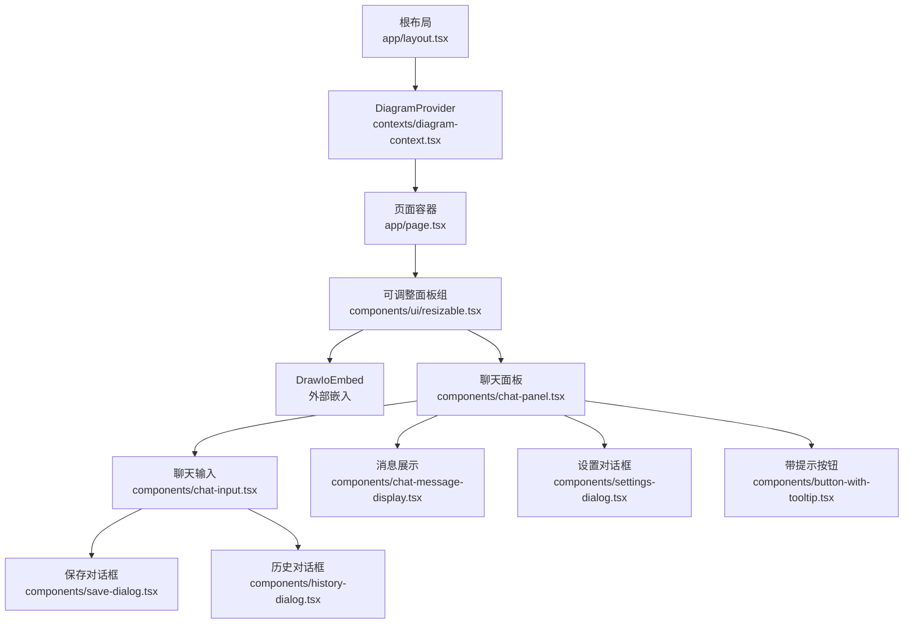
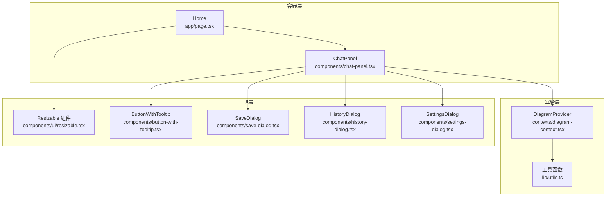
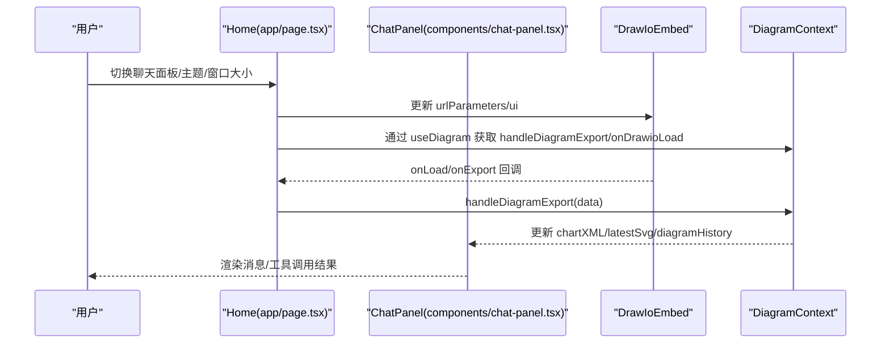
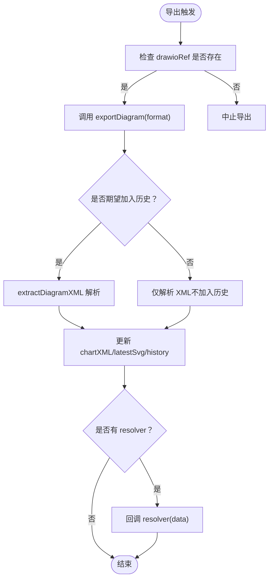
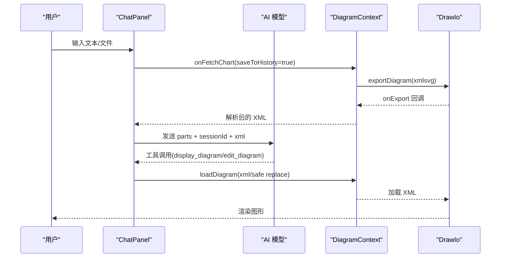
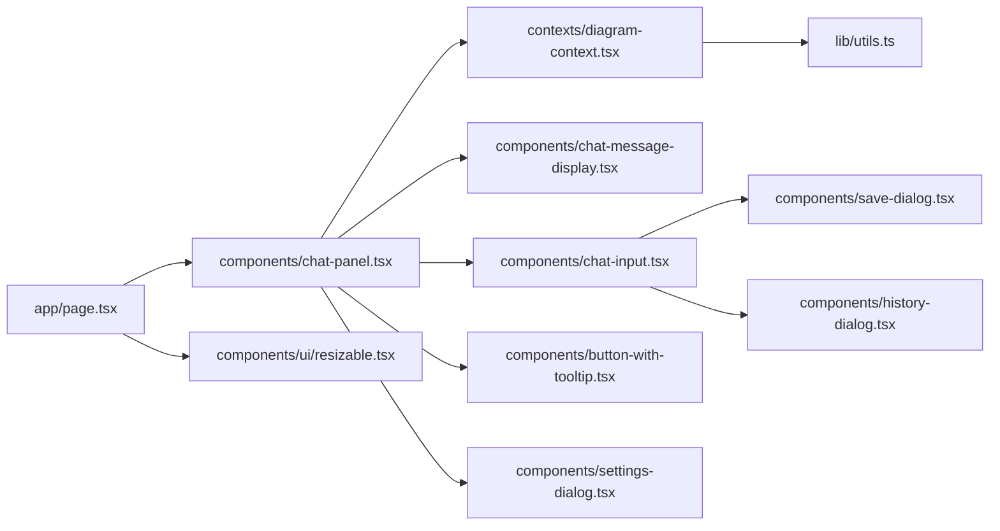

# 前端架构

<cite>
**本文引用的文件**
- [app/page.tsx](file://app/page.tsx)
- [app/layout.tsx](file://app/layout.tsx)
- [contexts/diagram-context.tsx](file://contexts/diagram-context.tsx)
- [components/chat-panel.tsx](file://components/chat-panel.tsx)
- [components/chat-input.tsx](file://components/chat-input.tsx)
- [components/chat-message-display.tsx](file://components/chat-message-display.tsx)
- [components/settings-dialog.tsx](file://components/settings-dialog.tsx)
- [components/save-dialog.tsx](file://components/save-dialog.tsx)
- [components/history-dialog.tsx](file://components/history-dialog.tsx)
- [components/button-with-tooltip.tsx](file://components/button-with-tooltip.tsx)
- [components/ui/resizable.tsx](file://components/ui/resizable.tsx)
- [components/ui/button.tsx](file://components/ui/button.tsx)
- [lib/utils.ts](file://lib/utils.ts)
</cite>

## 目录
1. [引言](#引言)
2. [项目结构](#项目结构)
3. [核心组件](#核心组件)
4. [架构总览](#架构总览)
5. [详细组件分析](#详细组件分析)
6. [依赖关系分析](#依赖关系分析)
7. [性能考量](#性能考量)
8. [故障排查指南](#故障排查指南)
9. [结论](#结论)
10. [附录](#附录)

## 引言
本文件面向 next-ai-draw-io 的前端架构，采用 MVC 风格的组件化设计，重点说明：
- Page 容器组件如何协调 ChatPanel 与 DrawIoEmbed 的交互；
- React Context（DiagramContext）在状态管理中的作用，包括 chartXML、diagramHistory 等状态的定义与更新机制；
- 组件树结构：从根页面到聊天输入、消息显示、设置对话框等子组件的层级关系；
- 组件通信模式：通过 Context 分发状态变更函数；
- UI 组件库（如 button-with-tooltip、save-dialog）的复用设计原则；
- 组件依赖关系图与状态流示意图；
- 响应式设计实现与可访问性考虑。

## 项目结构
系统采用 Next.js 应用结构，根布局注入 DiagramProvider，为全应用提供统一的状态上下文；页面级组件负责容器编排，业务组件负责具体功能，UI 组件库提供通用控件。

图表来源
- [app/layout.tsx](file://app/layout.tsx#L116-L120)
- [contexts/diagram-context.tsx](file://contexts/diagram-context.tsx#L238-L259)
- [app/page.tsx](file://app/page.tsx#L91-L161)
- [components/ui/resizable.tsx](file://components/ui/resizable.tsx#L1-L29)
- [components/chat-panel.tsx](file://components/chat-panel.tsx#L47-L81)
- [components/chat-input.tsx](file://components/chat-input.tsx#L130-L144)
- [components/chat-message-display.tsx](file://components/chat-message-display.tsx#L109-L116)
- [components/settings-dialog.tsx](file://components/settings-dialog.tsx#L23-L31)
- [components/save-dialog.tsx](file://components/save-dialog.tsx#L21-L31)
- [components/history-dialog.tsx](file://components/history-dialog.tsx#L16-L24)
- [components/button-with-tooltip.tsx](file://components/button-with-tooltip.tsx#L11-L18)

章节来源
- [app/layout.tsx](file://app/layout.tsx#L116-L120)
- [app/page.tsx](file://app/page.tsx#L91-L161)

## 核心组件
- 页面容器（Home）
  - 负责响应式布局与面板折叠/展开控制，协调 DrawIo 与 ChatPanel 的尺寸与可见性。
  - 关键职责：监听窗口尺寸变化、处理 Ctrl+B 快捷键切换聊天面板、主题切换、关闭保护等。
- DiagramContext（DiagramProvider/useDiagram）
  - 提供全局状态：chartXML、latestSvg、diagramHistory、isDrawioReady；
  - 提供操作：handleExport、handleExportWithoutHistory、loadDiagram、clearDiagram、saveDiagramToFile、handleDiagramExport、onDrawioLoad；
  - 负责与 DrawIoEmbed 的事件交互（导出、加载、就绪）。
- ChatPanel
  - 负责与 AI 对话集成（@ai-sdk/react），处理工具调用（display_diagram、edit_diagram），维护消息会话、XML 快照、错误处理与自动重试。
- ChatInput
  - 负责输入表单、文件拖拽/粘贴上传、快捷键提交、保存与历史对话框触发。
- ChatMessageDisplay
  - 负责渲染消息、工具调用结果、复制反馈、编辑用户消息、生成历史预览。
- 设置/保存/历史对话框
  - SettingsDialog：访问码校验与关闭保护设置；
  - SaveDialog：导出格式选择与下载；
  - HistoryDialog：历史版本预览与恢复。
- UI 组件库
  - button-with-tooltip 复用 Button 与 Tooltip，统一交互与可访问性；
  - resizable 提供可调整面板组与面板，支持移动端/桌面端不同方向。

章节来源
- [app/page.tsx](file://app/page.tsx#L14-L161)
- [contexts/diagram-context.tsx](file://contexts/diagram-context.tsx#L1-L268)
- [components/chat-panel.tsx](file://components/chat-panel.tsx#L1-L816)
- [components/chat-input.tsx](file://components/chat-input.tsx#L1-L481)
- [components/chat-message-display.tsx](file://components/chat-message-display.tsx#L1-L747)
- [components/settings-dialog.tsx](file://components/settings-dialog.tsx#L1-L156)
- [components/save-dialog.tsx](file://components/save-dialog.tsx#L1-L129)
- [components/history-dialog.tsx](file://components/history-dialog.tsx#L1-L113)
- [components/button-with-tooltip.tsx](file://components/button-with-tooltip.tsx#L1-L37)
- [components/ui/resizable.tsx](file://components/ui/resizable.tsx#L1-L29)

## 架构总览
系统采用“容器-业务-UI”三层：
- 容器层：app/page.tsx 与 ChatPanel 负责布局与交互编排；
- 业务层：DiagramContext 管理状态与与 DrawIo 的数据流；
- UI 层：通用组件（button、dialog、resizable、tooltip 等）提供一致的交互体验。

图表来源
- [app/page.tsx](file://app/page.tsx#L91-L161)
- [components/chat-panel.tsx](file://components/chat-panel.tsx#L47-L81)
- [contexts/diagram-context.tsx](file://contexts/diagram-context.tsx#L238-L259)
- [lib/utils.ts](file://lib/utils.ts#L1-L711)
- [components/ui/resizable.tsx](file://components/ui/resizable.tsx#L1-L29)
- [components/button-with-tooltip.tsx](file://components/button-with-tooltip.tsx#L11-L18)
- [components/save-dialog.tsx](file://components/save-dialog.tsx#L21-L31)
- [components/history-dialog.tsx](file://components/history-dialog.tsx#L16-L24)
- [components/settings-dialog.tsx](file://components/settings-dialog.tsx#L23-L31)

## 详细组件分析

### Page 容器与 ChatPanel 协同
- 布局与响应式
  - 使用 ResizablePanelGroup 在桌面端水平分割，在移动端垂直分割；根据窗口宽度动态切换方向。
  - 支持聊天面板折叠/展开，并同步更新可见性状态与键盘快捷键（Ctrl+B）。
- 与 DrawIo 的交互
  - 通过 useDiagram 获取 drawioRef、handleDiagramExport、onDrawioLoad；
  - 将主题（ui=min/sketch）持久化到 localStorage 并在渲染时生效；
  - 通过 urlParameters 控制 DrawIo 的加载参数（如 spin、libraries、noExitBtn 等）。
- 与 ChatPanel 的通信
  - 传递 isVisible/onToggleVisibility、drawioUi/onToggleDrawioUi、isMobile、onCloseProtectionChange；
  - ChatPanel 内部通过 useDiagram 读取/写入全局状态，实现双向联动。

图表来源
- [app/page.tsx](file://app/page.tsx#L91-L161)
- [contexts/diagram-context.tsx](file://contexts/diagram-context.tsx#L101-L134)
- [components/chat-panel.tsx](file://components/chat-panel.tsx#L47-L81)

章节来源
- [app/page.tsx](file://app/page.tsx#L14-L161)
- [components/ui/resizable.tsx](file://components/ui/resizable.tsx#L1-L29)

### DiagramContext 状态管理
- 状态定义
  - chartXML：当前 Draw.io XML；
  - latestSvg：最近一次导出的 SVG；
  - diagramHistory：历史版本列表（svg/xml）；
  - isDrawioReady：Draw.io 加载完成标志；
  - refs：drawioRef、resolverRef、saveResolverRef（用于导出回调与保存流程）。
- 主要方法
  - handleExport/handleExportWithoutHistory：触发 DrawIo 导出，区分是否加入历史；
  - handleDiagramExport：解析导出数据，更新 chartXML、latestSvg、history；
  - loadDiagram：加载 XML 至 DrawIo，支持跳过验证（内部模板）；
  - saveDiagramToFile：按格式导出并下载（drawio/png/svg），记录日志；
  - clearDiagram：清空画布与历史；
  - onDrawioLoad：标记 Draw.io 就绪。
- 错误与边界
  - 导出超时（Promise.race）；
  - XML 结构校验（validateMxCellStructure）；
  - 保存前格式映射与数据 URL 处理。

图表来源
- [contexts/diagram-context.tsx](file://contexts/diagram-context.tsx#L57-L134)
- [lib/utils.ts](file://lib/utils.ts#L645-L711)

章节来源
- [contexts/diagram-context.tsx](file://contexts/diagram-context.tsx#L1-L268)
- [lib/utils.ts](file://lib/utils.ts#L508-L711)

### ChatPanel 与工具链
- 工具调用
  - display_diagram：将模型返回的 XML 加载至 DrawIo，进行结构校验与替换（replaceNodes）；
  - edit_diagram：基于当前 chartXML 或导出 XML 执行多轮替换（replaceXMLParts），再加载至 DrawIo；
- 消息与快照
  - 以消息索引为键保存 XML 快照，支持重新生成与编辑消息；
  - 使用 flushSync 同步更新消息列表，避免竞态；
- 错误处理
  - 访问码缺失时弹出设置对话框；
  - 工具调用失败时通过 addToolOutput 返回错误信息；
  - 自动重试条件：sendAutomaticallyWhen（工具结果可用后自动提交）。
- 本地存储
  - 恢复消息、XML 快照、会话 ID、已保存的 diagram XML；
  - 页面卸载前持久化当前状态。

图表来源
- [components/chat-panel.tsx](file://components/chat-panel.tsx#L65-L88)
- [contexts/diagram-context.tsx](file://contexts/diagram-context.tsx#L76-L99)
- [lib/utils.ts](file://lib/utils.ts#L109-L207)

章节来源
- [components/chat-panel.tsx](file://components/chat-panel.tsx#L1-L816)
- [lib/utils.ts](file://lib/utils.ts#L109-L207)

### ChatMessageDisplay 渲染与交互
- 渲染策略
  - 文本消息：ReactMarkdown 渲染，支持代码块；
  - 文件消息：图片预览；
  - 工具调用：以卡片形式展示输入/输出，支持展开/折叠；
- 用户交互
  - 复制消息、点赞/踩反馈（记录到服务端）；
  - 编辑最后一条用户消息（Esc 取消，Ctrl/Cmd+Enter 提交）；
  - 重新生成最后一条助手消息。
- XML 处理
  - convertToLegalXml：修复不完整 XML；
  - replaceNodes：在当前 XML 中替换节点；
  - validateMxCellStructure：结构校验。

章节来源
- [components/chat-message-display.tsx](file://components/chat-message-display.tsx#L1-L747)
- [lib/utils.ts](file://lib/utils.ts#L56-L107)

### ChatInput 表单与对话框
- 表单能力
  - 文本输入自适应高度、快捷键提交（Ctrl/Cmd+Enter）、禁用状态；
  - 文件拖拽/粘贴上传（限制数量与大小），预览与移除；
  - 历史对话框、保存对话框、主题切换警告、清空会话。
- 保存与历史
  - SaveDialog：格式选择（drawio/png/svg），默认文件名；
  - HistoryDialog：预览历史版本并恢复；
  - SettingsDialog：访问码校验与关闭保护设置。

章节来源
- [components/chat-input.tsx](file://components/chat-input.tsx#L1-L481)
- [components/save-dialog.tsx](file://components/save-dialog.tsx#L1-L129)
- [components/history-dialog.tsx](file://components/history-dialog.tsx#L1-L113)
- [components/settings-dialog.tsx](file://components/settings-dialog.tsx#L1-L156)

### UI 组件库复用设计
- ButtonWithTooltip
  - 复用 Button 与 Tooltip，统一样式与交互；
  - 通过 TooltipProvider 包裹，确保全局提示行为一致。
- Resizable
  - 适配移动端/桌面端不同方向，支持折叠与最小/最大尺寸约束；
  - 与 ChatPanel 的可见性状态联动。
- Button
  - 通过变体与尺寸系统，统一按钮风格与可访问性属性。

章节来源
- [components/button-with-tooltip.tsx](file://components/button-with-tooltip.tsx#L11-L37)
- [components/ui/resizable.tsx](file://components/ui/resizable.tsx#L1-L29)
- [components/ui/button.tsx](file://components/ui/button.tsx#L1-L60)

## 依赖关系分析

图表来源
- [app/page.tsx](file://app/page.tsx#L91-L161)
- [components/chat-panel.tsx](file://components/chat-panel.tsx#L47-L81)
- [contexts/diagram-context.tsx](file://contexts/diagram-context.tsx#L238-L259)
- [lib/utils.ts](file://lib/utils.ts#L1-L711)

章节来源
- [app/page.tsx](file://app/page.tsx#L91-L161)
- [components/chat-panel.tsx](file://components/chat-panel.tsx#L47-L81)
- [contexts/diagram-context.tsx](file://contexts/diagram-context.tsx#L238-L259)

## 性能考量
- 导出与解析
  - 使用 Promise.race 控制导出超时，避免阻塞 UI；
  - 仅在需要时触发导出（如发送消息前），减少不必要的 XML 解析。
- XML 处理
  - replaceXMLParts 采用多策略匹配（精确、去空白、子串、字符频率、按 id/value 定位），提升容错与稳定性；
  - validateMxCellStructure 一次性遍历收集错误，优先返回关键问题，减少重复计算。
- 本地存储
  - 仅在满足阈值（非空且长度足够）时保存 diagram XML，避免频繁写入；
  - 卸载前批量持久化，降低丢失风险。
- 响应式与渲染
  - 移动端/桌面端布局切换，减少不必要的重渲染；
  - 滚动区域与动画过渡，保证流畅体验。

[本节为通用指导，无需特定文件引用]

## 故障排查指南
- 访问码错误
  - 现象：聊天面板抛出访问码错误；
  - 处理：打开设置对话框输入访问码并验证，验证通过后保存至 localStorage。
- 导出超时
  - 现象：发送消息或获取 XML 时超时；
  - 处理：检查网络与 AI 服务状态，稍后重试；必要时清理浏览器缓存。
- XML 结构错误
  - 现象：工具调用返回结构错误；
  - 处理：根据错误提示修正 XML（唯一 ID、父引用、边连接、mxPoint 结构）。
- 无法保存/下载
  - 现象：保存对话框点击无效或下载失败；
  - 处理：确认 Draw.io 已就绪，检查浏览器下载权限与扩展程序拦截。

章节来源
- [components/settings-dialog.tsx](file://components/settings-dialog.tsx#L51-L85)
- [components/chat-panel.tsx](file://components/chat-panel.tsx#L261-L287)
- [lib/utils.ts](file://lib/utils.ts#L508-L644)
- [contexts/diagram-context.tsx](file://contexts/diagram-context.tsx#L101-L134)

## 结论
该系统以容器-业务-UI 分层清晰、职责明确的方式组织前端架构。Page 容器通过 Resizable 面板协调 DrawIo 与 ChatPanel；DiagramContext 作为单一真相源，集中管理 XML 与历史状态；ChatPanel 与工具链紧密协作，结合本地存储与错误处理，提供稳定可靠的 AI 图形生成体验。UI 组件库统一了交互与可访问性，响应式布局提升了跨设备体验。

[本节为总结，无需特定文件引用]

## 附录

### 组件通信模式示例路径
- 通过 Context 分发状态变更函数
  - [contexts/diagram-context.tsx](file://contexts/diagram-context.tsx#L238-L259)
- ChatPanel 与 DiagramContext 的绑定
  - [components/chat-panel.tsx](file://components/chat-panel.tsx#L47-L63)
- ChatInput 触发保存与历史
  - [components/chat-input.tsx](file://components/chat-input.tsx#L422-L431)
  - [components/history-dialog.tsx](file://components/history-dialog.tsx#L33-L39)
  - [components/save-dialog.tsx](file://components/save-dialog.tsx#L55-L65)

### 响应式设计与可访问性要点
- 响应式
  - 桌面端水平布局，移动端垂直布局；聊天面板可折叠；
  - 文本域自适应高度，拖拽/粘贴上传增强可用性。
- 可访问性
  - 按钮与图标均提供 aria-label/标题提示；
  - 键盘快捷键（Ctrl+B、Ctrl/Cmd+Enter）提升效率；
  - 对话框使用语义化标签与焦点管理。

章节来源
- [app/page.tsx](file://app/page.tsx#L91-L161)
- [components/chat-input.tsx](file://components/chat-input.tsx#L456-L478)
- [components/button-with-tooltip.tsx](file://components/button-with-tooltip.tsx#L24-L36)