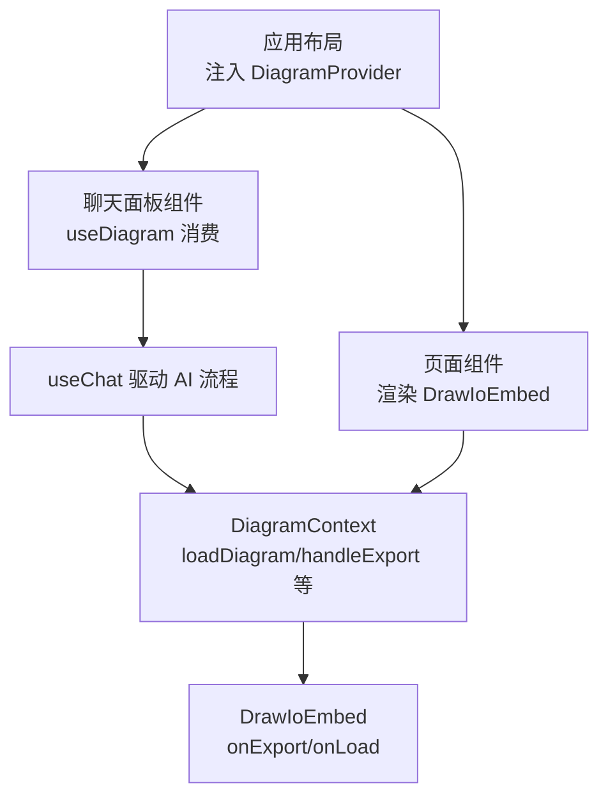
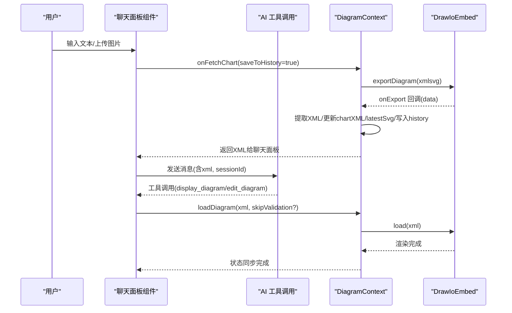
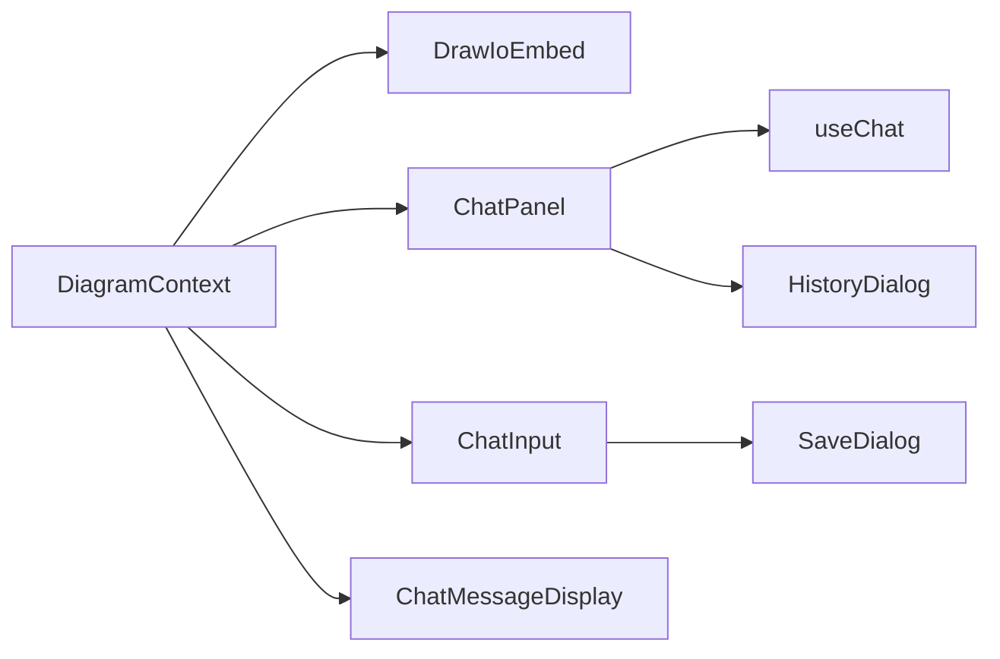

# 状态管理

<cite>
**本文引用的文件**
- [contexts/diagram-context.tsx](file://contexts/diagram-context.tsx)
- [app/layout.tsx](file://app/layout.tsx)
- [app/page.tsx](file://app/page.tsx)
- [components/chat-panel.tsx](file://components/chat-panel.tsx)
- [components/chat-input.tsx](file://components/chat-input.tsx)
- [components/chat-message-display.tsx](file://components/chat-message-display.tsx)
- [components/history-dialog.tsx](file://components/history-dialog.tsx)
- [components/save-dialog.tsx](file://components/save-dialog.tsx)
- [lib/utils.ts](file://lib/utils.ts)
</cite>

## 目录
1. [简介](#简介)
2. [项目结构](#项目结构)
3. [核心组件](#核心组件)
4. [架构总览](#架构总览)
5. [详细组件分析](#详细组件分析)
6. [依赖关系分析](#依赖关系分析)
7. [性能考量](#性能考量)
8. [故障排查指南](#故障排查指南)
9. [结论](#结论)

## 简介
本文件围绕 next-ai-draw-io 的全局状态管理展开，重点解释 React Context（DiagramContext）在应用中的核心地位与职责边界，以及与 ChatPanel、ChatInput、ChatMessageDisplay、DrawIoEmbed 等组件的协作方式。文档覆盖以下关键主题：
- DiagramContextType 接口定义的关键状态与方法：chartXML、latestSvg、diagramHistory、loadDiagram、handleExport、handleExportWithoutHistory、clearDiagram、saveDiagramToFile、handleDiagramExport、onDrawioLoad、isDrawioReady、resolverRef、drawioRef。
- Context Provider 在应用中的注入位置与生命周期。
- ChatPanel 如何消费 DiagramContext 并通过 useChat 驱动 AI 流程，同时利用 localStorage 实现消息、XML 快照与会话 ID 的持久化与恢复。
- 通过 useRef 解决闭包问题，确保 onToolCall 回调中能获取最新 chartXML。
- 状态变更流程示例：用户输入触发 AI 响应后，XML 状态的更新与同步。

## 项目结构
应用采用“布局层注入 Provider + 功能组件消费”的分层组织方式：
- 应用根布局在根布局文件中注入 DiagramProvider，使 DiagramContext 对整个应用可用。
- 页面组件负责渲染 DrawIoEmbed，并通过 ref 与 DiagramContext 的回调建立双向通信。
- 聊天面板组件通过 useDiagram 消费上下文，驱动 AI 工具调用与编辑流程，并持久化本地状态。

图表来源
- [app/layout.tsx](file://app/layout.tsx#L119-L120)
- [app/page.tsx](file://app/page.tsx#L91-L118)
- [contexts/diagram-context.tsx](file://contexts/diagram-context.tsx#L238-L258)

章节来源
- [app/layout.tsx](file://app/layout.tsx#L119-L120)
- [app/page.tsx](file://app/page.tsx#L91-L118)

## 核心组件
本节聚焦 DiagramContextType 接口与 DiagramProvider 的实现要点，帮助理解全局状态的来源与职责划分。

- 关键状态
  - chartXML：当前绘图的 XML 字符串，作为全局可读取的“事实来源”。
  - latestSvg：最近一次导出的 SVG 数据，用于历史预览与下载。
  - diagramHistory：按时间顺序保存的历史版本（包含 SVG 缩略图与对应 XML），支持回溯。
  - isDrawioReady：Draw.io 编辑器就绪标志，用于控制恢复与保存时机。
- 关键方法
  - loadDiagram(xml, skipValidation?)：加载并校验 XML，更新 chartXML，并通过 drawioRef.load 注入到编辑器；skipValidation 可跳过校验（内部模板或受信任数据）。
  - handleExport()/handleExportWithoutHistory()：触发编辑器导出（xmlsvg），前者会写入历史，后者仅获取数据不写入历史。
  - handleDiagramExport(data)：处理编辑器导出回调，提取 XML、更新 chartXML 与 latestSvg，并根据 expectHistoryExportRef 决定是否写入历史；同时解析保存回调（saveResolverRef）以支持文件下载。
  - saveDiagramToFile(filename, format, sessionId?)：根据格式映射到编辑器导出格式，设置保存回调，触发导出并在回调中生成文件并下载；同时记录 Langfuse 日志。
  - clearDiagram()：清空当前绘图、历史与 SVG，恢复为空白模板。
  - onDrawioLoad()：标记编辑器已加载，避免重复初始化。
- 引用与回调
  - resolverRef：用于 onFetchChart 场景下的异步解析器，确保 export 完成后返回 XML。
  - drawioRef：指向 DrawIoEmbed 的 ref，承载 load 与 export 调用。

章节来源
- [contexts/diagram-context.tsx](file://contexts/diagram-context.tsx#L9-L27)
- [contexts/diagram-context.tsx](file://contexts/diagram-context.tsx#L31-L258)

## 架构总览
DiagramContext 作为全局状态中枢，向上游组件提供统一的数据与操作入口，向下与 DrawIoEmbed 交互完成 XML 的读取与写入。聊天面板通过 useChat 驱动工具调用，借助 DiagramContext 的方法实现“显示/编辑”绘图。

图表来源
- [components/chat-panel.tsx](file://components/chat-panel.tsx#L47-L89)
- [contexts/diagram-context.tsx](file://contexts/diagram-context.tsx#L57-L134)
- [app/page.tsx](file://app/page.tsx#L107-L118)

## 详细组件分析

### DiagramContext 与 Provider
- 注入位置：根布局文件中通过 DiagramProvider 包裹 children，确保全局可用。
- 生命周期：onDrawioLoad 仅首次设置 isDrawioReady，避免重复初始化；handleDiagramExport 中根据 expectHistoryExportRef 控制是否写入历史。
- 导出与保存：saveDiagramToFile 将格式映射为编辑器导出格式，设置 saveResolverRef，在回调中生成文件并下载；同时调用日志接口记录保存事件。

章节来源
- [app/layout.tsx](file://app/layout.tsx#L119-L120)
- [contexts/diagram-context.tsx](file://contexts/diagram-context.tsx#L31-L258)

### ChatPanel：状态持久化与工具调用
- 持久化策略
  - 消息列表：localStorage 存储 messages，挂载时恢复，变更时同步保存。
  - XML 快照：以 Map<number, string> 形式按消息索引保存 XML，便于重发/重生成。
  - 会话 ID：localStorage 存储 sessionId，用于追踪与日志上报。
  - 绘图 XML：当 isDrawioReady 且未恢复过时，从 localStorage 恢复并加载到编辑器；随后在 canSaveDiagram 允许后保存。
  - 页面卸载：beforeunload 事件中统一持久化 messages、XML 快照、当前 diagram XML 与 sessionId。
- 闭包问题与 useRef
  - chartXMLRef：跟踪最新 chartXML，避免 onToolCall 回调中捕获旧值；edit_diagram 优先使用缓存 XML，必要时再走导出。
  - stopRef：在 onToolCall 中访问 stop 函数，避免 stale closure。
- 工具调用
  - display_diagram：直接调用 loadDiagram，若校验失败则向模型返回错误输出并自动重试。
  - edit_diagram：先尝试从 chartXMLRef 获取当前 XML，再基于替换规则生成新 XML，最后再次 loadDiagram 校验并加载。

章节来源
- [components/chat-panel.tsx](file://components/chat-panel.tsx#L28-L33)
- [components/chat-panel.tsx](file://components/chat-panel.tsx#L105-L112)
- [components/chat-panel.tsx](file://components/chat-panel.tsx#L114-L124)
- [components/chat-panel.tsx](file://components/chat-panel.tsx#L120-L124)
- [components/chat-panel.tsx](file://components/chat-panel.tsx#L126-L128)
- [components/chat-panel.tsx](file://components/chat-panel.tsx#L141-L260)
- [components/chat-panel.tsx](file://components/chat-panel.tsx#L181-L207)
- [components/chat-panel.tsx](file://components/chat-panel.tsx#L300-L367)
- [components/chat-panel.tsx](file://components/chat-panel.tsx#L369-L413)
- [components/chat-panel.tsx](file://components/chat-panel.tsx#L420-L447)

### ChatInput：保存与历史对话
- 保存：打开保存对话框后，调用 DiagramContext.saveDiagramToFile，支持 drawio、png、svg 三种格式。
- 历史：打开历史对话框后，可选择历史版本并恢复到编辑器。

章节来源
- [components/chat-input.tsx](file://components/chat-input.tsx#L140-L146)
- [components/history-dialog.tsx](file://components/history-dialog.tsx#L21-L39)
- [components/save-dialog.tsx](file://components/save-dialog.tsx#L33-L67)

### ChatMessageDisplay：工具调用渲染与 XML 合法化
- 渲染工具调用结果，支持展开/折叠与复制。
- 在 display_diagram 场景中，先进行 XML 合法化与节点替换，再调用 loadDiagram 加载。

章节来源
- [components/chat-message-display.tsx](file://components/chat-message-display.tsx#L175-L199)

### DrawIoEmbed：与 DiagramContext 的交互
- 通过 ref 持有 drawioRef，onExport 回调交由 handleDiagramExport 处理，onLoad 回调交由 onDrawioLoad 处理。
- urlParameters 控制主题、库加载、退出按钮等行为。

章节来源
- [app/page.tsx](file://app/page.tsx#L107-L118)
- [contexts/diagram-context.tsx](file://contexts/diagram-context.tsx#L238-L258)

### 工具函数与 XML 处理
- validateMxCellStructure：校验 mxCell 结构合法性，包括重复 ID、孤儿节点、无效父引用、边连接等。
- extractDiagramXML：从编辑器导出的 xmlsvg 数据中提取原始 XML。
- replaceNodes：将新节点替换到现有 XML 的根节点下，保证基础节点存在。
- replaceXMLParts：基于多策略（精确匹配、去空白匹配、子串匹配、字符频率匹配、按 id/value 匹配）定位并替换 XML 片段。

章节来源
- [lib/utils.ts](file://lib/utils.ts#L508-L643)
- [lib/utils.ts](file://lib/utils.ts#L645-L710)
- [lib/utils.ts](file://lib/utils.ts#L109-L207)
- [lib/utils.ts](file://lib/utils.ts#L240-L506)

## 依赖关系分析
- 组件耦合
  - ChatPanel 依赖 DiagramContext 的方法与状态，同时依赖 useChat 驱动工具调用。
  - ChatInput 依赖 DiagramContext 的 diagramHistory 与 saveDiagramToFile。
  - ChatMessageDisplay 依赖 DiagramContext 的 chartXML 与 loadDiagram。
  - DrawIoEmbed 依赖 DiagramContext 的 drawioRef、handleDiagramExport、onDrawioLoad。
- 外部依赖
  - react-drawio：提供嵌入式编辑器能力。
  - @ai-sdk/react：提供 useChat 与工具调用流。
  - localStorage：用于消息、XML 快照、会话 ID 与绘图 XML 的持久化。

图表来源
- [contexts/diagram-context.tsx](file://contexts/diagram-context.tsx#L238-L258)
- [app/page.tsx](file://app/page.tsx#L107-L118)
- [components/chat-panel.tsx](file://components/chat-panel.tsx#L47-L89)
- [components/chat-input.tsx](file://components/chat-input.tsx#L140-L146)
- [components/history-dialog.tsx](file://components/history-dialog.tsx#L21-L39)
- [components/save-dialog.tsx](file://components/save-dialog.tsx#L33-L67)

## 性能考量
- 导出与历史写入：handleExport 与 handleDiagramExport 仅在 expectHistoryExportRef 为真时写入历史，避免频繁写入造成抖动。
- 保存回调与下载：saveDiagramToFile 设置 saveResolverRef，在回调中生成 Blob 或 data URL 后延迟 revokeObjectURL，减少内存占用。
- 闭包优化：通过 chartXMLRef、stopRef、messagesRef 等 useRef 避免回调中捕获旧值，降低重渲染成本。
- 恢复时机：isDrawioReady 与 canSaveDiagram 双重保护，确保恢复与保存在合适时机执行。

## 故障排查指南
- 无法导出或导出超时
  - 现象：onFetchChart 超时抛错。
  - 排查：确认 isDrawioReady 为真；检查 resolverRef 是否被正确设置；查看 handleDiagramExport 是否被调用。
- XML 校验失败
  - 现象：display_diagram/edit_diagram 返回错误。
  - 排查：使用 validateMxCellStructure 检查重复 ID、孤儿节点、无效父引用、边连接等问题；必要时使用 replaceXMLParts 的多种匹配策略修复。
- 保存失败或下载异常
  - 现象：saveDiagramToFile 无法生成文件。
  - 排查：确认 saveResolverRef 是否设置；检查 handleDiagramExport 的回调路径；验证格式映射与 content 提取逻辑。
- 会话 ID 丢失
  - 现象：刷新后无法关联历史。
  - 排查：确认 localStorage 中 STORAGE_SESSION_ID_KEY 是否存在；检查 beforeunload 持久化逻辑。

章节来源
- [components/chat-panel.tsx](file://components/chat-panel.tsx#L47-L89)
- [lib/utils.ts](file://lib/utils.ts#L508-L643)
- [lib/utils.ts](file://lib/utils.ts#L645-L710)

## 结论
DiagramContext 在 next-ai-draw-io 中承担了“全局 XML 状态中枢”的角色，通过 Provider 注入与多组件消费，实现了与 DrawIoEmbed 的无缝集成。配合 ChatPanel 的 localStorage 持久化与 useRef 的闭包优化，系统在复杂工具调用场景下仍能保持状态一致性与用户体验稳定性。建议在后续迭代中：
- 进一步细化错误提示与自动重试策略；
- 优化历史版本的存储与检索性能；
- 增强对编辑器主题切换与加载时机的可观测性。