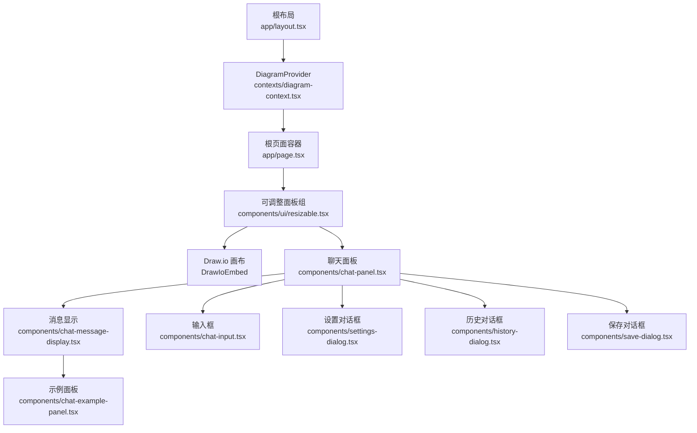
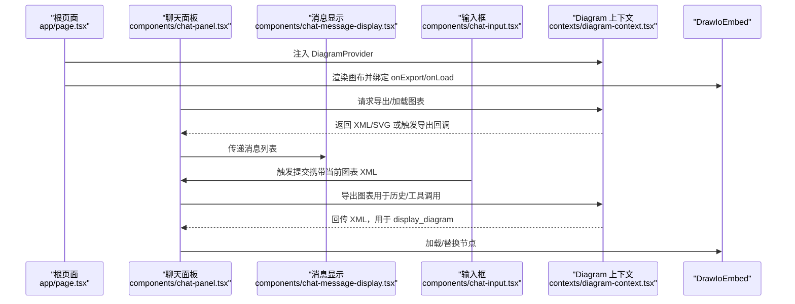
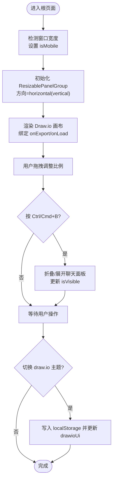
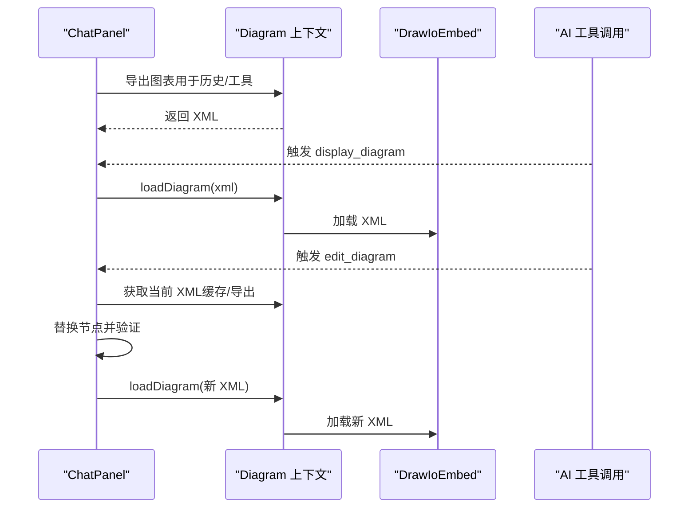
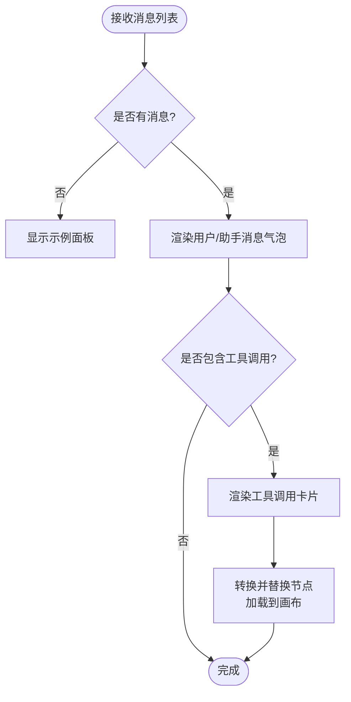
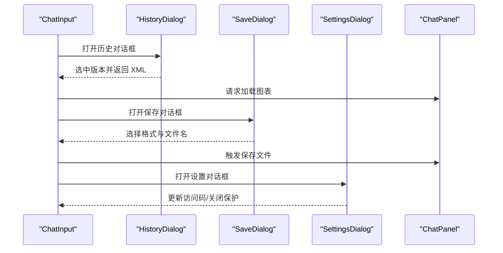
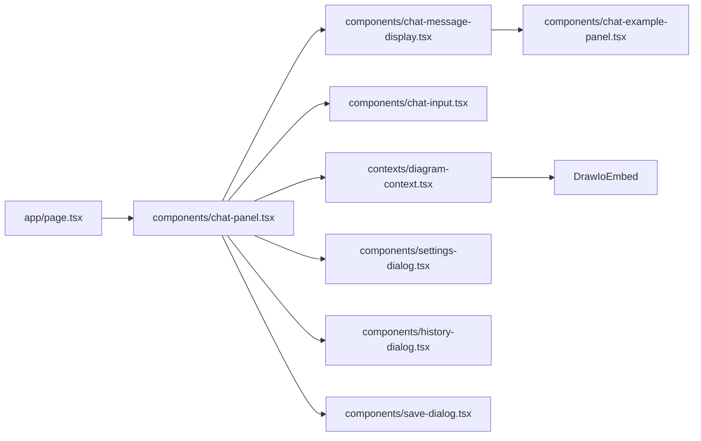

# 组件结构

<cite>
**本文引用的文件**
- [app/page.tsx](file://app/page.tsx)
- [app/layout.tsx](file://app/layout.tsx)
- [components/ui/resizable.tsx](file://components/ui/resizable.tsx)
- [components/chat-panel.tsx](file://components/chat-panel.tsx)
- [components/chat-input.tsx](file://components/chat-input.tsx)
- [components/chat-message-display.tsx](file://components/chat-message-display.tsx)
- [components/settings-dialog.tsx](file://components/settings-dialog.tsx)
- [components/history-dialog.tsx](file://components/history-dialog.tsx)
- [components/save-dialog.tsx](file://components/save-dialog.tsx)
- [components/chat-example-panel.tsx](file://components/chat-example-panel.tsx)
- [contexts/diagram-context.tsx](file://contexts/diagram-context.tsx)
- [lib/utils.ts](file://lib/utils.ts)
</cite>

## 目录
1. [简介](#简介)
2. [项目结构](#项目结构)
3. [核心组件](#核心组件)
4. [架构总览](#架构总览)
5. [详细组件分析](#详细组件分析)
6. [依赖关系分析](#依赖关系分析)
7. [性能考虑](#性能考虑)
8. [故障排查指南](#故障排查指南)
9. [结论](#结论)
10. [附录](#附录)

## 简介
本文件聚焦于 next-ai-draw-io 的 MVC 风格组件化设计，系统性梳理根页面组件（app/page.tsx）如何作为容器协调 ChatPanel 与 DrawIoEmbed 的交互；解释组件树层级关系（从根布局到聊天面板、消息显示、输入框、设置对话框等）；给出属性传递与事件回调机制示例（如 onToggleVisibility、onDisplayChart 等）；阐述主界面可调整面板（ResizablePanel）在移动端与桌面端的响应式行为差异；说明 ChatPanel 如何集成 ChatInput、ChatMessageDisplay 等子组件形成完整聊天界面；最后提供组件依赖关系图与 UI 布局结构示意图，帮助开发者快速理解与扩展。

## 项目结构
- 应用入口与根布局
  - 根布局负责注入 DiagramProvider，为全应用提供 Diagram 上下文能力（导出/加载图表、历史记录、保存文件等）
  - 根页面组件负责组织画布区域与聊天面板的可调整布局，并通过上下文桥接 Draw.io 与聊天逻辑
- UI 可调整面板
  - 使用自定义的 ResizablePanelGroup/Panel/Handle 实现水平或垂直分栏，支持拖拽与折叠
- 聊天组件体系
  - ChatPanel 作为聊天容器，聚合 ChatMessageDisplay 与 ChatInput，并与 Diagram 上下文协作
  - 子组件包括设置对话框、历史对话框、保存对话框、示例面板等

图表来源
- [app/layout.tsx](file://app/layout.tsx#L116-L120)
- [contexts/diagram-context.tsx](file://contexts/diagram-context.tsx#L238-L259)
- [app/page.tsx](file://app/page.tsx#L91-L161)
- [components/ui/resizable.tsx](file://components/ui/resizable.tsx#L9-L57)
- [components/chat-panel.tsx](file://components/chat-panel.tsx#L676-L816)
- [components/chat-message-display.tsx](file://components/chat-message-display.tsx#L345-L747)
- [components/chat-input.tsx](file://components/chat-input.tsx#L144-L481)
- [components/settings-dialog.tsx](file://components/settings-dialog.tsx#L1-L156)
- [components/history-dialog.tsx](file://components/history-dialog.tsx#L1-L113)
- [components/save-dialog.tsx](file://components/save-dialog.tsx#L1-L129)
- [components/chat-example-panel.tsx](file://components/chat-example-panel.tsx#L1-L134)

章节来源
- [app/layout.tsx](file://app/layout.tsx#L116-L120)
- [app/page.tsx](file://app/page.tsx#L91-L161)
- [components/ui/resizable.tsx](file://components/ui/resizable.tsx#L9-L57)

## 核心组件
- 根页面容器（app/page.tsx）
  - 负责：
    - 判断移动端/桌面端，切换 ResizablePanelGroup 的方向与尺寸策略
    - 协调 Draw.io 画布渲染、主题切换、关闭保护等全局状态
    - 通过 Diagram 上下文暴露的回调（handleDiagramExport/onDrawioLoad）与 DrawIoEmbed 通信
    - 控制聊天面板可见性与折叠状态
  - 关键属性/回调：
    - isVisible/onToggleVisibility：控制聊天面板展开/折叠
    - drawioUi/onToggleDrawioUi：切换 draw.io 主题（min/sketch）
    - isMobile：移动端适配
    - onCloseProtectionChange：关闭保护开关变更
- 聊天面板（components/chat-panel.tsx）
  - 负责：
    - 维护会话、消息持久化、工具调用（display_diagram/edit_diagram）
    - 与 Diagram 上下文协作：导出/加载图表、保存历史、清理画布
    - 与 ChatInput/ChatMessageDisplay 交互，处理提交、重生成、编辑消息等
  - 关键属性/回调：
    - isVisible/onToggleVisibility：由父容器传入
    - drawioUi/onToggleDrawioUi：与根页面联动
    - onCloseProtectionChange：透传关闭保护设置
- 消息显示（components/chat-message-display.tsx）
  - 负责：
    - 渲染用户/助手消息、文件附件、工具调用详情
    - 支持复制消息、点赞/点踩反馈、编辑用户消息、重生成助手回复
    - 在工具调用时自动更新 Draw.io 画布（display_diagram）
- 输入框（components/chat-input.tsx）
  - 负责：
    - 文本输入、粘贴/拖拽图片上传、清空会话
    - 打开历史/保存对话框、切换 draw.io 主题、发送消息
    - 文件校验与预览、禁用态控制（流式中/提交中）

章节来源
- [app/page.tsx](file://app/page.tsx#L14-L161)
- [components/chat-panel.tsx](file://components/chat-panel.tsx#L38-L816)
- [components/chat-message-display.tsx](file://components/chat-message-display.tsx#L1-L747)
- [components/chat-input.tsx](file://components/chat-input.tsx#L1-L481)

## 架构总览
整体采用“容器-组件”模式：
- 容器层：根页面（app/page.tsx）、聊天面板（components/chat-panel.tsx）
- 组件层：消息显示、输入框、设置/历史/保存对话框、示例面板
- 上下文层：DiagramProvider（contexts/diagram-context.tsx）统一管理 Draw.io 导出/加载、历史、保存等能力
- UI 层：自定义 ResizablePanelGroup/Panel/Handle 提供响应式布局

图表来源
- [app/page.tsx](file://app/page.tsx#L91-L161)
- [components/chat-panel.tsx](file://components/chat-panel.tsx#L130-L287)
- [contexts/diagram-context.tsx](file://contexts/diagram-context.tsx#L57-L134)
- [components/chat-message-display.tsx](file://components/chat-message-display.tsx#L175-L200)
- [components/chat-input.tsx](file://components/chat-input.tsx#L446-L481)

## 详细组件分析

### 根页面组件（app/page.tsx）分析
- 响应式布局
  - 通过 isMobile 切换 ResizablePanelGroup 的方向（移动端 vertical，桌面端 horizontal）
  - 不同设备下默认尺寸与最小尺寸不同，确保可用空间最大化
- 可调整面板（ResizablePanelGroup/Panel/Handle）
  - 画布区域与聊天面板通过 ResizableHandle 分隔，支持拖拽调整比例
  - 聊天面板支持折叠（移动端不可折叠），折叠/展开时同步更新 isVisible
- 事件与状态
  - 键盘快捷键（Ctrl/Cmd+B）切换聊天面板
  - 关闭保护：根据设置在 beforeunload 弹出确认
  - 主题切换：通过 localStorage 读取并写入 drawio-ui（min/sketch）
- 与 Draw.io 的交互
  - 通过 Diagram 上下文回调 handleDiagramExport/onDrawioLoad 与 DrawIoEmbed 通信
  - 画布渲染时传入 ui/spin/libraries 等参数以优化体验

图表来源
- [app/page.tsx](file://app/page.tsx#L14-L161)
- [components/ui/resizable.tsx](file://components/ui/resizable.tsx#L9-L57)
- [contexts/diagram-context.tsx](file://contexts/diagram-context.tsx#L44-L50)

章节来源
- [app/page.tsx](file://app/page.tsx#L14-L161)
- [components/ui/resizable.tsx](file://components/ui/resizable.tsx#L9-L57)

### 聊天面板（components/chat-panel.tsx）分析
- 组件职责
  - 使用 @ai-sdk/react 的 useChat 管理消息流与工具调用
  - 与 Diagram 上下文协作：导出图表、加载图表、保存历史、清理画布
  - 持久化：本地存储消息、XML 快照、会话 ID、已保存的图表
  - UI：头部（标题、链接、设置、隐藏按钮）、消息区、输入区
- 工具调用
  - display_diagram：验证 XML 合法性后加载到画布
  - edit_diagram：从缓存或导出获取当前 XML，执行替换后再验证并加载
- 交互
  - 重生成：基于消息索引回溯到用户消息，重新发送并清理后续消息
  - 编辑消息：更新用户消息文本，回滚到对应快照并重新发送
  - 折叠视图：桌面端隐藏时仅显示右侧小图标与提示文字

图表来源
- [components/chat-panel.tsx](file://components/chat-panel.tsx#L130-L287)
- [contexts/diagram-context.tsx](file://contexts/diagram-context.tsx#L76-L134)
- [lib/utils.ts](file://lib/utils.ts#L109-L200)

章节来源
- [components/chat-panel.tsx](file://components/chat-panel.tsx#L38-L816)
- [lib/utils.ts](file://lib/utils.ts#L109-L200)

### 消息显示（components/chat-message-display.tsx）分析
- 渲染策略
  - 用户消息：右对齐气泡，支持复制、编辑（最后一段用户消息）
  - 助手消息：左对齐气泡，支持复制、重生成（最后一段助手消息）、点赞/点踩
  - 工具调用：以卡片形式展示输入/输出，支持展开/折叠
- 与画布联动
  - 在工具调用阶段自动将合法 XML 加载到画布（先转换再替换节点）
- 示例面板
  - 当无消息时展示示例卡片，一键填充输入与图片

图表来源
- [components/chat-message-display.tsx](file://components/chat-message-display.tsx#L345-L747)
- [components/chat-example-panel.tsx](file://components/chat-example-panel.tsx#L1-L134)
- [lib/utils.ts](file://lib/utils.ts#L109-L200)

章节来源
- [components/chat-message-display.tsx](file://components/chat-message-display.tsx#L1-L747)
- [components/chat-example-panel.tsx](file://components/chat-example-panel.tsx#L1-L134)

### 输入框（components/chat-input.tsx）分析
- 功能特性
  - 文本输入自适应高度、键盘快捷键（Ctrl/Cmd+Enter 发送）
  - 图片粘贴/拖拽上传，带大小与数量限制与错误提示
  - 清空会话、打开历史/保存对话框、切换 draw.io 主题
  - 禁用态：流式/提交中时禁止交互
- 对话框集成
  - 历史对话框：展示历史快照，点击恢复
  - 保存对话框：选择格式（drawio/png/svg），下载文件
  - 设置对话框：访问码校验与关闭保护设置

图表来源
- [components/chat-input.tsx](file://components/chat-input.tsx#L144-L481)
- [components/history-dialog.tsx](file://components/history-dialog.tsx#L1-L113)
- [components/save-dialog.tsx](file://components/save-dialog.tsx#L1-L129)
- [components/settings-dialog.tsx](file://components/settings-dialog.tsx#L1-L156)

章节来源
- [components/chat-input.tsx](file://components/chat-input.tsx#L1-L481)
- [components/history-dialog.tsx](file://components/history-dialog.tsx#L1-L113)
- [components/save-dialog.tsx](file://components/save-dialog.tsx#L1-L129)
- [components/settings-dialog.tsx](file://components/settings-dialog.tsx#L1-L156)

### 设置对话框（components/settings-dialog.tsx）分析
- 能力
  - 访问码输入与服务端校验
  - 关闭保护开关（离开页面时弹出确认）
  - 本地持久化：访问码、关闭保护开关
- 与根页面联动
  - onCloseProtectionChange 回调用于同步关闭保护状态

章节来源
- [components/settings-dialog.tsx](file://components/settings-dialog.tsx#L1-L156)

## 依赖关系分析
- 组件耦合
  - app/page.tsx 与 components/chat-panel.tsx 通过 props 传递状态与回调
  - components/chat-panel.tsx 与 contexts/diagram-context.tsx 强耦合，承担业务协调职责
  - components/chat-input.tsx 与 components/chat-message-display.tsx 通过 ChatPanel 中转交互
- 外部依赖
  - react-resizable-panels：实现可调整面板
  - react-drawio：与 Draw.io 画布交互
  - @ai-sdk/react：消息流与工具调用
  - lucide-react/next/icons：图标库
- 潜在循环依赖
  - 未发现直接循环依赖；各组件通过上下文与 props 解耦

图表来源
- [app/page.tsx](file://app/page.tsx#L91-L161)
- [components/chat-panel.tsx](file://components/chat-panel.tsx#L676-L816)
- [contexts/diagram-context.tsx](file://contexts/diagram-context.tsx#L238-L259)

章节来源
- [app/page.tsx](file://app/page.tsx#L91-L161)
- [components/chat-panel.tsx](file://components/chat-panel.tsx#L676-L816)
- [contexts/diagram-context.tsx](file://contexts/diagram-context.tsx#L238-L259)

## 性能考虑
- 渲染优化
  - 消息显示使用滚动区域与动画入场，避免大列表重排
  - 工具调用卡片支持展开/折叠，减少一次性渲染压力
- 数据流优化
  - edit_diagram 优先使用缓存 XML，避免频繁导出导致延迟
  - 本地持久化减少刷新丢失数据
- 画布交互
  - 仅在需要时导出/加载，避免不必要的 DOM 操作
  - 主题切换前弹窗提示，防止误触导致的重复导出

## 故障排查指南
- 访问码相关
  - 设置对话框会向服务端校验访问码；若失败，检查服务端路由与网络连通性
- 工具调用失败
  - display_diagram：检查 XML 结构合法性；必要时查看控制台错误信息
  - edit_diagram：确认当前 XML 是否存在缓存；若无则尝试重新导出
- 画布不更新
  - 确认 Diagram 上下文回调 handleDiagramExport/onDrawioLoad 是否被正确绑定
  - 检查 isDrawioReady 状态是否为 true
- 移动端布局异常
  - 确认 isMobile 切换逻辑生效；检查 ResizablePanelGroup 方向与尺寸配置

章节来源
- [components/settings-dialog.tsx](file://components/settings-dialog.tsx#L51-L85)
- [components/chat-panel.tsx](file://components/chat-panel.tsx#L141-L176)
- [contexts/diagram-context.tsx](file://contexts/diagram-context.tsx#L44-L50)

## 结论
本项目采用清晰的 MVC 组件化设计：根页面作为容器协调画布与聊天面板；聊天面板作为控制器整合消息流与工具调用；消息显示与输入框作为视图组件分别承担渲染与交互；Diagram 上下文提供横切能力（导出/加载/保存）。可调整面板在移动端与桌面端差异化配置，配合键盘快捷键与关闭保护，提供了良好的用户体验。建议在扩展新功能时遵循现有模式：通过上下文解耦、通过 props 传递状态与回调、通过对话框/抽屉承载复杂交互。

## 附录
- 组件间属性与事件回调示例路径
  - 根页面到聊天面板：[app/page.tsx](file://app/page.tsx#L141-L155)
  - 聊天面板到消息显示：[components/chat-panel.tsx](file://components/chat-panel.tsx#L759-L770)
  - 聊天面板到输入框：[components/chat-panel.tsx](file://components/chat-panel.tsx#L771-L800)
  - 聊天面板到设置对话框：[components/chat-panel.tsx](file://components/chat-panel.tsx#L733-L743)
  - 聊天面板到历史对话框：[components/chat-panel.tsx](file://components/chat-panel.tsx#L736-L740)
  - 聊天面板到保存对话框：[components/chat-panel.tsx](file://components/chat-panel.tsx#L741-L744)
  - 输入框到保存对话框：[components/chat-input.tsx](file://components/chat-input.tsx#L422-L431)
  - 输入框到历史对话框：[components/chat-input.tsx](file://components/chat-input.tsx#L400-L408)
  - 输入框到设置对话框：[components/chat-input.tsx](file://components/chat-input.tsx#L360-L393)
  - 消息显示到画布：[components/chat-message-display.tsx](file://components/chat-message-display.tsx#L175-L199)
  - 画布到上下文：[app/page.tsx](file://app/page.tsx#L107-L118)，[contexts/diagram-context.tsx](file://contexts/diagram-context.tsx#L101-L134)