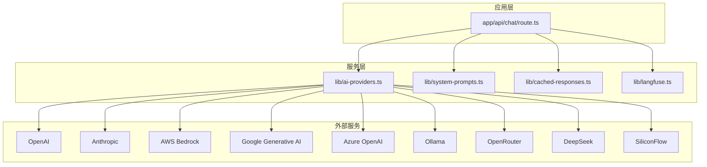
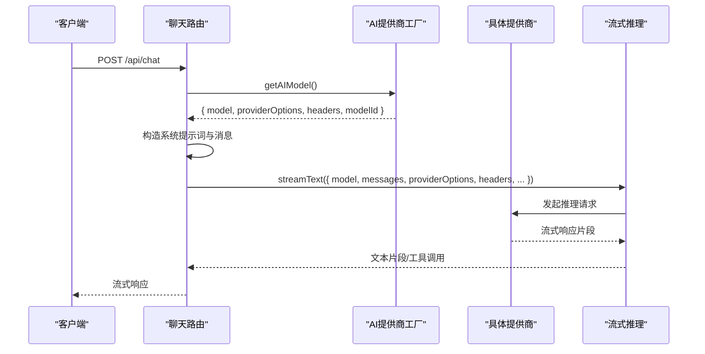
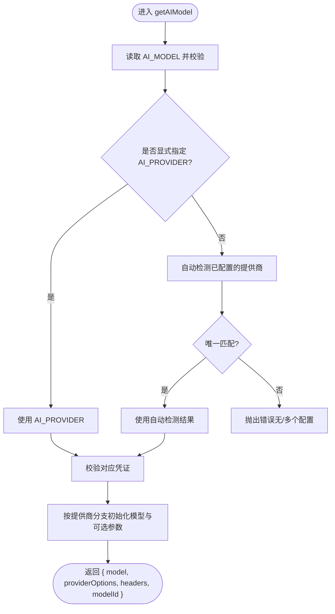
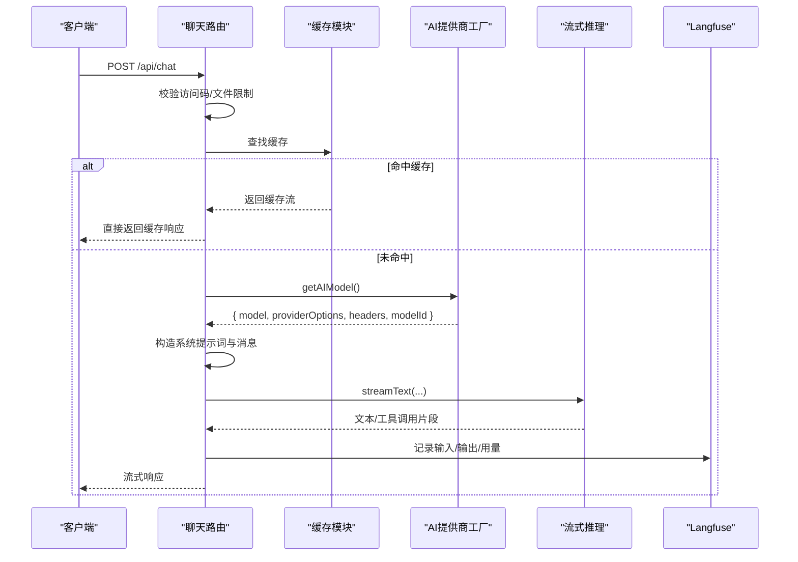
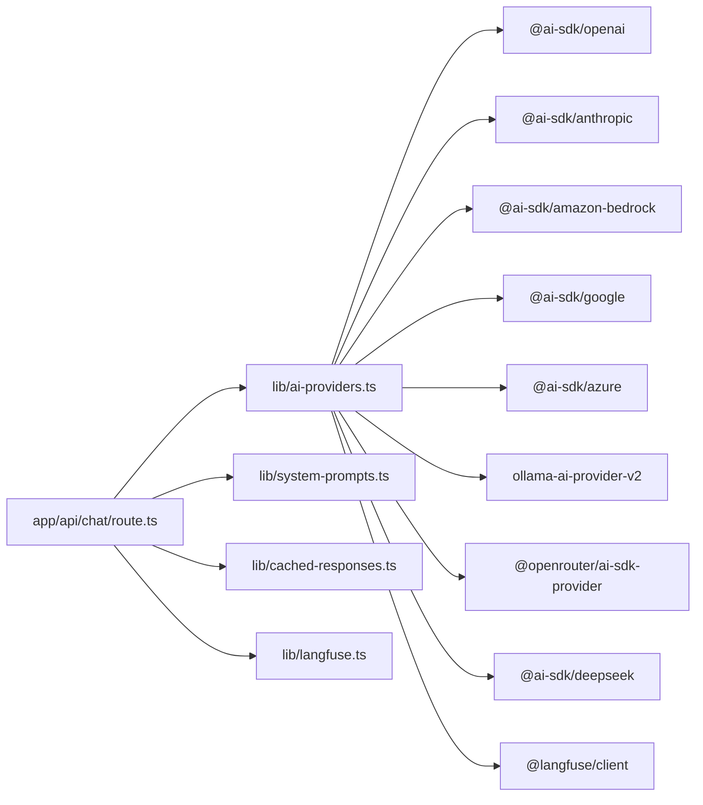

# AI提供商管理

<cite>
**本文引用的文件**
- [lib/ai-providers.ts](file://lib/ai-providers.ts)
- [app/api/chat/route.ts](file://app/api/chat/route.ts)
- [env.example](file://env.example)
- [lib/system-prompts.ts](file://lib/system-prompts.ts)
- [lib/cached-responses.ts](file://lib/cached-responses.ts)
- [lib/langfuse.ts](file://lib/langfuse.ts)
</cite>

## 目录
1. [简介](#简介)
2. [项目结构](#项目结构)
3. [核心组件](#核心组件)
4. [架构总览](#架构总览)
5. [详细组件分析](#详细组件分析)
6. [依赖关系分析](#依赖关系分析)
7. [性能考量](#性能考量)
8. [故障排查指南](#故障排查指南)
9. [结论](#结论)
10. [附录：配置与示例](#附录配置与示例)

## 简介
本文件围绕 lib/ai-providers.ts 中实现的“AI提供商工厂模式”进行深入解析，重点说明：
- getAIModel 如何依据环境变量自动选择并初始化 OpenAI、Anthropic、AWS Bedrock、Google、Azure、Ollama、OpenRouter、DeepSeek、SiliconFlow 等多家提供商的模型实例。
- 认证凭证加载机制、自定义 API 端点支持、模型参数（如 temperature、maxTokens）的传递方式。
- 结合 app/api/chat/route.ts 的调用逻辑，展示 AI 模型如何被集成到聊天流程中。
- 多提供商切换的配置示例与错误处理最佳实践，覆盖凭证缺失、模型不支持等异常场景。

## 项目结构
本项目采用分层组织：lib 存放可复用能力（AI提供商工厂、系统提示词、缓存、遥测），app/api 下存放路由与业务入口，env.example 提供环境变量参考。

图表来源
- [lib/ai-providers.ts](file://lib/ai-providers.ts#L1-L286)
- [app/api/chat/route.ts](file://app/api/chat/route.ts#L1-L495)

章节来源
- [lib/ai-providers.ts](file://lib/ai-providers.ts#L1-L286)
- [app/api/chat/route.ts](file://app/api/chat/route.ts#L1-L495)

## 核心组件
- AI提供商工厂（lib/ai-providers.ts）
  - 定义 ProviderName 联合类型与 ModelConfig 接口
  - 基于环境变量 AI_PROVIDER 或自动检测（detectProvider）确定提供商
  - validateProviderCredentials 校验所需凭证
  - getAIModel 返回 { model, providerOptions, headers, modelId }，用于后续流式对话
- 聊天路由（app/api/chat/route.ts）
  - 从请求体解析消息与 XML 上下文
  - 调用 getAIModel 获取模型实例
  - 构造系统提示词与用户消息，调用 streamText 执行流式推理
  - 集成 Langfuse 遥测与缓存命中逻辑
- 系统提示词（lib/system-prompts.ts）
  - 根据模型 ID 切换默认或扩展提示词，确保高缓存最小令牌模型的上下文充足
- 缓存（lib/cached-responses.ts）
  - 针对常见提示与图片输入的预缓存响应，加速首次请求
- 遥测（lib/langfuse.ts）
  - 条件启用 Langfuse，注入 trace 输入输出与用量指标

章节来源
- [lib/ai-providers.ts](file://lib/ai-providers.ts#L11-L286)
- [app/api/chat/route.ts](file://app/api/chat/route.ts#L145-L474)
- [lib/system-prompts.ts](file://lib/system-prompts.ts#L1-L371)
- [lib/cached-responses.ts](file://lib/cached-responses.ts#L1-L562)
- [lib/langfuse.ts](file://lib/langfuse.ts#L1-L108)

## 架构总览
AI提供商工厂通过统一接口对外暴露模型实例，路由层仅依赖返回的标准化对象，从而实现“多提供商可插拔”。聊天流程在路由中完成消息格式化、系统提示词注入、工具调用定义、温度参数传递与遥测埋点。

图表来源
- [lib/ai-providers.ts](file://lib/ai-providers.ts#L112-L286)
- [app/api/chat/route.ts](file://app/api/chat/route.ts#L215-L474)

## 详细组件分析

### 组件A：AI提供商工厂（getAIModel）
- 功能要点
  - 环境变量优先级：AI_PROVIDER 显式指定 > 自动检测（detectProvider）> 报错
  - 凭证校验：validateProviderCredentials 对应提供商所需的环境变量进行检查
  - 模型初始化：按提供商分支创建对应客户端与模型实例；支持自定义 base_url
  - 可选头与提供商选项：部分提供商（如 Anthropic beta、Bedrock）附加 headers/providerOptions
  - 返回值：标准化 ModelConfig，包含 model、providerOptions、headers、modelId
- 关键实现路径
  - 环境变量映射与自动检测：[PROVIDER_ENV_VARS 与 detectProvider](file://lib/ai-providers.ts#L41-L76)
  - 凭证校验：[validateProviderCredentials](file://lib/ai-providers.ts#L81-L89)
  - 工厂主流程与分支：[getAIModel 主体](file://lib/ai-providers.ts#L112-L286)
  - 各提供商初始化细节（含自定义端点与 beta 头）：
    - [Bedrock 分支](file://lib/ai-providers.ts#L167-L181)
    - [OpenAI 分支](file://lib/ai-providers.ts#L183-L194)
    - [Anthropic 分支](file://lib/ai-providers.ts#L195-L207)
    - [Google 分支](file://lib/ai-providers.ts#L209-L219)
    - [Azure 分支](file://lib/ai-providers.ts#L221-L231)
    - [Ollama 分支](file://lib/ai-providers.ts#L233-L242)
    - [OpenRouter 分支](file://lib/ai-providers.ts#L244-L253)
    - [DeepSeek 分支](file://lib/ai-providers.ts#L255-L265)
    - [SiliconFlow 分支](file://lib/ai-providers.ts#L267-L276)

图表来源
- [lib/ai-providers.ts](file://lib/ai-providers.ts#L112-L286)

章节来源
- [lib/ai-providers.ts](file://lib/ai-providers.ts#L41-L286)

### 组件B：聊天路由（app/api/chat/route.ts）中的集成
- 路由职责
  - 解析请求、访问控制、文件大小与数量校验
  - 从缓存模块查找命中项，命中则直接返回缓存流
  - 调用 getAIModel 获取模型与可选头/提供商选项
  - 构造系统提示词（基于模型 ID 切换默认/扩展提示词）
  - 修复 Bedrock 工具调用输入格式问题
  - 注入系统消息与历史消息，调用 streamText 执行推理
  - 通过 Langfuse 记录输入、输出与用量
  - 将工具定义为 display_diagram 与 edit_diagram
  - 温度参数从环境变量传递给 streamText
- 关键实现路径
  - 路由入口与安全校验：[POST 处理器](file://app/api/chat/route.ts#L472-L495)
  - 缓存命中与流式响应：[缓存查找与 createCachedStreamResponse](file://app/api/chat/route.ts#L114-L142)
  - 消息格式化与 Bedrock 输入修复：[fixToolCallInputs](file://app/api/chat/route.ts#L67-L112)
  - 系统提示词选择：[getSystemPrompt](file://lib/system-prompts.ts#L348-L371)
  - 流式推理与工具定义：[streamText 调用与工具声明](file://app/api/chat/route.ts#L341-L468)
  - 温度参数传递：[temperature 条件注入](file://app/api/chat/route.ts#L468-L471)
  - 遥测埋点：[setTraceInput/setTraceOutput/getTelemetryConfig](file://app/api/chat/route.ts#L180-L393)

图表来源
- [app/api/chat/route.ts](file://app/api/chat/route.ts#L145-L474)
- [lib/ai-providers.ts](file://lib/ai-providers.ts#L112-L286)
- [lib/cached-responses.ts](file://lib/cached-responses.ts#L551-L562)
- [lib/system-prompts.ts](file://lib/system-prompts.ts#L348-L371)
- [lib/langfuse.ts](file://lib/langfuse.ts#L29-L76)

章节来源
- [app/api/chat/route.ts](file://app/api/chat/route.ts#L1-L495)
- [lib/system-prompts.ts](file://lib/system-prompts.ts#L1-L371)
- [lib/cached-responses.ts](file://lib/cached-responses.ts#L1-L562)
- [lib/langfuse.ts](file://lib/langfuse.ts#L1-L108)

### 组件C：系统提示词与模型适配
- 默认提示词适用于所有模型，扩展提示词用于高缓存最小令牌模型（如 Opus 4.5、Haiku 4.5）
- getSystemPrompt 根据模型 ID 包含扩展内容，确保长上下文模型能充分利用缓存

章节来源
- [lib/system-prompts.ts](file://lib/system-prompts.ts#L1-L371)

### 组件D：缓存与预设响应
- CACHED_EXAMPLE_RESPONSES 提供常见提示与图片输入的预设 XML
- findCachedResponse 基于 promptText 与 hasImage 进行匹配，命中后直接返回 UI 流式响应

章节来源
- [lib/cached-responses.ts](file://lib/cached-responses.ts#L1-L562)

### 组件E：遥测与用量记录
- Langfuse 条件启用，wrapWithObserve 包装路由处理器
- setTraceInput 在请求开始时写入输入与会话信息
- setTraceOutput 在结束时写入输出与用量（Bedrock 流式需手动补全 token 指标）

章节来源
- [lib/langfuse.ts](file://lib/langfuse.ts#L1-L108)
- [app/api/chat/route.ts](file://app/api/chat/route.ts#L180-L393)

## 依赖关系分析
- 内部依赖
  - app/api/chat/route.ts 依赖 lib/ai-providers.ts、lib/system-prompts.ts、lib/cached-responses.ts、lib/langfuse.ts
  - lib/ai-providers.ts 依赖各提供商 SDK（@ai-sdk/* 与 @openrouter/ai-sdk-provider、ollama-ai-provider-v2 等）
- 外部依赖
  - AWS SDK 凭证链（@aws-sdk/credential-providers）用于 Bedrock
  - OpenTelemetry API 用于 Langfuse 链路追踪属性设置

图表来源
- [lib/ai-providers.ts](file://lib/ai-providers.ts#L1-L286)
- [app/api/chat/route.ts](file://app/api/chat/route.ts#L1-L495)

章节来源
- [lib/ai-providers.ts](file://lib/ai-providers.ts#L1-L286)
- [app/api/chat/route.ts](file://app/api/chat/route.ts#L1-L495)

## 性能考量
- 缓存策略
  - 首次消息且空图时命中预设缓存，显著降低延迟
  - 通过系统消息与历史消息的断点缓存（providerOptions.cachePoint）提升重复对话的缓存命中率
- 流式传输
  - 使用 streamText 实现边生成边输出，减少首字节延迟
- 提示词长度
  - 高缓存最小令牌模型使用扩展提示词，避免频繁回滚导致的重复计算
- 底层 SDK
  - 各提供商 SDK 的连接池与重试策略由其内部实现决定，建议在生产环境关注其日志与限流策略

[本节为通用指导，无需列出具体文件来源]

## 故障排查指南
- 凭证缺失
  - 症状：启动时报错要求设置特定环境变量
  - 排查：确认 PROVIDER_ENV_VARS 映射对应的环境变量是否已设置
  - 参考：[validateProviderCredentials](file://lib/ai-providers.ts#L81-L89)
- 多提供商冲突
  - 症状：同时配置多个提供商但未显式指定 AI_PROVIDER
  - 排查：仅保留一个提供商的凭证，或显式设置 AI_PROVIDER
  - 参考：[自动检测与报错逻辑](file://lib/ai-providers.ts#L121-L156)
- 模型 ID 无效
  - 症状：未设置 AI_MODEL 或模型不可用
  - 排查：设置正确的 AI_MODEL，并确认提供商端可用
  - 参考：[AI_MODEL 校验](file://lib/ai-providers.ts#L113-L119)
- Bedrock 工具调用输入格式错误
  - 症状：工具调用 input 为字符串而非对象
  - 排查：路由内置 fixToolCallInputs 修复，必要时检查上游消息构造
  - 参考：[fixToolCallInputs](file://app/api/chat/route.ts#L67-L112)
- 温度参数不生效
  - 症状：某些模型不支持 temperature
  - 排查：移除 TEMPERATURE 或仅在支持的模型上使用
  - 参考：[温度参数注入](file://app/api/chat/route.ts#L468-L471)
- Langfuse 用量统计不完整（Bedrock）
  - 症状：Bedrock 流式不自动上报 token
  - 排查：onFinish 中手动写入 promptTokens/completionTokens
  - 参考：[setTraceOutput](file://app/api/chat/route.ts#L380-L393)

章节来源
- [lib/ai-providers.ts](file://lib/ai-providers.ts#L81-L156)
- [app/api/chat/route.ts](file://app/api/chat/route.ts#L67-L112)
- [app/api/chat/route.ts](file://app/api/chat/route.ts#L468-L471)
- [app/api/chat/route.ts](file://app/api/chat/route.ts#L380-L393)

## 结论
该实现以工厂模式为核心，将多提供商抽象为统一的 ModelConfig 接口，配合路由层的消息编排、系统提示词与缓存策略，形成高可扩展、易维护的聊天推理管线。通过环境变量驱动的配置与条件化的凭证校验，既保证了灵活性，也降低了误配置风险。结合 Langfuse 的可观测性与工具化输出，能够稳定支撑复杂对话与可视化编辑场景。

[本节为总结性内容，无需列出具体文件来源]

## 附录：配置与示例

- 环境变量参考
  - AI_PROVIDER：指定提供商（bedrock、openai、anthropic、google、azure、ollama、openrouter、deepseek、siliconflow）
  - AI_MODEL：目标模型 ID
  - 各提供商专用变量：OPENAI_API_KEY、ANTHROPIC_API_KEY、GOOGLE_GENERATIVE_AI_API_KEY、AZURE_API_KEY/AZURE_RESOURCE_NAME、AWS_REGION/AWS_ACCESS_KEY_ID/AWS_SECRET_ACCESS_KEY、OLLAMA_BASE_URL、OPENROUTER_API_KEY、DEEPSEEK_API_KEY/DEEPSEEK_BASE_URL、SILICONFLOW_API_KEY/SILICONFLOW_BASE_URL
  - 自定义端点：OPENAI_BASE_URL、ANTHROPIC_BASE_URL、GOOGLE_BASE_URL、AZURE_BASE_URL、DEEPSEEK_BASE_URL、SILICONFLOW_BASE_URL
  - 观测性：LANGFUSE_PUBLIC_KEY/LANGFUSE_SECRET_KEY/LANGFUSE_BASEURL
  - 温度：TEMPERATURE
  - 访问控制：ACCESS_CODE_LIST

- 多提供商切换示例
  - 切换到 OpenAI：设置 AI_PROVIDER=openai 与 OPENAI_API_KEY，可选 OPENAI_BASE_URL
  - 切换到 Anthropic：设置 AI_PROVIDER=anthropic 与 ANTHROPIC_API_KEY，可选 ANTHROPIC_BASE_URL
  - 切换到 AWS Bedrock：设置 AI_PROVIDER=bedrock 与 AWS_REGION/AWS_ACCESS_KEY_ID/AWS_SECRET_ACCESS_KEY
  - 切换到 Ollama：设置 AI_PROVIDER=ollama 与 OLLAMA_BASE_URL（本地默认 http://localhost:11434）
  - 切换到 OpenRouter：设置 AI_PROVIDER=openrouter 与 OPENROUTER_API_KEY，可选 OPENROUTER_BASE_URL
  - 切换到 DeepSeek：设置 AI_PROVIDER=deepseek 与 DEEPSEEK_API_KEY，可选 DEEPSEEK_BASE_URL
  - 切换到 SiliconFlow：设置 AI_PROVIDER=siliconflow 与 SILICONFLOW_API_KEY，可选 SILICONFLOW_BASE_URL

- 错误处理最佳实践
  - 在 CI/CD 中预检环境变量，避免运行期失败
  - 对多提供商共存场景强制显式指定 AI_PROVIDER
  - 对 Bedrock 特定输入格式进行前置修复
  - 对温度等参数进行条件注入，避免不支持的模型报错
  - 对 Langfuse 用量进行兜底记录，确保可观测性

章节来源
- [env.example](file://env.example#L1-L63)
- [lib/ai-providers.ts](file://lib/ai-providers.ts#L41-L111)
- [app/api/chat/route.ts](file://app/api/chat/route.ts#L468-L471)