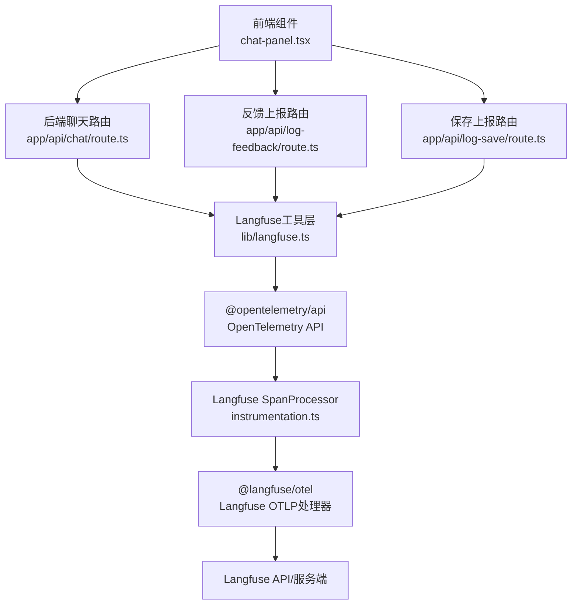
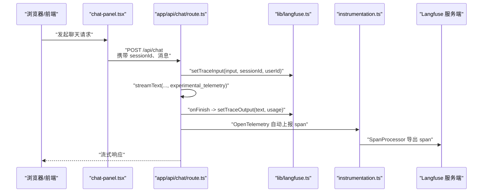
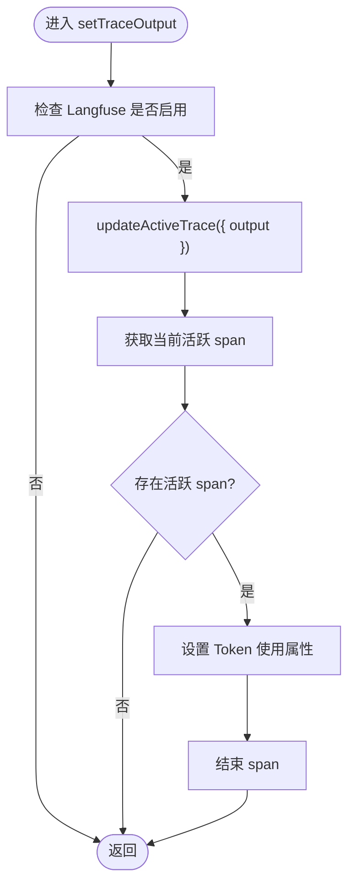
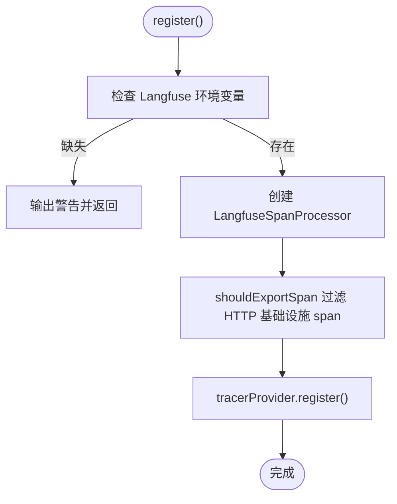
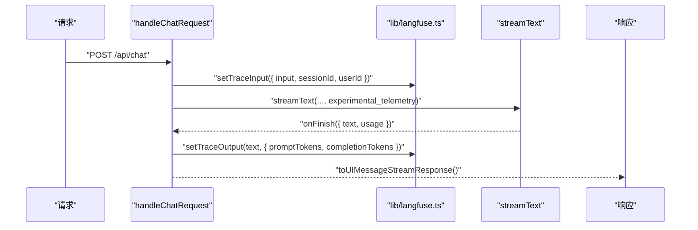
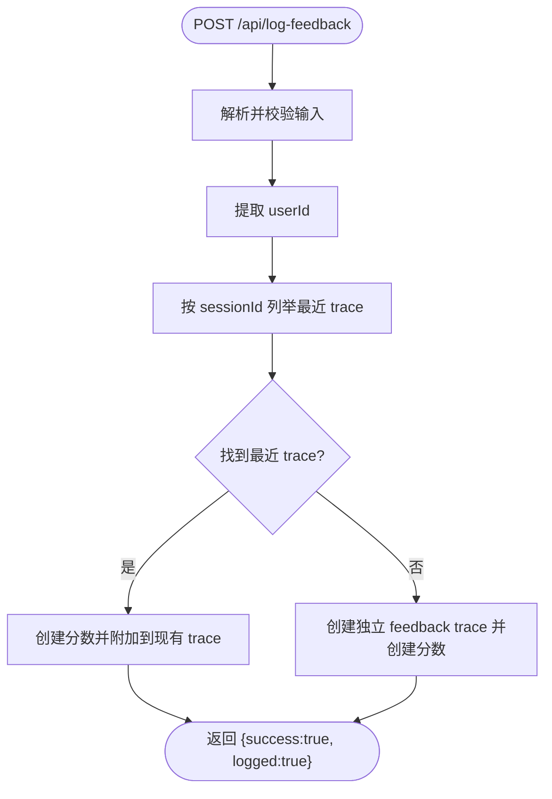
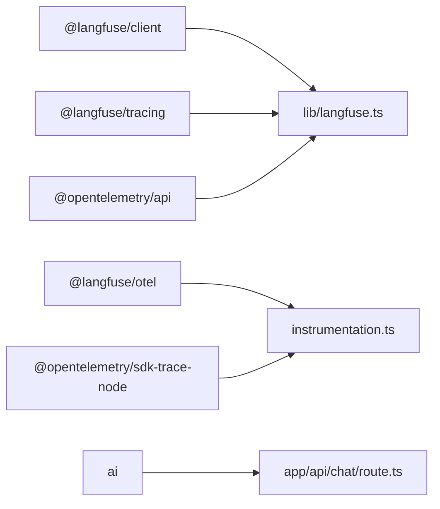

# AI调用监控

<cite>
**本文引用的文件列表**
- [lib/langfuse.ts](file://lib/langfuse.ts)
- [app/api/chat/route.ts](file://app/api/chat/route.ts)
- [instrumentation.ts](file://instrumentation.ts)
- [env.example](file://env.example)
- [package.json](file://package.json)
- [app/api/log-feedback/route.ts](file://app/api/log-feedback/route.ts)
- [app/api/log-save/route.ts](file://app/api/log-save/route.ts)
- [contexts/diagram-context.tsx](file://contexts/diagram-context.tsx)
- [components/chat-panel.tsx](file://components/chat-panel.tsx)
</cite>

## 目录
1. [简介](#简介)
2. [项目结构](#项目结构)
3. [核心组件](#核心组件)
4. [架构总览](#架构总览)
5. [详细组件分析](#详细组件分析)
6. [依赖关系分析](#依赖关系分析)
7. [性能考量](#性能考量)
8. [故障排查指南](#故障排查指南)
9. [结论](#结论)
10. [附录](#附录)

## 简介
本文件系统性说明本仓库中基于 Langfuse 的 AI 调用监控与追踪集成方案，覆盖以下要点：
- 如何通过 Langfuse SDK 记录 AI 聊天会话（trace）、生成请求（generation）与用户反馈（score/event）。
- traceId 的生成与传递机制：前端生成会话标识，后端在请求生命周期内维护活动 trace，并通过 OpenTelemetry 与 Langfuse 集成上报。
- 在 app/api/chat/route.ts 中如何将 AI 调用上下文（输入、输出、模型参数、耗时、Token 使用量等）上报至 Langfuse，实现请求监控与性能分析。
- 调试支持：通过 Langfuse 界面排查生成质量下降问题的实践方法。
- 初始化配置、环境变量设置与分布式追踪的最佳实践。

## 项目结构
围绕 Langfuse 的监控与追踪，涉及如下关键模块：
- 前端：负责生成会话标识（sessionId），并在用户交互（如提交反馈、保存图表）时触发后端接口上报。
- 后端 API：在聊天路由中注入 Langfuse 追踪与遥测配置；在反馈与保存路由中为现有 trace 打分或创建独立 trace。
- Langfuse 工具层：封装客户端、活动 trace 更新、遥测配置与观察器包装。
- OpenTelemetry 注册：全局注册 SpanProcessor，过滤 HTTP 基础设施 Span，确保 AI SDK 的 span 成为根 trace。

图示来源
- [components/chat-panel.tsx](file://components/chat-panel.tsx#L100-L130)
- [app/api/chat/route.ts](file://app/api/chat/route.ts#L145-L186)
- [lib/langfuse.ts](file://lib/langfuse.ts#L29-L107)
- [instrumentation.ts](file://instrumentation.ts#L1-L39)
- [app/api/log-feedback/route.ts](file://app/api/log-feedback/route.ts#L1-L112)
- [app/api/log-save/route.ts](file://app/api/log-save/route.ts#L1-L72)

章节来源
- [lib/langfuse.ts](file://lib/langfuse.ts#L1-L108)
- [app/api/chat/route.ts](file://app/api/chat/route.ts#L1-L495)
- [instrumentation.ts](file://instrumentation.ts#L1-L40)
- [env.example](file://env.example#L50-L55)
- [package.json](file://package.json#L15-L30)

## 核心组件
- Langfuse 工具层（lib/langfuse.ts）
  - 提供 Langfuse 客户端单例、启用检测、活动 trace 输入/输出更新、遥测配置与观察器包装。
  - 关键能力：
    - setTraceInput：在请求开始时写入 trace 名称、输入文本、sessionId、userId。
    - setTraceOutput：在生成完成时写入输出文本并结束当前 span，同时手动设置 Token 使用属性。
    - getTelemetryConfig：返回 AI SDK 遥测配置（禁用自动输入录制，开启输出录制，附加元数据）。
    - wrapWithObserve：使用 @langfuse/tracing 包装请求处理函数，形成可被 OTel 处理的根 span。
- OpenTelemetry 注册（instrumentation.ts）
  - 条件注册 Langfuse SpanProcessor，过滤 Next.js HTTP 基础设施 span，使 AI SDK 的 span 成为根 trace。
- 聊天路由（app/api/chat/route.ts）
  - 解析请求、提取用户输入、生成/校验 sessionId、设置 userId、调用 AI SDK 流式生成、在 onFinish 回调中上报输出与 Token 使用。
  - 将 Langfuse 遥测配置传给 AI SDK，并通过 wrapWithObserve 包装安全处理函数。
- 反馈路由（app/api/log-feedback/route.ts）
  - 根据 sessionId 查询最近 trace，若存在则向该 trace 打分；否则创建独立的“用户反馈”trace 并打分。
- 保存路由（app/api/log-save/route.ts）
  - 根据 sessionId 查询最近 trace，若存在则向该 trace 打分“diagram-saved”。
- 前端会话标识（components/chat-panel.tsx）
  - 生成唯一 sessionId 并持久化到本地存储，作为跨请求的 trace 关联键。
- 图表保存事件上报（contexts/diagram-context.tsx）
  - 触发 /api/log-save，仅标记 trace，不上传大体积内容。

章节来源
- [lib/langfuse.ts](file://lib/langfuse.ts#L29-L107)
- [instrumentation.ts](file://instrumentation.ts#L1-L39)
- [app/api/chat/route.ts](file://app/api/chat/route.ts#L145-L186)
- [app/api/chat/route.ts](file://app/api/chat/route.ts#L341-L392)
- [app/api/log-feedback/route.ts](file://app/api/log-feedback/route.ts#L1-L112)
- [app/api/log-save/route.ts](file://app/api/log-save/route.ts#L1-L72)
- [components/chat-panel.tsx](file://components/chat-panel.tsx#L100-L130)
- [contexts/diagram-context.tsx](file://contexts/diagram-context.tsx#L220-L236)

## 架构总览
Langfuse 集成采用“前端生成会话标识 + 后端活动 trace + OpenTelemetry 上报”的模式，确保：
- traceId 由 sessionId 推导，贯穿一次对话的多个请求。
- 活动 trace 在请求生命周期内被更新（输入、输出、Token 使用）。
- AI SDK 的 span 通过 OTel 处理器成为根 trace，避免被 Next.js HTTP span 包裹。

图示来源
- [components/chat-panel.tsx](file://components/chat-panel.tsx#L100-L130)
- [app/api/chat/route.ts](file://app/api/chat/route.ts#L145-L186)
- [app/api/chat/route.ts](file://app/api/chat/route.ts#L341-L392)
- [lib/langfuse.ts](file://lib/langfuse.ts#L29-L107)
- [instrumentation.ts](file://instrumentation.ts#L1-L39)

## 详细组件分析

### Langfuse 工具层（lib/langfuse.ts）
- 单例客户端：按需创建 LangfuseClient，读取环境变量（公钥、私钥、基础地址）。
- 启用检测：通过是否存在公钥判断是否启用 Langfuse。
- 活动 trace 更新：
  - setTraceInput：设置 trace 名称为“chat”，并写入 input、sessionId、userId。
  - setTraceOutput：写入 output，同时从 OpenTelemetry API 获取当前 span，设置 promptTokens/completionTokens 属性，并结束 span。
- 遥测配置：返回 AI SDK 实验性遥测对象，禁用自动输入录制（避免上传大体积图片），开启输出录制，并附加 sessionId、userId 元数据。
- 观察器包装：wrapWithObserve 使用 @langfuse/tracing 包装请求处理函数，形成可被 OTel 处理的根 span。

图示来源
- [lib/langfuse.ts](file://lib/langfuse.ts#L46-L76)

章节来源
- [lib/langfuse.ts](file://lib/langfuse.ts#L1-L108)

### OpenTelemetry 注册（instrumentation.ts）
- 条件注册：当未配置公钥/私钥时，跳过注册并输出警告。
- SpanProcessor：创建 LangfuseSpanProcessor，过滤 Next.js HTTP 基础设施 span（如 “POST /”、“GET /”、“BaseServer”、“handleRequest”），确保 AI SDK 的 span 成为根 trace。
- 全局注册：将 TracerProvider 注册为全局，使 AI SDK 的遥测也使用该处理器。

图示来源
- [instrumentation.ts](file://instrumentation.ts#L1-L39)

章节来源
- [instrumentation.ts](file://instrumentation.ts#L1-L40)

### 聊天路由（app/api/chat/route.ts）
- 请求入口：解析消息、校验文件数量与大小、修复 Bedrock 工具调用输入格式、构建系统消息与增强消息。
- 会话与用户标识：
  - 从请求头提取 x-forwarded-for 作为 userId（匿名回退）。
  - 校验 sessionId（字符串且长度不超过 200）。
  - 从最后一条消息提取用户文本作为 trace 输入。
- Trace 更新：
  - setTraceInput：在请求开始时写入 input、sessionId、userId。
  - streamText：传入 AI 模型与消息，注入 getTelemetryConfig 返回的遥测配置。
  - onFinish：记录 usage（inputTokens/outputTokens），转换为 promptTokens/completionTokens，调用 setTraceOutput 结束 span。
- 错误处理：safeHandler 包裹，统一捕获错误并返回 500。
- 分布式追踪：wrapWithObserve 将安全处理函数包装为 Langfuse 观察器，形成根 span。

图示来源
- [app/api/chat/route.ts](file://app/api/chat/route.ts#L145-L186)
- [app/api/chat/route.ts](file://app/api/chat/route.ts#L341-L392)
- [lib/langfuse.ts](file://lib/langfuse.ts#L29-L107)

章节来源
- [app/api/chat/route.ts](file://app/api/chat/route.ts#L1-L495)

### 反馈路由（app/api/log-feedback/route.ts）
- 输入校验：使用 Zod 校验 messageId、feedback、sessionId。
- 用户标识：从 x-forwarded-for 获取 userId。
- Trace 查找与评分：
  - 若 sessionId 存在且能查到最近 trace，则向该 trace 创建“user-feedback”分数。
  - 若无 trace，则创建独立的“user-feedback”trace，并在同一批次中创建分数。
- 返回结果：成功返回 logged=true/false，失败返回 500。

图示来源
- [app/api/log-feedback/route.ts](file://app/api/log-feedback/route.ts#L1-L112)

章节来源
- [app/api/log-feedback/route.ts](file://app/api/log-feedback/route.ts#L1-L112)

### 保存路由（app/api/log-save/route.ts）
- 输入校验：filename、format、sessionId。
- Trace 查找与评分：
  - 若存在最近 trace，则创建“diagram-saved”分数。
  - 若不存在，则跳过（用户尚未聊天）。
- 返回结果：成功返回 {success:true, logged:true/false}，失败返回 500。

章节来源
- [app/api/log-save/route.ts](file://app/api/log-save/route.ts#L1-L72)

### 前端会话标识与事件上报（components/chat-panel.tsx、contexts/diagram-context.tsx）
- 会话标识：生成唯一 sessionId（优先从本地存储恢复），用于关联多次请求的 trace。
- 事件上报：
  - 提交反馈：调用 /api/log-feedback，携带 messageId、feedback、sessionId。
  - 保存图表：调用 /api/log-save，携带 filename、format、sessionId。

章节来源
- [components/chat-panel.tsx](file://components/chat-panel.tsx#L100-L130)
- [contexts/diagram-context.tsx](file://contexts/diagram-context.tsx#L220-L236)

## 依赖关系分析
- Langfuse 相关依赖：
  - @langfuse/client：Langfuse SDK 客户端。
  - @langfuse/otel：Langfuse OTLP SpanProcessor。
  - @langfuse/tracing：Langfuse 观察器包装。
  - @opentelemetry/api：OpenTelemetry API。
- OpenTelemetry 相关依赖：
  - @opentelemetry/sdk-trace-node：Node TracerProvider。
- AI SDK 与模型：
  - ai：流式生成与工具调用。
  - 各厂商 SDK（如 @ai-sdk/amazon-bedrock 等）在 package.json 中声明。

图示来源
- [package.json](file://package.json#L15-L30)
- [lib/langfuse.ts](file://lib/langfuse.ts#L1-L108)
- [instrumentation.ts](file://instrumentation.ts#L1-L39)
- [app/api/chat/route.ts](file://app/api/chat/route.ts#L1-L495)

章节来源
- [package.json](file://package.json#L15-L30)

## 性能考量
- Token 使用上报：由于 Bedrock 流式不自动上报 Token，代码在 onFinish 中手动转换 inputTokens/outputTokens 为 promptTokens/completionTokens 并设置到 span 属性，便于在 Langfuse 中进行成本与性能分析。
- 输入录制控制：遥测配置禁用自动输入录制，避免上传大体积图片导致带宽与存储压力；用户文本通过 setTraceInput 手动记录。
- Span 过滤：instrumentation.ts 过滤 Next.js HTTP 基础设施 span，确保 AI SDK 的 span 成为根 trace，减少无关 span 干扰。
- 缓存点策略：聊天路由在历史消息中插入缓存断点，提升后续请求的命中率，间接降低延迟与 Token 消耗。

章节来源
- [app/api/chat/route.ts](file://app/api/chat/route.ts#L341-L392)
- [lib/langfuse.ts](file://lib/langfuse.ts#L78-L96)
- [instrumentation.ts](file://instrumentation.ts#L1-L39)

## 故障排查指南
- Langfuse 未启用
  - 现象：前端与后端均不记录 trace 或遥测。
  - 排查：确认环境变量 LANGFUSE_PUBLIC_KEY/LANGFUSE_SECRET_KEY/LANGFUSE_BASEURL 是否正确设置。
  - 参考：[env.example](file://env.example#L50-L55)
- 会话标识无效
  - 现象：trace 无法按 sessionId 关联。
  - 排查：前端 sessionId 应为字符串且长度不超过 200；后端对 sessionId 进行校验。
  - 参考：[components/chat-panel.tsx](file://components/chat-panel.tsx#L100-L130)、[app/api/chat/route.ts](file://app/api/chat/route.ts#L169-L174)
- 用户标识异常
  - 现象：trace 中 userId 不正确。
  - 排查：确认 x-forwarded-for 请求头是否可达；后端以第一个地址作为 userId。
  - 参考：[app/api/chat/route.ts](file://app/api/chat/route.ts#L163-L168)
- Token 使用未显示
  - 现象：Langfuse 中无 Token 统计。
  - 排查：确认 onFinish 回调已执行；usage 字段包含 inputTokens/outputTokens；setTraceOutput 已调用。
  - 参考：[app/api/chat/route.ts](file://app/api/chat/route.ts#L380-L392)、[lib/langfuse.ts](file://lib/langfuse.ts#L54-L76)
- 反馈/保存未关联 trace
  - 现象：反馈或保存事件未出现在对应聊天 trace 中。
  - 排查：确认 sessionId 一致；后端 /api/log-feedback 与 /api/log-save 能查询到最近 trace；若无 trace 则创建独立 trace。
  - 参考：[app/api/log-feedback/route.ts](file://app/api/log-feedback/route.ts#L34-L112)、[app/api/log-save/route.ts](file://app/api/log-save/route.ts#L31-L71)
- Span 未导出
  - 现象：Langfuse 无任何 span。
  - 排查：确认 instrumentation.ts 已注册；未配置公钥/私钥时会跳过注册；检查 shouldExportSpan 过滤逻辑。
  - 参考：[instrumentation.ts](file://instrumentation.ts#L1-L39)

章节来源
- [env.example](file://env.example#L50-L55)
- [components/chat-panel.tsx](file://components/chat-panel.tsx#L100-L130)
- [app/api/chat/route.ts](file://app/api/chat/route.ts#L163-L174)
- [app/api/chat/route.ts](file://app/api/chat/route.ts#L380-L392)
- [lib/langfuse.ts](file://lib/langfuse.ts#L54-L76)
- [app/api/log-feedback/route.ts](file://app/api/log-feedback/route.ts#L34-L112)
- [app/api/log-save/route.ts](file://app/api/log-save/route.ts#L31-L71)
- [instrumentation.ts](file://instrumentation.ts#L1-L39)

## 结论
本项目通过“前端生成 sessionId + 后端活动 trace + OpenTelemetry SpanProcessor”的组合，实现了对 AI 聊天会话的全链路监控与分析。traceId 通过 sessionId 推导并在多请求间保持一致；Langfuse 工具层负责 trace 输入/输出与 Token 使用上报；instrumentation.ts 确保 AI SDK 的 span 成为根 trace；反馈与保存事件通过独立路由为 trace 打分，便于后续在 Langfuse 界面进行质量与行为分析。该方案兼顾性能（禁用大体积输入录制、过滤无关 span、缓存点策略）与可观测性，适合生产环境部署与持续优化。

## 附录

### 初始化配置与环境变量
- 必填项（Langfuse）
  - LANGFUSE_PUBLIC_KEY：Langfuse 公钥
  - LANGFUSE_SECRET_KEY：Langfuse 私钥
  - LANGFUSE_BASEURL：Langfuse 基础地址（如 EU 区域使用 us.cloud.langfuse.com）
- 可选项（AI 与运行）
  - AI_PROVIDER、AI_MODEL、各厂商密钥与自定义 base_url
  - TEMPERATURE（温度）
  - ACCESS_CODE_LIST（访问码）

章节来源
- [env.example](file://env.example#L1-L63)

### 分布式追踪最佳实践
- 保持 sessionId 一致性：前端生成并持久化，后端严格校验长度与类型。
- 控制输入录制：禁用自动输入录制，仅手动记录必要文本；避免上传大体积图片。
- 过滤基础设施 span：仅导出业务 span，减少噪声。
- 显式结束 span：在 onFinish 中设置 Token 使用并结束当前 span。
- 事件打分：反馈与保存事件通过独立路由为 trace 打分，便于后续检索与分析。

章节来源
- [lib/langfuse.ts](file://lib/langfuse.ts#L78-L107)
- [instrumentation.ts](file://instrumentation.ts#L1-L39)
- [app/api/chat/route.ts](file://app/api/chat/route.ts#L341-L392)
- [app/api/log-feedback/route.ts](file://app/api/log-feedback/route.ts#L34-L112)
- [app/api/log-save/route.ts](file://app/api/log-save/route.ts#L31-L71)