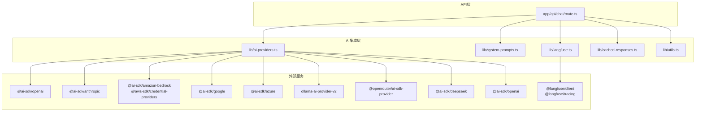
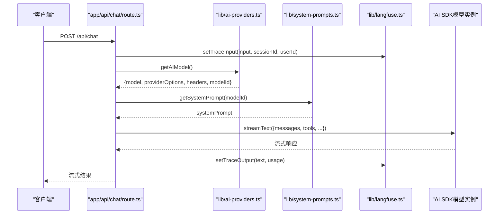
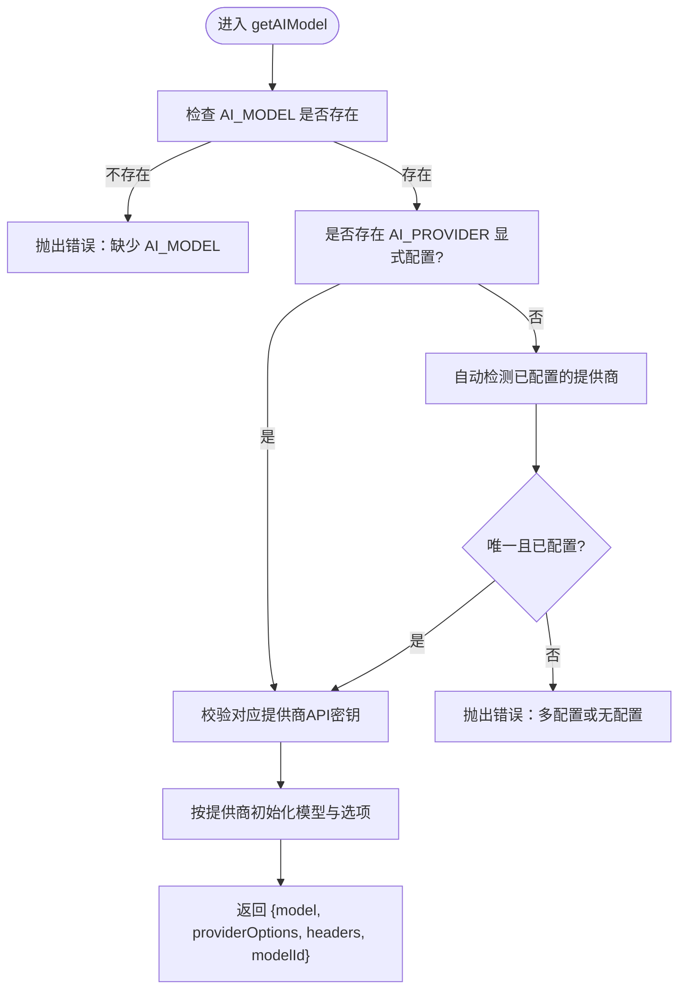
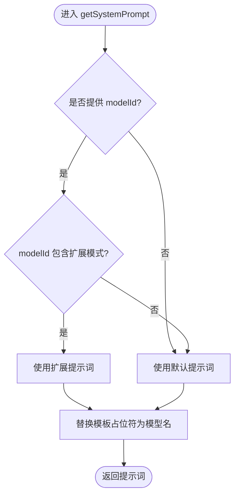
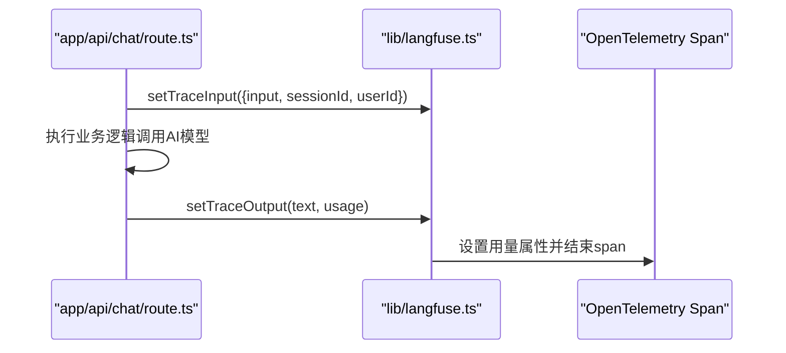
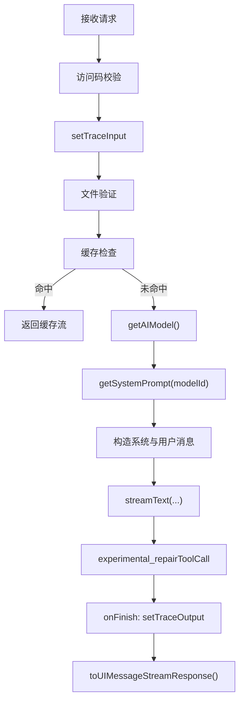
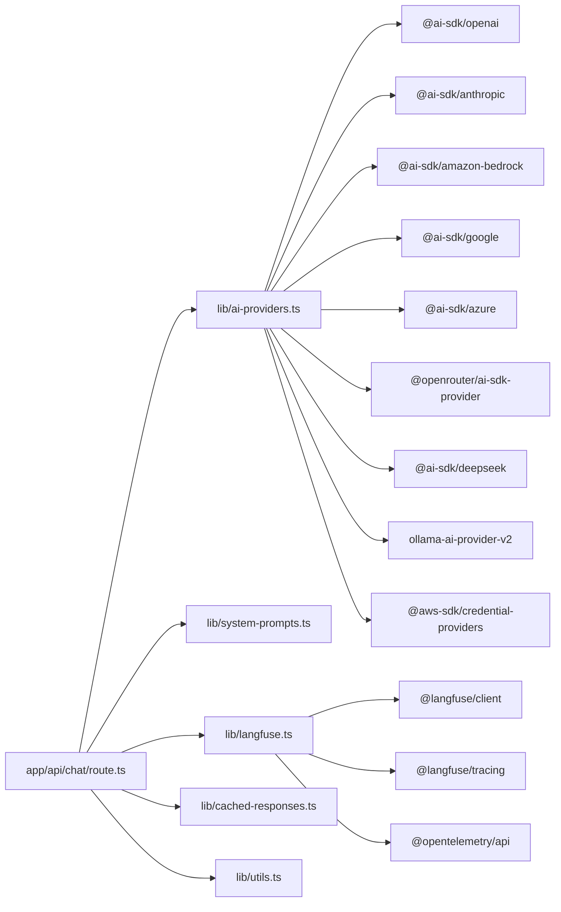

# AI集成

<cite>
**本文引用的文件**
- [lib/ai-providers.ts](file://lib/ai-providers.ts)
- [lib/system-prompts.ts](file://lib/system-prompts.ts)
- [lib/langfuse.ts](file://lib/langfuse.ts)
- [app/api/chat/route.ts](file://app/api/chat/route.ts)
- [env.example](file://env.example)
- [docs/ai-providers.md](file://docs/ai-providers.md)
- [lib/cached-responses.ts](file://lib/cached-responses.ts)
- [lib/utils.ts](file://lib/utils.ts)
- [package.json](file://package.json)
</cite>

## 目录
1. [简介](#简介)
2. [项目结构](#项目结构)
3. [核心组件](#核心组件)
4. [架构总览](#架构总览)
5. [详细组件分析](#详细组件分析)
6. [依赖关系分析](#依赖关系分析)
7. [性能考量](#性能考量)
8. [故障排查指南](#故障排查指南)
9. [结论](#结论)
10. [附录](#附录)

## 简介
本文件面向希望在Next.js应用中集成多AI提供商能力的开发者，围绕lib/ai-providers.ts中的工厂模式实现进行深入解析：如何基于环境变量动态选择OpenAI、Anthropic、Bedrock、Google、Azure、Ollama、OpenRouter、DeepSeek、SiliconFlow等不同AI服务；如何处理认证凭证、自定义端点与模型参数；系统提示词（system-prompts）的设计原则与多模型适配策略；Langfuse追踪集成如何实现请求监控、性能分析与调试支持；并提供多AI提供商切换的实际代码示例与最佳实践建议。

## 项目结构
本项目采用按功能模块组织的结构，AI相关逻辑集中在lib目录：
- lib/ai-providers.ts：AI提供商工厂，负责根据环境变量选择具体模型与提供商，并返回可直接用于流式对话的模型实例及相关选项
- lib/system-prompts.ts：系统提示词管理，针对不同模型能力自动选择默认或扩展提示词
- lib/langfuse.ts：Langfuse观测性集成，封装客户端初始化、追踪更新、遥测配置与处理器包装
- app/api/chat/route.ts：聊天API入口，调用AI工厂、系统提示词、工具定义与Langfuse追踪，构建消息序列并流式输出
- env.example与docs/ai-providers.md：提供环境变量与配置示例及最佳实践说明
- lib/cached-responses.ts与lib/utils.ts：缓存命中与XML工具辅助（与AI集成流程密切相关）

图表来源
- [lib/ai-providers.ts](file://lib/ai-providers.ts#L1-L286)
- [lib/langfuse.ts](file://lib/langfuse.ts#L1-L108)
- [app/api/chat/route.ts](file://app/api/chat/route.ts#L1-L495)
- [package.json](file://package.json#L15-L61)

章节来源
- [lib/ai-providers.ts](file://lib/ai-providers.ts#L1-L286)
- [lib/system-prompts.ts](file://lib/system-prompts.ts#L1-L371)
- [lib/langfuse.ts](file://lib/langfuse.ts#L1-L108)
- [app/api/chat/route.ts](file://app/api/chat/route.ts#L1-L495)
- [package.json](file://package.json#L15-L61)

## 核心组件
- AI提供商工厂（getAIModel）
  - 功能：依据AI_PROVIDER与AI_MODEL以及各提供商API密钥，自动检测或显式指定提供商，返回统一的模型对象、提供商选项与请求头
  - 关键点：支持自定义端点（如OPENAI_BASE_URL、ANTHROPIC_BASE_URL等），自动注入Anthropic Beta头部，Bedrock对Claude模型附加Anthropic Beta选项
- 系统提示词（getSystemPrompt）
  - 功能：根据模型ID是否匹配特定模式（如包含“claude-opus-4-5”或“claude-haiku-4-5”），自动选择默认或扩展提示词，以适配更高缓存上限的模型
- Langfuse追踪（getLangfuseClient、setTraceInput、setTraceOutput、getTelemetryConfig、wrapWithObserve）
  - 功能：按需启用Langfuse，记录输入、输出与用量，包装请求处理器以开启链路追踪，支持手动结束span并设置token用量属性

章节来源
- [lib/ai-providers.ts](file://lib/ai-providers.ts#L91-L285)
- [lib/system-prompts.ts](file://lib/system-prompts.ts#L332-L370)
- [lib/langfuse.ts](file://lib/langfuse.ts#L1-L108)

## 架构总览
下图展示从API入口到AI提供商工厂、系统提示词与Langfuse追踪的整体调用链路。

图表来源
- [app/api/chat/route.ts](file://app/api/chat/route.ts#L145-L474)
- [lib/ai-providers.ts](file://lib/ai-providers.ts#L112-L285)
- [lib/system-prompts.ts](file://lib/system-prompts.ts#L348-L370)
- [lib/langfuse.ts](file://lib/langfuse.ts#L29-L76)

## 详细组件分析

### 组件A：AI提供商工厂（getAIModel）
- 设计模式：工厂模式
  - 输入：环境变量（AI_PROVIDER、AI_MODEL、各提供商API密钥与可选BASE_URL）
  - 输出：统一的模型对象、提供商选项与请求头
- 自动检测机制
  - 若未显式设置AI_PROVIDER，则扫描已配置的API密钥，若仅有一个则自动使用；若多个或零个则抛出明确错误提示
- 认证与自定义端点
  - 每个提供商均支持通过环境变量设置API密钥与BASE_URL，从而对接自定义或兼容端点
  - Bedrock使用AWS凭证链，支持IAM角色与本地环境变量回退
- 特定模型适配
  - 当模型ID包含特定字符串时（如Claude在Bedrock上），自动附加Anthropic Beta选项与请求头，确保细粒度工具流式等特性可用
- 返回值
  - 返回模型实例、providerOptions（部分提供商需要）、headers（如Anthropic Beta），以及modelId，供上层统一使用

图表来源
- [lib/ai-providers.ts](file://lib/ai-providers.ts#L91-L285)

章节来源
- [lib/ai-providers.ts](file://lib/ai-providers.ts#L58-L111)
- [lib/ai-providers.ts](file://lib/ai-providers.ts#L112-L285)
- [env.example](file://env.example#L1-L63)
- [docs/ai-providers.md](file://docs/ai-providers.md#L1-L169)

### 组件B：系统提示词（getSystemPrompt）
- 设计原则
  - 默认提示词适用于所有模型，扩展提示词用于具备更高缓存上限的模型（如特定版本的Claude Opus/Haiku 4.5）
  - 通过模型ID包含的关键词匹配，自动选择扩展提示词，保证长上下文任务的稳定性
- 多模型适配策略
  - 对于高缓存上限模型，优先使用扩展提示词；否则使用默认提示词
  - 在返回前替换模板占位符为实际模型名，便于上下文感知

图表来源
- [lib/system-prompts.ts](file://lib/system-prompts.ts#L332-L370)

章节来源
- [lib/system-prompts.ts](file://lib/system-prompts.ts#L1-L134)
- [lib/system-prompts.ts](file://lib/system-prompts.ts#L332-L370)

### 组件C：Langfuse追踪集成
- 客户端初始化与启用条件
  - 仅当同时配置公钥与私钥时启用；支持自定义基础地址
- 追踪生命周期
  - 请求开始：setTraceInput记录输入文本、会话ID与用户ID
  - 请求结束：setTraceOutput记录输出文本与用量（promptTokens、completionTokens），并结束当前span
  - 遥测配置：getTelemetryConfig返回是否启用、是否记录输入、输出与元数据（sessionId、userId）
- 处理器包装
  - wrapWithObserve将API处理器包裹为可被Langfuse观察的函数，支持链路追踪但不自动结束span，由onFinish回调中显式结束

图表来源
- [lib/langfuse.ts](file://lib/langfuse.ts#L29-L76)
- [app/api/chat/route.ts](file://app/api/chat/route.ts#L380-L392)

章节来源
- [lib/langfuse.ts](file://lib/langfuse.ts#L1-L108)
- [app/api/chat/route.ts](file://app/api/chat/route.ts#L145-L474)

### 组件D：聊天API工作流（app/api/chat/route.ts）
- 能力概览
  - 访问码校验、文件大小与数量限制、缓存命中、消息格式转换、Bedrock工具调用输入修复、系统提示词注入、工具定义（display_diagram、edit_diagram）、温度控制、Langfuse追踪与用量上报
- 关键流程
  - 解析请求、提取用户输入与图片、设置Langfuse输入、校验文件、缓存检查、获取AI模型与系统提示词、构造消息序列（含两段系统缓存断点）、流式生成、工具修复、用量上报、返回流式响应
- 与AI工厂与Langfuse的协作
  - getAIModel提供统一模型接口；getTelemetryConfig与setTraceOutput贯穿请求生命周期；getSystemPrompt决定上下文长度与稳定性

图表来源
- [app/api/chat/route.ts](file://app/api/chat/route.ts#L145-L474)
- [lib/ai-providers.ts](file://lib/ai-providers.ts#L112-L285)
- [lib/system-prompts.ts](file://lib/system-prompts.ts#L348-L370)
- [lib/langfuse.ts](file://lib/langfuse.ts#L29-L76)

章节来源
- [app/api/chat/route.ts](file://app/api/chat/route.ts#L1-L495)
- [lib/cached-responses.ts](file://lib/cached-responses.ts#L551-L562)
- [lib/utils.ts](file://lib/utils.ts#L1-L711)

## 依赖关系分析
- 外部SDK依赖
  - 各大提供商SDK：@ai-sdk/openai、@ai-sdk/anthropic、@ai-sdk/amazon-bedrock、@ai-sdk/google、@ai-sdk/azure、@openrouter/ai-sdk-provider、@ai-sdk/deepseek、ollama-ai-provider-v2
  - AWS凭证链：@aws-sdk/credential-providers
  - 观测性：@langfuse/client、@langfuse/tracing、@langfuse/otel、@opentelemetry/api
- 内部模块依赖
  - app/api/chat/route.ts 依赖 lib/ai-providers.ts、lib/system-prompts.ts、lib/langfuse.ts、lib/cached-responses.ts、lib/utils.ts
  - lib/ai-providers.ts 依赖各提供商SDK与AWS凭证链
  - lib/langfuse.ts 依赖Langfuse与OpenTelemetry

图表来源
- [package.json](file://package.json#L15-L61)
- [lib/ai-providers.ts](file://lib/ai-providers.ts#L1-L286)
- [lib/langfuse.ts](file://lib/langfuse.ts#L1-L108)
- [app/api/chat/route.ts](file://app/api/chat/route.ts#L1-L495)

章节来源
- [package.json](file://package.json#L15-L61)

## 性能考量
- 缓存策略
  - 首次消息且空图时，基于用户文本与是否含图片进行缓存命中，命中后直接返回预生成的UI消息流，显著降低延迟与成本
- 系统提示词分段
  - 将系统提示拆分为静态指令与当前XML上下文两段缓存断点，使历史对话与当前图上下文可复用，减少重复token消耗
- 工具调用修复
  - 对Bedrock工具调用输入进行修复，避免因字符串而非JSON导致的失败重试，提升吞吐
- 用量上报
  - Bedrock流式不自动上报token用量，通过onFinish回调手动设置promptTokens与completionTokens，便于Langfuse准确统计

章节来源
- [app/api/chat/route.ts](file://app/api/chat/route.ts#L194-L314)
- [app/api/chat/route.ts](file://app/api/chat/route.ts#L380-L392)
- [lib/cached-responses.ts](file://lib/cached-responses.ts#L551-L562)

## 故障排查指南
- 常见错误与定位
  - 缺少AI_MODEL：工厂会在未设置时抛出明确错误，检查.env.local或部署变量
  - 多提供商配置冲突：若同时配置多个API密钥，必须显式设置AI_PROVIDER；否则抛出冲突错误
  - 提供商密钥缺失：未配置对应提供商API密钥时，工厂会抛出缺少该提供商密钥的错误
  - Bedrock工具调用输入类型问题：模型可能返回字符串形式的工具输入，需先修复再流式
- Langfuse未生效
  - 检查是否配置公钥与私钥；确认BASEURL正确；确认请求路径被wrapWithObserve包裹
- 温度设置
  - TEMPERATURE仅对支持该参数的模型有效；对不支持的模型（如某些推理模型）请勿设置，避免异常

章节来源
- [lib/ai-providers.ts](file://lib/ai-providers.ts#L112-L156)
- [lib/ai-providers.ts](file://lib/ai-providers.ts#L158-L160)
- [app/api/chat/route.ts](file://app/api/chat/route.ts#L67-L113)
- [lib/langfuse.ts](file://lib/langfuse.ts#L1-L22)

## 结论
本项目通过工厂模式将多AI提供商抽象为统一接口，结合系统提示词的智能适配与Langfuse的可观测性，实现了稳定、可扩展且易于调试的AI集成方案。推荐在生产环境中：
- 明确设置AI_PROVIDER与AI_MODEL，确保单一可信来源
- 使用扩展提示词以适配高缓存上限模型
- 开启Langfuse以获得完整的请求链路与用量分析
- 利用缓存与系统提示词分段策略优化性能

## 附录

### 多AI提供商切换示例与最佳实践
- 切换步骤
  - 在.env.local中设置目标提供商的API密钥与AI_MODEL
  - 如同时配置多个提供商，请显式设置AI_PROVIDER
  - 可选：设置BASE_URL以接入自定义或兼容端点
- 最佳实践
  - 优先使用支持视觉与长上下文的模型（如Claude、Gemini、GPT-4o）
  - 对于隐私敏感场景，优先考虑本地Ollama运行
  - 使用Langfuse进行长期观测与成本分析
  - 为Bedrock模型准备工具调用输入修复流程

章节来源
- [env.example](file://env.example#L1-L63)
- [docs/ai-providers.md](file://docs/ai-providers.md#L1-L169)
- [lib/ai-providers.ts](file://lib/ai-providers.ts#L91-L111)
- [lib/ai-providers.ts](file://lib/ai-providers.ts#L112-L285)