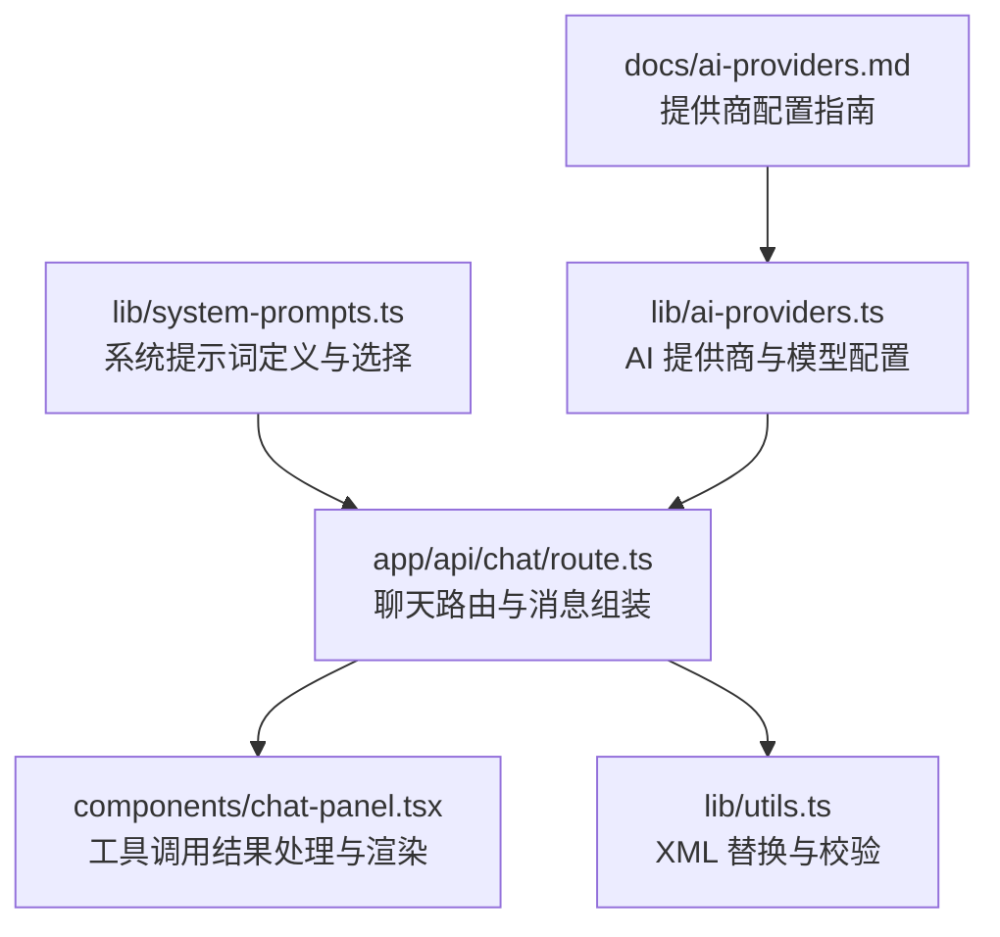
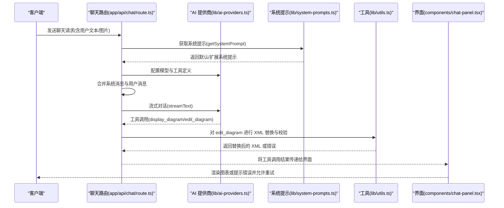
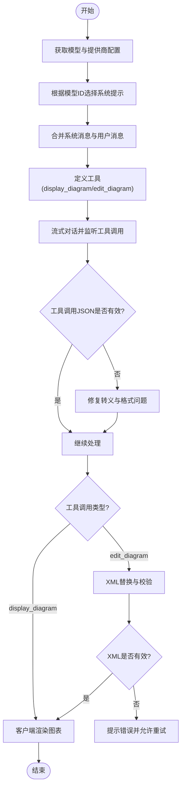
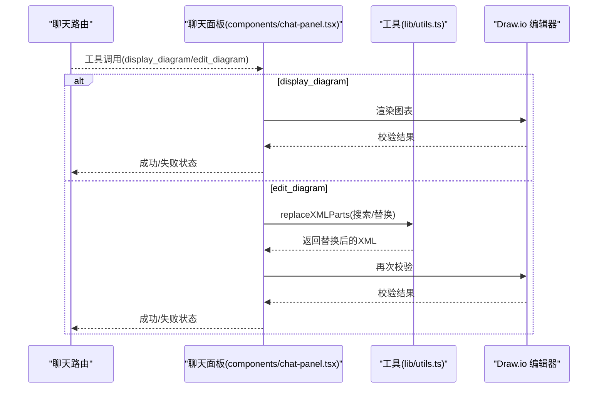
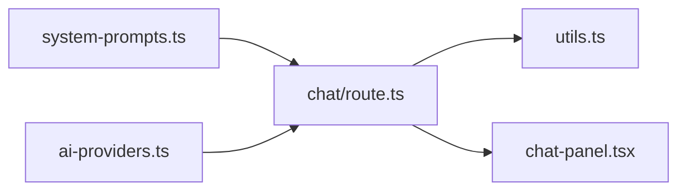

# 系统提示词设计

<cite>
**本文引用的文件**
- [lib/system-prompts.ts](file://lib/system-prompts.ts)
- [app/api/chat/route.ts](file://app/api/chat/route.ts)
- [lib/ai-providers.ts](file://lib/ai-providers.ts)
- [docs/ai-providers.md](file://docs/ai-providers.md)
- [lib/utils.ts](file://lib/utils.ts)
- [components/chat-panel.tsx](file://components/chat-panel.tsx)
</cite>

## 目录
1. [引言](#引言)
2. [项目结构](#项目结构)
3. [核心组件](#核心组件)
4. [架构总览](#架构总览)
5. [详细组件分析](#详细组件分析)
6. [依赖关系分析](#依赖关系分析)
7. [性能考量](#性能考量)
8. [故障排查指南](#故障排查指南)
9. [结论](#结论)

## 引言
本文件围绕 lib/system-prompts.ts 中定义的系统提示词架构进行深入解析，重点说明：
- 主系统提示（MAIN_SYSTEM_PROMPT）如何引导模型理解 draw.io XML 结构生成任务，包括图表元素定义、连接规则和命名规范；
- 工具调用提示（TOOL_PROMPTS）的设计原则及其与模型工具调用能力的协同机制；
- 多模型适配策略，尤其是针对不同 AI 提供商（OpenAI、Anthropic 等）的提示词微调方法；
- 结合 app/api/chat/route.ts 的实际调用流程，展示提示词如何注入到聊天请求中，并讨论提示词优化对生成质量的影响。

## 项目结构
系统提示词与聊天 API 调用紧密协作，形成“提示词注入 + 工具调用 + 客户端渲染”的闭环。关键文件与职责如下：
- lib/system-prompts.ts：定义默认与扩展系统提示词，按模型能力选择提示词版本，并提供获取函数；
- app/api/chat/route.ts：负责将系统提示词与用户消息合并为模型消息，配置工具定义与修复逻辑，发起流式对话；
- lib/ai-providers.ts：根据环境变量自动检测或显式指定 AI 提供商与模型，注入特定头信息与参数；
- lib/utils.ts：提供 XML 替换与校验工具，支撑 edit_diagram 的精确修改；
- components/chat-panel.tsx：在客户端接收工具调用结果，执行显示/编辑操作并反馈错误。

**图示来源**
- [lib/system-prompts.ts](file://lib/system-prompts.ts#L1-L371)
- [app/api/chat/route.ts](file://app/api/chat/route.ts#L1-L495)
- [lib/ai-providers.ts](file://lib/ai-providers.ts#L1-L286)
- [lib/utils.ts](file://lib/utils.ts#L240-L506)
- [components/chat-panel.tsx](file://components/chat-panel.tsx#L150-L259)
- [docs/ai-providers.md](file://docs/ai-providers.md#L1-L169)

**章节来源**
- [lib/system-prompts.ts](file://lib/system-prompts.ts#L1-L371)
- [app/api/chat/route.ts](file://app/api/chat/route.ts#L1-L495)
- [lib/ai-providers.ts](file://lib/ai-providers.ts#L1-L286)
- [lib/utils.ts](file://lib/utils.ts#L240-L506)
- [components/chat-panel.tsx](file://components/chat-panel.tsx#L150-L259)
- [docs/ai-providers.md](file://docs/ai-providers.md#L1-L169)

## 核心组件
- 默认系统提示（DEFAULT_SYSTEM_PROMPT）：约 2700 令牌，覆盖应用上下文、功能说明、工具清单、核心能力、布局约束、XML 结构参考与规则等，适用于所有模型。
- 扩展系统提示（EXTENDED_SYSTEM_PROMPT）：在默认提示基础上追加约 1800 令牌，包含更详细的工具参考、最佳实践、边路由规则与示例，用于具备更高缓存令牌最小值的模型（如 Opus 4.5、Haiku 4.5）。
- 模型适配函数（getSystemPrompt）：依据模型 ID 判断是否使用扩展提示，并替换占位符（如模型名），返回最终系统提示字符串。

这些组件共同确保模型在生成 draw.io XML 时具备清晰的结构约束、严格的工具调用规范与可执行的布局策略。

**章节来源**
- [lib/system-prompts.ts](file://lib/system-prompts.ts#L6-L134)
- [lib/system-prompts.ts](file://lib/system-prompts.ts#L135-L334)
- [lib/system-prompts.ts](file://lib/system-prompts.ts#L335-L371)

## 架构总览
系统提示词通过聊天路由注入到模型消息中，配合工具定义与修复机制，驱动模型以工具调用方式输出合法的 draw.io XML。客户端在收到工具调用后，执行显示或编辑操作，并将错误反馈给模型以便重试。

**图示来源**
- [app/api/chat/route.ts](file://app/api/chat/route.ts#L215-L474)
- [lib/system-prompts.ts](file://lib/system-prompts.ts#L348-L370)
- [lib/ai-providers.ts](file://lib/ai-providers.ts#L112-L286)
- [lib/utils.ts](file://lib/utils.ts#L240-L506)
- [components/chat-panel.tsx](file://components/chat-panel.tsx#L150-L259)

## 详细组件分析

### 主系统提示（MAIN_SYSTEM_PROMPT）设计要点
- 应用上下文与功能边界：明确模型在 Web 应用中的角色（左右面板、图像上传、历史记录、主题切换、导出等），帮助模型理解交互场景。
- 工具清单与使用原则：列出 display_diagram 与 edit_diagram 两个工具，强调何时使用哪个工具（新建/重大变更用 display_diagram；小范围修改用 edit_diagram）。
- 核心能力与约束：强调生成有效、格式正确的 draw.io XML，避免重叠与交叉，保持单页视口，限定坐标范围与容器尺寸，使用紧凑布局。
- XML 结构参考与规则：要求根节点包含 id="0" 与 id="1"，mxCell 必须直接作为 root 子节点，ID 唯一且 parent 指向现有单元，边的 source/target 必须引用现有 ID；禁止注释，避免 JSON 转义问题。
- 边连接规则与最佳实践：明确边路由的七条规则（避免路径重叠、双向连接使用相反侧、显式设置出口/入口点、障碍规避、分层布局、多拐点、自然连接点），并给出示例与验证清单。
- JSON 转义与模式匹配：强调 edit_diagram 的搜索/替换必须严格复制当前 XML 的完整行，保留属性顺序与空白，必要时进行多次重试或回退到 display_diagram。

这些规则共同构成模型生成 XML 的“行为契约”，确保输出可被客户端正确解析与渲染。

**章节来源**
- [lib/system-prompts.ts](file://lib/system-prompts.ts#L6-L134)
- [lib/system-prompts.ts](file://lib/system-prompts.ts#L135-L334)

### 工具调用提示（TOOL_PROMPTS）设计原则
- 明确工具用途与输入约束：display_diagram 要求 XML 在 <root> 标签内，且满足结构与转义规则；edit_diagram 要求搜索/替换模式精确匹配当前 XML 的完整行，属性顺序不可改变。
- 最佳实践与错误恢复：建议包含足够的上下文行，拆分大改动为多个小编辑，若失败按顺序尝试修正属性顺序、扩大上下文、仅匹配前缀、最后回退到重新生成。
- JSON 转义：强调双引号在 JSON 字符串值中必须转义，避免解析错误。

这些提示与客户端工具定义相辅相成，确保模型在工具调用时遵循严格的格式与匹配规则。

**章节来源**
- [app/api/chat/route.ts](file://app/api/chat/route.ts#L393-L471)
- [lib/system-prompts.ts](file://lib/system-prompts.ts#L174-L240)

### 多模型适配策略
- 模型能力差异：部分模型（如 Opus 4.5、Haiku 4.5）具有更高的缓存令牌最小值，需要更长的系统提示以充分利用上下文窗口。
- 自动选择机制：getSystemPrompt 基于模型 ID 是否包含特定模式（如 claude-opus-4-5、claude-haiku-4-5）决定使用扩展提示；其他模型使用默认提示。
- 提供商与模型配置：lib/ai-providers.ts 支持多种提供商（OpenAI、Anthropic、Google、Azure、Bedrock、OpenRouter、DeepSeek、SiliconFlow、Ollama），并根据环境变量自动检测或显式指定，同时为特定提供商注入必要的头信息或参数（例如 Anthropic 的细粒度工具流式 beta 头）。

该策略确保在不同提供商与模型上均能稳定运行，并最大化提示词的有效性。

**章节来源**
- [lib/system-prompts.ts](file://lib/system-prompts.ts#L335-L371)
- [lib/ai-providers.ts](file://lib/ai-providers.ts#L112-L286)
- [docs/ai-providers.md](file://docs/ai-providers.md#L1-L169)

### 提示词注入与调用链路（结合 app/api/chat/route.ts）
- 系统提示注入：聊天路由在构建消息时，先添加“静态指令”（系统提示）与“当前 XML 上下文”（系统消息），再拼接用户消息与历史消息，形成完整的对话上下文。
- 工具定义与修复：在工具定义中明确 display_diagram 与 edit_diagram 的输入约束；当模型输出的工具调用 JSON 存在未转义引号等格式问题时，路由内置修复器会尝试修复后再提交。
- 缓存策略：为 Bedrock 等提供商设置多个缓存断点，静态指令与当前 XML 上下文分别缓存，提升重复请求的效率。
- 温度控制：支持通过环境变量设置温度，便于在确定性与创造性之间权衡。

**图示来源**
- [app/api/chat/route.ts](file://app/api/chat/route.ts#L215-L474)
- [lib/system-prompts.ts](file://lib/system-prompts.ts#L348-L370)
- [lib/utils.ts](file://lib/utils.ts#L240-L506)

**章节来源**
- [app/api/chat/route.ts](file://app/api/chat/route.ts#L215-L474)

### 客户端工具调用处理（components/chat-panel.tsx）
- display_diagram：当模型调用该工具时，客户端先进行 XML 校验，若失败则返回错误并附带失败 XML，提示修复后重试；成功则渲染图表。
- edit_diagram：从缓存或导出获取当前 XML，调用 lib/utils.ts 的 replaceXMLParts 进行精确替换，随后再次校验；若失败则提示调整搜索模式或改用 display_diagram；成功则反馈已应用的编辑数量。
- 错误传播与自动重试：当工具调用返回错误时，客户端将其作为系统消息加入对话，触发模型自动重试。

**图示来源**
- [components/chat-panel.tsx](file://components/chat-panel.tsx#L150-L259)
- [lib/utils.ts](file://lib/utils.ts#L240-L506)

**章节来源**
- [components/chat-panel.tsx](file://components/chat-panel.tsx#L150-L259)
- [lib/utils.ts](file://lib/utils.ts#L240-L506)

## 依赖关系分析
- lib/system-prompts.ts 依赖于模型 ID 与环境变量，决定使用默认或扩展提示；
- app/api/chat/route.ts 依赖系统提示、AI 提供商配置、工具定义与修复器；
- lib/utils.ts 为 edit_diagram 的精确替换与校验提供底层支持；
- components/chat-panel.tsx 依赖工具调用结果与渲染逻辑。

**图示来源**
- [lib/system-prompts.ts](file://lib/system-prompts.ts#L348-L370)
- [app/api/chat/route.ts](file://app/api/chat/route.ts#L215-L474)
- [lib/ai-providers.ts](file://lib/ai-providers.ts#L112-L286)
- [lib/utils.ts](file://lib/utils.ts#L240-L506)
- [components/chat-panel.tsx](file://components/chat-panel.tsx#L150-L259)

**章节来源**
- [lib/system-prompts.ts](file://lib/system-prompts.ts#L348-L370)
- [app/api/chat/route.ts](file://app/api/chat/route.ts#L215-L474)
- [lib/ai-providers.ts](file://lib/ai-providers.ts#L112-L286)
- [lib/utils.ts](file://lib/utils.ts#L240-L506)
- [components/chat-panel.tsx](file://components/chat-panel.tsx#L150-L259)

## 性能考量
- 提示词长度与缓存：扩展提示词（约 4500 令牌）更适合具备更高缓存令牌最小值的模型；默认提示词（约 2700 令牌）保证通用兼容性。
- 缓存断点：聊天路由为 Bedrock 设置“静态指令”和“当前 XML 上下文”两处缓存断点，减少重复计算与网络往返。
- 工具调用修复：内置修复器可自动修复常见的 JSON 转义问题，降低因格式错误导致的重试成本。
- 温度设置：通过环境变量控制温度，平衡确定性与创造性，有助于提高生成质量与稳定性。

[本节为通用性能讨论，不直接分析具体文件]

## 故障排查指南
- XML 结构错误：当边连接无效、mxCell 嵌套、重复 ID、孤儿节点或边源/目标引用不存在时，校验器会返回明确的错误信息。请根据提示修复并重试。
- edit_diagram 搜索模式不匹配：若提示“搜索模式未找到”，检查是否包含完整行、属性顺序是否一致、是否包含足够的上下文行；必要时按提示逐步调整。
- JSON 转义问题：当工具调用 JSON 包含未转义的双引号时，路由会尝试修复；若仍失败，请检查工具调用输入格式。
- 图像到图表：当用户上传图片时，模型需匹配线条与形状风格；请确保图片清晰并尽量包含完整结构。

**章节来源**
- [lib/utils.ts](file://lib/utils.ts#L508-L643)
- [app/api/chat/route.ts](file://app/api/chat/route.ts#L355-L379)
- [components/chat-panel.tsx](file://components/chat-panel.tsx#L150-L259)

## 结论
lib/system-prompts.ts 通过默认与扩展系统提示词的差异化设计，结合 app/api/chat/route.ts 的消息注入与工具修复机制，形成了面向 draw.io XML 生成的高鲁棒性提示词体系。该体系在不同 AI 提供商与模型上均能稳定工作，并通过严格的 XML 规则、边路由策略与工具调用约束，显著提升生成质量与可维护性。建议在实际部署中：
- 根据模型能力选择合适的提示词版本；
- 使用缓存断点与工具修复器降低错误率；
- 在客户端完善错误反馈与重试逻辑；
- 结合提供商配置指南合理设置环境变量与温度参数。

[本节为总结性内容，不直接分析具体文件]