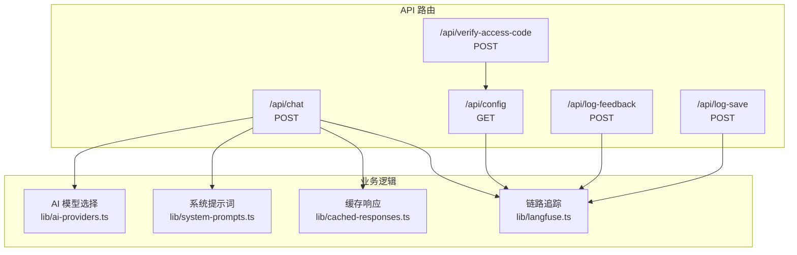
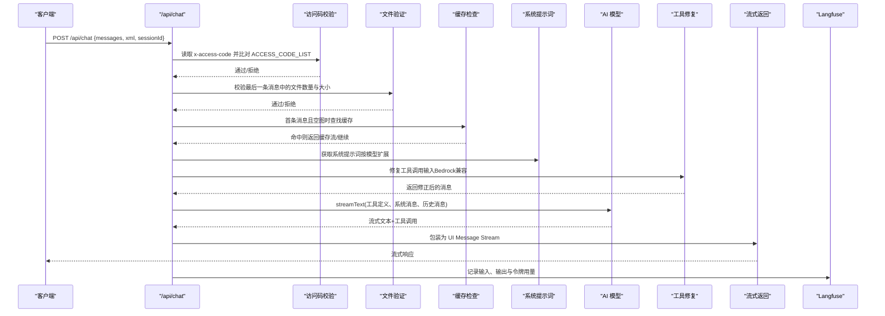
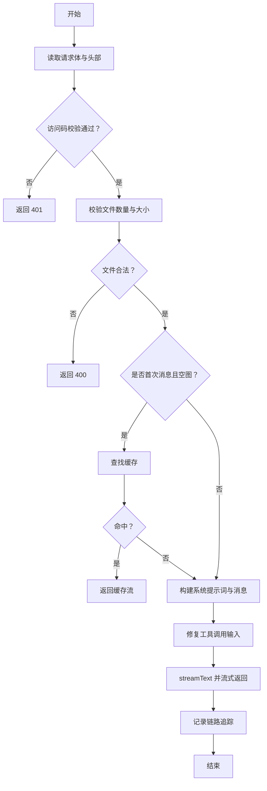
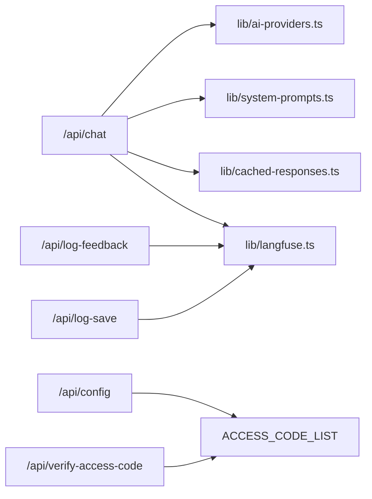

# API端点

<cite>
**本文引用的文件**
- [app/api/chat/route.ts](file://app/api/chat/route.ts)
- [app/api/config/route.ts](file://app/api/config/route.ts)
- [app/api/verify-access-code/route.ts](file://app/api/verify-access-code/route.ts)
- [app/api/log-feedback/route.ts](file://app/api/log-feedback/route.ts)
- [app/api/log-save/route.ts](file://app/api/log-save/route.ts)
- [lib/ai-providers.ts](file://lib/ai-providers.ts)
- [lib/cached-responses.ts](file://lib/cached-responses.ts)
- [lib/langfuse.ts](file://lib/langfuse.ts)
- [lib/system-prompts.ts](file://lib/system-prompts.ts)
- [env.example](file://env.example)
</cite>

## 目录
1. [简介](#简介)
2. [项目结构](#项目结构)
3. [核心组件](#核心组件)
4. [架构总览](#架构总览)
5. [详细组件分析](#详细组件分析)
6. [依赖关系分析](#依赖关系分析)
7. [性能考量](#性能考量)
8. [故障排查指南](#故障排查指南)
9. [结论](#结论)

## 简介
本文件为 next-ai-draw-io 的后端 API 文档，聚焦以下端点：
- /api/chat：接收自然语言与可选图片，流式返回 draw.io XML，并通过工具调用在客户端渲染或编辑图。
- /api/config：返回访问控制配置（是否需要访问码）。
- /api/verify-access-code：校验访问码有效性。
- /api/log-feedback：记录用户反馈评分，关联到会话链路。
- /api/log-save：记录用户保存操作，关联到会话链路。

文档将说明各端点的 HTTP 方法、请求/响应结构、错误码、数据流与安全策略一致性，并给出关键流程的时序与类图。

## 项目结构
API 路由位于 app/api 下，按功能拆分；核心能力由 lib 下的 AI 提供商、缓存、Langfuse 链路追踪与系统提示词模块支撑。

图表来源
- [app/api/chat/route.ts](file://app/api/chat/route.ts#L1-L495)
- [app/api/config/route.ts](file://app/api/config/route.ts#L1-L13)
- [app/api/verify-access-code/route.ts](file://app/api/verify-access-code/route.ts#L1-L33)
- [app/api/log-feedback/route.ts](file://app/api/log-feedback/route.ts#L1-L113)
- [app/api/log-save/route.ts](file://app/api/log-save/route.ts#L1-L72)
- [lib/ai-providers.ts](file://lib/ai-providers.ts#L1-L286)
- [lib/system-prompts.ts](file://lib/system-prompts.ts#L1-L371)
- [lib/cached-responses.ts](file://lib/cached-responses.ts#L1-L562)
- [lib/langfuse.ts](file://lib/langfuse.ts#L1-L108)

章节来源
- [app/api/chat/route.ts](file://app/api/chat/route.ts#L1-L495)
- [app/api/config/route.ts](file://app/api/config/route.ts#L1-L13)
- [app/api/verify-access-code/route.ts](file://app/api/verify-access-code/route.ts#L1-L33)
- [app/api/log-feedback/route.ts](file://app/api/log-feedback/route.ts#L1-L113)
- [app/api/log-save/route.ts](file://app/api/log-save/route.ts#L1-L72)
- [lib/ai-providers.ts](file://lib/ai-providers.ts#L1-L286)
- [lib/cached-responses.ts](file://lib/cached-responses.ts#L1-L562)
- [lib/langfuse.ts](file://lib/langfuse.ts#L1-L108)
- [lib/system-prompts.ts](file://lib/system-prompts.ts#L1-L371)

## 核心组件
- 访问控制：通过环境变量 ACCESS_CODE_LIST 控制，支持在 /api/config 中查询是否启用，在 /api/verify-access-code 中校验。
- AI 模型选择：根据 AI_PROVIDER 与 AI_MODEL 自动检测或显式指定，支持多提供商与本地 Ollama。
- 缓存机制：针对首次消息且空图场景，基于文本与是否含图片进行命中，命中后直接返回缓存流。
- 工具调用：定义 display_diagram 与 edit_diagram 两个工具，用于在客户端渲染或精准编辑 XML。
- 链路追踪：使用 Langfuse 进行输入输出记录与令牌用量上报，支持会话与用户标识。

章节来源
- [app/api/chat/route.ts](file://app/api/chat/route.ts#L1-L495)
- [app/api/config/route.ts](file://app/api/config/route.ts#L1-L13)
- [app/api/verify-access-code/route.ts](file://app/api/verify-access-code/route.ts#L1-L33)
- [lib/ai-providers.ts](file://lib/ai-providers.ts#L1-L286)
- [lib/cached-responses.ts](file://lib/cached-responses.ts#L1-L562)
- [lib/langfuse.ts](file://lib/langfuse.ts#L1-L108)
- [lib/system-prompts.ts](file://lib/system-prompts.ts#L1-L371)

## 架构总览
下图展示 /api/chat 的关键处理链路：访问码校验、文件验证、缓存检查、系统提示词注入、模型调用、工具修复、流式返回与链路追踪。

图表来源
- [app/api/chat/route.ts](file://app/api/chat/route.ts#L145-L474)
- [lib/system-prompts.ts](file://lib/system-prompts.ts#L348-L371)
- [lib/cached-responses.ts](file://lib/cached-responses.ts#L551-L562)
- [lib/langfuse.ts](file://lib/langfuse.ts#L29-L76)

## 详细组件分析

### /api/chat（POST）
- 功能概述
  - 接收用户消息（文本与可选图片）、当前 diagram XML 与会话标识，流式返回 draw.io XML。
  - 支持访问码校验、文件大小/数量限制、缓存命中、系统提示词注入、工具修复与链路追踪。
- 请求体字段
  - messages: 数组，每项包含 parts（文本与文件），最后一项为用户输入。
  - xml: 当前 diagram 的 XML 字符串（可能为空）。
  - sessionId: 字符串，最长 200 字符，用于链路追踪。
- 响应
  - 流式响应，类型为 UI Message Stream，包含工具输入事件与完成事件。
- 关键处理流程
  - 访问码校验：若配置了 ACCESS_CODE_LIST，则必须在请求头 x-access-code 中携带有效值。
  - 文件验证：限制最多 5 张，单张不超过 2MB（按 data URL 解码后大小计算）。
  - 缓存检查：仅当为首次消息且 xml 为空或极简时，基于文本与是否含图片查找缓存，命中则直接返回缓存流。
  - 系统提示词：根据模型 ID 决定使用默认或扩展版系统提示词，分两段注入以优化缓存。
  - 工具修复：针对 Bedrock 的工具调用输入进行 JSON 对象化修复，避免字符串导致解析失败。
  - 流式返回：使用 AI SDK 的 streamText，定义 display_diagram 与 edit_diagram 两个工具，支持修复工具调用 JSON。
  - 链路追踪：记录输入文本、sessionId、userId，并在结束时上报输出与令牌用量。
- 错误码
  - 401：访问码缺失或无效。
  - 400：文件数量过多或单文件过大。
  - 500：内部错误。
- 安全与一致性
  - 访问码策略与 /api/config 一致，均来自 ACCESS_CODE_LIST。
  - 链路追踪使用 sessionId 与 x-forwarded-for 提取的 IP 作为 userId，确保跨端点一致性。
- 调用示例
  - curl -X POST http://host/api/chat -H "Content-Type: application/json" -H "x-access-code: YOUR_CODE" -d '{"messages":[{"role":"user","parts":[{"type":"text","text":"画个流程图"},{"type":"file","url":"data:image/png;base64,...","mediaType":"image/png"}]}],"xml":"","sessionId":"session-123"}'

图表来源
- [app/api/chat/route.ts](file://app/api/chat/route.ts#L145-L474)
- [lib/cached-responses.ts](file://lib/cached-responses.ts#L551-L562)
- [lib/system-prompts.ts](file://lib/system-prompts.ts#L348-L371)
- [lib/langfuse.ts](file://lib/langfuse.ts#L29-L76)

章节来源
- [app/api/chat/route.ts](file://app/api/chat/route.ts#L1-L495)
- [lib/ai-providers.ts](file://lib/ai-providers.ts#L1-L286)
- [lib/cached-responses.ts](file://lib/cached-responses.ts#L1-L562)
- [lib/langfuse.ts](file://lib/langfuse.ts#L1-L108)
- [lib/system-prompts.ts](file://lib/system-prompts.ts#L1-L371)

### /api/config（GET）
- 功能概述
  - 返回前端访问控制配置：accessCodeRequired（布尔）。
- 响应体
  - accessCodeRequired: 若环境变量 ACCESS_CODE_LIST 存在且非空，则为 true。
- 调用示例
  - curl http://host/api/config

章节来源
- [app/api/config/route.ts](file://app/api/config/route.ts#L1-L13)
- [env.example](file://env.example#L61-L63)

### /api/verify-access-code（POST）
- 功能概述
  - 校验请求头 x-access-code 是否在 ACCESS_CODE_LIST 中。
- 响应体
  - valid: 布尔，true 表示有效。
  - message: 字符串，说明原因。
- 错误码
  - 401：缺少访问码或无效。
- 调用示例
  - curl -X POST http://host/api/verify-access-code -H "x-access-code: YOUR_CODE"

章节来源
- [app/api/verify-access-code/route.ts](file://app/api/verify-access-code/route.ts#L1-L33)
- [env.example](file://env.example#L61-L63)

### /api/log-feedback（POST）
- 功能概述
  - 记录用户反馈评分（good/bad），尝试附加到最近一次聊天 trace，否则创建独立 trace。
- 请求体字段
  - messageId: 字符串，最长 200。
  - feedback: 枚举 "good" 或 "bad"。
  - sessionId: 可选，最长 200。
- 响应体
  - success: 布尔。
  - logged: 布尔，是否成功附加到现有 trace。
- 错误码
  - 400：输入校验失败。
  - 500：Langfuse 写入失败。
- 调用示例
  - curl -X POST http://host/api/log-feedback -H "Content-Type: application/json" -d '{"messageId":"msg-1","feedback":"good","sessionId":"session-123"}'

章节来源
- [app/api/log-feedback/route.ts](file://app/api/log-feedback/route.ts#L1-L113)
- [lib/langfuse.ts](file://lib/langfuse.ts#L1-L108)

### /api/log-save（POST）
- 功能概述
  - 记录用户保存操作（文件名与格式），尝试附加到最近一次聊天 trace。
- 请求体字段
  - filename: 字符串，最长 255。
  - format: 枚举 "drawio"|"png"|"svg"。
  - sessionId: 可选，最长 200。
- 响应体
  - success: 布尔。
  - logged: 布尔，是否存在对应 trace。
- 错误码
  - 400：输入校验失败。
  - 500：Langfuse 写入失败。
- 调用示例
  - curl -X POST http://host/api/log-save -H "Content-Type: application/json" -d '{"filename":"my-diagram","format":"drawio","sessionId":"session-123"}'

章节来源
- [app/api/log-save/route.ts](file://app/api/log-save/route.ts#L1-L72)
- [lib/langfuse.ts](file://lib/langfuse.ts#L1-L108)

## 依赖关系分析
- /api/chat 依赖
  - 访问码：来自 ACCESS_CODE_LIST。
  - AI 模型：lib/ai-providers.ts，支持多提供商与本地 Ollama。
  - 系统提示词：lib/system-prompts.ts，按模型选择默认或扩展版本。
  - 缓存：lib/cached-responses.ts，命中后直接返回缓存流。
  - 链路追踪：lib/langfuse.ts，记录输入、输出与令牌用量。
- /api/config 与 /api/verify-access-code 共享 ACCESS_CODE_LIST。
- 日志端点（/api/log-feedback、/api/log-save）共享 Langfuse 客户端与 trace 查询逻辑。

图表来源
- [app/api/chat/route.ts](file://app/api/chat/route.ts#L1-L495)
- [lib/ai-providers.ts](file://lib/ai-providers.ts#L1-L286)
- [lib/system-prompts.ts](file://lib/system-prompts.ts#L1-L371)
- [lib/cached-responses.ts](file://lib/cached-responses.ts#L1-L562)
- [lib/langfuse.ts](file://lib/langfuse.ts#L1-L108)
- [app/api/config/route.ts](file://app/api/config/route.ts#L1-L13)
- [app/api/verify-access-code/route.ts](file://app/api/verify-access-code/route.ts#L1-L33)

章节来源
- [app/api/chat/route.ts](file://app/api/chat/route.ts#L1-L495)
- [lib/ai-providers.ts](file://lib/ai-providers.ts#L1-L286)
- [lib/system-prompts.ts](file://lib/system-prompts.ts#L1-L371)
- [lib/cached-responses.ts](file://lib/cached-responses.ts#L1-L562)
- [lib/langfuse.ts](file://lib/langfuse.ts#L1-L108)
- [app/api/config/route.ts](file://app/api/config/route.ts#L1-L13)
- [app/api/verify-access-code/route.ts](file://app/api/verify-access-code/route.ts#L1-L33)

## 性能考量
- 缓存命中：首次消息且空图时优先命中缓存，减少模型调用与网络开销。
- 系统提示词分段：将静态指令与当前 XML 上下文分别注入，提升缓存复用率。
- 流式返回：使用 AI SDK 流式接口，降低首字节延迟。
- 工具修复：自动修复 Bedrock 的工具调用输入，避免重试与失败成本。
- 令牌用量：Bedrock 流式不自动上报令牌，手动设置属性以便链路追踪统计。

[本节为通用建议，无需代码来源]

## 故障排查指南
- 访问码相关
  - 现象：返回 401。
  - 排查：确认已设置 ACCESS_CODE_LIST，请求头 x-access-code 是否正确传递。
- 文件上传相关
  - 现象：返回 400（文件过多/超限）。
  - 排查：确认文件数量 ≤ 5，单文件解码后大小 ≤ 2MB。
- 模型配置相关
  - 现象：启动时报错“未配置 AI_PROVIDER/AI_MODEL”或“多个提供商配置冲突”。
  - 排查：设置 AI_PROVIDER 与 AI_MODEL，或明确指定单一提供商。
- Langfuse 相关
  - 现象：日志端点返回 logged=false 或 500。
  - 排查：确认已配置 LANGFUSE_PUBLIC_KEY/LANGFUSE_SECRET_KEY，且网络可达；检查 trace 查询权限。
- /api/chat 内部错误
  - 现象：返回 500。
  - 排查：查看服务端日志，定位异常堆栈；检查模型可用性与网络连通性。

章节来源
- [app/api/chat/route.ts](file://app/api/chat/route.ts#L145-L474)
- [app/api/verify-access-code/route.ts](file://app/api/verify-access-code/route.ts#L1-L33)
- [app/api/log-feedback/route.ts](file://app/api/log-feedback/route.ts#L1-L113)
- [app/api/log-save/route.ts](file://app/api/log-save/route.ts#L1-L72)
- [lib/ai-providers.ts](file://lib/ai-providers.ts#L1-L286)
- [lib/langfuse.ts](file://lib/langfuse.ts#L1-L108)

## 结论
- /api/chat 是核心入口，整合访问控制、文件校验、缓存、系统提示词、工具修复与链路追踪，保证稳定与高性能。
- /api/config 与 /api/verify-access-code 提供统一的访问码策略，确保前后端一致。
- 日志端点通过 Langfuse 将用户行为与会话链路关联，便于后续分析与优化。
- 建议在生产环境开启 Langfuse 与访问码，并合理设置温度与模型参数以平衡质量与成本。