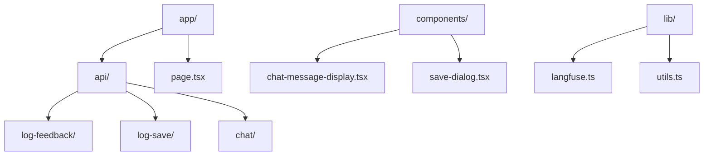
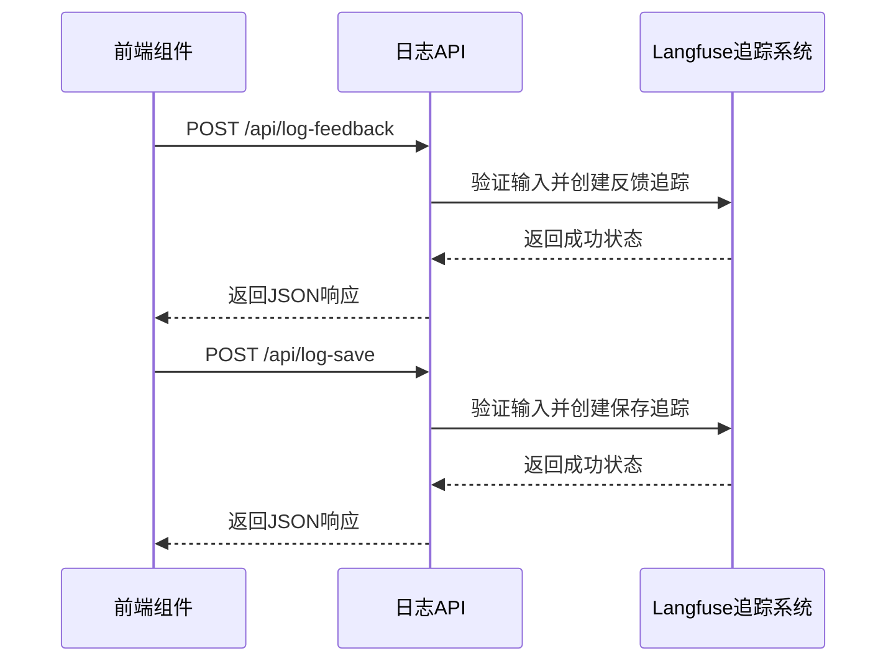
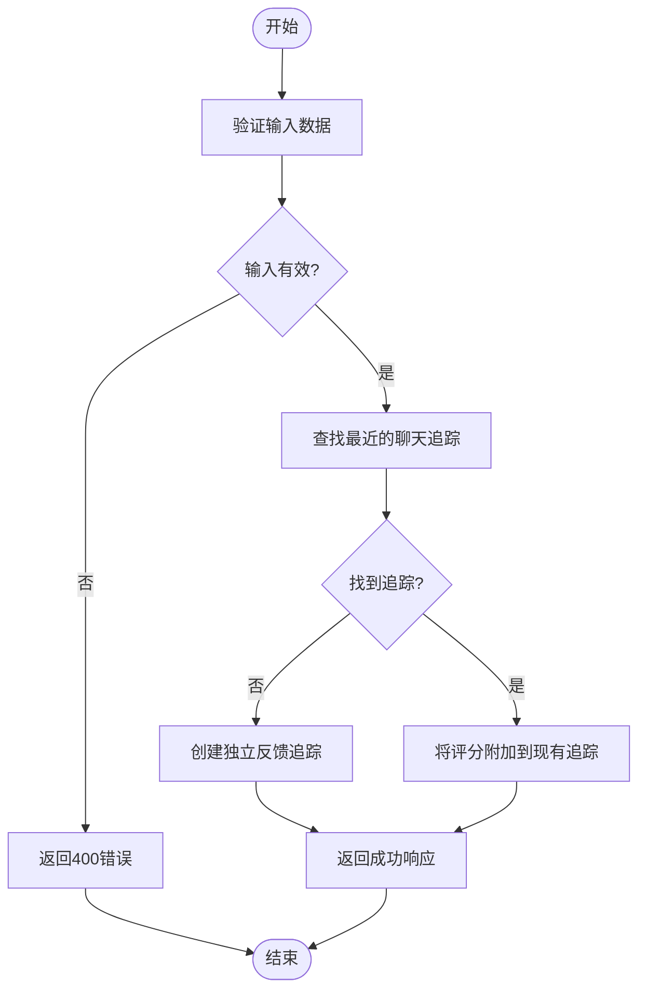
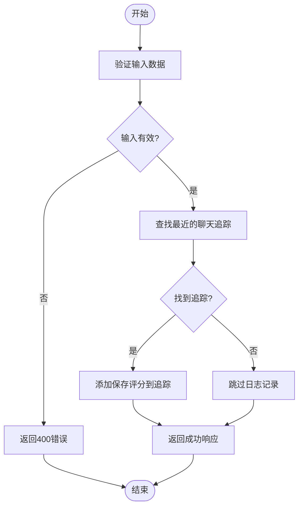
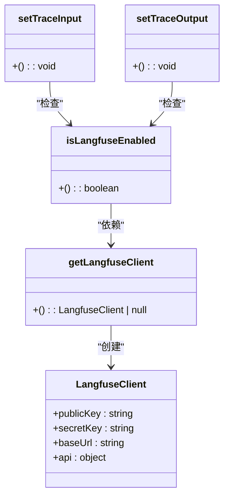
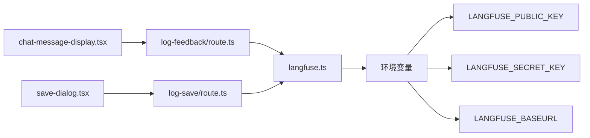

# 日志服务

<cite>
**本文档引用的文件**  
- [log-feedback/route.ts](file://app/api/log-feedback/route.ts)
- [log-save/route.ts](file://app/api/log-save/route.ts)
- [langfuse.ts](file://lib/langfuse.ts)
- [chat-message-display.tsx](file://components/chat-message-display.tsx)
- [save-dialog.tsx](file://components/save-dialog.tsx)
- [env.example](file://env.example)
</cite>

## 目录
1. [简介](#简介)
2. [项目结构](#项目结构)
3. [核心组件](#核心组件)
4. [架构概述](#架构概述)
5. [详细组件分析](#详细组件分析)
6. [依赖分析](#依赖分析)
7. [性能考量](#性能考量)
8. [故障排除指南](#故障排除指南)
9. [结论](#结论)

## 简介
本项目是一个基于Next.js的AI驱动图表创建工具，允许用户通过自然语言命令生成和修改draw.io图表。系统集成了两个关键的日志记录API端点：/log-feedback和/log-save，用于收集用户反馈和图表保存事件。这些日志数据通过Langfuse追踪系统进行收集和分析，以支持后续的模型优化和用户体验改进。系统强调数据隐私保护、日志脱敏处理和传输安全性。

## 项目结构

**Diagram sources**
- [app/api/log-feedback/route.ts](file://app/api/log-feedback/route.ts)
- [app/api/log-save/route.ts](file://app/api/log-save/route.ts)
- [components/chat-message-display.tsx](file://components/chat-message-display.tsx)
- [components/save-dialog.tsx](file://components/save-dialog.tsx)

**Section sources**
- [app/api/log-feedback/route.ts](file://app/api/log-feedback/route.ts)
- [app/api/log-save/route.ts](file://app/api/log-save/route.ts)

## 核心组件

本项目的核心组件包括两个日志记录API端点：/log-feedback和/log-save。/log-feedback端点用于收集用户对AI生成结果的反馈（如点赞/点踩），而/log-save端点用于记录图表保存事件。这两个端点都依赖于Langfuse追踪系统来持久化数据，并通过环境变量进行配置。系统还包含前端组件来触发这些API调用，如聊天消息显示组件和保存对话框组件。

**Section sources**
- [log-feedback/route.ts](file://app/api/log-feedback/route.ts)
- [log-save/route.ts](file://app/api/log-save/route.ts)
- [langfuse.ts](file://lib/langfuse.ts)

## 架构概述

**Diagram sources**
- [log-feedback/route.ts](file://app/api/log-feedback/route.ts)
- [log-save/route.ts](file://app/api/log-save/route.ts)
- [langfuse.ts](file://lib/langfuse.ts)

## 详细组件分析

### /log-feedback端点分析

/log-feedback端点用于收集用户对AI生成结果的反馈。当用户点击点赞或点踩按钮时，前端组件会调用此API。该端点验证输入数据，包括消息ID、反馈类型（好/坏）和会话ID。如果配置了Langfuse，它会将反馈作为评分附加到最近的聊天追踪上，或者创建一个独立的反馈追踪。用户IP地址被用于匿名追踪。

**Diagram sources**
- [log-feedback/route.ts](file://app/api/log-feedback/route.ts)

**Section sources**
- [log-feedback/route.ts](file://app/api/log-feedback/route.ts)
- [chat-message-display.tsx](file://components/chat-message-display.tsx)

### /log-save端点分析

/log-save端点用于记录用户保存图表的事件。当用户通过保存对话框保存图表时，前端会调用此API。该端点验证文件名、格式和会话ID。如果找到相关的聊天追踪，它会添加一个"diagram-saved"评分来标记用户已保存图表。这有助于分析用户行为和功能使用情况。

**Diagram sources**
- [log-save/route.ts](file://app/api/log-save/route.ts)

**Section sources**
- [log-save/route.ts](file://app/api/log-save/route.ts)
- [save-dialog.tsx](file://components/save-dialog.tsx)

### Langfuse集成分析

Langfuse集成通过lib/langfuse.ts文件实现。该模块提供了一个单例的Langfuse客户端，用于与Langfuse追踪系统进行通信。它检查必要的环境变量（LANGFUSE_PUBLIC_KEY和LANGFUSE_SECRET_KEY）来确定是否启用追踪功能。系统使用Langfuse的API来创建追踪、添加评分和管理会话数据。

**Diagram sources**
- [langfuse.ts](file://lib/langfuse.ts)

**Section sources**
- [langfuse.ts](file://lib/langfuse.ts)
- [env.example](file://env.example)

## 依赖分析

**Diagram sources**
- [log-feedback/route.ts](file://app/api/log-feedback/route.ts)
- [log-save/route.ts](file://app/api/log-save/route.ts)
- [langfuse.ts](file://lib/langfuse.ts)
- [chat-message-display.tsx](file://components/chat-message-display.tsx)
- [save-dialog.tsx](file://components/save-dialog.tsx)

**Section sources**
- [package.json](file://package.json)
- [env.example](file://env.example)

## 性能考量

日志记录API的调用频率应根据实际需求进行管理。建议在用户交互后立即调用，但避免在短时间内重复调用相同的事件。由于这些API依赖于外部的Langfuse服务，网络延迟可能会影响响应时间。系统已实现错误处理机制，在Langfuse服务不可用时不会中断主应用功能。对于高流量场景，可以考虑实现日志批处理或队列机制来优化性能。

## 故障排除指南

常见问题包括环境变量配置错误、网络连接问题和输入验证失败。确保正确设置LANGFUSE_PUBLIC_KEY和LANGFUSE_SECRET_KEY环境变量。如果日志记录失败，检查服务器日志中的错误信息。前端调用应处理网络错误，避免因日志API故障影响用户体验。对于输入验证错误，确保请求体符合指定的模式要求。

**Section sources**
- [log-feedback/route.ts](file://app/api/log-feedback/route.ts)
- [log-save/route.ts](file://app/api/log-save/route.ts)
- [langfuse.ts](file://lib/langfuse.ts)

## 结论

本日志服务为AI驱动的图表创建工具提供了重要的用户行为追踪功能。通过/log-feedback和/log-save两个端点，系统能够收集有价值的用户反馈和使用数据，用于模型优化和产品改进。与Langfuse追踪系统的集成确保了数据的可靠持久化和分析能力。系统的模块化设计和清晰的错误处理机制使其具有良好的可维护性和稳定性。