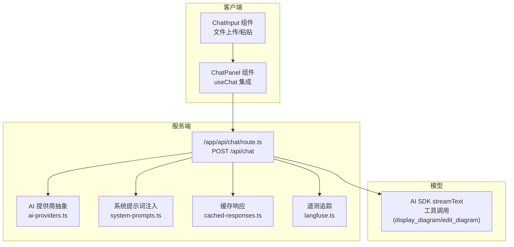
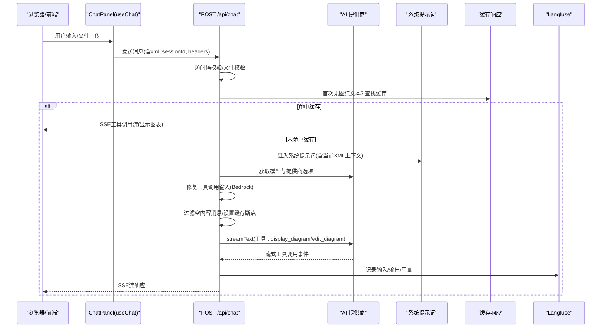
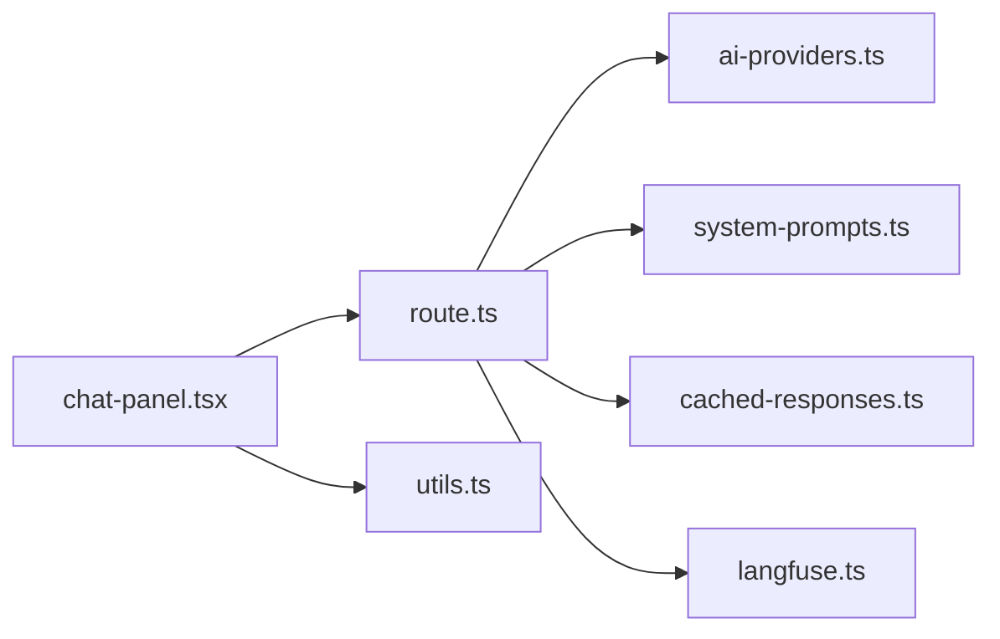

# 聊天接口

<cite>
**本文引用的文件**
- [route.ts](file://app/api/chat/route.ts)
- [cached-responses.ts](file://lib/cached-responses.ts)
- [system-prompts.ts](file://lib/system-prompts.ts)
- [ai-providers.ts](file://lib/ai-providers.ts)
- [chat-panel.tsx](file://components/chat-panel.tsx)
- [chat-input.tsx](file://components/chat-input.tsx)
- [utils.ts](file://lib/utils.ts)
- [xml_guide.md](file://app/api/chat/xml_guide.md)
- [langfuse.ts](file://lib/langfuse.ts)
</cite>

## 目录
1. [简介](#简介)
2. [项目结构](#项目结构)
3. [核心组件](#核心组件)
4. [架构总览](#架构总览)
5. [详细组件分析](#详细组件分析)
6. [依赖关系分析](#依赖关系分析)
7. [性能考量](#性能考量)
8. [故障排查指南](#故障排查指南)
9. [结论](#结论)
10. [附录](#附录)

## 简介
本文件面向“next-ai-draw-io”的聊天接口，聚焦于后端端点/app/api/chat/route.ts的实现机制与前端集成方式，系统性阐述如下主题：
- 自然语言输入与图像上传解析（文件到图表）
- 通过AI SDK调用大模型生成draw.io兼容的XML结构
- 流式响应（SSE）与工具调用（display_diagram、edit_diagram）
- 消息历史处理与上下文注入（系统提示词、当前XML上下文）
- 缓存响应优化（首次无图纯文本场景）
- 错误处理与超时策略
- 前端ChatPanel组件如何通过useChat集成该API

## 项目结构
该聊天接口位于Next.js应用的app/api目录下，采用Serverless函数风格；AI能力通过AI SDK与多提供商抽象层对接；前端通过@ai-sdk/react的useChat进行流式交互。

图表来源
- [route.ts](file://app/api/chat/route.ts#L145-L474)
- [ai-providers.ts](file://lib/ai-providers.ts#L112-L286)
- [system-prompts.ts](file://lib/system-prompts.ts#L348-L371)
- [cached-responses.ts](file://lib/cached-responses.ts#L551-L562)
- [langfuse.ts](file://lib/langfuse.ts#L29-L76)

章节来源
- [route.ts](file://app/api/chat/route.ts#L1-L495)
- [ai-providers.ts](file://lib/ai-providers.ts#L1-L286)
- [system-prompts.ts](file://lib/system-prompts.ts#L1-L371)
- [cached-responses.ts](file://lib/cached-responses.ts#L1-L562)
- [langfuse.ts](file://lib/langfuse.ts#L1-L108)

## 核心组件
- 后端端点：/app/api/chat/route.ts
  - 接收POST请求，校验访问码、解析消息与XML上下文、构建系统提示词与消息历史、调用AI SDK流式生成、返回SSE流响应，并在特定条件下使用缓存响应。
- AI提供商抽象：lib/ai-providers.ts
  - 自动检测或显式配置AI提供商（Bedrock/OpenAI/Anthropic/Google/Azure/Ollama/OpenRouter/DeepSeek/SiliconFlow），按模型返回对应SDK实例与可选头部/选项。
- 系统提示词：lib/system-prompts.ts
  - 根据模型ID选择默认或扩展版系统提示词，注入布局约束、工具参考、编辑规则等。
- 缓存响应：lib/cached-responses.ts
  - 首次纯文本且无图片时，命中预置示例缓存，直接返回工具调用流以渲染图表。
- 遥测追踪：lib/langfuse.ts
  - 可选启用Langfuse，记录trace输入输出、token用量、自动结束span。
- 前端集成：components/chat-panel.tsx
  - 使用@ai-sdk/react的useChat，默认传输器指向/api/chat，处理工具调用（display_diagram/edit_diagram），并持久化消息与XML快照。
- 工具辅助：lib/utils.ts
  - XML格式化、替换片段、结构校验、从SVG提取XML等工具方法。

章节来源
- [route.ts](file://app/api/chat/route.ts#L145-L474)
- [ai-providers.ts](file://lib/ai-providers.ts#L112-L286)
- [system-prompts.ts](file://lib/system-prompts.ts#L348-L371)
- [cached-responses.ts](file://lib/cached-responses.ts#L551-L562)
- [langfuse.ts](file://lib/langfuse.ts#L29-L76)
- [chat-panel.tsx](file://components/chat-panel.tsx#L130-L287)
- [utils.ts](file://lib/utils.ts#L240-L506)

## 架构总览
后端端点在收到请求后，执行以下关键步骤：
- 访问码校验
- 文件上传校验（数量与大小）
- 首次无图纯文本场景的缓存命中
- 获取AI模型与提供商选项
- 注入系统提示词（含当前XML上下文作为系统消息）
- 修复工具调用输入（Bedrock兼容）
- 过滤空内容消息
- 构建消息历史并设置缓存断点
- 调用streamText生成工具调用
- 返回SSE流响应
- Langfuse追踪与统计

图表来源
- [route.ts](file://app/api/chat/route.ts#L145-L474)
- [cached-responses.ts](file://lib/cached-responses.ts#L551-L562)
- [system-prompts.ts](file://lib/system-prompts.ts#L348-L371)
- [langfuse.ts](file://lib/langfuse.ts#L29-L76)

## 详细组件分析

### 后端端点：/app/api/chat/route.ts
- 请求与响应
  - 方法：POST
  - 路径：/api/chat
  - 请求体字段：
    - messages：UI消息数组（包含parts，支持text与file）
    - xml：当前图表XML字符串（用于系统上下文）
    - sessionId：会话标识（可选）
  - 响应：SSE流，类型为UIMessageStreamResponse，包含工具调用事件（tool-input-start/tool-input-delta/tool-input-available/tool-input-end等）。
- 访问控制
  - 读取环境变量中的ACCESS_CODE_LIST，若配置则要求请求头x-access-code匹配。
- 文件上传解析
  - 校验最后一条消息中的file部分数量与大小（Base64解码后字节计算）。
- 缓存响应
  - 首次消息且xml为空或极简时，根据用户文本与是否存在图片查找预置示例缓存，命中则构造工具调用流直接返回。
- 系统提示词与上下文
  - 根据模型ID选择默认或扩展系统提示词；同时注入“Current diagram XML”作为系统消息，便于模型在edit_diagram时精确匹配。
- Bedrock兼容修复
  - 将assistant消息中的tool-call input从字符串转为对象，或为空对象，确保API兼容。
- 消息历史与缓存断点
  - 过滤空内容消息；在历史中最后一个assistant消息上设置providerOptions.cachePoint，提升后续请求的缓存复用率。
- 工具定义
  - display_diagram：接收xml字符串，前端渲染到draw.io。
  - edit_diagram：接收search/replace对数组，按精确行匹配修改XML。
- 流式生成与遥测
  - 使用streamText生成工具调用，onFinish回调中记录token用量；Langfuse可选开启，自动记录trace与token属性。
- 错误处理
  - 包裹safeHandler统一捕获异常，返回500；访问码错误由上游分支单独处理。

章节来源
- [route.ts](file://app/api/chat/route.ts#L1-L495)

### AI提供商抽象：lib/ai-providers.ts
- 自动检测
  - 若仅配置一个提供商，则自动使用；否则需要显式设置AI_PROVIDER。
- 支持的提供商
  - bedrock、openai、anthropic、google、azure、ollama、openrouter、deepseek、siliconflow。
- 模型初始化
  - 根据提供商返回对应SDK模型实例，必要时附加beta头部或providerOptions（如Bedrock Anthropic beta特性）。
- 环境变量
  - 对应API密钥与可选自定义endpoint；未配置时抛出明确错误信息。

章节来源
- [ai-providers.ts](file://lib/ai-providers.ts#L1-L286)

### 系统提示词注入：lib/system-prompts.ts
- 默认系统提示词约2700令牌，覆盖工具使用、布局约束、AWS图标建议、XML结构规范等。
- 扩展系统提示词（约1800令牌）针对Opus 4.5/Haiku 4.5等模型，追加更详细的工具参考与最佳实践。
- 模型ID匹配
  - 通过包含模式匹配模型ID，决定使用默认或扩展版本。

章节来源
- [system-prompts.ts](file://lib/system-prompts.ts#L1-L371)

### 缓存响应：lib/cached-responses.ts
- 数据结构
  - CachedResponse包含promptText、hasImage、xml三要素。
- 示例缓存
  - 内置多条示例，覆盖动画连接、AWS样式、流程图、猫等场景。
- 查找逻辑
  - 精确匹配promptText与hasImage，且xml非空。

章节来源
- [cached-responses.ts](file://lib/cached-responses.ts#L1-L562)

### 前端集成：components/chat-panel.tsx
- useChat集成
  - transport指向/api/chat；onToolCall处理display_diagram与edit_diagram。
- display_diagram
  - 调用onDisplayChart验证XML，失败则通过addToolOutput返回错误；成功则标记输出。
- edit_diagram
  - 优先使用chartXMLRef（避免iframe延迟导致的旧XML），其次导出获取；调用utils.replaceXMLParts进行精确行替换；再次验证XML有效性。
- 消息持久化
  - localStorage保存messages、xml快照、sessionId、当前图表XML。
- 错误处理
  - onError中将错误转换为系统消息并提示；当检测到访问码错误时弹出设置对话框。

章节来源
- [chat-panel.tsx](file://components/chat-panel.tsx#L130-L287)
- [utils.ts](file://lib/utils.ts#L240-L506)

### 工具辅助：lib/utils.ts
- replaceXMLParts
  - 多策略匹配（精确、去空白、子串、字符频率、按id定位、按value定位、归一化空白），最终替换并格式化。
- validateMxCellStructure
  - 校验XML语法、重复ID、嵌套mxCell、孤儿节点、无效父引用、边源/目标引用、孤立mxPoint等。
- formatXML
  - 基于标签拆分与缩进的XML格式化。
- 其他
  - convertToLegalXml、extractDiagramXML等辅助方法。

章节来源
- [utils.ts](file://lib/utils.ts#L240-L506)

## 依赖关系分析

图表来源
- [route.ts](file://app/api/chat/route.ts#L1-L495)
- [ai-providers.ts](file://lib/ai-providers.ts#L1-L286)
- [system-prompts.ts](file://lib/system-prompts.ts#L1-L371)
- [cached-responses.ts](file://lib/cached-responses.ts#L1-L562)
- [langfuse.ts](file://lib/langfuse.ts#L1-L108)
- [chat-panel.tsx](file://components/chat-panel.tsx#L130-L287)
- [utils.ts](file://lib/utils.ts#L240-L506)

章节来源
- [route.ts](file://app/api/chat/route.ts#L1-L495)
- [chat-panel.tsx](file://components/chat-panel.tsx#L130-L287)

## 性能考量
- 缓存策略
  - 首次无图纯文本场景命中示例缓存，避免模型调用与网络开销。
  - 在历史最后一个assistant消息设置cachePoint，提升后续请求的上下文缓存复用率。
- 流式响应
  - 使用AI SDK streamText返回SSE流，前端即时渲染，降低感知延迟。
- 文件限制
  - 单次最多5个文件，单文件最大2MB，减少内存与网络压力。
- 底层SDK与提供商
  - 通过ai-providers.ts按需选择最优提供商与模型，减少不必要的重试与错误。

[本节为通用指导，不涉及具体文件分析]

## 故障排查指南
- 访问码错误
  - 现象：401 Unauthorized，提示配置访问码。
  - 处理：在前端设置面板配置x-access-code并随请求头发送。
- 工具调用失败
  - display_diagram：XML结构校验失败时，前端会收到错误输出并提示修正；检查XML是否满足draw.io规范。
  - edit_diagram：若“模式未找到”，尝试扩大上下文、保持属性顺序一致、或改用display_diagram重新生成。
- 图像上传失败
  - 现象：文件数量超过上限或单文件过大。
  - 处理：减少文件数量或压缩图像尺寸。
- Langfuse追踪
  - 若未配置公钥/私钥，遥测不会生效；可在环境变量中启用并查看trace与token用量。

章节来源
- [route.ts](file://app/api/chat/route.ts#L145-L191)
- [chat-panel.tsx](file://components/chat-panel.tsx#L141-L176)
- [utils.ts](file://lib/utils.ts#L508-L643)
- [langfuse.ts](file://lib/langfuse.ts#L1-L108)

## 结论
/app/api/chat/route.ts通过AI SDK实现了从自然语言到draw.io XML的生成与编辑闭环，结合系统提示词注入、消息历史缓存断点、工具调用与SSE流式响应，提供了高效稳定的聊天绘图体验。前端通过useChat与工具调用紧密协作，确保渲染与编辑的准确性与一致性。AI提供商抽象层使系统具备良好的可扩展性，便于接入不同模型与平台。

[本节为总结性内容，不涉及具体文件分析]

## 附录

### POST /api/chat 请求与响应规范
- 请求方法
  - POST
- 请求头
  - Content-Type: application/json
  - x-access-code: 可选（若启用访问码）
- 请求体
  - messages: 数组，每个元素包含parts（text与/或file）
  - xml: 当前图表XML字符串（用于系统上下文）
  - sessionId: 字符串（可选，最长200字符）
- 响应
  - Content-Type: text/event-stream
  - 事件类型：start、tool-input-start、tool-input-delta、tool-input-available、finish
  - 工具调用：
    - display_diagram: 输入参数xml（字符串）
    - edit_diagram: 输入参数edits（数组，每项包含search与replace）

章节来源
- [route.ts](file://app/api/chat/route.ts#L145-L474)
- [chat-panel.tsx](file://components/chat-panel.tsx#L130-L287)

### 前端ChatPanel集成要点
- 使用useChat，默认transport指向/api/chat
- onToolCall中处理display_diagram与edit_diagram
- 通过localStorage持久化消息、XML快照与sessionId
- 通过headers携带x-access-code

章节来源
- [chat-panel.tsx](file://components/chat-panel.tsx#L130-L287)
- [chat-input.tsx](file://components/chat-input.tsx#L1-L481)

### draw.io XML结构参考
- 基本结构与根元素、图模型、根容器、单元格、几何信息、样式与连接器等
- 特别注意：所有mxCell必须是root的直接子元素，不可嵌套；边的源/目标必须引用存在的cell ID；特殊字符需正确转义

章节来源
- [xml_guide.md](file://app/api/chat/xml_guide.md#L1-L323)