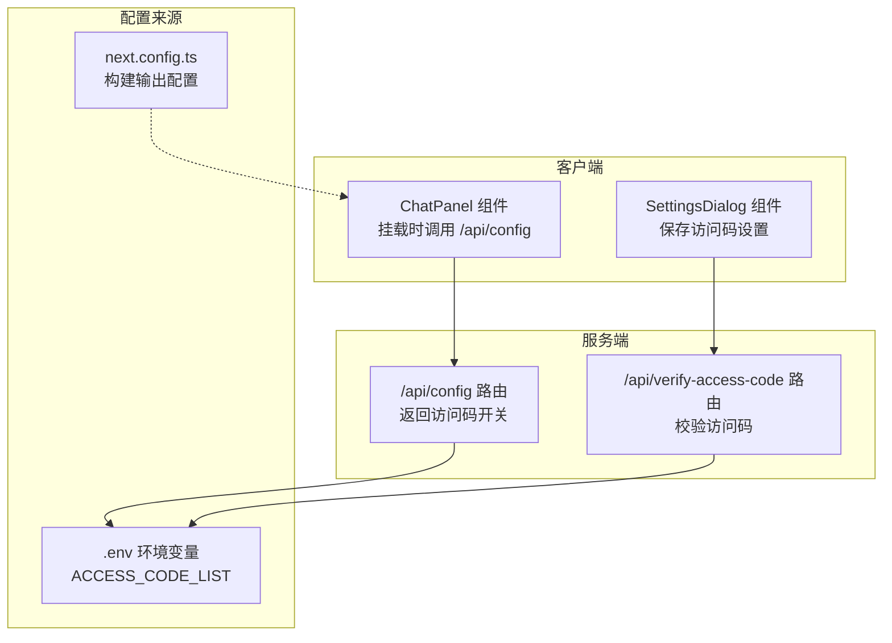
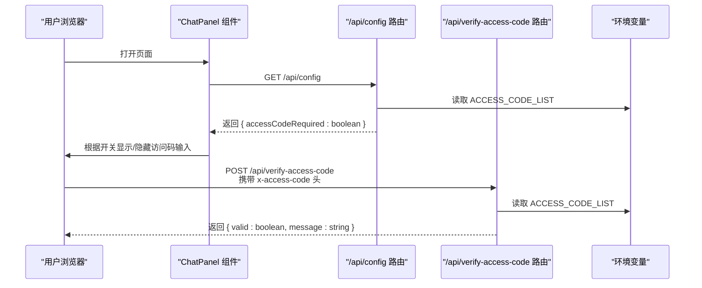
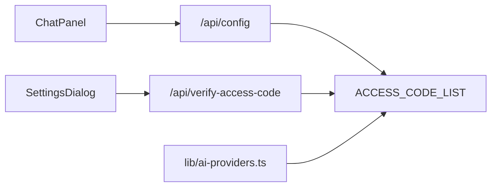

# 配置服务

<cite>
**本文引用的文件列表**
- [app/api/config/route.ts](file://app/api/config/route.ts)
- [app/api/verify-access-code/route.ts](file://app/api/verify-access-code/route.ts)
- [components/chat-panel.tsx](file://components/chat-panel.tsx)
- [components/settings-dialog.tsx](file://components/settings-dialog.tsx)
- [lib/ai-providers.ts](file://lib/ai-providers.ts)
- [env.example](file://env.example)
- [next.config.ts](file://next.config.ts)
- [README.md](file://README.md)
</cite>

## 目录
1. [简介](#简介)
2. [项目结构](#项目结构)
3. [核心组件](#核心组件)
4. [架构总览](#架构总览)
5. [详细组件分析](#详细组件分析)
6. [依赖分析](#依赖分析)
7. [性能考虑](#性能考虑)
8. [故障排查指南](#故障排查指南)
9. [结论](#结论)
10. [附录](#附录)

## 简介
本文件围绕 /app/api/config/route.ts 的功能实现，系统性说明该配置端点如何向客户端安全地暴露应用配置信息，重点涵盖：
- 访问控制策略：基于环境变量 ACCESS_CODE_LIST 的启用与校验流程
- 功能标志：当前仅暴露“是否需要访问码”的布尔开关；历史记录与图像复制等能力由前端逻辑与后端工具链共同决定
- AI 模型选项：通过环境变量与 AI 提供商配置映射，为前端初始化提供必要上下文
- 与环境变量（.env.example）的映射关系
- 与 Next.js 配置（next.config.ts）的关系
- 响应数据结构示例（字段类型与默认值）
- 前端初始化调用时机与缓存策略，确保配置一致性与安全性

## 项目结构
本项目采用 Next.js App Router，配置端点位于 app/api/config/route.ts。前端在聊天面板挂载时调用该端点，以决定是否显示访问码输入与后续交互行为。访问码验证由独立的 /api/verify-access-code 路由完成。

图表来源
- [app/api/config/route.ts](file://app/api/config/route.ts#L1-L13)
- [app/api/verify-access-code/route.ts](file://app/api/verify-access-code/route.ts#L1-L32)
- [components/chat-panel.tsx](file://components/chat-panel.tsx#L91-L103)
- [components/settings-dialog.tsx](file://components/settings-dialog.tsx#L42-L121)
- [env.example](file://env.example#L61-L63)
- [next.config.ts](file://next.config.ts#L1-L9)

章节来源
- [app/api/config/route.ts](file://app/api/config/route.ts#L1-L13)
- [components/chat-panel.tsx](file://components/chat-panel.tsx#L91-L103)
- [components/settings-dialog.tsx](file://components/settings-dialog.tsx#L42-L121)
- [env.example](file://env.example#L61-L63)
- [next.config.ts](file://next.config.ts#L1-L9)

## 核心组件
- /app/api/config/route.ts
  - 功能：读取 ACCESS_CODE_LIST 环境变量，计算是否需要访问码，并返回布尔开关
  - 安全性：仅暴露必要的访问控制状态，不泄露任何敏感凭据
  - 响应字段：
    - accessCodeRequired: boolean（默认 false，当 ACCESS_CODE_LIST 为空时）
- /app/api/verify-access-code/route.ts
  - 功能：接收请求头 x-access-code，与 ACCESS_CODE_LIST 比对，返回校验结果
  - 安全性：未配置访问码时默认放行；校验失败返回 401
- 前端调用方
  - ChatPanel：页面挂载时调用 /api/config 获取开关
  - SettingsDialog：保存访问码设置并通过 /api/verify-access-code 进行校验

章节来源
- [app/api/config/route.ts](file://app/api/config/route.ts#L1-L13)
- [app/api/verify-access-code/route.ts](file://app/api/verify-access-code/route.ts#L1-L32)
- [components/chat-panel.tsx](file://components/chat-panel.tsx#L91-L103)
- [components/settings-dialog.tsx](file://components/settings-dialog.tsx#L42-L121)

## 架构总览
下图展示配置端点在整体架构中的位置与调用链路。

图表来源
- [components/chat-panel.tsx](file://components/chat-panel.tsx#L91-L103)
- [app/api/config/route.ts](file://app/api/config/route.ts#L1-L13)
- [app/api/verify-access-code/route.ts](file://app/api/verify-access-code/route.ts#L1-L32)
- [env.example](file://env.example#L61-L63)

## 详细组件分析

### 配置端点 /api/config/route.ts
- 实现要点
  - 从进程环境变量 ACCESS_CODE_LIST 解析逗号分隔的访问码列表
  - 去除空白并过滤空字符串，得到非空访问码集合
  - 返回布尔值表示是否需要访问码
- 数据结构
  - 响应体字段
    - accessCodeRequired: boolean
  - 默认值
    - 当 ACCESS_CODE_LIST 未设置或为空时，默认 false
- 安全性
  - 不直接返回 ACCESS_CODE_LIST 或任何敏感信息
  - 仅暴露“是否需要访问码”的最小必要信息
- 与环境变量映射
  - ACCESS_CODE_LIST 对应 .env.example 中的注释项，支持多个逗号分隔的访问码
- 与 Next.js 配置关系
  - next.config.ts 设置 output: "standalone"，影响构建产物，但与 /api/config 的业务逻辑无直接耦合

章节来源
- [app/api/config/route.ts](file://app/api/config/route.ts#L1-L13)
- [env.example](file://env.example#L61-L63)
- [next.config.ts](file://next.config.ts#L1-L9)

### 访问码验证端点 /api/verify-access-code/route.ts
- 实现要点
  - 从请求头 x-access-code 获取访问码
  - 若未配置 ACCESS_CODE_LIST，则默认放行
  - 若请求头缺失或不在允许列表中，返回 401
- 错误处理
  - 缺少请求头：返回 401 并提示需要访问码
  - 访问码无效：返回 401 并提示无效
  - 成功：返回 { valid: true, message: "..." }

章节来源
- [app/api/verify-access-code/route.ts](file://app/api/verify-access-code/route.ts#L1-L32)
- [env.example](file://env.example#L61-L63)

### 前端调用与缓存策略
- 调用时机
  - ChatPanel 在组件挂载时发起一次 /api/config 请求，用于初始化访问码开关
- 缓存策略
  - 该端点返回的是运行时状态（基于环境变量），不包含可缓存的敏感信息
  - 建议：前端可在本地内存中缓存该开关值，避免重复请求；若需刷新，可在部署新版本或重启容器后重新拉取
- 一致性保障
  - 由于 ACCESS_CODE_LIST 来自环境变量，部署时应确保环境变量一致
  - 前端仅依据开关值决定 UI 行为，不存储或传播访问码本身

章节来源
- [components/chat-panel.tsx](file://components/chat-panel.tsx#L91-L103)

### 功能标志与历史记录、图像复制
- 当前配置端点不暴露历史记录与图像复制等能力标志
- 历史记录能力由前端上下文与工具链共同决定，与 /api/config 无直接关联
- 图像复制能力由后端工具链与 AI 提供商能力决定，前端通过其他接口与工具链交互

章节来源
- [README.md](file://README.md#L22-L30)

### AI 模型选项与环境变量映射
- 环境变量
  - AI_PROVIDER：选择 AI 提供商（bedrock, openai, anthropic, google, azure, ollama, openrouter, deepseek, siliconflow）
  - AI_MODEL：所选提供商的具体模型 ID
  - 其他提供商专属变量：OPENAI_API_KEY、ANTHROPIC_API_KEY、GOOGLE_GENERATIVE_AI_API_KEY、AZURE_API_KEY、AWS_* 等
  - ACCESS_CODE_LIST：访问码列表（逗号分隔）
- 映射关系
  - lib/ai-providers.ts 会根据 AI_PROVIDER 与各提供商的 API Key 自动检测或强制指定提供商，并据此初始化模型
  - /api/config 仅依赖 ACCESS_CODE_LIST 决定访问控制开关
- 与 Next.js 配置
  - next.config.ts 的 output: "standalone" 与 /api/config 无直接关系，但会影响构建产物与部署形态

章节来源
- [lib/ai-providers.ts](file://lib/ai-providers.ts#L1-L286)
- [env.example](file://env.example#L1-L63)
- [next.config.ts](file://next.config.ts#L1-L9)

## 依赖分析
- 组件耦合
  - ChatPanel 依赖 /api/config 的返回值控制 UI 行为
  - SettingsDialog 依赖 /api/verify-access-code 的返回值控制设置保存流程
- 外部依赖
  - 环境变量 ACCESS_CODE_LIST 作为唯一外部输入，决定访问控制策略
  - AI 提供商配置由 lib/ai-providers.ts 统一管理，与 /api/config 无直接耦合

图表来源
- [components/chat-panel.tsx](file://components/chat-panel.tsx#L91-L103)
- [components/settings-dialog.tsx](file://components/settings-dialog.tsx#L42-L121)
- [app/api/config/route.ts](file://app/api/config/route.ts#L1-L13)
- [app/api/verify-access-code/route.ts](file://app/api/verify-access-code/route.ts#L1-L32)
- [lib/ai-providers.ts](file://lib/ai-providers.ts#L1-L286)
- [env.example](file://env.example#L61-L63)

章节来源
- [components/chat-panel.tsx](file://components/chat-panel.tsx#L91-L103)
- [components/settings-dialog.tsx](file://components/settings-dialog.tsx#L42-L121)
- [app/api/config/route.ts](file://app/api/config/route.ts#L1-L13)
- [app/api/verify-access-code/route.ts](file://app/api/verify-access-code/route.ts#L1-L32)
- [lib/ai-providers.ts](file://lib/ai-providers.ts#L1-L286)
- [env.example](file://env.example#L61-L63)

## 性能考虑
- /api/config 为轻量级端点，仅解析环境变量并返回布尔开关，延迟极低
- 建议前端缓存该开关值，减少不必要的重复请求
- 访问码验证端点同样为轻量级，建议在高频场景下结合本地缓存与合理的重试策略

## 故障排查指南
- 访问码相关
  - 症状：前端提示需要访问码，但服务器返回已配置
  - 排查：确认 ACCESS_CODE_LIST 是否正确写入环境变量，且未被覆盖或清空
  - 参考：/api/config 与 /api/verify-access-code 的实现均依赖 ACCESS_CODE_LIST
- 端点调用失败
  - 症状：前端无法获取配置或报错
  - 排查：检查网络连通性、路由可达性；确认 Next.js 构建与部署正常
- 部署一致性
  - 症状：不同环境行为不一致
  - 排查：核对各环境的 .env 文件与部署配置，确保 ACCESS_CODE_LIST 一致

章节来源
- [app/api/config/route.ts](file://app/api/config/route.ts#L1-L13)
- [app/api/verify-access-code/route.ts](file://app/api/verify-access-code/route.ts#L1-L32)
- [env.example](file://env.example#L61-L63)

## 结论
/app/api/config/route.ts 通过最小化暴露访问控制开关，实现了安全、简洁的前端初始化配置。其与 ACCESS_CODE_LIST 的紧密耦合确保了部署侧的一致性与可控性；与 AI 提供商配置解耦，避免了敏感信息泄露。前端应在挂载时调用该端点并结合本地缓存策略，确保用户体验与安全性兼顾。

## 附录

### 响应数据结构示例
- 字段
  - accessCodeRequired: boolean
- 默认值
  - 未配置 ACCESS_CODE_LIST 时为 false
- 示例
  - { "accessCodeRequired": true }
  - { "accessCodeRequired": false }

章节来源
- [app/api/config/route.ts](file://app/api/config/route.ts#L1-L13)
- [env.example](file://env.example#L61-L63)

### 环境变量与配置映射表
- ACCESS_CODE_LIST
  - 作用：定义访问码列表，逗号分隔
  - 影响：决定 /api/config 返回的 accessCodeRequired 开关
- AI_PROVIDER / AI_MODEL
  - 作用：定义 AI 提供商与模型
  - 影响：由 lib/ai-providers.ts 使用，与 /api/config 无直接耦合
- 其他提供商专属变量
  - 作用：提供对应提供商的认证与端点配置
  - 影响：由 lib/ai-providers.ts 使用，与 /api/config 无直接耦合

章节来源
- [env.example](file://env.example#L1-L63)
- [lib/ai-providers.ts](file://lib/ai-providers.ts#L1-L286)