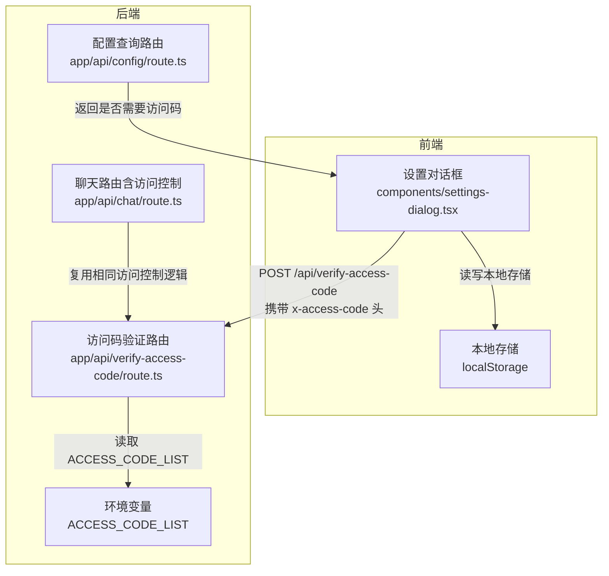
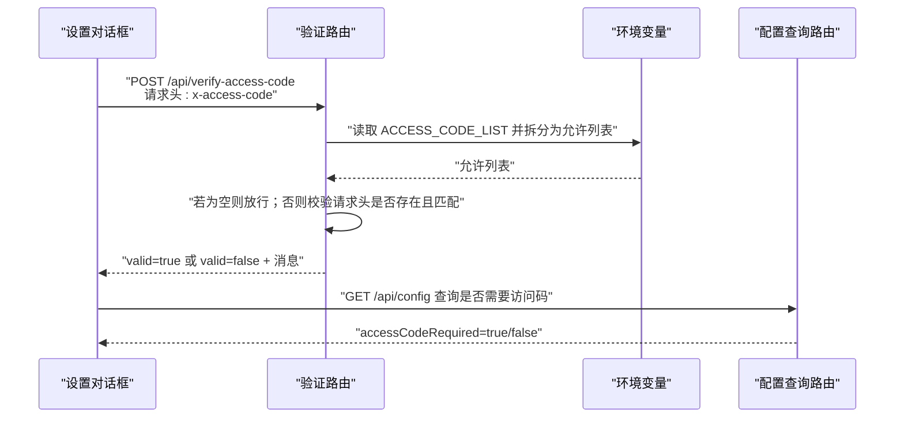
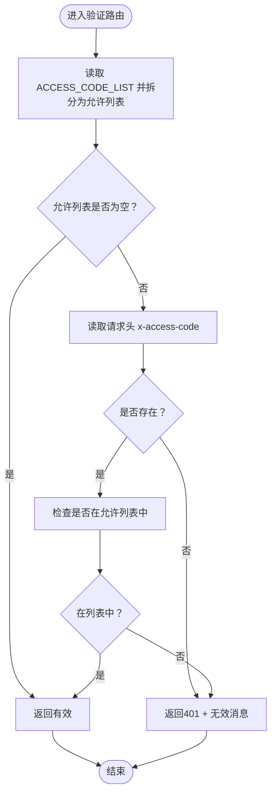
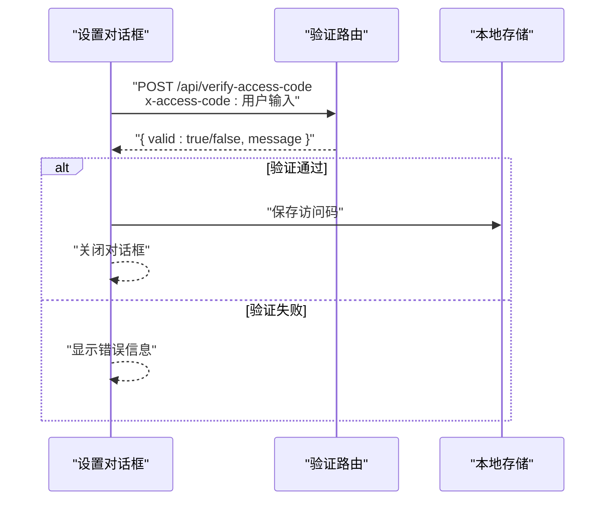
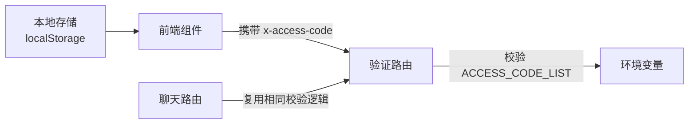
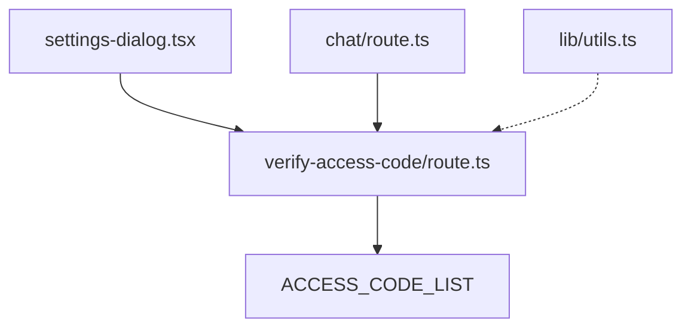

# 验证服务

<cite>
**本文引用的文件**
- [app/api/verify-access-code/route.ts](file://app/api/verify-access-code/route.ts)
- [app/api/config/route.ts](file://app/api/config/route.ts)
- [components/settings-dialog.tsx](file://components/settings-dialog.tsx)
- [lib/utils.ts](file://lib/utils.ts)
- [contexts/diagram-context.tsx](file://contexts/diagram-context.tsx)
- [app/api/chat/route.ts](file://app/api/chat/route.ts)
- [env.example](file://env.example)
- [package.json](file://package.json)
</cite>

## 目录
1. [简介](#简介)
2. [项目结构](#项目结构)
3. [核心组件](#核心组件)
4. [架构总览](#架构总览)
5. [详细组件分析](#详细组件分析)
6. [依赖关系分析](#依赖关系分析)
7. [性能考量](#性能考量)
8. [故障排查指南](#故障排查指南)
9. [结论](#结论)
10. [附录](#附录)

## 简介
本技术文档聚焦于“访问码验证”API，即/app/api/verify-access-code/route.ts 的实现与使用。该端点用于接收客户端提交的访问码，执行格式与有效性校验，并返回授权状态；同时说明其与全局状态管理（本地存储）及会话机制的关系，以及与聊天接口在访问控制上的统一策略。文档还结合/lib/utils.ts中的工具函数说明安全实现细节，并给出请求参数规范、HTTP状态码语义（200表示有效，401表示无效）、前端调用场景示例与最佳实践。

## 项目结构
该功能位于Next.js应用的app/api目录下，采用App Router风格的路由文件组织方式。前端设置对话框通过fetch调用该API进行访问码验证，后端通过环境变量ACCESS_CODE_LIST维护允许的访问码列表。

图表来源
- [app/api/verify-access-code/route.ts](file://app/api/verify-access-code/route.ts#L1-L32)
- [app/api/config/route.ts](file://app/api/config/route.ts#L1-L12)
- [components/settings-dialog.tsx](file://components/settings-dialog.tsx#L51-L85)
- [app/api/chat/route.ts](file://app/api/chat/route.ts#L145-L161)
- [env.example](file://env.example#L61-L63)

章节来源
- [app/api/verify-access-code/route.ts](file://app/api/verify-access-code/route.ts#L1-L32)
- [components/settings-dialog.tsx](file://components/settings-dialog.tsx#L51-L85)
- [app/api/config/route.ts](file://app/api/config/route.ts#L1-L12)
- [app/api/chat/route.ts](file://app/api/chat/route.ts#L145-L161)
- [env.example](file://env.example#L61-L63)

## 核心组件
- 访问码验证路由：负责解析请求头中的访问码，与环境变量中配置的允许列表比对，返回授权结果。
- 设置对话框：前端入口，收集用户输入的访问码并通过fetch调用验证路由，成功后将访问码持久化到本地存储。
- 配置查询路由：向客户端暴露当前是否需要访问码的布尔值，便于UI提示。
- 聊天路由：在聊天请求中同样执行访问控制，确保与验证路由一致的策略。
- 工具函数：lib/utils.ts包含XML处理等工具，但与访问码验证无直接关联；访问码验证不依赖该模块。

章节来源
- [app/api/verify-access-code/route.ts](file://app/api/verify-access-code/route.ts#L1-L32)
- [components/settings-dialog.tsx](file://components/settings-dialog.tsx#L51-L85)
- [app/api/config/route.ts](file://app/api/config/route.ts#L1-L12)
- [app/api/chat/route.ts](file://app/api/chat/route.ts#L145-L161)
- [lib/utils.ts](file://lib/utils.ts#L1-L711)

## 架构总览
访问码验证贯穿“前端设置对话框 -> 后端验证路由 -> 环境变量配置”的链路，同时与聊天接口共享同一套访问控制策略，确保全站一致性。

图表来源
- [components/settings-dialog.tsx](file://components/settings-dialog.tsx#L51-L85)
- [app/api/verify-access-code/route.ts](file://app/api/verify-access-code/route.ts#L1-L32)
- [app/api/config/route.ts](file://app/api/config/route.ts#L1-L12)
- [env.example](file://env.example#L61-L63)

## 详细组件分析

### 访问码验证路由（/app/api/verify-access-code/route.ts）
- 输入
  - 请求方法：POST
  - 请求头：x-access-code（必填）
  - 环境变量：ACCESS_CODE_LIST（可选，逗号分隔的多个访问码）
- 处理逻辑
  - 若未配置ACCESS_CODE_LIST，则直接返回有效。
  - 若请求头缺失，返回401并标记为无效。
  - 若请求头存在但不在允许列表中，返回401并标记为无效。
  - 若请求头存在于允许列表，返回有效。
- 输出
  - JSON对象：{ valid: boolean, message: string }
  - 成功时返回200，失败时返回401

图表来源
- [app/api/verify-access-code/route.ts](file://app/api/verify-access-code/route.ts#L1-L32)

章节来源
- [app/api/verify-access-code/route.ts](file://app/api/verify-access-code/route.ts#L1-L32)

### 前端调用（设置对话框）
- 调用方式：POST /api/verify-access-code
- 请求头：x-access-code
- 成功条件：valid为true
- 失败条件：valid为false或网络异常
- 成功后将访问码保存至本地存储，供后续页面行为使用

图表来源
- [components/settings-dialog.tsx](file://components/settings-dialog.tsx#L51-L85)
- [app/api/verify-access-code/route.ts](file://app/api/verify-access-code/route.ts#L1-L32)

章节来源
- [components/settings-dialog.tsx](file://components/settings-dialog.tsx#L51-L85)

### 全局状态管理与会话机制
- 本地存储：前端将访问码保存在localStorage中，作为“会话态”的轻量凭证，用于后续页面行为（例如关闭保护提示）。
- 服务器端：访问码验证仅基于请求头，不维护服务器端会话状态；聊天接口在每次请求中重复执行相同的访问控制逻辑。
- 一致性：聊天路由与验证路由共享同一套访问控制策略，避免前后端不一致。

图表来源
- [components/settings-dialog.tsx](file://components/settings-dialog.tsx#L51-L85)
- [app/api/verify-access-code/route.ts](file://app/api/verify-access-code/route.ts#L1-L32)
- [app/api/chat/route.ts](file://app/api/chat/route.ts#L145-L161)
- [env.example](file://env.example#L61-L63)

章节来源
- [components/settings-dialog.tsx](file://components/settings-dialog.tsx#L51-L85)
- [app/api/chat/route.ts](file://app/api/chat/route.ts#L145-L161)

### 安全实现细节与辅助函数
- 访问码验证逻辑不依赖/lib/utils.ts中的XML处理函数；该模块主要用于绘图XML的格式化、合法性校验与提取，与访问控制无直接关系。
- 安全要点
  - 使用请求头x-access-code传递访问码，避免在URL或请求体中明文传输。
  - 服务器端严格比对允许列表，未配置时默认放行，降低误封风险。
  - 前端仅在验证通过后才持久化访问码，减少泄露面。

章节来源
- [lib/utils.ts](file://lib/utils.ts#L1-L711)
- [app/api/verify-access-code/route.ts](file://app/api/verify-access-code/route.ts#L1-L32)

### 请求参数规范与HTTP状态码语义
- 请求方法
  - POST
- 请求头
  - x-access-code: string（必填）
- 请求体
  - 无（验证逻辑不依赖请求体）
- 响应体
  - { valid: boolean, message: string }
- 状态码
  - 200: valid为true（访问码有效）
  - 401: valid为false（缺少访问码或访问码无效）

章节来源
- [app/api/verify-access-code/route.ts](file://app/api/verify-access-code/route.ts#L1-L32)

### 前端调用场景示例
- 场景一：首次打开设置对话框，输入访问码并点击保存
  - 前端发起POST /api/verify-access-code，携带x-access-code
  - 验证通过后保存访问码到本地存储
- 场景二：页面加载时根据/api/config判断是否需要访问码
  - 前端发起GET /api/config，根据返回值决定是否展示访问码输入
- 场景三：聊天接口在每次请求前执行访问控制
  - 前端在请求头中携带x-access-code
  - 后端在聊天路由中复用相同的校验逻辑

章节来源
- [components/settings-dialog.tsx](file://components/settings-dialog.tsx#L51-L85)
- [app/api/config/route.ts](file://app/api/config/route.ts#L1-L12)
- [app/api/chat/route.ts](file://app/api/chat/route.ts#L145-L161)

## 依赖关系分析
- 访问码验证路由依赖环境变量ACCESS_CODE_LIST
- 设置对话框依赖验证路由与本地存储
- 聊天路由复用访问码验证的策略
- lib/utils.ts与访问码验证无直接依赖

图表来源
- [app/api/verify-access-code/route.ts](file://app/api/verify-access-code/route.ts#L1-L32)
- [components/settings-dialog.tsx](file://components/settings-dialog.tsx#L51-L85)
- [app/api/chat/route.ts](file://app/api/chat/route.ts#L145-L161)
- [lib/utils.ts](file://lib/utils.ts#L1-L711)

章节来源
- [app/api/verify-access-code/route.ts](file://app/api/verify-access-code/route.ts#L1-L32)
- [components/settings-dialog.tsx](file://components/settings-dialog.tsx#L51-L85)
- [app/api/chat/route.ts](file://app/api/chat/route.ts#L145-L161)
- [lib/utils.ts](file://lib/utils.ts#L1-L711)

## 性能考量
- 访问码验证为O(n)的线性查找（n为允许列表长度），通常很小，开销可忽略。
- 建议将允许列表控制在合理规模内，避免过长导致不必要的CPU消耗。
- 对于高并发场景，建议在网关层或边缘缓存中做一次快速拒绝（例如基于IP或速率限制），以减轻后端压力。

## 故障排查指南
- 问题：返回401且message为“缺少访问码”
  - 排查：确认请求头x-access-code是否正确传入
- 问题：返回401且message为“访问码无效”
  - 排查：确认ACCESS_CODE_LIST是否已正确配置，且与客户端输入一致（大小写敏感）
- 问题：返回200但前端仍提示需要访问码
  - 排查：确认/api/config返回accessCodeRequired是否为true；检查本地存储中是否已保存访问码
- 问题：聊天接口被拒绝
  - 排查：确认聊天请求头是否携带正确的x-access-code；检查聊天路由中的访问控制逻辑是否生效

章节来源
- [app/api/verify-access-code/route.ts](file://app/api/verify/access-code/route.ts#L1-L32)
- [components/settings-dialog.tsx](file://components/settings-dialog.tsx#L51-L85)
- [app/api/config/route.ts](file://app/api/config/route.ts#L1-L12)
- [app/api/chat/route.ts](file://app/api/chat/route.ts#L145-L161)

## 结论
访问码验证API通过简单的请求头校验实现了基础的访问控制，与聊天接口共享一致的策略，前端通过本地存储维持轻量会话态。该设计简洁可靠，易于部署与维护。对于更复杂的安全需求（如短期令牌签发、多租户隔离等），可在现有基础上扩展，但需注意与现有策略保持兼容。

## 附录

### 环境变量配置
- ACCESS_CODE_LIST：可选，逗号分隔的多个访问码，用于启用访问控制

章节来源
- [env.example](file://env.example#L61-L63)

### 依赖库与版本
- 项目使用Next.js与相关生态，访问码验证不依赖额外第三方库

章节来源
- [package.json](file://package.json#L1-L84)