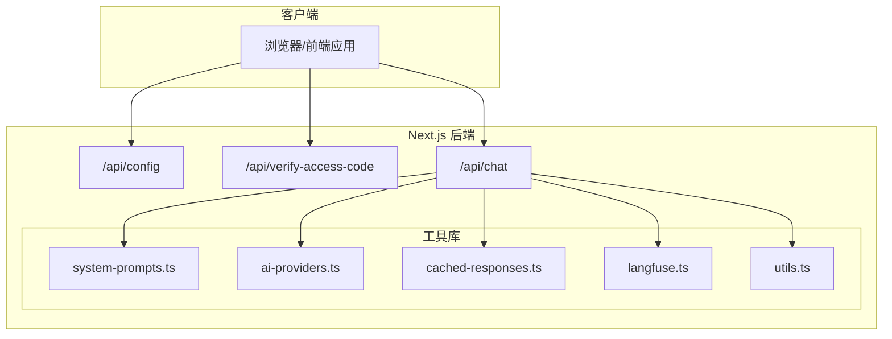
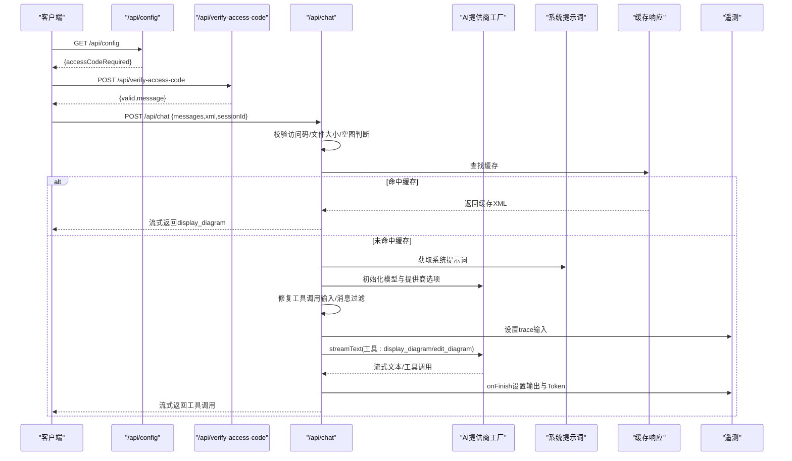
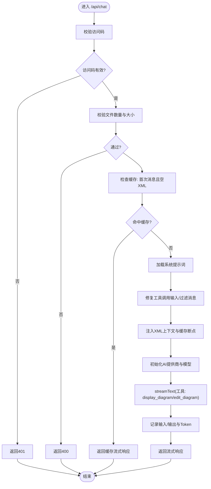
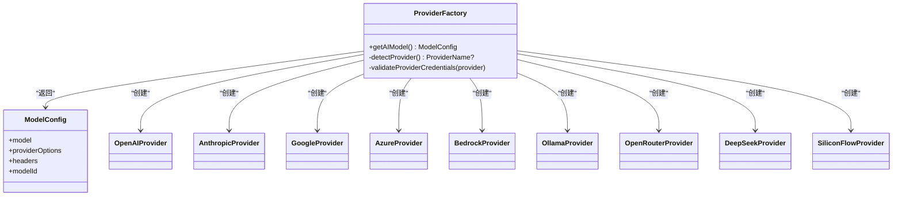
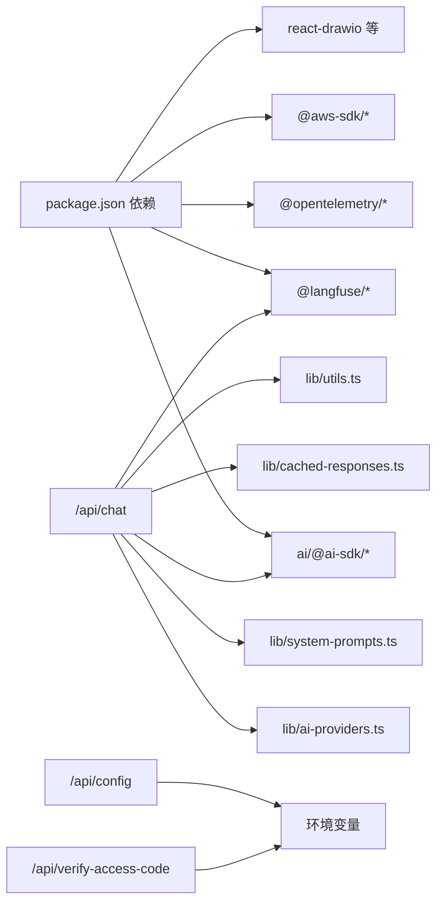

# 后端架构

<cite>
**本文引用的文件**
- [app/api/chat/route.ts](file://app/api/chat/route.ts)
- [lib/ai-providers.ts](file://lib/ai-providers.ts)
- [lib/system-prompts.ts](file://lib/system-prompts.ts)
- [lib/cached-responses.ts](file://lib/cached-responses.ts)
- [lib/langfuse.ts](file://lib/langfuse.ts)
- [app/api/config/route.ts](file://app/api/config/route.ts)
- [app/api/verify-access-code/route.ts](file://app/api/verify-access-code/route.ts)
- [app/api/chat/xml_guide.md](file://app/api/chat/xml_guide.md)
- [lib/utils.ts](file://lib/utils.ts)
- [package.json](file://package.json)
- [README.md](file://README.md)
- [docs/ai-providers.md](file://docs/ai-providers.md)
</cite>

## 目录
1. [简介](#简介)
2. [项目结构](#项目结构)
3. [核心组件](#核心组件)
4. [架构总览](#架构总览)
5. [详细组件分析](#详细组件分析)
6. [依赖关系分析](#依赖关系分析)
7. [性能考量](#性能考量)
8. [故障排查指南](#故障排查指南)
9. [结论](#结论)
10. [附录](#附录)

## 简介
本文件面向后端架构与Next.js API路由，聚焦以下目标：
- 解释/api/chat如何接收自然语言输入，调用AI模型生成与draw.io兼容的XML结构，并通过工具流返回给客户端。
- 深入剖析AI提供商工厂模式在lib/ai-providers.ts中的实现机制，支持OpenAI、Anthropic、Google、Azure、Bedrock、Ollama、OpenRouter、DeepSeek、SiliconFlow等多模型切换。
- 阐述配置服务（/api/config）与访问码验证（/api/verify-access-code）的安全设计。
- 分析服务端逻辑与客户端的分离策略，包括认证、速率限制与错误处理。
- 提供API层模块依赖图与请求处理流程图。
- 讨论服务器端性能优化与安全防护措施。

## 项目结构
后端API采用Next.js App Router风格，按功能划分在app/api下：
- /api/chat：主聊天接口，负责自然语言到draw.io XML的生成与编辑。
- /api/config：返回部署侧配置（如是否需要访问码）。
- /api/verify-access-code：校验访问码。
- /api/log-feedback、/api/log-save：用于日志与保存记录（可选扩展）。

前端与后端职责分离清晰：前端负责UI与交互，后端仅暴露REST风格API并进行AI推理、缓存与遥测。

图表来源
- [app/api/chat/route.ts](file://app/api/chat/route.ts#L1-L495)
- [lib/ai-providers.ts](file://lib/ai-providers.ts#L1-L286)
- [lib/system-prompts.ts](file://lib/system-prompts.ts#L1-L371)
- [lib/cached-responses.ts](file://lib/cached-responses.ts#L1-L562)
- [lib/langfuse.ts](file://lib/langfuse.ts#L1-L108)
- [lib/utils.ts](file://lib/utils.ts#L1-L711)
- [app/api/config/route.ts](file://app/api/config/route.ts#L1-L13)
- [app/api/verify-access-code/route.ts](file://app/api/verify-access-code/route.ts#L1-L33)

章节来源
- [README.md](file://README.md#L186-L203)

## 核心组件
- AI提供商工厂（lib/ai-providers.ts）
  - 支持自动检测或显式指定提供商，统一返回模型实例、提供商选项与头部信息。
  - 覆盖OpenAI、Anthropic、Google、Azure、Bedrock、Ollama、OpenRouter、DeepSeek、SiliconFlow。
- 系统提示词（lib/system-prompts.ts）
  - 默认提示词与扩展提示词（针对高缓存最小令牌模型），根据模型ID动态选择。
- 缓存响应（lib/cached-responses.ts）
  - 针对常见示例的预缓存，首条消息且无上下文时命中，直接返回流式响应。
- 遥测（lib/langfuse.ts）
  - 基于Langfuse的链路追踪与使用量统计，支持手动输入输出与Token计数。
- /api/chat（app/api/chat/route.ts）
  - 接收消息与XML上下文，执行文件校验、缓存检查、消息转换、Bedrock工具调用修复、系统提示注入、工具定义与流式输出。
- /api/config（app/api/config/route.ts）
  - 返回部署侧配置（是否需要访问码）。
- /api/verify-access-code（app/api/verify-access-code/route.ts）
  - 校验请求头中的访问码，未配置则放行。
- 工具与XML处理（lib/utils.ts）
  - XML格式化、合法性修复、节点替换、结构校验、SVG到XML提取等。

章节来源
- [lib/ai-providers.ts](file://lib/ai-providers.ts#L1-L286)
- [lib/system-prompts.ts](file://lib/system-prompts.ts#L1-L371)
- [lib/cached-responses.ts](file://lib/cached-responses.ts#L1-L562)
- [lib/langfuse.ts](file://lib/langfuse.ts#L1-L108)
- [app/api/chat/route.ts](file://app/api/chat/route.ts#L1-L495)
- [app/api/config/route.ts](file://app/api/config/route.ts#L1-L13)
- [app/api/verify-access-code/route.ts](file://app/api/verify-access-code/route.ts#L1-L33)
- [lib/utils.ts](file://lib/utils.ts#L1-L711)

## 架构总览
后端以“API路由 + 工具库”为核心，围绕AI提供商工厂与系统提示词构建统一的推理入口；通过缓存与遥测提升性能与可观测性；通过访问码与文件大小限制保障安全与资源控制。

图表来源
- [app/api/chat/route.ts](file://app/api/chat/route.ts#L145-L474)
- [lib/ai-providers.ts](file://lib/ai-providers.ts#L112-L286)
- [lib/system-prompts.ts](file://lib/system-prompts.ts#L348-L371)
- [lib/cached-responses.ts](file://lib/cached-responses.ts#L551-L562)
- [lib/langfuse.ts](file://lib/langfuse.ts#L29-L76)

## 详细组件分析

### /api/chat 路由：自然语言到draw.io XML
- 访问码校验：从请求头读取访问码，若配置了列表但请求缺失或不匹配则返回401。
- 文件校验：限制单次上传文件数量与大小，避免过大负载。
- 缓存策略：首次消息且当前XML为空时，基于用户输入与是否有图片查找预缓存；命中则直接返回流式显示工具调用。
- 消息转换与修复：
  - 将UI消息转换为模型消息。
  - 修复Bedrock工具调用输入（字符串转JSON对象），并过滤空内容数组消息。
  - 在对话历史中为最后一条助手消息添加缓存断点，提升后续请求缓存命中率。
- 系统提示注入：根据模型ID选择默认或扩展提示词，并注入当前XML上下文作为系统消息。
- 工具定义：
  - display_diagram：生成完整XML并渲染到draw.io。
  - edit_diagram：基于精确搜索/替换对现有XML进行局部修改，强调属性顺序与换行一致性。
- 流式输出：通过streamText返回工具调用流，客户端逐段渲染。
- 遥测与计费：记录输入、输出与Token用量，Bedrock流式场景手动补全Token统计。
- 错误处理：统一try/catch包装，捕获异常返回500。

图表来源
- [app/api/chat/route.ts](file://app/api/chat/route.ts#L145-L474)
- [lib/system-prompts.ts](file://lib/system-prompts.ts#L348-L371)
- [lib/cached-responses.ts](file://lib/cached-responses.ts#L551-L562)
- [lib/langfuse.ts](file://lib/langfuse.ts#L29-L76)

章节来源
- [app/api/chat/route.ts](file://app/api/chat/route.ts#L1-L495)
- [app/api/chat/xml_guide.md](file://app/api/chat/xml_guide.md#L1-L323)

### AI提供商工厂：工厂模式与多模型切换
- 自动检测：当仅配置一个提供商的密钥时自动选择；若配置多个需显式设置AI_PROVIDER。
- 统一返回：getAIModel返回模型实例、providerOptions与headers，便于下游统一调用。
- 多提供商支持：
  - OpenAI/Anthropic/Google/Azure：支持自定义BaseURL。
  - Bedrock：支持IAM角色与环境变量，自动为Claude模型附加Anthropic Beta特性。
  - Ollama：支持自定义BaseURL。
  - OpenRouter/DeepSeek/SiliconFlow：分别支持自定义BaseURL与OpenAI兼容接口。
- 错误处理：缺少必要环境变量时抛出明确错误，便于快速定位配置问题。

图表来源
- [lib/ai-providers.ts](file://lib/ai-providers.ts#L112-L286)

章节来源
- [lib/ai-providers.ts](file://lib/ai-providers.ts#L1-L286)
- [docs/ai-providers.md](file://docs/ai-providers.md#L1-L169)

### 系统提示词与XML规范
- 默认提示词：包含工具定义、布局约束、AWS图标使用、XML结构规则与JSON转义要求。
- 扩展提示词：针对特定模型（如Opus/Haiku 4.5）追加更长上下文，确保高缓存最小令牌模型下的稳定输出。
- XML指南：提供draw.io XML结构参考、样式与几何体说明、泳道与表格模式、图层组织等，帮助模型严格遵循draw.io语义。

章节来源
- [lib/system-prompts.ts](file://lib/system-prompts.ts#L1-L371)
- [app/api/chat/xml_guide.md](file://app/api/chat/xml_guide.md#L1-L323)

### 缓存与流式响应
- 预缓存示例：内置常见示例，首次消息且空XML时直接命中，返回流式display_diagram事件，避免调用大模型。
- 缓存断点：在对话历史中为最后一条助手消息添加缓存断点，使后续请求复用指令与上下文缓存，降低Token消耗与延迟。

章节来源
- [lib/cached-responses.ts](file://lib/cached-responses.ts#L1-L562)
- [app/api/chat/route.ts](file://app/api/chat/route.ts#L297-L313)

### 遥测与可观测性
- 输入输出追踪：setTraceInput/setTraceOutput分别在请求开始与结束时更新trace。
- Token统计：Bedrock流式不自动上报Token，通过onFinish手动写入AI SDK与OpenTelemetry属性。
- 观察包装：wrapWithObserve将handler包裹为Langfuse观察器，支持异步链路追踪。

章节来源
- [lib/langfuse.ts](file://lib/langfuse.ts#L1-L108)
- [app/api/chat/route.ts](file://app/api/chat/route.ts#L380-L393)

### 安全与访问控制
- 访问码列表：在环境变量中配置逗号分隔的访问码，/api/config返回是否需要访问码；/api/verify-access-code校验请求头x-access-code。
- 文件大小限制：对data URL的Base64解码后大小进行限制，防止滥用。
- 会话与用户标识：从代理头提取用户IP作为userId，支持会话级追踪。

章节来源
- [app/api/config/route.ts](file://app/api/config/route.ts#L1-L13)
- [app/api/verify-access-code/route.ts](file://app/api/verify-access-code/route.ts#L1-L33)
- [app/api/chat/route.ts](file://app/api/chat/route.ts#L145-L168)

### 工具与XML处理工具
- XML格式化与合法性修复：移除不合法嵌套、删除孤立mxPoint、保证根元素结构。
- 节点替换：基于精确搜索/替换对现有XML进行局部修改，支持多种匹配策略（完全一致、去空白、字符频率、按id/value定位、归一化空白）。
- 结构校验：一次性扫描所有mxCell，检测重复ID、嵌套、孤儿节点、无效父引用、无效边连接、孤立mxPoint等问题并给出优先级错误信息。
- SVG到XML提取：从SVG内嵌的压缩数据中提取并解码draw.io XML。

章节来源
- [lib/utils.ts](file://lib/utils.ts#L1-L711)

## 依赖关系分析
- 运行时依赖集中在package.json，包含AI SDK、提供商适配器、Langfuse、OpenTelemetry、AWS凭证、React生态等。
- API路由依赖工具库：ai-providers.ts、system-prompts.ts、cached-responses.ts、langfuse.ts、utils.ts。
- 配置与安全：/api/config与/verify-access-code依赖环境变量与请求头。

图表来源
- [package.json](file://package.json#L1-L84)
- [app/api/chat/route.ts](file://app/api/chat/route.ts#L1-L495)
- [lib/ai-providers.ts](file://lib/ai-providers.ts#L1-L286)
- [lib/system-prompts.ts](file://lib/system-prompts.ts#L1-L371)
- [lib/cached-responses.ts](file://lib/cached-responses.ts#L1-L562)
- [lib/langfuse.ts](file://lib/langfuse.ts#L1-L108)
- [lib/utils.ts](file://lib/utils.ts#L1-L711)
- [app/api/config/route.ts](file://app/api/config/route.ts#L1-L13)
- [app/api/verify-access-code/route.ts](file://app/api/verify-access-code/route.ts#L1-L33)

章节来源
- [package.json](file://package.json#L1-L84)

## 性能考量
- 缓存优先：首次消息且空XML时直接命中预缓存，显著降低延迟与Token消耗。
- 缓存断点：在对话历史中为最后一条助手消息添加断点，复用指令与上下文缓存。
- 流式输出：使用streamText进行增量返回，改善用户体验与首字节时间。
- 文件大小限制：限制上传文件大小，避免大体积数据导致内存与网络压力。
- 温度参数：可通过环境变量设置温度，平衡创造性与确定性（部分模型不支持）。
- 供应商选择：优先选择具备更高缓存最小令牌的模型（如Opus/Haiku 4.5），减少上下文截断风险。

章节来源
- [app/api/chat/route.ts](file://app/api/chat/route.ts#L194-L213)
- [lib/cached-responses.ts](file://lib/cached-responses.ts#L551-L562)
- [lib/system-prompts.ts](file://lib/system-prompts.ts#L348-L371)
- [README.md](file://README.md#L97-L100)

## 故障排查指南
- 访问码错误
  - 症状：返回401，提示无效或缺失访问码。
  - 排查：确认环境变量ACCESS_CODE_LIST配置，请求头x-access-code是否正确传递。
- 文件过大或过多
  - 症状：返回400，提示文件数量或大小超限。
  - 排查：检查data URL的Base64长度与解码后的字节数，减少文件数量或尺寸。
- XML结构错误
  - 症状：模型输出被拒绝或客户端报错。
  - 排查：使用validateMxCellStructure检查重复ID、嵌套、孤儿节点、无效父引用、无效边连接、孤立mxPoint等问题；参考xml_guide.md修正。
- 工具调用解析失败
  - 症状：edit_diagram工具调用JSON解析失败。
  - 排查：确保JSON内部双引号正确转义；必要时使用系统提示词中的规则重试。
- Token计数缺失
  - 症状：Langfuse中无Token统计。
  - 排查：确认Bedrock流式场景已通过onFinish手动设置promptTokens/completionTokens。
- 多提供商冲突
  - 症状：无法确定使用哪个提供商。
  - 排查：仅配置一个提供商密钥时自动检测；若配置多个，必须设置AI_PROVIDER显式指定。

章节来源
- [app/api/verify-access-code/route.ts](file://app/api/verify-access-code/route.ts#L1-L33)
- [app/api/chat/route.ts](file://app/api/chat/route.ts#L25-L59)
- [lib/utils.ts](file://lib/utils.ts#L508-L711)
- [lib/langfuse.ts](file://lib/langfuse.ts#L45-L76)
- [lib/ai-providers.ts](file://lib/ai-providers.ts#L58-L76)

## 结论
该后端架构以Next.js API路由为核心，结合工厂化的AI提供商管理、严格的系统提示词与XML规范、预缓存与缓存断点策略、以及Langfuse遥测，实现了从自然语言到draw.io XML的高效、可控与可观测的生成与编辑流程。通过访问码与文件大小限制强化安全边界，配合多模型切换与流式输出优化用户体验。建议在生产环境中启用访问码、合理设置温度、监控Token与延迟，并持续优化缓存命中率与提示词质量。

## 附录
- 环境变量与部署要点
  - AI_PROVIDER/AI_MODEL：选择并配置模型。
  - 各提供商API_KEY与BASE_URL：按需配置。
  - ACCESS_CODE_LIST：逗号分隔的访问码列表。
  - TEMPERATURE：可选，部分模型不支持。
  - LANGFUSE_*：可选，开启遥测。
- 参考文档
  - AI提供商配置指南：docs/ai-providers.md
  - draw.io XML结构参考：app/api/chat/xml_guide.md

章节来源
- [docs/ai-providers.md](file://docs/ai-providers.md#L1-L169)
- [app/api/chat/xml_guide.md](file://app/api/chat/xml_guide.md#L1-L323)