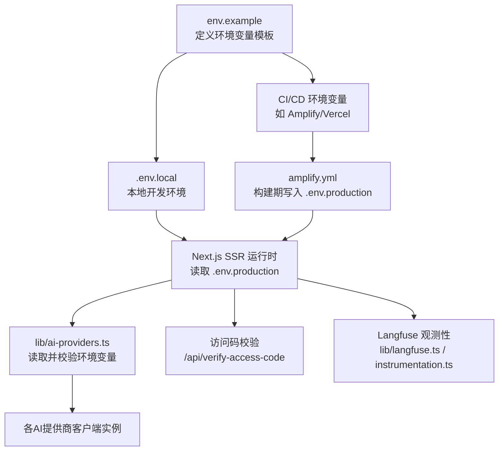
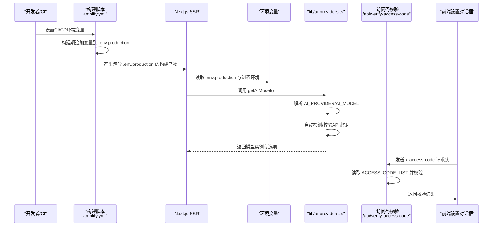
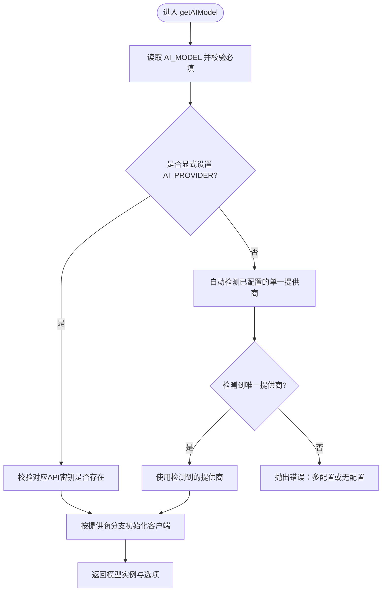
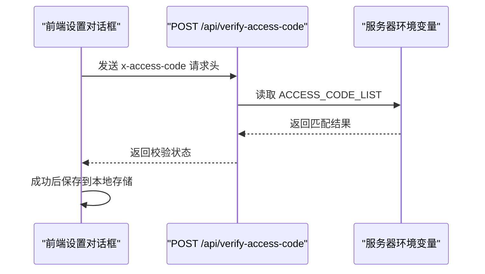
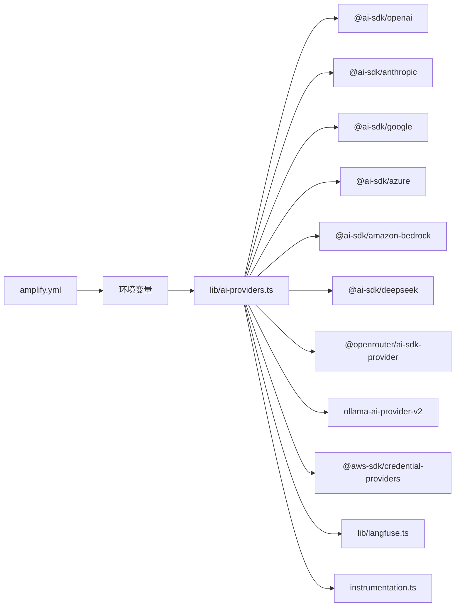

# 凭证管理

<cite>
**本文引用的文件**
- [env.example](file://env.example)
- [lib/ai-providers.ts](file://lib/ai-providers.ts)
- [docs/ai-providers.md](file://docs/ai-providers.md)
- [.gitignore](file://.gitignore)
- [amplify.yml](file://amplify.yml)
- [README.md](file://README.md)
- [lib/langfuse.ts](file://lib/langfuse.ts)
- [instrumentation.ts](file://instrumentation.ts)
- [app/api/verify-access-code/route.ts](file://app/api/verify-access-code/route.ts)
- [app/api/config/route.ts](file://app/api/config/route.ts)
- [components/settings-dialog.tsx](file://components/settings-dialog.tsx)
</cite>

## 目录
1. [简介](#简介)
2. [项目结构](#项目结构)
3. [核心组件](#核心组件)
4. [架构总览](#架构总览)
5. [详细组件分析](#详细组件分析)
6. [依赖关系分析](#依赖关系分析)
7. [性能考量](#性能考量)
8. [故障排查指南](#故障排查指南)
9. [结论](#结论)
10. [附录](#附录)

## 简介
本章节聚焦于项目中敏感信息（如AI服务API密钥、访问码等）的存储与加载机制，系统性说明.env.example中定义的环境变量如何被安全地注入到应用中，并在lib/ai-providers.ts中用于初始化不同AI提供商的客户端实例。文档强调敏感配置项不硬编码、通过环境隔离（开发/生产）提升安全性，并提供配置示例、密钥轮换建议以及防止泄露的措施（如.gitignore保护、CI/CD中的加密变量使用），同时指出潜在风险点与缓解方法。

## 项目结构
围绕凭证管理的关键文件与职责如下：
- 环境变量模板：env.example 定义了所有支持的AI提供商与可选观测性配置项，作为本地与CI/CD注入的参考。
- 提供商初始化：lib/ai-providers.ts 读取环境变量，自动检测或显式指定提供商，校验所需密钥，按需设置自定义端点与头信息，最终返回模型实例与选项。
- 部署与注入：amplify.yml 在构建阶段将必要的运行时环境变量写入 .env.production，以供Next.js SSR使用；README.md 提供本地与容器化部署的环境变量设置指引。
- 安全访问控制：app/api/verify-access-code/route.ts 与 components/settings-dialog.tsx 联合实现基于服务器端配置的访问码校验，避免前端硬编码。
- 观测性与密钥：lib/langfuse.ts 与 instrumentation.ts 仅在LANGFUSE_*环境变量存在时启用，避免泄露。

图表来源
- [env.example](file://env.example#L1-L63)
- [amplify.yml](file://amplify.yml#L1-L23)
- [lib/ai-providers.ts](file://lib/ai-providers.ts#L112-L285)
- [app/api/verify-access-code/route.ts](file://app/api/verify-access-code/route.ts#L1-L32)
- [lib/langfuse.ts](file://lib/langfuse.ts#L1-L108)
- [instrumentation.ts](file://instrumentation.ts#L1-L39)

章节来源
- [env.example](file://env.example#L1-L63)
- [amplify.yml](file://amplify.yml#L1-L23)
- [lib/ai-providers.ts](file://lib/ai-providers.ts#L112-L285)
- [README.md](file://README.md#L147-L169)

## 核心组件
- 环境变量模板与注入
  - env.example 定义了AI_PROVIDER、AI_MODEL、各提供商API密钥、可选自定义端点、温度与访问码列表等键名，作为本地与CI/CD注入的参考。
  - README.md 指导本地复制env.example为.env.local并编辑配置；Docker运行示例展示了通过--env-file或-e参数注入环境变量。
  - amplify.yml 在构建阶段将AI_MODEL、AI_PROVIDER、OPENAI_API_KEY等运行时必需变量追加到 .env.production，确保SSR读取。
- 提供商初始化与校验
  - lib/ai-providers.ts 通过process.env读取AI_MODEL与AI_PROVIDER，若未显式设置则尝试自动检测已配置的单一提供商API密钥；对缺失的必要密钥抛出明确错误。
  - 对各提供商支持自定义BASE_URL与特定头（如Anthropic Beta头），并在Bedrock场景下优先使用IAM角色链路，回退至AWS本地环境变量。
- 访问控制
  - app/api/verify-access-code/route.ts 依据服务器端ACCESS_CODE_LIST进行校验；components/settings-dialog.tsx 前端提交时携带x-access-code请求头。
- 观测性密钥
  - lib/langfuse.ts 与 instrumentation.ts 仅在LANGFUSE_PUBLIC_KEY/LANGFUSE_SECRET_KEY存在时启用，避免泄露。

章节来源
- [env.example](file://env.example#L1-L63)
- [README.md](file://README.md#L111-L169)
- [amplify.yml](file://amplify.yml#L1-L23)
- [lib/ai-providers.ts](file://lib/ai-providers.ts#L41-L89)
- [lib/ai-providers.ts](file://lib/ai-providers.ts#L112-L285)
- [app/api/verify-access-code/route.ts](file://app/api/verify-access-code/route.ts#L1-L32)
- [components/settings-dialog.tsx](file://components/settings-dialog.tsx#L42-L155)
- [lib/langfuse.ts](file://lib/langfuse.ts#L1-L108)
- [instrumentation.ts](file://instrumentation.ts#L1-L39)

## 架构总览
下图展示从环境变量注入到AI客户端初始化与访问控制的整体流程。

图表来源
- [amplify.yml](file://amplify.yml#L1-L23)
- [lib/ai-providers.ts](file://lib/ai-providers.ts#L112-L285)
- [app/api/verify-access-code/route.ts](file://app/api/verify-access-code/route.ts#L1-L32)
- [components/settings-dialog.tsx](file://components/settings-dialog.tsx#L42-L155)

## 详细组件分析

### 环境变量模板与注入策略
- 模板定义
  - env.example 明确列出所有受支持的提供商密钥与可选自定义端点键名，便于统一管理与审计。
- 注入方式
  - 本地开发：README.md 指导复制env.example为.env.local并编辑；Next.js在开发模式下会读取该文件。
  - 容器化/部署：README.md 提供Docker示例，可通过--env-file或-e参数注入；amplify.yml在构建期将关键变量追加到 .env.production，确保SSR可用。
- 安全隔离
  - .gitignore 忽略 .env* 文件，避免将敏感变量提交到版本库。
  - ACCESS_CODE_LIST 可在服务器端集中配置，前端仅通过请求头传递，降低泄露风险。

章节来源
- [env.example](file://env.example#L1-L63)
- [README.md](file://README.md#L111-L169)
- [.gitignore](file://.gitignore#L33-L34)
- [amplify.yml](file://amplify.yml#L1-L23)

### AI提供商初始化与密钥校验
- 自动检测逻辑
  - 若未显式设置AI_PROVIDER，lib/ai-providers.ts会扫描已配置的API密钥，若仅有一个则自动选择；若多个则要求显式设置AI_PROVIDER，否则抛错。
- 密钥校验
  - 对每个提供商，根据PROVIDER_ENV_VARS映射检查对应环境变量是否存在，缺失即抛出明确错误提示。
- 自定义端点与头
  - 多数提供商支持通过BASE_URL覆盖默认端点；部分模型（如Anthropic）需要特定Beta头。
- Bedrock凭证链
  - 优先使用fromNodeProviderChain()解析IAM角色或本地AWS环境变量，兼顾本地与云上部署。

图表来源
- [lib/ai-providers.ts](file://lib/ai-providers.ts#L112-L285)

章节来源
- [lib/ai-providers.ts](file://lib/ai-providers.ts#L41-L89)
- [lib/ai-providers.ts](file://lib/ai-providers.ts#L112-L285)

### 访问码控制与前端交互
- 服务器端校验
  - app/api/verify-access-code/route.ts 读取ACCESS_CODE_LIST，若为空则放行；否则要求请求头x-access-code且匹配任一配置值。
- 前端交互
  - components/settings-dialog.tsx 支持用户输入访问码并通过POST /api/verify-access-code校验，成功后保存到本地存储，避免重复输入。
- 配置查询
  - app/api/config/route.ts 返回当前是否需要访问码，便于前端动态显示。

图表来源
- [components/settings-dialog.tsx](file://components/settings-dialog.tsx#L42-L155)
- [app/api/verify-access-code/route.ts](file://app/api/verify-access-code/route.ts#L1-L32)
- [app/api/config/route.ts](file://app/api/config/route.ts#L1-L12)

章节来源
- [app/api/verify-access-code/route.ts](file://app/api/verify-access-code/route.ts#L1-L32)
- [components/settings-dialog.tsx](file://components/settings-dialog.tsx#L42-L155)
- [app/api/config/route.ts](file://app/api/config/route.ts#L1-L12)

### 观测性密钥的安全使用
- 条件启用
  - lib/langfuse.ts 与 instrumentation.ts 仅在LANGFUSE_PUBLIC_KEY与LANGFUSE_SECRET_KEY均存在时才初始化与注册，避免未配置时的空指针或泄露。
- 端点与隐私
  - 可通过LANGFUSE_BASEURL切换区域；代码中禁用自动记录输入，仅手动记录用户文本输入，减少大体积数据上传风险。

章节来源
- [lib/langfuse.ts](file://lib/langfuse.ts#L1-L108)
- [instrumentation.ts](file://instrumentation.ts#L1-L39)

## 依赖关系分析
- 组件耦合
  - lib/ai-providers.ts 依赖process.env与各提供商SDK；与amplify.yml共同保证SSR运行时可见的环境变量。
  - 访问码相关API与前端组件解耦，通过HTTP请求头传递，避免在前端代码中直接暴露密钥。
  - 观测性模块与主业务解耦，仅在配置齐全时启用。
- 外部依赖
  - 各提供商SDK通过package.json声明；AWS凭证链依赖@aws-sdk/credential-providers。
- 潜在环路
  - 当前结构无循环依赖；各模块职责清晰，通过环境变量与HTTP接口交互。

图表来源
- [lib/ai-providers.ts](file://lib/ai-providers.ts#L1-L20)
- [amplify.yml](file://amplify.yml#L1-L23)
- [lib/langfuse.ts](file://lib/langfuse.ts#L1-L108)
- [instrumentation.ts](file://instrumentation.ts#L1-L39)

章节来源
- [lib/ai-providers.ts](file://lib/ai-providers.ts#L1-L20)
- [package.json](file://package.json#L16-L60)

## 性能考量
- 环境变量读取开销
  - 读取process.env为常量时间操作，对整体性能影响可忽略。
- 初始化成本
  - 各提供商客户端初始化通常发生在应用启动或首次调用时，建议结合懒加载与缓存策略减少重复初始化。
- SSR与构建期注入
  - 通过amplify.yml在构建期注入关键变量，避免运行时额外I/O；但需注意变量变更后需重新构建。

## 故障排查指南
- 缺少AI_MODEL
  - 现象：启动时报错提示需要设置AI_MODEL。
  - 排查：确认.env.local或构建注入中已设置AI_MODEL。
- 未设置AI_PROVIDER且配置多个API密钥
  - 现象：自动检测失败，提示需显式设置AI_PROVIDER。
  - 排查：仅保留一个提供商的API密钥，或显式设置AI_PROVIDER。
- API密钥缺失
  - 现象：针对某提供商报错提示缺少对应API密钥。
  - 排查：确认对应环境变量已正确设置；检查是否误用了BASE_URL导致连接失败。
- Bedrock凭证问题
  - 现象：本地开发无法使用IAM角色或凭据无效。
  - 排查：确保AWS_REGION/AWS_ACCESS_KEY_ID/AWS_SECRET_ACCESS_KEY正确；云上部署请确认IAM角色权限。
- 访问码校验失败
  - 现象：前端弹出“无效访问码”或401。
  - 排查：确认服务器端ACCESS_CODE_LIST已配置且与前端提交的x-access-code一致；检查请求头是否正确传递。
- 观测性未生效
  - 现象：Langfuse未记录或警告未配置。
  - 排查：确认LANGFUSE_PUBLIC_KEY/LANGFUSE_SECRET_KEY/LANGFUSE_BASEURL均已设置。

章节来源
- [lib/ai-providers.ts](file://lib/ai-providers.ts#L112-L156)
- [lib/ai-providers.ts](file://lib/ai-providers.ts#L158-L160)
- [lib/ai-providers.ts](file://lib/ai-providers.ts#L167-L282)
- [app/api/verify-access-code/route.ts](file://app/api/verify-access-code/route.ts#L1-L32)
- [lib/langfuse.ts](file://lib/langfuse.ts#L1-L22)

## 结论
本项目通过env.example统一定义敏感配置项，借助amplify.yml在构建期注入关键变量，配合lib/ai-providers.ts的自动检测与严格校验，实现了“不硬编码、可隔离、可审计”的凭证管理模式。结合ACCESS_CODE_LIST与前端校验、Langfuse条件启用等机制，进一步降低了泄露风险与滥用风险。建议在团队内严格执行密钥轮换与最小权限原则，并在CI/CD中使用加密变量与环境分层管理。

## 附录

### 配置示例与最佳实践
- 本地开发
  - 复制env.example为.env.local，按需填写AI_PROVIDER、AI_MODEL与对应API密钥；如需自定义端点，添加相应BASE_URL。
- 容器化部署
  - 使用--env-file .env 或 -e 注入环境变量；确保构建产物包含必要的运行时变量。
- CI/CD注入
  - 在构建脚本中追加关键变量到 .env.production；在平台侧使用加密变量与环境分层。
- 密钥轮换建议
  - 采用短期密钥与轮换计划；在平台侧支持密钥切换与回滚；更新后立即触发重建。
- 防止泄露措施
  - .gitignore 已忽略 .env*；在CI/CD中使用加密变量而非明文；限制访问范围与最小权限；定期审计与清理历史密钥。
- 潜在风险点与缓解
  - 风险：多提供商密钥同时存在导致自动检测失败。
    - 缓解：仅保留一个提供商密钥，或显式设置AI_PROVIDER。
  - 风险：前端直接暴露密钥。
    - 缓解：仅通过服务器端API与请求头传递，避免在前端代码中硬编码。
  - 风险：未配置Langfuse密钥导致可观测性缺失。
    - 缓解：按需启用并配置LANGFUSE_*，避免默认开启。

章节来源
- [env.example](file://env.example#L1-L63)
- [README.md](file://README.md#L111-L169)
- [amplify.yml](file://amplify.yml#L1-L23)
- [lib/ai-providers.ts](file://lib/ai-providers.ts#L112-L156)
- [lib/langfuse.ts](file://lib/langfuse.ts#L1-L22)