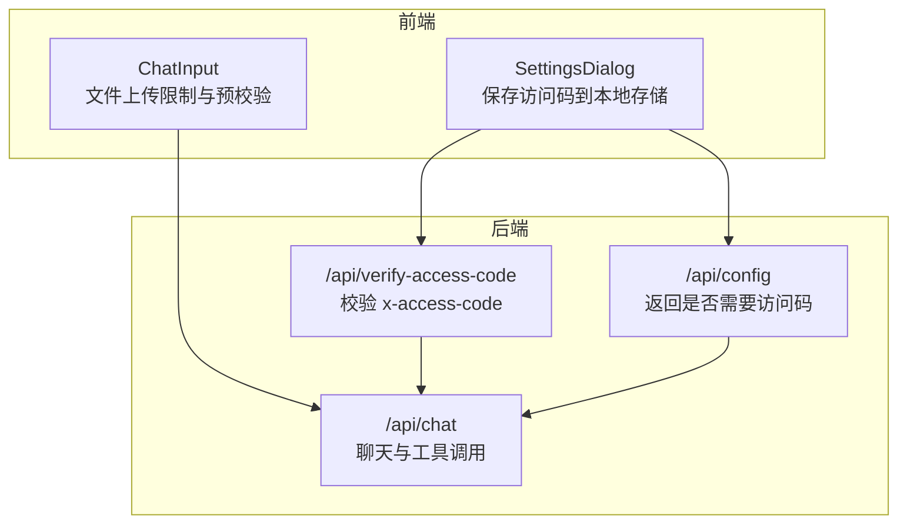
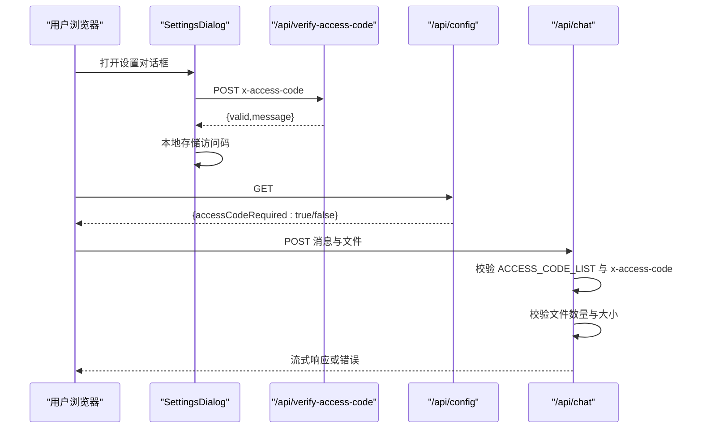
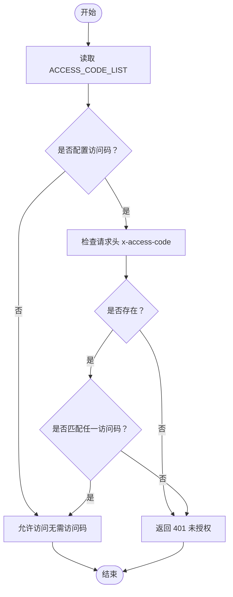
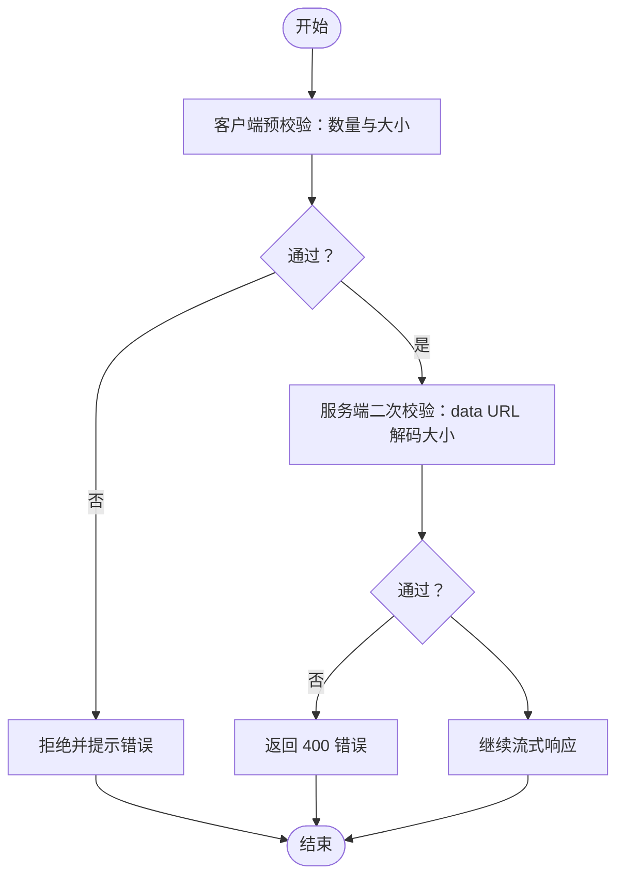
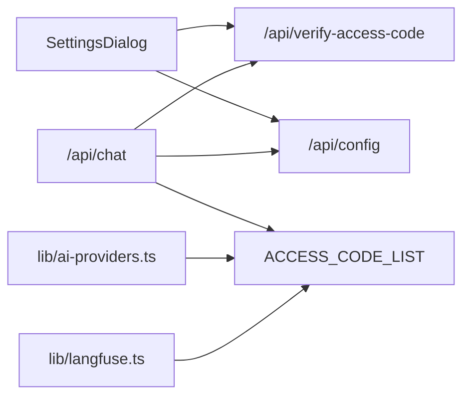

# 安全机制

<cite>
**本文引用的文件**
- [app/api/verify-access-code/route.ts](file://app/api/verify-access-code/route.ts)
- [app/api/chat/route.ts](file://app/api/chat/route.ts)
- [app/api/config/route.ts](file://app/api/config/route.ts)
- [components/settings-dialog.tsx](file://components/settings-dialog.tsx)
- [components/chat-input.tsx](file://components/chat-input.tsx)
- [lib/ai-providers.ts](file://lib/ai-providers.ts)
- [lib/langfuse.ts](file://lib/langfuse.ts)
- [lib/system-prompts.ts](file://lib/system-prompts.ts)
- [lib/utils.ts](file://lib/utils.ts)
- [lib/cached-responses.ts](file://lib/cached-responses.ts)
- [env.example](file://env.example)
- [README.md](file://README.md)
</cite>

## 目录
1. [简介](#简介)
2. [项目结构](#项目结构)
3. [核心组件](#核心组件)
4. [架构总览](#架构总览)
5. [详细组件分析](#详细组件分析)
6. [依赖关系分析](#依赖关系分析)
7. [性能与安全权衡](#性能与安全权衡)
8. [故障排查指南](#故障排查指南)
9. [结论](#结论)
10. [附录：最佳实践清单](#附录最佳实践清单)

## 简介
本文件聚焦于项目的访问控制与数据保护策略，系统性解析以下安全要点：
- 基于请求头 x-access-code 的访问码验证机制在 /api/verify-access-code 与 /api/chat 中的双重防护设计
- 环境变量（如 API 密钥）的安全管理方式，包括敏感信息的隔离与加载机制
- 文件上传限制（大小、数量）的实现逻辑及其防滥用作用
- 认证流程、速率限制潜在风险及缓解措施
- 安全配置的最佳实践指南

## 项目结构
从安全视角看，项目采用“前端设置对话框 + 后端 API 路由”的分层设计：
- 前端负责用户交互与本地存储（如访问码），并通过 /api/verify-access-code 进行服务端校验
- 后端路由统一进行访问码校验与资源访问控制，并对敏感参数进行最小化记录
- 配置接口 /api/config 提供是否需要访问码的提示，便于客户端动态调整 UI

图表来源
- [components/settings-dialog.tsx](file://components/settings-dialog.tsx#L51-L85)
- [app/api/verify-access-code/route.ts](file://app/api/verify-access-code/route.ts#L1-L32)
- [app/api/config/route.ts](file://app/api/config/route.ts#L1-L12)
- [app/api/chat/route.ts](file://app/api/chat/route.ts#L145-L161)

章节来源
- [components/settings-dialog.tsx](file://components/settings-dialog.tsx#L51-L85)
- [app/api/verify-access-code/route.ts](file://app/api/verify-access-code/route.ts#L1-L32)
- [app/api/config/route.ts](file://app/api/config/route.ts#L1-L12)
- [app/api/chat/route.ts](file://app/api/chat/route.ts#L145-L161)

## 核心组件
- 访问码验证与配置接口
  - /api/verify-access-code：读取环境变量 ACCESS_CODE_LIST 并校验请求头 x-access-code
  - /api/config：根据 ACCESS_CODE_LIST 是否配置返回是否需要访问码
- 聊天接口与访问控制
  - /api/chat：在处理请求前执行访问码校验；同时对文件上传进行严格限制
- 前端设置与输入组件
  - SettingsDialog：保存访问码至本地存储，并通过 /api/verify-access-code 校验
  - ChatInput：在客户端侧先做文件数量与大小的预校验，减少无效请求
- 环境变量与凭据管理
  - env.example 与 lib/ai-providers.ts：集中定义各提供商的 API 密钥与可选自定义端点，避免硬编码
- 观测与日志
  - lib/langfuse.ts：按需启用遥测，避免上传大体积媒体数据

章节来源
- [app/api/verify-access-code/route.ts](file://app/api/verify-access-code/route.ts#L1-L32)
- [app/api/config/route.ts](file://app/api/config/route.ts#L1-L12)
- [app/api/chat/route.ts](file://app/api/chat/route.ts#L145-L161)
- [components/settings-dialog.tsx](file://components/settings-dialog.tsx#L51-L85)
- [components/chat-input.tsx](file://components/chat-input.tsx#L34-L86)
- [lib/ai-providers.ts](file://lib/ai-providers.ts#L41-L52)
- [lib/langfuse.ts](file://lib/langfuse.ts#L1-L22)

## 架构总览
下图展示访问码校验在前后端的协同流程，以及聊天接口中的双重防护（访问码 + 文件限制）。

图表来源
- [components/settings-dialog.tsx](file://components/settings-dialog.tsx#L51-L85)
- [app/api/verify-access-code/route.ts](file://app/api/verify-access-code/route.ts#L1-L32)
- [app/api/config/route.ts](file://app/api/config/route.ts#L1-L12)
- [app/api/chat/route.ts](file://app/api/chat/route.ts#L145-L161)

## 详细组件分析

### 访问码验证机制（双重防护）
- /api/verify-access-code
  - 从环境变量 ACCESS_CODE_LIST 解析逗号分隔的访问码列表
  - 若未配置，直接返回“无需访问码”
  - 若配置了访问码，必须在请求头 x-access-code 中提供，且必须匹配任一访问码
  - 缺失或不匹配时返回 401
- /api/chat
  - 在处理函数内部重复执行相同的访问码校验逻辑，确保双重防护
  - 即使前端未携带访问码，后端也会拒绝请求
- 前端 SettingsDialog
  - 将访问码保存到本地存储，提交时调用 /api/verify-access-code 校验
  - 仅当校验通过才持久化设置

图表来源
- [app/api/verify-access-code/route.ts](file://app/api/verify-access-code/route.ts#L1-L32)
- [app/api/chat/route.ts](file://app/api/chat/route.ts#L145-L161)
- [components/settings-dialog.tsx](file://components/settings-dialog.tsx#L51-L85)

章节来源
- [app/api/verify-access-code/route.ts](file://app/api/verify-access-code/route.ts#L1-L32)
- [app/api/chat/route.ts](file://app/api/chat/route.ts#L145-L161)
- [components/settings-dialog.tsx](file://components/settings-dialog.tsx#L51-L85)

### 环境变量与敏感信息管理
- 环境变量集中定义
  - env.example 明确列出各提供商的 API 密钥与可选自定义端点
  - README.md 强调 ACCESS_CODE_LIST 的重要性与部署建议
- 凭据加载与校验
  - lib/ai-providers.ts 统一读取并校验所需凭据，自动检测可用提供商，避免硬编码
  - 未配置必要凭据时抛出明确错误，防止静默失败
- 最小化记录
  - lib/langfuse.ts 按需启用遥测，避免自动上传大体积媒体数据，仅手动记录文本输入

章节来源
- [env.example](file://env.example#L1-L63)
- [README.md](file://README.md#L140-L165)
- [lib/ai-providers.ts](file://lib/ai-providers.ts#L41-L52)
- [lib/ai-providers.ts](file://lib/ai-providers.ts#L78-L89)
- [lib/ai-providers.ts](file://lib/ai-providers.ts#L112-L160)
- [lib/langfuse.ts](file://lib/langfuse.ts#L1-L22)
- [lib/langfuse.ts](file://lib/langfuse.ts#L78-L96)

### 文件上传限制与防滥用
- 客户端预校验
  - ChatInput 对文件数量（最多 5）与单文件大小（最大 2MB）进行预校验，减少无效请求
- 服务端二次校验
  - /api/chat 内部对消息中的文件部分进行二次校验，计算 data URL 的解码字节数以判断是否超过限制
  - 超限时返回 400 错误
- 其他安全措施
  - 系统提示中强调 XML 结构规则，避免生成非法或易被滥用的结构
  - 通过缓存与工具调用修复，降低模型输出错误导致的额外消耗

图表来源
- [components/chat-input.tsx](file://components/chat-input.tsx#L34-L86)
- [app/api/chat/route.ts](file://app/api/chat/route.ts#L21-L59)
- [lib/system-prompts.ts](file://lib/system-prompts.ts#L135-L173)

章节来源
- [components/chat-input.tsx](file://components/chat-input.tsx#L34-L86)
- [app/api/chat/route.ts](file://app/api/chat/route.ts#L21-L59)
- [lib/system-prompts.ts](file://lib/system-prompts.ts#L135-L173)

### 认证流程、速率限制与缓解
- 认证流程
  - SettingsDialog 通过 /api/verify-access-code 校验访问码，成功后再写入本地存储
  - /api/config 返回是否需要访问码，前端据此决定是否显示输入框
- 速率限制
  - 当前代码未内置速率限制中间件
  - 建议在网关或边缘层（如 Vercel/Cloudflare）添加限速策略，或在应用层引入轻量限流器（例如基于内存或 Redis 的令牌桶）
- 缓存与可观测性
  - lib/cached-responses.ts 提供示例缓存，减少重复请求
  - lib/langfuse.ts 按需启用遥测，避免上传大体积媒体

章节来源
- [components/settings-dialog.tsx](file://components/settings-dialog.tsx#L51-L85)
- [app/api/config/route.ts](file://app/api/config/route.ts#L1-L12)
- [lib/cached-responses.ts](file://lib/cached-responses.ts#L551-L562)
- [lib/langfuse.ts](file://lib/langfuse.ts#L78-L96)

## 依赖关系分析
- 访问码链路
  - SettingsDialog 依赖 /api/verify-access-code 与 /api/config
  - /api/chat 依赖 ACCESS_CODE_LIST 与请求头 x-access-code
- 凭据链路
  - lib/ai-providers.ts 依赖各提供商的环境变量
- 日志链路
  - lib/langfuse.ts 依赖环境变量开关

图表来源
- [components/settings-dialog.tsx](file://components/settings-dialog.tsx#L51-L85)
- [app/api/verify-access-code/route.ts](file://app/api/verify-access-code/route.ts#L1-L32)
- [app/api/config/route.ts](file://app/api/config/route.ts#L1-L12)
- [app/api/chat/route.ts](file://app/api/chat/route.ts#L145-L161)
- [lib/ai-providers.ts](file://lib/ai-providers.ts#L41-L52)
- [lib/langfuse.ts](file://lib/langfuse.ts#L1-L22)

章节来源
- [components/settings-dialog.tsx](file://components/settings-dialog.tsx#L51-L85)
- [app/api/verify-access-code/route.ts](file://app/api/verify-access-code/route.ts#L1-L32)
- [app/api/config/route.ts](file://app/api/config/route.ts#L1-L12)
- [app/api/chat/route.ts](file://app/api/chat/route.ts#L145-L161)
- [lib/ai-providers.ts](file://lib/ai-providers.ts#L41-L52)
- [lib/langfuse.ts](file://lib/langfuse.ts#L1-L22)

## 性能与安全权衡
- 双重访问码校验
  - 优点：提升安全性，即使前端绕过也能被后端拦截
  - 成本：增加一次请求往返与 CPU 开销（字符串匹配）
- 文件大小与数量限制
  - 优点：显著降低带宽与下游模型成本，减少滥用风险
  - 成本：对大图或批量上传场景可能带来不便，但可通过缓存与工具调用修复缓解
- 观测与日志
  - 优点：便于审计与问题定位
  - 成本：避免上传大媒体可降低遥测成本与隐私风险

[本节为通用指导，不直接分析具体文件]

## 故障排查指南
- 访问码相关
  - 症状：返回 401 未授权
  - 排查：确认 ACCESS_CODE_LIST 是否正确配置；请求头是否包含 x-access-code；值是否与配置一致
- 文件上传相关
  - 症状：返回 400 错误
  - 排查：检查文件数量是否超过上限；单文件大小是否超过限制；data URL 是否有效
- 遥测相关
  - 症状：无遥测数据
  - 排查：确认是否设置了公钥/私钥；是否启用了记录输入；是否正确传入 sessionId/userId

章节来源
- [app/api/verify-access-code/route.ts](file://app/api/verify-access-code/route.ts#L1-L32)
- [app/api/chat/route.ts](file://app/api/chat/route.ts#L145-L161)
- [app/api/chat/route.ts](file://app/api/chat/route.ts#L187-L191)
- [lib/langfuse.ts](file://lib/langfuse.ts#L78-L96)

## 结论
该项目在访问控制与数据保护方面采取了“前端校验 + 后端二次校验 + 严格的文件限制 + 环境变量集中管理”的组合策略。通过双重访问码校验与文件大小/数量限制，有效降低了滥用风险与成本。建议在生产环境中补充速率限制与更细粒度的访问控制策略，并持续审查环境变量与日志记录策略以满足合规要求。

[本节为总结性内容，不直接分析具体文件]

## 附录：最佳实践清单
- 访问控制
  - 必须设置 ACCESS_CODE_LIST，避免公开访问
  - 前端 SettingsDialog 仅在服务端校验通过后才持久化访问码
  - 后端在每个入口均执行访问码校验
- 环境变量
  - 使用 .env.local 存储敏感信息，禁止提交到版本库
  - 通过 lib/ai-providers.ts 统一读取与校验，避免硬编码
- 文件上传
  - 前端与后端均进行数量与大小校验
  - 严格限制 data URL 的解码大小，避免超大负载
- 速率限制
  - 在网关或边缘层添加限速策略
  - 应用层可引入轻量限流器（令牌桶/滑动窗口）
- 观测与日志
  - 按需启用遥测，避免上传大体积媒体
  - 仅记录必要的会话与用户标识，遵循最小化原则

[本节为通用指导，不直接分析具体文件]