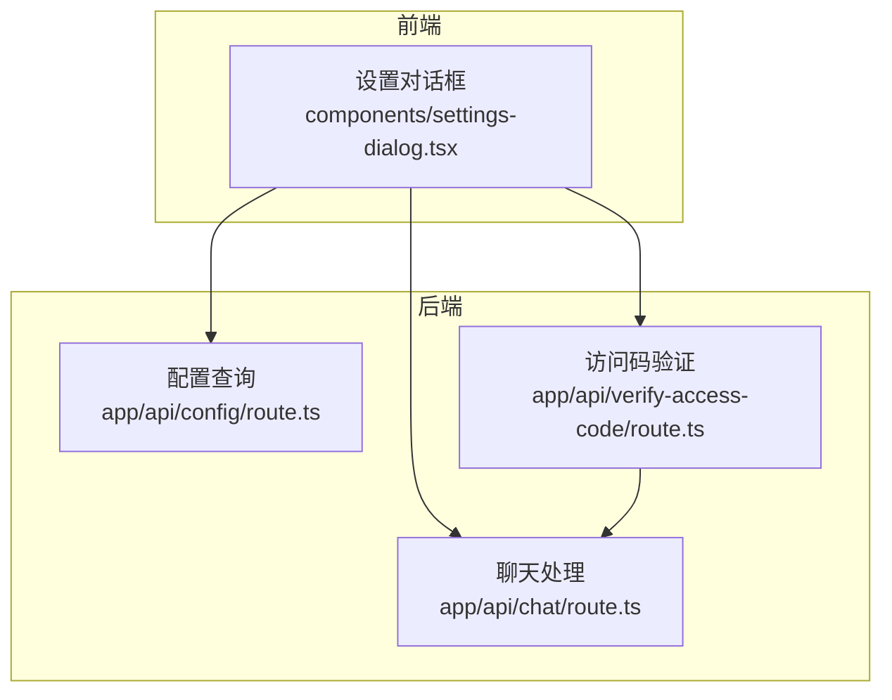
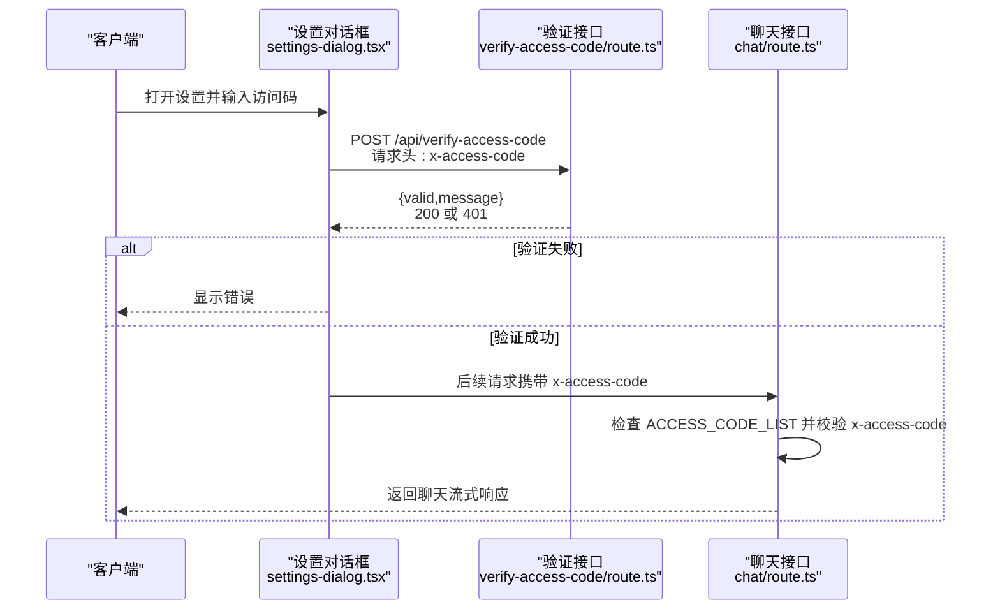
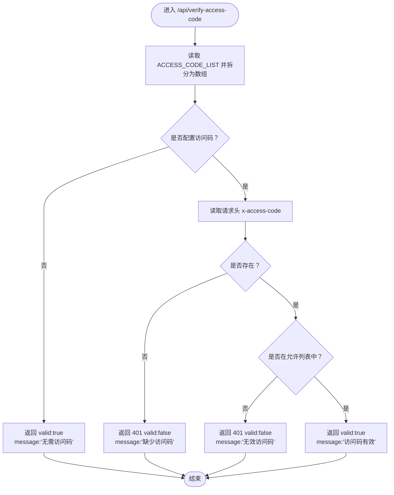
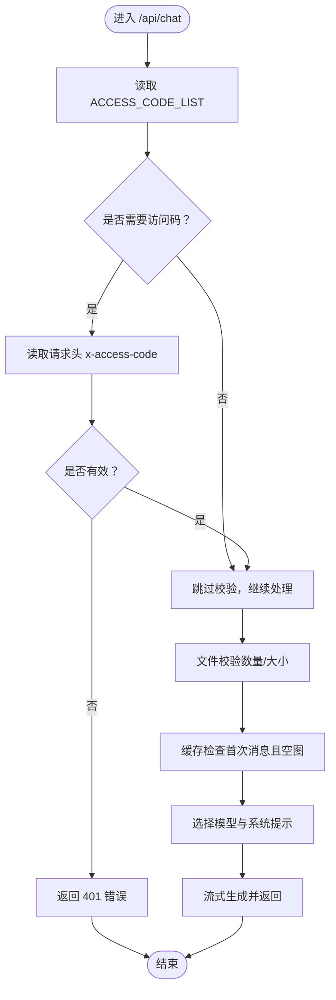
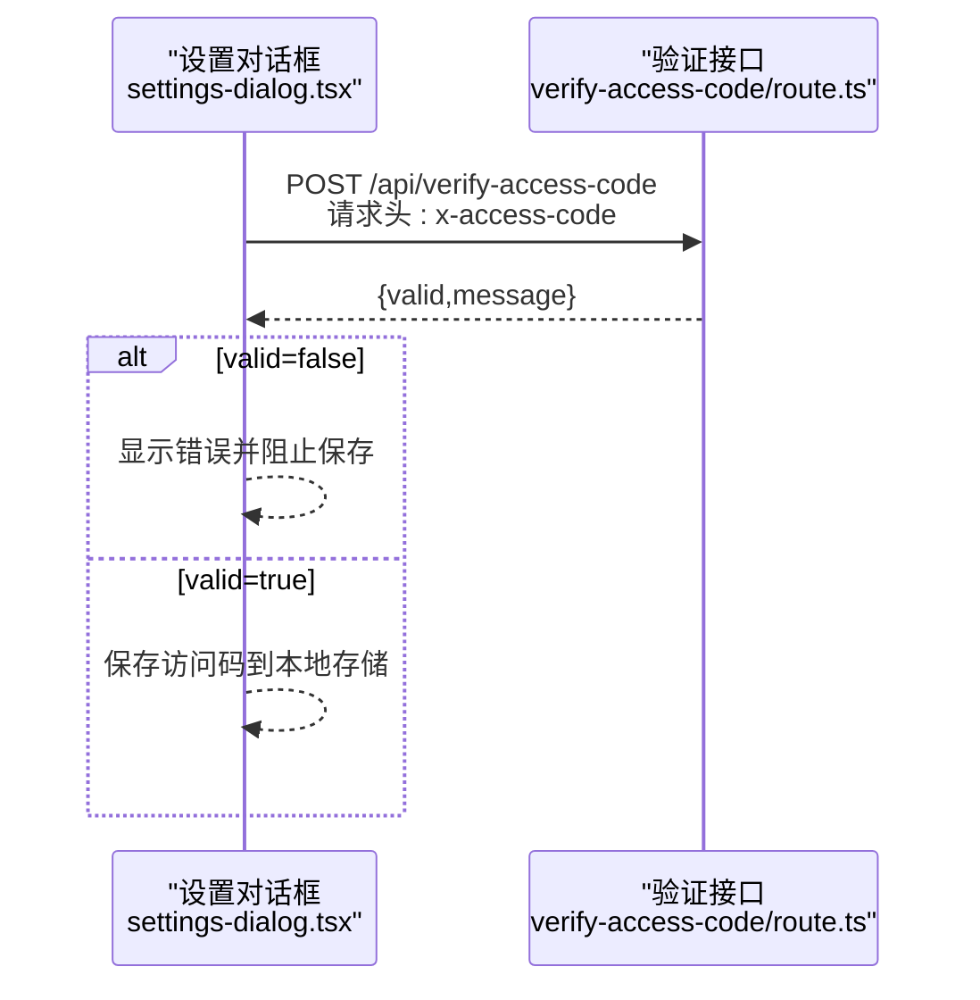
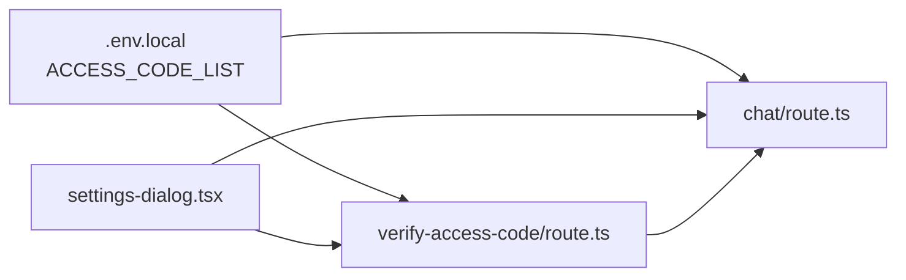

# 访问控制

<cite>
**本文引用的文件**
- [app/api/verify-access-code/route.ts](file://app/api/verify-access-code/route.ts)
- [app/api/chat/route.ts](file://app/api/chat/route.ts)
- [components/settings-dialog.tsx](file://components/settings-dialog.tsx)
- [app/api/config/route.ts](file://app/api/config/route.ts)
- [lib/cached-responses.ts](file://lib/cached-responses.ts)
- [env.example](file://env.example)
- [README.md](file://README.md)
</cite>

## 目录
1. [简介](#简介)
2. [项目结构](#项目结构)
3. [核心组件](#核心组件)
4. [架构总览](#架构总览)
5. [详细组件分析](#详细组件分析)
6. [依赖关系分析](#依赖关系分析)
7. [性能考量](#性能考量)
8. [故障排查指南](#故障排查指南)
9. [结论](#结论)
10. [附录](#附录)

## 简介
本文件聚焦于系统的访问控制机制，围绕“基于 x-access-code 请求头的身份验证”展开，详细说明：
- /api/verify-access-code 路由如何验证访问码的有效性，并返回授权状态；
- 如何与 /api/chat 路由集成，实现双重安全防护（在处理敏感 AI 交互前确保用户已通过身份验证）；
- 提供请求拦截、中间件逻辑与错误响应处理的代码路径参考；
- 讨论潜在绕过风险与应对策略，以及生产环境最佳实践。

## 项目结构
访问控制相关的关键位置如下：
- 后端 API
  - 验证接口：/api/verify-access-code/route.ts
  - 主聊天接口：/api/chat/route.ts
  - 配置查询接口：/api/config/route.ts
- 前端设置对话框：components/settings-dialog.tsx
- 缓存与工具：lib/cached-responses.ts
- 环境变量模板：env.example
- 项目文档：README.md

图表来源
- [components/settings-dialog.tsx](file://components/settings-dialog.tsx#L51-L85)
- [app/api/config/route.ts](file://app/api/config/route.ts#L1-L12)
- [app/api/verify-access-code/route.ts](file://app/api/verify-access-code/route.ts#L1-L32)
- [app/api/chat/route.ts](file://app/api/chat/route.ts#L145-L161)

章节来源
- [components/settings-dialog.tsx](file://components/settings-dialog.tsx#L51-L85)
- [app/api/config/route.ts](file://app/api/config/route.ts#L1-L12)
- [app/api/verify-access-code/route.ts](file://app/api/verify-access-code/route.ts#L1-L32)
- [app/api/chat/route.ts](file://app/api/chat/route.ts#L145-L161)

## 核心组件
- 访问码验证接口（/api/verify-access-code）
  - 从环境变量 ACCESS_CODE_LIST 读取可用的访问码列表（逗号分隔），若为空则视为无需访问码；
  - 从请求头 x-access-code 获取输入值，缺失或不在列表中时返回 401；
  - 通过时返回有效状态与消息。
- 聊天接口（/api/chat）
  - 在处理请求前，先检查 ACCESS_CODE_LIST 是否配置；
  - 若配置了访问码，则必须在请求头中携带正确的 x-access-code，否则直接返回 401；
  - 通过校验后继续执行后续业务逻辑（文件校验、缓存命中、模型调用等）。
- 设置对话框（前端）
  - 用户输入访问码后，向 /api/verify-access-code 发起带 x-access-code 的请求进行验证；
  - 验证成功后保存到本地存储，用于后续请求携带。

章节来源
- [app/api/verify-access-code/route.ts](file://app/api/verify-access-code/route.ts#L1-L32)
- [app/api/chat/route.ts](file://app/api/chat/route.ts#L145-L161)
- [components/settings-dialog.tsx](file://components/settings-dialog.tsx#L51-L85)

## 架构总览
下图展示了“前端设置对话框 -> 验证接口 -> 聊天接口”的端到端流程，以及访问码校验在聊天接口中的前置作用。

图表来源
- [components/settings-dialog.tsx](file://components/settings-dialog.tsx#L51-L85)
- [app/api/verify-access-code/route.ts](file://app/api/verify-access-code/route.ts#L1-L32)
- [app/api/chat/route.ts](file://app/api/chat/route.ts#L145-L161)

## 详细组件分析

### 组件A：访问码验证接口（/api/verify-access-code）
- 输入来源
  - 环境变量 ACCESS_CODE_LIST（逗号分隔的多个访问码）
  - 请求头 x-access-code
- 处理逻辑
  - 若 ACCESS_CODE_LIST 为空，直接返回“无需访问码”
  - 若请求头缺失，返回 401
  - 若请求头不在允许列表，返回 401
  - 其他情况返回“访问码有效”
- 错误处理
  - 401 状态码配合明确的消息体，便于前端提示

图表来源
- [app/api/verify-access-code/route.ts](file://app/api/verify-access-code/route.ts#L1-L32)

章节来源
- [app/api/verify-access-code/route.ts](file://app/api/verify-access-code/route.ts#L1-L32)

### 组件B：聊天接口（/api/chat）中的访问码前置校验
- 前置校验
  - 读取 ACCESS_CODE_LIST
  - 若存在访问码，要求请求头必须包含 x-access-code 且在列表中，否则返回 401
- 后续处理
  - 文件大小/数量校验
  - 缓存命中逻辑（首次消息且空图时）
  - 模型选择与系统提示注入
  - 流式响应返回

图表来源
- [app/api/chat/route.ts](file://app/api/chat/route.ts#L145-L161)
- [app/api/chat/route.ts](file://app/api/chat/route.ts#L187-L192)
- [app/api/chat/route.ts](file://app/api/chat/route.ts#L194-L213)
- [app/api/chat/route.ts](file://app/api/chat/route.ts#L215-L340)

章节来源
- [app/api/chat/route.ts](file://app/api/chat/route.ts#L145-L161)
- [app/api/chat/route.ts](file://app/api/chat/route.ts#L187-L192)
- [app/api/chat/route.ts](file://app/api/chat/route.ts#L194-L213)
- [app/api/chat/route.ts](file://app/api/chat/route.ts#L215-L340)

### 组件C：前端设置对话框（访问码配置与验证）
- 行为
  - 用户输入访问码后，向 /api/verify-access-code 发送带 x-access-code 的请求
  - 验证失败显示错误；验证成功保存到本地存储
- 集成点
  - 与后端验证接口通信
  - 为后续聊天请求提供访问码（由前端统一携带）

图表来源
- [components/settings-dialog.tsx](file://components/settings-dialog.tsx#L51-L85)
- [app/api/verify-access-code/route.ts](file://app/api/verify-access-code/route.ts#L1-L32)

章节来源
- [components/settings-dialog.tsx](file://components/settings-dialog.tsx#L51-L85)
- [app/api/verify-access-code/route.ts](file://app/api/verify-access-code/route.ts#L1-L32)

### 组件D：配置查询接口（/api/config）
- 用途
  - 告知前端当前服务端是否启用了访问码（根据 ACCESS_CODE_LIST 是否为空）
- 与访问控制的关系
  - 前端可据此决定是否引导用户输入访问码并调用验证接口

章节来源
- [app/api/config/route.ts](file://app/api/config/route.ts#L1-L12)

## 依赖关系分析
- 环境变量
  - ACCESS_CODE_LIST：逗号分隔的访问码列表，决定是否启用访问控制
- 前端依赖
  - 设置对话框依赖 /api/verify-access-code 进行访问码验证
  - 聊天请求依赖本地存储的访问码（由设置对话框保存）
- 后端依赖
  - 验证接口依赖 ACCESS_CODE_LIST 与请求头 x-access-code
  - 聊天接口在处理前依赖 ACCESS_CODE_LIST 与请求头 x-access-code

图表来源
- [env.example](file://env.example#L61-L63)
- [app/api/verify-access-code/route.ts](file://app/api/verify-access-code/route.ts#L1-L32)
- [app/api/chat/route.ts](file://app/api/chat/route.ts#L145-L161)
- [components/settings-dialog.tsx](file://components/settings-dialog.tsx#L51-L85)

章节来源
- [env.example](file://env.example#L61-L63)
- [app/api/verify-access-code/route.ts](file://app/api/verify-access-code/route.ts#L1-L32)
- [app/api/chat/route.ts](file://app/api/chat/route.ts#L145-L161)
- [components/settings-dialog.tsx](file://components/settings-dialog.tsx#L51-L85)

## 性能考量
- 访问码校验为常量时间操作（数组包含判断），对整体延迟影响极小
- 聊天接口的前置校验避免了不必要的模型调用与资源消耗
- 建议
  - 将 ACCESS_CODE_LIST 控制在合理规模（避免超长列表导致匹配成本上升）
  - 对频繁的验证请求进行必要的限流（可在网关或边缘层实施）

## 故障排查指南
- 常见问题与定位
  - 401 未携带访问码
    - 现象：/api/verify-access-code 返回“缺少访问码”，/api/chat 返回“无效或缺少访问码”
    - 排查：确认前端是否正确携带 x-access-code；确认 ACCESS_CODE_LIST 是否配置
  - 401 访问码无效
    - 现象：/api/verify-access-code 返回“无效访问码”
    - 排查：确认 ACCESS_CODE_LIST 中是否包含该值；注意大小写与前后空格
  - 未配置 ACCESS_CODE_LIST
    - 现象：/api/verify-access-code 返回“无需访问码”
    - 影响：/api/chat 不强制校验访问码
- 建议的错误处理与日志
  - 后端记录访问码校验失败原因（缺失、无效）以便审计
  - 前端对 401 场景给出清晰提示，并引导用户重新输入或联系管理员

章节来源
- [app/api/verify-access-code/route.ts](file://app/api/verify-access-code/route.ts#L1-L32)
- [app/api/chat/route.ts](file://app/api/chat/route.ts#L145-L161)

## 结论
本系统通过“请求头 x-access-code + ACCESS_CODE_LIST 环境变量”的组合实现了轻量级访问控制：
- /api/verify-access-code 提供即时验证能力，前端可先行校验；
- /api/chat 在处理敏感 AI 交互前进行前置校验，形成双重防护；
- 生产部署务必设置 ACCESS_CODE_LIST，避免被滥用导致资源耗尽。

## 附录

### A. 访问码绕过风险与应对策略
- 风险
  - 未设置 ACCESS_CODE_LIST：任何请求均可访问
  - 仅依赖前端本地存储：若本地被篡改或跨站脚本泄露，可能被利用
  - 重放攻击：若访问码长期不变且未做一次性限制，可能被重复使用
- 应对策略
  - 强制设置 ACCESS_CODE_LIST；必要时启用多码轮换
  - 在网关/边缘层增加速率限制与来源校验
  - 对访问码进行一次性令牌化或短期有效期管理（如引入 JWT 签发与校验）
  - 使用 HTTPS 传输，避免明文暴露
  - 定期审计访问日志，监控异常模式

章节来源
- [README.md](file://README.md#L140-L170)
- [env.example](file://env.example#L61-L63)

### B. 代码路径参考（不含具体代码内容）
- 访问码验证接口
  - [POST /api/verify-access-code](file://app/api/verify-access-code/route.ts#L1-L32)
- 聊天接口前置校验
  - [访问码检查与 401 返回](file://app/api/chat/route.ts#L145-L161)
- 前端验证与保存
  - [设置对话框发起验证与保存](file://components/settings-dialog.tsx#L51-L85)
- 配置查询（是否需要访问码）
  - [GET /api/config](file://app/api/config/route.ts#L1-L12)
- 环境变量配置
  - [ACCESS_CODE_LIST 示例](file://env.example#L61-L63)
  - [部署说明与警告](file://README.md#L140-L170)