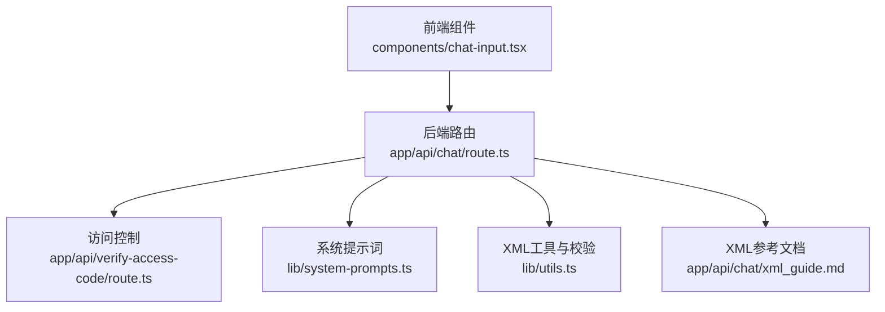
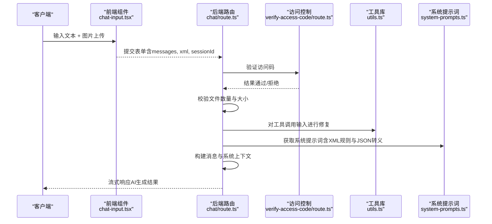
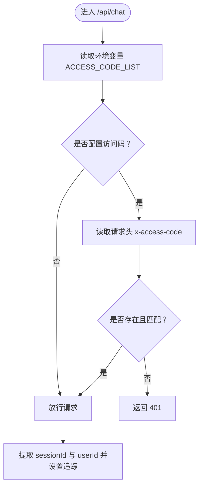
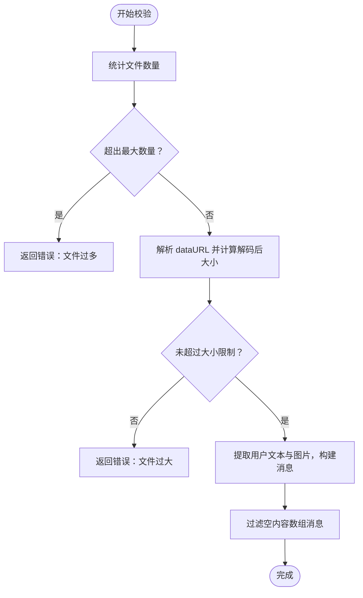
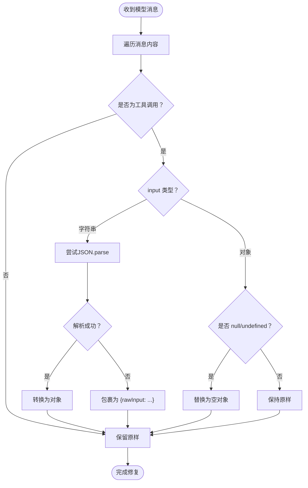
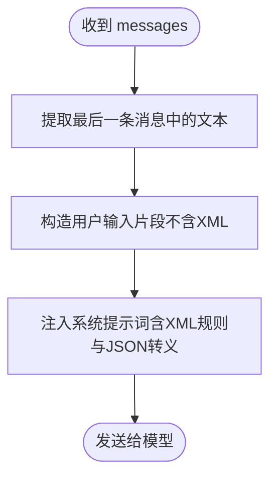
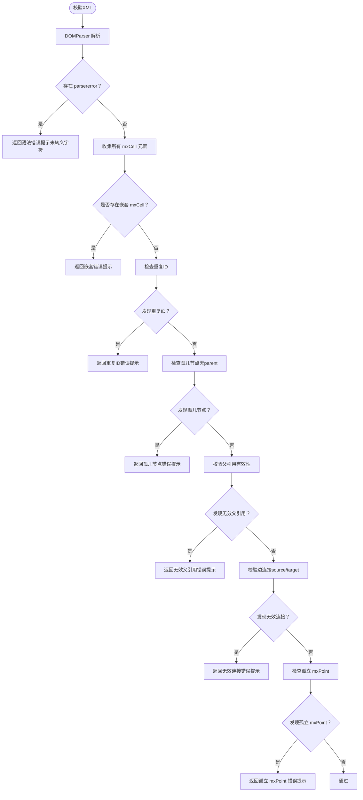
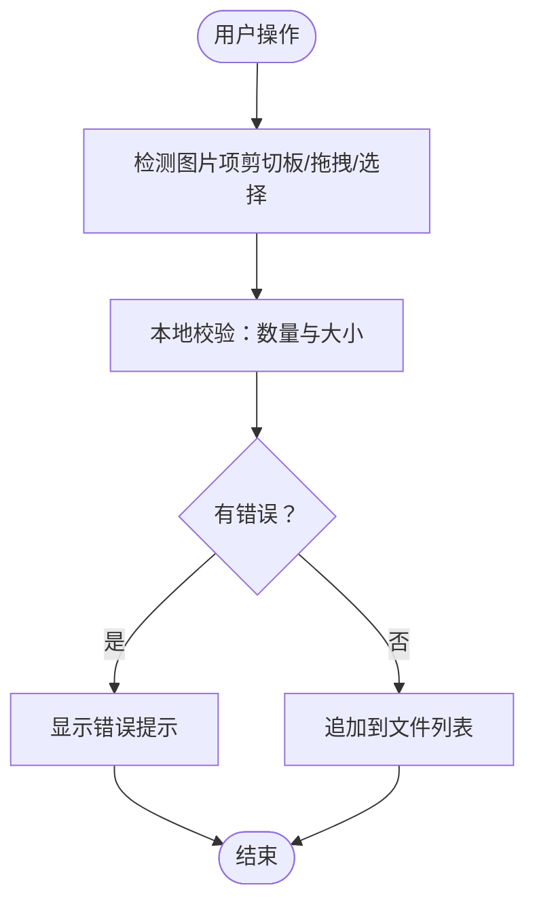
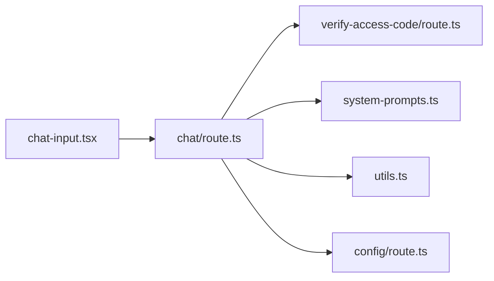

# 输入防护

<cite>
**本文引用的文件**
- [app/api/chat/route.ts](file://app/api/chat/route.ts)
- [components/chat-input.tsx](file://components/chat-input.tsx)
- [lib/utils.ts](file://lib/utils.ts)
- [lib/system-prompts.ts](file://lib/system-prompts.ts)
- [app/api/chat/xml_guide.md](file://app/api/chat/xml_guide.md)
- [app/api/verify-access-code/route.ts](file://app/api/verify-access-code/route.ts)
- [app/api/config/route.ts](file://app/api/config/route.ts)
- [components/error-toast.tsx](file://components/error-toast.tsx)
</cite>

## 目录
1. [简介](#简介)
2. [项目结构](#项目结构)
3. [核心组件](#核心组件)
4. [架构总览](#架构总览)
5. [详细组件分析](#详细组件分析)
6. [依赖关系分析](#依赖关系分析)
7. [性能考量](#性能考量)
8. [故障排查指南](#故障排查指南)
9. [结论](#结论)
10. [附录](#附录)

## 简介
本文件聚焦于 /api/chat 路由中的输入防护机制，系统性阐述如何在调用AI模型前对用户输入进行校验与限制，以防范恶意或异常输入（如超长文本、异常文件、不合规XML等），并通过多层策略降低注入与滥用风险。文档同时结合代码路径说明实现细节，并给出可扩展的输入净化与加固建议。

## 项目结构
/api/chat 路由位于后端API层，负责接收前端请求、执行访问控制、校验文件与消息、预处理用户输入、构建系统提示词与上下文、调用AI模型并返回流式响应；前端组件负责输入收集与文件上传校验；工具库提供XML解析、合法性校验与修复能力；系统提示词定义了严格的XML结构约束与JSON转义规则。

图表来源
- [app/api/chat/route.ts](file://app/api/chat/route.ts#L1-L495)
- [components/chat-input.tsx](file://components/chat-input.tsx#L1-L481)
- [lib/utils.ts](file://lib/utils.ts#L1-L711)
- [lib/system-prompts.ts](file://lib/system-prompts.ts#L1-L371)
- [app/api/chat/xml_guide.md](file://app/api/chat/xml_guide.md#L1-L323)
- [app/api/verify-access-code/route.ts](file://app/api/verify-access-code/route.ts#L1-L33)

章节来源
- [app/api/chat/route.ts](file://app/api/chat/route.ts#L1-L495)
- [components/chat-input.tsx](file://components/chat-input.tsx#L1-L481)

## 核心组件
- 访问控制中间件：通过请求头携带的访问码进行鉴权，未配置时默认放行，配置后必须匹配。
- 文件与消息校验：对消息中的文件数量、大小进行限制，对空内容数组进行过滤，确保模型输入合法。
- 用户输入预处理：提取用户文本，构造“用户输入”片段，避免将XML混入用户文本导致歧义。
- 工具调用修复：针对特定模型API要求，将字符串形式的工具调用输入转换为对象，或包裹为对象，保证解析成功。
- XML合法性与结构校验：对编辑工具的输入进行严格校验，包含嵌套、重复ID、孤儿节点、无效父引用、边连接、孤立点等。
- 系统提示词约束：通过系统提示词明确XML结构规则与JSON转义规范，降低模型输出不合规的风险。

章节来源
- [app/api/chat/route.ts](file://app/api/chat/route.ts#L145-L380)
- [lib/utils.ts](file://lib/utils.ts#L508-L643)
- [lib/system-prompts.ts](file://lib/system-prompts.ts#L135-L333)

## 架构总览
/api/chat 的输入防护流程如下：
- 前端组件收集用户文本与图片文件，进行本地文件数量与大小限制与错误提示。
- 后端路由接收请求，执行访问控制、文件校验、消息预处理、工具调用修复、系统提示词注入与上下文构建，最终调用AI模型并返回流式响应。
- 工具侧（edit_diagram/display_diagram）通过系统提示词与工具schema约束，进一步降低不合规输出风险。

图表来源
- [components/chat-input.tsx](file://components/chat-input.tsx#L1-L481)
- [app/api/chat/route.ts](file://app/api/chat/route.ts#L145-L380)
- [app/api/verify-access-code/route.ts](file://app/api/verify-access-code/route.ts#L1-L33)
- [lib/system-prompts.ts](file://lib/system-prompts.ts#L135-L333)
- [lib/utils.ts](file://lib/utils.ts#L1-L200)

## 详细组件分析

### 1) 访问控制与会话追踪
- 访问码校验：当服务器配置了访问码列表时，必须在请求头中携带正确的访问码，否则返回401。
- 会话与用户追踪：从请求头提取用户标识，用于链路追踪与用量统计。

图表来源
- [app/api/chat/route.ts](file://app/api/chat/route.ts#L145-L186)
- [app/api/verify-access-code/route.ts](file://app/api/verify-access-code/route.ts#L1-L33)
- [app/api/config/route.ts](file://app/api/config/route.ts#L1-L13)

章节来源
- [app/api/chat/route.ts](file://app/api/chat/route.ts#L145-L186)
- [app/api/verify-access-code/route.ts](file://app/api/verify-access-code/route.ts#L1-L33)
- [app/api/config/route.ts](file://app/api/config/route.ts#L1-L13)

### 2) 文件与消息输入校验
- 文件数量与大小限制：对消息末尾的文件部分进行统计与解码后大小检查，超过阈值或数量过多直接拒绝。
- 消息预处理：将用户输入文本与图片合并为模型消息，避免将XML混入用户文本。
- 过滤空内容数组：针对特定模型API的兼容性，移除空内容数组的消息条目。

图表来源
- [app/api/chat/route.ts](file://app/api/chat/route.ts#L25-L59)
- [app/api/chat/route.ts](file://app/api/chat/route.ts#L223-L314)

章节来源
- [app/api/chat/route.ts](file://app/api/chat/route.ts#L25-L59)
- [app/api/chat/route.ts](file://app/api/chat/route.ts#L223-L314)

### 3) 工具调用输入修复
- 针对Bedrock API要求：将工具调用的input从字符串转换为对象，若解析失败则包裹为对象，避免模型输出不合规JSON导致解析失败。
- 空值保护：将null/undefined输入替换为空对象，确保API兼容性。

图表来源
- [app/api/chat/route.ts](file://app/api/chat/route.ts#L67-L112)

章节来源
- [app/api/chat/route.ts](file://app/api/chat/route.ts#L67-L112)

### 4) 用户输入预处理与系统提示词注入
- 用户输入仅包含纯文本与图片，XML被分离到独立的系统消息中，避免混淆与歧义。
- 系统提示词包含严格的XML结构规则与JSON转义要求，指导模型输出合规内容。

图表来源
- [app/api/chat/route.ts](file://app/api/chat/route.ts#L223-L339)
- [lib/system-prompts.ts](file://lib/system-prompts.ts#L135-L333)

章节来源
- [app/api/chat/route.ts](file://app/api/chat/route.ts#L223-L339)
- [lib/system-prompts.ts](file://lib/system-prompts.ts#L135-L333)

### 5) XML合法性与结构校验（工具输入）
- 解析错误检测：XML语法错误（如未转义的特殊字符）会被识别并提示修正。
- 结构完整性：检查mxCell嵌套、重复ID、孤儿节点、无效父引用、边连接、孤立点等问题。
- 修复与提示：通过系统提示词与工具schema约束，引导模型输出符合draw.io结构的XML。

图表来源
- [lib/utils.ts](file://lib/utils.ts#L508-L643)

章节来源
- [lib/utils.ts](file://lib/utils.ts#L508-L643)

### 6) 前端输入与文件上传校验
- 前端组件在用户粘贴、拖拽、选择文件时进行本地校验，限制文件数量与大小，并通过Toast提示错误信息。
- 该层校验能提前阻断异常输入，减少后端压力。

图表来源
- [components/chat-input.tsx](file://components/chat-input.tsx#L185-L273)
- [components/error-toast.tsx](file://components/error-toast.tsx#L1-L44)

章节来源
- [components/chat-input.tsx](file://components/chat-input.tsx#L185-L273)
- [components/error-toast.tsx](file://components/error-toast.tsx#L1-L44)

## 依赖关系分析
- /api/chat/route.ts 依赖：
  - 访问控制：app/api/verify-access-code/route.ts
  - 系统提示词：lib/system-prompts.ts
  - XML工具：lib/utils.ts
  - 配置查询：app/api/config/route.ts
- 前端组件依赖：
  - 上述后端接口与配置接口

图表来源
- [app/api/chat/route.ts](file://app/api/chat/route.ts#L1-L495)
- [app/api/verify-access-code/route.ts](file://app/api/verify-access-code/route.ts#L1-L33)
- [lib/system-prompts.ts](file://lib/system-prompts.ts#L1-L371)
- [lib/utils.ts](file://lib/utils.ts#L1-L711)
- [app/api/config/route.ts](file://app/api/config/route.ts#L1-L13)
- [components/chat-input.tsx](file://components/chat-input.tsx#L1-L481)

章节来源
- [app/api/chat/route.ts](file://app/api/chat/route.ts#L1-L495)
- [components/chat-input.tsx](file://components/chat-input.tsx#L1-L481)

## 性能考量
- 文件大小与数量限制：在前端与后端均进行限制，减少大文件传输与解析开销。
- 缓存与断点：通过系统消息与历史消息的缓存断点，复用系统指令与上下文，降低token消耗与延迟。
- 流式响应：使用流式输出，提升用户体验与资源占用效率。
- 工具调用修复：在发送给模型前修复输入，减少重试与失败成本。

章节来源
- [app/api/chat/route.ts](file://app/api/chat/route.ts#L194-L340)

## 故障排查指南
- 访问被拒绝（401）
  - 检查是否正确配置访问码列表与请求头 x-access-code。
  - 参考：[app/api/verify-access-code/route.ts](file://app/api/verify-access-code/route.ts#L1-L33)
- 文件过大或数量过多
  - 前端与后端均有限制，检查文件数量与大小。
  - 参考：[components/chat-input.tsx](file://components/chat-input.tsx#L57-L86)、[app/api/chat/route.ts](file://app/api/chat/route.ts#L25-L59)
- XML结构错误
  - 模型输出不符合系统提示词规则或存在未转义字符，需按提示修正。
  - 参考：[lib/system-prompts.ts](file://lib/system-prompts.ts#L135-L333)、[lib/utils.ts](file://lib/utils.ts#L508-L643)
- 工具调用解析失败
  - 检查工具调用输入是否为字符串或对象，必要时进行修复。
  - 参考：[app/api/chat/route.ts](file://app/api/chat/route.ts#L67-L112)
- 内部错误
  - 查看后端日志与错误提示，确认异常堆栈。
  - 参考：[app/api/chat/route.ts](file://app/api/chat/route.ts#L477-L495)

章节来源
- [app/api/verify-access-code/route.ts](file://app/api/verify-access-code/route.ts#L1-L33)
- [components/chat-input.tsx](file://components/chat-input.tsx#L57-L86)
- [lib/system-prompts.ts](file://lib/system-prompts.ts#L135-L333)
- [lib/utils.ts](file://lib/utils.ts#L508-L643)
- [app/api/chat/route.ts](file://app/api/chat/route.ts#L67-L112)
- [app/api/chat/route.ts](file://app/api/chat/route.ts#L477-L495)

## 结论
本系统在 /api/chat 路由中构建了多层次的输入防护体系：前端先行拦截异常文件，后端执行访问控制、文件与消息校验、工具调用修复、系统提示词注入与上下文构建，并通过XML合法性与结构校验确保输出符合draw.io规范。这些措施有效降低了注入与滥用风险，提升了系统稳定性与安全性。

## 附录

### A. 输入净化与加固建议（可扩展）
- 文本内容净化
  - 在将用户文本送入模型前，进行白名单清洗与长度截断，避免过长或包含潜在危险模式的输入。
  - 参考路径：[app/api/chat/route.ts](file://app/api/chat/route.ts#L223-L236)
- JSON转义强化
  - 在工具调用输出中强制执行双引号转义，确保后续解析稳定。
  - 参考路径：[lib/system-prompts.ts](file://lib/system-prompts.ts#L228-L232)
- XML结构二次校验
  - 在工具调用完成后再次执行validateMxCellStructure，失败即回退到安全状态或提示用户修正。
  - 参考路径：[lib/utils.ts](file://lib/utils.ts#L508-L643)
- 请求限流与配额
  - 引入基于IP/会话的速率限制与每日配额，防止滥用。
  - 参考路径：[app/api/chat/route.ts](file://app/api/chat/route.ts#L145-L186)
- 审计与可观测性
  - 记录访问码校验、文件大小、消息长度、工具调用成功率等指标，便于问题定位与风控。
  - 参考路径：[app/api/chat/route.ts](file://app/api/chat/route.ts#L165-L186)