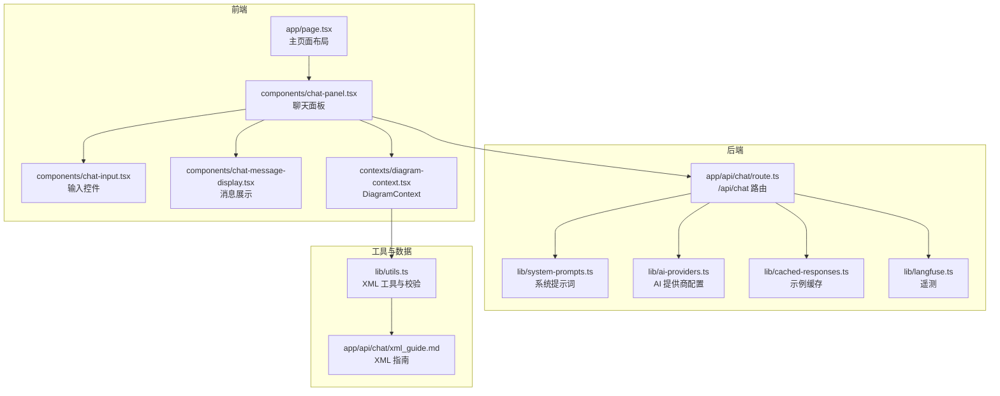
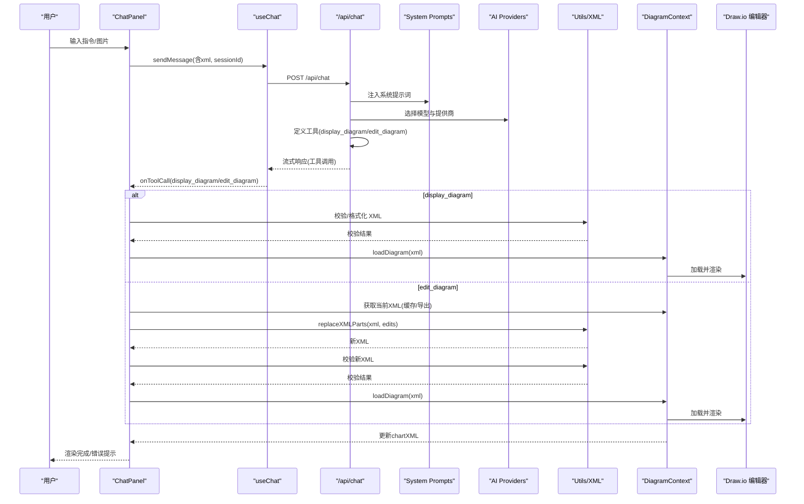
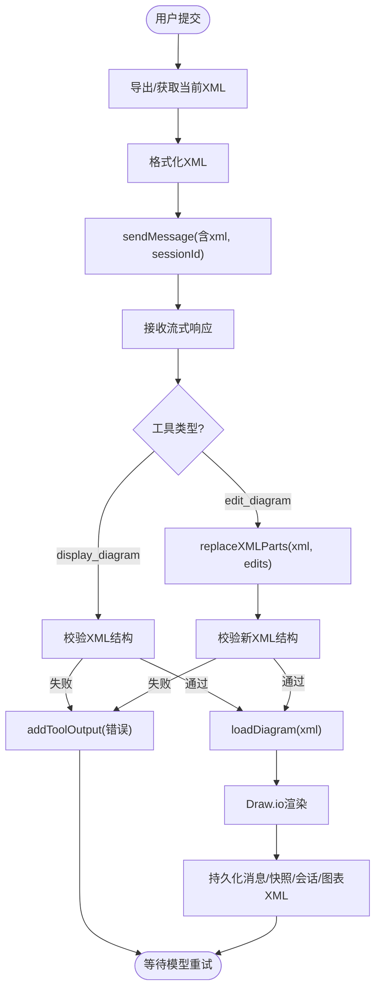
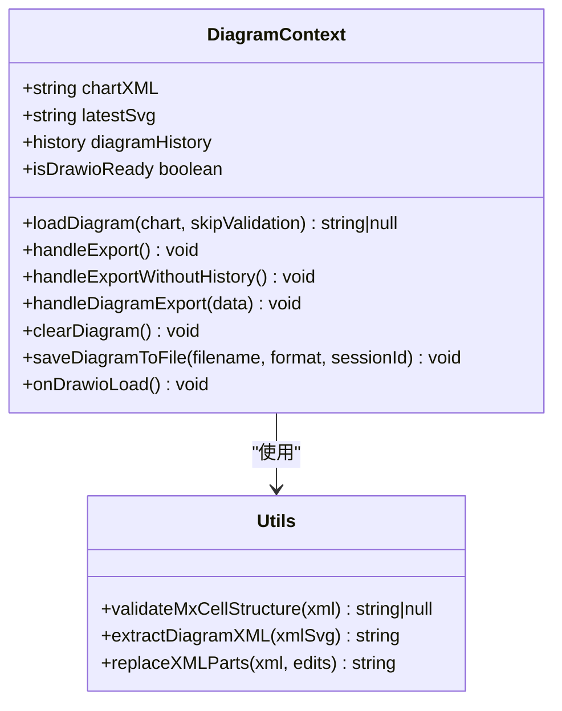
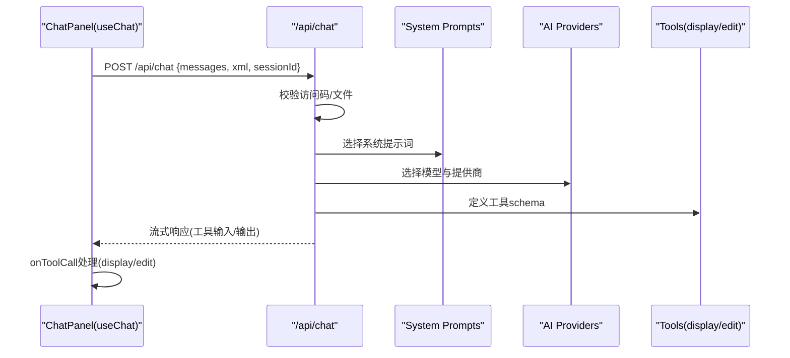
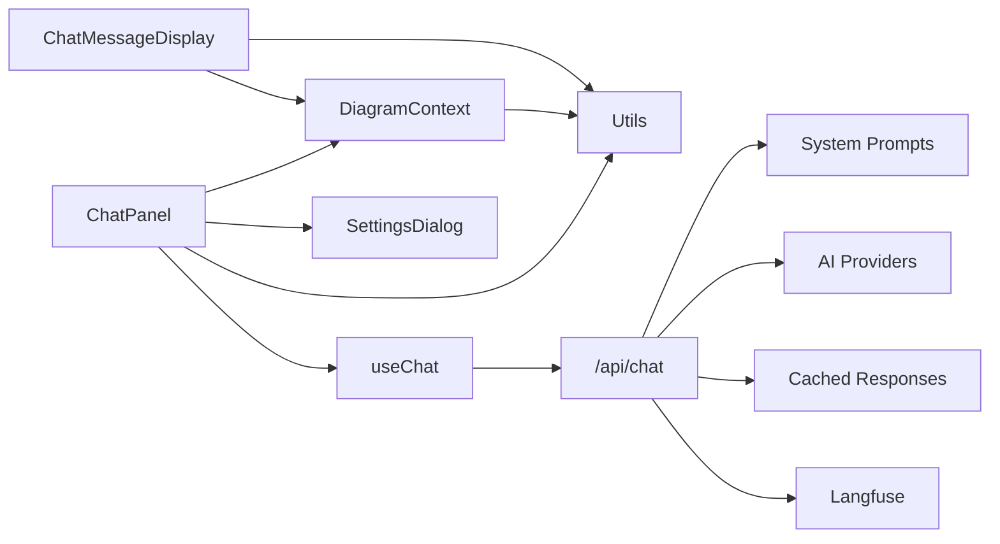

# 数据流

<cite>
**本文引用的文件**
- [app/page.tsx](file://app/page.tsx)
- [components/chat-panel.tsx](file://components/chat-panel.tsx)
- [contexts/diagram-context.tsx](file://contexts/diagram-context.tsx)
- [lib/system-prompts.ts](file://lib/system-prompts.ts)
- [app/api/chat/route.ts](file://app/api/chat/route.ts)
- [lib/utils.ts](file://lib/utils.ts)
- [app/api/chat/xml_guide.md](file://app/api/chat/xml_guide.md)
- [components/chat-input.tsx](file://components/chat-input.tsx)
- [components/chat-message-display.tsx](file://components/chat-message-display.tsx)
- [lib/ai-providers.ts](file://lib/ai-providers.ts)
- [lib/cached-responses.ts](file://lib/cached-responses.ts)
- [lib/langfuse.ts](file://lib/langfuse.ts)
- [components/settings-dialog.tsx](file://components/settings-dialog.tsx)
- [app/api/config/route.ts](file://app/api/config/route.ts)
</cite>

## 目录
1. [引言](#引言)
2. [项目结构](#项目结构)
3. [核心组件](#核心组件)
4. [架构总览](#架构总览)
5. [详细组件分析](#详细组件分析)
6. [依赖关系分析](#依赖关系分析)
7. [性能考量](#性能考量)
8. [故障排查指南](#故障排查指南)
9. [结论](#结论)
10. [附录](#附录)

## 引言
本文件面向“next-ai-draw-io”项目，系统性梳理从用户输入到图表渲染的全链路数据流。重点覆盖：
- 用户在 ChatPanel 输入指令后，useChat Hook 触发请求，/api/chat 路由接收并构造 AI 调用；
- 系统提示词（system-prompts.ts）引导模型生成工具调用（display_diagram/edit_diagram）；
- 工具调用执行 XML 生成或编辑，DiagramContext 更新 chartXML 状态，Draw.io 编辑器实时渲染；
- XML 结构生成规则与验证机制；
- 数据转换过程中的错误处理与回滚策略；
- 端到端数据流序列图与状态变更示例；
- 数据一致性保障与延迟优化方案。

## 项目结构
系统采用分层设计：
- 前端层：页面布局、聊天面板、消息展示、输入控件、上下文提供者；
- 业务逻辑层：useChat 钩子、工具调用处理、XML 格式化与校验、缓存与遥测；
- 后端层：/api/chat 接口，AI 提供商适配，系统提示词注入，工具定义与修复；
- 数据与状态：DiagramContext 维护 chartXML、历史快照、导出回调；本地持久化（localStorage）用于会话恢复与离线体验。

图表来源
- [app/page.tsx](file://app/page.tsx#L1-L162)
- [components/chat-panel.tsx](file://components/chat-panel.tsx#L1-L816)
- [contexts/diagram-context.tsx](file://contexts/diagram-context.tsx#L1-L268)
- [app/api/chat/route.ts](file://app/api/chat/route.ts#L1-L495)
- [lib/system-prompts.ts](file://lib/system-prompts.ts#L1-L371)
- [lib/ai-providers.ts](file://lib/ai-providers.ts#L1-L286)
- [lib/cached-responses.ts](file://lib/cached-responses.ts#L1-L562)
- [lib/langfuse.ts](file://lib/langfuse.ts#L1-L108)
- [lib/utils.ts](file://lib/utils.ts#L1-L711)
- [app/api/chat/xml_guide.md](file://app/api/chat/xml_guide.md#L1-L323)

章节来源
- [app/page.tsx](file://app/page.tsx#L1-L162)
- [components/chat-panel.tsx](file://components/chat-panel.tsx#L1-L816)
- [contexts/diagram-context.tsx](file://contexts/diagram-context.tsx#L1-L268)
- [app/api/chat/route.ts](file://app/api/chat/route.ts#L1-L495)

## 核心组件
- ChatPanel：负责收集用户输入、发起请求、处理工具调用（display_diagram/edit_diagram）、错误与重试、本地持久化与会话管理。
- DiagramContext：统一管理 Draw.io 编辑器实例、图表 XML、导出回调、历史记录、保存文件等。
- /api/chat：接收前端请求，注入系统提示词与当前 XML 上下文，选择 AI 提供商，定义工具接口，修复工具调用输入，返回流式响应。
- System Prompts：为不同模型提供扩展提示词，明确工具使用规范与 XML 结构约束。
- Utils：提供 XML 格式化、合法性校验、节点替换、XML 提取等工具函数。
- AI Providers：根据环境变量自动检测并配置可用的 AI 提供商。
- 缓存与遥测：示例缓存与 Langfuse 遥测集成，提升首屏与对话效率并追踪质量。

章节来源
- [components/chat-panel.tsx](file://components/chat-panel.tsx#L1-L816)
- [contexts/diagram-context.tsx](file://contexts/diagram-context.tsx#L1-L268)
- [app/api/chat/route.ts](file://app/api/chat/route.ts#L1-L495)
- [lib/system-prompts.ts](file://lib/system-prompts.ts#L1-L371)
- [lib/utils.ts](file://lib/utils.ts#L1-L711)
- [lib/ai-providers.ts](file://lib/ai-providers.ts#L1-L286)
- [lib/cached-responses.ts](file://lib/cached-responses.ts#L1-L562)
- [lib/langfuse.ts](file://lib/langfuse.ts#L1-L108)

## 架构总览
端到端数据流概览（从用户输入到渲染）：
1. 用户在 ChatPanel 输入文本与可选图片，点击发送；
2. ChatPanel 使用 useChat 发起请求至 /api/chat，并携带当前 chartXML 与会话标识；
3. /api/chat 注入系统提示词与当前 XML 上下文，选择 AI 提供商，定义工具（display_diagram/edit_diagram），修复工具调用输入；
4. 模型输出工具调用（display_diagram 或 edit_diagram），ChatPanel 在 onToolCall 中处理：
   - display_diagram：加载并校验 XML，失败则通过 addToolOutput 返回错误，模型自动重试；
   - edit_diagram：从缓存或导出获取当前 XML，执行精确替换，再校验并返回结果；
5. DiagramContext 将 XML 写入 Draw.io 编辑器，触发实时渲染；
6. 本地持久化：消息、XML 快照、会话 ID、图表 XML 等在内存与 localStorage 间同步。

图表来源
- [components/chat-panel.tsx](file://components/chat-panel.tsx#L1-L816)
- [app/api/chat/route.ts](file://app/api/chat/route.ts#L1-L495)
- [lib/system-prompts.ts](file://lib/system-prompts.ts#L1-L371)
- [lib/ai-providers.ts](file://lib/ai-providers.ts#L1-L286)
- [lib/utils.ts](file://lib/utils.ts#L1-L711)
- [contexts/diagram-context.tsx](file://contexts/diagram-context.tsx#L1-L268)

## 详细组件分析

### ChatPanel：用户输入与工具调用处理
- 请求构建：在表单提交时，先从 Draw.io 导出当前 XML 并格式化，写入 chartXMLRef，随后携带 xml 与 sessionId 发送消息。
- 工具调用：
  - display_diagram：调用 DiagramContext.loadDiagram 进行结构校验，成功则渲染；失败通过 addToolOutput 返回错误，模型自动重试。
  - edit_diagram：优先使用 chartXMLRef 的缓存 XML，避免导出延迟；若无缓存则通过 handleExportWithoutHistory 导出；执行 replaceXMLParts 精确替换；再次校验并返回结果。
- 错误处理：捕获网络与模型错误，显示系统消息并弹出设置对话框以配置访问码。
- 本地持久化：消息、XML 快照、会话 ID、图表 XML 在内存与 localStorage 之间同步，支持刷新后恢复。

图表来源
- [components/chat-panel.tsx](file://components/chat-panel.tsx#L1-L816)
- [contexts/diagram-context.tsx](file://contexts/diagram-context.tsx#L1-L268)
- [lib/utils.ts](file://lib/utils.ts#L1-L711)

章节来源
- [components/chat-panel.tsx](file://components/chat-panel.tsx#L1-L816)
- [components/chat-input.tsx](file://components/chat-input.tsx#L1-L481)
- [components/chat-message-display.tsx](file://components/chat-message-display.tsx#L1-L747)

### DiagramContext：图表状态与渲染
- 负责 Draw.io 实例的加载与导出回调，提取 XML、维护 chartXML、历史记录与保存文件。
- loadDiagram：在非内部场景下进行结构校验，确保渲染前的 XML 合法；同时保持 chartXML 与编辑器一致。
- 导出流程：handleExport 与 handleExportWithoutHistory 触发导出，handleDiagramExport 解析 xmlsvg，提取真实 XML，更新 chartXML 与最新 SVG，并按需加入历史记录；resolverRef 用于异步等待导出结果。
- 保存文件：根据格式映射到 draw.io 导出格式，提取所需内容并触发下载。

图表来源
- [contexts/diagram-context.tsx](file://contexts/diagram-context.tsx#L1-L268)
- [lib/utils.ts](file://lib/utils.ts#L1-L711)

章节来源
- [contexts/diagram-context.tsx](file://contexts/diagram-context.tsx#L1-L268)
- [lib/utils.ts](file://lib/utils.ts#L1-L711)

### /api/chat：系统提示词、工具定义与响应流
- 访问控制：读取请求头中的 x-access-code，与环境变量 ACCESS_CODE_LIST 对比，未配置或不匹配则拒绝。
- 文件校验：限制最大文件数量与大小，确保安全与性能。
- 缓存策略：首次消息且空图时，基于提示词与是否带图查找示例缓存，命中则直接返回工具输入流。
- 系统提示词：根据模型 ID 选择默认或扩展提示词，明确工具使用规范与 XML 结构约束。
- 工具定义：display_diagram 与 edit_diagram 的输入模式、校验规则与最佳实践。
- 工具修复：针对 Bedrock 等平台的工具调用输入修复（字符串转对象），并过滤空内容消息。
- 流式输出：使用 AI SDK 的流式接口返回工具调用输入与输出，便于前端即时渲染。

图表来源
- [app/api/chat/route.ts](file://app/api/chat/route.ts#L1-L495)
- [lib/system-prompts.ts](file://lib/system-prompts.ts#L1-L371)
- [lib/ai-providers.ts](file://lib/ai-providers.ts#L1-L286)
- [lib/cached-responses.ts](file://lib/cached-responses.ts#L1-L562)

章节来源
- [app/api/chat/route.ts](file://app/api/chat/route.ts#L1-L495)
- [lib/system-prompts.ts](file://lib/system-prompts.ts#L1-L371)
- [lib/ai-providers.ts](file://lib/ai-providers.ts#L1-L286)
- [lib/cached-responses.ts](file://lib/cached-responses.ts#L1-L562)

### XML 结构生成规则与验证机制
- 生成规则：
  - 系统提示词明确根元素、mxCell 结构、唯一 ID、父子关系、边连接、样式与布局约束；
  - 严格禁止 mxCell 嵌套、重复 ID、无效父引用、无效边源/目标、缺少必要属性等；
  - 特别强调：所有 mxCell 必须是 root 的直接子元素，不得嵌套。
- 验证机制：
  - validateMxCellStructure：解析 XML，检查语法错误、嵌套、重复 ID、孤儿节点、无效父引用、无效边连接、孤立 mxPoint 等；
  - replaceXMLParts：支持按行匹配、去空白匹配、属性顺序无关、按 id/value 匹配、归一化空白等多种策略，保证编辑的鲁棒性；
  - extractDiagramXML：从 xmlsvg 中提取真实 XML，解码与解压，确保渲染前的 XML 可用。
- 错误处理与回滚：
  - ChatPanel 在工具调用失败时通过 addToolOutput 返回错误信息，模型自动重试；
  - ChatMessageDisplay 在渲染前对 XML 进行合法性转换与合并，避免不合法结构进入编辑器；
  - edit_diagram 失败时保留当前 XML，避免覆盖。

章节来源
- [lib/system-prompts.ts](file://lib/system-prompts.ts#L1-L371)
- [lib/utils.ts](file://lib/utils.ts#L1-L711)
- [app/api/chat/xml_guide.md](file://app/api/chat/xml_guide.md#L1-L323)

### 端到端数据流序列图与状态变更示例
- 序列图已在“架构总览”中给出，涵盖从用户输入、请求发送、工具调用、XML 校验、渲染与持久化的完整流程。
- 状态变更示例：
  - chartXMLRef：在提交前写入最新导出 XML，确保 edit_diagram 使用最新版本；
  - xmlSnapshotsRef：为每条用户消息保存一次 XML 快照，支持“重新生成/编辑消息”时回滚；
  - diagramHistory：仅在用户主动导出时记录，支持历史面板浏览与恢复；
  - localStorage：持久化消息、快照、会话 ID、图表 XML，刷新后恢复。

章节来源
- [components/chat-panel.tsx](file://components/chat-panel.tsx#L1-L816)
- [contexts/diagram-context.tsx](file://contexts/diagram-context.tsx#L1-L268)

## 依赖关系分析
- 组件耦合：
  - ChatPanel 依赖 DiagramContext、useChat、Utils、SettingsDialog；
  - DiagramContext 依赖 Utils 与 react-drawio；
  - /api/chat 依赖 System Prompts、AI Providers、Cached Responses、Langfuse；
  - ChatMessageDisplay 依赖 DiagramContext 与 Utils。
- 外部依赖：
  - AI 提供商：OpenAI、Anthropic、Google、Azure、Bedrock、OpenRouter、DeepSeek、SiliconFlow、Ollama；
  - 遥测：Langfuse；
  - XML 工具：DOMParser、pako（inflate）。

图表来源
- [components/chat-panel.tsx](file://components/chat-panel.tsx#L1-L816)
- [contexts/diagram-context.tsx](file://contexts/diagram-context.tsx#L1-L268)
- [app/api/chat/route.ts](file://app/api/chat/route.ts#L1-L495)
- [lib/system-prompts.ts](file://lib/system-prompts.ts#L1-L371)
- [lib/ai-providers.ts](file://lib/ai-providers.ts#L1-L286)
- [lib/cached-responses.ts](file://lib/cached-responses.ts#L1-L562)
- [lib/langfuse.ts](file://lib/langfuse.ts#L1-L108)
- [components/chat-message-display.tsx](file://components/chat-message-display.tsx#L1-L747)

章节来源
- [lib/ai-providers.ts](file://lib/ai-providers.ts#L1-L286)
- [lib/langfuse.ts](file://lib/langfuse.ts#L1-L108)

## 性能考量
- 缓存与复用：
  - 首次消息且空图时，基于提示词与是否带图查找示例缓存，减少模型调用与响应时间；
  - 为最后一条助手消息添加缓存点，复用系统指令与历史缓存，降低后续请求成本。
- 工具修复：
  - 针对 Bedrock 等平台的工具调用输入修复，避免因 JSON 解析失败导致的重试与失败；
  - 过滤空内容消息，减少无效请求。
- 导出与渲染：
  - edit_diagram 优先使用 chartXMLRef 缓存，避免导出延迟；
  - handleExport 标记 expectHistoryExportRef，仅在用户主动导出时记录历史，减少不必要的存储与渲染。
- 遥测与可观测性：
  - Langfuse 自动记录输出与用量，手动设置输入与结束，便于性能分析与问题定位。

章节来源
- [app/api/chat/route.ts](file://app/api/chat/route.ts#L1-L495)
- [lib/cached-responses.ts](file://lib/cached-responses.ts#L1-L562)
- [lib/langfuse.ts](file://lib/langfuse.ts#L1-L108)

## 故障排查指南
- 访问码错误：
  - /api/chat 在头部校验失败时返回 401，ChatPanel 捕获错误并在 UI 中弹出设置对话框；
  - SettingsDialog 支持在线验证并保存本地设置。
- XML 校验失败：
  - validateMxCellStructure 返回具体错误原因（嵌套、重复 ID、无效父引用、无效边连接、孤立 mxPoint 等）；
  - ChatPanel 在工具调用失败时通过 addToolOutput 返回错误，模型自动重试。
- 导出超时：
  - ChatPanel 对导出操作设置 10 秒超时，超时抛错并提示用户重试。
- 图片上传限制：
  - ChatInput 限制最多 5 张、每张不超过 2MB，超出时报错并提示用户调整。
- 会话恢复：
  - ChatPanel 从 localStorage 恢复消息、XML 快照与会话 ID；DiagramContext 从 localStorage 恢复图表 XML 并跳过验证直接加载。

章节来源
- [components/settings-dialog.tsx](file://components/settings-dialog.tsx#L1-L156)
- [app/api/chat/route.ts](file://app/api/chat/route.ts#L1-L495)
- [lib/utils.ts](file://lib/utils.ts#L1-L711)
- [components/chat-panel.tsx](file://components/chat-panel.tsx#L1-L816)
- [components/chat-input.tsx](file://components/chat-input.tsx#L1-L481)

## 结论
next-ai-draw-io 通过清晰的前后端分层与严格的 XML 校验机制，实现了从用户输入到图表渲染的高可靠数据流。系统利用工具调用与缓存策略显著提升了交互效率，借助 Langfuse 遥测与本地持久化增强了可观测性与用户体验。建议在生产环境中：
- 明确访问码与提供商配置，确保稳定性；
- 严格遵循系统提示词与 XML 规范，减少校验失败；
- 利用缓存与导出优化，降低延迟；
- 关注错误日志与遥测指标，持续改进模型与工具调用质量。

## 附录
- XML 结构参考与最佳实践详见 XML 指南与系统提示词；
- AI 提供商配置与自动检测逻辑见 AI Providers；
- 遥测与缓存实现见 Langfuse 与 Cached Responses。

章节来源
- [app/api/chat/xml_guide.md](file://app/api/chat/xml_guide.md#L1-L323)
- [lib/system-prompts.ts](file://lib/system-prompts.ts#L1-L371)
- [lib/ai-providers.ts](file://lib/ai-providers.ts#L1-L286)
- [lib/langfuse.ts](file://lib/langfuse.ts#L1-L108)
- [lib/cached-responses.ts](file://lib/cached-responses.ts#L1-L562)