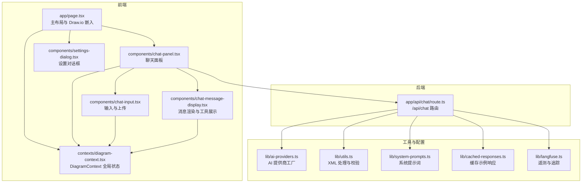
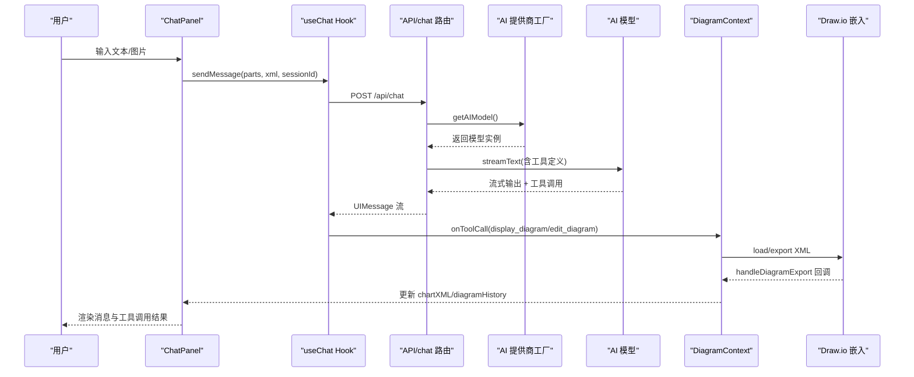
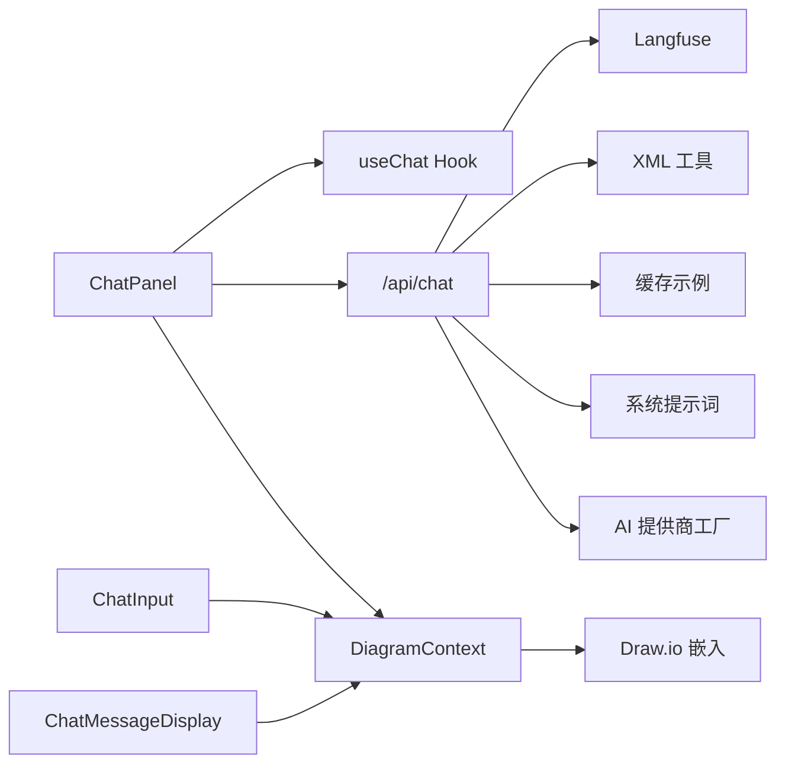

# 架构设计

<cite>
**本文引用的文件**
- [app/page.tsx](file://app/page.tsx)
- [contexts/diagram-context.tsx](file://contexts/diagram-context.tsx)
- [components/chat-panel.tsx](file://components/chat-panel.tsx)
- [components/chat-input.tsx](file://components/chat-input.tsx)
- [components/chat-message-display.tsx](file://components/chat-message-display.tsx)
- [components/settings-dialog.tsx](file://components/settings-dialog.tsx)
- [app/api/chat/route.ts](file://app/api/chat/route.ts)
- [lib/ai-providers.ts](file://lib/ai-providers.ts)
- [lib/utils.ts](file://lib/utils.ts)
- [lib/system-prompts.ts](file://lib/system-prompts.ts)
- [lib/cached-responses.ts](file://lib/cached-responses.ts)
- [lib/langfuse.ts](file://lib/langfuse.ts)
- [package.json](file://package.json)
- [README.md](file://README.md)
</cite>

## 目录
1. [简介](#简介)
2. [项目结构](#项目结构)
3. [核心组件](#核心组件)
4. [架构总览](#架构总览)
5. [详细组件分析](#详细组件分析)
6. [依赖关系分析](#依赖关系分析)
7. [性能考量](#性能考量)
8. [故障排查指南](#故障排查指南)
9. [结论](#结论)
10. [附录](#附录)

## 简介
本架构文档聚焦于“next-ai-draw-io”的高层设计与架构模式，围绕 MVC 风格的组件化组织展开，重点阐释以下方面：
- Page 组件、ChatPanel、DrawIoEmbed 的职责与交互关系
- React Context 状态管理（DiagramContext）在聊天界面与图表编辑器之间的共享机制（chartXML、diagramHistory）
- 数据流路径：用户输入 → ChatPanel → useChat Hook → API/chat 路由 → AI 模型 → 工具调用 → DiagramContext → Draw.io 编辑器
- 工厂模式在 AI 提供商集成中的应用
- 工具调用模式的实现细节与容错策略
- 系统架构图与组件交互图
- 技术决策、权衡与约束（客户端路由与服务端 API 分离、状态持久化与错误处理）

## 项目结构
该项目采用 Next.js App Router 的目录结构，前端页面与 UI 组件位于 app 与 components 目录；状态管理通过 contexts；AI 提供商与工具链逻辑集中在 lib；服务端 API 在 app/api 下。

图表来源
- [app/page.tsx](file://app/page.tsx#L1-L162)
- [components/chat-panel.tsx](file://components/chat-panel.tsx#L1-L816)
- [components/chat-input.tsx](file://components/chat-input.tsx#L1-L481)
- [components/chat-message-display.tsx](file://components/chat-message-display.tsx#L1-L747)
- [contexts/diagram-context.tsx](file://contexts/diagram-context.tsx#L1-L268)
- [components/settings-dialog.tsx](file://components/settings-dialog.tsx#L1-L156)
- [app/api/chat/route.ts](file://app/api/chat/route.ts#L1-L495)
- [lib/ai-providers.ts](file://lib/ai-providers.ts#L1-L286)
- [lib/utils.ts](file://lib/utils.ts#L1-L711)
- [lib/system-prompts.ts](file://lib/system-prompts.ts#L1-L371)
- [lib/cached-responses.ts](file://lib/cached-responses.ts#L1-L562)
- [lib/langfuse.ts](file://lib/langfuse.ts#L1-L108)

章节来源
- [README.md](file://README.md#L180-L204)

## 核心组件
- Page 组件（app/page.tsx）：负责主布局，包含可调整尺寸的左右面板（Draw.io 画布与聊天面板），并提供主题切换、关闭保护等全局行为。
- ChatPanel（components/chat-panel.tsx）：聊天入口与控制中心，封装 useChat Hook，处理工具调用（display_diagram/edit_diagram）、访问码验证、会话持久化、历史恢复等。
- DiagramContext（contexts/diagram-context.tsx）：全局状态容器，统一管理 chartXML、diagramHistory、Draw.io 加载状态、导出/保存流程，并与 Draw.io 嵌入组件交互。
- ChatInput（components/chat-input.tsx）：输入表单、文件上传、清空对话、保存导出、历史查看等操作入口。
- ChatMessageDisplay（components/chat-message-display.tsx）：消息渲染、工具调用可视化、复制/反馈、编辑用户消息等。
- API 路由（app/api/chat/route.ts）：接收聊天请求，进行访问码校验、文件大小限制、系统提示词注入、工具调用修复、缓存命中、多提供商模型选择、Langfuse 遥测等。
- AI 提供商工厂（lib/ai-providers.ts）：基于环境变量自动检测或显式指定提供商，返回统一的模型接口。
- 工具与辅助（lib/utils.ts、lib/system-prompts.ts、lib/cached-responses.ts、lib/langfuse.ts）：XML 解析与修复、系统提示词、缓存示例、遥测追踪。

章节来源
- [app/page.tsx](file://app/page.tsx#L1-L162)
- [components/chat-panel.tsx](file://components/chat-panel.tsx#L1-L816)
- [contexts/diagram-context.tsx](file://contexts/diagram-context.tsx#L1-L268)
- [components/chat-input.tsx](file://components/chat-input.tsx#L1-L481)
- [components/chat-message-display.tsx](file://components/chat-message-display.tsx#L1-L747)
- [app/api/chat/route.ts](file://app/api/chat/route.ts#L1-L495)
- [lib/ai-providers.ts](file://lib/ai-providers.ts#L1-L286)
- [lib/utils.ts](file://lib/utils.ts#L1-L711)
- [lib/system-prompts.ts](file://lib/system-prompts.ts#L1-L371)
- [lib/cached-responses.ts](file://lib/cached-responses.ts#L1-L562)
- [lib/langfuse.ts](file://lib/langfuse.ts#L1-L108)

## 架构总览
系统采用 MVC 风格的组件化架构：
- 视图层（View）：Page、ChatPanel、ChatInput、ChatMessageDisplay、SettingsDialog
- 控制器（Controller）：ChatPanel（封装 useChat Hook 与工具调用逻辑）、API 路由（处理请求、调用模型、生成响应）
- 模型（Model）：DiagramContext（chartXML、diagramHistory、Draw.io 交互）、AI 提供商工厂、系统提示词与缓存

数据流从用户输入到 AI 模型再到图表编辑器，全程通过 DiagramContext 进行状态同步与持久化。

图表来源
- [components/chat-panel.tsx](file://components/chat-panel.tsx#L1-L816)
- [app/api/chat/route.ts](file://app/api/chat/route.ts#L1-L495)
- [lib/ai-providers.ts](file://lib/ai-providers.ts#L1-L286)
- [contexts/diagram-context.tsx](file://contexts/diagram-context.tsx#L1-L268)

## 详细组件分析

### Page 组件与布局
- 负责主布局与响应式面板（Draw.io 画布与聊天面板），支持移动端/桌面端布局切换、面板折叠/展开、键盘快捷键（Ctrl/Cmd+B 切换聊天面板）。
- 通过 useDiagram 获取 Draw.io 引用、导出回调、加载完成回调，以及主题切换（min/sketch）。
- 本地存储用于关闭保护与主题偏好，避免水合不一致问题。

章节来源
- [app/page.tsx](file://app/page.tsx#L1-L162)

### ChatPanel：聊天控制器与工具调用中枢
- 使用 useChat Hook 将 UI 与 AI 流式响应解耦，支持工具调用自动重试（sendAutomaticallyWhen）。
- onToolCall 中实现两个关键工具：
  - display_diagram：将 XML 加载到 Draw.io，同时进行结构校验与错误回传。
  - edit_diagram：从当前 chartXML 或导出 XML 中执行精确替换，支持多种匹配策略（逐行、去空白、属性顺序无关、按 id/value 定位、归一化空白等）。
- 访问码验证：首次加载时向 /api/config 检查是否需要访问码；SettingsDialog 通过 /api/verify-access-code 校验并持久化。
- 会话持久化：localStorage 存储消息、XML 快照、会话 ID、当前 diagram XML；beforeunload 事件确保刷新/关闭前持久化。
- 与 DiagramContext 协作：通过 onFetchChart 获取最新 chartXML，resolverRef 实现异步等待与超时控制。

章节来源
- [components/chat-panel.tsx](file://components/chat-panel.tsx#L1-L816)
- [components/settings-dialog.tsx](file://components/settings-dialog.tsx#L1-L156)

### DiagramContext：全局状态与 Draw.io 交互
- 状态字段：chartXML、latestSvg、diagramHistory、isDrawioReady、refs（resolverRef、drawioRef）。
- 导出与保存：
  - handleExport/handleExportWithoutHistory：触发 Draw.io 导出，提取 XML 并更新 chartXML/latestSvg，按需写入 diagramHistory。
  - saveDiagramToFile：根据格式映射（drawio→xmlsvg）导出并下载，支持 .drawio/.png/.svg，记录 Langfuse 保存事件。
- 加载与清理：loadDiagram 支持跳过校验（内部模板）；clearDiagram 清空画布并重置历史。
- onDrawioLoad：仅一次设置就绪状态，避免无限循环。

章节来源
- [contexts/diagram-context.tsx](file://contexts/diagram-context.tsx#L1-L268)

### ChatInput：输入与文件上传
- 文件校验：最多 5 张、每张不超过 2MB，拖拽/粘贴/选择上传。
- 行为：清空对话、打开历史、切换主题、保存导出、提交消息。
- 与 DiagramContext 协作：保存按钮直接调用 saveDiagramToFile。

章节来源
- [components/chat-input.tsx](file://components/chat-input.tsx#L1-L481)

### ChatMessageDisplay：消息渲染与工具可视化
- 渲染文本、图片、工具调用输入/输出，支持展开/折叠、复制、点赞/踩反馈。
- 对工具调用进行增量渲染：当收到 display_diagram 的输入流或可用状态时，逐步将新内容合并到现有 chartXML 并进行结构校验与加载。

章节来源
- [components/chat-message-display.tsx](file://components/chat-message-display.tsx#L1-L747)

### API/chat 路由：请求处理与工具调用
- 访问码校验：读取 x-access-code 头，若不在白名单则拒绝。
- 文件校验：限制数量与大小，对 dataURL 进行解码大小估算。
- 缓存命中：首条消息且空图时，按用户文本与是否含图片查找缓存示例，直接返回工具调用流。
- 模型选择：通过 getAIModel() 从环境变量中解析提供商与模型，支持自定义端点与凭据。
- 系统提示词：根据模型类型选择默认或扩展提示词，注入当前 diagram XML 作为上下文。
- 工具修复：针对 Bedrock API 的字符串输入问题，将字符串输入解析为对象；对空内容数组的消息进行过滤。
- 流式输出：使用 streamText 生成 UIMessage 流，Langfuse 记录输入/输出与用量。

章节来源
- [app/api/chat/route.ts](file://app/api/chat/route.ts#L1-L495)
- [lib/ai-providers.ts](file://lib/ai-providers.ts#L1-L286)
- [lib/system-prompts.ts](file://lib/system-prompts.ts#L1-L371)
- [lib/cached-responses.ts](file://lib/cached-responses.ts#L1-L562)
- [lib/langfuse.ts](file://lib/langfuse.ts#L1-L108)

### AI 提供商工厂：多提供商集成与工厂模式
- 支持提供商：Bedrock、OpenAI、Anthropic、Google、Azure、Ollama、OpenRouter、DeepSeek、SiliconFlow。
- 自动检测：若仅配置了一个提供商，则自动选择；否则要求显式设置 AI_PROVIDER。
- 凭证校验：检查所需环境变量是否存在。
- 自定义端点：OpenAI、Google、Azure、DeepSeek、SiliconFlow 支持自定义 baseURL。
- 返回统一接口：模型实例、提供商选项、请求头（如 Anthropic Beta 头）。

章节来源
- [lib/ai-providers.ts](file://lib/ai-providers.ts#L1-L286)

### 工具调用模式与容错策略
- display_diagram：将 XML 加载到 Draw.io，失败时通过 addToolOutput 返回错误信息，触发自动重试。
- edit_diagram：从当前 chartXML 或导出 XML 中定位目标元素，支持多种匹配策略与错误恢复（最多三次重试后回退到 display_diagram）。
- XML 校验：validateMxCellStructure 检查嵌套、重复 ID、孤儿节点、无效父引用、边连接、孤立 mxPoint 等问题。
- XML 修复：extractDiagramXML 解析 draw.io 内部编码；convertToLegalXml 清理不完整标签与孤儿 mxPoint；replaceXMLParts 支持属性顺序无关匹配与按 id/value 定位。

章节来源
- [components/chat-panel.tsx](file://components/chat-panel.tsx#L1-L816)
- [lib/utils.ts](file://lib/utils.ts#L1-L711)

## 依赖关系分析
- 组件间依赖：Page 依赖 ChatPanel 与 DiagramContext；ChatPanel 依赖 useChat、DiagramContext、SettingsDialog；ChatInput 依赖 DiagramContext；ChatMessageDisplay 依赖 DiagramContext。
- 后端依赖：API/chat 路由依赖 AI 提供商工厂、系统提示词、缓存、XML 工具、Langfuse。
- 外部依赖：@ai-sdk/*、ai、react-drawio、@langfuse/*、@aws-sdk/*、pako、@xmldom/xmldom 等。

图表来源
- [components/chat-panel.tsx](file://components/chat-panel.tsx#L1-L816)
- [contexts/diagram-context.tsx](file://contexts/diagram-context.tsx#L1-L268)
- [app/api/chat/route.ts](file://app/api/chat/route.ts#L1-L495)
- [lib/ai-providers.ts](file://lib/ai-providers.ts#L1-L286)
- [lib/system-prompts.ts](file://lib/system-prompts.ts#L1-L371)
- [lib/cached-responses.ts](file://lib/cached-responses.ts#L1-L562)
- [lib/utils.ts](file://lib/utils.ts#L1-L711)
- [lib/langfuse.ts](file://lib/langfuse.ts#L1-L108)

章节来源
- [package.json](file://package.json#L1-L84)

## 性能考量
- 缓存策略：首次空图时按用户文本与图片特征命中缓存示例，减少模型调用与网络开销。
- XML 处理：pako 压缩解压、DOMParser/XMLSerializer 保证高效解析与序列化；属性顺序无关匹配降低模型输出误差带来的匹配失败。
- 流式渲染：ChatMessageDisplay 对 display_diagram 的输入流进行增量渲染，提升用户体验。
- 会话持久化：localStorage 仅在必要时写入，避免频繁 I/O；beforeunload 事件集中持久化，减少丢失风险。
- 提供商选择：自动检测单一提供商，减少初始化分支判断；自定义端点支持就近部署以降低延迟。

## 故障排查指南
- 访问码错误：SettingsDialog 通过 /api/verify-access-code 校验；ChatPanel 在 onError 中识别并弹窗引导修复。
- XML 结构错误：display_diagram 失败时返回详细错误信息；edit_diagram 失败时提供当前 XML 片段以便定位问题。
- 导出超时：ChatPanel 对导出操作设置 10 秒超时，避免 UI 卡死。
- Langfuse 配置：未配置公钥/密钥时，Langfuse 功能自动禁用，不影响核心流程。
- 文件上传限制：超过数量/大小限制会提示具体错误，避免服务端压力过大。

章节来源
- [components/chat-panel.tsx](file://components/chat-panel.tsx#L1-L816)
- [components/settings-dialog.tsx](file://components/settings-dialog.tsx#L1-L156)
- [app/api/chat/route.ts](file://app/api/chat/route.ts#L1-L495)
- [lib/langfuse.ts](file://lib/langfuse.ts#L1-L108)

## 结论
该系统通过清晰的 MVC 组件划分与 React Context 状态管理，实现了“聊天—模型—图表”一体化工作流。工厂模式使多提供商集成具备良好扩展性；工具调用模式与 XML 处理工具链确保了对 draw.io XML 的精准控制与容错。服务端 API 将聊天、模型、缓存、遥测等能力集中管理，前端组件专注于交互与状态呈现。整体设计在易用性、可维护性与可扩展性之间取得平衡。

## 附录
- 技术栈概览：Next.js、Vercel AI SDK、react-drawio、@langfuse、@aws-sdk、pako、@xmldom/xmldom、TailwindCSS 等。
- 部署建议：推荐使用 Docker 镜像部署，结合环境变量配置 AI 提供商与访问码策略；在生产环境启用 Langfuse 与访问码以保障安全与可观测性。

章节来源
- [README.md](file://README.md#L1-L225)
- [package.json](file://package.json#L1-L84)