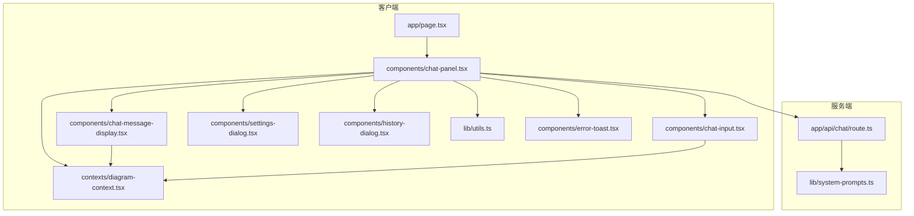
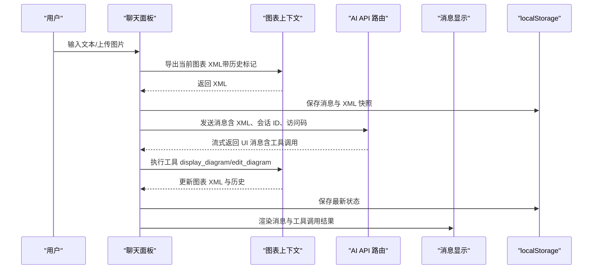
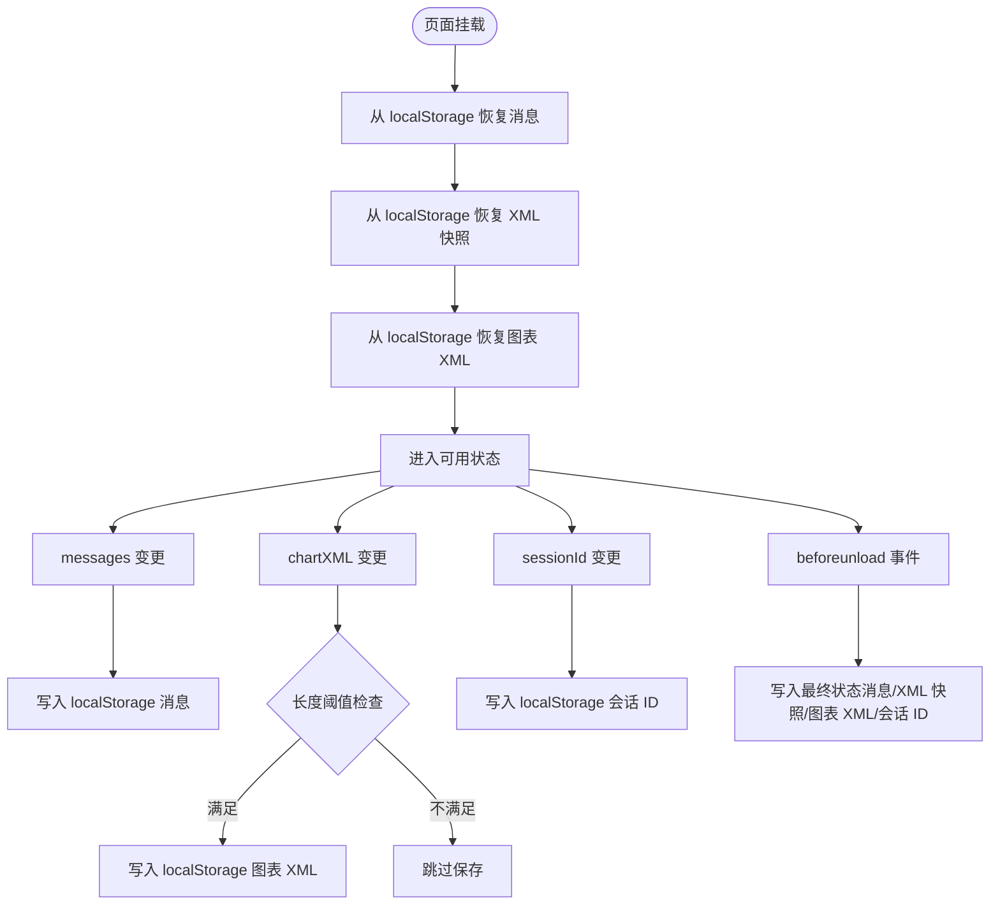
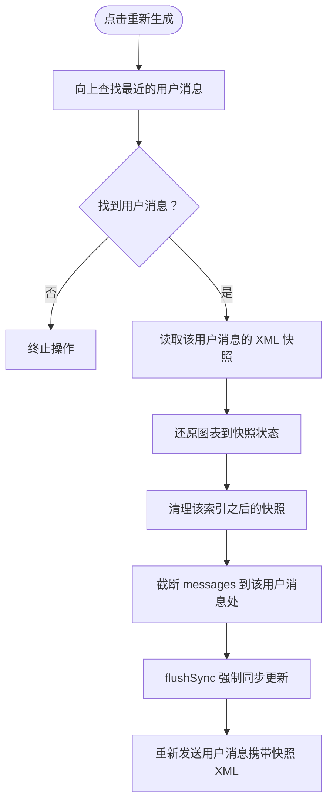
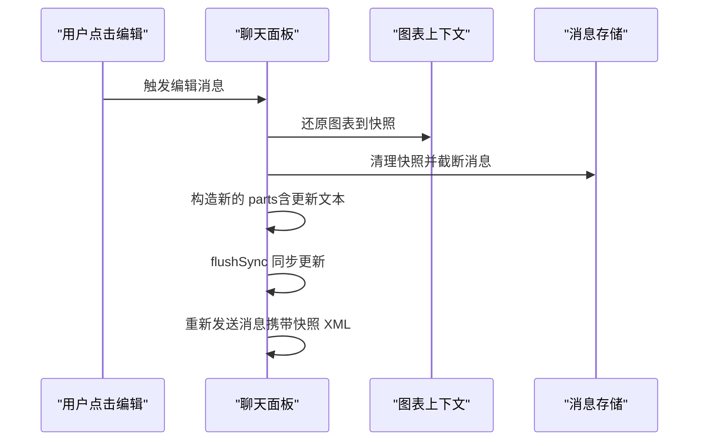
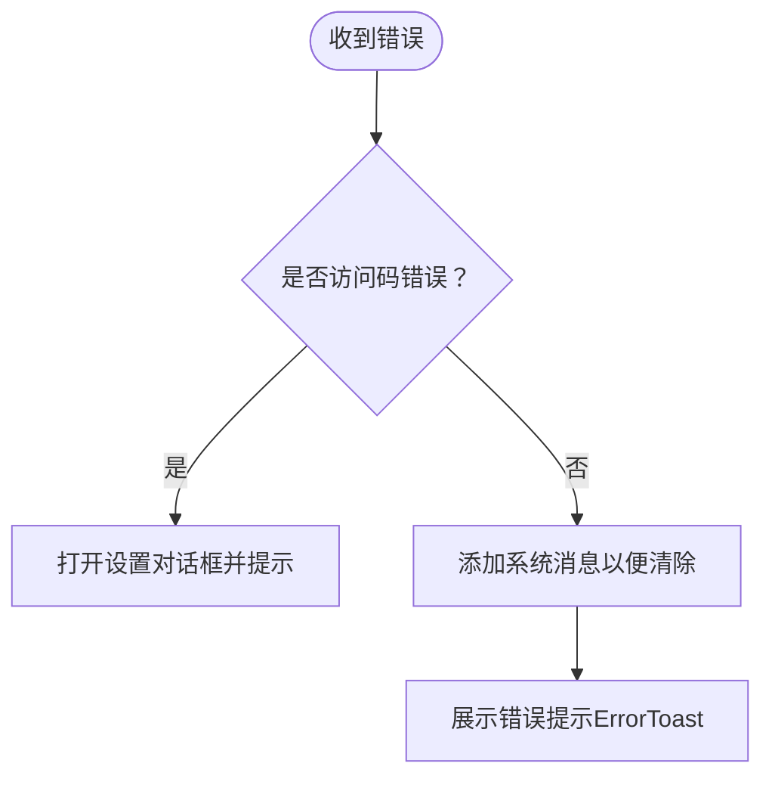
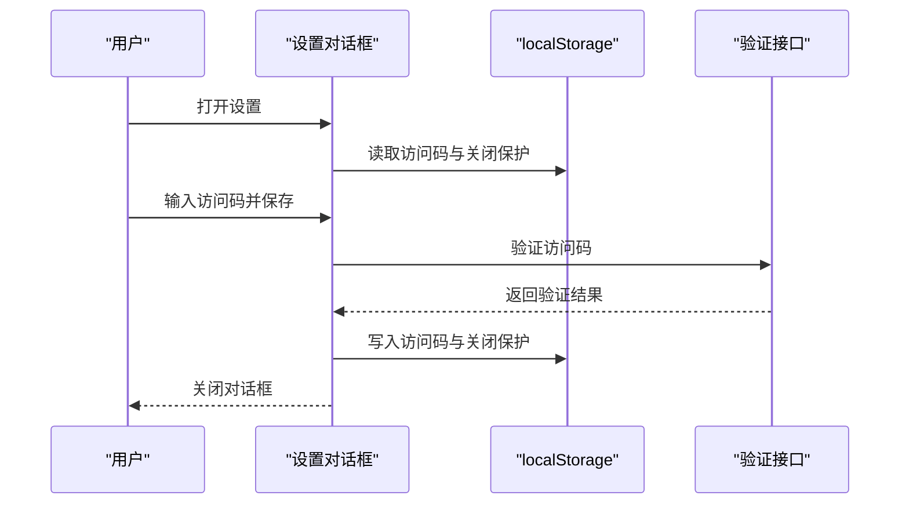
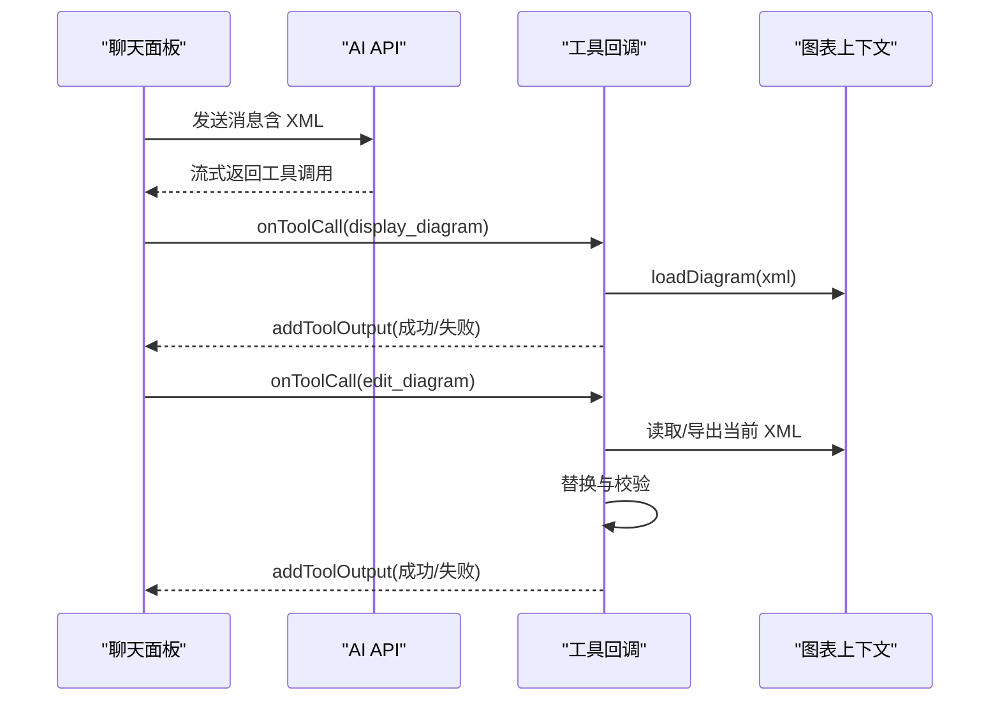
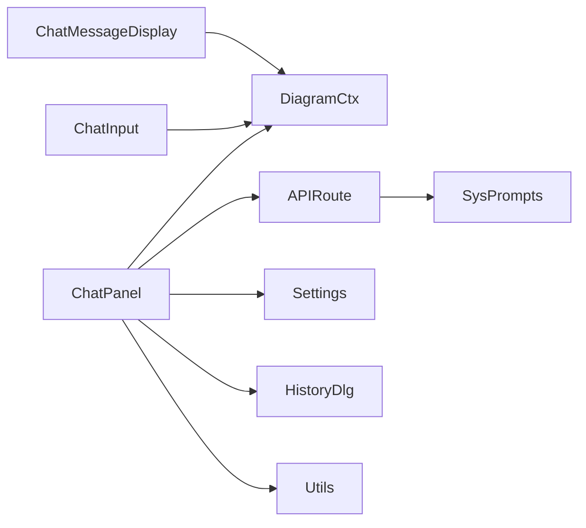

# 交互功能

<cite>
**本文引用的文件**
- [app/page.tsx](file://app/page.tsx)
- [components/chat-panel.tsx](file://components/chat-panel.tsx)
- [components/chat-message-display.tsx](file://components/chat-message-display.tsx)
- [components/chat-input.tsx](file://components/chat-input.tsx)
- [components/history-dialog.tsx](file://components/history-dialog.tsx)
- [components/settings-dialog.tsx](file://components/settings-dialog.tsx)
- [contexts/diagram-context.tsx](file://contexts/diagram-context.tsx)
- [lib/utils.ts](file://lib/utils.ts)
- [app/api/chat/route.ts](file://app/api/chat/route.ts)
- [lib/system-prompts.ts](file://lib/system-prompts.ts)
- [components/error-toast.tsx](file://components/error-toast.tsx)
</cite>

## 目录
1. [简介](#简介)
2. [项目结构](#项目结构)
3. [核心组件](#核心组件)
4. [架构总览](#架构总览)
5. [详细组件分析](#详细组件分析)
6. [依赖关系分析](#依赖关系分析)
7. [性能考量](#性能考量)
8. [故障排查指南](#故障排查指南)
9. [结论](#结论)
10. [附录](#附录)

## 简介
本文件面向交互式聊天界面的功能说明，重点覆盖以下方面：
- 消息持久化：通过 localStorage 在页面刷新后恢复消息历史、XML 快照与会话 ID，并在卸载前写入最终状态。
- 历史记录管理：以消息索引为键的 xmlSnapshotsRef 存储图表状态；重新生成（regenerate）时回滚到指定历史节点。
- 消息编辑流程：清理后续消息、还原图表到历史状态、更新 XML 快照、同步发送新消息。
- 错误提示系统：捕获并展示 AI 交互中的异常，包含访问码校验失败等场景。
- 设置与历史对话框：设置对话框用于配置访问码与关闭保护；历史对话框用于查看与恢复历史版本。
- 用户体验优化：合理使用 flushSync 保证状态一致性，以及处理大图表时的性能考量。

## 项目结构
该应用采用客户端渲染与服务端流式响应结合的方式：
- 客户端负责聊天面板、消息显示、输入控件、设置与历史对话框、图表上下文（Draw.io 集成）。
- 服务端路由负责接入 AI 模型、工具调用（display_diagram/edit_diagram）、缓存与遥测。

图示来源
- [app/page.tsx](file://app/page.tsx#L1-L162)
- [components/chat-panel.tsx](file://components/chat-panel.tsx#L1-L816)
- [components/chat-message-display.tsx](file://components/chat-message-display.tsx#L1-L747)
- [components/chat-input.tsx](file://components/chat-input.tsx#L1-L481)
- [components/settings-dialog.tsx](file://components/settings-dialog.tsx#L1-L156)
- [components/history-dialog.tsx](file://components/history-dialog.tsx#L1-L113)
- [contexts/diagram-context.tsx](file://contexts/diagram-context.tsx#L1-L268)
- [lib/utils.ts](file://lib/utils.ts#L1-L711)
- [app/api/chat/route.ts](file://app/api/chat/route.ts#L1-L495)
- [lib/system-prompts.ts](file://lib/system-prompts.ts#L1-L371)

章节来源
- [app/page.tsx](file://app/page.tsx#L1-L162)
- [components/chat-panel.tsx](file://components/chat-panel.tsx#L1-L816)

## 核心组件
- 聊天面板（ChatPanel）
  - 使用 @ai-sdk/react 的 useChat 管理消息流与工具调用。
  - 通过 localStorage 持久化消息、XML 快照、会话 ID 与当前图表 XML。
  - 提供重新生成与编辑消息的入口，配合 xmlSnapshotsRef 实现历史回滚。
- 消息显示（ChatMessageDisplay）
  - 渲染文本、文件与工具调用结果；支持复制、点赞/踩反馈；支持编辑最后一条用户消息。
  - 监听工具调用输入/输出，动态更新图表。
- 图表上下文（DiagramContext）
  - 统一管理 Draw.io 加载/导出、历史快照、清空画布、保存文件等能力。
  - 将导出的 xmlsvg 内容解析为 XML 并写入历史。
- 输入控件（ChatInput）
  - 支持拖拽/粘贴图片上传、清空对话、切换主题、打开历史与保存。
- 设置对话框（SettingsDialog）
  - 配置访问码与关闭保护；验证访问码有效性。
- 历史对话框（HistoryDialog）
  - 展示历史版本预览，支持选择并恢复到指定版本。
- 工具函数（lib/utils）
  - XML 格式化、合法性转换、节点替换、结构校验、XML 提取等。
- API 路由（app/api/chat/route）
  - 接收消息与 XML，注入系统提示与缓存断点，流式返回 UI 消息，定义工具 schema 并修复工具调用输入。

章节来源
- [components/chat-panel.tsx](file://components/chat-panel.tsx#L1-L816)
- [components/chat-message-display.tsx](file://components/chat-message-display.tsx#L1-L747)
- [contexts/diagram-context.tsx](file://contexts/diagram-context.tsx#L1-L268)
- [components/chat-input.tsx](file://components/chat-input.tsx#L1-L481)
- [components/settings-dialog.tsx](file://components/settings-dialog.tsx#L1-L156)
- [components/history-dialog.tsx](file://components/history-dialog.tsx#L1-L113)
- [lib/utils.ts](file://lib/utils.ts#L1-L711)
- [app/api/chat/route.ts](file://app/api/chat/route.ts#L1-L495)

## 架构总览
交互流程概览（从用户输入到图表渲染与消息持久化）：

图示来源
- [components/chat-panel.tsx](file://components/chat-panel.tsx#L1-L816)
- [contexts/diagram-context.tsx](file://contexts/diagram-context.tsx#L1-L268)
- [app/api/chat/route.ts](file://app/api/chat/route.ts#L1-L495)

## 详细组件分析

### 消息持久化机制
- 关键键名
  - 消息列表：next-ai-draw-io-messages
  - XML 快照：next-ai-draw-io-xml-snapshots
  - 会话 ID：next-ai-draw-io-session-id
  - 当前图表 XML：next-ai-draw-io-diagram-xml
  - 访问码：next-ai-draw-io-access-code
  - 关闭保护：next-ai-draw-io-close-protection
- 恢复策略
  - 页面挂载时从 localStorage 读取并设置初始状态，避免水合不一致。
  - 仅在首次挂载恢复一次，防止重复覆盖。
- 卸载前持久化
  - beforeunload 事件中写入当前 messages、xmlSnapshots、chartXML 与 sessionId，确保刷新/关闭不丢失。
- 自动保存
  - messages 变更时写入 localStorage。
  - chartXML 变更且长度超过阈值时写入 localStorage。
  - sessionId 变更时写入 localStorage。
- 信任策略
  - 从 localStorage 恢复的图表 XML 不再进行严格校验，直接加载以提升性能与体验。

图示来源
- [components/chat-panel.tsx](file://components/chat-panel.tsx#L1-L816)

章节来源
- [components/chat-panel.tsx](file://components/chat-panel.tsx#L1-L816)

### 历史记录管理与回滚
- 数据结构
  - xmlSnapshotsRef：Map<number, string>，以“用户消息索引”为键，存储对应时刻的图表 XML 快照。
- 回滚策略
  - 重新生成（regenerate）：定位到“助手消息前一个用户消息”的索引，读取其快照，还原图表，清理该索引之后的所有快照，同步删除对应消息并重新发送。
  - 编辑消息（edit）：与重新生成类似，但保留或更新目标用户消息的文本内容，其余步骤一致。
- 同步一致性
  - 使用 flushSync 确保 setMessages 的状态更新在 sendMessage 之前完成，避免竞态。

图示来源
- [components/chat-panel.tsx](file://components/chat-panel.tsx#L1-L816)

章节来源
- [components/chat-panel.tsx](file://components/chat-panel.tsx#L1-L816)

### 消息编辑流程（同步处理）
- 步骤
  - 读取目标用户消息的 XML 快照，还原图表。
  - 清理该索引之后的快照。
  - 构造新的 parts（可包含更新后的文本），截断 messages。
  - 使用 flushSync 同步更新状态，随后发送新消息。
- 与重新生成的区别
  - 重新生成：删除用户消息及其后的所有消息。
  - 编辑消息：保留用户消息，仅更新其文本内容。

图示来源
- [components/chat-panel.tsx](file://components/chat-panel.tsx#L1-L816)

章节来源
- [components/chat-panel.tsx](file://components/chat-panel.tsx#L1-L816)

### 错误提示系统
- 访问码校验失败
  - 客户端在 onError 中识别“无效或缺少访问码”，弹出设置对话框并高亮访问码配置。
- 工具调用错误
  - display_diagram/edit_diagram 在工具回调中返回错误状态，消息显示组件渲染错误状态卡片。
- 通用错误
  - 使用 ErrorToast 组件统一展示错误信息，支持键盘交互关闭。

图示来源
- [components/chat-panel.tsx](file://components/chat-panel.tsx#L1-L816)
- [components/error-toast.tsx](file://components/error-toast.tsx#L1-L45)

章节来源
- [components/chat-panel.tsx](file://components/chat-panel.tsx#L1-L816)
- [components/error-toast.tsx](file://components/error-toast.tsx#L1-L45)

### 设置对话框与历史对话框
- 设置对话框（SettingsDialog）
  - 读取/保存访问码与关闭保护开关至 localStorage。
  - 调用后端接口验证访问码，失败时提示错误。
- 历史对话框（HistoryDialog）
  - 读取 diagram-history，展示预览图，支持选择并恢复到指定版本。
  - 恢复时跳过校验，直接加载历史 XML。

图示来源
- [components/settings-dialog.tsx](file://components/settings-dialog.tsx#L1-L156)
- [components/history-dialog.tsx](file://components/history-dialog.tsx#L1-L113)

章节来源
- [components/settings-dialog.tsx](file://components/settings-dialog.tsx#L1-L156)
- [components/history-dialog.tsx](file://components/history-dialog.tsx#L1-L113)

### 图表上下文与工具调用
- 图表上下文（DiagramContext）
  - 提供 loadDiagram、handleExport、handleDiagramExport、clearDiagram、saveDiagramToFile 等能力。
  - 导出时解析 xmlsvg，提取 XML 并写入历史；同时更新 chartXML 与 latestSvg。
- 工具调用（AI 侧）
  - display_diagram：将 XML 注入图表。
  - edit_diagram：基于精确搜索/替换对 XML 进行局部修改。
- 客户端工具回调
  - display_diagram：先进行结构校验，再通过 addToolOutput 返回结果。
  - edit_diagram：先从 ref 获取当前 XML，执行替换与校验，再返回结果。

图示来源
- [components/chat-panel.tsx](file://components/chat-panel.tsx#L1-L816)
- [contexts/diagram-context.tsx](file://contexts/diagram-context.tsx#L1-L268)
- [app/api/chat/route.ts](file://app/api/chat/route.ts#L1-L495)

章节来源
- [contexts/diagram-context.tsx](file://contexts/diagram-context.tsx#L1-L268)
- [app/api/chat/route.ts](file://app/api/chat/route.ts#L1-L495)

## 依赖关系分析
- 组件耦合
  - ChatPanel 依赖 DiagramContext、useChat、localStorage、SettingsDialog、HistoryDialog。
  - ChatMessageDisplay 依赖 DiagramContext 与工具调用输入输出。
  - ChatInput 依赖 DiagramContext 与保存对话框。
- 外部依赖
  - @ai-sdk/react：消息流与工具调用。
  - react-drawio：嵌入 Draw.io 编辑器。
  - pako：解压导出数据。
- 数据流向
  - 用户输入 → ChatPanel → API → 工具回调 → DiagramContext → 图表更新 → ChatMessageDisplay 渲染。

图示来源
- [components/chat-panel.tsx](file://components/chat-panel.tsx#L1-L816)
- [contexts/diagram-context.tsx](file://contexts/diagram-context.tsx#L1-L268)
- [app/api/chat/route.ts](file://app/api/chat/route.ts#L1-L495)
- [lib/system-prompts.ts](file://lib/system-prompts.ts#L1-L371)

章节来源
- [components/chat-panel.tsx](file://components/chat-panel.tsx#L1-L816)
- [contexts/diagram-context.tsx](file://contexts/diagram-context.tsx#L1-L268)
- [app/api/chat/route.ts](file://app/api/chat/route.ts#L1-L495)

## 性能考量
- 大图表导出与解析
  - 导出格式为 xmlsvg，需要解析 SVG 中的 content 属性并解码压缩数据，耗时与图表复杂度相关。
  - 建议在编辑频繁时优先使用缓存 XML（chartXMLRef）而非反复导出，减少跨 iframe 通信延迟。
- XML 校验与替换
  - replaceXMLParts 有多重匹配策略，复杂度随图表规模增长；建议在编辑前尽量提供精确的搜索模式，减少回退匹配次数。
- 状态同步
  - 使用 flushSync 保证消息截断与发送的原子性，避免中间态导致的竞态。
- 本地存储
  - localStorage 写入为同步阻塞，应避免在高频变更时频繁写入；当前实现已通过节流（只在必要时机写入）降低开销。

[本节为通用指导，无需列出具体文件来源]

## 故障排查指南
- 访问码错误
  - 现象：聊天面板弹出设置对话框并提示访问码无效。
  - 处理：在设置中输入正确访问码并保存，或联系管理员。
- 工具调用失败
  - display_diagram：XML 结构不合法或包含未转义字符，需根据错误提示修正。
  - edit_diagram：搜索模式不匹配或属性顺序不一致，需从当前 XML 精确复制。
- 图表无法加载
  - 检查 localStorage 中的图表 XML 是否完整；必要时清空并重新生成。
- 重新生成/编辑无响应
  - 确认当前状态是否处于“streaming/submitted”之外；等待完成后重试。
- 大图表卡顿
  - 减少一次性编辑范围，拆分为多次小改动；或暂时禁用自动保存以降低写入频率。

章节来源
- [components/chat-panel.tsx](file://components/chat-panel.tsx#L1-L816)
- [components/error-toast.tsx](file://components/error-toast.tsx#L1-L45)

## 结论
该交互系统通过 localStorage 实现了消息与图表状态的可靠持久化，借助 xmlSnapshotsRef 与 flushSync 保障了重新生成与编辑的语义一致性。工具调用（display_diagram/edit_diagram）与图表上下文（DiagramContext）紧密协作，实现了从模型到可视化的闭环。设置与历史对话框进一步提升了可配置性与可追溯性。建议在复杂场景下优化工具调用的搜索模式与批量编辑策略，以获得更佳的性能与稳定性。

[本节为总结，无需列出具体文件来源]

## 附录
- 关键键名一览
  - 消息列表：next-ai-draw-io-messages
  - XML 快照：next-ai-draw-io-xml-snapshots
  - 会话 ID：next-ai-draw-io-session-id
  - 当前图表 XML：next-ai-draw-io-diagram-xml
  - 访问码：next-ai-draw-io-access-code
  - 关闭保护：next-ai-draw-io-close-protection

[本节为补充信息，无需列出具体文件来源]